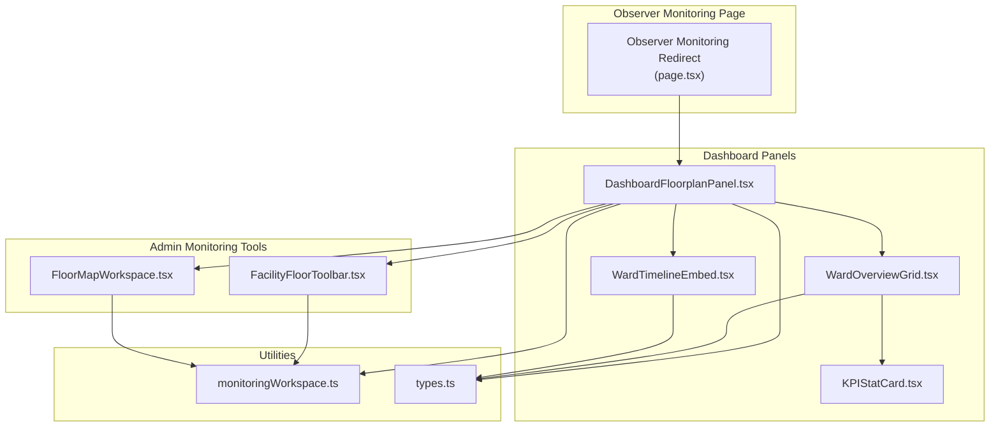
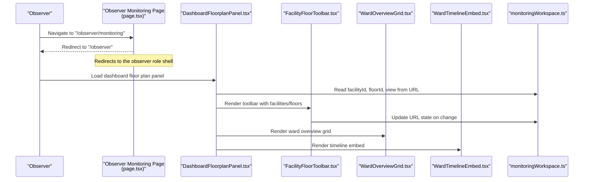
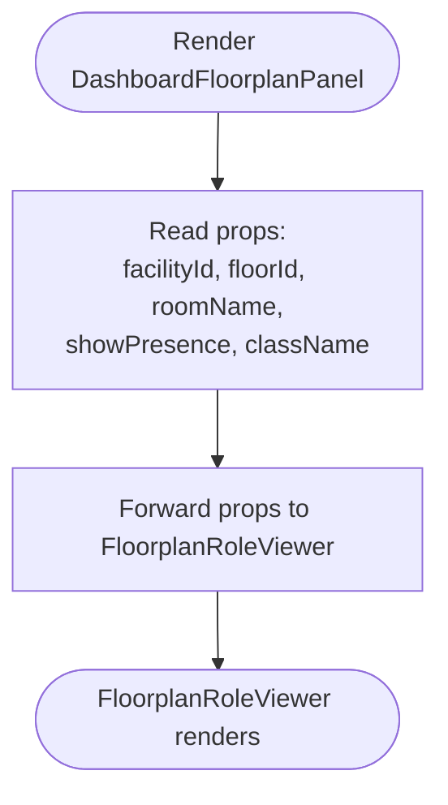
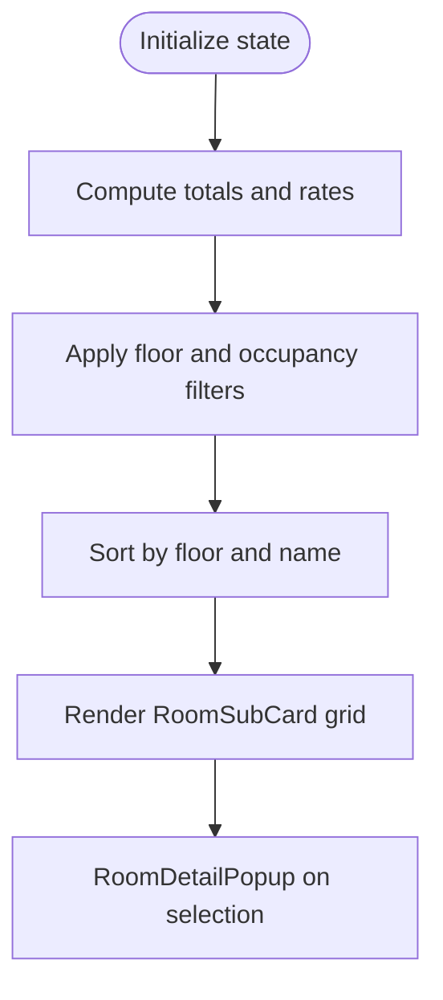
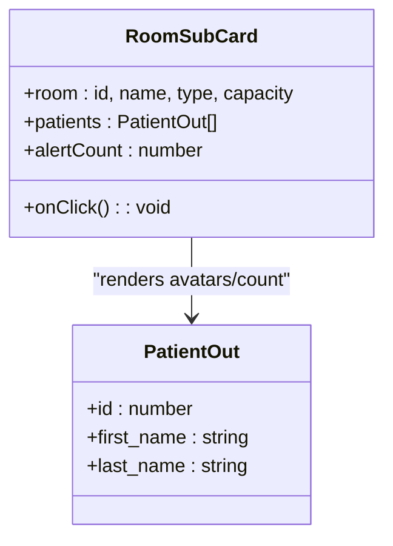
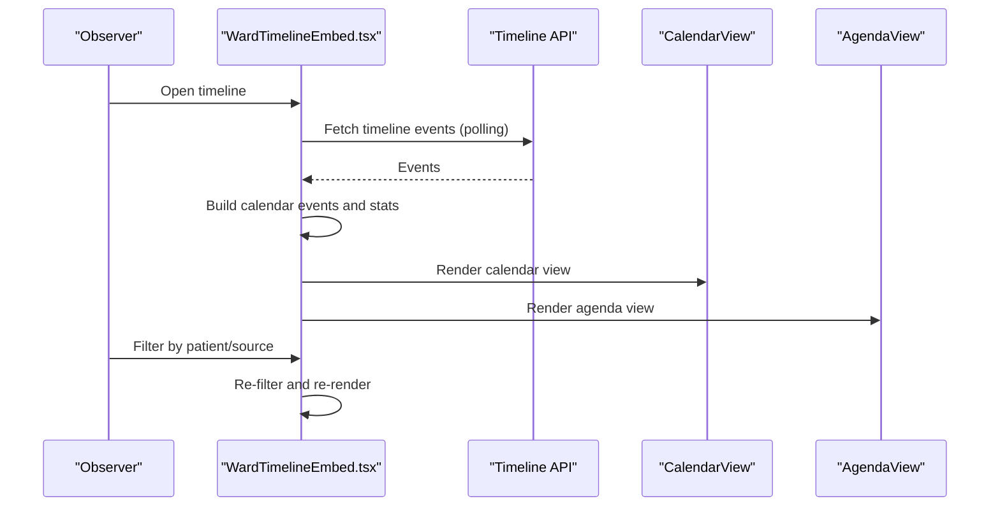
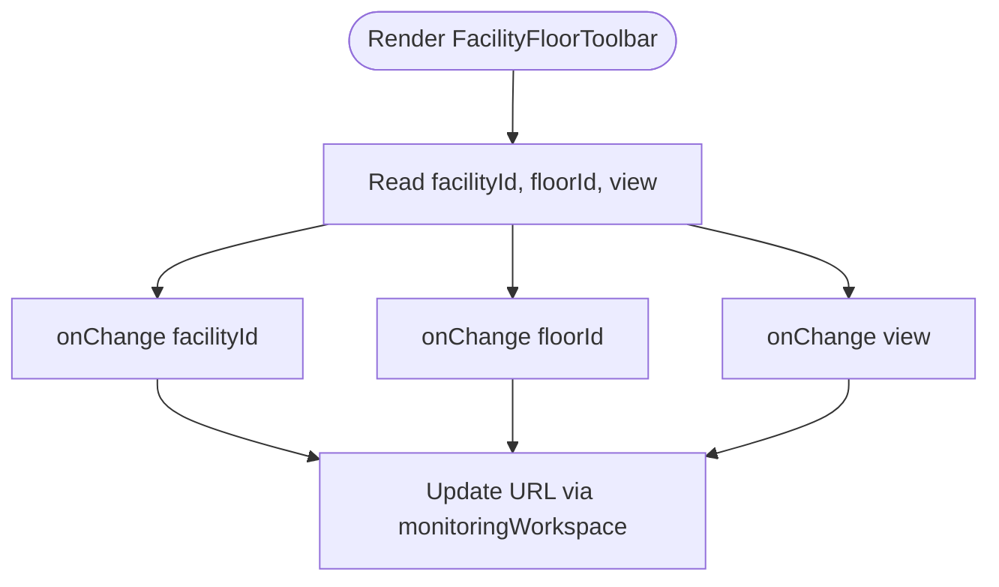
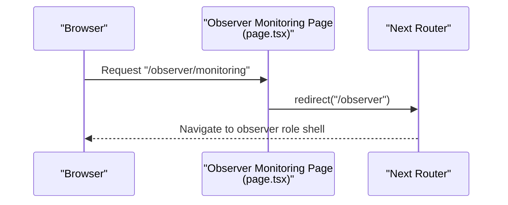
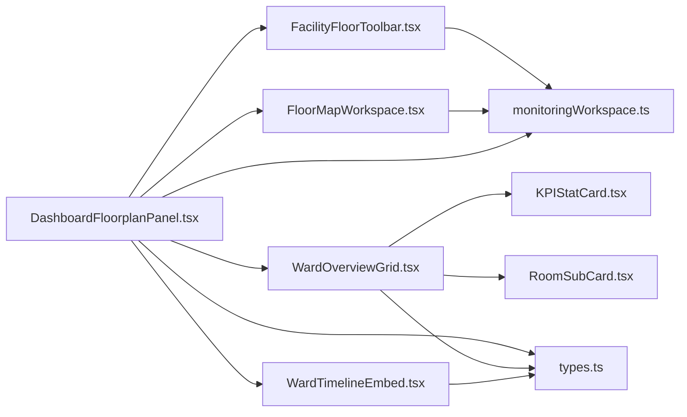

# Clinical Monitoring Dashboard

<cite>
**Referenced Files in This Document**
- [DashboardFloorplanPanel.tsx](file://frontend/components/dashboard/DashboardFloorplanPanel.tsx)
- [FacilityFloorToolbar.tsx](file://frontend/components/admin/monitoring/FacilityFloorToolbar.tsx)
- [FloorMapWorkspace.tsx](file://frontend/components/admin/monitoring/FloorMapWorkspace.tsx)
- [WardOverviewGrid.tsx](file://frontend/components/dashboard/WardOverviewGrid.tsx)
- [RoomSubCard.tsx](file://frontend/components/dashboard/RoomSubCard.tsx)
- [KPIStatCard.tsx](file://frontend/components/dashboard/KPIStatCard.tsx)
- [WardTimelineEmbed.tsx](file://frontend/components/timeline/WardTimelineEmbed.tsx)
- [monitoringWorkspace.ts](file://frontend/lib/monitoringWorkspace.ts)
- [types.ts](file://frontend/lib/types.ts)
- [page.tsx](file://frontend/app/observer/monitoring/page.tsx)
</cite>

## Table of Contents
1. [Introduction](#introduction)
2. [Project Structure](#project-structure)
3. [Core Components](#core-components)
4. [Architecture Overview](#architecture-overview)
5. [Detailed Component Analysis](#detailed-component-analysis)
6. [Dependency Analysis](#dependency-analysis)
7. [Performance Considerations](#performance-considerations)
8. [Troubleshooting Guide](#troubleshooting-guide)
9. [Conclusion](#conclusion)
10. [Appendices](#appendices)

## Introduction
This document describes the Observer Clinical Monitoring Dashboard within the WheelSense Platform. It focuses on the comprehensive monitoring interface for observing and managing patient care across facilities and wards. The dashboard integrates:
- Real-time presence and floor plan visualization
- Ward overview with occupancy and alert statistics
- Timeline visualization of recent activities across the ward
- Quick-access controls for facility and floor selection, and view modes

It also documents the DashboardFloorplanPanel implementation, which serves as a lightweight wrapper around the floor plan role viewer, enabling observers to quickly navigate and focus on relevant areas.

## Project Structure
The monitoring dashboard is composed of several frontend components and utilities:
- DashboardFloorplanPanel: a thin wrapper around the floor plan role viewer
- Ward overview grid: presents rooms, occupancy, and alert counts
- Timeline embed: shows recent ward activities in calendar/agenda views
- Monitoring workspace utilities: manage URL state for facility, floor, room, and view mode
- Types: shared type definitions for devices, vitals, and other domain entities



**Diagram sources**
- [page.tsx:1-6](file://frontend/app/observer/monitoring/page.tsx#L1-L6)
- [DashboardFloorplanPanel.tsx:1-30](file://frontend/components/dashboard/DashboardFloorplanPanel.tsx#L1-L30)
- [WardOverviewGrid.tsx:1-269](file://frontend/components/dashboard/WardOverviewGrid.tsx#L1-L269)
- [KPIStatCard.tsx:1-104](file://frontend/components/dashboard/KPIStatCard.tsx#L1-L104)
- [WardTimelineEmbed.tsx:1-225](file://frontend/components/timeline/WardTimelineEmbed.tsx#L1-L225)
- [FacilityFloorToolbar.tsx:1-118](file://frontend/components/admin/monitoring/FacilityFloorToolbar.tsx#L1-L118)
- [FloorMapWorkspace.tsx:1-734](file://frontend/components/admin/monitoring/FloorMapWorkspace.tsx#L1-L734)
- [monitoringWorkspace.ts:1-146](file://frontend/lib/monitoringWorkspace.ts#L1-L146)
- [types.ts:1-200](file://frontend/lib/types.ts#L1-L200)

**Section sources**
- [DashboardFloorplanPanel.tsx:1-30](file://frontend/components/dashboard/DashboardFloorplanPanel.tsx#L1-L30)
- [WardOverviewGrid.tsx:1-269](file://frontend/components/dashboard/WardOverviewGrid.tsx#L1-L269)
- [WardTimelineEmbed.tsx:1-225](file://frontend/components/timeline/WardTimelineEmbed.tsx#L1-L225)
- [monitoringWorkspace.ts:1-146](file://frontend/lib/monitoringWorkspace.ts#L1-L146)
- [types.ts:1-200](file://frontend/lib/types.ts#L1-L200)
- [page.tsx:1-6](file://frontend/app/observer/monitoring/page.tsx#L1-L6)

## Core Components
- DashboardFloorplanPanel: Provides a role-aware floor plan viewer with optional presence indicators and initial selection parameters.
- WardOverviewGrid: Displays rooms as cards with occupancy, patient avatars, and alert counts; supports filtering by floor and occupancy; shows summary KPIs.
- KPIStatCard: Renders key metrics with optional trend indicators and status coloring.
- WardTimelineEmbed: Presents a calendar/agenda view of recent timeline events across the ward, with filtering by patient and source.
- FacilityFloorToolbar: Allows selecting facility and floor, and toggling between list and map view modes.
- FloorMapWorkspace: Admin-level floor plan editor with device assignment, room provisioning, and save operations.
- monitoringWorkspace utilities: Parse and build monitoring URL state; legacy tab redirects; convert floor plan room ids.
- Types: Shared domain types for devices, vitals, and real-time snapshots.

**Section sources**
- [DashboardFloorplanPanel.tsx:1-30](file://frontend/components/dashboard/DashboardFloorplanPanel.tsx#L1-L30)
- [WardOverviewGrid.tsx:1-269](file://frontend/components/dashboard/WardOverviewGrid.tsx#L1-L269)
- [KPIStatCard.tsx:1-104](file://frontend/components/dashboard/KPIStatCard.tsx#L1-L104)
- [WardTimelineEmbed.tsx:1-225](file://frontend/components/timeline/WardTimelineEmbed.tsx#L1-L225)
- [FacilityFloorToolbar.tsx:1-118](file://frontend/components/admin/monitoring/FacilityFloorToolbar.tsx#L1-L118)
- [FloorMapWorkspace.tsx:1-734](file://frontend/components/admin/monitoring/FloorMapWorkspace.tsx#L1-L734)
- [monitoringWorkspace.ts:1-146](file://frontend/lib/monitoringWorkspace.ts#L1-L146)
- [types.ts:92-200](file://frontend/lib/types.ts#L92-L200)

## Architecture Overview
The monitoring dashboard is driven by URL state managed via monitoringWorkspace utilities. The observer navigates to the monitoring page, which delegates to the floor plan panel. From there, toolbar and grid/timeline components render the current view. Admin-level floor map editing is available separately.



**Diagram sources**
- [page.tsx:1-6](file://frontend/app/observer/monitoring/page.tsx#L1-L6)
- [DashboardFloorplanPanel.tsx:1-30](file://frontend/components/dashboard/DashboardFloorplanPanel.tsx#L1-L30)
- [FacilityFloorToolbar.tsx:1-118](file://frontend/components/admin/monitoring/FacilityFloorToolbar.tsx#L1-L118)
- [WardOverviewGrid.tsx:1-269](file://frontend/components/dashboard/WardOverviewGrid.tsx#L1-L269)
- [WardTimelineEmbed.tsx:1-225](file://frontend/components/timeline/WardTimelineEmbed.tsx#L1-L225)
- [monitoringWorkspace.ts:1-146](file://frontend/lib/monitoringWorkspace.ts#L1-L146)

## Detailed Component Analysis

### DashboardFloorplanPanel
- Purpose: Thin wrapper around the floor plan role viewer, forwarding props for facility, floor, and room selection and presence visibility.
- Behavior: Delegates rendering to FloorplanRoleViewer with provided parameters.
- Integration: Works with monitoringWorkspace utilities to maintain URL state for facility, floor, and view mode.



**Diagram sources**
- [DashboardFloorplanPanel.tsx:1-30](file://frontend/components/dashboard/DashboardFloorplanPanel.tsx#L1-L30)

**Section sources**
- [DashboardFloorplanPanel.tsx:1-30](file://frontend/components/dashboard/DashboardFloorplanPanel.tsx#L1-L30)

### WardOverviewGrid
- Purpose: Present an overview of rooms with occupancy, patient avatars, and alert counts.
- Features:
  - Summary KPIs: total patients, total rooms, occupancy rate, active alerts.
  - Filtering: by floor and occupancy status.
  - View modes: grid and compact.
  - Room detail popup on selection.
- Data model: Expects an array of rooms with associated patient lists and alert counts.



**Diagram sources**
- [WardOverviewGrid.tsx:1-269](file://frontend/components/dashboard/WardOverviewGrid.tsx#L1-L269)

**Section sources**
- [WardOverviewGrid.tsx:1-269](file://frontend/components/dashboard/WardOverviewGrid.tsx#L1-L269)
- [RoomSubCard.tsx:1-138](file://frontend/components/dashboard/RoomSubCard.tsx#L1-L138)

### RoomSubCard
- Purpose: Individual room tile within WardOverviewGrid.
- Features:
  - Occupancy status with color-coded badges.
  - Patient avatars or count badge for up to three patients.
  - Alert indicator when present.
- Status logic: available (0), occupied (0 < count < capacity), full (count >= capacity).



**Diagram sources**
- [RoomSubCard.tsx:1-138](file://frontend/components/dashboard/RoomSubCard.tsx#L1-L138)

**Section sources**
- [RoomSubCard.tsx:1-138](file://frontend/components/dashboard/RoomSubCard.tsx#L1-L138)

### KPIStatCard
- Purpose: Display key metrics with optional trend and status.
- Features:
  - Value and label.
  - Trend indicator with direction and percentage.
  - Status color coding (good, warning, critical, neutral).
  - Optional click handler.

```mermaid
classDiagram
class KPIStatCard {
+value : string|number
+label : string
+trend : {value, direction, label}
+icon : LucideIcon
+status : "good|warning|critical|neutral"
+onClick() : void
}
```

**Diagram sources**
- [KPIStatCard.tsx:1-104](file://frontend/components/dashboard/KPIStatCard.tsx#L1-L104)

**Section sources**
- [KPIStatCard.tsx:1-104](file://frontend/components/dashboard/KPIStatCard.tsx#L1-L104)

### WardTimelineEmbed
- Purpose: Visualize recent ward activities in calendar and agenda views.
- Features:
  - Calendar view with day/week/month modes.
  - Agenda view for recent activity.
  - Filters: by patient and source.
  - Statistics: total events, events today, distinct sources.
  - Auto-refresh via polling.



**Diagram sources**
- [WardTimelineEmbed.tsx:1-225](file://frontend/components/timeline/WardTimelineEmbed.tsx#L1-L225)

**Section sources**
- [WardTimelineEmbed.tsx:1-225](file://frontend/components/timeline/WardTimelineEmbed.tsx#L1-L225)

### FacilityFloorToolbar and FloorMapWorkspace
- Purpose: Provide facility and floor selection and toggle between list and map view modes. FloorMapWorkspace enables administrative editing of floor plan layouts and device assignments.
- Integration: Both components rely on monitoringWorkspace utilities to parse and update URL state.



**Diagram sources**
- [FacilityFloorToolbar.tsx:1-118](file://frontend/components/admin/monitoring/FacilityFloorToolbar.tsx#L1-L118)
- [monitoringWorkspace.ts:1-146](file://frontend/lib/monitoringWorkspace.ts#L1-L146)

**Section sources**
- [FacilityFloorToolbar.tsx:1-118](file://frontend/components/admin/monitoring/FacilityFloorToolbar.tsx#L1-L118)
- [FloorMapWorkspace.tsx:1-734](file://frontend/components/admin/monitoring/FloorMapWorkspace.tsx#L1-L734)
- [monitoringWorkspace.ts:1-146](file://frontend/lib/monitoringWorkspace.ts#L1-L146)

### Observer Monitoring Redirect
- Purpose: Redirects the observer monitoring route to the observer role shell.



**Diagram sources**
- [page.tsx:1-6](file://frontend/app/observer/monitoring/page.tsx#L1-L6)

**Section sources**
- [page.tsx:1-6](file://frontend/app/observer/monitoring/page.tsx#L1-L6)

## Dependency Analysis
- DashboardFloorplanPanel depends on FloorplanRoleViewer and monitoringWorkspace for URL state.
- WardOverviewGrid depends on RoomSubCard and KPIStatCard for rendering room tiles and summary cards.
- WardTimelineEmbed depends on timeline APIs and calendar/agenda components.
- FacilityFloorToolbar and FloorMapWorkspace depend on monitoringWorkspace for URL state and device/patient APIs for editing.



**Diagram sources**
- [DashboardFloorplanPanel.tsx:1-30](file://frontend/components/dashboard/DashboardFloorplanPanel.tsx#L1-L30)
- [FacilityFloorToolbar.tsx:1-118](file://frontend/components/admin/monitoring/FacilityFloorToolbar.tsx#L1-L118)
- [FloorMapWorkspace.tsx:1-734](file://frontend/components/admin/monitoring/FloorMapWorkspace.tsx#L1-L734)
- [WardOverviewGrid.tsx:1-269](file://frontend/components/dashboard/WardOverviewGrid.tsx#L1-L269)
- [RoomSubCard.tsx:1-138](file://frontend/components/dashboard/RoomSubCard.tsx#L1-L138)
- [KPIStatCard.tsx:1-104](file://frontend/components/dashboard/KPIStatCard.tsx#L1-L104)
- [WardTimelineEmbed.tsx:1-225](file://frontend/components/timeline/WardTimelineEmbed.tsx#L1-L225)
- [monitoringWorkspace.ts:1-146](file://frontend/lib/monitoringWorkspace.ts#L1-L146)
- [types.ts:1-200](file://frontend/lib/types.ts#L1-L200)

**Section sources**
- [DashboardFloorplanPanel.tsx:1-30](file://frontend/components/dashboard/DashboardFloorplanPanel.tsx#L1-L30)
- [WardOverviewGrid.tsx:1-269](file://frontend/components/dashboard/WardOverviewGrid.tsx#L1-L269)
- [WardTimelineEmbed.tsx:1-225](file://frontend/components/timeline/WardTimelineEmbed.tsx#L1-L225)
- [monitoringWorkspace.ts:1-146](file://frontend/lib/monitoringWorkspace.ts#L1-L146)
- [types.ts:1-200](file://frontend/lib/types.ts#L1-L200)

## Performance Considerations
- Polling intervals: Timeline embed polls for updates at a fixed interval; adjust intervals based on load and responsiveness needs.
- Query caching: React Query is used for timeline and patient lists; ensure appropriate stale and refetch intervals to balance freshness and performance.
- Rendering: WardOverviewGrid computes stats and filters on the client; keep datasets sized appropriately to avoid heavy computations.
- Canvas operations: FloorMapWorkspace performs layout normalization and device alignment; ensure large floor plans are optimized for rendering.

[No sources needed since this section provides general guidance]

## Troubleshooting Guide
- Timeline not updating:
  - Verify polling is enabled and network requests succeed.
  - Check console for API errors and ensure cache scope is correct.
- Floor plan layout issues:
  - Confirm facility and floor selection is valid.
  - After saving, refresh queries to reflect changes.
- URL state inconsistencies:
  - Use monitoringWorkspace parsing and building functions to ensure consistent URL parameters.
- Device assignment problems:
  - Ensure device categories and search terms match registry entries.
  - Confirm room provisioning and node device alignment steps complete successfully.

**Section sources**
- [WardTimelineEmbed.tsx:1-225](file://frontend/components/timeline/WardTimelineEmbed.tsx#L1-L225)
- [FloorMapWorkspace.tsx:1-734](file://frontend/components/admin/monitoring/FloorMapWorkspace.tsx#L1-L734)
- [monitoringWorkspace.ts:1-146](file://frontend/lib/monitoringWorkspace.ts#L1-L146)

## Conclusion
The Observer Clinical Monitoring Dashboard integrates floor plan visualization, ward overview, and timeline activity into a cohesive monitoring interface. DashboardFloorplanPanel provides a streamlined entry point, while WardOverviewGrid and WardTimelineEmbed deliver actionable insights. Administrative tools like FacilityFloorToolbar and FloorMapWorkspace support operational maintenance. The monitoringWorkspace utilities ensure consistent navigation and state management across roles.

[No sources needed since this section summarizes without analyzing specific files]

## Appendices

### Monitoring Workflows and Data Interpretation
- Monitoring workflow:
  - Select facility and floor via toolbar.
  - Switch between list and map view modes.
  - Review occupancy and alert summaries in WardOverviewGrid.
  - Inspect recent activities in WardTimelineEmbed.
- Data interpretation:
  - Occupancy rate thresholds can guide resource allocation.
  - Active alerts highlight urgent situations requiring immediate attention.
  - Timeline filters enable focused analysis by patient or source.

[No sources needed since this section provides general guidance]

### Trend Analysis Techniques
- Occupancy trends:
  - Track occupancy rate changes over time to anticipate bed availability.
- Alert trends:
  - Monitor alert counts to identify recurring issues or improvements.
- Timeline trends:
  - Analyze event frequency and sources to detect patterns in care delivery.

[No sources needed since this section provides general guidance]

### Integration with Alert Systems
- Alert indicators in RoomSubCard signal active alerts per room.
- Timeline embed aggregates events by source, aiding attribution to alert triggers.
- Administrative floor map editing allows linking rooms to devices, supporting precise alert routing.

**Section sources**
- [RoomSubCard.tsx:1-138](file://frontend/components/dashboard/RoomSubCard.tsx#L1-L138)
- [WardTimelineEmbed.tsx:1-225](file://frontend/components/timeline/WardTimelineEmbed.tsx#L1-L225)
- [FloorMapWorkspace.tsx:1-734](file://frontend/components/admin/monitoring/FloorMapWorkspace.tsx#L1-L734)