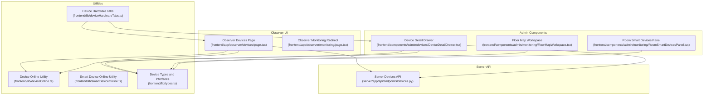
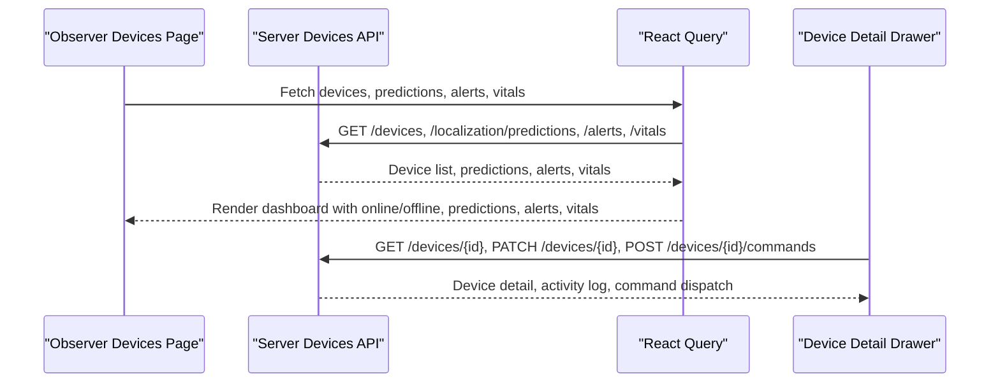
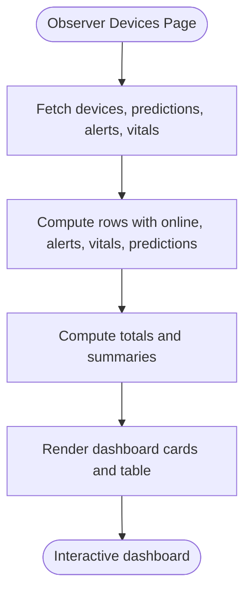
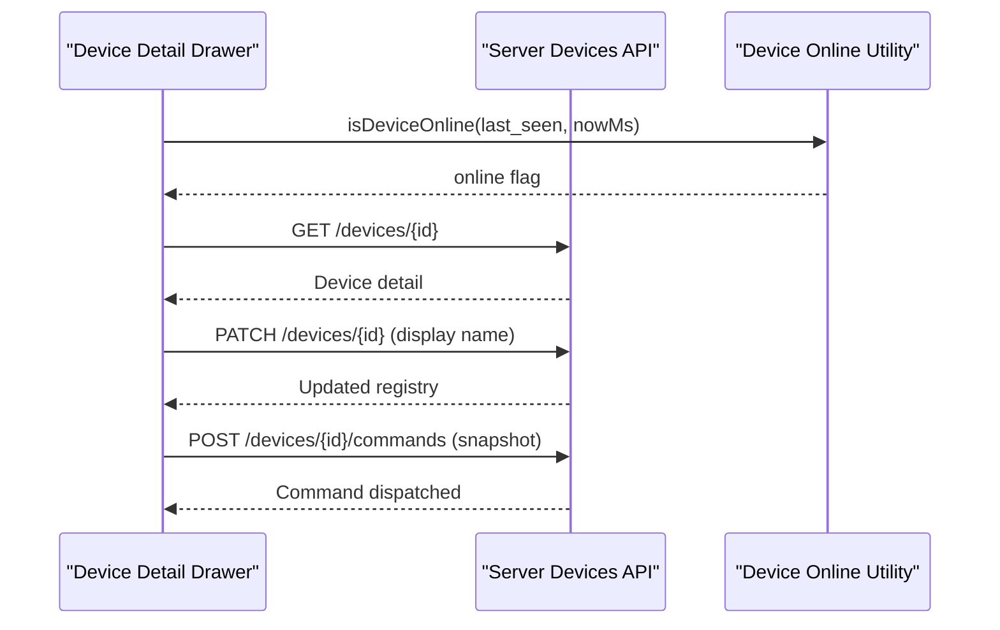
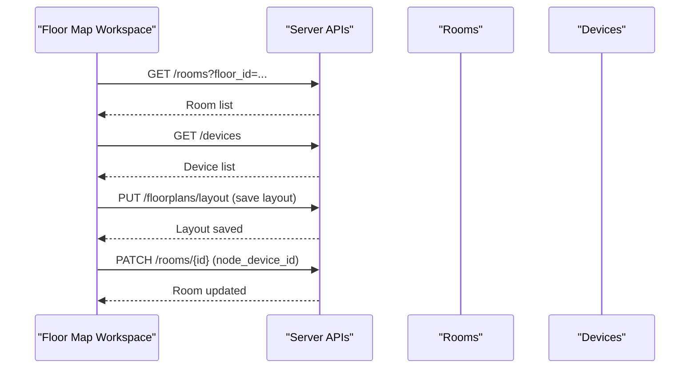
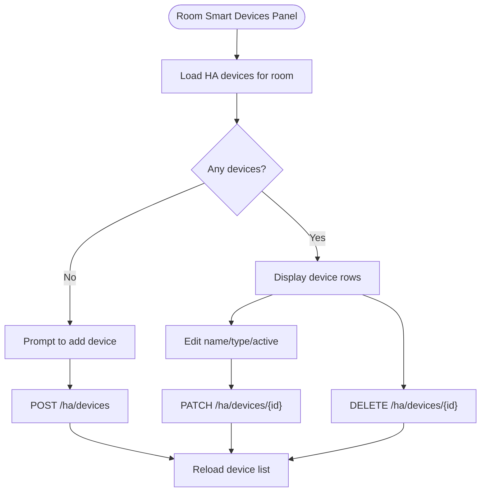
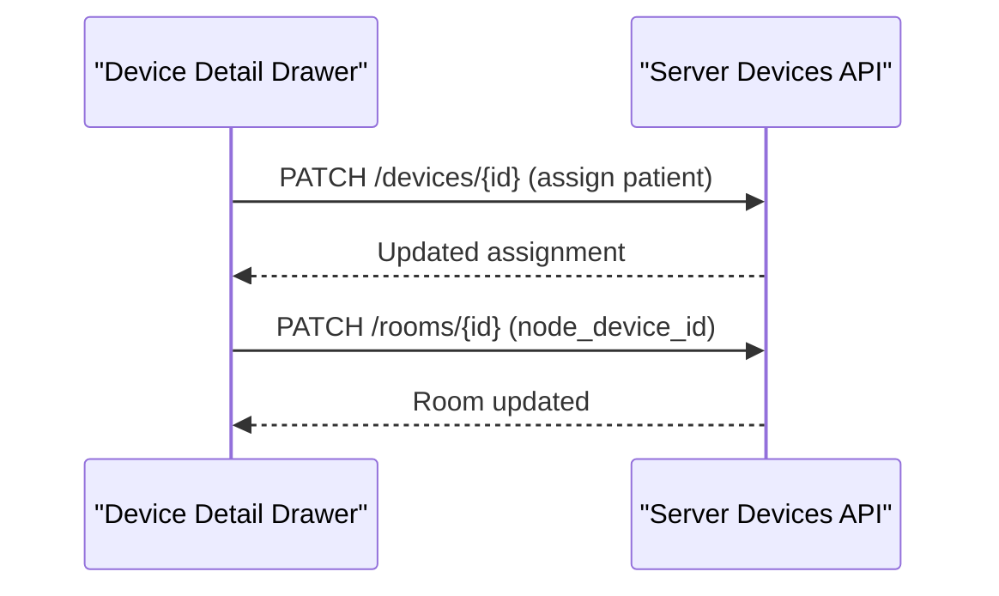
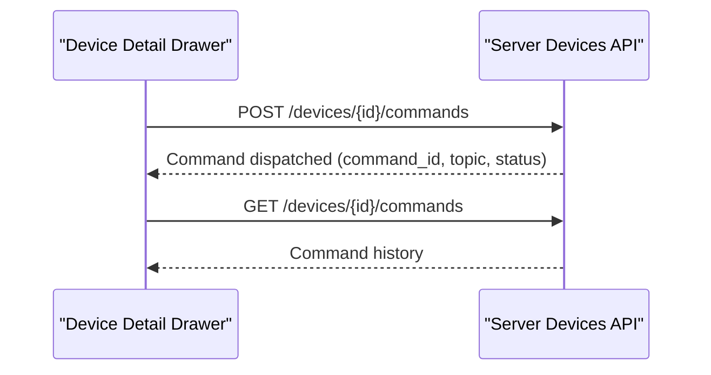
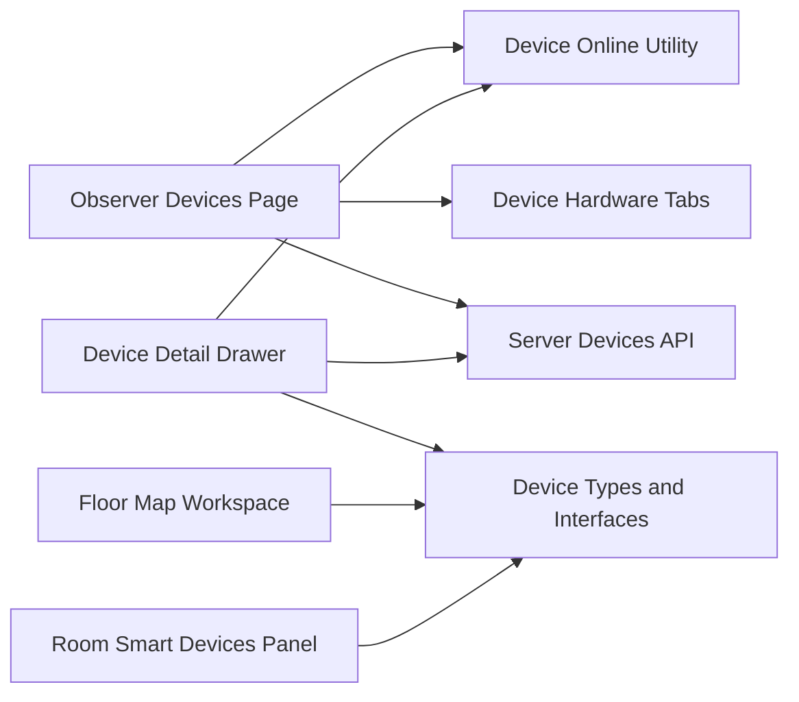

# Device Monitoring

<cite>
**Referenced Files in This Document**
- [Observer Devices Page](file://frontend/app/observer/devices/page.tsx)
- [Observer Monitoring Redirect](file://frontend/app/observer/monitoring/page.tsx)
- [Device Detail Drawer](file://frontend/components/admin/devices/DeviceDetailDrawer.tsx)
- [Floor Map Workspace](file://frontend/components/admin/monitoring/FloorMapWorkspace.tsx)
- [Room Smart Devices Panel](file://frontend/components/admin/monitoring/RoomSmartDevicesPanel.tsx)
- [Device Online Utility](file://frontend/lib/deviceOnline.ts)
- [Smart Device Online Utility](file://frontend/lib/smartDeviceOnline.ts)
- [Device Hardware Tabs](file://frontend/lib/deviceHardwareTabs.ts)
- [Device Types and Interfaces](file://frontend/lib/types.ts)
- [Server Devices API](file://server/app/api/endpoints/devices.py)
- [ADR: Fleet Control Plane](file://docs/adr/0010-phase2-device-fleet-control-plane.md)
</cite>

## Table of Contents
1. [Introduction](#introduction)
2. [Project Structure](#project-structure)
3. [Core Components](#core-components)
4. [Architecture Overview](#architecture-overview)
5. [Detailed Component Analysis](#detailed-component-analysis)
6. [Dependency Analysis](#dependency-analysis)
7. [Performance Considerations](#performance-considerations)
8. [Troubleshooting Guide](#troubleshooting-guide)
9. [Conclusion](#conclusion)
10. [Appendices](#appendices)

## Introduction
This document describes the Observer Device Monitoring interface in the WheelSense Platform. It covers device status monitoring, telemetry visualization, device health tracking, and device command execution capabilities. It also explains the device monitoring dashboard, device registration status, connectivity indicators, telemetry data display, and device-specific controls. The document outlines supported device types, device assignment workflows, troubleshooting procedures, and integration with the broader monitoring ecosystem. Examples of monitoring scenarios, status interpretation, alert correlation, and maintenance scheduling integration are included.

## Project Structure
The Observer Device Monitoring interface spans frontend pages, components, and utilities, and integrates with backend APIs for device data, commands, and activity logs. The key areas are:
- Observer dashboard page for fleet visibility
- Device detail drawer for granular device inspection and actions
- Floor map workspace for room-to-device mapping and assignments
- Smart devices panel for Home Assistant integrations
- Utilities for online detection and device categorization
- Backend endpoints for device commands and registry operations

**Diagram sources**
- [Observer Devices Page:55-258](file://frontend/app/observer/devices/page.tsx#L55-L258)
- [Observer Monitoring Redirect:1-6](file://frontend/app/observer/monitoring/page.tsx#L1-L6)
- [Device Detail Drawer:286-640](file://frontend/components/admin/devices/DeviceDetailDrawer.tsx#L286-L640)
- [Floor Map Workspace:77-734](file://frontend/components/admin/monitoring/FloorMapWorkspace.tsx#L77-L734)
- [Room Smart Devices Panel:16-174](file://frontend/components/admin/monitoring/RoomSmartDevicesPanel.tsx#L16-L174)
- [Device Online Utility:1-8](file://frontend/lib/deviceOnline.ts#L1-L8)
- [Smart Device Online Utility:1-11](file://frontend/lib/smartDeviceOnline.ts#L1-L11)
- [Device Hardware Tabs:1-73](file://frontend/lib/deviceHardwareTabs.ts#L1-L73)
- [Device Types and Interfaces:92-205](file://frontend/lib/types.ts#L92-L205)
- [Server Devices API:90-263](file://server/app/api/endpoints/devices.py#L90-L263)

**Section sources**
- [Observer Devices Page:55-258](file://frontend/app/observer/devices/page.tsx#L55-L258)
- [Observer Monitoring Redirect:1-6](file://frontend/app/observer/monitoring/page.tsx#L1-L6)
- [Device Detail Drawer:286-640](file://frontend/components/admin/devices/DeviceDetailDrawer.tsx#L286-L640)
- [Floor Map Workspace:77-734](file://frontend/components/admin/monitoring/FloorMapWorkspace.tsx#L77-L734)
- [Room Smart Devices Panel:16-174](file://frontend/components/admin/monitoring/RoomSmartDevicesPanel.tsx#L16-L174)
- [Device Online Utility:1-8](file://frontend/lib/deviceOnline.ts#L1-L8)
- [Smart Device Online Utility:1-11](file://frontend/lib/smartDeviceOnline.ts#L1-L11)
- [Device Hardware Tabs:1-73](file://frontend/lib/deviceHardwareTabs.ts#L1-L73)
- [Device Types and Interfaces:92-205](file://frontend/lib/types.ts#L92-L205)
- [Server Devices API:90-263](file://server/app/api/endpoints/devices.py#L90-L263)

## Core Components
- Observer Devices Page: Presents a fleet dashboard with device registration status, connectivity indicators, localization predictions, alerts, and telemetry. It computes online/offline status, high-confidence predictions, and aggregates summary statistics.
- Device Detail Drawer: Provides device identity, health snapshot, real-time metrics (when applicable), and assignment controls for patients and rooms. Supports snapshot requests and registry updates.
- Floor Map Workspace: Allows administrators to map rooms to node devices, assign patients to rooms, and manage room properties. Integrates with device registry and room data.
- Room Smart Devices Panel: Manages Home Assistant device mappings per room, enabling visibility and control of smart devices integrated into the monitoring ecosystem.
- Utilities: Determine device online status and categorize devices by hardware type for filtering and presentation.
- Server Devices API: Exposes endpoints for listing devices, retrieving device details, sending commands, and managing registry entries.

**Section sources**
- [Observer Devices Page:55-258](file://frontend/app/observer/devices/page.tsx#L55-L258)
- [Device Detail Drawer:286-640](file://frontend/components/admin/devices/DeviceDetailDrawer.tsx#L286-L640)
- [Floor Map Workspace:77-734](file://frontend/components/admin/monitoring/FloorMapWorkspace.tsx#L77-L734)
- [Room Smart Devices Panel:16-174](file://frontend/components/admin/monitoring/RoomSmartDevicesPanel.tsx#L16-L174)
- [Device Online Utility:1-8](file://frontend/lib/deviceOnline.ts#L1-L8)
- [Device Hardware Tabs:1-73](file://frontend/lib/deviceHardwareTabs.ts#L1-L73)
- [Server Devices API:90-263](file://server/app/api/endpoints/devices.py#L90-L263)

## Architecture Overview
The Observer Device Monitoring interface follows a React Query-driven data fetching pattern with server endpoints. The Observer dashboard aggregates device lists, localization predictions, alerts, and vitals to render a comprehensive fleet view. Device-specific actions (e.g., snapshots, registry edits) are handled via the Device Detail Drawer. Administrators use the Floor Map Workspace to connect rooms and node devices and assign patients. Smart devices are managed via the Room Smart Devices Panel. The server exposes device command dispatch and registry operations.

**Diagram sources**
- [Observer Devices Page:59-95](file://frontend/app/observer/devices/page.tsx#L59-L95)
- [Server Devices API:90-263](file://server/app/api/endpoints/devices.py#L90-L263)
- [Device Detail Drawer:299-331](file://frontend/components/admin/devices/DeviceDetailDrawer.tsx#L299-L331)

**Section sources**
- [Observer Devices Page:59-95](file://frontend/app/observer/devices/page.tsx#L59-L95)
- [Server Devices API:90-263](file://server/app/api/endpoints/devices.py#L90-L263)
- [Device Detail Drawer:299-331](file://frontend/components/admin/devices/DeviceDetailDrawer.tsx#L299-L331)

## Detailed Component Analysis

### Observer Devices Dashboard
The Observer Devices Page renders a responsive dashboard summarizing device fleet health:
- Device registration status: Displays total devices, online, offline, and high-confidence localization predictions.
- Connectivity indicators: Uses a fixed window to mark devices as online/offline.
- Telemetry visualization: Shows latest heart rate and battery level per device.
- Alerts correlation: Counts active alerts per device.
- Localization predictions: Displays predicted room and confidence.

**Diagram sources**
- [Observer Devices Page:55-158](file://frontend/app/observer/devices/page.tsx#L55-L158)

**Section sources**
- [Observer Devices Page:55-158](file://frontend/app/observer/devices/page.tsx#L55-L158)
- [Device Online Utility:1-8](file://frontend/lib/deviceOnline.ts#L1-L8)

### Device Detail Drawer
The Device Detail Drawer provides:
- Identity and connectivity: Device ID, hardware type, last seen, and online status.
- Health snapshot: Status derived from online state and battery thresholds.
- Real-time metrics: Wheelchair metrics (velocity, acceleration, distance), Polar vitals, and mobile metrics.
- Assignments: Patient assignment/unlink and room assignment/unlink for node devices.
- Actions: Camera snapshot request and registry updates (display name).
- Activity: Recent device activity events.

**Diagram sources**
- [Device Detail Drawer:286-640](file://frontend/components/admin/devices/DeviceDetailDrawer.tsx#L286-L640)
- [Device Online Utility:1-8](file://frontend/lib/deviceOnline.ts#L1-L8)
- [Server Devices API:241-263](file://server/app/api/endpoints/devices.py#L241-L263)

**Section sources**
- [Device Detail Drawer:286-640](file://frontend/components/admin/devices/DeviceDetailDrawer.tsx#L286-L640)
- [Device Online Utility:1-8](file://frontend/lib/deviceOnline.ts#L1-L8)
- [Server Devices API:241-263](file://server/app/api/endpoints/devices.py#L241-L263)

### Floor Map Workspace
The Floor Map Workspace enables:
- Room-to-node device mapping: Select device categories and search to link rooms to node devices.
- Patient assignment: Assign patients to selected rooms during assignment mode.
- Room properties: Manage labels, power consumption, and remove rooms.
- Save operation: Persist layout and node-device links, with feedback on partial or unmapped links.

**Diagram sources**
- [Floor Map Workspace:118-441](file://frontend/components/admin/monitoring/FloorMapWorkspace.tsx#L118-L441)
- [Device Types and Interfaces:209-224](file://frontend/lib/types.ts#L209-L224)

**Section sources**
- [Floor Map Workspace:118-441](file://frontend/components/admin/monitoring/FloorMapWorkspace.tsx#L118-L441)
- [Device Types and Interfaces:209-224](file://frontend/lib/types.ts#L209-L224)

### Room Smart Devices Panel
The Room Smart Devices Panel manages Home Assistant integrations:
- Load smart devices for a selected room.
- Add new smart device mappings with name, entity ID, type, and activation.
- Update or delete mappings with immediate feedback.
- Toggle active state for device presence in monitoring.

**Diagram sources**
- [Room Smart Devices Panel:16-174](file://frontend/components/admin/monitoring/RoomSmartDevicesPanel.tsx#L16-L174)

**Section sources**
- [Room Smart Devices Panel:16-174](file://frontend/components/admin/monitoring/RoomSmartDevicesPanel.tsx#L16-L174)

### Device Types Supported by Observers
Supported hardware types include:
- Wheelchair: Wheelchair-mounted sensors with real-time metrics.
- Node: BLE/RF node devices used for localization.
- Polar Sense: Heart rate and vitals device (including mobile Polar SDK streams).
- Mobile Phone: Mobile device acting as a sensor or bridge.

These types are used for filtering, presentation, and telemetry categorization.

**Section sources**
- [Device Hardware Tabs:5-11](file://frontend/lib/deviceHardwareTabs.ts#L5-L11)
- [Device Types and Interfaces:94-98](file://frontend/lib/types.ts#L94-L98)

### Device Assignment Workflows
- Patient assignment/unlink: From the Device Detail Drawer, assign or unlink a patient to a device with a default device role inferred from hardware type.
- Room assignment/unlink: For node devices, assign or unlink a room by updating the room’s node device key.
- Floor map assignment: In Floor Map Workspace, select a device category and search to link rooms to node devices; toggle assignment mode to assign patients to rooms.

**Diagram sources**
- [Device Detail Drawer:487-563](file://frontend/components/admin/devices/DeviceDetailDrawer.tsx#L487-L563)
- [Server Devices API:224-239](file://server/app/api/endpoints/devices.py#L224-L239)

**Section sources**
- [Device Detail Drawer:487-563](file://frontend/components/admin/devices/DeviceDetailDrawer.tsx#L487-L563)
- [Server Devices API:224-239](file://server/app/api/endpoints/devices.py#L224-L239)

### Device Command Execution
The platform supports device command dispatch:
- Listing commands: Retrieve command history for a device.
- Sending commands: Dispatch a command with channel/topic and payload; server logs the event and returns dispatch metadata.

**Diagram sources**
- [Server Devices API:90-123](file://server/app/api/endpoints/devices.py#L90-L123)
- [Server Devices API:241-263](file://server/app/api/endpoints/devices.py#L241-L263)

**Section sources**
- [Server Devices API:90-123](file://server/app/api/endpoints/devices.py#L90-L123)
- [Server Devices API:241-263](file://server/app/api/endpoints/devices.py#L241-L263)

### Integration with Broader Monitoring Ecosystem
- Home Assistant integration: Smart devices are mapped per room and toggled active/inactive for monitoring.
- Floor plan and room mapping: Node devices are linked to rooms to enable localization and occupancy insights.
- Activity logging: Device and registry actions are logged for auditability.

**Section sources**
- [Room Smart Devices Panel:16-174](file://frontend/components/admin/monitoring/RoomSmartDevicesPanel.tsx#L16-L174)
- [Floor Map Workspace:355-441](file://frontend/components/admin/monitoring/FloorMapWorkspace.tsx#L355-L441)
- [Server Devices API:224-239](file://server/app/api/endpoints/devices.py#L224-L239)

## Dependency Analysis
The Observer Devices Dashboard depends on:
- Device Online Utility for connectivity determination.
- Device Hardware Tabs for filtering and presentation.
- Server Devices API for device data and commands.

**Diagram sources**
- [Observer Devices Page:55-258](file://frontend/app/observer/devices/page.tsx#L55-L258)
- [Device Online Utility:1-8](file://frontend/lib/deviceOnline.ts#L1-L8)
- [Device Hardware Tabs:1-73](file://frontend/lib/deviceHardwareTabs.ts#L1-L73)
- [Device Detail Drawer:286-640](file://frontend/components/admin/devices/DeviceDetailDrawer.tsx#L286-L640)
- [Device Types and Interfaces:92-205](file://frontend/lib/types.ts#L92-L205)
- [Floor Map Workspace:77-734](file://frontend/components/admin/monitoring/FloorMapWorkspace.tsx#L77-L734)
- [Room Smart Devices Panel:16-174](file://frontend/components/admin/monitoring/RoomSmartDevicesPanel.tsx#L16-L174)
- [Server Devices API:90-263](file://server/app/api/endpoints/devices.py#L90-L263)

**Section sources**
- [Observer Devices Page:55-258](file://frontend/app/observer/devices/page.tsx#L55-L258)
- [Device Online Utility:1-8](file://frontend/lib/deviceOnline.ts#L1-L8)
- [Device Hardware Tabs:1-73](file://frontend/lib/deviceHardwareTabs.ts#L1-L73)
- [Device Detail Drawer:286-640](file://frontend/components/admin/devices/DeviceDetailDrawer.tsx#L286-L640)
- [Device Types and Interfaces:92-205](file://frontend/lib/types.ts#L92-L205)
- [Floor Map Workspace:77-734](file://frontend/components/admin/monitoring/FloorMapWorkspace.tsx#L77-L734)
- [Room Smart Devices Panel:16-174](file://frontend/components/admin/monitoring/RoomSmartDevicesPanel.tsx#L16-L174)
- [Server Devices API:90-263](file://server/app/api/endpoints/devices.py#L90-L263)

## Performance Considerations
- Polling intervals: Queries use configured stale times and polling intervals to balance freshness and load.
- Fast polling windows: Temporary fast polling is triggered after specific actions (e.g., snapshot requests) to reflect updates promptly.
- Memoization: Computed rows and selections leverage memoization to minimize re-renders.
- Conditional queries: Some queries are enabled only when relevant identifiers are present (e.g., device ID, room ID).

[No sources needed since this section provides general guidance]

## Troubleshooting Guide
Common issues and resolutions:
- Device appears offline: Verify last seen timestamps and the online window threshold. Check network connectivity and device power.
- No telemetry data: Confirm device is emitting vitals and that the vitals endpoint returns recent readings.
- Snapshot not updating: Trigger a snapshot request and wait for the fast polling window to refresh the UI.
- Room node link not applied: Save the floor plan layout; review messages for partial or unmapped node links.
- Smart device not visible: Ensure the device is added under the correct room and marked active.

**Section sources**
- [Device Online Utility:1-8](file://frontend/lib/deviceOnline.ts#L1-L8)
- [Device Detail Drawer:565-579](file://frontend/components/admin/devices/DeviceDetailDrawer.tsx#L565-L579)
- [Floor Map Workspace:436-441](file://frontend/components/admin/monitoring/FloorMapWorkspace.tsx#L436-L441)
- [Room Smart Devices Panel:68-87](file://frontend/components/admin/monitoring/RoomSmartDevicesPanel.tsx#L68-L87)

## Conclusion
The Observer Device Monitoring interface provides a comprehensive, real-time view of device fleet health, connectivity, localization, and telemetry. Administrators can manage device assignments, integrate smart devices, and execute commands through a unified set of components and server endpoints. The design emphasizes observability, actionable insights, and seamless integration with the broader monitoring ecosystem.

[No sources needed since this section summarizes without analyzing specific files]

## Appendices

### Device Monitoring Scenarios and Status Interpretation
- Fleet overview: Review total devices, online/offline counts, and high-confidence predictions to assess operational readiness.
- Device-specific inspection: Use the Device Detail Drawer to check identity, health, and recent activity; apply quick fixes like updating display names or requesting snapshots.
- Room mapping: Use the Floor Map Workspace to ensure node devices are correctly linked to rooms and patients are assigned appropriately.
- Smart device management: Use the Room Smart Devices Panel to activate or deactivate devices and verify their state in the monitoring view.

**Section sources**
- [Observer Devices Page:241-246](file://frontend/app/observer/devices/page.tsx#L241-L246)
- [Device Detail Drawer:670-749](file://frontend/components/admin/devices/DeviceDetailDrawer.tsx#L670-L749)
- [Floor Map Workspace:547-553](file://frontend/components/admin/monitoring/FloorMapWorkspace.tsx#L547-L553)
- [Room Smart Devices Panel:101-120](file://frontend/components/admin/monitoring/RoomSmartDevicesPanel.tsx#L101-L120)

### Alert Correlation and Maintenance Scheduling Integration
- Alerts: The dashboard counts active alerts per device, aiding correlation with connectivity or telemetry anomalies.
- Maintenance scheduling: Use device health snapshots and activity logs to inform preventive maintenance schedules and resource allocation.

**Section sources**
- [Observer Devices Page:141-142](file://frontend/app/observer/devices/page.tsx#L141-L142)
- [Device Detail Drawer:321-331](file://frontend/components/admin/devices/DeviceDetailDrawer.tsx#L321-L331)