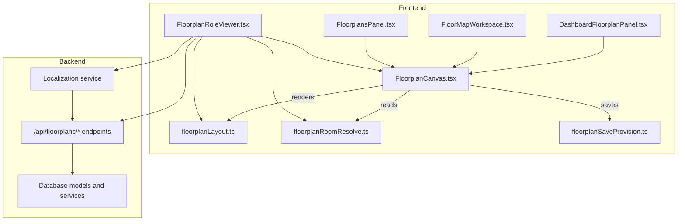
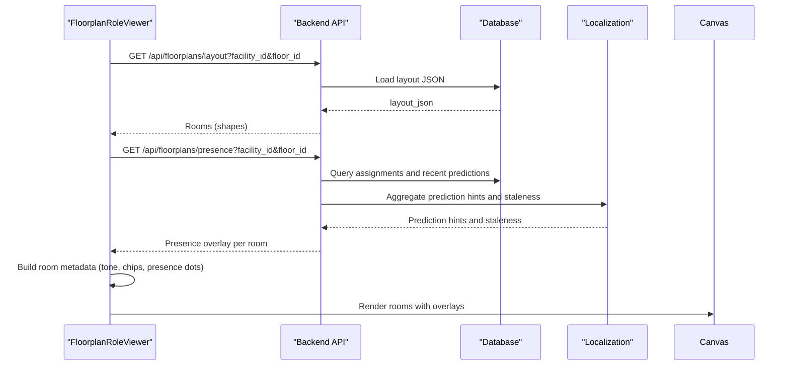
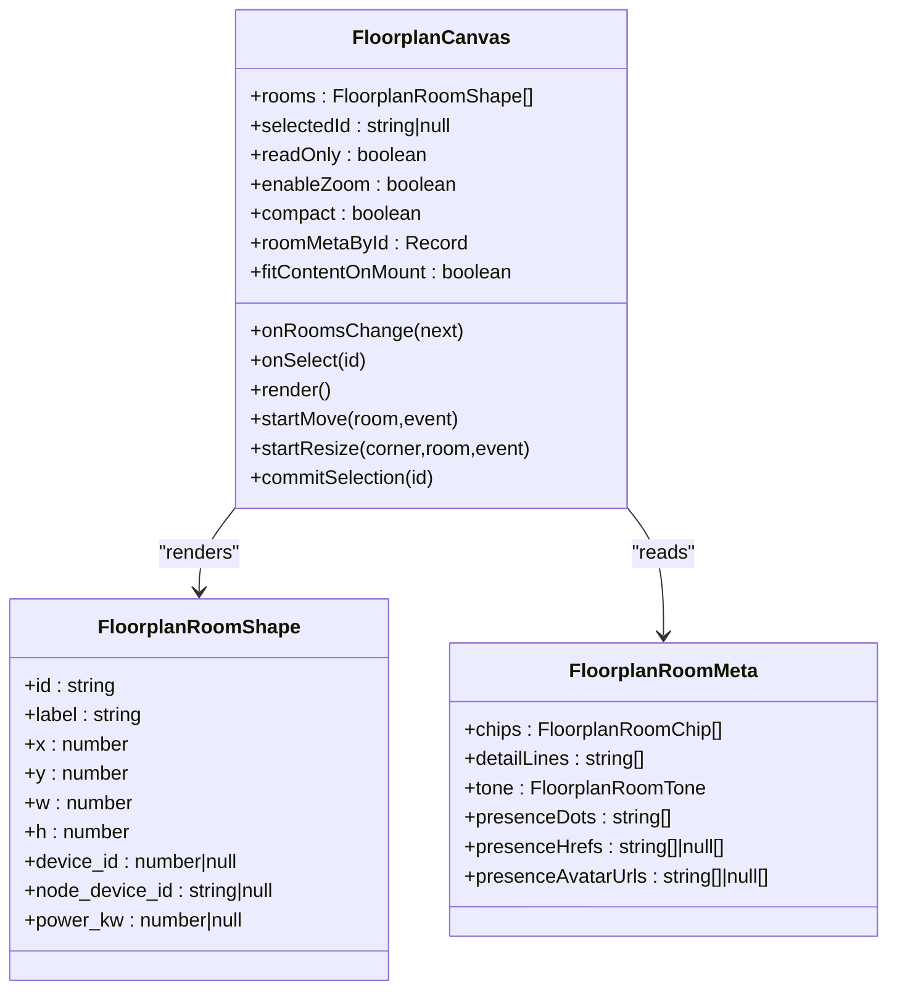
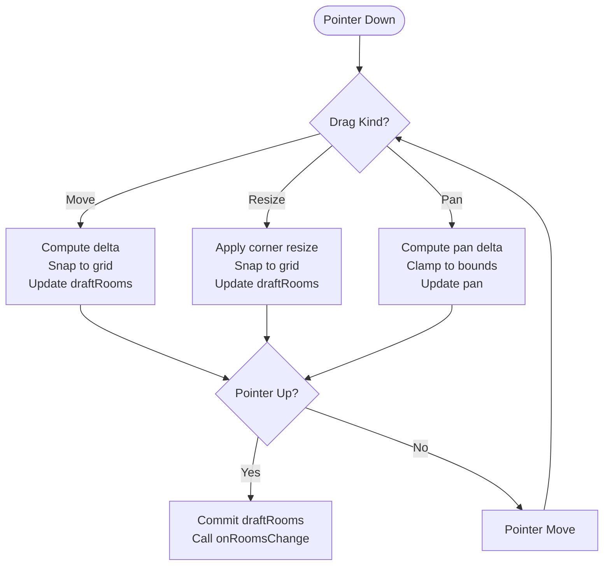
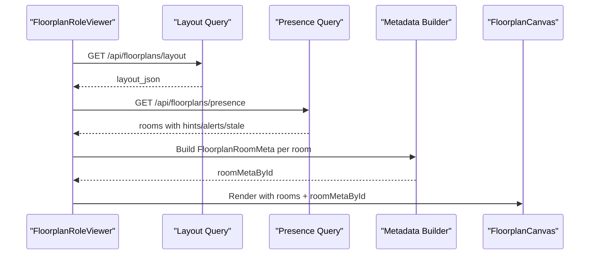
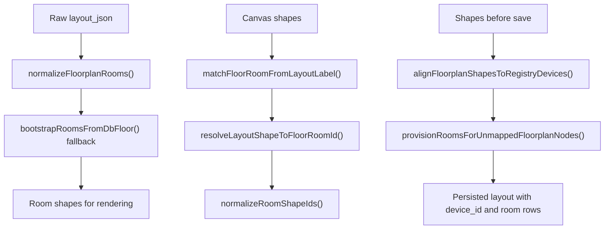
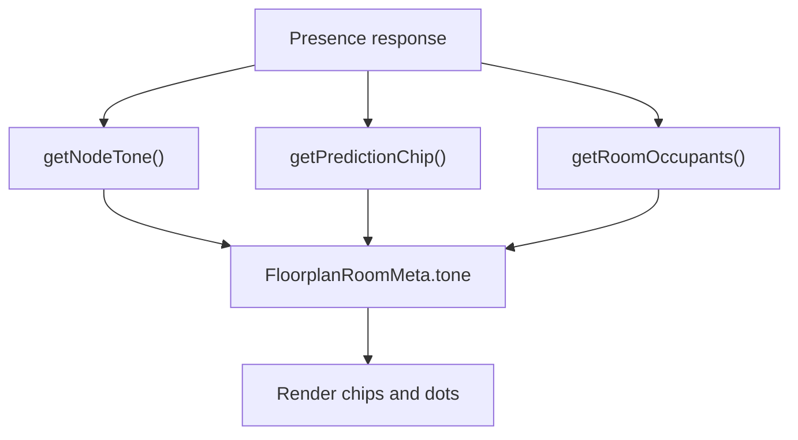
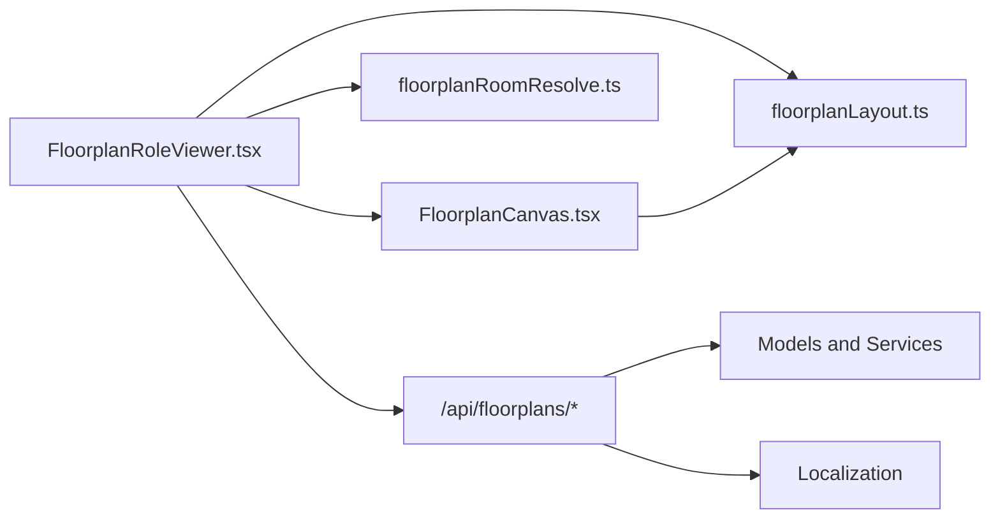

# Floorplan & Zone Monitoring

<cite>
**Referenced Files in This Document**
- [FloorplanCanvas.tsx](file://frontend/components/floorplan/FloorplanCanvas.tsx)
- [FloorplanRoleViewer.tsx](file://frontend/components/floorplan/FloorplanRoleViewer.tsx)
- [FloorplansPanel.tsx](file://frontend/components/admin/FloorplansPanel.tsx)
- [FloorMapWorkspace.tsx](file://frontend/components/admin/monitoring/FloorMapWorkspace.tsx)
- [DashboardFloorplanPanel.tsx](file://frontend/components/dashboard/DashboardFloorplanPanel.tsx)
- [floorplanLayout.ts](file://frontend/lib/floorplanLayout.ts)
- [floorplanRoomResolve.ts](file://frontend/lib/floorplanRoomResolve.ts)
- [floorplanSaveProvision.ts](file://frontend/lib/floorplanSaveProvision.ts)
- [AGENTS.md](file://server/AGENTS.md)
- [localization_setup.py](file://server/app/services/localization_setup.py)
- [0011-phase2-map-person-presence-projection.md](file://docs/adr/0011-phase2-map-person-presence-projection.md)
- [openapi.generated.json](file://server/openapi.generated.json)
</cite>

## Table of Contents
1. [Introduction](#introduction)
2. [Project Structure](#project-structure)
3. [Core Components](#core-components)
4. [Architecture Overview](#architecture-overview)
5. [Detailed Component Analysis](#detailed-component-analysis)
6. [Dependency Analysis](#dependency-analysis)
7. [Performance Considerations](#performance-considerations)
8. [Troubleshooting Guide](#troubleshooting-guide)
9. [Conclusion](#conclusion)
10. [Appendices](#appendices)

## Introduction
This document describes the Observer Floorplan & Zone Monitoring system in the WheelSense Platform. It covers the floorplan visualization interface, zone-based monitoring, patient and staff presence tracking, and spatial awareness features. It explains the FloorplanCanvas component implementation, including room mapping, patient positioning, device placement, and interactive controls. It also documents floorplan configuration, zone definitions, occupancy monitoring, movement tracking, and integration with real-time localization data. Practical examples, procedures, and reporting capabilities are included to help operators and administrators manage zones and monitor spatial dynamics effectively.

## Project Structure
The Floorplan & Zone Monitoring system spans frontend visualization components and backend services:
- Frontend:
  - FloorplanCanvas renders SVG-based room layouts with interactive editing and presence overlays.
  - FloorplanRoleViewer orchestrates facility/floor selection, loads floorplan layouts, fetches presence data, and builds room metadata for visualization.
  - Supporting libraries normalize coordinates, resolve layout labels to database rooms, and provision rooms for nodes.
- Backend:
  - Provides floorplan layout storage and retrieval.
  - Computes presence overlays combining layout-backed rooms, patient assignments, telemetry predictions, and optional staff presence.
  - Enforces policies for patient visibility and role-aware filtering.

**Diagram sources**
- [FloorplanRoleViewer.tsx:567-800](file://frontend/components/floorplan/FloorplanRoleViewer.tsx#L567-L800)
- [FloorplanCanvas.tsx:183-617](file://frontend/components/floorplan/FloorplanCanvas.tsx#L183-L617)
- [floorplanLayout.ts:1-103](file://frontend/lib/floorplanLayout.ts#L1-L103)
- [floorplanRoomResolve.ts:1-108](file://frontend/lib/floorplanRoomResolve.ts#L1-L108)
- [floorplanSaveProvision.ts:1-64](file://frontend/lib/floorplanSaveProvision.ts#L1-L64)
- [FloorplansPanel.tsx:1088-1125](file://frontend/components/admin/FloorplansPanel.tsx#L1088-L1125)
- [FloorMapWorkspace.tsx:522-555](file://frontend/components/admin/monitoring/FloorMapWorkspace.tsx#L522-L555)
- [DashboardFloorplanPanel.tsx](file://frontend/components/dashboard/DashboardFloorplanPanel.tsx)

**Section sources**
- [FloorplanRoleViewer.tsx:567-800](file://frontend/components/floorplan/FloorplanRoleViewer.tsx#L567-L800)
- [FloorplanCanvas.tsx:183-617](file://frontend/components/floorplan/FloorplanCanvas.tsx#L183-L617)
- [floorplanLayout.ts:1-103](file://frontend/lib/floorplanLayout.ts#L1-L103)
- [floorplanRoomResolve.ts:1-108](file://frontend/lib/floorplanRoomResolve.ts#L1-L108)
- [floorplanSaveProvision.ts:1-64](file://frontend/lib/floorplanSaveProvision.ts#L1-L64)

## Core Components
- FloorplanCanvas: An SVG-based canvas for rendering rooms, presence dots, and interactive editing. Supports zoom, pan, move, and resize operations; integrates with room metadata for tone, chips, and presence overlays.
- FloorplanRoleViewer: A role-aware viewer that loads facility/floor data, computes room metadata from presence feeds, and drives FloorplanCanvas with room overlays and interactive selection.
- floorplanLayout: Normalizes coordinate systems, converts legacy units to canvas units, and transforms backend layout responses into renderable room shapes.
- floorplanRoomResolve: Resolves layout labels to database room rows, enabling stable linkage between canvas shapes and facility rooms.
- floorplanSaveProvision: Aligns shape device_id with registry devices and provisions missing rooms for nodes during layout save.

**Section sources**
- [FloorplanCanvas.tsx:183-617](file://frontend/components/floorplan/FloorplanCanvas.tsx#L183-L617)
- [FloorplanRoleViewer.tsx:567-800](file://frontend/components/floorplan/FloorplanRoleViewer.tsx#L567-L800)
- [floorplanLayout.ts:1-103](file://frontend/lib/floorplanLayout.ts#L1-L103)
- [floorplanRoomResolve.ts:1-108](file://frontend/lib/floorplanRoomResolve.ts#L1-L108)
- [floorplanSaveProvision.ts:1-64](file://frontend/lib/floorplanSaveProvision.ts#L1-L64)

## Architecture Overview
The system integrates three data streams to produce a unified spatial view:
- Layout stream: Saved floorplan layout JSON with room shapes and optional device/node links.
- Assignment stream: Patient facility room assignments (Patient.room_id).
- Telemetry stream: Localization room predictions and optional staff presence.

**Diagram sources**
- [FloorplanRoleViewer.tsx:682-702](file://frontend/components/floorplan/FloorplanRoleViewer.tsx#L682-L702)
- [AGENTS.md:187-198](file://server/AGENTS.md#L187-L198)
- [openapi.generated.json:15474-15529](file://server/openapi.generated.json#L15474-L15529)

## Detailed Component Analysis

### FloorplanCanvas Component
FloorplanCanvas renders a grid-backed SVG canvas with draggable/resizable rooms. It supports:
- Zoom and pan with keyboard/mouse wheel and on-screen controls.
- Move and resize operations with snapping to grid and bounds clamping.
- Presence overlays: chips, detail lines, and presence dots with optional links.
- Read-only mode for dashboards and non-editable views.

**Diagram sources**
- [FloorplanCanvas.tsx:183-617](file://frontend/components/floorplan/FloorplanCanvas.tsx#L183-L617)
- [floorplanLayout.ts:1-11](file://frontend/lib/floorplanLayout.ts#L1-L11)

Interactive editing flow:

**Diagram sources**
- [FloorplanCanvas.tsx:260-371](file://frontend/components/floorplan/FloorplanCanvas.tsx#L260-L371)

**Section sources**
- [FloorplanCanvas.tsx:183-617](file://frontend/components/floorplan/FloorplanCanvas.tsx#L183-L617)
- [floorplanLayout.ts:1-103](file://frontend/lib/floorplanLayout.ts#L1-L103)

### FloorplanRoleViewer: Presence Composition and Visualization
FloorplanRoleViewer:
- Loads facilities and floors, selects a floor, and fetches the layout.
- Optionally fetches presence data and merges it with layout to compute room metadata.
- Builds presence overlays with chips (occupancy counts, alerts, prediction confidence), detail lines, and presence dots with optional links.
- Supports read-only dashboards and compact modes.

**Diagram sources**
- [FloorplanRoleViewer.tsx:644-702](file://frontend/components/floorplan/FloorplanRoleViewer.tsx#L644-L702)
- [FloorplanRoleViewer.tsx:772-780](file://frontend/components/floorplan/FloorplanRoleViewer.tsx#L772-L780)

**Section sources**
- [FloorplanRoleViewer.tsx:567-800](file://frontend/components/floorplan/FloorplanRoleViewer.tsx#L567-L800)

### Layout, Resolution, and Save Provision
- Coordinate normalization: Converts legacy and modern layout units to canvas units.
- Label resolution: Matches layout labels to database room names, supporting variations like "104" vs "Room 104".
- Save alignment: Ensures shape device_id matches registry node_device_id and provisions rooms for nodes without matching DB rows.

**Diagram sources**
- [floorplanLayout.ts:55-103](file://frontend/lib/floorplanLayout.ts#L55-L103)
- [floorplanRoomResolve.ts:24-108](file://frontend/lib/floorplanRoomResolve.ts#L24-L108)
- [floorplanSaveProvision.ts:11-64](file://frontend/lib/floorplanSaveProvision.ts#L11-L64)

**Section sources**
- [floorplanLayout.ts:1-103](file://frontend/lib/floorplanLayout.ts#L1-L103)
- [floorplanRoomResolve.ts:1-108](file://frontend/lib/floorplanRoomResolve.ts#L1-L108)
- [floorplanSaveProvision.ts:1-64](file://frontend/lib/floorplanSaveProvision.ts#L1-L64)

### Integration with Real-Time Localization Data
- Presence composition: Combines layout-backed rooms, patient assignments, localization predictions, and optional staff presence.
- Staleness and node status: Uses node status and staleness seconds to compute room tone and chips.
- Prediction hints: Adds prediction confidence chips and indicates model type.

**Diagram sources**
- [FloorplanRoleViewer.tsx:123-150](file://frontend/components/floorplan/FloorplanRoleViewer.tsx#L123-L150)
- [FloorplanRoleViewer.tsx:204-210](file://frontend/components/floorplan/FloorplanRoleViewer.tsx#L204-L210)
- [FloorplanRoleViewer.tsx:223-281](file://frontend/components/floorplan/FloorplanRoleViewer.tsx#L223-L281)

**Section sources**
- [AGENTS.md:187-198](file://server/AGENTS.md#L187-L198)
- [0011-phase2-map-person-presence-projection.md:1-21](file://docs/adr/0011-phase2-map-person-presence-projection.md#L1-L21)
- [openapi.generated.json:15474-15529](file://server/openapi.generated.json#L15474-L15529)

## Dependency Analysis
- FloorplanRoleViewer depends on:
  - FloorplanCanvas for rendering.
  - floorplanLayout for coordinate normalization and room bootstrapping.
  - floorplanRoomResolve for label-to-room mapping.
  - Backend endpoints for layout and presence.
- FloorplanCanvas depends on:
  - floorplanLayout for coordinate conversion and room shape typing.
  - floorplanRoomResolve indirectly via FloorplanRoleViewer’s room metadata building.
- Backend services:
  - Floorplan presence aggregation combines assignments and localization predictions.
  - Layout provisioning ensures device_id consistency and room existence.

**Diagram sources**
- [FloorplanRoleViewer.tsx:567-800](file://frontend/components/floorplan/FloorplanRoleViewer.tsx#L567-L800)
- [FloorplanCanvas.tsx:183-617](file://frontend/components/floorplan/FloorplanCanvas.tsx#L183-L617)
- [floorplanLayout.ts:1-103](file://frontend/lib/floorplanLayout.ts#L1-L103)
- [floorplanRoomResolve.ts:1-108](file://frontend/lib/floorplanRoomResolve.ts#L1-L108)

**Section sources**
- [FloorplanRoleViewer.tsx:567-800](file://frontend/components/floorplan/FloorplanRoleViewer.tsx#L567-L800)
- [FloorplanCanvas.tsx:183-617](file://frontend/components/floorplan/FloorplanCanvas.tsx#L183-L617)
- [floorplanLayout.ts:1-103](file://frontend/lib/floorplanLayout.ts#L1-L103)
- [floorplanRoomResolve.ts:1-108](file://frontend/lib/floorplanRoomResolve.ts#L1-L108)

## Performance Considerations
- Rendering:
  - Use compact mode for dashboards to reduce DOM and layout cost.
  - Avoid frequent re-renders by memoizing room metadata and normalized shapes.
- Queries:
  - Presence queries poll at a fixed interval; adjust polling based on floor size and update frequency needs.
  - Use staleTime to balance freshness and network load.
- Interactions:
  - Draft updates during drag/resize minimize unnecessary writes; commit only on pointer up.
- Coordinate normalization:
  - Pre-normalize layout coordinates to avoid repeated conversions during rendering.

[No sources needed since this section provides general guidance]

## Troubleshooting Guide
Common issues and resolutions:
- Empty layout:
  - If no rooms are returned, the system falls back to bootstrapping rooms from the floor’s database rows.
- Layout error:
  - UI displays an error state with a retry button; ensure facility and floor IDs are valid and accessible.
- Stale or offline nodes:
  - Room tone and chips reflect node status; investigate device registration and connectivity.
- Presence not updating:
  - Verify presence polling intervals and backend localization availability.
- Device alignment on save:
  - Ensure node_device_id exists in the device registry; otherwise, device_id is cleared to prevent stale references.

**Section sources**
- [FloorplansPanel.tsx:1088-1125](file://frontend/components/admin/FloorplansPanel.tsx#L1088-L1125)
- [FloorMapWorkspace.tsx:522-555](file://frontend/components/admin/monitoring/FloorMapWorkspace.tsx#L522-L555)
- [floorplanSaveProvision.ts:11-26](file://frontend/lib/floorplanSaveProvision.ts#L11-L26)

## Conclusion
The WheelSense Floorplan & Zone Monitoring system provides a robust, role-aware spatial view integrating layout, assignments, and localization data. FloorplanCanvas offers precise, grid-aligned editing and visualization, while FloorplanRoleViewer composes presence overlays and manages room metadata. Libraries ensure accurate coordinate handling, reliable label-to-room resolution, and safe layout saves. Together, these components enable effective zone monitoring, occupancy tracking, and spatial reporting for observers, supervisors, and head nurses.

[No sources needed since this section summarizes without analyzing specific files]

## Appendices

### Examples and Procedures

- Viewing a floorplan:
  - Navigate to the monitoring workspace and select a facility and floor; the canvas renders rooms and presence overlays.
- Editing a floorplan:
  - Use the admin floorplan panel to move and resize rooms; changes are committed on pointer up.
- Managing zones:
  - Define room shapes in the layout; link rooms to devices/nodes via node_device_id; ensure device_id aligns with registry.
- Patient flow analysis:
  - Use presence overlays to track occupancy and prediction confidence; combine with room telemetry timestamps.
- Spatial reporting:
  - Aggregate occupancy counts, alert counts, and staleness across rooms for summary statistics and snapshots.

[No sources needed since this section provides general guidance]