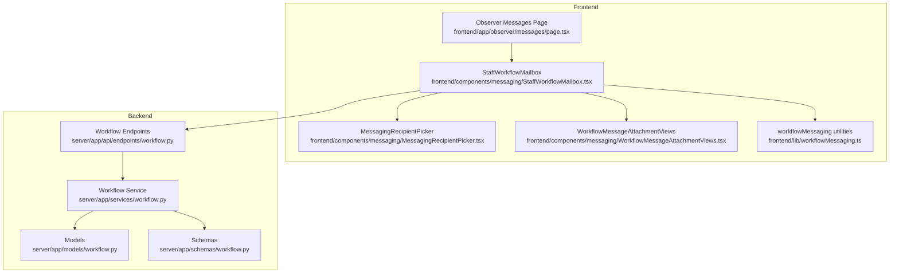
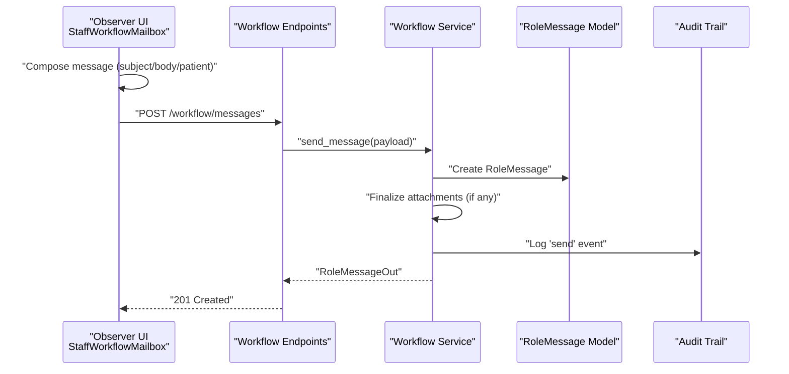
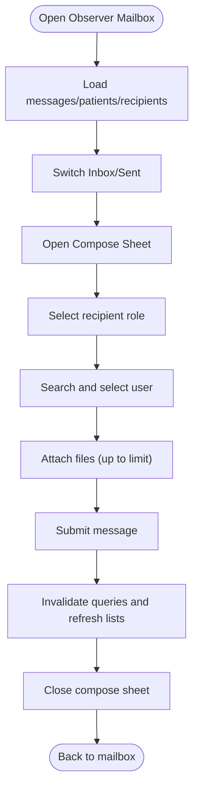
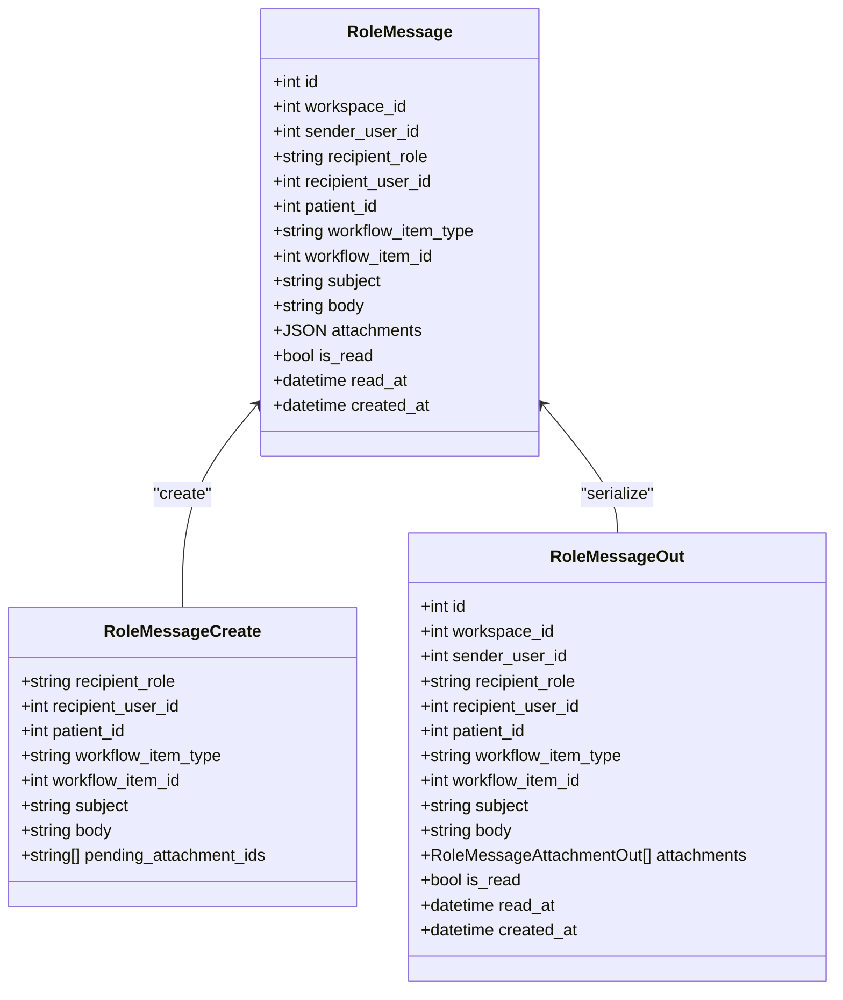
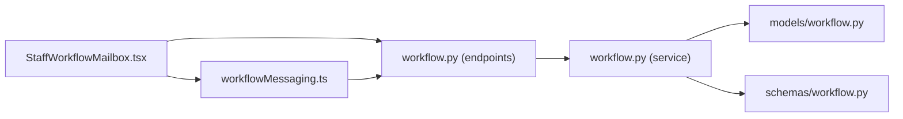

# Messaging & Communication

<cite>
**Referenced Files in This Document**
- [page.tsx](file://frontend/app/observer/messages/page.tsx)
- [StaffWorkflowMailbox.tsx](file://frontend/components/messaging/StaffWorkflowMailbox.tsx)
- [MessagingRecipientPicker.tsx](file://frontend/components/messaging/MessagingRecipientPicker.tsx)
- [WorkflowMessageAttachmentViews.tsx](file://frontend/components/messaging/WorkflowMessageAttachmentViews.tsx)
- [workflowMessaging.ts](file://frontend/lib/workflowMessaging.ts)
- [workflow.py](file://server/app/services/workflow.py)
- [workflow.py](file://server/app/api/endpoints/workflow.py)
- [workflow.py](file://server/app/models/workflow.py)
- [workflow.py](file://server/app/schemas/workflow.py)
- [OperationsConsole.tsx](file://frontend/components/workflow/OperationsConsole.tsx)
- [test_role_workflow_chat.py](file://server/tests/e2e/test_role_workflow_chat.py)
- [test_workflow_domains.py](file://server/tests/test_workflow_domains.py)
</cite>

## Table of Contents
1. [Introduction](#introduction)
2. [Project Structure](#project-structure)
3. [Core Components](#core-components)
4. [Architecture Overview](#architecture-overview)
5. [Detailed Component Analysis](#detailed-component-analysis)
6. [Dependency Analysis](#dependency-analysis)
7. [Performance Considerations](#performance-considerations)
8. [Troubleshooting Guide](#troubleshooting-guide)
9. [Conclusion](#conclusion)

## Introduction
This document explains the Observer Messaging & Communication system in the WheelSense Platform. It focuses on the workflow-based messaging interface, recipient selection, message threading, and communication workflows specific to observer roles. It documents the StaffWorkflowMailbox component, including message composition, recipient filtering, attachment handling, and workflow integration. It also covers observer-specific communication patterns, message routing, thread management, and integration with care workflows, along with examples of observer communication scenarios, workflow message creation, team coordination procedures, and audit trail maintenance.

## Project Structure
The messaging system spans frontend React components and backend FastAPI services and models:
- Frontend pages and components implement the observer mailbox and compose UI, recipient picker, and attachment handling.
- Backend services define message persistence, routing, read/unread state, deletion, and audit logging.
- Endpoints expose list, send, read, delete, and attachment retrieval APIs.
- Tests validate end-to-end observer messaging and workflow integration.

**Diagram sources**
- [page.tsx:1-7](file://frontend/app/observer/messages/page.tsx#L1-L7)
- [StaffWorkflowMailbox.tsx:1-723](file://frontend/components/messaging/StaffWorkflowMailbox.tsx#L1-L723)
- [MessagingRecipientPicker.tsx:1-155](file://frontend/components/messaging/MessagingRecipientPicker.tsx#L1-L155)
- [WorkflowMessageAttachmentViews.tsx:1-142](file://frontend/components/messaging/WorkflowMessageAttachmentViews.tsx#L1-L142)
- [workflowMessaging.ts:1-21](file://frontend/lib/workflowMessaging.ts#L1-L21)
- [workflow.py:1-200](file://server/app/api/endpoints/workflow.py#L1-L200)
- [workflow.py:1-200](file://server/app/services/workflow.py#L1-L200)
- [workflow.py:67-89](file://server/app/models/workflow.py#L67-L89)
- [workflow.py:124-178](file://server/app/schemas/workflow.py#L124-L178)

**Section sources**
- [page.tsx:1-7](file://frontend/app/observer/messages/page.tsx#L1-L7)
- [StaffWorkflowMailbox.tsx:1-723](file://frontend/components/messaging/StaffWorkflowMailbox.tsx#L1-L723)
- [workflow.py:1-200](file://server/app/api/endpoints/workflow.py#L1-L200)

## Core Components
- Observer Messages Page: Renders the observer’s workflow mailbox via the StaffWorkflowMailbox component.
- StaffWorkflowMailbox: Provides inbox/sent tabs, message list, detail pane, compose sheet, recipient filtering, patient association, and attachments.
- MessagingRecipientPicker: Filters and selects recipients by role and free-text search.
- WorkflowMessageAttachmentViews: Handles attachment upload, preview, and download links.
- workflowMessaging utilities: Provide attachment URL generation and delete permission checks.
- Backend Workflow Service: Implements message CRUD, read/unread, deletion, and audit logging.
- Endpoints: Expose list, send, read, delete, and attachment retrieval APIs.
- Models and Schemas: Define RoleMessage, attachments, and validation.

**Section sources**
- [page.tsx:1-7](file://frontend/app/observer/messages/page.tsx#L1-L7)
- [StaffWorkflowMailbox.tsx:1-723](file://frontend/components/messaging/StaffWorkflowMailbox.tsx#L1-L723)
- [MessagingRecipientPicker.tsx:1-155](file://frontend/components/messaging/MessagingRecipientPicker.tsx#L1-L155)
- [WorkflowMessageAttachmentViews.tsx:1-142](file://frontend/components/messaging/WorkflowMessageAttachmentViews.tsx#L1-L142)
- [workflowMessaging.ts:1-21](file://frontend/lib/workflowMessaging.ts#L1-L21)
- [workflow.py:980-1179](file://server/app/services/workflow.py#L980-L1179)
- [workflow.py:368-384](file://server/app/api/endpoints/workflow.py#L368-L384)
- [workflow.py:67-89](file://server/app/models/workflow.py#L67-L89)
- [workflow.py:124-178](file://server/app/schemas/workflow.py#L124-L178)

## Architecture Overview
The observer messaging architecture integrates frontend UI with backend services and persistence:
- Frontend composes and sends messages with optional attachments.
- Backend validates recipients, persists RoleMessage, finalizes attachments, logs audit events, and enforces read/delete permissions.
- Endpoints support listing messages per user/role, marking read, deleting messages, and retrieving attachment content.

**Diagram sources**
- [StaffWorkflowMailbox.tsx:219-259](file://frontend/components/messaging/StaffWorkflowMailbox.tsx#L219-L259)
- [workflow.py:354-365](file://server/app/api/endpoints/workflow.py#L354-L365)
- [workflow.py:980-1017](file://server/app/services/workflow.py#L980-L1017)
- [workflow.py:67-89](file://server/app/models/workflow.py#L67-L89)
- [workflow.py:160-178](file://server/app/schemas/workflow.py#L160-L178)

## Detailed Component Analysis

### Observer Messages Page
- Renders the observer mailbox by passing variant="observer" to StaffWorkflowMailbox.
- Integrates with the observer role shell and navigation.

**Section sources**
- [page.tsx:1-7](file://frontend/app/observer/messages/page.tsx#L1-L7)

### StaffWorkflowMailbox (Observer)
- Variant configuration: observer mailbox defaults to head_nurse as the default filter role for composition.
- Tabs: inbox and sent lists, with search and selection.
- Composition sheet:
  - Role-based recipient filter with MessagingRecipientPicker.
  - Patient association selector.
  - Subject and body fields with validation.
  - Attachment upload with limits and previews.
- Message detail pane:
  - Sender/recipient info, read/unread badge, attachments, and body.
  - Mark-as-read and delete actions based on permissions.
- Data loading:
  - Lists messages with pagination-friendly limit.
  - Loads patients and recipients lazily when compose sheet opens.

**Diagram sources**
- [StaffWorkflowMailbox.tsx:153-723](file://frontend/components/messaging/StaffWorkflowMailbox.tsx#L153-L723)

**Section sources**
- [StaffWorkflowMailbox.tsx:84-123](file://frontend/components/messaging/StaffWorkflowMailbox.tsx#L84-L123)
- [StaffWorkflowMailbox.tsx:167-183](file://frontend/components/messaging/StaffWorkflowMailbox.tsx#L167-L183)
- [StaffWorkflowMailbox.tsx:595-645](file://frontend/components/messaging/StaffWorkflowMailbox.tsx#L595-L645)
- [StaffWorkflowMailbox.tsx:685-701](file://frontend/components/messaging/StaffWorkflowMailbox.tsx#L685-L701)

### MessagingRecipientPicker
- Filters recipients by role (including patient vs staff distinction).
- Supports free-text search across display name, username, role, employee code, and linked name.
- Presents candidate list with selection feedback.

**Section sources**
- [MessagingRecipientPicker.tsx:21-48](file://frontend/components/messaging/MessagingRecipientPicker.tsx#L21-L48)
- [MessagingRecipientPicker.tsx:68-155](file://frontend/components/messaging/MessagingRecipientPicker.tsx#L68-L155)

### WorkflowMessageAttachmentViews
- Compose attachments:
  - Choose file with accepted MIME types and size limit.
  - Preview pending attachments with remove action.
- Read-only attachment links:
  - Downloadable links with filename and size.
  - Uses cookie-authenticated endpoint for secure retrieval.

**Section sources**
- [WorkflowMessageAttachmentViews.tsx:26-103](file://frontend/components/messaging/WorkflowMessageAttachmentViews.tsx#L26-L103)
- [WorkflowMessageAttachmentViews.tsx:111-141](file://frontend/components/messaging/WorkflowMessageAttachmentViews.tsx#L111-L141)
- [workflowMessaging.ts:4-6](file://frontend/lib/workflowMessaging.ts#L4-L6)

### Backend Workflow Service and Endpoints
- Message creation:
  - Validates recipient role/user, body or attachments presence.
  - Persists RoleMessage and finalizes pending attachments.
  - Logs audit event for messaging domain.
- Listing:
  - Inbox vs sent filtering by user ID and role-based broadcast.
  - Optional filtering by workflow item type/id.
- Read/unread:
  - Only intended recipients can mark as read.
- Delete:
  - Allowed for admins/head nurses and original sender or recipient.
- Attachments:
  - Upload pending attachments.
  - Retrieve attachment content via authenticated endpoint.

**Diagram sources**
- [workflow.py:67-89](file://server/app/models/workflow.py#L67-L89)
- [workflow.py:138-158](file://server/app/schemas/workflow.py#L138-L158)
- [workflow.py:160-197](file://server/app/schemas/workflow.py#L160-L197)

**Section sources**
- [workflow.py:980-1017](file://server/app/services/workflow.py#L980-L1017)
- [workflow.py:1019-1055](file://server/app/services/workflow.py#L1019-L1055)
- [workflow.py:1057-1080](file://server/app/services/workflow.py#L1057-L1080)
- [workflow.py:1082-1100](file://server/app/services/workflow.py#L1082-L1100)
- [workflow.py:354-384](file://server/app/api/endpoints/workflow.py#L354-L384)
- [workflow.py:124-178](file://server/app/schemas/workflow.py#L124-L178)

### Observer-Specific Communication Patterns
- Observer receives role-based broadcasts and direct messages.
- Observer can send messages to other roles or individuals.
- Integration with care workflows:
  - Messages can be associated with workflow items (task/schedule/directive).
  - Operations Console supports replying to a workflow item by routing to its target role/user and attaching the message context.

**Section sources**
- [StaffWorkflowMailbox.tsx:104-122](file://frontend/components/messaging/StaffWorkflowMailbox.tsx#L104-L122)
- [OperationsConsole.tsx:1160-1188](file://frontend/components/workflow/OperationsConsole.tsx#L1160-L1188)
- [test_role_workflow_chat.py:46-89](file://server/tests/e2e/test_role_workflow_chat.py#L46-L89)

### Message Routing and Thread Management
- Routing:
  - Role-based broadcast: recipient_role set; recipient_user_id null.
  - Direct message: recipient_user_id set; recipient_role null.
- Thread management:
  - Messages can be associated with a workflow item (type/id) to group related communications.
  - Endpoints support retrieving messages for a specific workflow item.

**Section sources**
- [workflow.py:1019-1055](file://server/app/services/workflow.py#L1019-L1055)
- [workflow.py:633-663](file://server/app/api/endpoints/workflow.py#L633-L663)

### Audit Trail Maintenance
- On send: logs an event in the messaging domain with details such as recipient role/user and attachment count.
- On read/unread and delete: backend enforces permissions and updates state accordingly.

**Section sources**
- [workflow.py:997-1013](file://server/app/services/workflow.py#L997-L1013)
- [workflow.py:1057-1080](file://server/app/services/workflow.py#L1057-L1080)
- [workflow.py:1082-1100](file://server/app/services/workflow.py#L1082-L1100)

## Dependency Analysis
- Frontend depends on:
  - API client for workflow messaging endpoints.
  - React Query for caching and invalidation.
  - Zod for form validation.
- Backend depends on:
  - SQLAlchemy models for persistence.
  - Pydantic schemas for request/response validation.
  - Audit service for event logging.

**Diagram sources**
- [StaffWorkflowMailbox.tsx:1-723](file://frontend/components/messaging/StaffWorkflowMailbox.tsx#L1-L723)
- [workflow.py:1-200](file://server/app/api/endpoints/workflow.py#L1-L200)
- [workflow.py:1-200](file://server/app/services/workflow.py#L1-L200)
- [workflow.py:1-197](file://server/app/models/workflow.py#L1-L197)
- [workflow.py:1-200](file://server/app/schemas/workflow.py#L1-L200)
- [workflowMessaging.ts:1-21](file://frontend/lib/workflowMessaging.ts#L1-L21)

**Section sources**
- [StaffWorkflowMailbox.tsx:1-723](file://frontend/components/messaging/StaffWorkflowMailbox.tsx#L1-L723)
- [workflow.py:1-200](file://server/app/api/endpoints/workflow.py#L1-L200)
- [workflow.py:1-200](file://server/app/services/workflow.py#L1-L200)
- [workflow.py:1-197](file://server/app/models/workflow.py#L1-L197)
- [workflow.py:1-200](file://server/app/schemas/workflow.py#L1-L200)
- [workflowMessaging.ts:1-21](file://frontend/lib/workflowMessaging.ts#L1-L21)

## Performance Considerations
- Pagination and limits:
  - Backend lists messages with a capped limit and sorts by creation time.
- Caching:
  - Frontend uses React Query with configured keys and refetch intervals to keep lists fresh.
- Attachment constraints:
  - Limits on number and size of attachments reduce payload sizes and storage overhead.
- Query efficiency:
  - Backend filters by workspace and recipient conditions to minimize scans.

[No sources needed since this section provides general guidance]

## Troubleshooting Guide
Common issues and resolutions:
- Cannot send message:
  - Ensure either body or at least one pending attachment is present.
  - Verify recipient selection is valid.
- Attachment errors:
  - Respect maximum attachment count and size limits.
  - Confirm accepted MIME types.
- Read/unread failures:
  - Only intended recipients can mark messages as read.
- Delete failures:
  - Deletion is restricted to admins/head nurses and original sender or recipient.
- End-to-end observer scenarios:
  - Observer receives role-based broadcasts and direct messages.
  - Observer can acknowledge directives scoped to their role.

**Section sources**
- [StaffWorkflowMailbox.tsx:219-259](file://frontend/components/messaging/StaffWorkflowMailbox.tsx#L219-L259)
- [WorkflowMessageAttachmentViews.tsx:69-78](file://frontend/components/messaging/WorkflowMessageAttachmentViews.tsx#L69-L78)
- [workflow.py:1057-1080](file://server/app/services/workflow.py#L1057-L1080)
- [workflow.py:1082-1100](file://server/app/services/workflow.py#L1082-L1100)
- [test_role_workflow_chat.py:46-89](file://server/tests/e2e/test_role_workflow_chat.py#L46-L89)
- [test_workflow_domains.py:378-416](file://server/tests/test_workflow_domains.py#L378-L416)

## Conclusion
The Observer Messaging & Communication system provides a robust, role-aware, and workflow-integrated messaging solution. The StaffWorkflowMailbox offers a streamlined compose and read experience, with recipient filtering, attachments, and thread-aware routing. Backend services enforce security and auditability while enabling seamless integration with care workflows. The included tests demonstrate end-to-end observer messaging and workflow item association, ensuring reliable team coordination and traceability.