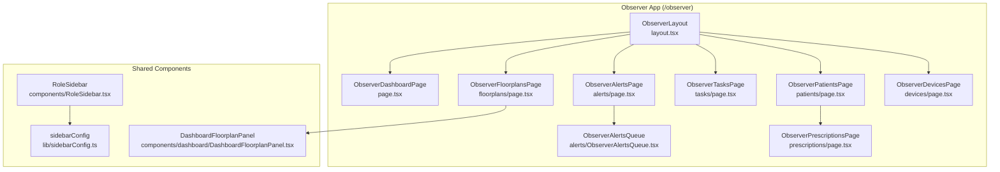
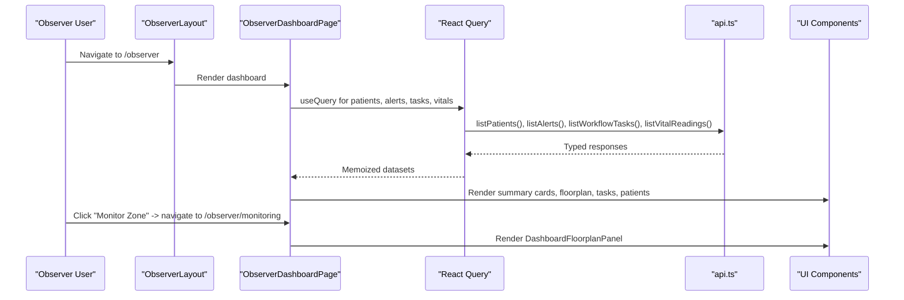
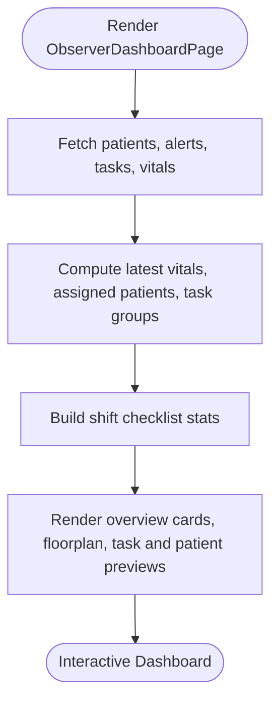
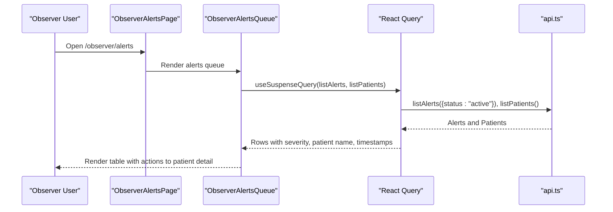
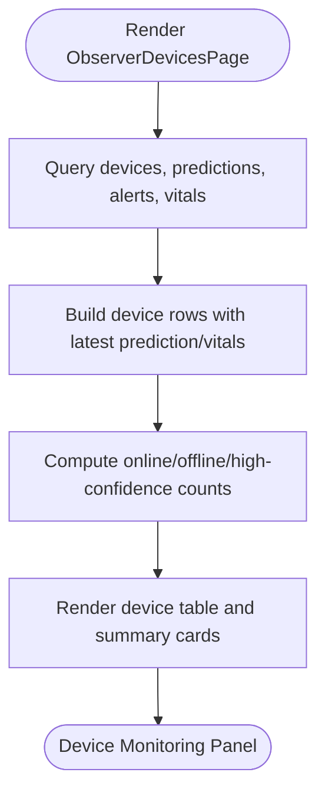
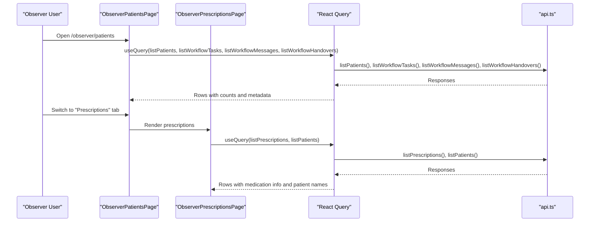
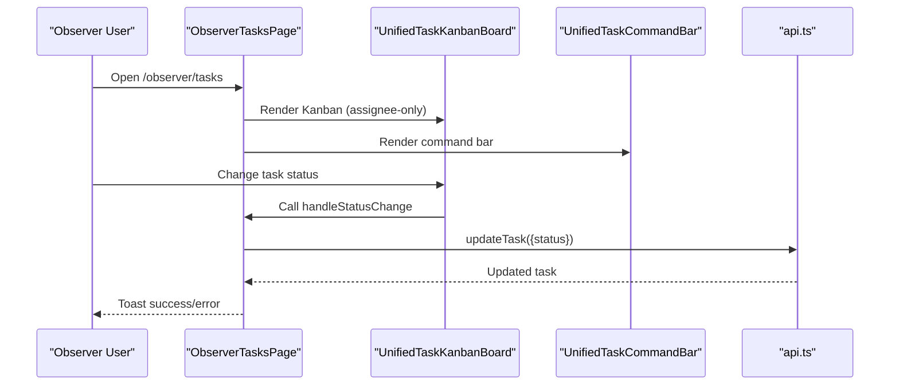
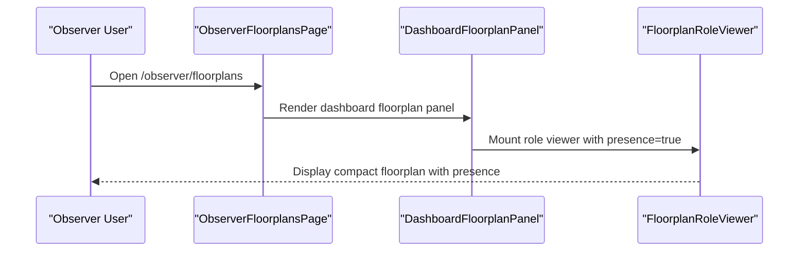
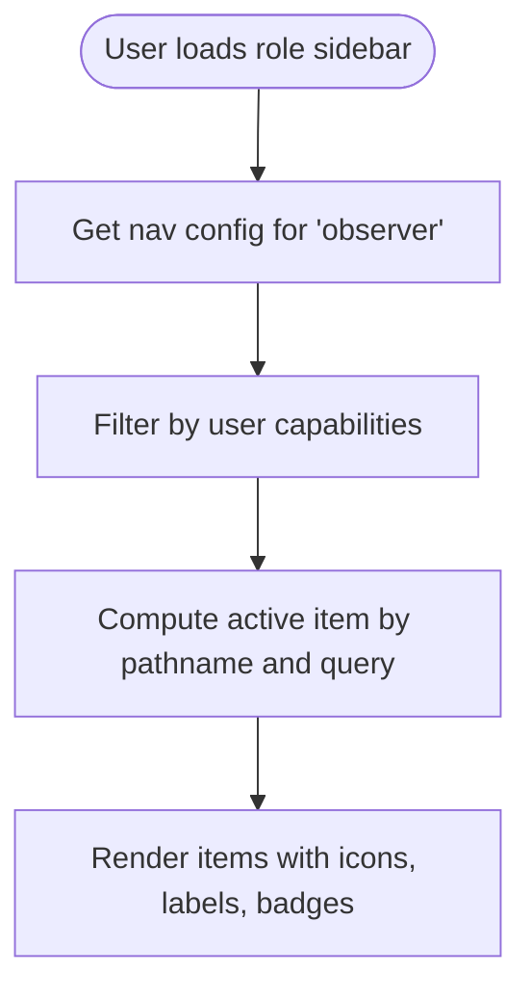
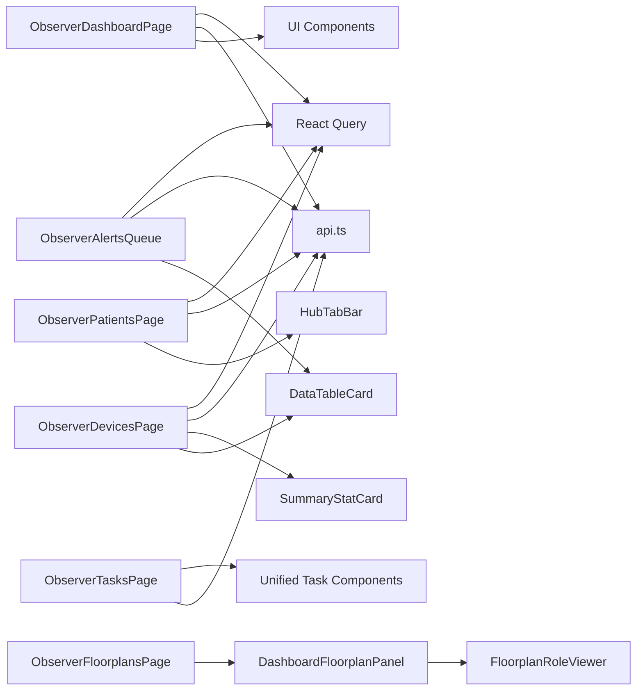

# Observer Dashboard

<cite>
**Referenced Files in This Document**
- [ObserverDashboardPage](file://frontend/app/observer/page.tsx)
- [ObserverLayout](file://frontend/app/observer/layout.tsx)
- [ObserverAlertsPage](file://frontend/app/observer/alerts/page.tsx)
- [ObserverAlertsQueue](file://frontend/app/observer/alerts/ObserverAlertsQueue.tsx)
- [ObserverDevicesPage](file://frontend/app/observer/devices/page.tsx)
- [ObserverPatientsPage](file://frontend/app/observer/patients/page.tsx)
- [ObserverPrescriptionsPage](file://frontend/app/observer/prescriptions/page.tsx)
- [ObserverTasksPage](file://frontend/app/observer/tasks/page.tsx)
- [ObserverFloorplansPage](file://frontend/app/observer/floorplans/page.tsx)
- [DashboardFloorplanPanel](file://frontend/components/dashboard/DashboardFloorplanPanel.tsx)
- [RoleSidebar](file://frontend/components/RoleSidebar.tsx)
- [sidebarConfig](file://frontend/lib/sidebarConfig.ts)
- [ObserverTaskListPanel](file://frontend/components/workflow/ObserverTaskListPanel.tsx)
- [api](file://frontend/lib/api.ts)
</cite>

## Table of Contents
1. [Introduction](#introduction)
2. [Project Structure](#project-structure)
3. [Core Components](#core-components)
4. [Architecture Overview](#architecture-overview)
5. [Detailed Component Analysis](#detailed-component-analysis)
6. [Dependency Analysis](#dependency-analysis)
7. [Performance Considerations](#performance-considerations)
8. [Troubleshooting Guide](#troubleshooting-guide)
9. [Conclusion](#conclusion)

## Introduction
The Observer Dashboard in the WheelSense Platform provides a specialized monitoring interface for observers to oversee patient care, manage alerts, monitor devices, execute workflow tasks, and coordinate support. It emphasizes real-time visibility, actionable insights, and streamlined workflows tailored to the observer’s role. This document explains the observer’s monitoring role interface, navigation patterns, alert management, device monitoring tools, patient tracking, workflow execution, and surveillance capabilities, with practical examples of observer workflows.

## Project Structure
The observer role is implemented as a Next.js app under the `/observer` route group. It integrates with shared components for navigation, floorplan visualization, and data presentation. The layout wraps child pages with a role-aware shell, while the sidebar configuration defines observer-specific navigation items and capabilities.

**Diagram sources**
- [ObserverLayout:1-12](file://frontend/app/observer/layout.tsx#L1-L12)
- [ObserverDashboardPage:1-464](file://frontend/app/observer/page.tsx#L1-L464)
- [ObserverAlertsPage:1-36](file://frontend/app/observer/alerts/page.tsx#L1-L36)
- [ObserverAlertsQueue:1-188](file://frontend/app/observer/alerts/ObserverAlertsQueue.tsx#L1-L188)
- [ObserverPatientsPage:1-258](file://frontend/app/observer/patients/page.tsx#L1-L258)
- [ObserverPrescriptionsPage:1-130](file://frontend/app/observer/prescriptions/page.tsx#L1-L130)
- [ObserverTasksPage:1-137](file://frontend/app/observer/tasks/page.tsx#L1-L137)
- [ObserverFloorplansPage:1-26](file://frontend/app/observer/floorplans/page.tsx#L1-L26)
- [ObserverDevicesPage:1-259](file://frontend/app/observer/devices/page.tsx#L1-L259)
- [DashboardFloorplanPanel:1-30](file://frontend/components/dashboard/DashboardFloorplanPanel.tsx#L1-L30)
- [RoleSidebar:1-228](file://frontend/components/RoleSidebar.tsx#L1-L228)
- [sidebarConfig:1-300](file://frontend/lib/sidebarConfig.ts#L1-L300)

**Section sources**
- [ObserverLayout:1-12](file://frontend/app/observer/layout.tsx#L1-L12)
- [RoleSidebar:1-228](file://frontend/components/RoleSidebar.tsx#L1-L228)
- [sidebarConfig:198-237](file://frontend/lib/sidebarConfig.ts#L198-L237)

## Core Components
- ObserverDashboardPage: Orchestrates real-time dashboards for patients, tasks, alerts, vitals, and shift checklists; renders summary cards and embedded floorplan.
- ObserverAlertsQueue: Lists active alerts with sorting by severity and timestamp, patient linkage, and quick navigation to patient details.
- ObserverDevicesPage: Displays device fleet status, localization predictions, alert counts, and recent vitals.
- ObserverPatientsPage: Provides a searchable patient list with open tasks, unread messages, and handover counts; includes a prescriptions tab.
- ObserverTasksPage: Presents observer-managed tasks with Kanban board, command bar, and execution controls.
- ObserverFloorplansPage: Visualizes facility floorplan with presence indicators and compact mode.
- DashboardFloorplanPanel: Reusable floorplan panel used on the dashboard.
- RoleSidebar + sidebarConfig: Defines observer navigation items, active states, and capability-based filtering.

**Section sources**
- [ObserverDashboardPage:65-464](file://frontend/app/observer/page.tsx#L65-L464)
- [ObserverAlertsQueue:31-188](file://frontend/app/observer/alerts/ObserverAlertsQueue.tsx#L31-L188)
- [ObserverDevicesPage:55-259](file://frontend/app/observer/devices/page.tsx#L55-L259)
- [ObserverPatientsPage:31-258](file://frontend/app/observer/patients/page.tsx#L31-L258)
- [ObserverTasksPage:23-137](file://frontend/app/observer/tasks/page.tsx#L23-L137)
- [ObserverFloorplansPage:7-26](file://frontend/app/observer/floorplans/page.tsx#L7-L26)
- [DashboardFloorplanPanel:13-30](file://frontend/components/dashboard/DashboardFloorplanPanel.tsx#L13-L30)
- [RoleSidebar:60-101](file://frontend/components/RoleSidebar.tsx#L60-L101)
- [sidebarConfig:198-237](file://frontend/lib/sidebarConfig.ts#L198-L237)

## Architecture Overview
The observer dashboard follows a data-driven React architecture with:
- Centralized API client for typed requests and responses.
- React Query for caching, polling, and stale-while-revalidate behavior.
- Shared UI components for tables, cards, and floorplan visualization.
- Role-aware routing and navigation via sidebar configuration.

**Diagram sources**
- [ObserverLayout:5-11](file://frontend/app/observer/layout.tsx#L5-L11)
- [ObserverDashboardPage:69-95](file://frontend/app/observer/page.tsx#L69-L95)
- [api:1-200](file://frontend/lib/api.ts#L1-L200)

## Detailed Component Analysis

### Observer Dashboard Page
Responsibilities:
- Fetches and aggregates real-time data: patients, alerts, workflow tasks, vitals.
- Computes derived metrics: latest vitals per patient, assigned patients, pending/in-progress tasks, shift checklist completion.
- Renders overview cards, floorplan panel, and preview grids for tasks and patients.

Key behaviors:
- Polling intervals for alerts and vitals to keep the dashboard fresh.
- Sorting and grouping of tasks by priority and due date.
- Highlighting of critical alerts and care levels in patient cards.

**Diagram sources**
- [ObserverDashboardPage:69-171](file://frontend/app/observer/page.tsx#L69-L171)

**Section sources**
- [ObserverDashboardPage:65-464](file://frontend/app/observer/page.tsx#L65-L464)

### Observer Alerts Queue
Responsibilities:
- Display active alerts in a sortable table with severity and timestamp.
- Link alerts to patients and provide quick navigation to patient details.
- Highlight specific alert rows via URL parameter.

Implementation highlights:
- Uses suspense query for fast loading and background refetch.
- Sorts by severity (critical, warning, others) and recency.
- Builds patient map for human-readable names.

**Diagram sources**
- [ObserverAlertsPage:20-36](file://frontend/app/observer/alerts/page.tsx#L20-L36)
- [ObserverAlertsQueue:31-82](file://frontend/app/observer/alerts/ObserverAlertsQueue.tsx#L31-L82)
- [api:1-200](file://frontend/lib/api.ts#L1-L200)

**Section sources**
- [ObserverAlertsPage:1-36](file://frontend/app/observer/alerts/page.tsx#L1-L36)
- [ObserverAlertsQueue:31-188](file://frontend/app/observer/alerts/ObserverAlertsQueue.tsx#L31-L188)

### Observer Devices Panel
Responsibilities:
- Present device fleet overview: online/offline counts, localization confidence, alert counts, vitals.
- Display device table with columns for device identity, hardware type, status, last seen, predicted room, confidence, alert count, HR, battery.

Implementation highlights:
- Parses and validates device and prediction payloads.
- Computes online status based on last-seen timestamps.
- Aggregates statistics and renders summary cards.

**Diagram sources**
- [ObserverDevicesPage:55-259](file://frontend/app/observer/devices/page.tsx#L55-L259)

**Section sources**
- [ObserverDevicesPage:55-259](file://frontend/app/observer/devices/page.tsx#L55-L259)

### Observer Patients and Prescriptions
Responsibilities:
- Patients hub: searchable list of patients with care level, room, open tasks, unread messages, and handovers; supports navigation to patient detail.
- Prescriptions hub: lists medications with status, route, and creation time.

Implementation highlights:
- Tabbed interface between Patients and Prescriptions.
- Patient search by name, nickname, or ID.
- Patient map for human-readable names in prescriptions.

**Diagram sources**
- [ObserverPatientsPage:31-258](file://frontend/app/observer/patients/page.tsx#L31-L258)
- [ObserverPrescriptionsPage:29-130](file://frontend/app/observer/prescriptions/page.tsx#L29-L130)
- [api:1-200](file://frontend/lib/api.ts#L1-L200)

**Section sources**
- [ObserverPatientsPage:31-258](file://frontend/app/observer/patients/page.tsx#L31-L258)
- [ObserverPrescriptionsPage:29-130](file://frontend/app/observer/prescriptions/page.tsx#L29-L130)

### Observer Tasks Management
Responsibilities:
- Display observer-assigned tasks in Kanban view.
- Allow status updates and task execution with feedback.
- Provide command bar for task statistics and actions.

Implementation highlights:
- Filters tasks by current user as assignee.
- Disables non-executive operations (no create/delete/reassign).
- Integrates with unified task components for consistency.

**Diagram sources**
- [ObserverTasksPage:23-137](file://frontend/app/observer/tasks/page.tsx#L23-L137)

**Section sources**
- [ObserverTasksPage:23-137](file://frontend/app/observer/tasks/page.tsx#L23-L137)
- [ObserverTaskListPanel:33-148](file://frontend/components/workflow/ObserverTaskListPanel.tsx#L33-L148)

### Observer Floorplan Surveillance
Responsibilities:
- Visualize facility floorplan with presence indicators for the observer role.
- Compact mode for dashboard embedding.

Implementation highlights:
- Reuses FloorplanRoleViewer with presence enabled.
- DashboardFloorplanPanel composes the viewer with optional initial filters.

**Diagram sources**
- [ObserverFloorplansPage:7-26](file://frontend/app/observer/floorplans/page.tsx#L7-L26)
- [DashboardFloorplanPanel:13-30](file://frontend/components/dashboard/DashboardFloorplanPanel.tsx#L13-L30)

**Section sources**
- [ObserverFloorplansPage:7-26](file://frontend/app/observer/floorplans/page.tsx#L7-L26)
- [DashboardFloorplanPanel:13-30](file://frontend/components/dashboard/DashboardFloorplanPanel.tsx#L13-L30)

### Observer Navigation Patterns
- RoleSidebar dynamically builds the observer menu from sidebarConfig.
- Active state detection considers role root, activeForPaths, and query params.
- Capability filtering ensures only permitted items are shown.

**Diagram sources**
- [RoleSidebar:60-101](file://frontend/components/RoleSidebar.tsx#L60-L101)
- [sidebarConfig:198-237](file://frontend/lib/sidebarConfig.ts#L198-L237)

**Section sources**
- [RoleSidebar:60-101](file://frontend/components/RoleSidebar.tsx#L60-L101)
- [sidebarConfig:198-237](file://frontend/lib/sidebarConfig.ts#L198-L237)

## Dependency Analysis
- ObserverDashboardPage depends on:
  - React Query for patients, alerts, tasks, vitals.
  - api.ts for typed endpoints.
  - Shared UI components for cards, tables, and floorplan.
- ObserverAlertsQueue depends on:
  - React Query for alerts and patients.
  - DataTableCard for rendering.
- ObserverDevicesPage depends on:
  - React Query for devices, predictions, alerts, vitals.
  - SummaryStatCard and DataTableCard.
- ObserverPatientsPage depends on:
  - React Query for patients, tasks, messages, handovers.
  - HubTabBar for tab switching.
- ObserverTasksPage depends on:
  - Unified task components and hooks for task management.
- ObserverFloorplansPage depends on:
  - DashboardFloorplanPanel and FloorplanRoleViewer.

**Diagram sources**
- [ObserverDashboardPage:69-95](file://frontend/app/observer/page.tsx#L69-L95)
- [ObserverAlertsQueue:31-82](file://frontend/app/observer/alerts/ObserverAlertsQueue.tsx#L31-L82)
- [ObserverDevicesPage:55-158](file://frontend/app/observer/devices/page.tsx#L55-L158)
- [ObserverPatientsPage:70-145](file://frontend/app/observer/patients/page.tsx#L70-L145)
- [ObserverTasksPage:23-137](file://frontend/app/observer/tasks/page.tsx#L23-L137)
- [ObserverFloorplansPage:7-26](file://frontend/app/observer/floorplans/page.tsx#L7-L26)
- [DashboardFloorplanPanel:13-30](file://frontend/components/dashboard/DashboardFloorplanPanel.tsx#L13-L30)

**Section sources**
- [ObserverDashboardPage:69-95](file://frontend/app/observer/page.tsx#L69-L95)
- [ObserverAlertsQueue:31-82](file://frontend/app/observer/alerts/ObserverAlertsQueue.tsx#L31-L82)
- [ObserverDevicesPage:55-158](file://frontend/app/observer/devices/page.tsx#L55-L158)
- [ObserverPatientsPage:70-145](file://frontend/app/observer/patients/page.tsx#L70-L145)
- [ObserverTasksPage:23-137](file://frontend/app/observer/tasks/page.tsx#L23-L137)
- [ObserverFloorplansPage:7-26](file://frontend/app/observer/floorplans/page.tsx#L7-L26)
- [DashboardFloorplanPanel:13-30](file://frontend/components/dashboard/DashboardFloorplanPanel.tsx#L13-L30)

## Performance Considerations
- Polling and stale times:
  - Alerts and vitals use short refetch intervals to maintain freshness.
  - Device endpoints use endpoint-specific defaults for polling and staleness.
- Memoization:
  - useMemo is used to compute derived datasets (latest vitals, grouped tasks, patient maps) to avoid unnecessary re-renders.
- Data fetching:
  - Suspense queries enable fast loading with background refetch.
- Rendering:
  - Large tables use pagination and compact layouts; summary cards reduce DOM density.

[No sources needed since this section provides general guidance]

## Troubleshooting Guide
Common issues and resolutions:
- Alerts not updating:
  - Verify refetch interval is active and network connectivity is stable.
  - Check that the active alerts endpoint is reachable and returns data.
- Device status discrepancies:
  - Confirm last-seen timestamps and current time synchronization.
  - Review prediction confidence thresholds and localization pipeline health.
- Patient list empty or slow:
  - Ensure patient and task endpoints are responding within timeouts.
  - Use the search box to narrow results and reduce payload size.
- Task status updates failing:
  - Confirm the observer has the correct assignee context.
  - Check toast feedback for error messages and retry after resolving backend errors.

**Section sources**
- [ObserverAlertsQueue:35-39](file://frontend/app/observer/alerts/ObserverAlertsQueue.tsx#L35-L39)
- [ObserverDevicesPage:59-95](file://frontend/app/observer/devices/page.tsx#L59-L95)
- [ObserverPatientsPage:70-88](file://frontend/app/observer/patients/page.tsx#L70-L88)
- [ObserverTasksPage:38-51](file://frontend/app/observer/tasks/page.tsx#L38-L51)

## Conclusion
The Observer Dashboard consolidates real-time monitoring, alert management, device surveillance, patient oversight, and workflow execution into a cohesive interface. Its modular design leverages shared components, typed APIs, and reactive data fetching to deliver a responsive, role-specific experience. By following the documented workflows and leveraging the provided tools, observers can efficiently maintain clinical surveillance, respond to incidents, and coordinate care across zones and teams.