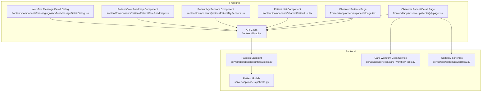
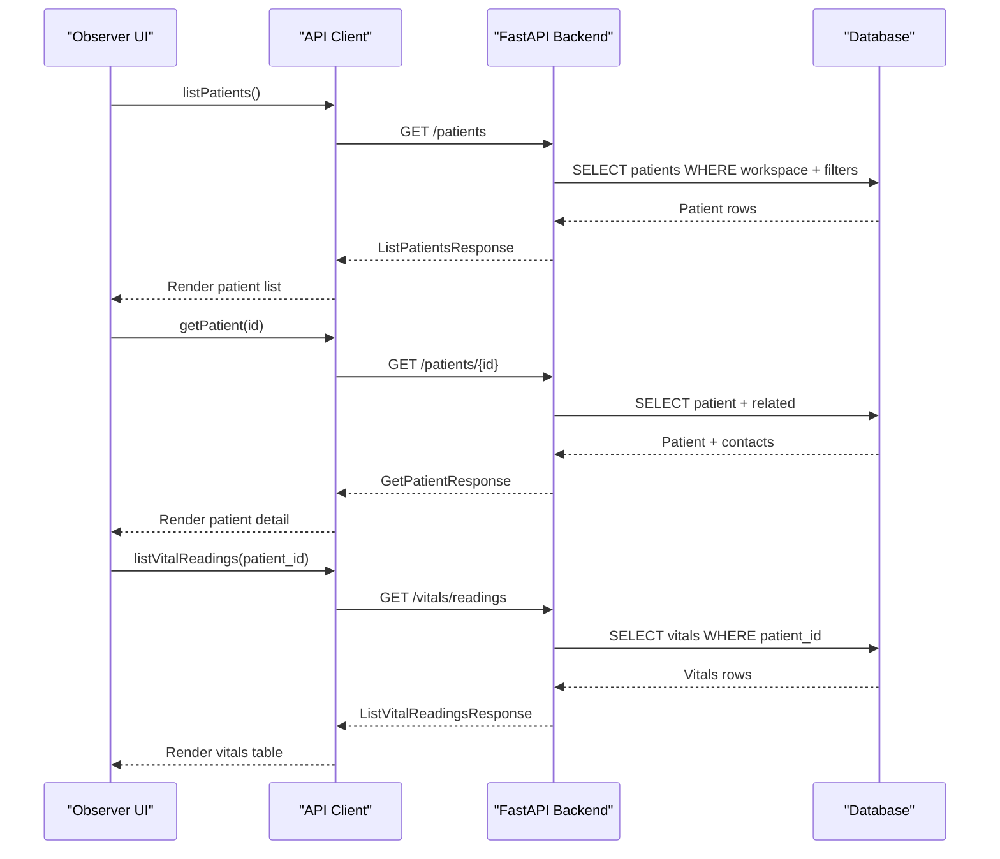
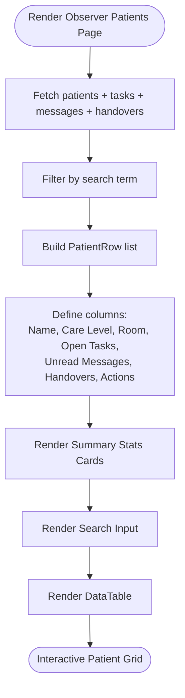
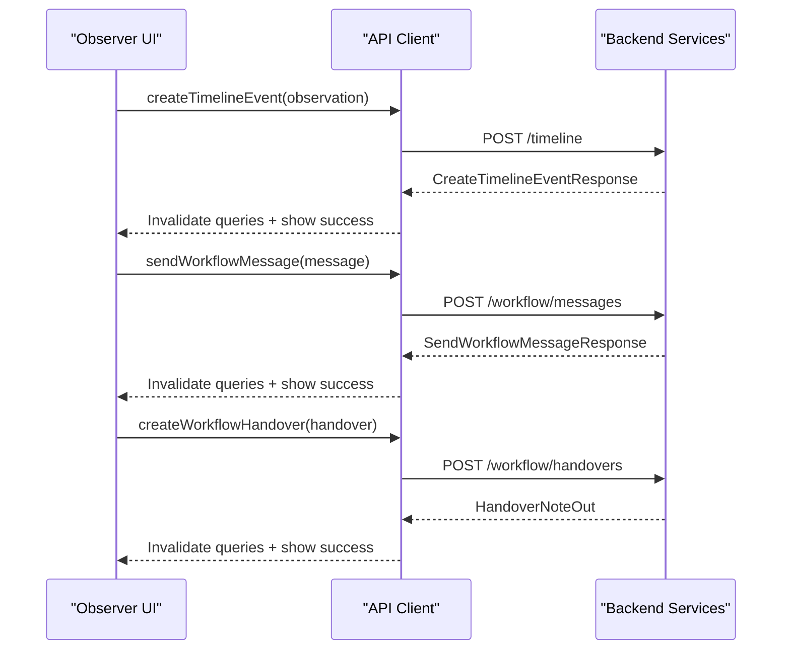
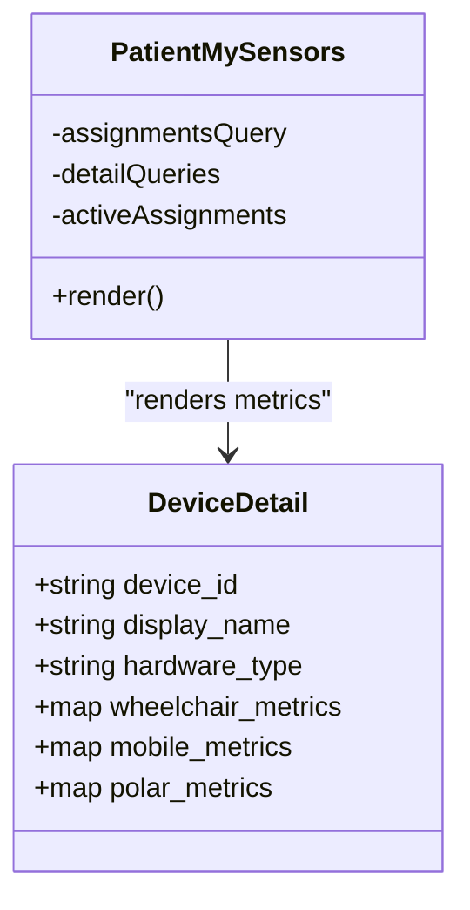
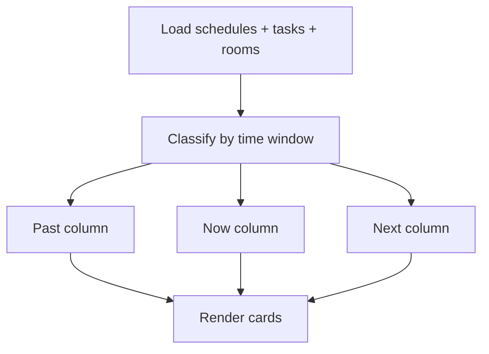
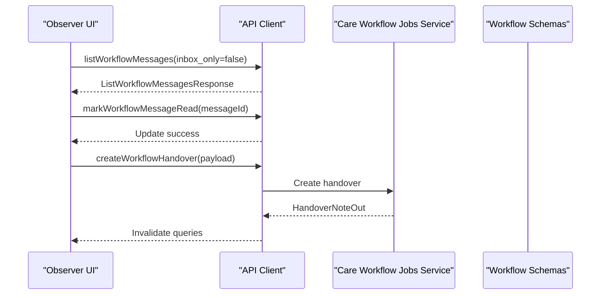
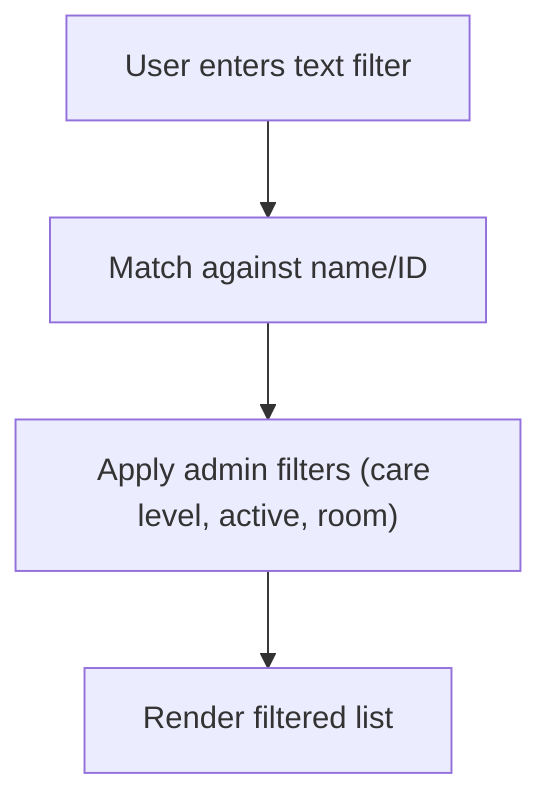
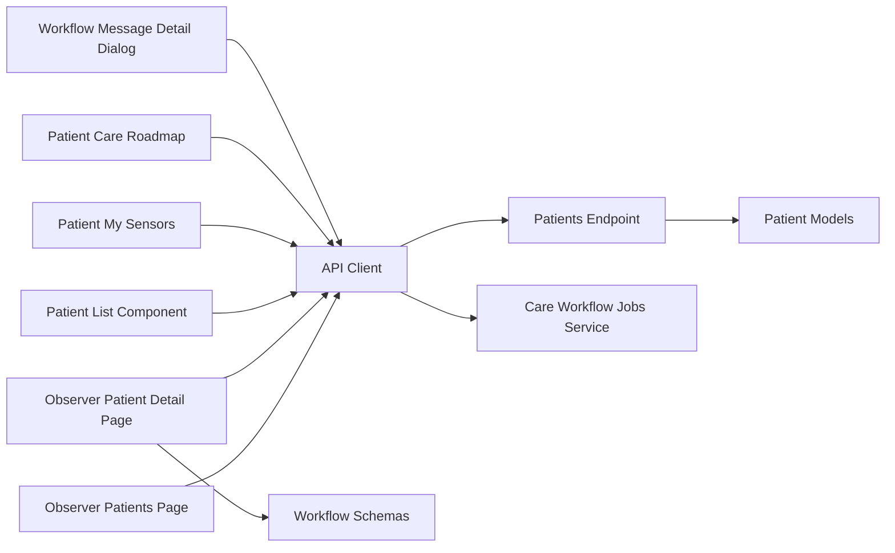

# Patient Management

<cite>
**Referenced Files in This Document**
- [Observer Patients Page](file://frontend/app/observer/patients/page.tsx)
- [Observer Patient Detail Page](file://frontend/app/observer/patients/[id]/page.tsx)
- [Patient List Component](file://frontend/components/shared/PatientList.tsx)
- [Patient My Sensors Component](file://frontend/components/patient/PatientMySensors.tsx)
- [Patient Care Roadmap Component](file://frontend/components/patient/PatientCareRoadmap.tsx)
- [Workflow Message Detail Dialog](file://frontend/components/messaging/WorkflowMessageDetailDialog.tsx)
- [API Client](file://frontend/lib/api.ts)
- [Patients Endpoint](file://server/app/api/endpoints/patients.py)
- [Patient Models](file://server/app/models/patients.py)
- [Care Workflow Jobs Service](file://server/app/services/care_workflow_jobs.py)
- [Workflow Schemas](file://server/app/schemas/workflow.py)
</cite>

## Table of Contents
1. [Introduction](#introduction)
2. [Project Structure](#project-structure)
3. [Core Components](#core-components)
4. [Architecture Overview](#architecture-overview)
5. [Detailed Component Analysis](#detailed-component-analysis)
6. [Dependency Analysis](#dependency-analysis)
7. [Performance Considerations](#performance-considerations)
8. [Troubleshooting Guide](#troubleshooting-guide)
9. [Conclusion](#conclusion)

## Introduction
This document describes the Observer Patient Management interface in the WheelSense Platform. It covers the patient overview and detail views, monitoring workflows, and care coordination features. The documentation explains the patient listing interface (filtering, care level indicators, alert status display, and quick action buttons), the patient detail page (medical records access, sensor monitoring integration, and care team coordination), and practical scenarios for observation procedures, care coordination workflows, and patient safety protocols.

## Project Structure
The Observer Patient Management interface spans the frontend Next.js application and the backend FastAPI service. Key areas include:
- Observer patient listing and detail pages
- Shared patient list component with filtering
- Patient monitoring integration (vitals, sensors)
- Care roadmap and workflow coordination
- Messaging and handover workflows
- Backend patient CRUD and device assignment APIs

**Diagram sources**
- [Observer Patients Page:31-257](file://frontend/app/observer/patients/page.tsx#L31-L257)
- [Observer Patient Detail Page:118-824](file://frontend/app/observer/patients/[id]/page.tsx#L118-L824)
- [Patient List Component:64-246](file://frontend/components/shared/PatientList.tsx#L64-L246)
- [Patient My Sensors Component:83-328](file://frontend/components/patient/PatientMySensors.tsx#L83-L328)
- [Patient Care Roadmap Component:65-293](file://frontend/components/patient/PatientCareRoadmap.tsx#L65-L293)
- [Workflow Message Detail Dialog:28-102](file://frontend/components/messaging/WorkflowMessageDetailDialog.tsx#L28-L102)
- [API Client:342-824](file://frontend/lib/api.ts#L342-L824)
- [Patients Endpoint:90-124](file://server/app/api/endpoints/patients.py#L90-L124)
- [Patient Models:24-148](file://server/app/models/patients.py#L24-L148)
- [Care Workflow Jobs Service:237-301](file://server/app/services/care_workflow_jobs.py#L237-L301)
- [Workflow Schemas:63-123](file://server/app/schemas/workflow.py#L63-L123)

**Section sources**
- [Observer Patients Page:31-257](file://frontend/app/observer/patients/page.tsx#L31-L257)
- [Observer Patient Detail Page:118-824](file://frontend/app/observer/patients/[id]/page.tsx#L118-L824)
- [Patient List Component:64-246](file://frontend/components/shared/PatientList.tsx#L64-L246)
- [Patient My Sensors Component:83-328](file://frontend/components/patient/PatientMySensors.tsx#L83-L328)
- [Patient Care Roadmap Component:65-293](file://frontend/components/patient/PatientCareRoadmap.tsx#L65-L293)
- [Workflow Message Detail Dialog:28-102](file://frontend/components/messaging/WorkflowMessageDetailDialog.tsx#L28-L102)
- [API Client:342-824](file://frontend/lib/api.ts#L342-L824)
- [Patients Endpoint:90-124](file://server/app/api/endpoints/patients.py#L90-L124)
- [Patient Models:24-148](file://server/app/models/patients.py#L24-L148)
- [Care Workflow Jobs Service:237-301](file://server/app/services/care_workflow_jobs.py#L237-L301)
- [Workflow Schemas:63-123](file://server/app/schemas/workflow.py#L63-L123)

## Core Components
- Observer Patients Listing: Provides a searchable, filterable grid of assigned patients with care level badges, room info, open tasks, unread messages, and recent handovers. Includes quick actions to open patient detail.
- Observer Patient Detail: Central hub for observations, messages, handovers, vitals, tasks, timeline, and messages. Integrates with sensor monitoring and care workflow systems.
- Shared Patient List: Reusable component supporting text search and administrative filters (care level, active status, room assignment).
- Patient Monitoring Integration: Displays real-time sensor metrics (wheelchair, mobile, Polar HR) and vitals readings.
- Care Roadmap: Shows past, current, and upcoming care schedules and tasks for a patient.
- Messaging and Handover Workflows: Enables sending role-targeted messages and submitting handover notes with visibility controls.

**Section sources**
- [Observer Patients Page:66-257](file://frontend/app/observer/patients/page.tsx#L66-L257)
- [Observer Patient Detail Page:118-824](file://frontend/app/observer/patients/[id]/page.tsx#L118-L824)
- [Patient List Component:64-246](file://frontend/components/shared/PatientList.tsx#L64-L246)
- [Patient My Sensors Component:83-328](file://frontend/components/patient/PatientMySensors.tsx#L83-L328)
- [Patient Care Roadmap Component:65-293](file://frontend/components/patient/PatientCareRoadmap.tsx#L65-L293)
- [Workflow Message Detail Dialog:28-102](file://frontend/components/messaging/WorkflowMessageDetailDialog.tsx#L28-L102)

## Architecture Overview
The Observer Patient Management interface follows a layered architecture:
- Frontend: Next.js pages and components using TanStack Query for data fetching, React for state, and custom UI components.
- API Layer: Typed API client wrapping HTTP requests to backend endpoints.
- Backend: FastAPI endpoints implementing patient CRUD, device assignment, and workflow operations; SQLAlchemy models define domain entities.

**Diagram sources**
- [Observer Patients Page:70-88](file://frontend/app/observer/patients/page.tsx#L70-L88)
- [Observer Patient Detail Page:134-174](file://frontend/app/observer/patients/[id]/page.tsx#L134-L174)
- [API Client:454-463](file://frontend/lib/api.ts#L454-L463)
- [Patients Endpoint:90-124](file://server/app/api/endpoints/patients.py#L90-L124)
- [Patient Models:24-83](file://server/app/models/patients.py#L24-L83)

## Detailed Component Analysis

### Observer Patients Listing
- Purpose: Display assigned patients with care level, room, open tasks, unread messages, and recent handovers; enable search and navigation to detail.
- Key features:
  - Search by name/nickname/ID
  - Care level badges with severity variants
  - Room assignment indicator
  - Summary cards for assigned patients, open tasks, unread messages, and recent handovers
  - Quick action to open patient detail
- Data sources: Patient list, workflow tasks, messages, and handovers fetched via API client.

**Diagram sources**
- [Observer Patients Page:66-257](file://frontend/app/observer/patients/page.tsx#L66-L257)

**Section sources**
- [Observer Patients Page:66-257](file://frontend/app/observer/patients/page.tsx#L66-L257)

### Observer Patient Detail
- Purpose: Single-pane view for observations, messages, handovers, vitals, tasks, timeline, and messages.
- Key features:
  - Observation logging (timeline events)
  - Role message composition and send
  - Handover note submission
  - Active alerts count
  - Recent vitals table with timestamps and sensor source
  - Task workflow board with priority/status and status updates
  - Timeline of events
  - Messages inbox with read/unread badges and preview dialog
  - Handover history
- Error handling: API errors mapped to localized messages; forbidden access handled gracefully.

**Diagram sources**
- [Observer Patient Detail Page:176-238](file://frontend/app/observer/patients/[id]/page.tsx#L176-L238)
- [API Client:541-545](file://frontend/lib/api.ts#L541-L545)
- [API Client:719-735](file://frontend/lib/api.ts#L719-L735)
- [API Client:728-735](file://frontend/lib/api.ts#L728-L735)

**Section sources**
- [Observer Patient Detail Page:118-824](file://frontend/app/observer/patients/[id]/page.tsx#L118-L824)
- [Workflow Message Detail Dialog:28-102](file://frontend/components/messaging/WorkflowMessageDetailDialog.tsx#L28-L102)

### Patient Monitoring Integration
- Purpose: Display real-time sensor metrics and vitals for a patient.
- Features:
  - Device assignment listing and per-device metrics (wheelchair distance/velocity/acceleration, mobile steps, Polar HR/PPG/sensor battery)
  - Battery percentage visualization
  - Fallback metrics when device-specific fields are unavailable
  - Auto-refresh for device details
- Data sources: Patient device assignments and device detail endpoints.

**Diagram sources**
- [Patient My Sensors Component:83-328](file://frontend/components/patient/PatientMySensors.tsx#L83-L328)

**Section sources**
- [Patient My Sensors Component:83-328](file://frontend/components/patient/PatientMySensors.tsx#L83-L328)
- [API Client:547-550](file://frontend/lib/api.ts#L547-L550)
- [API Client:617-618](file://frontend/lib/api.ts#L617-L618)

### Care Roadmap and Workflow Coordination
- Purpose: Provide a chronological view of past, current, and upcoming care activities for a patient.
- Features:
  - Classify schedules and tasks into past/now/next windows
  - Display room locations and statuses
  - Navigate to patient schedule
- Data sources: Workflow schedules and tasks, rooms.

**Diagram sources**
- [Patient Care Roadmap Component:65-132](file://frontend/components/patient/PatientCareRoadmap.tsx#L65-L132)

**Section sources**
- [Patient Care Roadmap Component:65-293](file://frontend/components/patient/PatientCareRoadmap.tsx#L65-L293)
- [API Client:765-775](file://frontend/lib/api.ts#L765-L775)
- [API Client:649-654](file://frontend/lib/api.ts#L649-L654)

### Messaging and Handover Workflows
- Purpose: Enable secure, role-targeted communication and structured handovers.
- Features:
  - Message preview trigger opens a modal with metadata and attachments
  - Mark messages as read
  - Submit handover notes targeting roles or users
- Backend integration: Workflow directives, schedules, tasks, and audit trails.

**Diagram sources**
- [Observer Patient Detail Page:164-174](file://frontend/app/observer/patients/[id]/page.tsx#L164-L174)
- [Observer Patient Detail Page:252-262](file://frontend/app/observer/patients/[id]/page.tsx#L252-L262)
- [Observer Patient Detail Page:219-238](file://frontend/app/observer/patients/[id]/page.tsx#L219-L238)
- [Care Workflow Jobs Service:237-301](file://server/app/services/care_workflow_jobs.py#L237-L301)
- [Workflow Schemas:198-218](file://server/app/schemas/workflow.py#L198-L218)

**Section sources**
- [Workflow Message Detail Dialog:28-102](file://frontend/components/messaging/WorkflowMessageDetailDialog.tsx#L28-L102)
- [Observer Patient Detail Page:164-262](file://frontend/app/observer/patients/[id]/page.tsx#L164-L262)
- [Care Workflow Jobs Service:237-301](file://server/app/services/care_workflow_jobs.py#L237-L301)
- [Workflow Schemas:198-218](file://server/app/schemas/workflow.py#L198-L218)

### Patient Listing Interface (Shared Component)
- Purpose: Reusable patient list with search and administrative filters.
- Features:
  - Text search across name, ID, and nickname
  - Administrative filters: care level, active status, room assignment
  - Responsive grid with care level badges and age display
- Use cases: Admin directories, quick-find, and cross-role patient discovery.

**Diagram sources**
- [Patient List Component:64-88](file://frontend/components/shared/PatientList.tsx#L64-L88)

**Section sources**
- [Patient List Component:64-246](file://frontend/components/shared/PatientList.tsx#L64-L246)

## Dependency Analysis
- Frontend depends on the API client for all backend interactions.
- Backend endpoints depend on SQLAlchemy models and services for workflow and patient operations.
- Observability: TanStack Query manages caching and invalidation across related queries (patients, vitals, tasks, messages, handovers).

**Diagram sources**
- [Observer Patients Page:31-257](file://frontend/app/observer/patients/page.tsx#L31-L257)
- [Observer Patient Detail Page:118-824](file://frontend/app/observer/patients/[id]/page.tsx#L118-L824)
- [Patient List Component:64-246](file://frontend/components/shared/PatientList.tsx#L64-L246)
- [Patient My Sensors Component:83-328](file://frontend/components/patient/PatientMySensors.tsx#L83-L328)
- [Patient Care Roadmap Component:65-293](file://frontend/components/patient/PatientCareRoadmap.tsx#L65-L293)
- [Workflow Message Detail Dialog:28-102](file://frontend/components/messaging/WorkflowMessageDetailDialog.tsx#L28-L102)
- [API Client:342-824](file://frontend/lib/api.ts#L342-L824)
- [Patients Endpoint:90-124](file://server/app/api/endpoints/patients.py#L90-L124)
- [Patient Models:24-148](file://server/app/models/patients.py#L24-L148)
- [Care Workflow Jobs Service:237-301](file://server/app/services/care_workflow_jobs.py#L237-L301)
- [Workflow Schemas:63-123](file://server/app/schemas/workflow.py#L63-L123)

**Section sources**
- [API Client:342-824](file://frontend/lib/api.ts#L342-L824)
- [Patients Endpoint:90-124](file://server/app/api/endpoints/patients.py#L90-L124)
- [Patient Models:24-148](file://server/app/models/patients.py#L24-L148)
- [Care Workflow Jobs Service:237-301](file://server/app/services/care_workflow_jobs.py#L237-L301)
- [Workflow Schemas:63-123](file://server/app/schemas/workflow.py#L63-L123)

## Performance Considerations
- Client-side filtering and sorting are optimized using useMemo to avoid unnecessary recalculations in patient lists and detail tables.
- TanStack Query handles caching and incremental updates; mutations invalidate related queries to keep views consistent.
- Device detail queries use refetch intervals to balance freshness and bandwidth.
- Large lists are paginated via limit parameters in API calls.

## Troubleshooting Guide
Common issues and resolutions:
- Unauthorized access: API client redirects to login on 401 responses; ensure proper authentication.
- Forbidden operations: Some actions return 403; verify role permissions and workspace visibility.
- Invalid patient ID: Detail page validates numeric IDs and displays a safe fallback UI.
- API timeouts: Requests enforce a timeout; retry after investigating network/backend health.
- Data inconsistencies: Use query invalidation after mutations to refresh dependent views.

**Section sources**
- [API Client:209-297](file://frontend/lib/api.ts#L209-L297)
- [Observer Patient Detail Page:87-97](file://frontend/app/observer/patients/[id]/page.tsx#L87-L97)
- [Observer Patient Detail Page:643-654](file://frontend/app/observer/patients/[id]/page.tsx#L643-L654)

## Conclusion
The Observer Patient Management interface integrates patient listing, monitoring, and care coordination into a cohesive workflow. It leverages typed APIs, reactive data fetching, and role-aware visibility to support safe, efficient care delivery. The components are modular and reusable, enabling consistent experiences across roles while maintaining strong separation of concerns between frontend and backend.