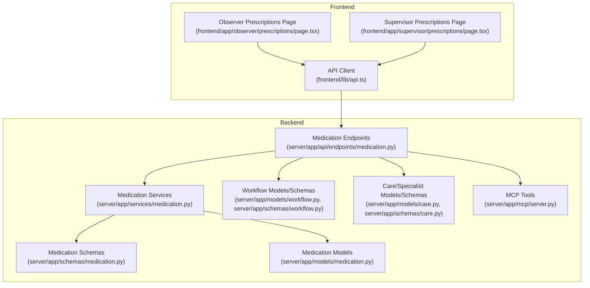
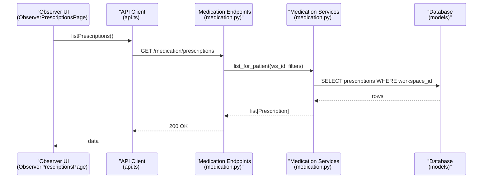
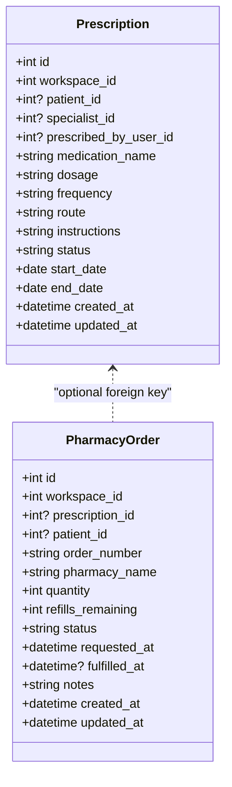
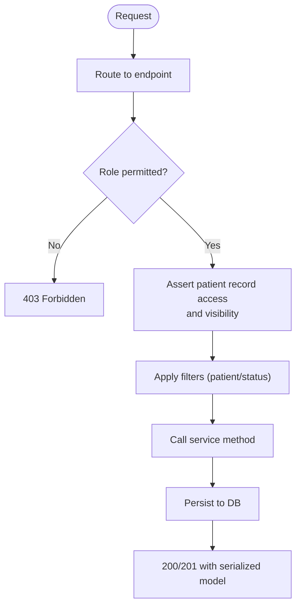
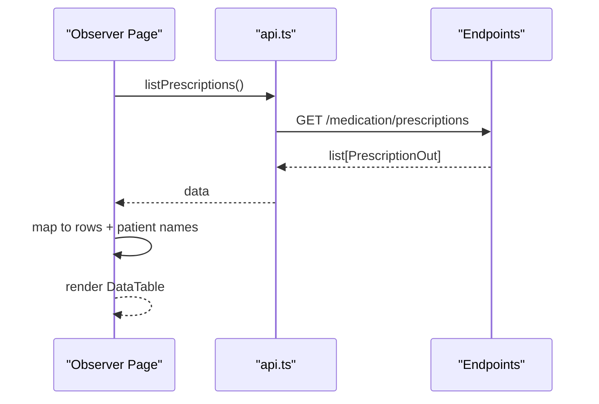
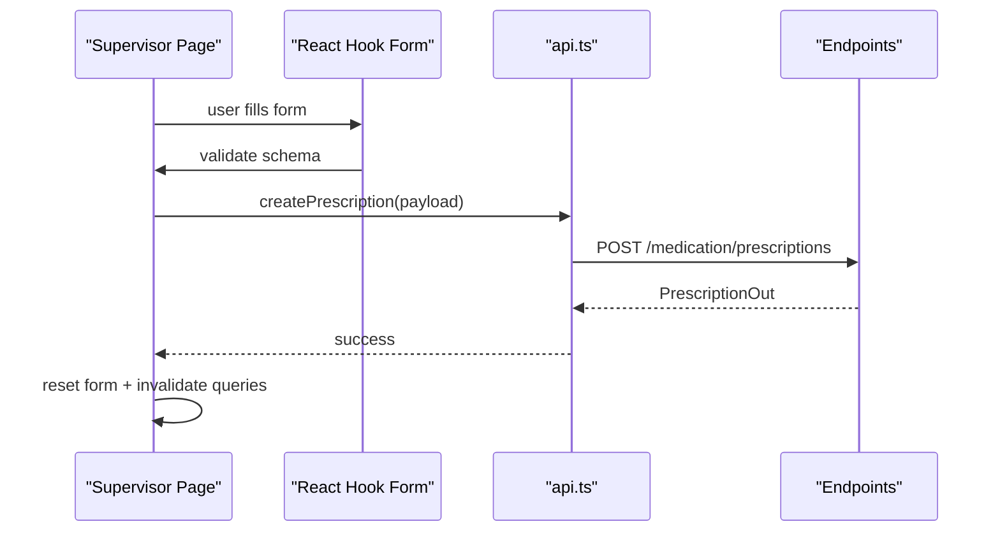
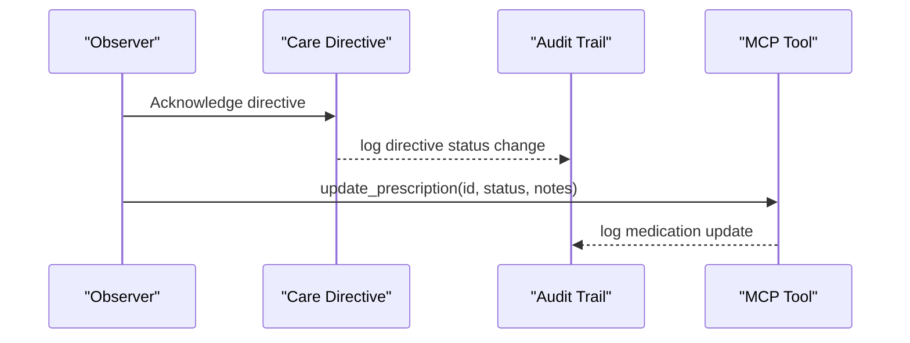
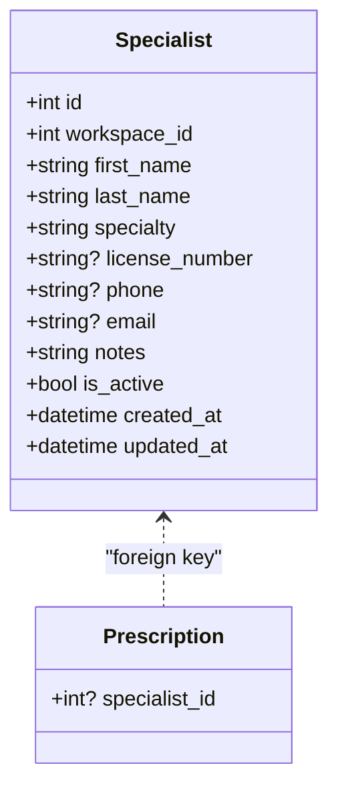
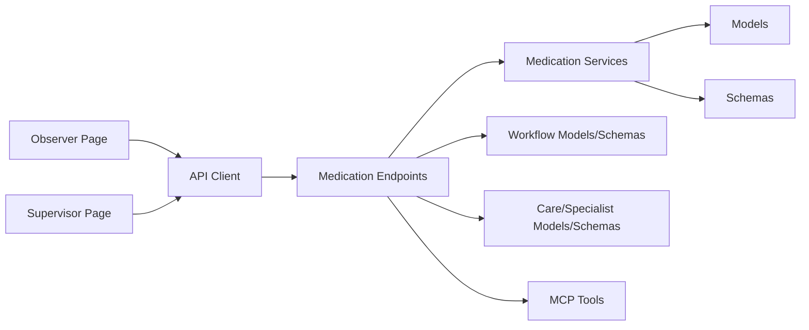

# Prescription Management

<cite>
**Referenced Files in This Document**
- [medication.py](file://server/app/models/medication.py)
- [medication.py](file://server/app/schemas/medication.py)
- [medication.py](file://server/app/services/medication.py)
- [medication.py](file://server/app/api/endpoints/medication.py)
- [page.tsx](file://frontend/app/observer/prescriptions/page.tsx)
- [page.tsx](file://frontend/app/supervisor/prescriptions/page.tsx)
- [api.ts](file://frontend/lib/api.ts)
- [0009-future-domains-floorplan-prescription-pharmacy.md](file://docs/adr/0009-future-domains-floorplan-prescription-pharmacy.md)
- [server.py](file://server/app/mcp/server.py)
- [care.py](file://server/app/models/care.py)
- [care.py](file://server/app/schemas/care.py)
- [workflow.py](file://server/app/models/workflow.py)
- [workflow.py](file://server/app/schemas/workflow.py)
- [seed_demo.py](file://server/scripts/seed_demo.py)
</cite>

## Table of Contents
1. [Introduction](#introduction)
2. [Project Structure](#project-structure)
3. [Core Components](#core-components)
4. [Architecture Overview](#architecture-overview)
5. [Detailed Component Analysis](#detailed-component-analysis)
6. [Dependency Analysis](#dependency-analysis)
7. [Performance Considerations](#performance-considerations)
8. [Troubleshooting Guide](#troubleshooting-guide)
9. [Conclusion](#conclusion)
10. [Appendices](#appendices)

## Introduction
This document describes the Observer Prescription Management system within the WheelSense Platform. It covers how prescriptions are created, tracked, reconciled, and supported during administration, and how observers monitor medications in alignment with supervisors and pharmacists. It also documents the integration points with patient monitoring and workflow systems, along with observer responsibilities for oversight, validation, and care coordination.

## Project Structure
The Prescription Management capability spans three layers:
- Backend domain: models, schemas, services, and FastAPI endpoints for prescriptions and pharmacy orders
- Frontend roles: observer and supervisor dashboards for viewing and creating prescriptions
- Integrations: workflow directives and audit trails, MCP tools, and pharmacist order fulfillment

**Diagram sources**
- [page.tsx:1-130](file://frontend/app/observer/prescriptions/page.tsx#L1-L130)
- [page.tsx:1-326](file://frontend/app/supervisor/prescriptions/page.tsx#L1-L326)
- [api.ts:810-818](file://frontend/lib/api.ts#L810-L818)
- [medication.py:1-169](file://server/app/api/endpoints/medication.py#L1-L169)
- [medication.py:1-108](file://server/app/services/medication.py#L1-L108)
- [medication.py:1-54](file://server/app/models/medication.py#L1-L54)
- [medication.py:1-89](file://server/app/schemas/medication.py#L1-L89)
- [workflow.py:1-197](file://server/app/models/workflow.py#L1-L197)
- [workflow.py:1-396](file://server/app/schemas/workflow.py#L1-L396)
- [care.py:1-56](file://server/app/models/care.py#L1-L56)
- [care.py:1-44](file://server/app/schemas/care.py#L1-L44)
- [server.py:2073-2110](file://server/app/mcp/server.py#L2073-L2110)

**Section sources**
- [medication.py:1-54](file://server/app/models/medication.py#L1-L54)
- [medication.py:1-89](file://server/app/schemas/medication.py#L1-L89)
- [medication.py:1-108](file://server/app/services/medication.py#L1-L108)
- [medication.py:1-169](file://server/app/api/endpoints/medication.py#L1-L169)
- [page.tsx:1-130](file://frontend/app/observer/prescriptions/page.tsx#L1-L130)
- [page.tsx:1-326](file://frontend/app/supervisor/prescriptions/page.tsx#L1-L326)
- [api.ts:810-818](file://frontend/lib/api.ts#L810-L818)
- [0009-future-domains-floorplan-prescription-pharmacy.md:1-42](file://docs/adr/0009-future-domains-floorplan-prescription-pharmacy.md#L1-L42)
- [server.py:2073-2110](file://server/app/mcp/server.py#L2073-L2110)
- [care.py:1-56](file://server/app/models/care.py#L1-L56)
- [care.py:1-44](file://server/app/schemas/care.py#L1-L44)
- [workflow.py:1-197](file://server/app/models/workflow.py#L1-L197)
- [workflow.py:1-396](file://server/app/schemas/workflow.py#L1-L396)

## Core Components
- Prescription lifecycle: creation, updates, status tracking, and visibility scoping
- Pharmacy order lifecycle: requests, fulfillment tracking, and status management
- Observer dashboard: list view of prescriptions with patient linkage and status badges
- Supervisor dashboard: create new prescriptions with validations and status defaults
- Workflow integration: directives and audit trails for coordinated care
- MCP tools: read/write capabilities for prescriptions exposed to AI tools
- Specialist directory: linking prescribing specialists to prescriptions

**Section sources**
- [medication.py:10-54](file://server/app/models/medication.py#L10-L54)
- [medication.py:11-89](file://server/app/schemas/medication.py#L11-L89)
- [medication.py:22-108](file://server/app/services/medication.py#L22-L108)
- [medication.py:35-169](file://server/app/api/endpoints/medication.py#L35-L169)
- [page.tsx:29-129](file://frontend/app/observer/prescriptions/page.tsx#L29-L129)
- [page.tsx:66-326](file://frontend/app/supervisor/prescriptions/page.tsx#L66-L326)
- [care.py:10-25](file://server/app/models/care.py#L10-L25)
- [care.py:11-44](file://server/app/schemas/care.py#L11-L44)
- [workflow.py:104-122](file://server/app/models/workflow.py#L104-L122)
- [workflow.py:219-261](file://server/app/schemas/workflow.py#L219-L261)
- [server.py:2073-2110](file://server/app/mcp/server.py#L2073-L2110)

## Architecture Overview
The system follows a layered architecture:
- UI: Next.js pages for observer and supervisor roles
- API: FastAPI endpoints under /medication for prescriptions and pharmacy orders
- Services: Business logic for listing, creating, and validating items
- Persistence: SQLAlchemy models for prescriptions and pharmacy orders
- Integrations: Workflow directives, audit trails, MCP tools, and specialist directory

**Diagram sources**
- [page.tsx:31-34](file://frontend/app/observer/prescriptions/page.tsx#L31-L34)
- [api.ts:810-818](file://frontend/lib/api.ts#L810-L818)
- [medication.py:35-55](file://server/app/api/endpoints/medication.py#L35-L55)
- [medication.py:22-44](file://server/app/services/medication.py#L22-L44)
- [medication.py:10-28](file://server/app/models/medication.py#L10-L28)

**Section sources**
- [medication.py:35-169](file://server/app/api/endpoints/medication.py#L35-L169)
- [medication.py:22-108](file://server/app/services/medication.py#L22-L108)
- [medication.py:10-54](file://server/app/models/medication.py#L10-L54)
- [api.ts:810-818](file://frontend/lib/api.ts#L810-L818)
- [page.tsx:29-129](file://frontend/app/observer/prescriptions/page.tsx#L29-L129)

## Detailed Component Analysis

### Backend Domain: Prescriptions and Pharmacy Orders
- Models define prescriptions and pharmacy orders with workspace scoping, patient links, statuses, and timestamps
- Schemas enforce validation for creation, updates, and request payloads
- Services encapsulate filtering and creation logic, including order number generation and validation
- Endpoints expose CRUD operations with role-based access and patient visibility checks

**Diagram sources**
- [medication.py:10-54](file://server/app/models/medication.py#L10-L54)

**Section sources**
- [medication.py:10-54](file://server/app/models/medication.py#L10-L54)
- [medication.py:11-89](file://server/app/schemas/medication.py#L11-L89)
- [medication.py:22-108](file://server/app/services/medication.py#L22-L108)
- [medication.py:35-169](file://server/app/api/endpoints/medication.py#L35-L169)

### API Endpoints: Roles, Filtering, and Access Control
- Endpoint roles: create/update for admin, head_nurse, supervisor; authenticated read for observers; patient requests for patients
- Filtering: supports patient_id, status, and pagination limits
- Visibility: enforced via workspace and patient access checks

**Diagram sources**
- [medication.py:35-169](file://server/app/api/endpoints/medication.py#L35-L169)

**Section sources**
- [medication.py:32-169](file://server/app/api/endpoints/medication.py#L32-L169)

### Frontend: Observer Dashboard
- Fetches all prescriptions for the current workspace and links to patient names
- Displays medication name, dosage, frequency, route, status, and creation time
- Uses translation keys and relative time formatting for readability

**Diagram sources**
- [page.tsx:31-74](file://frontend/app/observer/prescriptions/page.tsx#L31-L74)
- [api.ts:810-818](file://frontend/lib/api.ts#L810-L818)
- [medication.py:35-55](file://server/app/api/endpoints/medication.py#L35-L55)

**Section sources**
- [page.tsx:29-129](file://frontend/app/observer/prescriptions/page.tsx#L29-L129)
- [api.ts:810-818](file://frontend/lib/api.ts#L810-L818)

### Frontend: Supervisor Dashboard
- Provides a form to create new prescriptions with validations for required fields
- Submits to create endpoint and refreshes lists on success
- Displays existing prescriptions with patient and specialist identifiers

**Diagram sources**
- [page.tsx:85-123](file://frontend/app/supervisor/prescriptions/page.tsx#L85-L123)
- [api.ts:810-818](file://frontend/lib/api.ts#L810-L818)
- [medication.py:58-73](file://server/app/api/endpoints/medication.py#L58-L73)

**Section sources**
- [page.tsx:66-326](file://frontend/app/supervisor/prescriptions/page.tsx#L66-L326)
- [api.ts:810-818](file://frontend/lib/api.ts#L810-L818)

### Workflow Integration and Care Coordination
- Care directives can instruct observers to monitor specific aspects around medication administration
- Audit trail events track actions across domains for compliance and traceability
- MCP tools enable AI-assisted read/write operations on prescriptions

**Diagram sources**
- [workflow.py:104-122](file://server/app/models/workflow.py#L104-L122)
- [workflow.py:219-261](file://server/app/schemas/workflow.py#L219-L261)
- [server.py:2073-2110](file://server/app/mcp/server.py#L2073-L2110)

**Section sources**
- [workflow.py:104-122](file://server/app/models/workflow.py#L104-L122)
- [workflow.py:219-261](file://server/app/schemas/workflow.py#L219-L261)
- [server.py:2073-2110](file://server/app/mcp/server.py#L2073-L2110)

### Specialist Directory and Prescribing Authority
- Specialists are stored with identifying attributes and active status
- Prescriptions can link to a specialist, enabling auditability and care coordination

**Diagram sources**
- [care.py:10-25](file://server/app/models/care.py#L10-L25)
- [medication.py:16-17](file://server/app/models/medication.py#L16-L17)

**Section sources**
- [care.py:10-25](file://server/app/models/care.py#L10-L25)
- [care.py:11-44](file://server/app/schemas/care.py#L11-L44)
- [medication.py:16-17](file://server/app/models/medication.py#L16-L17)

## Dependency Analysis
- UI depends on API client for medication endpoints
- Endpoints depend on services for business logic and on models for persistence
- Services depend on schemas for validation and on SQLAlchemy for queries
- Endpoints integrate with workflow and care models for richer care context
- MCP tools depend on services and enforce scopes for read/write operations

**Diagram sources**
- [page.tsx:1-130](file://frontend/app/observer/prescriptions/page.tsx#L1-L130)
- [page.tsx:1-326](file://frontend/app/supervisor/prescriptions/page.tsx#L1-L326)
- [api.ts:810-818](file://frontend/lib/api.ts#L810-L818)
- [medication.py:1-169](file://server/app/api/endpoints/medication.py#L1-L169)
- [medication.py:1-108](file://server/app/services/medication.py#L1-L108)
- [medication.py:1-54](file://server/app/models/medication.py#L1-L54)
- [medication.py:1-89](file://server/app/schemas/medication.py#L1-L89)
- [workflow.py:1-197](file://server/app/models/workflow.py#L1-L197)
- [workflow.py:1-396](file://server/app/schemas/workflow.py#L1-L396)
- [care.py:1-56](file://server/app/models/care.py#L1-L56)
- [care.py:1-44](file://server/app/schemas/care.py#L1-L44)
- [server.py:2073-2110](file://server/app/mcp/server.py#L2073-L2110)

**Section sources**
- [medication.py:1-169](file://server/app/api/endpoints/medication.py#L1-L169)
- [medication.py:1-108](file://server/app/services/medication.py#L1-L108)
- [medication.py:1-54](file://server/app/models/medication.py#L1-L54)
- [medication.py:1-89](file://server/app/schemas/medication.py#L1-L89)
- [workflow.py:1-197](file://server/app/models/workflow.py#L1-L197)
- [workflow.py:1-396](file://server/app/schemas/workflow.py#L1-L396)
- [care.py:1-56](file://server/app/models/care.py#L1-L56)
- [care.py:1-44](file://server/app/schemas/care.py#L1-L44)
- [server.py:2073-2110](file://server/app/mcp/server.py#L2073-L2110)

## Performance Considerations
- Queries are limited and filtered by workspace, optional patient, and status to reduce result sets
- Indexes on workspace_id, patient_id, and status improve lookup performance
- Pagination limits prevent unbounded loads; consider further tuning based on workload

[No sources needed since this section provides general guidance]

## Troubleshooting Guide
Common issues and resolutions:
- Access denied: Ensure the current user has appropriate role and patient access for the requested records
- Validation errors: Confirm required fields (medication name, dosage, frequency) and allowed status values
- Not found errors: Verify resource IDs and workspace scoping
- Duplicate order numbers: Order number generation uses timestamp and random token; rechecks occur at service level

**Section sources**
- [medication.py:43-47](file://server/app/api/endpoints/medication.py#L43-L47)
- [medication.py:11-38](file://server/app/schemas/medication.py#L11-L38)
- [medication.py:84-103](file://server/app/services/medication.py#L84-L103)

## Conclusion
The Prescription Management system integrates robust backend models and services with role-aware UIs for observers and supervisors. It supports safe, auditable workflows for medication oversight, reconciliation, and administration, while connecting to workflow directives, audit trails, and MCP tools for broader care coordination.

[No sources needed since this section summarizes without analyzing specific files]

## Appendices

### Appendix A: Example Scenarios and Workflows
- Scenario 1: Observer monitors active prescriptions and flags anomalies
  - Observer lists prescriptions and cross-references with patient vitals and directives
- Scenario 2: Supervisor creates a new prescription and assigns a specialist
  - Supervisor submits validated form; system persists with prescribed_by_user_id and status active
- Scenario 3: Patient requests a pharmacy refill
  - Patient endpoint validates active status and generates a unique order number
- Scenario 4: Medication reconciliation during shift handover
  - Workflow directive instructs observer to reconcile meds vs. chart; audit trail captures discrepancies

**Section sources**
- [page.tsx:29-129](file://frontend/app/observer/prescriptions/page.tsx#L29-L129)
- [page.tsx:66-326](file://frontend/app/supervisor/prescriptions/page.tsx#L66-L326)
- [medication.py:131-152](file://server/app/api/endpoints/medication.py#L131-L152)
- [workflow.py:104-122](file://server/app/models/workflow.py#L104-L122)
- [seed_demo.py:1155-1185](file://server/scripts/seed_demo.py#L1155-L1185)

### Appendix B: Quality Assurance Processes
- Role-based access control ensures only authorized users can create/update
- Schema validation enforces data integrity at ingestion
- Audit trail events record actions across domains for compliance
- MCP tools provide controlled AI-assisted operations with scopes

**Section sources**
- [medication.py:32-32](file://server/app/api/endpoints/medication.py#L32-L32)
- [medication.py:11-89](file://server/app/schemas/medication.py#L11-L89)
- [workflow.py:180-196](file://server/app/models/workflow.py#L180-L196)
- [server.py:2073-2110](file://server/app/mcp/server.py#L2073-L2110)