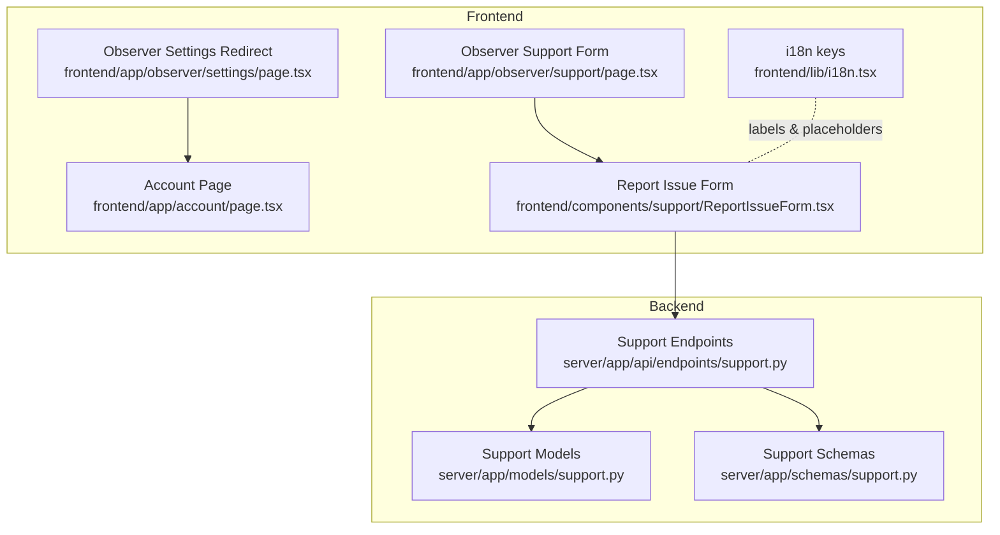
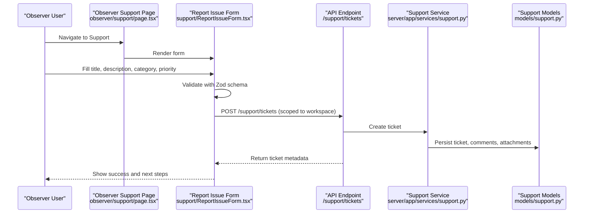
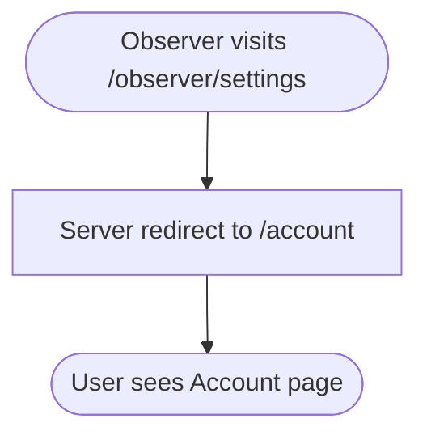
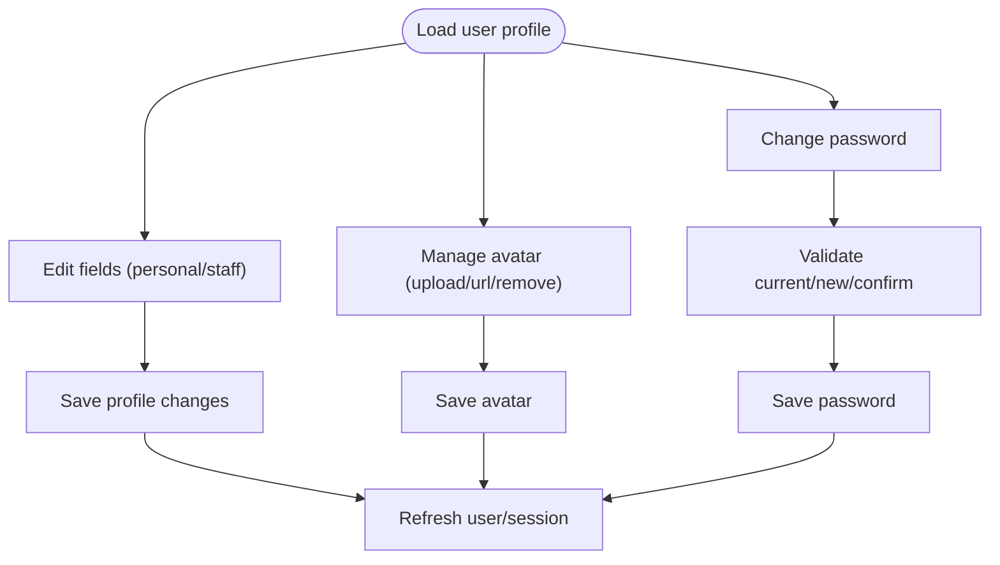
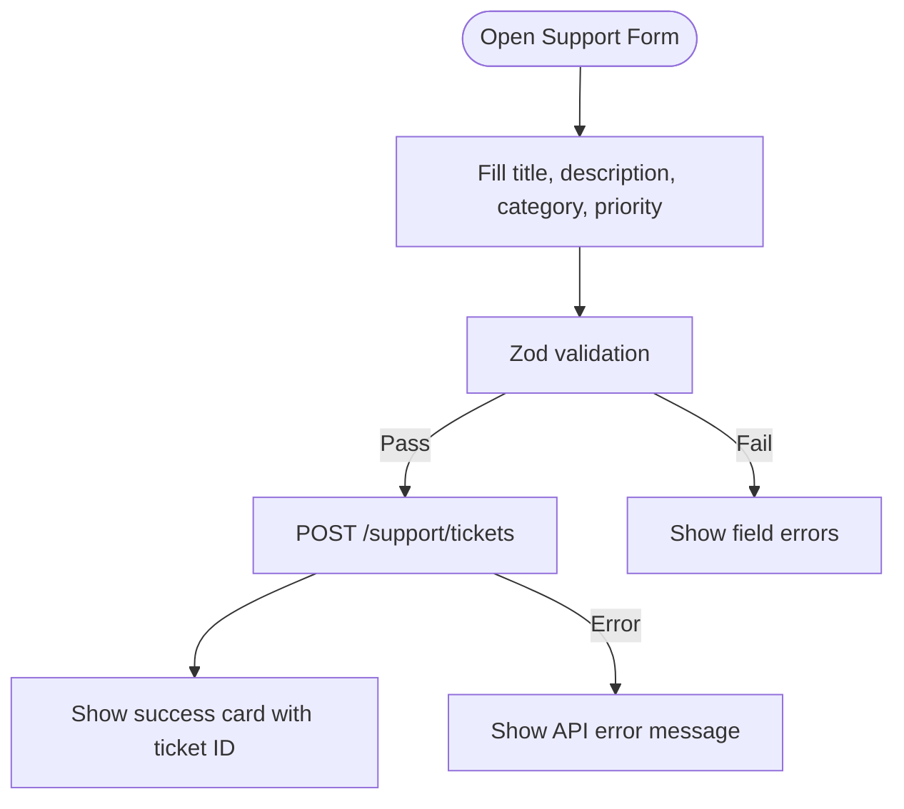
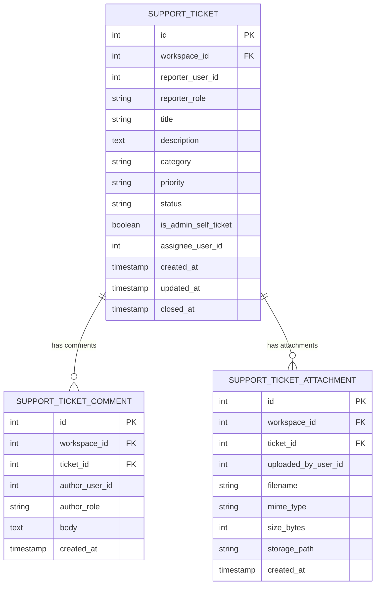
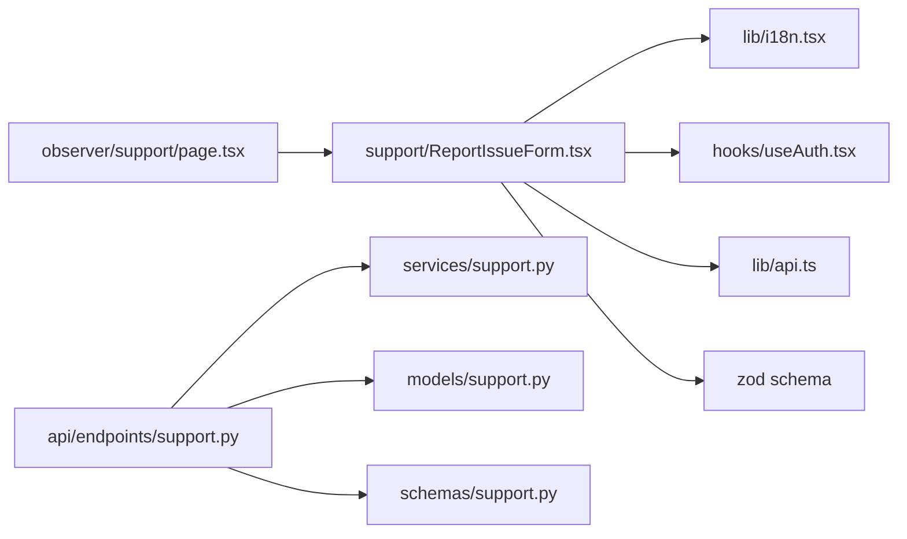

# Settings & Support

<cite>
**Referenced Files in This Document**
- [observer/settings/page.tsx](file://frontend/app/observer/settings/page.tsx)
- [observer/support/page.tsx](file://frontend/app/observer/support/page.tsx)
- [account/page.tsx](file://frontend/app/account/page.tsx)
- [support/ReportIssueForm.tsx](file://frontend/components/support/ReportIssueForm.tsx)
- [admin/settings/page.tsx](file://frontend/app/admin/settings/page.tsx)
- [api/endpoints/support.py](file://server/app/api/endpoints/support.py)
- [models/support.py](file://server/app/models/support.py)
- [schemas/support.py](file://server/app/schemas/support.py)
- [lib/i18n.tsx](file://frontend/lib/i18n.tsx)
</cite>

## Table of Contents
1. [Introduction](#introduction)
2. [Project Structure](#project-structure)
3. [Core Components](#core-components)
4. [Architecture Overview](#architecture-overview)
5. [Detailed Component Analysis](#detailed-component-analysis)
6. [Dependency Analysis](#dependency-analysis)
7. [Performance Considerations](#performance-considerations)
8. [Troubleshooting Guide](#troubleshooting-guide)
9. [Conclusion](#conclusion)

## Introduction
This document explains the Observer Settings and Support interfaces in the WheelSense Platform. It covers:
- Observer settings redirection to the unified Account page
- User preferences configuration (profile, avatar, password)
- Support ticket submission and lifecycle
- Internationalization and form validation used across the system
- Practical examples and troubleshooting guidance

## Project Structure
The Settings and Support surfaces are role-scoped and share common backend support infrastructure:
- Frontend pages for Observer Settings and Support
- Unified Account page for user preferences
- Support form component for submitting tickets
- Backend endpoints and models for support tickets, comments, and attachments

**Diagram sources**
- [observer/settings/page.tsx:1-6](file://frontend/app/observer/settings/page.tsx#L1-L6)
- [observer/support/page.tsx:1-6](file://frontend/app/observer/support/page.tsx#L1-L6)
- [account/page.tsx:1-810](file://frontend/app/account/page.tsx#L1-L810)
- [support/ReportIssueForm.tsx:1-201](file://frontend/components/support/ReportIssueForm.tsx#L1-L201)
- [api/endpoints/support.py:1-170](file://server/app/api/endpoints/support.py#L1-L170)
- [models/support.py:1-98](file://server/app/models/support.py#L1-L98)
- [schemas/support.py:1-76](file://server/app/schemas/support.py#L1-L76)
- [lib/i18n.tsx:1-800](file://frontend/lib/i18n.tsx#L1-L800)

**Section sources**
- [observer/settings/page.tsx:1-6](file://frontend/app/observer/settings/page.tsx#L1-L6)
- [observer/support/page.tsx:1-6](file://frontend/app/observer/support/page.tsx#L1-L6)
- [account/page.tsx:1-810](file://frontend/app/account/page.tsx#L1-L810)
- [support/ReportIssueForm.tsx:1-201](file://frontend/components/support/ReportIssueForm.tsx#L1-L201)
- [api/endpoints/support.py:1-170](file://server/app/api/endpoints/support.py#L1-L170)
- [models/support.py:1-98](file://server/app/models/support.py#L1-L98)
- [schemas/support.py:1-76](file://server/app/schemas/support.py#L1-L76)
- [lib/i18n.tsx:1-800](file://frontend/lib/i18n.tsx#L1-L800)

## Core Components
- Observer Settings Redirect: Routes the Observer role to the unified Account page for profile and preferences.
- Account Page: Centralized surface for editing profile fields, staff profile fields (when applicable), avatar, and changing passwords.
- Support Form: A validated form enabling users to submit tickets with title, description, category, and priority.
- Backend Support API: Provides endpoints to list, create, update, fetch, and attach files to support tickets.

Examples of usage:
- Accessing Observer Settings redirects to Account to manage preferences.
- Submitting a support ticket via the form posts to the backend and returns a success state with ticket metadata.

**Section sources**
- [observer/settings/page.tsx:1-6](file://frontend/app/observer/settings/page.tsx#L1-L6)
- [account/page.tsx:93-765](file://frontend/app/account/page.tsx#L93-L765)
- [support/ReportIssueForm.tsx:37-201](file://frontend/components/support/ReportIssueForm.tsx#L37-L201)
- [api/endpoints/support.py:62-170](file://server/app/api/endpoints/support.py#L62-L170)

## Architecture Overview
The Observer Support flow integrates frontend validation and internationalization with backend persistence and response modeling.

**Diagram sources**
- [observer/support/page.tsx:1-6](file://frontend/app/observer/support/page.tsx#L1-L6)
- [support/ReportIssueForm.tsx:37-87](file://frontend/components/support/ReportIssueForm.tsx#L37-L87)
- [api/endpoints/support.py:89-98](file://server/app/api/endpoints/support.py#L89-L98)
- [models/support.py:10-98](file://server/app/models/support.py#L10-L98)

## Detailed Component Analysis

### Observer Settings Redirection
- Purpose: Provide a dedicated route for the Observer role that redirects to the unified Account page.
- Behavior: On visit, the page performs a server-side redirect to the Account page.
- Impact: Ensures consistent access to user preferences regardless of the entry point.

**Diagram sources**
- [observer/settings/page.tsx:3-5](file://frontend/app/observer/settings/page.tsx#L3-L5)

**Section sources**
- [observer/settings/page.tsx:1-6](file://frontend/app/observer/settings/page.tsx#L1-L6)

### Account Page: User Preferences and Security
- Profile editing: Username, email, phone; optional staff profile fields when linked.
- Avatar management: Upload from device or set via URL; supports resizing and validation.
- Password change: Enforces minimum length and confirmation checks.
- Internationalization: Uses i18n keys for labels and hints.

**Diagram sources**
- [account/page.tsx:140-417](file://frontend/app/account/page.tsx#L140-L417)

**Section sources**
- [account/page.tsx:93-765](file://frontend/app/account/page.tsx#L93-L765)
- [lib/i18n.tsx:1-800](file://frontend/lib/i18n.tsx#L1-L800)

### Support Form: Ticket Submission
- Fields: Title (min length), description, category (bug/general/device), priority (low/normal/high/critical).
- Validation: Zod schema ensures correctness before submission.
- Submission: Posts to a workspace-scoped endpoint; handles success and error states.
- Feedback: Displays success card with ticket ID and guidance.

**Diagram sources**
- [support/ReportIssueForm.tsx:45-87](file://frontend/components/support/ReportIssueForm.tsx#L45-L87)

**Section sources**
- [support/ReportIssueForm.tsx:37-201](file://frontend/components/support/ReportIssueForm.tsx#L37-L201)
- [lib/i18n.tsx:1-800](file://frontend/lib/i18n.tsx#L1-L800)

### Backend Support API and Data Model
- Endpoints:
  - GET /support/tickets: List tickets with pagination and status filtering.
  - POST /support/tickets: Create a ticket.
  - GET /support/tickets/{ticket_id}: Retrieve a ticket with comments and attachments.
  - PATCH /support/tickets/{ticket_id}: Update ticket fields (status, priority, etc.).
  - POST /support/tickets/{ticket_id}/comments: Add a comment.
  - POST /support/tickets/{ticket_id}/attachments: Upload an attachment.
  - GET /support/tickets/{ticket_id}/attachments/{attachment_id}/content: Download an attachment.
- Models:
  - SupportTicket: Tracks title, description, category, priority, status, timestamps, and assignee.
  - SupportTicketComment: Stores author role, body, and timestamps.
  - SupportTicketAttachment: Stores filename, MIME type, size, and storage path.

**Diagram sources**
- [models/support.py:10-98](file://server/app/models/support.py#L10-L98)

**Section sources**
- [api/endpoints/support.py:62-170](file://server/app/api/endpoints/support.py#L62-L170)
- [models/support.py:10-98](file://server/app/models/support.py#L10-L98)
- [schemas/support.py:10-76](file://server/app/schemas/support.py#L10-L76)

### Admin Settings Surface
- Admin Settings page uses a client component wrapper with a suspense fallback while loading.
- Intended to host administrative configuration panels (e.g., AI settings, server settings) referenced elsewhere in the frontend.

**Section sources**
- [admin/settings/page.tsx:1-19](file://frontend/app/admin/settings/page.tsx#L1-L19)

## Dependency Analysis
- Frontend dependencies:
  - Observer Support page depends on the Report Issue Form component.
  - Report Issue Form depends on:
    - i18n for labels and messages
    - Authentication hook for user context
    - API client for network requests
    - Zod for form validation
- Backend dependencies:
  - Support endpoints depend on:
    - Workspace-scoped context
    - SupportService for business logic
    - SQLAlchemy models for persistence
    - Pydantic schemas for request/response validation

**Diagram sources**
- [observer/support/page.tsx:1-6](file://frontend/app/observer/support/page.tsx#L1-L6)
- [support/ReportIssueForm.tsx:1-201](file://frontend/components/support/ReportIssueForm.tsx#L1-L201)
- [lib/i18n.tsx:1-800](file://frontend/lib/i18n.tsx#L1-L800)
- [api/endpoints/support.py:1-170](file://server/app/api/endpoints/support.py#L1-L170)
- [models/support.py:1-98](file://server/app/models/support.py#L1-L98)
- [schemas/support.py:1-76](file://server/app/schemas/support.py#L1-L76)

**Section sources**
- [support/ReportIssueForm.tsx:1-201](file://frontend/components/support/ReportIssueForm.tsx#L1-L201)
- [api/endpoints/support.py:1-170](file://server/app/api/endpoints/support.py#L1-L170)

## Performance Considerations
- Form validation occurs client-side with Zod to reduce unnecessary network requests.
- Avatar handling resizes and normalizes images before upload to minimize storage overhead.
- Backend endpoints support pagination and filtering to keep lists manageable.

## Troubleshooting Guide
Common issues and resolutions:
- Support form submission fails:
  - Verify the workspace scope is resolved and the user is authenticated.
  - Check for validation errors returned by the form (field-specific messages).
  - Confirm the API endpoint responds with an error and inspect the error message.
- Avatar upload problems:
  - Ensure the file is an image and meets size constraints.
  - Avoid data URLs; use supported image URLs or upload from device.
  - Revoke local previews after successful save to free memory.
- Password change failures:
  - Ensure the current password is provided and the new password meets minimum length.
  - Confirm the new password matches the confirmation field.

**Section sources**
- [support/ReportIssueForm.tsx:66-87](file://frontend/components/support/ReportIssueForm.tsx#L66-L87)
- [account/page.tsx:207-314](file://frontend/app/account/page.tsx#L207-L314)
- [account/page.tsx:389-417](file://frontend/app/account/page.tsx#L389-L417)

## Conclusion
The Observer Settings and Support interfaces integrate a streamlined settings surface and a robust support ticketing system. Users can manage preferences centrally and submit tickets with validation and internationalization support. The backend provides a clear contract for listing, creating, updating, and attaching files to tickets, ensuring maintainable and scalable operations.