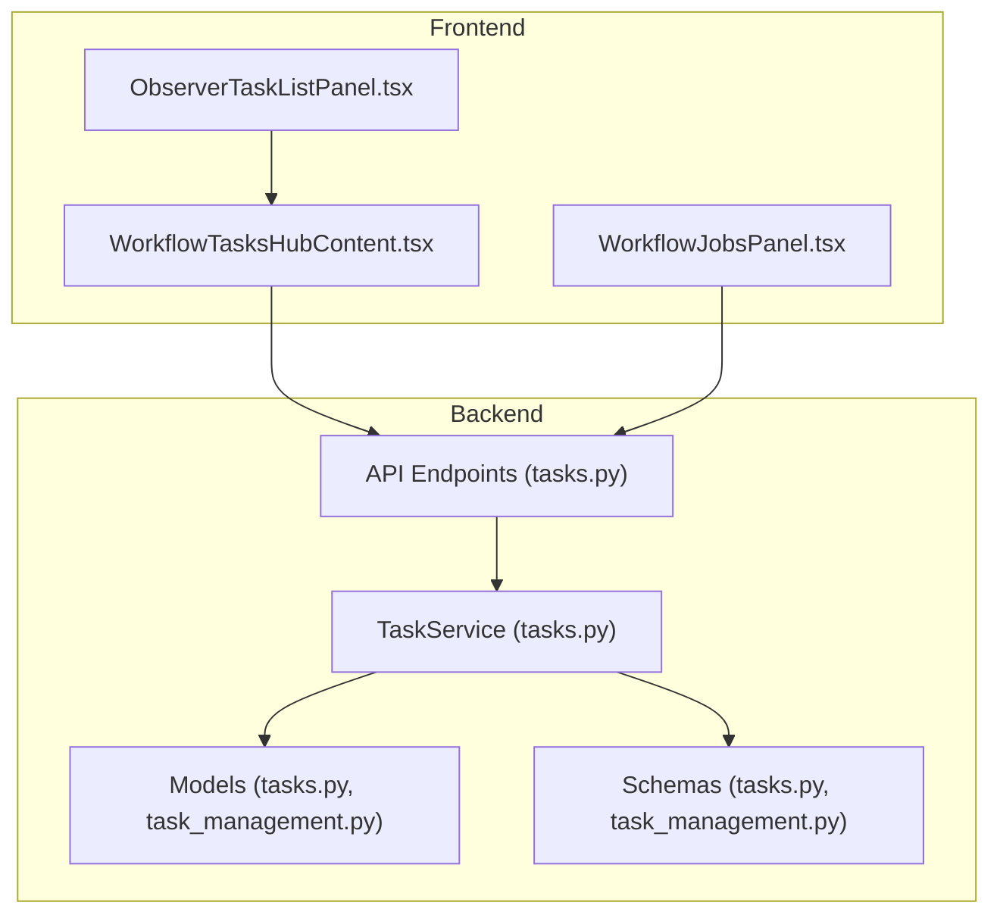
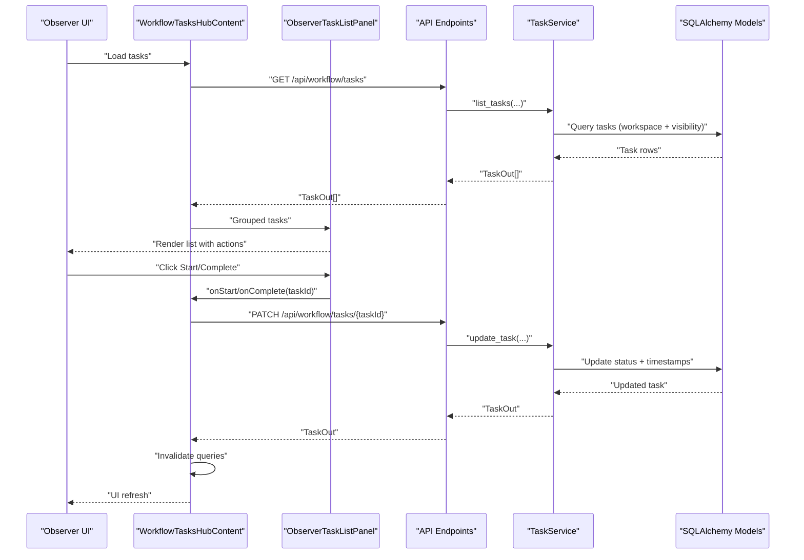
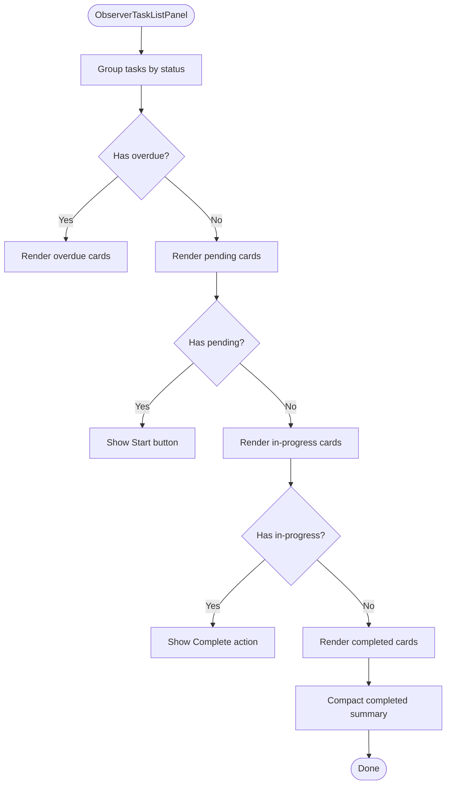
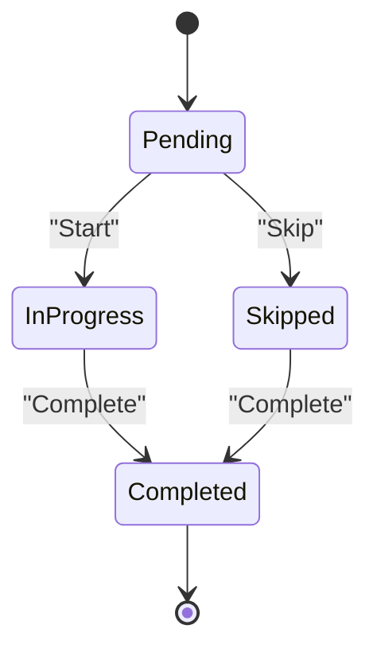
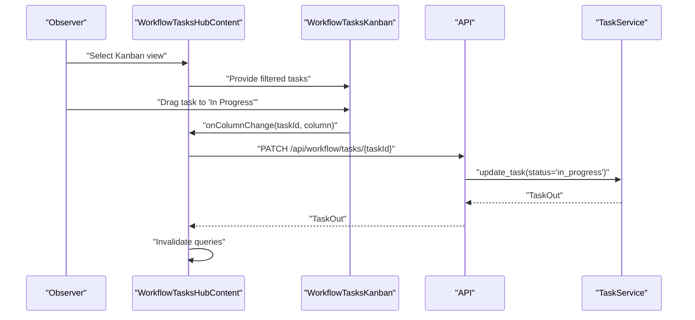
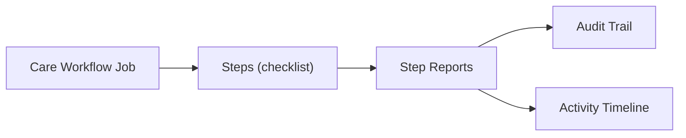
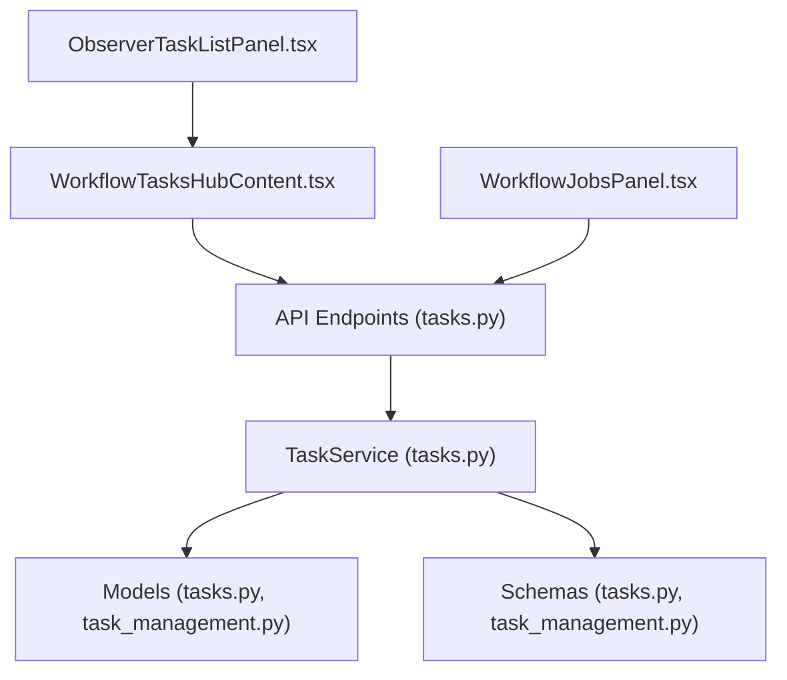

# Task Management & Workflow

<cite>
**Referenced Files in This Document**
- [ObserverTaskListPanel.tsx](file://frontend/components/workflow/ObserverTaskListPanel.tsx)
- [WorkflowTasksHubContent.tsx](file://frontend/components/workflow/WorkflowTasksHubContent.tsx)
- [WorkflowJobsPanel.tsx](file://frontend/components/workflow/WorkflowJobsPanel.tsx)
- [tasks.py](file://server/app/services/tasks.py)
- [task_management.py](file://server/app/models/task_management.py)
- [task_management.py](file://server/app/schemas/task_management.py)
- [tasks.py](file://server/app/api/endpoints/tasks.py)
- [tasks.py](file://server/app/models/tasks.py)
- [tasks.py](file://server/app/schemas/tasks.py)
- [test_workflow_domains.py](file://server/tests/test_workflow_domains.py)
- [test_role_workflow_chat.py](file://server/tests/e2e/test_role_workflow_chat.py)
</cite>

## Table of Contents
1. [Introduction](#introduction)
2. [Project Structure](#project-structure)
3. [Core Components](#core-components)
4. [Architecture Overview](#architecture-overview)
5. [Detailed Component Analysis](#detailed-component-analysis)
6. [Dependency Analysis](#dependency-analysis)
7. [Performance Considerations](#performance-considerations)
8. [Troubleshooting Guide](#troubleshooting-guide)
9. [Conclusion](#conclusion)
10. [Appendices](#appendices)

## Introduction
This document describes the Observer Task Management & Workflow system in the WheelSense Platform. It focuses on how tasks are assigned, executed, tracked, and completed by observers, and how the ObserverTaskListPanel integrates with broader workflow domains. It also covers delegation procedures, progress monitoring, and integration with care delivery systems. Examples of typical scenarios, quality assurance checks, and performance tracking methods are included to guide implementation and maintenance.

## Project Structure
The task management and workflow system spans both frontend and backend:

- Frontend:
  - ObserverTaskListPanel renders observer-specific task lists grouped by status and due date.
  - WorkflowTasksHubContent orchestrates task views (jobs, calendar, kanban, list) and coordinates observer actions.
  - WorkflowJobsPanel manages care workflow jobs and step-level execution.

- Backend:
  - API endpoints expose task listing, updates, reporting, and routine resets.
  - Services encapsulate business logic for task CRUD, visibility, and reporting submission.
  - SQLAlchemy models define unified task and report schemas, plus routine task templates/logs.

**Diagram sources**
- [ObserverTaskListPanel.tsx:1-296](file://frontend/components/workflow/ObserverTaskListPanel.tsx#L1-L296)
- [WorkflowTasksHubContent.tsx:1-569](file://frontend/components/workflow/WorkflowTasksHubContent.tsx#L1-L569)
- [WorkflowJobsPanel.tsx:1-487](file://frontend/components/workflow/WorkflowJobsPanel.tsx#L1-L487)
- [tasks.py:1-266](file://server/app/api/endpoints/tasks.py#L1-L266)
- [tasks.py:1-690](file://server/app/services/tasks.py#L1-L690)
- [tasks.py:1-123](file://server/app/models/tasks.py#L1-L123)
- [task_management.py:1-129](file://server/app/models/task_management.py#L1-L129)

**Section sources**
- [ObserverTaskListPanel.tsx:1-296](file://frontend/components/workflow/ObserverTaskListPanel.tsx#L1-L296)
- [WorkflowTasksHubContent.tsx:1-569](file://frontend/components/workflow/WorkflowTasksHubContent.tsx#L1-L569)
- [WorkflowJobsPanel.tsx:1-487](file://frontend/components/workflow/WorkflowJobsPanel.tsx#L1-L487)
- [tasks.py:1-266](file://server/app/api/endpoints/tasks.py#L1-L266)
- [tasks.py:1-690](file://server/app/services/tasks.py#L1-L690)
- [tasks.py:1-123](file://server/app/models/tasks.py#L1-L123)
- [task_management.py:1-129](file://server/app/models/task_management.py#L1-L129)

## Core Components
- ObserverTaskListPanel
  - Renders grouped tasks for observers: overdue, pending, in-progress, and completed.
  - Provides inline actions to start tasks (pending → in-progress) and mark tasks complete (in-progress → completed).
  - Displays due dates, priorities, and compact summaries for completed tasks.

- WorkflowTasksHubContent
  - Central hub for observer task views, including a list layout powered by ObserverTaskListPanel.
  - Supports filtering by patient and status, calendar and kanban layouts, and quick actions to mark tasks in-progress or completed.
  - Coordinates invalidation of related queries after task updates.

- WorkflowJobsPanel
  - Manages care workflow jobs and step-level execution, including attachments and reports.
  - Integrates with task creation via workflow jobs and supports job completion.

- TaskService and API
  - Implements task listing, creation, updates, deletion, reporting submission, and routine task reset.
  - Enforces workspace scoping and visibility rules, including observer access constraints.
  - Emits audit trail events and activity timeline entries upon task/report updates.

**Section sources**
- [ObserverTaskListPanel.tsx:19-148](file://frontend/components/workflow/ObserverTaskListPanel.tsx#L19-L148)
- [WorkflowTasksHubContent.tsx:115-569](file://frontend/components/workflow/WorkflowTasksHubContent.tsx#L115-L569)
- [WorkflowJobsPanel.tsx:67-487](file://frontend/components/workflow/WorkflowJobsPanel.tsx#L67-L487)
- [tasks.py:44-690](file://server/app/services/tasks.py#L44-L690)
- [tasks.py:45-266](file://server/app/api/endpoints/tasks.py#L45-L266)

## Architecture Overview
The observer workflow follows a clear separation of concerns:

- Frontend
  - UI components render tasks and collect user actions.
  - React Query manages caching, invalidation, and optimistic updates.
  - Localization and translation keys drive user-facing labels.

- Backend
  - FastAPI endpoints validate roles and enforce visibility.
  - TaskService encapsulates business logic and audit trails.
  - SQLAlchemy models persist tasks, reports, and routine templates/logs.

**Diagram sources**
- [WorkflowTasksHubContent.tsx:132-317](file://frontend/components/workflow/WorkflowTasksHubContent.tsx#L132-L317)
- [ObserverTaskListPanel.tsx:33-148](file://frontend/components/workflow/ObserverTaskListPanel.tsx#L33-L148)
- [tasks.py:147-171](file://server/app/api/endpoints/tasks.py#L147-L171)
- [tasks.py:209-259](file://server/app/services/tasks.py#L209-L259)
- [tasks.py:22-81](file://server/app/models/tasks.py#L22-L81)

## Detailed Component Analysis

### ObserverTaskListPanel Implementation
- Grouping and rendering
  - Groups tasks into overdue, pending, in-progress, and completed slices.
  - Uses compact cards for completed tasks and detailed cards for pending/in-progress.
- Status transitions
  - Pending tasks show a Start button to move to in-progress.
  - In-progress tasks show a Complete action to finalize.
- Due date and priority badges
  - Displays due time with overdue highlighting.
  - Priority badges reflect low/medium/high/urgent.
- Integration with WorkflowTasksHubContent
  - Receives grouped tasks and callbacks for start/complete actions.
  - Reflects concurrent completion state to prevent double submissions.

**Diagram sources**
- [ObserverTaskListPanel.tsx:19-148](file://frontend/components/workflow/ObserverTaskListPanel.tsx#L19-L148)

**Section sources**
- [ObserverTaskListPanel.tsx:19-148](file://frontend/components/workflow/ObserverTaskListPanel.tsx#L19-L148)

### Task Workflows and Delegation Procedures
- Creation and assignment
  - Tasks can be assigned to a specific user or a fallback role.
  - Creation validates patient/workspace/user existence and enforces active status.
- Visibility and access
  - Observers can only access tasks they own or tasks linked to patients they can view.
  - Backend enforces workspace scoping and role-based visibility.
- Execution lifecycle
  - Pending → in-progress on Start.
  - in-progress → completed on Complete; completion timestamp is recorded.
- Reporting
  - Structured reports can be submitted against tasks; optional attachments and notes.
  - Submitting a report automatically marks the task as completed.

**Diagram sources**
- [tasks.py:22-81](file://server/app/models/tasks.py#L22-L81)
- [tasks.py:59-91](file://server/app/schemas/tasks.py#L59-L91)
- [tasks.py:209-259](file://server/app/services/tasks.py#L209-L259)

**Section sources**
- [tasks.py:128-216](file://server/app/api/endpoints/tasks.py#L128-L216)
- [tasks.py:123-208](file://server/app/services/tasks.py#L123-L208)
- [tasks.py:22-81](file://server/app/models/tasks.py#L22-L81)
- [tasks.py:44-91](file://server/app/schemas/tasks.py#L44-L91)

### Progress Monitoring and Kanban Integration
- Kanban board
  - Tasks can be dragged across columns mapped to statuses.
  - Quick actions allow marking selected tasks in-progress or completed.
- Calendar view
  - Tasks appear as calendar events with priority and status badges.
  - Agenda view supports one-click completion.
- Statistics
  - Open, in-progress, and completed-today counters provide at-a-glance metrics.

**Diagram sources**
- [WorkflowTasksHubContent.tsx:468-480](file://frontend/components/workflow/WorkflowTasksHubContent.tsx#L468-L480)
- [tasks.py:147-171](file://server/app/api/endpoints/tasks.py#L147-L171)
- [tasks.py:209-259](file://server/app/services/tasks.py#L209-L259)

**Section sources**
- [WorkflowTasksHubContent.tsx:468-556](file://frontend/components/workflow/WorkflowTasksHubContent.tsx#L468-L556)
- [tasks.py:81-99](file://server/app/api/endpoints/tasks.py#L81-L99)

### Integration with Care Delivery Systems
- Workflow jobs
  - Jobs encapsulate multi-step care routines with attachments and step reports.
  - Step-level editing respects assignee and coordinator roles.
- Audit and timeline
  - Task and report updates emit audit trail events.
  - Task reports trigger activity timeline entries for patient records.

**Diagram sources**
- [WorkflowJobsPanel.tsx:118-172](file://frontend/components/workflow/WorkflowJobsPanel.tsx#L118-L172)
- [tasks.py:357-396](file://server/app/services/tasks.py#L357-L396)

**Section sources**
- [WorkflowJobsPanel.tsx:118-172](file://frontend/components/workflow/WorkflowJobsPanel.tsx#L118-L172)
- [tasks.py:357-396](file://server/app/services/tasks.py#L357-L396)

## Dependency Analysis
- Frontend-to-backend dependencies
  - ObserverTaskListPanel depends on grouped tasks provided by WorkflowTasksHubContent.
  - WorkflowTasksHubContent depends on API endpoints for task listing and updates.
  - WorkflowJobsPanel depends on API endpoints for job creation, step updates, and completion.
- Backend dependencies
  - API endpoints depend on TaskService for business logic.
  - TaskService depends on SQLAlchemy models and schemas for persistence and validation.
  - Audit trail and activity timeline integrations are invoked during task/report updates.

**Diagram sources**
- [ObserverTaskListPanel.tsx:1-296](file://frontend/components/workflow/ObserverTaskListPanel.tsx#L1-L296)
- [WorkflowTasksHubContent.tsx:1-569](file://frontend/components/workflow/WorkflowTasksHubContent.tsx#L1-L569)
- [WorkflowJobsPanel.tsx:1-487](file://frontend/components/workflow/WorkflowJobsPanel.tsx#L1-L487)
- [tasks.py:1-266](file://server/app/api/endpoints/tasks.py#L1-L266)
- [tasks.py:1-690](file://server/app/services/tasks.py#L1-L690)
- [tasks.py:1-123](file://server/app/models/tasks.py#L1-L123)
- [task_management.py:1-129](file://server/app/models/task_management.py#L1-L129)

**Section sources**
- [tasks.py:1-266](file://server/app/api/endpoints/tasks.py#L1-L266)
- [tasks.py:1-690](file://server/app/services/tasks.py#L1-L690)
- [tasks.py:1-123](file://server/app/models/tasks.py#L1-L123)
- [task_management.py:1-129](file://server/app/models/task_management.py#L1-L129)

## Performance Considerations
- Query limits and pagination
  - Task listing endpoints accept a limit parameter to constrain payload sizes.
- Efficient grouping and filtering
  - Frontend groups and filters tasks client-side after fetching a reasonable batch.
- Caching and invalidation
  - React Query invalidates related queries after mutations to keep UI in sync.
- Database indexing
  - Task and routine models include strategic indexes on workspace, status, due date, and patient to optimize filtering and sorting.

[No sources needed since this section provides general guidance]

## Troubleshooting Guide
- Permission errors
  - Observers cannot acknowledge directives scoped to other users or update tasks they cannot access.
  - API returns 403 for unauthorized actions; UI surfaces localized error messages.
- Validation failures
  - Creating/updating tasks requires valid patient/workspace/user references and adheres to allowed status transitions.
- Reporting constraints
  - Submitting a report validates required fields against the task’s report template; extra fields are rejected.

**Section sources**
- [test_workflow_domains.py:395-449](file://server/tests/test_workflow_domains.py#L395-L449)
- [tasks.py:128-171](file://server/app/api/endpoints/tasks.py#L128-L171)
- [tasks.py:296-396](file://server/app/services/tasks.py#L296-L396)

## Conclusion
The Observer Task Management & Workflow system provides a cohesive, role-scoped solution for task assignment, execution, and completion. The ObserverTaskListPanel offers a streamlined view tailored to observer needs, while WorkflowTasksHubContent and WorkflowJobsPanel integrate with broader workflow domains. Backend services enforce visibility and access controls, maintain audit trails, and support structured reporting and routine resets.

[No sources needed since this section summarizes without analyzing specific files]

## Appendices

### Example Scenarios and Procedures
- Scenario: Observer receives a high-priority task for a patient
  - Procedure: Observer opens the list view, locates the task, clicks Start to move to in-progress, performs the task, then clicks Complete to finalize.
- Scenario: Observer completes a step within a care workflow job
  - Procedure: Observer navigates to the job panel, edits step report, optionally attaches files, toggles step status, and completes the job when ready.
- Scenario: Supervisor resets routine tasks for a shift
  - Procedure: Supervisor accesses the reset endpoint with the target shift date; the system resets eligible tasks to pending.

**Section sources**
- [WorkflowTasksHubContent.tsx:295-317](file://frontend/components/workflow/WorkflowTasksHubContent.tsx#L295-L317)
- [WorkflowJobsPanel.tsx:118-172](file://frontend/components/workflow/WorkflowJobsPanel.tsx#L118-L172)
- [tasks.py:246-265](file://server/app/api/endpoints/tasks.py#L246-L265)

### Quality Assurance and Testing
- End-to-end tests validate observer visibility and task access constraints.
- Tests cover directive acknowledgment and message routing for workflow roles.

**Section sources**
- [test_role_workflow_chat.py:46-89](file://server/tests/e2e/test_role_workflow_chat.py#L46-L89)
- [test_workflow_domains.py:395-449](file://server/tests/test_workflow_domains.py#L395-L449)