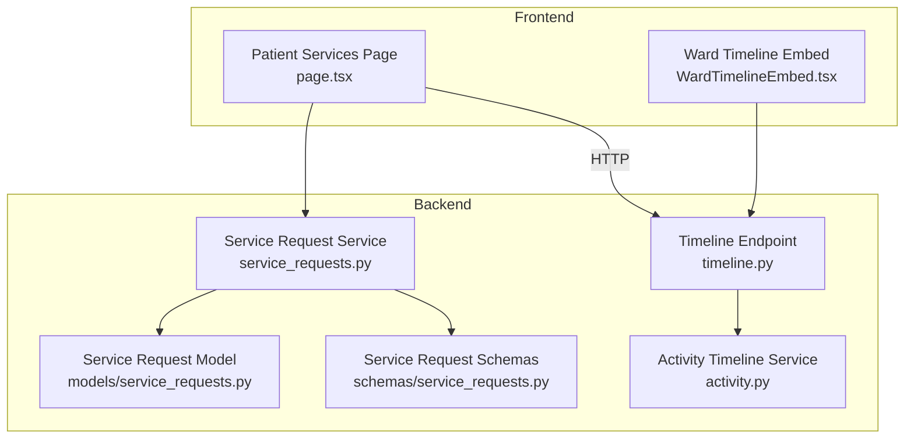
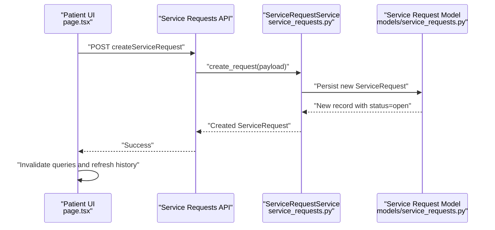
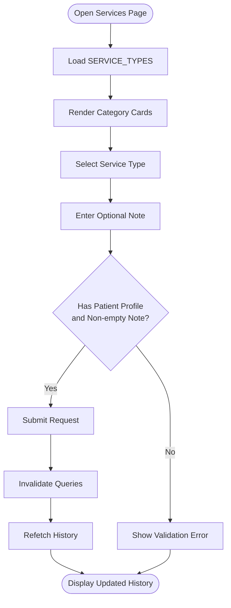
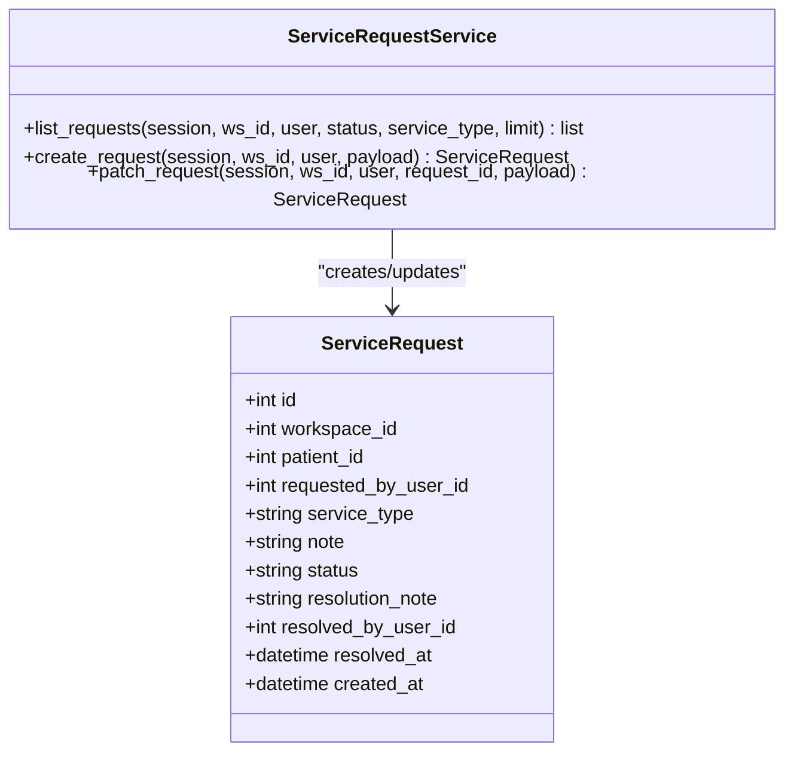
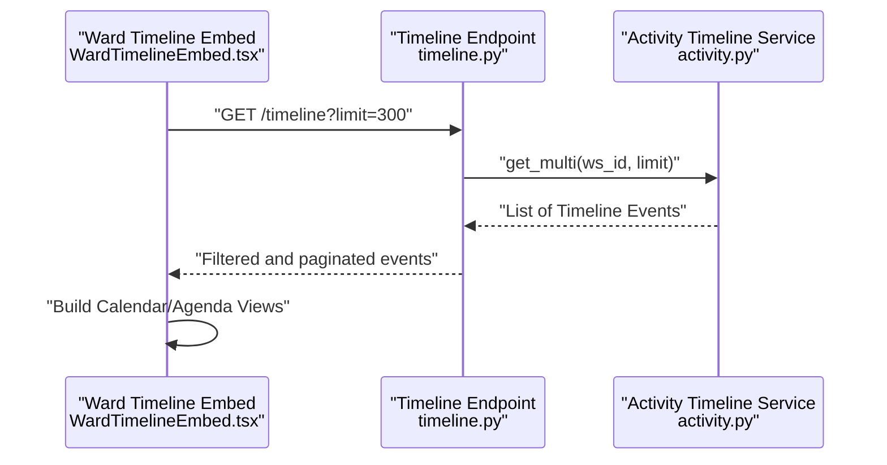
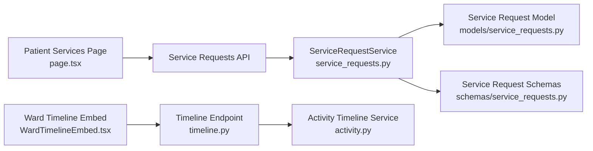

# Patient Care Services

<cite>
**Referenced Files in This Document**
- [page.tsx](file://frontend/app/patient/services/page.tsx)
- [service_requests.py](file://server/app/services/service_requests.py)
- [WardTimelineEmbed.tsx](file://frontend/components/timeline/WardTimelineEmbed.tsx)
- [timeline.py](file://server/app/api/endpoints/timeline.py)
- [activity.py](file://server/app/services/activity.py)
- [service_requests.py](file://server/app/models/service_requests.py)
- [service_requests.py](file://server/app/schemas/service_requests.py)
</cite>

## Table of Contents
1. [Introduction](#introduction)
2. [Project Structure](#project-structure)
3. [Core Components](#core-components)
4. [Architecture Overview](#architecture-overview)
5. [Detailed Component Analysis](#detailed-component-analysis)
6. [Dependency Analysis](#dependency-analysis)
7. [Performance Considerations](#performance-considerations)
8. [Troubleshooting Guide](#troubleshooting-guide)
9. [Conclusion](#conclusion)

## Introduction
This document describes the Patient Care Services interface that enables patients to request care-related services within the facility. It covers the service request workflow from initiation to completion, including status tracking and resolution notes. It also documents the integration with the ward timeline embedding for real-time visibility of activity and status updates. The supported service categories currently include food, transport, and housekeeping. Examples of common requests include meal modifications, bed adjustments, additional supplies, and facility access requests. The system integrates with staff scheduling and resource allocation via timeline events and administrative controls to ensure timely service delivery.

## Project Structure
The Patient Care Services feature spans the frontend and backend:
- Frontend: A dedicated patient services page that renders service categories, collects request details, displays history, and triggers submissions.
- Backend: Service request domain logic, persistence, and API endpoints; timeline aggregation for ward-level visibility.

**Diagram sources**
- [page.tsx:1-271](file://frontend/app/patient/services/page.tsx#L1-L271)
- [WardTimelineEmbed.tsx:1-225](file://frontend/components/timeline/WardTimelineEmbed.tsx#L1-L225)
- [timeline.py:40-70](file://server/app/api/endpoints/timeline.py#L40-L70)
- [service_requests.py:1-139](file://server/app/services/service_requests.py#L1-L139)
- [activity.py:1-40](file://server/app/services/activity.py#L1-L40)
- [service_requests.py](file://server/app/models/service_requests.py)
- [service_requests.py](file://server/app/schemas/service_requests.py)

**Section sources**
- [page.tsx:1-271](file://frontend/app/patient/services/page.tsx#L1-L271)
- [service_requests.py:1-139](file://server/app/services/service_requests.py#L1-L139)
- [WardTimelineEmbed.tsx:1-225](file://frontend/components/timeline/WardTimelineEmbed.tsx#L1-L225)
- [timeline.py:40-70](file://server/app/api/endpoints/timeline.py#L40-L70)
- [activity.py:1-40](file://server/app/services/activity.py#L1-L40)

## Core Components
- Patient Services Page (frontend)
  - Renders service category cards (food, transport, housekeeping).
  - Collects service type and optional note.
  - Submits requests and refreshes history.
  - Displays historical requests with status badges and timestamps.
- Service Request Service (backend)
  - Lists requests scoped to the current user’s workspace and optionally filtered by status or type.
  - Creates requests for authenticated patients with validation.
  - Patches requests (admin-only) to update status and resolution note, setting resolved timestamps when appropriate.
- Timeline Integration
  - Ward timeline embed aggregates and filters timeline events for ward visibility.
  - Timeline endpoint lists timeline events for a patient or all patients in a workspace, respecting role-based access.

**Section sources**
- [page.tsx:17-53](file://frontend/app/patient/services/page.tsx#L17-L53)
- [page.tsx:70-271](file://frontend/app/patient/services/page.tsx#L70-L271)
- [service_requests.py:24-139](file://server/app/services/service_requests.py#L24-L139)
- [WardTimelineEmbed.tsx:30-225](file://frontend/components/timeline/WardTimelineEmbed.tsx#L30-L225)
- [timeline.py:46-70](file://server/app/api/endpoints/timeline.py#L46-L70)
- [activity.py:19-40](file://server/app/services/activity.py#L19-L40)

## Architecture Overview
The system follows a clean separation of concerns:
- Frontend UI triggers service creation and displays history.
- Backend enforces role-based access and persists requests.
- Timeline services aggregate ward activity for oversight.

**Diagram sources**
- [page.tsx:87-101](file://frontend/app/patient/services/page.tsx#L87-L101)
- [service_requests.py:56-88](file://server/app/services/service_requests.py#L56-L88)
- [service_requests.py](file://server/app/models/service_requests.py)

**Section sources**
- [page.tsx:80-106](file://frontend/app/patient/services/page.tsx#L80-L106)
- [service_requests.py:56-88](file://server/app/services/service_requests.py#L56-L88)

## Detailed Component Analysis

### Patient Services Page
Responsibilities:
- Render service category cards with icons and localized descriptions.
- Allow selection of service type and addition of notes.
- Submit requests and handle submission errors.
- Display recent history sorted by creation time with status badges and resolution notes.

Key behaviors:
- Service types are defined statically and localized via translation keys.
- Submission requires a linked patient profile; otherwise, a user-facing error is shown.
- History is refreshed automatically via periodic polling.

**Diagram sources**
- [page.tsx:17-53](file://frontend/app/patient/services/page.tsx#L17-L53)
- [page.tsx:87-101](file://frontend/app/patient/services/page.tsx#L87-L101)
- [page.tsx:103-106](file://frontend/app/patient/services/page.tsx#L103-L106)

**Section sources**
- [page.tsx:17-53](file://frontend/app/patient/services/page.tsx#L17-L53)
- [page.tsx:70-271](file://frontend/app/patient/services/page.tsx#L70-L271)

### Service Request Domain
Responsibilities:
- List requests with workspace scoping and optional filters.
- Create requests for authenticated patients with validation.
- Patch requests (admin-only) to update status and resolution note, including resolved timestamps.

**Diagram sources**
- [service_requests.py:24-139](file://server/app/services/service_requests.py#L24-L139)
- [service_requests.py](file://server/app/models/service_requests.py)

**Section sources**
- [service_requests.py:24-139](file://server/app/services/service_requests.py#L24-L139)

### Timeline Integration
Responsibilities:
- Provide a ward-level timeline view for clinical roles.
- Aggregate timeline events for filtering by patient and source.
- Support role-scoped access and visibility.

**Diagram sources**
- [WardTimelineEmbed.tsx:37-41](file://frontend/components/timeline/WardTimelineEmbed.tsx#L37-L41)
- [timeline.py:46-63](file://server/app/api/endpoints/timeline.py#L46-L63)
- [activity.py:19-33](file://server/app/services/activity.py#L19-L33)

**Section sources**
- [WardTimelineEmbed.tsx:30-225](file://frontend/components/timeline/WardTimelineEmbed.tsx#L30-L225)
- [timeline.py:46-70](file://server/app/api/endpoints/timeline.py#L46-L70)
- [activity.py:19-40](file://server/app/services/activity.py#L19-L40)

## Dependency Analysis
- Frontend depends on:
  - Authentication hook to resolve the current patient context.
  - API client for service requests and timeline.
  - React Query for caching and refetching.
- Backend depends on:
  - SQLAlchemy models and schemas for persistence and validation.
  - Role-based access control to enforce who can create or update requests.
  - Timeline service for ward-level activity aggregation.

**Diagram sources**
- [page.tsx:1-16](file://frontend/app/patient/services/page.tsx#L1-L16)
- [service_requests.py:1-13](file://server/app/services/service_requests.py#L1-L13)
- [service_requests.py](file://server/app/models/service_requests.py)
- [service_requests.py](file://server/app/schemas/service_requests.py)
- [WardTimelineEmbed.tsx:1-24](file://frontend/components/timeline/WardTimelineEmbed.tsx#L1-L24)
- [timeline.py:46-70](file://server/app/api/endpoints/timeline.py#L46-L70)
- [activity.py:1-14](file://server/app/services/activity.py#L1-L14)

**Section sources**
- [page.tsx:1-16](file://frontend/app/patient/services/page.tsx#L1-L16)
- [service_requests.py:1-13](file://server/app/services/service_requests.py#L1-L13)
- [WardTimelineEmbed.tsx:1-24](file://frontend/components/timeline/WardTimelineEmbed.tsx#L1-L24)
- [timeline.py:46-70](file://server/app/api/endpoints/timeline.py#L46-L70)

## Performance Considerations
- Frontend polling intervals:
  - Service history polling is configured to refresh periodically to keep the UI up-to-date without manual refresh.
- Backend limits:
  - Timeline and service request listings apply reasonable limits to avoid heavy payloads.
- Caching scopes:
  - Timeline embed uses cache scopes per role to isolate data and reduce cross-role noise.

Recommendations:
- Consider server-sent events or WebSocket channels for real-time updates to service request statuses.
- Introduce pagination for service history to scale beyond the current limit.
- Optimize timeline queries with indexed fields for patient_id and timestamp.

**Section sources**
- [page.tsx:80-85](file://frontend/app/patient/services/page.tsx#L80-L85)
- [timeline.py:48-59](file://server/app/api/endpoints/timeline.py#L48-L59)

## Troubleshooting Guide
Common issues and resolutions:
- Patient profile not linked:
  - Symptom: Submit button disabled or error message appears.
  - Cause: The authenticated user lacks an associated patient record.
  - Resolution: Ensure the patient profile is linked to the user account.
- Empty note:
  - Symptom: Creation request fails with a validation error.
  - Cause: The note field is required and must be non-empty.
  - Resolution: Provide a brief description of the service request.
- Unauthorized access:
  - Symptom: Attempting to update a request as a non-admin returns an error.
  - Cause: Only administrators can modify request status and resolution notes.
  - Resolution: Use the admin role to update requests.
- No timeline data:
  - Symptom: Ward timeline shows no events.
  - Cause: Insufficient permissions or no events recorded.
  - Resolution: Verify role permissions and ensure activity events are being generated.

**Section sources**
- [page.tsx:89-91](file://frontend/app/patient/services/page.tsx#L89-L91)
- [page.tsx:108-113](file://frontend/app/patient/services/page.tsx#L108-L113)
- [service_requests.py:63-72](file://server/app/services/service_requests.py#L63-L72)
- [service_requests.py:98-99](file://server/app/services/service_requests.py#L98-L99)
- [timeline.py:40-41](file://server/app/api/endpoints/timeline.py#L40-L41)

## Conclusion
The Patient Care Services interface provides a streamlined way for patients to request essential services and track outcomes. The backend enforces role-based access, validates inputs, and persists requests with clear status transitions. The ward timeline embedding offers real-time visibility into activity, supporting oversight and coordination. Extending the system to include additional service categories (linen service, special equipment requests) and integrating staff scheduling and resource allocation would further enhance timeliness and transparency.