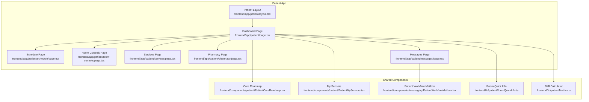
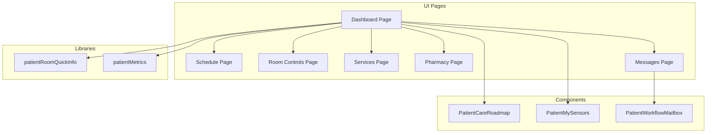
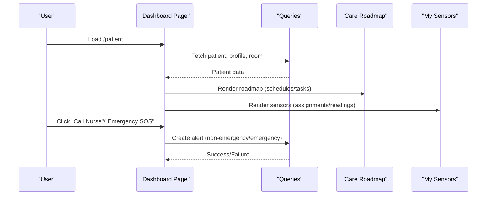
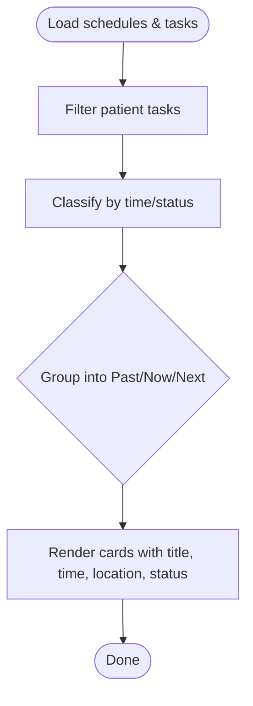
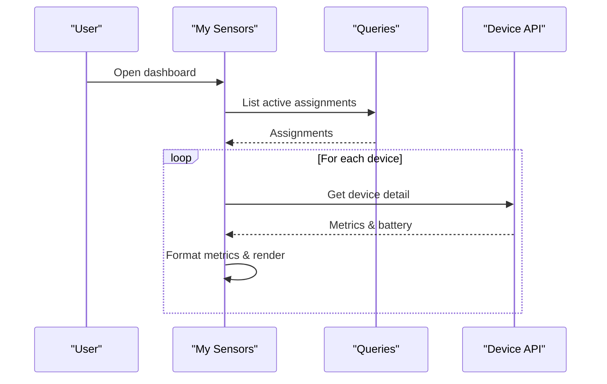
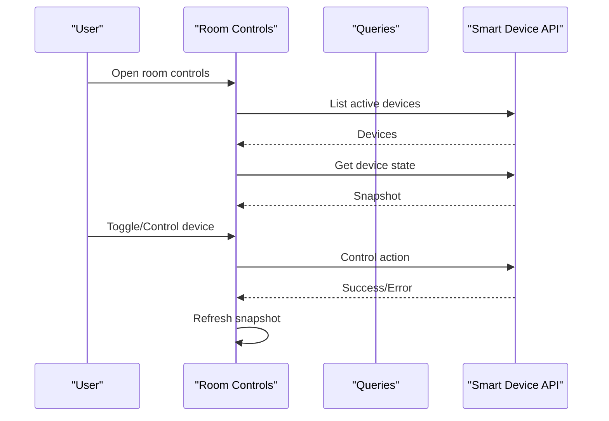
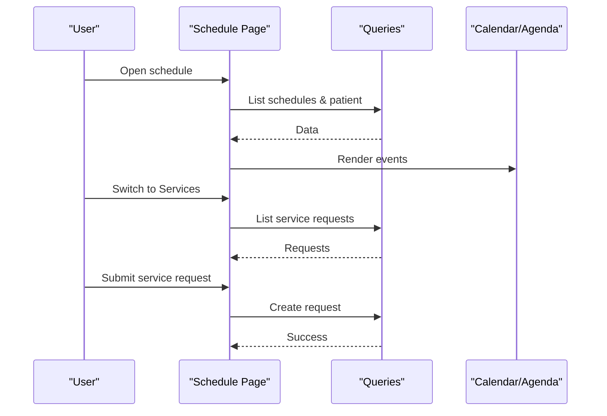
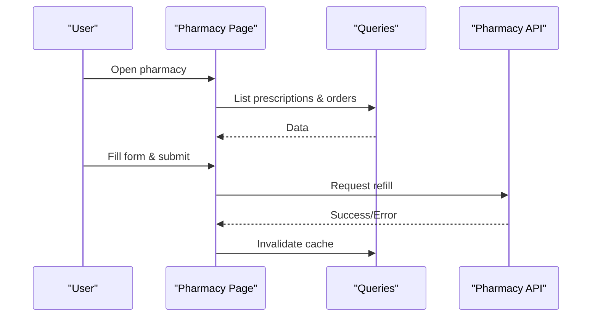
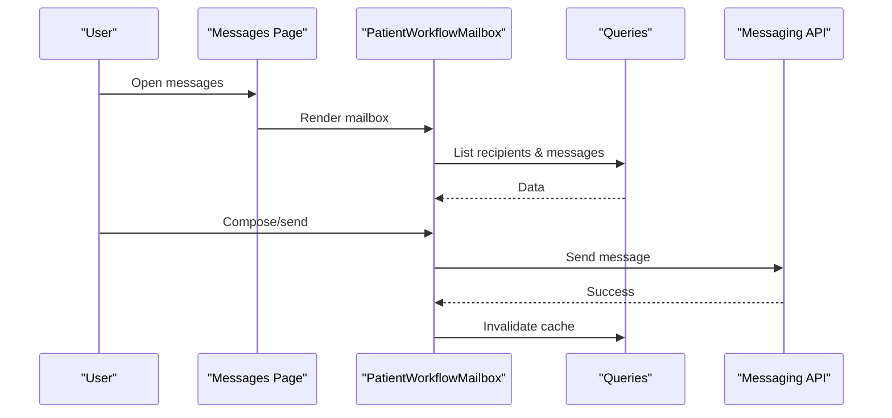
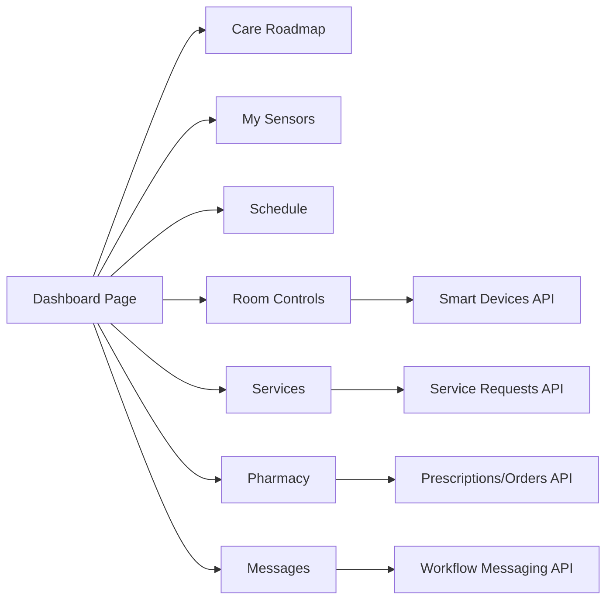

# Patient Dashboard

<cite>
**Referenced Files in This Document**
- [frontend/app/patient/page.tsx](file://frontend/app/patient/page.tsx)
- [frontend/app/patient/layout.tsx](file://frontend/app/patient/layout.tsx)
- [frontend/components/patient/PatientCareRoadmap.tsx](file://frontend/components/patient/PatientCareRoadmap.tsx)
- [frontend/components/patient/PatientMySensors.tsx](file://frontend/components/patient/PatientMySensors.tsx)
- [frontend/app/patient/schedule/page.tsx](file://frontend/app/patient/schedule/page.tsx)
- [frontend/app/patient/room-controls/page.tsx](file://frontend/app/patient/room-controls/page.tsx)
- [frontend/app/patient/services/page.tsx](file://frontend/app/patient/services/page.tsx)
- [frontend/app/patient/pharmacy/page.tsx](file://frontend/app/patient/pharmacy/page.tsx)
- [frontend/app/patient/messages/page.tsx](file://frontend/app/patient/messages/page.tsx)
- [frontend/components/messaging/PatientWorkflowMailbox.tsx](file://frontend/components/messaging/PatientWorkflowMailbox.tsx)
- [frontend/lib/patientRoomQuickInfo.ts](file://frontend/lib/patientRoomQuickInfo.ts)
- [frontend/lib/patientMetrics.ts](file://frontend/lib/patientMetrics.ts)
</cite>

## Table of Contents
1. [Introduction](#introduction)
2. [Project Structure](#project-structure)
3. [Core Components](#core-components)
4. [Architecture Overview](#architecture-overview)
5. [Detailed Component Analysis](#detailed-component-analysis)
6. [Dependency Analysis](#dependency-analysis)
7. [Performance Considerations](#performance-considerations)
8. [Troubleshooting Guide](#troubleshooting-guide)
9. [Conclusion](#conclusion)
10. [Appendices](#appendices)

## Introduction
This document describes the Patient Dashboard interface in the WheelSense Platform. It covers the patient’s self-service portal, including personal health monitoring, room environment controls, appointment scheduling, pharmacy services, communication tools, and care roadmap management. It also documents patient-specific navigation patterns, self-service features, and personalized health tools, with implementation details for care roadmap visualization, sensor monitoring interfaces, room control panels, and service booking systems.

## Project Structure
The Patient Dashboard is implemented as a Next.js app under the “patient” route group. It integrates reusable UI components and shared messaging infrastructure. The layout wraps the patient shell with role-specific styling and spacing. Key pages include:
- Dashboard overview with quick links, care roadmap, and sensor monitoring
- Schedule and services (including pharmacy)
- Room controls
- Messages (workflow mailbox)
- Support (issue reporting)

**Diagram sources**
- [frontend/app/patient/layout.tsx:1-24](file://frontend/app/patient/layout.tsx#L1-L24)
- [frontend/app/patient/page.tsx:1-455](file://frontend/app/patient/page.tsx#L1-L455)
- [frontend/app/patient/schedule/page.tsx:1-254](file://frontend/app/patient/schedule/page.tsx#L1-L254)
- [frontend/app/patient/room-controls/page.tsx:1-639](file://frontend/app/patient/room-controls/page.tsx#L1-L639)
- [frontend/app/patient/services/page.tsx:1-271](file://frontend/app/patient/services/page.tsx#L1-L271)
- [frontend/app/patient/pharmacy/page.tsx:1-413](file://frontend/app/patient/pharmacy/page.tsx#L1-L413)
- [frontend/app/patient/messages/page.tsx:1-8](file://frontend/app/patient/messages/page.tsx#L1-L8)
- [frontend/components/patient/PatientCareRoadmap.tsx:1-293](file://frontend/components/patient/PatientCareRoadmap.tsx#L1-L293)
- [frontend/components/patient/PatientMySensors.tsx:1-328](file://frontend/components/patient/PatientMySensors.tsx#L1-L328)
- [frontend/components/messaging/PatientWorkflowMailbox.tsx:1-517](file://frontend/components/messaging/PatientWorkflowMailbox.tsx#L1-L517)
- [frontend/lib/patientRoomQuickInfo.ts:1-20](file://frontend/lib/patientRoomQuickInfo.ts#L1-L20)
- [frontend/lib/patientMetrics.ts:1-21](file://frontend/lib/patientMetrics.ts#L1-L21)

**Section sources**
- [frontend/app/patient/layout.tsx:1-24](file://frontend/app/patient/layout.tsx#L1-L24)
- [frontend/app/patient/page.tsx:1-455](file://frontend/app/patient/page.tsx#L1-L455)

## Core Components
- Patient Dashboard overview: Tabbed interface with “Overview,” “Profile,” and “Support.” Includes care roadmap, sensor monitoring, quick links, and emergency assistance buttons.
- Care Roadmap: Aggregates scheduled events and tasks for the patient, grouped into past, now, and next buckets with location and status.
- My Sensors: Lists active device assignments and displays real-time metrics per device type (wheelchair, mobile, Polar HR), with battery indicators and readings.
- Schedule: Calendar and agenda views for workflow schedules; supports admin preview mode.
- Room Controls: Lists active smart devices, shows state snapshots, and allows supported actions (on/off/toggle) and temperature setting for climate devices.
- Services: Allows requesting food, transport, and housekeeping with history and status.
- Pharmacy: Lists active prescriptions and pharmacy orders, and enables refill requests.
- Messages: Patient workflow mailbox with compose, search, read/unread, and attachments.
- Support: Embedded issue reporting form accessed via the Support tab.

**Section sources**
- [frontend/app/patient/page.tsx:67-247](file://frontend/app/patient/page.tsx#L67-L247)
- [frontend/components/patient/PatientCareRoadmap.tsx:65-293](file://frontend/components/patient/PatientCareRoadmap.tsx#L65-L293)
- [frontend/components/patient/PatientMySensors.tsx:83-328](file://frontend/components/patient/PatientMySensors.tsx#L83-L328)
- [frontend/app/patient/schedule/page.tsx:40-254](file://frontend/app/patient/schedule/page.tsx#L40-L254)
- [frontend/app/patient/room-controls/page.tsx:156-639](file://frontend/app/patient/room-controls/page.tsx#L156-L639)
- [frontend/app/patient/services/page.tsx:70-271](file://frontend/app/patient/services/page.tsx#L70-L271)
- [frontend/app/patient/pharmacy/page.tsx:71-413](file://frontend/app/patient/pharmacy/page.tsx#L71-L413)
- [frontend/app/patient/messages/page.tsx:1-8](file://frontend/app/patient/messages/page.tsx#L1-L8)
- [frontend/components/messaging/PatientWorkflowMailbox.tsx:71-517](file://frontend/components/messaging/PatientWorkflowMailbox.tsx#L71-L517)

## Architecture Overview
The Patient Dashboard follows a modular pattern:
- Route pages orchestrate queries and render shared components.
- Shared components encapsulate UI logic and data fetching.
- Utilities provide domain helpers (room info, BMI calculation).
- Messaging is centralized via a workflow mailbox component reused across roles.

**Diagram sources**
- [frontend/app/patient/page.tsx:67-247](file://frontend/app/patient/page.tsx#L67-L247)
- [frontend/components/patient/PatientCareRoadmap.tsx:65-293](file://frontend/components/patient/PatientCareRoadmap.tsx#L65-L293)
- [frontend/components/patient/PatientMySensors.tsx:83-328](file://frontend/components/patient/PatientMySensors.tsx#L83-L328)
- [frontend/app/patient/messages/page.tsx:1-8](file://frontend/app/patient/messages/page.tsx#L1-L8)
- [frontend/components/messaging/PatientWorkflowMailbox.tsx:71-517](file://frontend/components/messaging/PatientWorkflowMailbox.tsx#L71-L517)
- [frontend/lib/patientRoomQuickInfo.ts:1-20](file://frontend/lib/patientRoomQuickInfo.ts#L1-L20)
- [frontend/lib/patientMetrics.ts:1-21](file://frontend/lib/patientMetrics.ts#L1-L21)

## Detailed Component Analysis

### Dashboard Overview
The dashboard page renders:
- A top banner with portal badge, greeting, care level badge, and room headline.
- A tabbed interface (Overview, Profile, Support).
- Overview tab: care roadmap, sensors, assistance buttons, and quick links to schedule, room controls, messages, and services.
- Profile tab: merged patient and account profile details.
- Support tab: embedded issue reporting form.

**Diagram sources**
- [frontend/app/patient/page.tsx:67-247](file://frontend/app/patient/page.tsx#L67-L247)
- [frontend/components/patient/PatientCareRoadmap.tsx:65-293](file://frontend/components/patient/PatientCareRoadmap.tsx#L65-L293)
- [frontend/components/patient/PatientMySensors.tsx:83-328](file://frontend/components/patient/PatientMySensors.tsx#L83-L328)

**Section sources**
- [frontend/app/patient/page.tsx:67-247](file://frontend/app/patient/page.tsx#L67-L247)
- [frontend/lib/patientRoomQuickInfo.ts:1-20](file://frontend/lib/patientRoomQuickInfo.ts#L1-L20)

### Care Roadmap Visualization
The roadmap aggregates schedules and tasks for the patient and classifies them into past, now, and next columns. It resolves room labels and displays statuses and due times.

**Diagram sources**
- [frontend/components/patient/PatientCareRoadmap.tsx:65-293](file://frontend/components/patient/PatientCareRoadmap.tsx#L65-L293)

**Section sources**
- [frontend/components/patient/PatientCareRoadmap.tsx:65-293](file://frontend/components/patient/PatientCareRoadmap.tsx#L65-L293)

### Personal Health Monitoring (My Sensors)
The sensors panel lists active device assignments and fetches device details. It formats metrics per device type (wheelchair, mobile, Polar HR) and shows battery levels.

**Diagram sources**
- [frontend/components/patient/PatientMySensors.tsx:83-328](file://frontend/components/patient/PatientMySensors.tsx#L83-L328)

**Section sources**
- [frontend/components/patient/PatientMySensors.tsx:83-328](file://frontend/components/patient/PatientMySensors.tsx#L83-L328)

### Room Environment Control Panel
The room controls page lists active smart devices, resolves device kinds, and exposes supported actions. It supports refresh, on/off/toggle, and temperature setting for climate devices.

**Diagram sources**
- [frontend/app/patient/room-controls/page.tsx:156-639](file://frontend/app/patient/room-controls/page.tsx#L156-L639)

**Section sources**
- [frontend/app/patient/room-controls/page.tsx:156-639](file://frontend/app/patient/room-controls/page.tsx#L156-L639)

### Appointment Scheduling and Services
The schedule page provides calendar and agenda views for workflow schedules, with admin preview support. Services allow requesting food, transport, and housekeeping with history and status.

**Diagram sources**
- [frontend/app/patient/schedule/page.tsx:40-254](file://frontend/app/patient/schedule/page.tsx#L40-L254)
- [frontend/app/patient/services/page.tsx:70-271](file://frontend/app/patient/services/page.tsx#L70-L271)

**Section sources**
- [frontend/app/patient/schedule/page.tsx:40-254](file://frontend/app/patient/schedule/page.tsx#L40-L254)
- [frontend/app/patient/services/page.tsx:70-271](file://frontend/app/patient/services/page.tsx#L70-L271)

### Pharmacy Services
The pharmacy page lists active prescriptions and orders, and enables refill requests with validation and submission.

**Diagram sources**
- [frontend/app/patient/pharmacy/page.tsx:71-413](file://frontend/app/patient/pharmacy/page.tsx#L71-L413)

**Section sources**
- [frontend/app/patient/pharmacy/page.tsx:71-413](file://frontend/app/patient/pharmacy/page.tsx#L71-L413)

### Communication Tools (Messages)
The messages page uses a shared workflow mailbox component to list inbox and sent messages, enable compose, search, read/unread, and manage attachments.

**Diagram sources**
- [frontend/app/patient/messages/page.tsx:1-8](file://frontend/app/patient/messages/page.tsx#L1-L8)
- [frontend/components/messaging/PatientWorkflowMailbox.tsx:71-517](file://frontend/components/messaging/PatientWorkflowMailbox.tsx#L71-L517)

**Section sources**
- [frontend/app/patient/messages/page.tsx:1-8](file://frontend/app/patient/messages/page.tsx#L1-L8)
- [frontend/components/messaging/PatientWorkflowMailbox.tsx:71-517](file://frontend/components/messaging/PatientWorkflowMailbox.tsx#L71-L517)

### Support and Issue Reporting
The Support tab embeds an issue reporting form for submitting support tickets.

**Section sources**
- [frontend/app/patient/page.tsx:249-261](file://frontend/app/patient/page.tsx#L249-L261)

## Dependency Analysis
- Dashboard depends on:
  - Queries for patient, profile, room, schedules, tasks, rooms, devices, and smart devices.
  - Shared components for roadmap and sensors.
  - Utility functions for room quick info and BMI calculations.
- Room controls depends on:
  - Smart device listing and state retrieval APIs.
  - Action routing for supported device kinds.
- Services and pharmacy depend on:
  - Request creation and history retrieval APIs.
- Messages depends on:
  - Recipient discovery and workflow messaging APIs.

**Diagram sources**
- [frontend/app/patient/page.tsx:67-247](file://frontend/app/patient/page.tsx#L67-L247)
- [frontend/app/patient/room-controls/page.tsx:156-639](file://frontend/app/patient/room-controls/page.tsx#L156-L639)
- [frontend/app/patient/services/page.tsx:70-271](file://frontend/app/patient/services/page.tsx#L70-L271)
- [frontend/app/patient/pharmacy/page.tsx:71-413](file://frontend/app/patient/pharmacy/page.tsx#L71-L413)
- [frontend/components/messaging/PatientWorkflowMailbox.tsx:71-517](file://frontend/components/messaging/PatientWorkflowMailbox.tsx#L71-L517)

**Section sources**
- [frontend/app/patient/page.tsx:67-247](file://frontend/app/patient/page.tsx#L67-L247)

## Performance Considerations
- Efficient data fetching:
  - Use React Query with appropriate query keys and enabled booleans to avoid unnecessary requests.
  - Enable refetch intervals for live data (e.g., sensors, messages).
- Rendering optimization:
  - Memoize derived data (e.g., room labels, metrics) to prevent re-computation.
  - Use lazy loading for heavy components (e.g., calendar/agenda).
- Network resilience:
  - Handle loading and error states gracefully with skeleton loaders and error banners.
  - Debounce user actions (e.g., search) to reduce API churn.

## Troubleshooting Guide
Common issues and resolutions:
- No patient linked:
  - The dashboard shows a friendly message when the user lacks a linked patient record. Users should contact staff to link their account.
- Room details unavailable:
  - The room quick info falls back to a placeholder when room data is missing or loading.
- Assistance request failures:
  - Emergency/non-emergency assistance triggers alert creation; failures surface as errors and can be retried.
- Device state refresh failures:
  - Room controls show device-specific errors and allow manual refresh.
- Messaging errors:
  - Compose/send failures are surfaced with localized messages; ensure a recipient is selected and content is present.
- Services/Pharmacy submission errors:
  - Validation errors guide users to correct inputs; ensure a patient profile exists and required fields are filled.

**Section sources**
- [frontend/app/patient/page.tsx:148-175](file://frontend/app/patient/page.tsx#L148-L175)
- [frontend/lib/patientRoomQuickInfo.ts:1-20](file://frontend/lib/patientRoomQuickInfo.ts#L1-L20)
- [frontend/app/patient/room-controls/page.tsx:156-639](file://frontend/app/patient/room-controls/page.tsx#L156-L639)
- [frontend/components/messaging/PatientWorkflowMailbox.tsx:71-517](file://frontend/components/messaging/PatientWorkflowMailbox.tsx#L71-L517)
- [frontend/app/patient/services/page.tsx:70-271](file://frontend/app/patient/services/page.tsx#L70-L271)
- [frontend/app/patient/pharmacy/page.tsx:71-413](file://frontend/app/patient/pharmacy/page.tsx#L71-L413)

## Conclusion
The Patient Dashboard provides a cohesive, role-specific self-service experience centered on care coordination, personal monitoring, and communication. Its modular design leverages shared components and robust data flows to deliver a responsive and accessible interface for patients.

## Appendices

### Patient Workflows Overview
- Self-monitoring:
  - View active device assignments and metrics in the “My Sensors” panel.
- Room customization:
  - Control lights, fans, switches, and climate devices from the “Room Controls” page.
- Appointment management:
  - Browse schedules and agendas in the “Schedule” page; admin preview mode available.
- Medication requests:
  - Submit refill requests via the “Pharmacy” page after selecting an active prescription.
- Communication with care team:
  - Use the “Messages” mailbox to compose and manage workflow messages.
- Accessing care services:
  - Request food, transport, and housekeeping through the “Services” page.

[No sources needed since this section summarizes workflows conceptually]