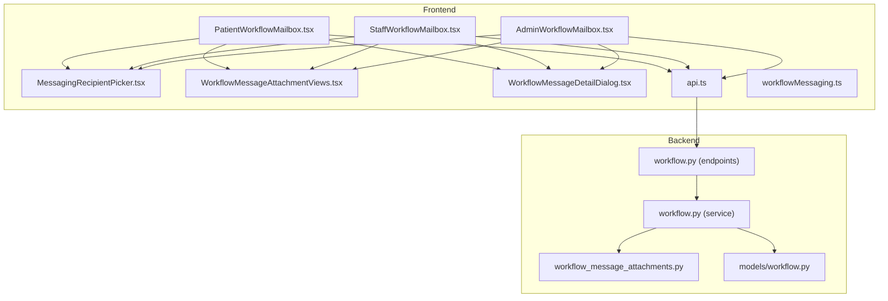
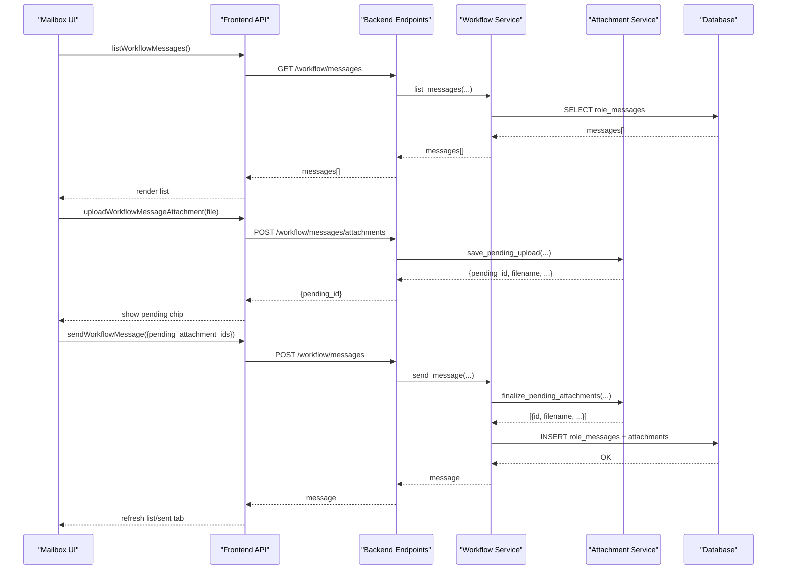
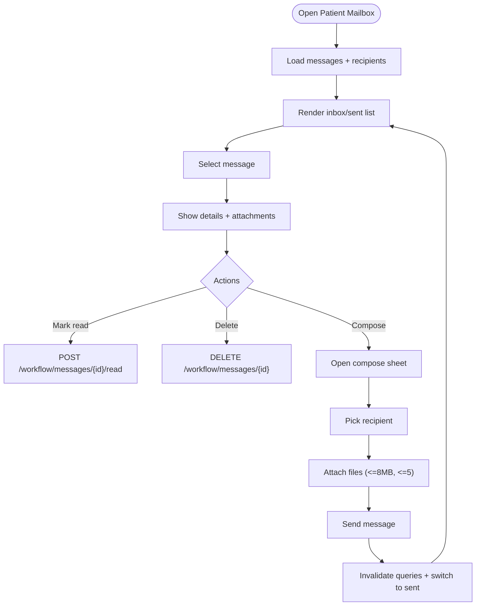
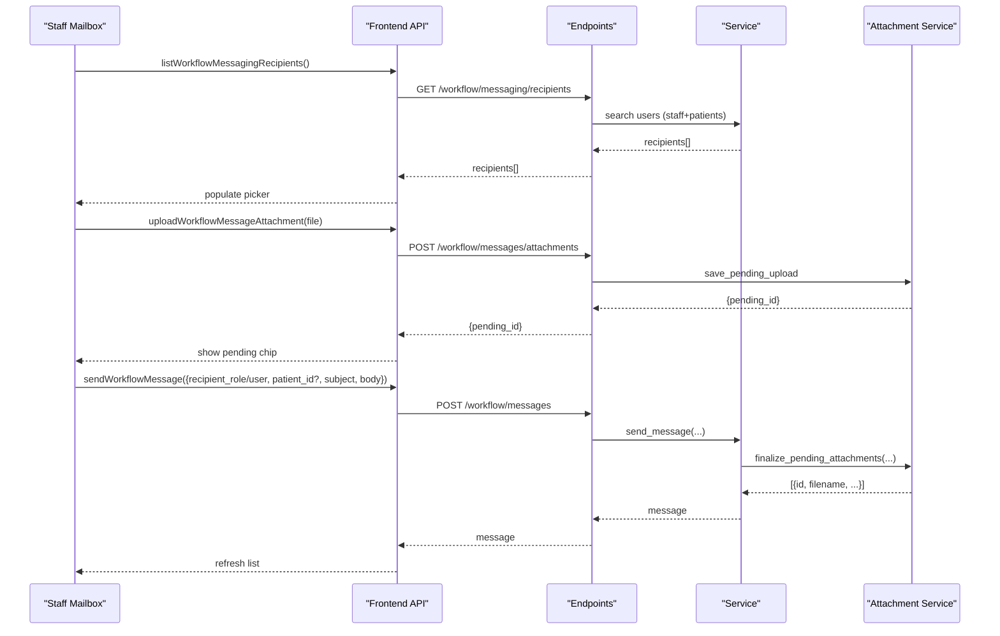
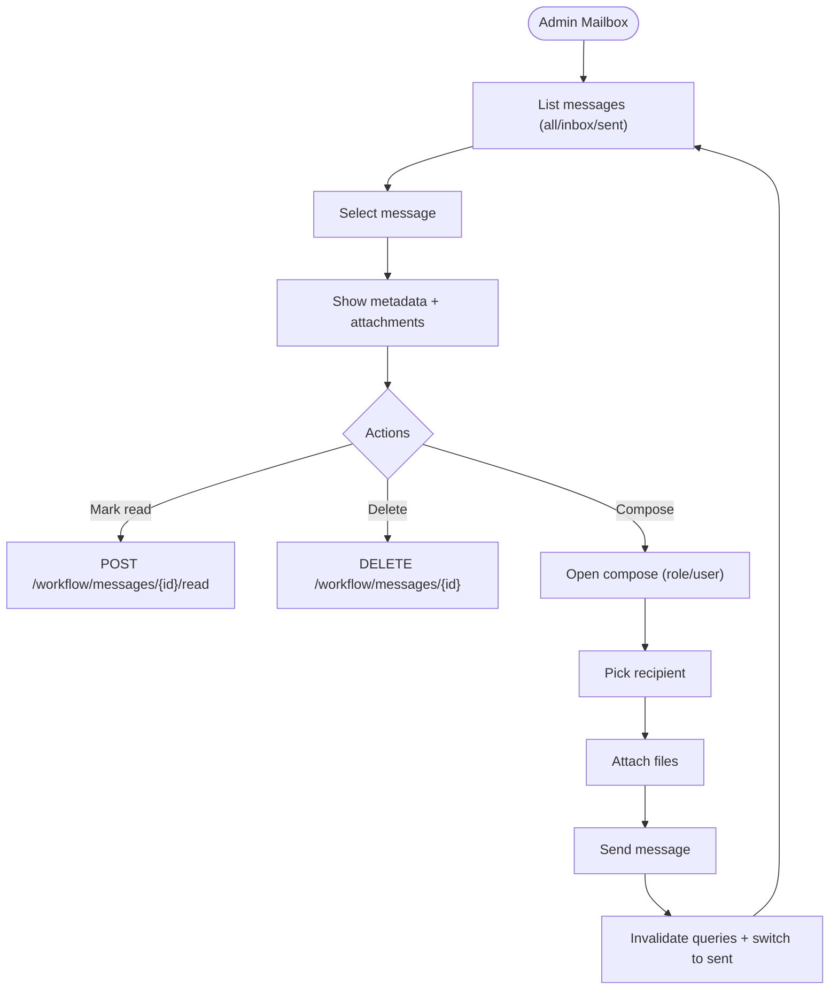
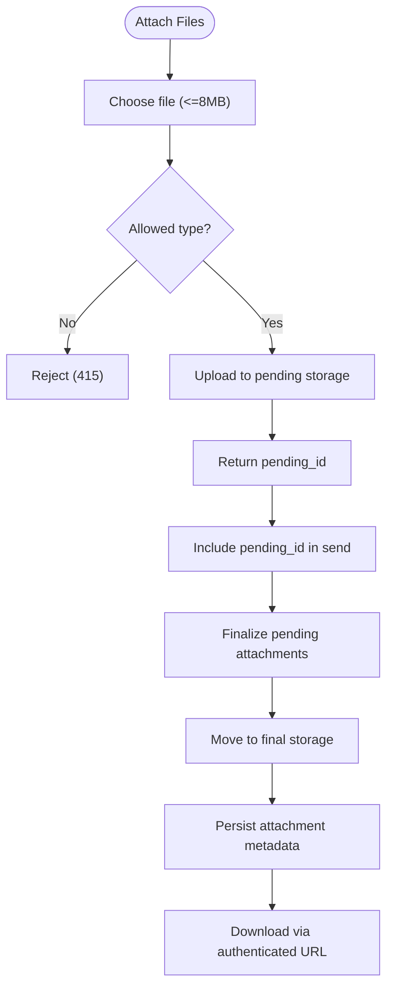
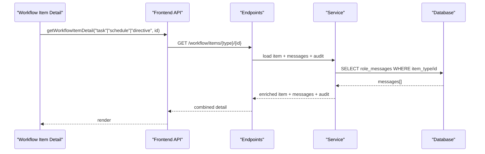
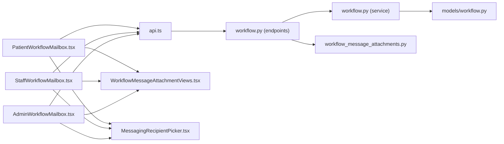

# Patient Messaging & Communication

<cite>
**Referenced Files in This Document**
- [PatientWorkflowMailbox.tsx](file://frontend/components/messaging/PatientWorkflowMailbox.tsx)
- [StaffWorkflowMailbox.tsx](file://frontend/components/messaging/StaffWorkflowMailbox.tsx)
- [AdminWorkflowMailbox.tsx](file://frontend/components/messaging/AdminWorkflowMailbox.tsx)
- [WorkflowMessageAttachmentViews.tsx](file://frontend/components/messaging/WorkflowMessageAttachmentViews.tsx)
- [MessagingRecipientPicker.tsx](file://frontend/components/messaging/MessagingRecipientPicker.tsx)
- [WorkflowMessageDetailDialog.tsx](file://frontend/components/messaging/WorkflowMessageDetailDialog.tsx)
- [workflowMessaging.ts](file://frontend/lib/workflowMessaging.ts)
- [api.ts](file://frontend/lib/api.ts)
- [workflow.py](file://server/app/services/workflow.py)
- [workflow_message_attachments.py](file://server/app/services/workflow_message_attachments.py)
- [workflow.py](file://server/app/models/workflow.py)
- [workflow.py](file://server/app/api/endpoints/workflow.py)
- [test_workflow_domains.py](file://server/tests/test_workflow_domains.py)
</cite>

## Table of Contents
1. [Introduction](#introduction)
2. [Project Structure](#project-structure)
3. [Core Components](#core-components)
4. [Architecture Overview](#architecture-overview)
5. [Detailed Component Analysis](#detailed-component-analysis)
6. [Dependency Analysis](#dependency-analysis)
7. [Performance Considerations](#performance-considerations)
8. [Troubleshooting Guide](#troubleshooting-guide)
9. [Conclusion](#conclusion)

## Introduction
This document describes the secure patient messaging and communication system that enables direct, threaded conversations between patients and their care team. It covers the mailbox implementations for patients, staff roles, and administrators; the message attachment system supporting photos, documents, and multimedia; integration with the broader workflow system for care-related discussions; common communication scenarios; categorization and priority handling; and privacy/security measures.

## Project Structure
The messaging system spans the frontend React components and the backend FastAPI service:
- Frontend: mailboxes for patients, staff, and admins; attachment composition and viewing; recipient selection; detail dialogs
- Backend: endpoints for listing, sending, marking read, deleting messages; uploading and serving attachments; workflow-aware message linking

**Diagram sources**
- [PatientWorkflowMailbox.tsx:71-517](file://frontend/components/messaging/PatientWorkflowMailbox.tsx#L71-L517)
- [StaffWorkflowMailbox.tsx:153-723](file://frontend/components/messaging/StaffWorkflowMailbox.tsx#L153-L723)
- [AdminWorkflowMailbox.tsx:110-688](file://frontend/components/messaging/AdminWorkflowMailbox.tsx#L110-L688)
- [MessagingRecipientPicker.tsx:68-155](file://frontend/components/messaging/MessagingRecipientPicker.tsx#L68-L155)
- [WorkflowMessageAttachmentViews.tsx:26-142](file://frontend/components/messaging/WorkflowMessageAttachmentViews.tsx#L26-L142)
- [WorkflowMessageDetailDialog.tsx:28-102](file://frontend/components/messaging/WorkflowMessageDetailDialog.tsx#L28-L102)
- [api.ts:881-919](file://frontend/lib/api.ts#L881-L919)
- [workflow.py:261-404](file://server/app/api/endpoints/workflow.py#L261-L404)
- [workflow.py:296-312](file://server/app/services/workflow.py#L296-L312)
- [workflow_message_attachments.py:52-202](file://server/app/services/workflow_message_attachments.py#L52-L202)
- [workflow.py:67-89](file://server/app/models/workflow.py#L67-L89)

**Section sources**
- [PatientWorkflowMailbox.tsx:71-517](file://frontend/components/messaging/PatientWorkflowMailbox.tsx#L71-L517)
- [StaffWorkflowMailbox.tsx:153-723](file://frontend/components/messaging/StaffWorkflowMailbox.tsx#L153-L723)
- [AdminWorkflowMailbox.tsx:110-688](file://frontend/components/messaging/AdminWorkflowMailbox.tsx#L110-L688)
- [WorkflowMessageAttachmentViews.tsx:26-142](file://frontend/components/messaging/WorkflowMessageAttachmentViews.tsx#L26-L142)
- [MessagingRecipientPicker.tsx:68-155](file://frontend/components/messaging/MessagingRecipientPicker.tsx#L68-L155)
- [WorkflowMessageDetailDialog.tsx:28-102](file://frontend/components/messaging/WorkflowMessageDetailDialog.tsx#L28-L102)
- [api.ts:881-919](file://frontend/lib/api.ts#L881-L919)
- [workflow.py:261-404](file://server/app/api/endpoints/workflow.py#L261-L404)
- [workflow.py:296-312](file://server/app/services/workflow.py#L296-L312)
- [workflow_message_attachments.py:52-202](file://server/app/services/workflow_message_attachments.py#L52-L202)
- [workflow.py:67-89](file://server/app/models/workflow.py#L67-L89)

## Core Components
- Patient mailbox: lists inbox/sent threads, composes messages to staff, manages attachments, marks read, deletes messages
- Staff mailboxes (head nurse, supervisor, observer): role-filtered compose, patient targeting, read/unread management
- Admin mailbox: broad visibility across roles/users, compose targeting role or user, administrative controls
- Attachment system: pick, preview, upload pending, finalize on send, download with cookie-authenticated URLs
- Recipient picker: role filtering, search, and selection for staff compose
- Workflow integration: messages can be linked to workflow items (task, schedule, directive) for care-related discussions

**Section sources**
- [PatientWorkflowMailbox.tsx:71-517](file://frontend/components/messaging/PatientWorkflowMailbox.tsx#L71-L517)
- [StaffWorkflowMailbox.tsx:153-723](file://frontend/components/messaging/StaffWorkflowMailbox.tsx#L153-L723)
- [AdminWorkflowMailbox.tsx:110-688](file://frontend/components/messaging/AdminWorkflowMailbox.tsx#L110-L688)
- [WorkflowMessageAttachmentViews.tsx:26-142](file://frontend/components/messaging/WorkflowMessageAttachmentViews.tsx#L26-L142)
- [MessagingRecipientPicker.tsx:68-155](file://frontend/components/messaging/MessagingRecipientPicker.tsx#L68-L155)
- [workflow.py:261-404](file://server/app/api/endpoints/workflow.py#L261-L404)

## Architecture Overview
The system uses authenticated requests with role-based access control. Messages are stored with optional attachments and can be linked to workflow items. Attachments are staged temporarily and finalized when a message is sent.

**Diagram sources**
- [api.ts:881-919](file://frontend/lib/api.ts#L881-L919)
- [workflow.py:261-404](file://server/app/api/endpoints/workflow.py#L261-L404)
- [workflow.py:296-312](file://server/app/services/workflow.py#L296-L312)
- [workflow_message_attachments.py:52-202](file://server/app/services/workflow_message_attachments.py#L52-L202)
- [workflow.py:67-89](file://server/app/models/workflow.py#L67-L89)

## Detailed Component Analysis

### Patient Mailbox
- Lists inbox vs sent, supports search, selection, read/unread badges
- Compose sheet with recipient selection, subject/body, and attachments
- Deletion and read marking with role-aware permissions
- Attachment composition with file type and size limits

**Diagram sources**
- [PatientWorkflowMailbox.tsx:71-517](file://frontend/components/messaging/PatientWorkflowMailbox.tsx#L71-L517)
- [workflowMessaging.ts:8-17](file://frontend/lib/workflowMessaging.ts#L8-L17)
- [WorkflowMessageAttachmentViews.tsx:26-103](file://frontend/components/messaging/WorkflowMessageAttachmentViews.tsx#L26-L103)

**Section sources**
- [PatientWorkflowMailbox.tsx:71-517](file://frontend/components/messaging/PatientWorkflowMailbox.tsx#L71-L517)
- [workflowMessaging.ts:8-17](file://frontend/lib/workflowMessaging.ts#L8-L17)
- [WorkflowMessageAttachmentViews.tsx:26-103](file://frontend/components/messaging/WorkflowMessageAttachmentViews.tsx#L26-L103)

### Staff Mailboxes (Head Nurse, Supervisor, Observer)
- Role-specific compose sheets with recipient role filters and live search
- Optional patient targeting for care-related messages
- Read/unread management and deletion controls
- Administrative compose supports role or user targets

**Diagram sources**
- [StaffWorkflowMailbox.tsx:153-723](file://frontend/components/messaging/StaffWorkflowMailbox.tsx#L153-L723)
- [MessagingRecipientPicker.tsx:68-155](file://frontend/components/messaging/MessagingRecipientPicker.tsx#L68-L155)
- [workflow.py:282-325](file://server/app/api/endpoints/workflow.py#L282-L325)
- [workflow_message_attachments.py:52-202](file://server/app/services/workflow_message_attachments.py#L52-L202)

**Section sources**
- [StaffWorkflowMailbox.tsx:153-723](file://frontend/components/messaging/StaffWorkflowMailbox.tsx#L153-L723)
- [MessagingRecipientPicker.tsx:68-155](file://frontend/components/messaging/MessagingRecipientPicker.tsx#L68-L155)
- [workflow.py:282-325](file://server/app/api/endpoints/workflow.py#L282-L325)
- [workflow_message_attachments.py:52-202](file://server/app/services/workflow_message_attachments.py#L52-L202)

### Admin Mailbox
- Comprehensive compose with role or user target selection
- All/inbox/sent tabs with counts and unread indicators
- Detailed message view with metadata and attachments

**Diagram sources**
- [AdminWorkflowMailbox.tsx:110-688](file://frontend/components/messaging/AdminWorkflowMailbox.tsx#L110-L688)
- [workflow.py:261-404](file://server/app/api/endpoints/workflow.py#L261-L404)

**Section sources**
- [AdminWorkflowMailbox.tsx:110-688](file://frontend/components/messaging/AdminWorkflowMailbox.tsx#L110-L688)
- [workflow.py:261-404](file://server/app/api/endpoints/workflow.py#L261-L404)

### Attachment System
- Composition: choose files (JPEG, PNG, GIF, WebP, PDF), preview, remove
- Upload: temporary staging with size/type validation
- Finalization: move to final storage, record metadata in message
- Viewing: download via authenticated URLs with cookie-based auth

**Diagram sources**
- [WorkflowMessageAttachmentViews.tsx:26-103](file://frontend/components/messaging/WorkflowMessageAttachmentViews.tsx#L26-L103)
- [workflow_message_attachments.py:52-202](file://server/app/services/workflow_message_attachments.py#L52-L202)
- [workflowMessaging.ts:3-6](file://frontend/lib/workflowMessaging.ts#L3-L6)

**Section sources**
- [WorkflowMessageAttachmentViews.tsx:26-142](file://frontend/components/messaging/WorkflowMessageAttachmentViews.tsx#L26-L142)
- [workflow_message_attachments.py:52-202](file://server/app/services/workflow_message_attachments.py#L52-L202)
- [workflowMessaging.ts:3-6](file://frontend/lib/workflowMessaging.ts#L3-L6)

### Workflow Integration
- Messages can be associated with workflow items (task, schedule, directive)
- Item detail endpoint aggregates messages and audit events for a given item
- Enrichment adds person metadata for sender/recipients

**Diagram sources**
- [workflow.py:546-664](file://server/app/api/endpoints/workflow.py#L546-L664)
- [workflow.py:296-312](file://server/app/services/workflow.py#L296-L312)

**Section sources**
- [workflow.py:546-664](file://server/app/api/endpoints/workflow.py#L546-L664)
- [workflow.py:296-312](file://server/app/services/workflow.py#L296-L312)

### Common Communication Scenarios
- Symptom reporting: patient composes to assigned staff; optional photo/video attachment; read receipt
- Care question submission: staff recipient picker selects appropriate role; optional patient tagging
- Appointment inquiries: workflow-linked messages reference scheduling item; thread visible in item detail
- Discharge planning discussions: multi-party messages among head nurse, supervisor, observer, and patient; attachments include documents

[No sources needed since this section provides scenario descriptions without analyzing specific files]

## Dependency Analysis
- Frontend mailboxes depend on shared APIs for listing messages, recipients, sending, marking read, and deleting
- Attachment composition depends on shared constants for limits and URL generation
- Backend endpoints depend on service layer for business logic and attachment staging/finalization
- Services depend on SQLAlchemy models for persistence and on attachment service for file lifecycle

**Diagram sources**
- [PatientWorkflowMailbox.tsx:71-517](file://frontend/components/messaging/PatientWorkflowMailbox.tsx#L71-L517)
- [StaffWorkflowMailbox.tsx:153-723](file://frontend/components/messaging/StaffWorkflowMailbox.tsx#L153-L723)
- [AdminWorkflowMailbox.tsx:110-688](file://frontend/components/messaging/AdminWorkflowMailbox.tsx#L110-L688)
- [WorkflowMessageAttachmentViews.tsx:26-142](file://frontend/components/messaging/WorkflowMessageAttachmentViews.tsx#L26-L142)
- [MessagingRecipientPicker.tsx:68-155](file://frontend/components/messaging/MessagingRecipientPicker.tsx#L68-L155)
- [api.ts:881-919](file://frontend/lib/api.ts#L881-L919)
- [workflow.py:261-404](file://server/app/api/endpoints/workflow.py#L261-L404)
- [workflow.py:296-312](file://server/app/services/workflow.py#L296-L312)
- [workflow_message_attachments.py:52-202](file://server/app/services/workflow_message_attachments.py#L52-L202)
- [workflow.py:67-89](file://server/app/models/workflow.py#L67-L89)

**Section sources**
- [api.ts:881-919](file://frontend/lib/api.ts#L881-L919)
- [workflow.py:261-404](file://server/app/api/endpoints/workflow.py#L261-L404)
- [workflow.py:296-312](file://server/app/services/workflow.py#L296-L312)
- [workflow_message_attachments.py:52-202](file://server/app/services/workflow_message_attachments.py#L52-L202)
- [workflow.py:67-89](file://server/app/models/workflow.py#L67-L89)

## Performance Considerations
- Polling intervals: mailboxes poll for new messages at short intervals to keep inboxes fresh
- Pagination: list endpoints support limits to constrain payload sizes
- Attachment staging: pending uploads avoid blocking send until finalize step
- Image/pdf handling: enforced size and type limits reduce storage overhead and improve download performance

[No sources needed since this section provides general guidance]

## Troubleshooting Guide
- Attachment upload failures: check file type and size limits; verify pending ID validity
- Message send errors: ensure recipient selection and presence of body or attachments
- Read/unread state: verify user permissions and that the message belongs to the current workspace
- Deleted messages: confirm deletion rights based on role and ownership

**Section sources**
- [workflow_message_attachments.py:52-202](file://server/app/services/workflow_message_attachments.py#L52-L202)
- [workflow.py:315-404](file://server/app/api/endpoints/workflow.py#L315-L404)
- [workflowMessaging.ts:8-17](file://frontend/lib/workflowMessaging.ts#L8-L17)

## Conclusion
The Patient Messaging and Communication system provides a secure, role-aware, and workflow-integrated platform for care team collaboration. It supports threaded conversations, rich attachments, and contextual linkage to care workflows while enforcing strict privacy and security boundaries through authenticated access and workspace-scoped records.