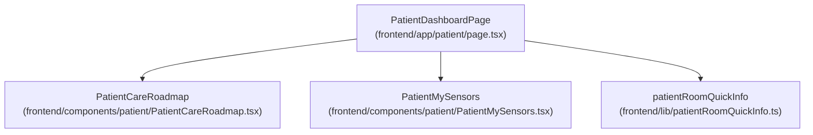
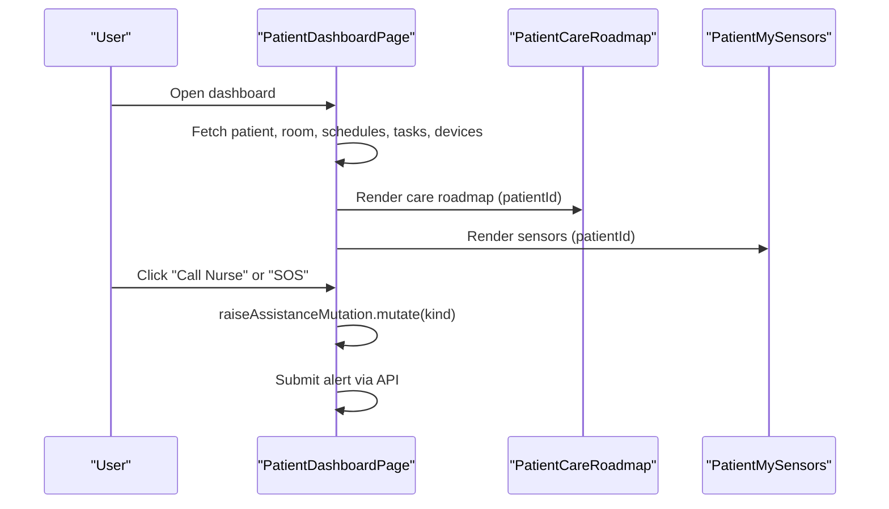
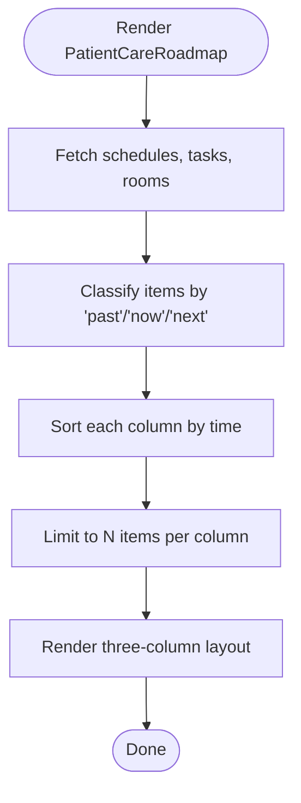
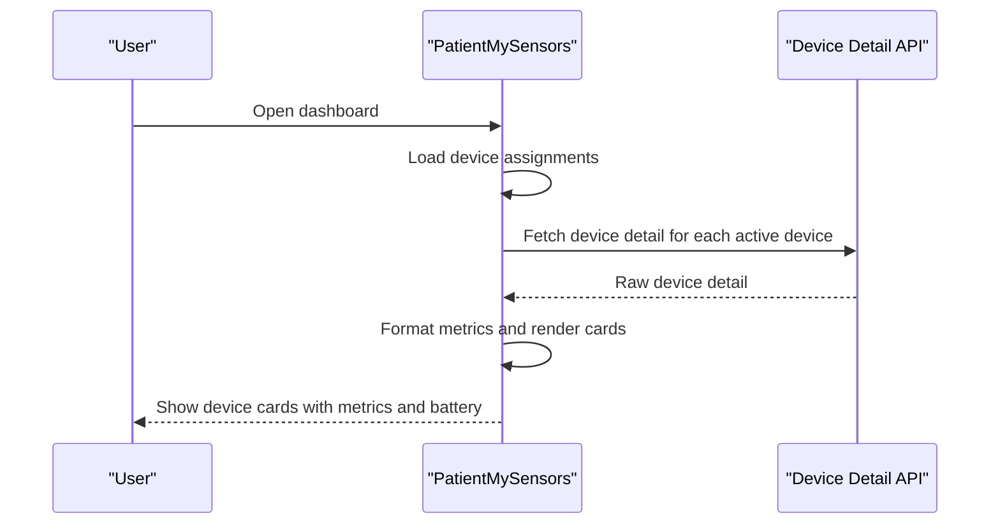
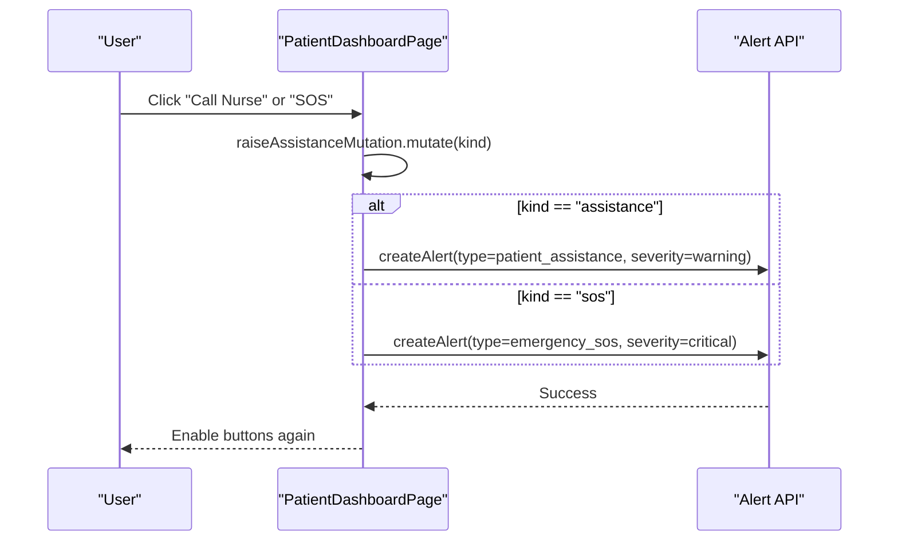
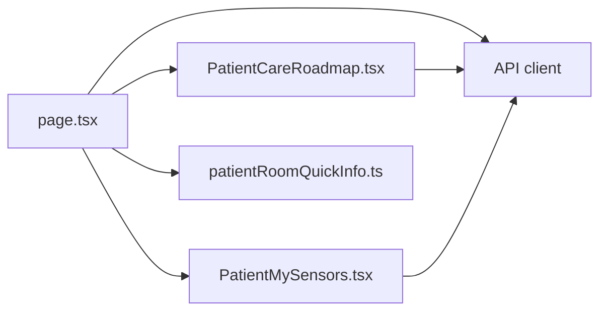

# Patient Overview Dashboard

<cite>
**Referenced Files in This Document**
- [frontend/app/patient/page.tsx](file://frontend/app/patient/page.tsx)
- [frontend/components/patient/PatientCareRoadmap.tsx](file://frontend/components/patient/PatientCareRoadmap.tsx)
- [frontend/components/patient/PatientMySensors.tsx](file://frontend/components/patient/PatientMySensors.tsx)
- [frontend/lib/patientRoomQuickInfo.ts](file://frontend/lib/patientRoomQuickInfo.ts)
</cite>

## Table of Contents
1. [Introduction](#introduction)
2. [Project Structure](#project-structure)
3. [Core Components](#core-components)
4. [Architecture Overview](#architecture-overview)
5. [Detailed Component Analysis](#detailed-component-analysis)
6. [Dependency Analysis](#dependency-analysis)
7. [Performance Considerations](#performance-considerations)
8. [Troubleshooting Guide](#troubleshooting-guide)
9. [Conclusion](#conclusion)

## Introduction
This document describes the Patient Overview Dashboard, a central UI surface for patients to understand their care roadmap, monitor health-related devices, see their current room location, and quickly access essential services. It covers the care roadmap visualization, the patient sensor monitoring interface, the room location display, emergency assistance buttons, quick links grid, and the responsive design patterns used.

## Project Structure
The dashboard is implemented as a Next.js page that composes several focused React components:
- The main page orchestrates data fetching, layout, and tabbed navigation.
- The care roadmap component renders upcoming, current, and past care items.
- The sensors component aggregates and displays real-time metrics from assigned devices.
- A utility module provides a concise room label for quick info contexts.

**Diagram sources**
- [frontend/app/patient/page.tsx](file://frontend/app/patient/page.tsx)
- [frontend/components/patient/PatientCareRoadmap.tsx](file://frontend/components/patient/PatientCareRoadmap.tsx)
- [frontend/components/patient/PatientMySensors.tsx](file://frontend/components/patient/PatientMySensors.tsx)
- [frontend/lib/patientRoomQuickInfo.ts](file://frontend/lib/patientRoomQuickInfo.ts)

**Section sources**
- [frontend/app/patient/page.tsx](file://frontend/app/patient/page.tsx)
- [frontend/components/patient/PatientCareRoadmap.tsx](file://frontend/components/patient/PatientCareRoadmap.tsx)
- [frontend/components/patient/PatientMySensors.tsx](file://frontend/components/patient/PatientMySensors.tsx)
- [frontend/lib/patientRoomQuickInfo.ts](file://frontend/lib/patientRoomQuickInfo.ts)

## Core Components
- PatientCareRoadmap: Displays care schedules and tasks grouped into Past, Now, and Next columns, with room locations and status badges.
- PatientMySensors: Lists active device assignments and shows device-specific metrics and battery status.
- Room Location: Shows current ward and room assignment using a concise single-line label.
- Emergency Assistance Buttons: Two prominent call buttons for routine assistance and SOS with mutation-based submission and safety guards.
- Quick Links Grid: Four quick-access tiles linking to schedule, room controls, messaging, and services.

**Section sources**
- [frontend/components/patient/PatientCareRoadmap.tsx](file://frontend/components/patient/PatientCareRoadmap.tsx)
- [frontend/components/patient/PatientMySensors.tsx](file://frontend/components/patient/PatientMySensors.tsx)
- [frontend/app/patient/page.tsx](file://frontend/app/patient/page.tsx)
- [frontend/lib/patientRoomQuickInfo.ts](file://frontend/lib/patientRoomQuickInfo.ts)

## Architecture Overview
The dashboard follows a client-side React pattern with TanStack Query for data fetching and caching. It organizes UI into cohesive sections and uses a tabbed layout for navigation. Emergency actions are handled via mutations with pending-state safeguards.

**Diagram sources**
- [frontend/app/patient/page.tsx](file://frontend/app/patient/page.tsx)
- [frontend/components/patient/PatientCareRoadmap.tsx](file://frontend/components/patient/PatientCareRoadmap.tsx)
- [frontend/components/patient/PatientMySensors.tsx](file://frontend/components/patient/PatientMySensors.tsx)

## Detailed Component Analysis

### PatientCareRoadmap
Purpose:
- Visualize a patient’s care roadmap across three temporal columns: Past, Now, and Next.
- Aggregate both scheduled events and individual tasks.
- Show room location and status badges for each item.

Key behaviors:
- Uses date classification to place items into columns based on schedule windows and task due dates.
- Limits each column to a fixed number of entries.
- Renders schedule items with title, formatted time, schedule type, optional room label, and status badge.
- Renders task items with title, optional description, due time, and status badge.
- Provides a link to the full schedule.

Implementation highlights:
- Queries for schedules, tasks, and rooms, then computes columns client-side.
- Uses a time comparator to sort each column appropriately.
- Applies distinct visual tones to highlight the “Now” column.

**Diagram sources**
- [frontend/components/patient/PatientCareRoadmap.tsx](file://frontend/components/patient/PatientCareRoadmap.tsx)

**Section sources**
- [frontend/components/patient/PatientCareRoadmap.tsx](file://frontend/components/patient/PatientCareRoadmap.tsx)

### PatientMySensors
Purpose:
- Display active device assignments for a patient and their latest metrics.
- Show device role, hardware type, and battery level with a progress indicator.
- Present device-specific metrics (e.g., wheelchair distance/velocity, mobile steps, Polar heart rate).

Key behaviors:
- Loads device assignments and deduplicates by device ID.
- Issues separate queries for each active device to fetch raw device details.
- Formats metrics consistently and handles missing or invalid values.
- Supports multiple hardware types with appropriate icons and metric sets.

**Diagram sources**
- [frontend/components/patient/PatientMySensors.tsx](file://frontend/components/patient/PatientMySensors.tsx)

**Section sources**
- [frontend/components/patient/PatientMySensors.tsx](file://frontend/components/patient/PatientMySensors.tsx)

### Room Location Display
Purpose:
- Provide a concise, single-line label showing the current room and facility context.

Key behaviors:
- Builds a label from room name and facility/floor identifiers.
- Handles missing or loading states gracefully.

Integration:
- Used by the dashboard header to show the current room location prominently.

**Section sources**
- [frontend/lib/patientRoomQuickInfo.ts](file://frontend/lib/patientRoomQuickInfo.ts)
- [frontend/app/patient/page.tsx](file://frontend/app/patient/page.tsx)

### Emergency Assistance Buttons
Purpose:
- Offer two quick-action buttons: Call Nurse (routine assistance) and SOS (emergency).
- Prevent duplicate submissions via mutation pending state.

Key behaviors:
- Buttons trigger a mutation that posts an alert with appropriate type and severity.
- Both buttons are disabled while a mutation is pending.
- The SOS button uses a distinctive red theme and animated icon.

**Diagram sources**
- [frontend/app/patient/page.tsx](file://frontend/app/patient/page.tsx)

**Section sources**
- [frontend/app/patient/page.tsx](file://frontend/app/patient/page.tsx)

### Quick Links Grid
Purpose:
- Provide fast access to schedule, room controls, messaging, and services.

Key behaviors:
- Renders a responsive grid of four cards with icons and labels.
- Each tile links to its destination page.

**Section sources**
- [frontend/app/patient/page.tsx](file://frontend/app/patient/page.tsx)

## Dependency Analysis
The dashboard composes multiple modules and components with clear boundaries:
- The page depends on the roadmap and sensors components.
- The page uses a room quick-info utility for concise labeling.
- Data fetching is centralized around TanStack Query hooks.
- Emergency actions are handled via a mutation hook.

**Diagram sources**
- [frontend/app/patient/page.tsx](file://frontend/app/patient/page.tsx)
- [frontend/components/patient/PatientCareRoadmap.tsx](file://frontend/components/patient/PatientCareRoadmap.tsx)
- [frontend/components/patient/PatientMySensors.tsx](file://frontend/components/patient/PatientMySensors.tsx)
- [frontend/lib/patientRoomQuickInfo.ts](file://frontend/lib/patientRoomQuickInfo.ts)

**Section sources**
- [frontend/app/patient/page.tsx](file://frontend/app/patient/page.tsx)
- [frontend/components/patient/PatientCareRoadmap.tsx](file://frontend/components/patient/PatientCareRoadmap.tsx)
- [frontend/components/patient/PatientMySensors.tsx](file://frontend/components/patient/PatientMySensors.tsx)
- [frontend/lib/patientRoomQuickInfo.ts](file://frontend/lib/patientRoomQuickInfo.ts)

## Performance Considerations
- Efficient data fetching: Queries are scoped to patient context and use caching keys to avoid redundant requests.
- Client-side sorting: Sorting occurs after data aggregation to minimize server load.
- Progressive rendering: Skeletons are shown during initial load to improve perceived performance.
- Refetch intervals: Device detail queries refresh periodically to keep metrics fresh without manual polling.

[No sources needed since this section provides general guidance]

## Troubleshooting Guide
Common issues and resolutions:
- Empty or stale care roadmap:
  - Verify schedule and task queries return data for the patient.
  - Confirm room metadata is available for location labels.
- No sensors displayed:
  - Ensure active device assignments exist for the patient.
  - Check device detail queries succeed and return metrics.
- Room label shows loading or unavailable:
  - Confirm room query is enabled and receives a valid room object.
- Emergency buttons disabled:
  - Wait for the mutation to complete; avoid rapid repeated clicks.
- Quick links not visible:
  - Ensure the grid is rendered under the overview tab and responsive breakpoints are met.

**Section sources**
- [frontend/app/patient/page.tsx](file://frontend/app/patient/page.tsx)
- [frontend/components/patient/PatientCareRoadmap.tsx](file://frontend/components/patient/PatientCareRoadmap.tsx)
- [frontend/components/patient/PatientMySensors.tsx](file://frontend/components/patient/PatientMySensors.tsx)
- [frontend/lib/patientRoomQuickInfo.ts](file://frontend/lib/patientRoomQuickInfo.ts)

## Conclusion
The Patient Overview Dashboard integrates care roadmap, device sensor monitoring, room location, emergency assistance, and quick access links into a cohesive, mobile-first interface. Its modular design, robust data fetching, and safety mechanisms ensure reliability and usability for patients.