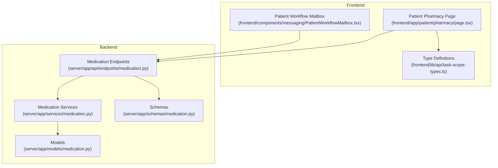
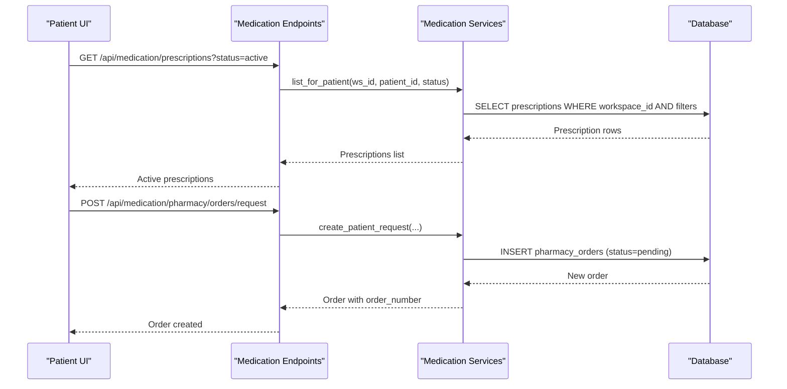
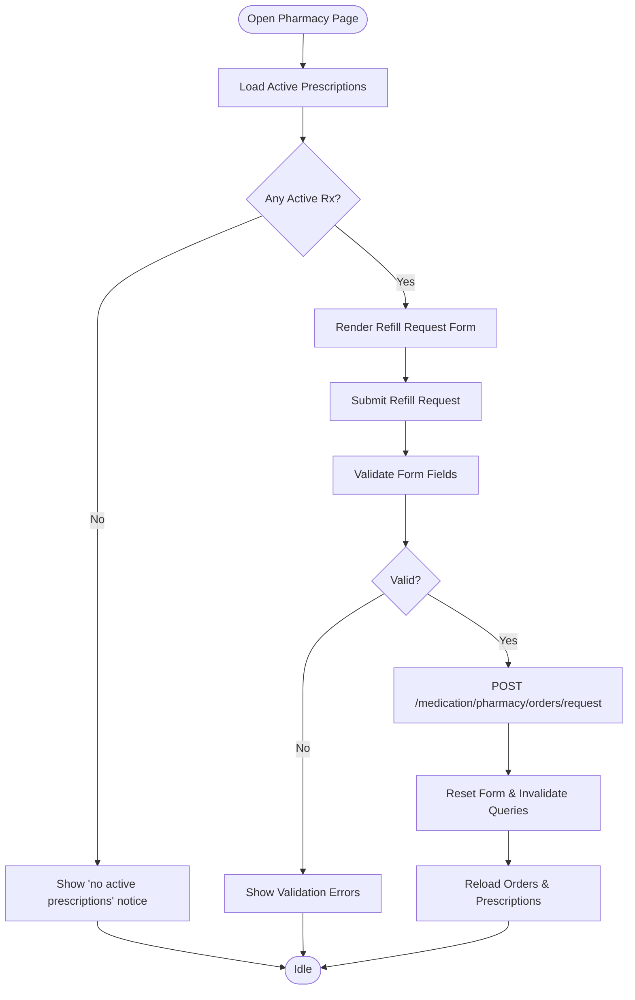
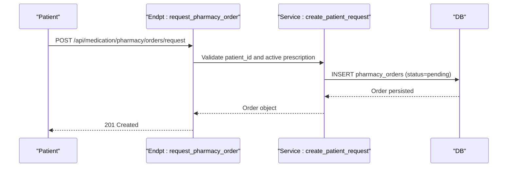
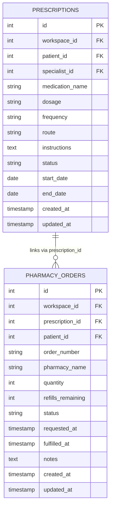
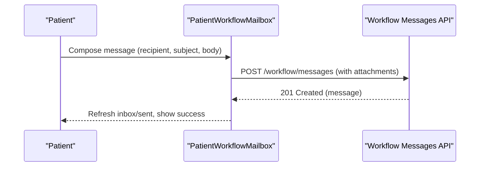
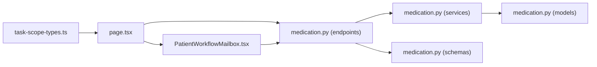

# Patient Pharmacy Services

<cite>
**Referenced Files in This Document**
- [page.tsx](file://frontend/app/patient/pharmacy/page.tsx)
- [medication.py](file://server/app/api/endpoints/medication.py)
- [medication.py](file://server/app/models/medication.py)
- [medication.py](file://server/app/services/medication.py)
- [medication.py](file://server/app/schemas/medication.py)
- [task-scope-types.ts](file://frontend/lib/api/task-scope-types.ts)
- [PatientWorkflowMailbox.tsx](file://frontend/components/messaging/PatientWorkflowMailbox.tsx)
- [workflowMessaging.ts](file://frontend/lib/workflowMessaging.ts)
- [page.tsx](file://frontend/app/patient/messages/page.tsx)
</cite>

## Table of Contents
1. [Introduction](#introduction)
2. [Project Structure](#project-structure)
3. [Core Components](#core-components)
4. [Architecture Overview](#architecture-overview)
5. [Detailed Component Analysis](#detailed-component-analysis)
6. [Dependency Analysis](#dependency-analysis)
7. [Performance Considerations](#performance-considerations)
8. [Troubleshooting Guide](#troubleshooting-guide)
9. [Conclusion](#conclusion)

## Introduction
This document describes the Patient Pharmacy Services interface that enables patients to request prescriptions, track order status, and receive delivery notifications. It also documents the integration with the workflow messaging system for pharmacy-related communications with healthcare providers, the prescription history view, and the safety considerations around active prescriptions. Examples of common workflows include requesting refills, checking medication availability via active prescriptions, and receiving delivery notifications through order status updates.

## Project Structure
The Patient Pharmacy Services spans the frontend and backend:
- Frontend: A dedicated patient-facing page for pharmacy services and a shared workflow messaging component used by patients.
- Backend: API endpoints for prescriptions and pharmacy orders, SQLAlchemy models, Pydantic schemas, and service layer business logic.

**Diagram sources**
- [page.tsx:1-413](file://frontend/app/patient/pharmacy/page.tsx#L1-L413)
- [medication.py:1-169](file://server/app/api/endpoints/medication.py#L1-L169)
- [medication.py:1-108](file://server/app/services/medication.py#L1-L108)
- [medication.py:1-54](file://server/app/models/medication.py#L1-L54)
- [medication.py:1-89](file://server/app/schemas/medication.py#L1-L89)
- [PatientWorkflowMailbox.tsx:1-517](file://frontend/components/messaging/PatientWorkflowMailbox.tsx#L1-L517)
- [task-scope-types.ts:1-406](file://frontend/lib/api/task-scope-types.ts#L1-L406)

**Section sources**
- [page.tsx:1-413](file://frontend/app/patient/pharmacy/page.tsx#L1-L413)
- [medication.py:1-169](file://server/app/api/endpoints/medication.py#L1-L169)
- [medication.py:1-108](file://server/app/services/medication.py#L1-L108)
- [medication.py:1-54](file://server/app/models/medication.py#L1-L54)
- [medication.py:1-89](file://server/app/schemas/medication.py#L1-L89)
- [PatientWorkflowMailbox.tsx:1-517](file://frontend/components/messaging/PatientWorkflowMailbox.tsx#L1-L517)
- [task-scope-types.ts:1-406](file://frontend/lib/api/task-scope-types.ts#L1-L406)

## Core Components
- Patient Pharmacy Page: Provides refill request form, active prescriptions list, and pharmacy orders history.
- Backend API: Exposes endpoints to list prescriptions, list/create/update pharmacy orders, and submit refill requests.
- Services and Models: Encapsulate business logic and persistence for prescriptions and orders.
- Workflow Messaging Integration: Allows patients to communicate with providers through a shared mailbox component.

Key capabilities:
- Request refills for active prescriptions.
- View active prescriptions and order history with status and timestamps.
- Receive delivery notifications via order fulfillment timestamps.
- Communicate with providers using the workflow messaging system.

**Section sources**
- [page.tsx:71-413](file://frontend/app/patient/pharmacy/page.tsx#L71-L413)
- [medication.py:35-169](file://server/app/api/endpoints/medication.py#L35-L169)
- [medication.py:22-108](file://server/app/services/medication.py#L22-L108)
- [medication.py:10-54](file://server/app/models/medication.py#L10-L54)
- [medication.py:11-89](file://server/app/schemas/medication.py#L11-L89)
- [PatientWorkflowMailbox.tsx:71-517](file://frontend/components/messaging/PatientWorkflowMailbox.tsx#L71-L517)

## Architecture Overview
The system follows a layered architecture:
- Presentation layer (React): Patient Pharmacy Page and Messaging UI.
- API layer (FastAPI): Endpoints for medication domain.
- Service layer: Business logic for prescriptions and orders.
- Persistence layer: SQLAlchemy models mapped to database tables.

**Diagram sources**
- [medication.py:35-55](file://server/app/api/endpoints/medication.py#L35-L55)
- [medication.py:131-152](file://server/app/api/endpoints/medication.py#L131-L152)
- [medication.py:22-44](file://server/app/services/medication.py#L22-L44)
- [medication.py:74-103](file://server/app/services/medication.py#L74-L103)
- [medication.py:10-54](file://server/app/models/medication.py#L10-L54)

## Detailed Component Analysis

### Patient Pharmacy Page
Responsibilities:
- Fetch and display active prescriptions for the logged-in patient.
- Fetch and display pharmacy orders with status, quantities, and timestamps.
- Submit refill requests bound to an active prescription.

Key UI elements:
- Refill request form with fields for prescription selection, pharmacy name, quantity, and notes.
- Tables for active prescriptions and orders with sorting and relative timestamps.
- Validation and error feedback.

Processing logic highlights:
- Uses React Query to fetch data and invalidate caches on successful actions.
- Enforces that refill requests target active prescriptions only.
- Generates order numbers and sets initial status to pending.

**Diagram sources**
- [page.tsx:84-130](file://frontend/app/patient/pharmacy/page.tsx#L84-L130)
- [page.tsx:132-189](file://frontend/app/patient/pharmacy/page.tsx#L132-L189)
- [page.tsx:293-387](file://frontend/app/patient/pharmacy/page.tsx#L293-L387)

**Section sources**
- [page.tsx:71-413](file://frontend/app/patient/pharmacy/page.tsx#L71-L413)

### Backend API: Prescriptions and Orders
Endpoints:
- GET /api/medication/prescriptions: Lists prescriptions with optional filters (patient, status).
- POST /api/medication/pharmacy/orders: Creates an order (staff-only).
- POST /api/medication/pharmacy/orders/request: Submits a refill request (patient-only).
- PATCH /api/medication/pharmacy/orders/{id}: Updates an order (staff-only).

Access control:
- Patient role can list orders and submit refill requests for themselves.
- Staff roles (admin, head_nurse, supervisor) can manage orders and prescribe.

**Diagram sources**
- [medication.py:131-152](file://server/app/api/endpoints/medication.py#L131-L152)
- [medication.py:74-103](file://server/app/services/medication.py#L74-L103)

**Section sources**
- [medication.py:35-169](file://server/app/api/endpoints/medication.py#L35-L169)

### Data Models and Schemas
Models:
- Prescription: Medication details, status, dates, and foreign keys to patient and workspace.
- PharmacyOrder: Order metadata, status, timestamps, and links to prescription and patient.

Schemas:
- Pydantic models define request/response shapes, validation rules, and enums for statuses.

**Diagram sources**
- [medication.py:10-54](file://server/app/models/medication.py#L10-L54)

**Section sources**
- [medication.py:10-54](file://server/app/models/medication.py#L10-L54)
- [medication.py:11-89](file://server/app/schemas/medication.py#L11-L89)

### Workflow Messaging Integration
The Patient Workflow Mailbox provides:
- Compose and send messages to recipients (roles/users).
- View inbox and sent items with read/unread status.
- Attachments support with limits and download URLs.
- Delete capability based on permissions.

Integration touchpoints:
- Patient messages page routes to the shared mailbox component.
- Attachment URLs constructed via a helper for cookie-authenticated downloads.
- Permissions enforced for deletion based on sender/recipient identity and role.

**Diagram sources**
- [PatientWorkflowMailbox.tsx:97-129](file://frontend/components/messaging/PatientWorkflowMailbox.tsx#L97-L129)
- [workflowMessaging.ts:1-21](file://frontend/lib/workflowMessaging.ts#L1-L21)
- [page.tsx:1-7](file://frontend/app/patient/messages/page.tsx#L1-L7)

**Section sources**
- [PatientWorkflowMailbox.tsx:71-517](file://frontend/components/messaging/PatientWorkflowMailbox.tsx#L71-L517)
- [workflowMessaging.ts:1-21](file://frontend/lib/workflowMessaging.ts#L1-L21)
- [page.tsx:1-7](file://frontend/app/patient/messages/page.tsx#L1-L7)

## Dependency Analysis
- Frontend depends on:
  - API types for typed requests/responses.
  - React Query for caching and invalidation.
  - UI components for forms and tables.
- Backend depends on:
  - SQLAlchemy for ORM and queries.
  - Pydantic for serialization/validation.
  - Role-based access control for endpoints.

**Diagram sources**
- [task-scope-types.ts:100-147](file://frontend/lib/api/task-scope-types.ts#L100-L147)
- [page.tsx:84-94](file://frontend/app/patient/pharmacy/page.tsx#L84-L94)
- [medication.py:35-169](file://server/app/api/endpoints/medication.py#L35-L169)
- [medication.py:22-108](file://server/app/services/medication.py#L22-L108)
- [medication.py:10-54](file://server/app/models/medication.py#L10-L54)
- [medication.py:11-89](file://server/app/schemas/medication.py#L11-L89)
- [PatientWorkflowMailbox.tsx:85-95](file://frontend/components/messaging/PatientWorkflowMailbox.tsx#L85-L95)

**Section sources**
- [task-scope-types.ts:100-147](file://frontend/lib/api/task-scope-types.ts#L100-L147)
- [page.tsx:84-94](file://frontend/app/patient/pharmacy/page.tsx#L84-L94)
- [medication.py:35-169](file://server/app/api/endpoints/medication.py#L35-L169)

## Performance Considerations
- Pagination and limits: Queries limit results to prevent large payloads.
- Sorting and indexing: Results are sorted by creation timestamps and indexed appropriately.
- Caching: React Query caches queries keyed by patient and scope to reduce network calls.
- Background refresh: Messaging inbox polls periodically to keep data fresh.

Recommendations:
- Keep query filters narrow (patient_id, status) to minimize scans.
- Use relative timestamps for UI to avoid frequent re-renders.
- Batch invalidations after mutations to avoid redundant refetches.

[No sources needed since this section provides general guidance]

## Troubleshooting Guide
Common issues and resolutions:
- No active prescriptions: The refill form disables input and shows a contextual message when none are present.
- Patient profile missing: Requests fail early if the user account is not linked to a patient record.
- Validation errors: Form displays inline errors for required fields and numeric constraints.
- Order not found: Updating orders requires a valid order ID; otherwise, the endpoint returns not found.
- Access denied: Staff-only endpoints require appropriate roles; patients cannot call them.

Operational tips:
- After submitting a refill request, invalidate the pharmacy query cache to refresh lists.
- For messaging, ensure recipients are selected and content is present before sending.

**Section sources**
- [page.tsx:76-81](file://frontend/app/patient/pharmacy/page.tsx#L76-L81)
- [page.tsx:371-379](file://frontend/app/patient/pharmacy/page.tsx#L371-L379)
- [medication.py:138-140](file://server/app/api/endpoints/medication.py#L138-L140)
- [medication.py:163-165](file://server/app/api/endpoints/medication.py#L163-L165)

## Conclusion
The Patient Pharmacy Services interface integrates seamlessly with backend APIs to let patients request refills against active prescriptions, track order status, and communicate with providers via workflow messaging. The system enforces role-based access, validates inputs, and maintains clear separation between UI, API, service, and persistence layers. Pharmacy staff can process orders while patients receive timely updates and notifications through order status changes.