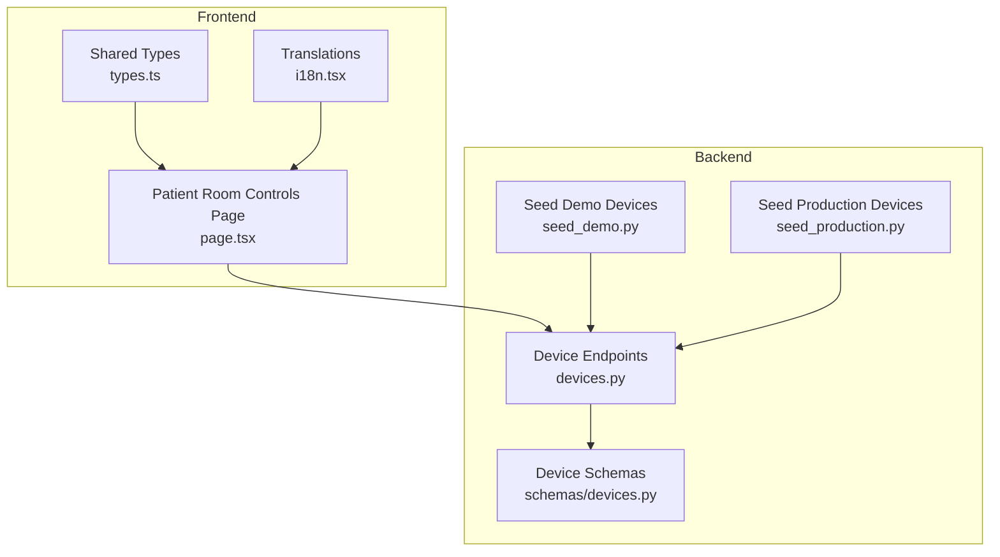
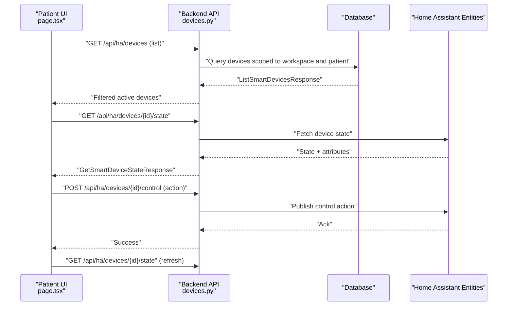
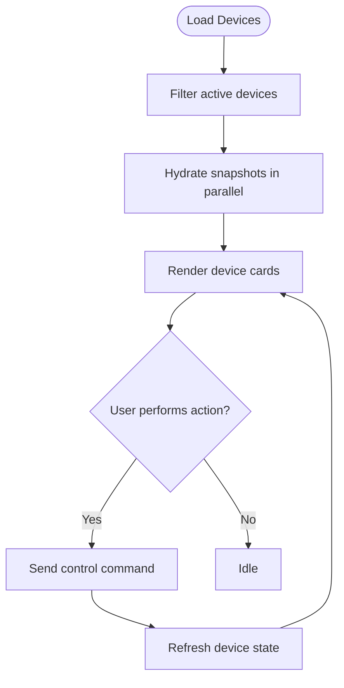
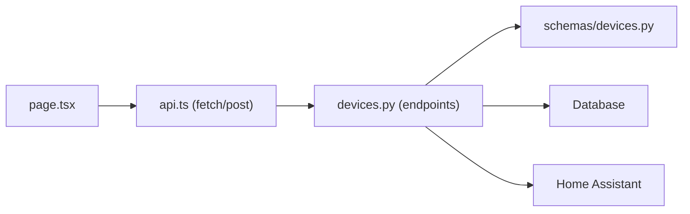

# Patient Room Controls

<cite>
**Referenced Files in This Document**
- [page.tsx](file://frontend/app/patient/room-controls/page.tsx)
- [types.ts](file://frontend/lib/types.ts)
- [devices.py](file://server/app/api/endpoints/devices.py)
- [devices.py](file://server/app/schemas/devices.py)
- [seed_demo.py](file://server/scripts/seed_demo.py)
- [seed_production.py](file://server/scripts/seed_production.py)
- [i18n.tsx](file://frontend/lib/i18n.tsx)
</cite>

## Table of Contents
1. [Introduction](#introduction)
2. [Project Structure](#project-structure)
3. [Core Components](#core-components)
4. [Architecture Overview](#architecture-overview)
5. [Detailed Component Analysis](#detailed-component-analysis)
6. [Dependency Analysis](#dependency-analysis)
7. [Performance Considerations](#performance-considerations)
8. [Troubleshooting Guide](#troubleshooting-guide)
9. [Conclusion](#conclusion)

## Introduction
This document describes the Patient Room Controls interface that allows patients to manage their immediate room environment. It covers how smart devices are integrated (lights, fans, switches, climate), how device status is monitored, and how room configuration options are surfaced. It also documents common usage scenarios (sleep, visitors, medical procedures), security and permission controls, and the backend integration with Home Assistant entities.

## Project Structure
The Patient Room Controls feature spans the frontend Next.js application and the backend FastAPI server:
- Frontend page renders device cards, handles user actions, and displays device snapshots.
- Backend exposes device listing and control endpoints with role-based access.
- Seed scripts populate smart devices mapped to rooms and Home Assistant entities.



**Diagram sources**
- [page.tsx:156-445](file://frontend/app/patient/room-controls/page.tsx#L156-L445)
- [types.ts:113-125](file://frontend/lib/types.ts#L113-L125)
- [devices.py:63-88](file://server/app/api/endpoints/devices.py#L63-L88)
- [devices.py:12-31](file://server/app/schemas/devices.py#L12-L31)
- [seed_demo.py:430-479](file://server/scripts/seed_demo.py#L430-L479)
- [seed_production.py:1026-1052](file://server/scripts/seed_production.py#L1026-L1052)

**Section sources**
- [page.tsx:156-445](file://frontend/app/patient/room-controls/page.tsx#L156-L445)
- [devices.py:63-88](file://server/app/api/endpoints/devices.py#L63-L88)

## Core Components
- Device listing and filtering: The frontend lists active smart devices assigned to the patient’s room/workspace and filters out inactive devices.
- Device kind detection: The UI detects device kinds (light, fan, switch, climate) from device_type and HA entity identifiers.
- Device snapshots: For each device, the UI fetches a real-time state snapshot and displays state, attributes, and last updated time.
- Action controls: For supported device kinds, the UI exposes turn on/off/toggle actions and, for climate devices, a temperature setpoint control.
- Status monitoring: The UI surfaces device errors, refresh indicators, and a summary of active, controllable, and read-only devices.
- Permissions: The backend enforces role-based access so only authenticated patients can list and control devices assigned to them.

**Section sources**
- [page.tsx:99-141](file://frontend/app/patient/room-controls/page.tsx#L99-L141)
- [page.tsx:181-265](file://frontend/app/patient/room-controls/page.tsx#L181-L265)
- [page.tsx:447-607](file://frontend/app/patient/room-controls/page.tsx#L447-L607)
- [devices.py:63-88](file://server/app/api/endpoints/devices.py#L63-L88)

## Architecture Overview
The room controls feature integrates the frontend UI with backend APIs and Home Assistant entities via the device registry.



**Diagram sources**
- [page.tsx:221-265](file://frontend/app/patient/room-controls/page.tsx#L221-L265)
- [page.tsx:290-356](file://frontend/app/patient/room-controls/page.tsx#L290-L356)
- [devices.py:63-88](file://server/app/api/endpoints/devices.py#L63-L88)
- [devices.py:241-263](file://server/app/api/endpoints/devices.py#L241-L263)

## Detailed Component Analysis

### Frontend: Patient Room Controls Page
- Responsibilities:
  - Load and display active smart devices.
  - Fetch and render device snapshots with state and attributes.
  - Render actionable controls based on device kind.
  - Allow temperature setpoint updates for climate devices.
  - Surface errors and refresh indicators.
- Key behaviors:
  - Device kind resolution: Uses device_type and HA entity ID to classify devices as light, fan, switch, climate, or unsupported.
  - Snapshot hydration: Loads state for all visible devices concurrently and records errors.
  - Action dispatch: Sends control commands and refreshes state afterward.
  - Temperature editing: Supports numeric input with min/max/step constraints for climate devices.



**Diagram sources**
- [page.tsx:181-265](file://frontend/app/patient/room-controls/page.tsx#L181-L265)
- [page.tsx:330-356](file://frontend/app/patient/room-controls/page.tsx#L330-L356)

**Section sources**
- [page.tsx:99-141](file://frontend/app/patient/room-controls/page.tsx#L99-L141)
- [page.tsx:181-265](file://frontend/app/patient/room-controls/page.tsx#L181-L265)
- [page.tsx:290-356](file://frontend/app/patient/room-controls/page.tsx#L290-L356)
- [page.tsx:447-607](file://frontend/app/patient/room-controls/page.tsx#L447-L607)

### Backend: Device Endpoints and Permissions
- Device listing:
  - Returns devices filtered by workspace and, for authenticated patients, limited to devices assigned to the patient.
- Control endpoints:
  - Enforce roles for device command dispatch.
- Activity logging:
  - Logs device command dispatches and registry changes.

```mermaid
classDiagram
class DeviceEndpoints {
+GET /api/devices
+GET /api/devices/{id}
+POST /api/devices/{id}/commands
}
class DeviceSchemas {
+DeviceCommandRequest
+DeviceCommandOut
}
DeviceEndpoints --> DeviceSchemas : "uses"
```

**Diagram sources**
- [devices.py:63-88](file://server/app/api/endpoints/devices.py#L63-L88)
- [devices.py:241-263](file://server/app/api/endpoints/devices.py#L241-L263)
- [devices.py:26-42](file://server/app/schemas/devices.py#L26-L42)

**Section sources**
- [devices.py:63-88](file://server/app/api/endpoints/devices.py#L63-L88)
- [devices.py:241-263](file://server/app/api/endpoints/devices.py#L241-L263)
- [devices.py:26-42](file://server/app/schemas/devices.py#L26-L42)

### Shared Types: Smart Device Model
- The frontend uses a SmartDevice type representing a room-bound, Home Assistant–mapped device with name, HA entity ID, device type, room association, activation flag, state, and config.

**Section sources**
- [types.ts:113-125](file://frontend/lib/types.ts#L113-L125)

### Translations: UI Labels and Messages
- The UI uses translation keys for room controls, including badges, titles, placeholders, action labels, and help text.

**Section sources**
- [i18n.tsx:2856-2874](file://frontend/lib/i18n.tsx#L2856-L2874)

### Seed Scripts: Device Population
- Demo and production seed scripts create smart devices per room and map them to Home Assistant entities, ensuring the UI has devices to display and control.

**Section sources**
- [seed_demo.py:430-479](file://server/scripts/seed_demo.py#L430-L479)
- [seed_production.py:1026-1052](file://server/scripts/seed_production.py#L1026-L1052)

## Dependency Analysis
- Frontend depends on:
  - API client for device listing and control.
  - Shared types for device models.
  - Translation keys for UI text.
- Backend depends on:
  - Device schemas for request/response modeling.
  - Role checks to enforce access control.
  - Device management services to interact with device registries and dispatch commands.



**Diagram sources**
- [page.tsx:221-265](file://frontend/app/patient/room-controls/page.tsx#L221-L265)
- [devices.py:63-88](file://server/app/api/endpoints/devices.py#L63-L88)
- [devices.py:26-42](file://server/app/schemas/devices.py#L26-L42)

**Section sources**
- [page.tsx:221-265](file://frontend/app/patient/room-controls/page.tsx#L221-L265)
- [devices.py:63-88](file://server/app/api/endpoints/devices.py#L63-L88)
- [devices.py:26-42](file://server/app/schemas/devices.py#L26-L42)

## Performance Considerations
- Parallel snapshot hydration: The UI fetches states for all visible devices concurrently to reduce perceived latency.
- Localized error handling: Errors are tracked per device to avoid blocking the entire UI.
- Controlled refresh: A global refresh spinner indicates bulk refresh, while individual device refresh spinners indicate targeted refreshes.
- Numeric parsing: Temperature drafts are validated before dispatch to avoid invalid requests.

[No sources needed since this section provides general guidance]

## Troubleshooting Guide
Common issues and resolutions:
- No devices displayed:
  - Verify the patient is assigned to a room and devices exist in the workspace.
  - Confirm the device is marked active.
- Device shows read-only:
  - Unsupported device kinds are intentionally read-only; only supported kinds (light, fan, switch, climate) expose controls.
- Control failures:
  - Check device error messages rendered in the UI; retry after resolving underlying issues.
- Temperature setpoint not accepted:
  - Ensure the value is within the allowed range and step; verify the device is a climate device with a target temperature attribute.

**Section sources**
- [page.tsx:516-522](file://frontend/app/patient/room-controls/page.tsx#L516-L522)
- [page.tsx:571-601](file://frontend/app/patient/room-controls/page.tsx#L571-L601)

## Conclusion
The Patient Room Controls interface provides a streamlined way for patients to manage their room environment through supported smart devices. It integrates with Home Assistant entities, enforces role-based permissions, and offers robust status monitoring and error reporting. The design supports common scenarios like sleep preparation, visitor setups, and medical procedure adjustments through intuitive controls and clear feedback.