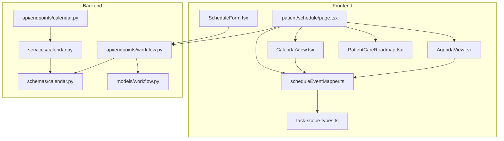
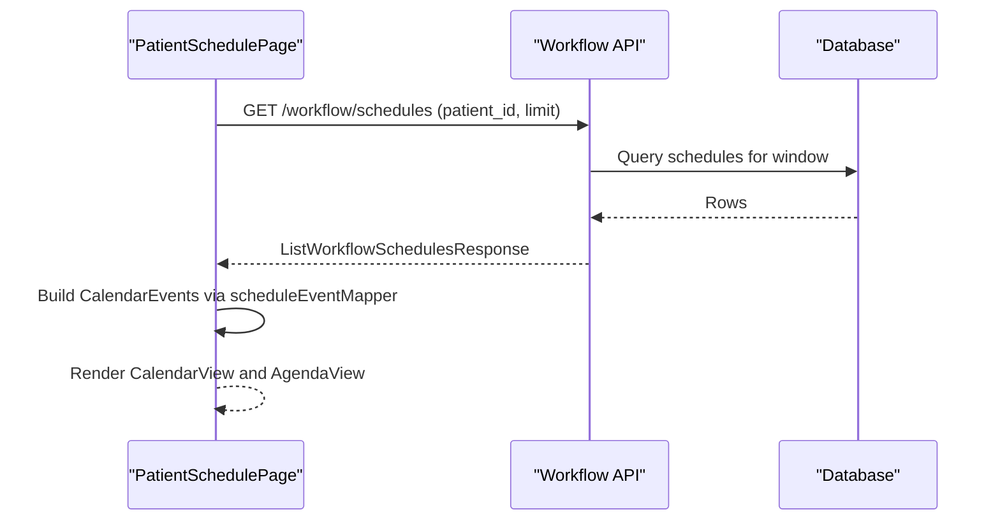
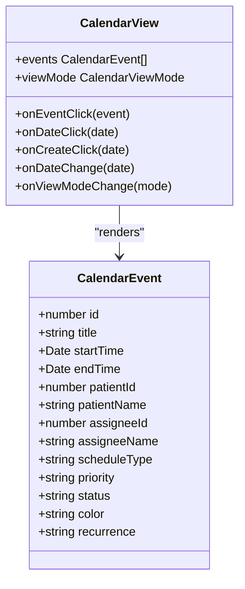
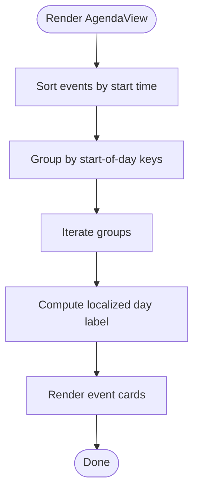
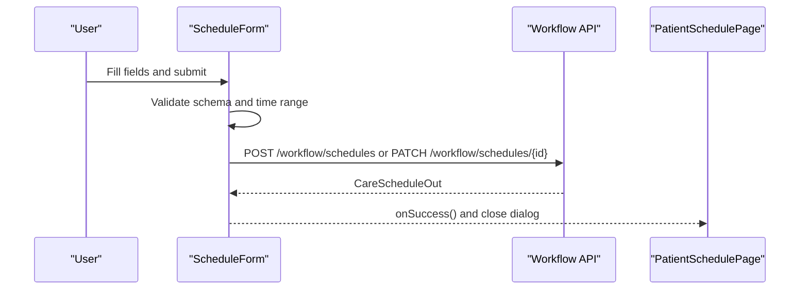
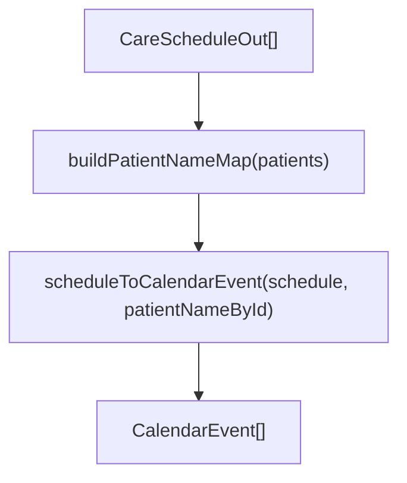
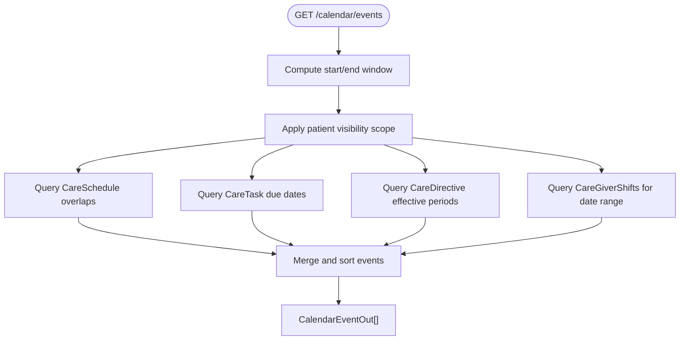
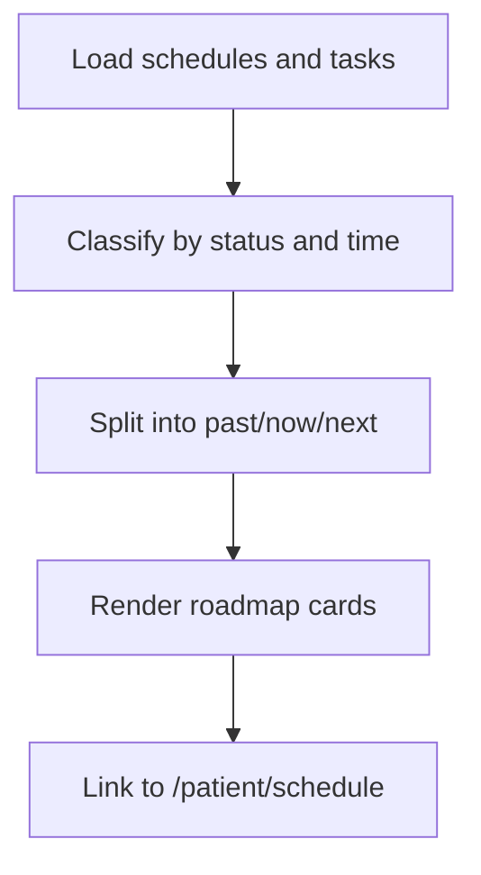
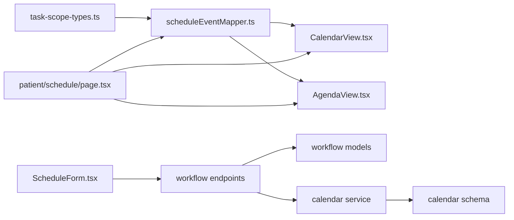

# Patient Schedule Management

<cite>
**Referenced Files in This Document**
- [AgendaView.tsx](file://frontend/components/calendar/AgendaView.tsx)
- [CalendarView.tsx](file://frontend/components/calendar/CalendarView.tsx)
- [ScheduleForm.tsx](file://frontend/components/calendar/ScheduleForm.tsx)
- [scheduleEventMapper.ts](file://frontend/components/calendar/scheduleEventMapper.ts)
- [page.tsx](file://frontend/app/patient/schedule/page.tsx)
- [calendar.py](file://server/app/api/endpoints/calendar.py)
- [calendar.py](file://server/app/services/calendar.py)
- [calendar.py](file://server/app/schemas/calendar.py)
- [workflow.py](file://server/app/api/endpoints/workflow.py)
- [workflow.py](file://server/app/models/workflow.py)
- [task-scope-types.ts](file://frontend/lib/api/task-scope-types.ts)
- [PatientCareRoadmap.tsx](file://frontend/components/patient/PatientCareRoadmap.tsx)
</cite>

## Table of Contents
1. [Introduction](#introduction)
2. [Project Structure](#project-structure)
3. [Core Components](#core-components)
4. [Architecture Overview](#architecture-overview)
5. [Detailed Component Analysis](#detailed-component-analysis)
6. [Dependency Analysis](#dependency-analysis)
7. [Performance Considerations](#performance-considerations)
8. [Troubleshooting Guide](#troubleshooting-guide)
9. [Conclusion](#conclusion)

## Introduction
This document describes the Patient Schedule Management system, focusing on the calendar interface for viewing and managing appointments, treatments, and care activities. It explains the agenda and calendar views, their navigation and filtering capabilities, the schedule form for creating and modifying appointments with validation and conflict detection, and the event mapping system that bridges calendar formats and backend data structures. It also covers integration with the care roadmap, timezone handling, recurring events, and reminders.

## Project Structure
The schedule management spans frontend React components and backend FastAPI services:
- Frontend: Calendar views, agenda view, schedule creation/editing form, and event mapping utilities
- Backend: Calendar read projection, workflow schedule endpoints, and data models

**Diagram sources**
- [AgendaView.tsx:1-233](file://frontend/components/calendar/AgendaView.tsx#L1-L233)
- [CalendarView.tsx:1-496](file://frontend/components/calendar/CalendarView.tsx#L1-L496)
- [ScheduleForm.tsx:1-587](file://frontend/components/calendar/ScheduleForm.tsx#L1-L587)
- [scheduleEventMapper.ts:1-60](file://frontend/components/calendar/scheduleEventMapper.ts#L1-L60)
- [page.tsx:1-254](file://frontend/app/patient/schedule/page.tsx#L1-L254)
- [calendar.py:1-56](file://server/app/api/endpoints/calendar.py#L1-L56)
- [calendar.py:1-286](file://server/app/services/calendar.py#L1-L286)
- [calendar.py:1-31](file://server/app/schemas/calendar.py#L1-L31)
- [workflow.py:110-182](file://server/app/api/endpoints/workflow.py#L110-L182)
- [workflow.py:21-39](file://server/app/models/workflow.py#L21-L39)
- [task-scope-types.ts:35-96](file://frontend/lib/api/task-scope-types.ts#L35-L96)
- [PatientCareRoadmap.tsx:1-293](file://frontend/components/patient/PatientCareRoadmap.tsx#L1-L293)

**Section sources**
- [AgendaView.tsx:1-233](file://frontend/components/calendar/AgendaView.tsx#L1-L233)
- [CalendarView.tsx:1-496](file://frontend/components/calendar/CalendarView.tsx#L1-L496)
- [ScheduleForm.tsx:1-587](file://frontend/components/calendar/ScheduleForm.tsx#L1-L587)
- [scheduleEventMapper.ts:1-60](file://frontend/components/calendar/scheduleEventMapper.ts#L1-L60)
- [page.tsx:1-254](file://frontend/app/patient/schedule/page.tsx#L1-L254)
- [calendar.py:1-56](file://server/app/api/endpoints/calendar.py#L1-L56)
- [calendar.py:1-286](file://server/app/services/calendar.py#L1-L286)
- [calendar.py:1-31](file://server/app/schemas/calendar.py#L1-L31)
- [workflow.py:110-182](file://server/app/api/endpoints/workflow.py#L110-L182)
- [workflow.py:21-39](file://server/app/models/workflow.py#L21-L39)
- [task-scope-types.ts:35-96](file://frontend/lib/api/task-scope-types.ts#L35-L96)
- [PatientCareRoadmap.tsx:1-293](file://frontend/components/patient/PatientCareRoadmap.tsx#L1-L293)

## Core Components
- CalendarView: Renders month, week, and day views with navigation controls and read-only or editable modes
- AgendaView: Presents a chronological list of events grouped by date with optional completion actions
- ScheduleForm: Validates and submits schedule creation/edit requests to the backend
- scheduleEventMapper: Converts backend schedule records into calendar event structures
- PatientSchedulePage: Orchestrates queries, builds calendar events, and renders both calendar and agenda views
- Backend Calendar Projection: Aggregates schedules, tasks, directives, and shifts into a unified calendar feed
- Workflow Schedules: Core data model and endpoints for CRUD operations and status updates

**Section sources**
- [CalendarView.tsx:74-496](file://frontend/components/calendar/CalendarView.tsx#L74-L496)
- [AgendaView.tsx:54-233](file://frontend/components/calendar/AgendaView.tsx#L54-L233)
- [ScheduleForm.tsx:102-587](file://frontend/components/calendar/ScheduleForm.tsx#L102-L587)
- [scheduleEventMapper.ts:25-60](file://frontend/components/calendar/scheduleEventMapper.ts#L25-L60)
- [page.tsx:52-254](file://frontend/app/patient/schedule/page.tsx#L52-L254)
- [calendar.py:77-286](file://server/app/services/calendar.py#L77-L286)
- [workflow.py:21-39](file://server/app/models/workflow.py#L21-L39)

## Architecture Overview
The system integrates frontend calendar components with backend endpoints:
- Frontend queries workflow schedules and maps them to calendar events
- Backend aggregates multiple event sources (schedules, tasks, directives, shifts) into a single calendar projection
- Users can create/edit schedules via the form, which calls workflow endpoints

**Diagram sources**
- [page.tsx:75-114](file://frontend/app/patient/schedule/page.tsx#L75-L114)
- [workflow.py:110-134](file://server/app/api/endpoints/workflow.py#L110-L134)
- [scheduleEventMapper.ts:53-58](file://frontend/components/calendar/scheduleEventMapper.ts#L53-L58)

**Section sources**
- [page.tsx:75-114](file://frontend/app/patient/schedule/page.tsx#L75-L114)
- [workflow.py:110-134](file://server/app/api/endpoints/workflow.py#L110-L134)
- [scheduleEventMapper.ts:53-58](file://frontend/components/calendar/scheduleEventMapper.ts#L53-L58)

## Detailed Component Analysis

### CalendarView Component
- Supports month, week, and day modes with navigation (previous/next/today)
- Renders events with status-aware styling and click handlers for date and event selection
- Provides read-only mode suitable for patient-facing views

**Diagram sources**
- [CalendarView.tsx:35-65](file://frontend/components/calendar/CalendarView.tsx#L35-L65)
- [CalendarView.tsx:74-496](file://frontend/components/calendar/CalendarView.tsx#L74-L496)

**Section sources**
- [CalendarView.tsx:74-496](file://frontend/components/calendar/CalendarView.tsx#L74-L496)

### AgendaView Component
- Groups events by date within a configurable window (default 7 days)
- Displays status icons, priority badges, and optional completion actions
- Localized day labels and empty state handling

**Diagram sources**
- [AgendaView.tsx:66-103](file://frontend/components/calendar/AgendaView.tsx#L66-L103)
- [AgendaView.tsx:93-122](file://frontend/components/calendar/AgendaView.tsx#L93-L122)

**Section sources**
- [AgendaView.tsx:54-233](file://frontend/components/calendar/AgendaView.tsx#L54-L233)

### ScheduleForm Component
- Validates required fields, date/time ordering, and recurrence presets
- Submits create or update requests to workflow endpoints
- Integrates with patient, room, and caregiver lists via React Query

**Diagram sources**
- [ScheduleForm.tsx:57-81](file://frontend/components/calendar/ScheduleForm.tsx#L57-L81)
- [ScheduleForm.tsx:222-248](file://frontend/components/calendar/ScheduleForm.tsx#L222-L248)
- [workflow.py:136-182](file://server/app/api/endpoints/workflow.py#L136-L182)

**Section sources**
- [ScheduleForm.tsx:102-587](file://frontend/components/calendar/ScheduleForm.tsx#L102-L587)
- [workflow.py:136-182](file://server/app/api/endpoints/workflow.py#L136-L182)

### Event Mapping System
- Converts backend schedule records to calendar event structures
- Builds patient name maps for display
- Handles fallback durations and status normalization

**Diagram sources**
- [scheduleEventMapper.ts:16-58](file://frontend/components/calendar/scheduleEventMapper.ts#L16-L58)

**Section sources**
- [scheduleEventMapper.ts:25-60](file://frontend/components/calendar/scheduleEventMapper.ts#L25-L60)
- [task-scope-types.ts:35-36](file://frontend/lib/api/task-scope-types.ts#L35-L36)

### Backend Calendar Projection
- Aggregates schedules, tasks, directives, and shifts into a unified event list
- Applies timezone-aware windows and visibility scoping
- Returns normalized calendar events with edit permissions

**Diagram sources**
- [calendar.py:77-286](file://server/app/services/calendar.py#L77-L286)
- [calendar.py:13-31](file://server/app/schemas/calendar.py#L13-L31)

**Section sources**
- [calendar.py:25-55](file://server/app/api/endpoints/calendar.py#L25-L55)
- [calendar.py:77-286](file://server/app/services/calendar.py#L77-L286)
- [calendar.py:13-31](file://server/app/schemas/calendar.py#L13-L31)

### Integration with Care Roadmap
- The roadmap component classifies schedules and tasks into past/now/next columns
- Links to the schedule page for deeper navigation
- Uses room labels and status badges for contextual information

**Diagram sources**
- [PatientCareRoadmap.tsx:28-132](file://frontend/components/patient/PatientCareRoadmap.tsx#L28-L132)
- [PatientCareRoadmap.tsx:217-222](file://frontend/components/patient/PatientCareRoadmap.tsx#L217-L222)

**Section sources**
- [PatientCareRoadmap.tsx:65-293](file://frontend/components/patient/PatientCareRoadmap.tsx#L65-L293)

## Dependency Analysis
- Frontend depends on task-scope-types for strongly typed API contracts
- Calendar components depend on scheduleEventMapper for data transformation
- PatientSchedulePage orchestrates queries and view rendering
- Backend endpoints depend on SQLAlchemy models and services for business logic

**Diagram sources**
- [task-scope-types.ts:35-96](file://frontend/lib/api/task-scope-types.ts#L35-L96)
- [scheduleEventMapper.ts:1-60](file://frontend/components/calendar/scheduleEventMapper.ts#L1-L60)
- [CalendarView.tsx:1-496](file://frontend/components/calendar/CalendarView.tsx#L1-L496)
- [AgendaView.tsx:1-233](file://frontend/components/calendar/AgendaView.tsx#L1-L233)
- [page.tsx:1-254](file://frontend/app/patient/schedule/page.tsx#L1-L254)
- [ScheduleForm.tsx:1-587](file://frontend/components/calendar/ScheduleForm.tsx#L1-L587)
- [workflow.py:110-182](file://server/app/api/endpoints/workflow.py#L110-L182)
- [workflow.py:21-39](file://server/app/models/workflow.py#L21-L39)
- [calendar.py:1-286](file://server/app/services/calendar.py#L1-L286)
- [calendar.py:1-31](file://server/app/schemas/calendar.py#L1-L31)

**Section sources**
- [task-scope-types.ts:35-96](file://frontend/lib/api/task-scope-types.ts#L35-L96)
- [scheduleEventMapper.ts:1-60](file://frontend/components/calendar/scheduleEventMapper.ts#L1-L60)
- [CalendarView.tsx:1-496](file://frontend/components/calendar/CalendarView.tsx#L1-L496)
- [AgendaView.tsx:1-233](file://frontend/components/calendar/AgendaView.tsx#L1-L233)
- [page.tsx:1-254](file://frontend/app/patient/schedule/page.tsx#L1-L254)
- [ScheduleForm.tsx:1-587](file://frontend/components/calendar/ScheduleForm.tsx#L1-L587)
- [workflow.py:110-182](file://server/app/api/endpoints/workflow.py#L110-L182)
- [workflow.py:21-39](file://server/app/models/workflow.py#L21-L39)
- [calendar.py:1-286](file://server/app/services/calendar.py#L1-L286)
- [calendar.py:1-31](file://server/app/schemas/calendar.py#L1-L31)

## Performance Considerations
- Calendar projections cap results and apply time windows to avoid heavy loads
- Visibility scoping limits cross-patient queries for non-admin roles
- Frontend caches and memoizes derived data (e.g., grouped events, patient name maps)
- Polling intervals and stale times are configured for schedule and resource lists

[No sources needed since this section provides general guidance]

## Troubleshooting Guide
Common issues and resolutions:
- Validation errors in ScheduleForm: Ensure title length, required fields, and end time after start time
- Navigation anomalies: Verify controlled/uncontrolled date props and callback handlers
- Visibility problems: Confirm patient ID scoping and role-based access for calendar endpoints
- Timezone handling: Backend enforces UTC with timezone-aware datetimes; ensure frontend displays align with local expectations

**Section sources**
- [ScheduleForm.tsx:57-81](file://frontend/components/calendar/ScheduleForm.tsx#L57-L81)
- [CalendarView.tsx:93-139](file://frontend/components/calendar/CalendarView.tsx#L93-L139)
- [calendar.py:19-34](file://server/app/services/calendar.py#L19-L34)
- [calendar.py:37-41](file://server/app/api/endpoints/calendar.py#L37-L41)

## Conclusion
The Patient Schedule Management system combines flexible calendar and agenda views with robust backend aggregation and workflow-driven scheduling. Its modular design supports role-based visibility, strong typing, and extensible event mapping, enabling reliable appointment booking, rescheduling, and cancellation workflows integrated with care plans and roadmaps.