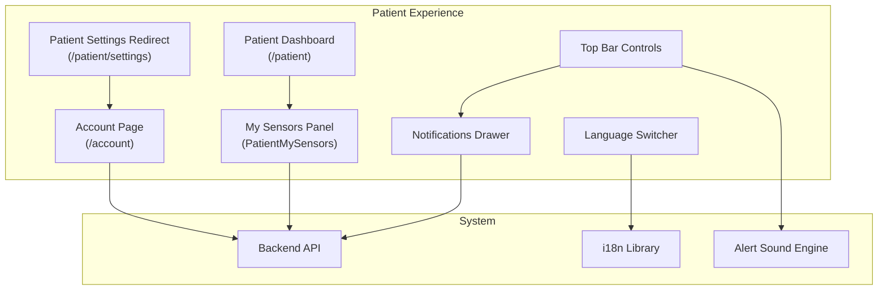
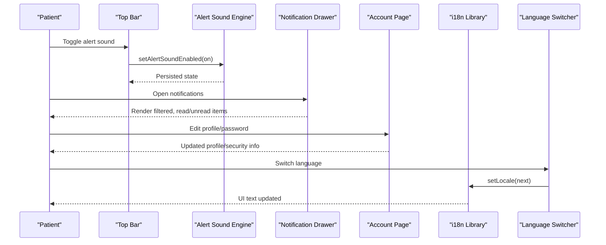
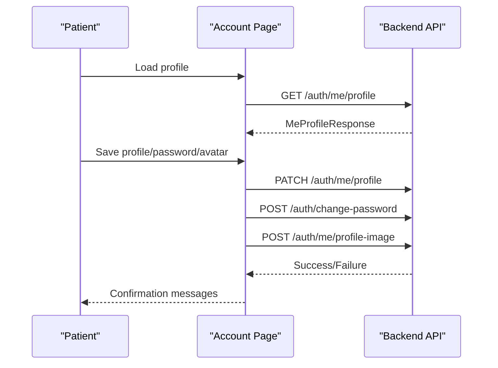
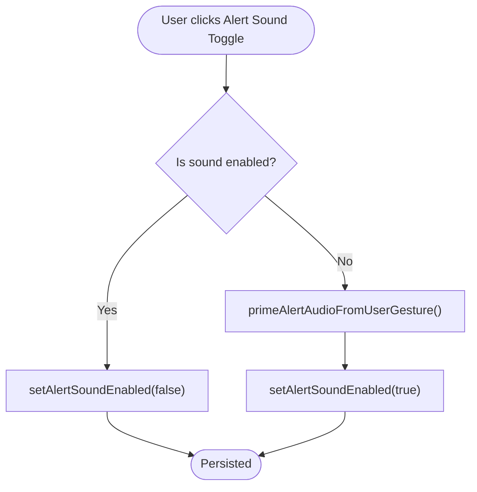
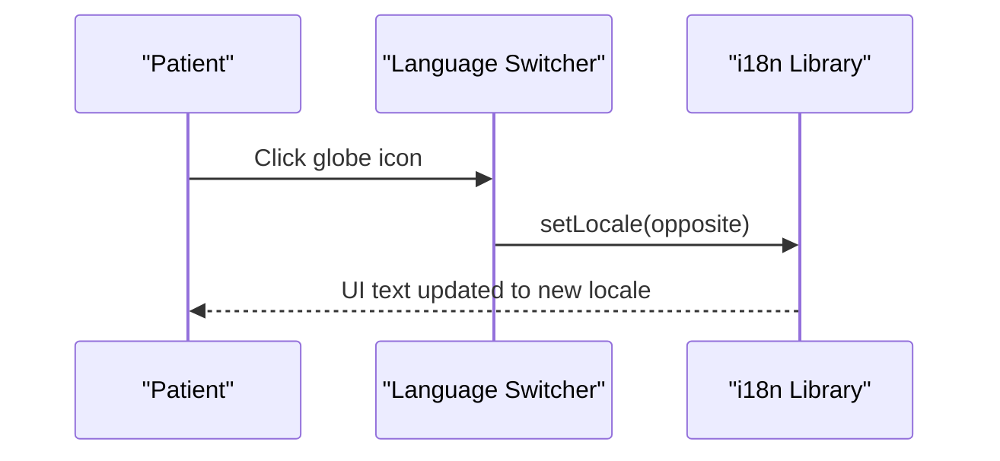
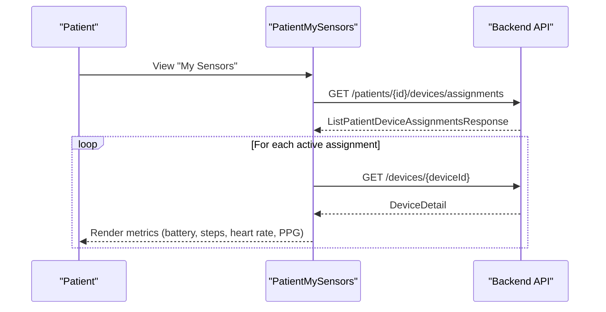
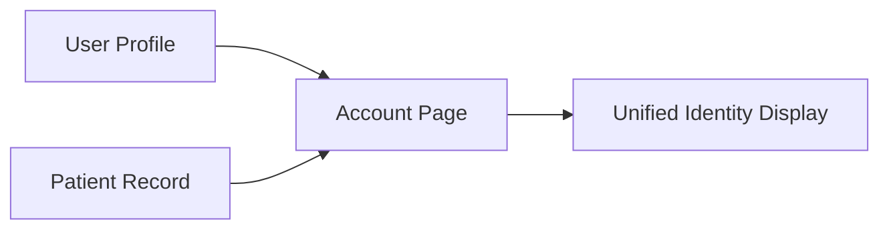
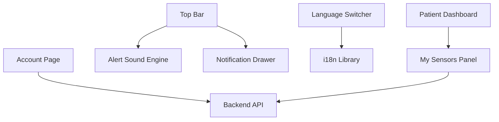

# Patient Settings & Preferences

<cite>
**Referenced Files in This Document**
- [frontend/app/account/page.tsx](file://frontend/app/account/page.tsx)
- [frontend/app/patient/settings/page.tsx](file://frontend/app/patient/settings/page.tsx)
- [frontend/app/patient/page.tsx](file://frontend/app/patient/page.tsx)
- [frontend/components/patient/PatientMySensors.tsx](file://frontend/components/patient/PatientMySensors.tsx)
- [frontend/lib/i18n.tsx](file://frontend/lib/i18n.tsx)
- [frontend/components/LanguageSwitcher.tsx](file://frontend/components/LanguageSwitcher.tsx)
- [frontend/components/TopBar.tsx](file://frontend/components/TopBar.tsx)
- [frontend/lib/alertSound.ts](file://frontend/lib/alertSound.ts)
- [frontend/components/NotificationDrawer.tsx](file://frontend/components/NotificationDrawer.tsx)
- [server/AGENTS.md](file://server/AGENTS.md)
</cite>

## Table of Contents
1. [Introduction](#introduction)
2. [Project Structure](#project-structure)
3. [Core Components](#core-components)
4. [Architecture Overview](#architecture-overview)
5. [Detailed Component Analysis](#detailed-component-analysis)
6. [Dependency Analysis](#dependency-analysis)
7. [Performance Considerations](#performance-considerations)
8. [Troubleshooting Guide](#troubleshooting-guide)
9. [Conclusion](#conclusion)

## Introduction
This document describes the Patient Settings and Preferences interface and how it integrates with the broader WheelSense platform. It covers personalization options available to patients, including notification preferences, language settings, and accessibility-related behaviors. It also explains sensor preference management for health monitoring, the integration between patient records and user accounts, and privacy-related controls that influence data sharing and communication preferences. Practical examples illustrate common preference configurations such as notification frequencies, sensor data visibility, and communication channel preferences. Finally, it outlines how these preferences affect the patient’s overall experience across features.

## Project Structure
The Patient Settings and Preferences surface is implemented as follows:
- Canonical account settings are exposed at the generic account page, which is shared across roles.
- The patient-specific settings route redirects to the canonical account page.
- Notification preferences and alert sounds are controlled via the top bar and notification drawer.
- Language preferences are handled via a dedicated language switcher and the internationalization library.
- Sensor preference management is surfaced in the patient dashboard under the “My Sensors” panel.

**Diagram sources**
- [frontend/app/patient/settings/page.tsx:1-7](file://frontend/app/patient/settings/page.tsx#L1-L7)
- [frontend/app/account/page.tsx:1-810](file://frontend/app/account/page.tsx#L1-L810)
- [frontend/app/patient/page.tsx:1-455](file://frontend/app/patient/page.tsx#L1-L455)
- [frontend/components/patient/PatientMySensors.tsx:47-259](file://frontend/components/patient/PatientMySensors.tsx#L47-L259)
- [frontend/components/TopBar.tsx:132-158](file://frontend/components/TopBar.tsx#L132-L158)
- [frontend/lib/alertSound.ts:1-48](file://frontend/lib/alertSound.ts#L1-L48)
- [frontend/lib/i18n.tsx:1-200](file://frontend/lib/i18n.tsx#L1-L200)
- [frontend/components/LanguageSwitcher.tsx:1-28](file://frontend/components/LanguageSwitcher.tsx#L1-L28)
- [frontend/components/NotificationDrawer.tsx:85-214](file://frontend/components/NotificationDrawer.tsx#L85-L214)

**Section sources**
- [frontend/app/patient/settings/page.tsx:1-7](file://frontend/app/patient/settings/page.tsx#L1-L7)
- [frontend/app/account/page.tsx:1-810](file://frontend/app/account/page.tsx#L1-L810)
- [frontend/app/patient/page.tsx:1-455](file://frontend/app/patient/page.tsx#L1-L455)
- [frontend/components/patient/PatientMySensors.tsx:47-259](file://frontend/components/patient/PatientMySensors.tsx#L47-L259)
- [frontend/components/TopBar.tsx:132-158](file://frontend/components/TopBar.tsx#L132-L158)
- [frontend/lib/alertSound.ts:1-48](file://frontend/lib/alertSound.ts#L1-L48)
- [frontend/lib/i18n.tsx:1-200](file://frontend/lib/i18n.tsx#L1-L200)
- [frontend/components/LanguageSwitcher.tsx:1-28](file://frontend/components/LanguageSwitcher.tsx#L1-L28)
- [frontend/components/NotificationDrawer.tsx:85-214](file://frontend/components/NotificationDrawer.tsx#L85-L214)

## Core Components
- Canonical Account Settings: The account page exposes canonical fields for every role, including username, email, phone, profile photo, and password changes. It also surfaces linked identities (e.g., linked patient record) and supports profile updates and avatar management.
- Patient Settings Redirect: The patient-facing settings route redirects to the canonical account page to maintain a single source of truth for personal settings.
- Notification Preferences: The top bar toggles alert sound behavior globally, while the notification drawer provides filtering and read/unread controls. These behaviors are persisted locally and influence how alerts are presented.
- Language Settings: The language switcher toggles between locales and persists the selection in the i18n library, affecting UI text across the platform.
- Sensor Preference Management: The “My Sensors” panel lists active device assignments for the patient and displays real-time metrics per device type. While explicit “preferences” for sensor visibility are not exposed in the UI, the panel’s active assignment list and metric rendering reflect the current sensor configuration.

**Section sources**
- [frontend/app/account/page.tsx:1-810](file://frontend/app/account/page.tsx#L1-L810)
- [frontend/app/patient/settings/page.tsx:1-7](file://frontend/app/patient/settings/page.tsx#L1-L7)
- [frontend/components/TopBar.tsx:132-158](file://frontend/components/TopBar.tsx#L132-L158)
- [frontend/lib/alertSound.ts:1-48](file://frontend/lib/alertSound.ts#L1-L48)
- [frontend/components/NotificationDrawer.tsx:85-214](file://frontend/components/NotificationDrawer.tsx#L85-L214)
- [frontend/lib/i18n.tsx:1-200](file://frontend/lib/i18n.tsx#L1-L200)
- [frontend/components/LanguageSwitcher.tsx:1-28](file://frontend/components/LanguageSwitcher.tsx#L1-L28)
- [frontend/components/patient/PatientMySensors.tsx:47-259](file://frontend/components/patient/PatientMySensors.tsx#L47-L259)

## Architecture Overview
The Patient Settings and Preferences architecture centers on a shared account surface and localized preference engines:
- Shared Account Surface: All roles, including patients, edit their canonical profile and security settings at the account page.
- Local Preference Engines: Alert sound state and language locale are stored locally and applied immediately without requiring backend persistence for UI behavior.
- Sensor Visibility: Sensor data visibility is derived from active device assignments and device capabilities; the UI renders metrics based on the current assignment set.

**Diagram sources**
- [frontend/components/TopBar.tsx:132-158](file://frontend/components/TopBar.tsx#L132-L158)
- [frontend/lib/alertSound.ts:1-48](file://frontend/lib/alertSound.ts#L1-L48)
- [frontend/components/NotificationDrawer.tsx:85-214](file://frontend/components/NotificationDrawer.tsx#L85-L214)
- [frontend/app/account/page.tsx:1-810](file://frontend/app/account/page.tsx#L1-L810)
- [frontend/lib/i18n.tsx:1-200](file://frontend/lib/i18n.tsx#L1-L200)
- [frontend/components/LanguageSwitcher.tsx:1-28](file://frontend/components/LanguageSwitcher.tsx#L1-L28)

## Detailed Component Analysis

### Account Settings Integration
- Purpose: Canonical surface for editing personal profile, contact details, and security settings.
- Key behaviors:
  - Profile editing: Username, email, phone, and staff profile fields (when applicable).
  - Avatar management: Upload from device, URL-based image, or removal.
  - Security: Change password with validation rules.
  - Linked identities: Displays linked patient record when applicable.
- Integration: Uses authenticated API endpoints to fetch and update profile data.

**Diagram sources**
- [frontend/app/account/page.tsx:140-417](file://frontend/app/account/page.tsx#L140-L417)

**Section sources**
- [frontend/app/account/page.tsx:1-810](file://frontend/app/account/page.tsx#L1-L810)

### Notification Preferences
- Alert sound control: Toggled in the top bar; persisted locally and applied immediately.
- Notification drawer: Filters by type, marks as read, and navigates to linked resources.
- Behavior: Alert sound requires a user gesture to prime the audio context in browsers; toggling sound primes audio when enabling.

**Diagram sources**
- [frontend/components/TopBar.tsx:132-158](file://frontend/components/TopBar.tsx#L132-L158)
- [frontend/lib/alertSound.ts:16-24](file://frontend/lib/alertSound.ts#L16-L24)

**Section sources**
- [frontend/components/TopBar.tsx:132-158](file://frontend/components/TopBar.tsx#L132-L158)
- [frontend/lib/alertSound.ts:1-48](file://frontend/lib/alertSound.ts#L1-L48)
- [frontend/components/NotificationDrawer.tsx:85-214](file://frontend/components/NotificationDrawer.tsx#L85-L214)

### Language Settings
- Mechanism: A language switcher toggles between English and Thai and updates the i18n context.
- Persistence: Locale is stored locally and applied immediately across the UI.

**Diagram sources**
- [frontend/components/LanguageSwitcher.tsx:1-28](file://frontend/components/LanguageSwitcher.tsx#L1-L28)
- [frontend/lib/i18n.tsx:16-18](file://frontend/lib/i18n.tsx#L16-L18)

**Section sources**
- [frontend/components/LanguageSwitcher.tsx:1-28](file://frontend/components/LanguageSwitcher.tsx#L1-L28)
- [frontend/lib/i18n.tsx:1-200](file://frontend/lib/i18n.tsx#L1-L200)

### Sensor Preference Management
- Purpose: Allow patients to review and understand their active sensor setup and recent metrics.
- Key behaviors:
  - Lists active device assignments for the patient.
  - Fetches device details and renders metrics per device type (wheelchair, mobile, polar).
  - Polls device metrics periodically to keep the display fresh.
- Privacy and visibility: Sensor visibility is determined by active assignments and device capability exposure; the UI does not expose toggles to hide specific sensors.

**Diagram sources**
- [frontend/components/patient/PatientMySensors.tsx:83-113](file://frontend/components/patient/PatientMySensors.tsx#L83-L113)
- [frontend/components/patient/PatientMySensors.tsx:103-113](file://frontend/components/patient/PatientMySensors.tsx#L103-L113)

**Section sources**
- [frontend/components/patient/PatientMySensors.tsx:47-259](file://frontend/components/patient/PatientMySensors.tsx#L47-L259)

### Account Settings Integration with Patient Records
- The account page surfaces a “Linked Patient” identity when applicable, ensuring patients can see how their user account relates to their clinical record.
- The patient dashboard also merges avatar sources from the patient record and profile to present a unified identity.

**Diagram sources**
- [frontend/app/account/page.tsx:480-483](file://frontend/app/account/page.tsx#L480-L483)
- [frontend/app/patient/page.tsx:55-65](file://frontend/app/patient/page.tsx#L55-L65)

**Section sources**
- [frontend/app/account/page.tsx:1-810](file://frontend/app/account/page.tsx#L1-L810)
- [frontend/app/patient/page.tsx:1-200](file://frontend/app/patient/page.tsx#L1-L200)

### Privacy Settings and Communication Preferences
- Notification read/unread state and filtering in the notification drawer provide a privacy-like control by allowing users to manage awareness and focus.
- Language selection affects which communications are presented in the preferred language.
- Alert sound behavior can be muted to reduce auditory interruptions, aligning with accessibility preferences.

**Section sources**
- [frontend/components/NotificationDrawer.tsx:85-214](file://frontend/components/NotificationDrawer.tsx#L85-L214)
- [frontend/lib/i18n.tsx:1-200](file://frontend/lib/i18n.tsx#L1-L200)
- [frontend/lib/alertSound.ts:1-48](file://frontend/lib/alertSound.ts#L1-L48)

## Dependency Analysis
- Shared account surface reduces duplication and ensures consistent editing of canonical fields across roles.
- Local preference engines (alert sound and locale) minimize backend round-trips and improve responsiveness.
- Sensor visibility depends on active assignments and device capabilities; the UI reflects the current fleet state.

**Diagram sources**
- [frontend/app/account/page.tsx:1-810](file://frontend/app/account/page.tsx#L1-L810)
- [frontend/components/TopBar.tsx:132-158](file://frontend/components/TopBar.tsx#L132-L158)
- [frontend/lib/alertSound.ts:1-48](file://frontend/lib/alertSound.ts#L1-L48)
- [frontend/components/NotificationDrawer.tsx:85-214](file://frontend/components/NotificationDrawer.tsx#L85-L214)
- [frontend/components/LanguageSwitcher.tsx:1-28](file://frontend/components/LanguageSwitcher.tsx#L1-L28)
- [frontend/lib/i18n.tsx:1-200](file://frontend/lib/i18n.tsx#L1-L200)
- [frontend/app/patient/page.tsx:1-455](file://frontend/app/patient/page.tsx#L1-L455)
- [frontend/components/patient/PatientMySensors.tsx:47-259](file://frontend/components/patient/PatientMySensors.tsx#L47-L259)

**Section sources**
- [frontend/app/account/page.tsx:1-810](file://frontend/app/account/page.tsx#L1-L810)
- [frontend/components/TopBar.tsx:132-158](file://frontend/components/TopBar.tsx#L132-L158)
- [frontend/lib/alertSound.ts:1-48](file://frontend/lib/alertSound.ts#L1-L48)
- [frontend/components/NotificationDrawer.tsx:85-214](file://frontend/components/NotificationDrawer.tsx#L85-L214)
- [frontend/components/LanguageSwitcher.tsx:1-28](file://frontend/components/LanguageSwitcher.tsx#L1-L28)
- [frontend/lib/i18n.tsx:1-200](file://frontend/lib/i18n.tsx#L1-L200)
- [frontend/app/patient/page.tsx:1-455](file://frontend/app/patient/page.tsx#L1-L455)
- [frontend/components/patient/PatientMySensors.tsx:47-259](file://frontend/components/patient/PatientMySensors.tsx#L47-L259)

## Performance Considerations
- Local preference engines (alert sound and locale) avoid network requests for UI behavior changes, improving perceived responsiveness.
- The “My Sensors” panel uses periodic polling for metrics; tuning intervals can balance freshness and bandwidth.
- Avatar uploads are processed client-side to JPEG and resized before upload, reducing server processing overhead.

[No sources needed since this section provides general guidance]

## Troubleshooting Guide
- Alert sound not playing:
  - Ensure the alert sound toggle is enabled and a user gesture has primed the audio context.
  - Verify local storage state for alert sound preference.
- Notification drawer shows no items:
  - Confirm network connectivity and that notifications are being fetched.
  - Check read/unread filters and notification types.
- Language switcher not changing text:
  - Verify locale persistence and that the i18n context is updated.
- Avatar upload issues:
  - Ensure the chosen file is an image and meets size/format expectations.
  - Confirm the platform allows the provided URL scheme.

**Section sources**
- [frontend/lib/alertSound.ts:1-48](file://frontend/lib/alertSound.ts#L1-L48)
- [frontend/components/NotificationDrawer.tsx:85-214](file://frontend/components/NotificationDrawer.tsx#L85-L214)
- [frontend/lib/i18n.tsx:1-200](file://frontend/lib/i18n.tsx#L1-L200)
- [frontend/app/account/page.tsx:207-314](file://frontend/app/account/page.tsx#L207-L314)

## Conclusion
The Patient Settings and Preferences interface leverages a shared account surface and local preference engines to deliver a streamlined, responsive experience. Notification controls and language settings are immediately effective, while sensor visibility is driven by active assignments and device capabilities. The integration with patient records ensures a coherent identity across roles, and the overall design emphasizes zero-friction interactions for patients with mobility challenges.