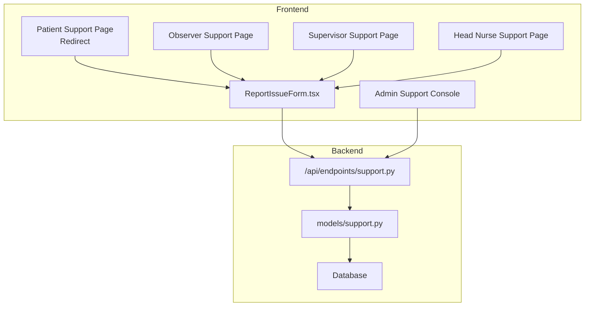
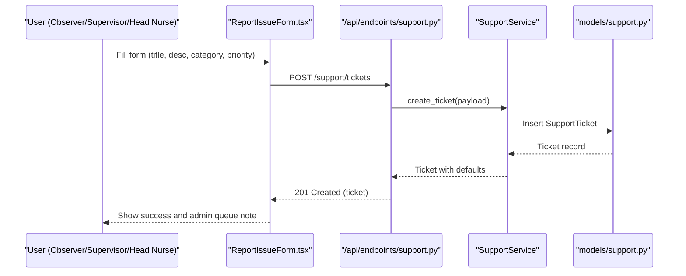
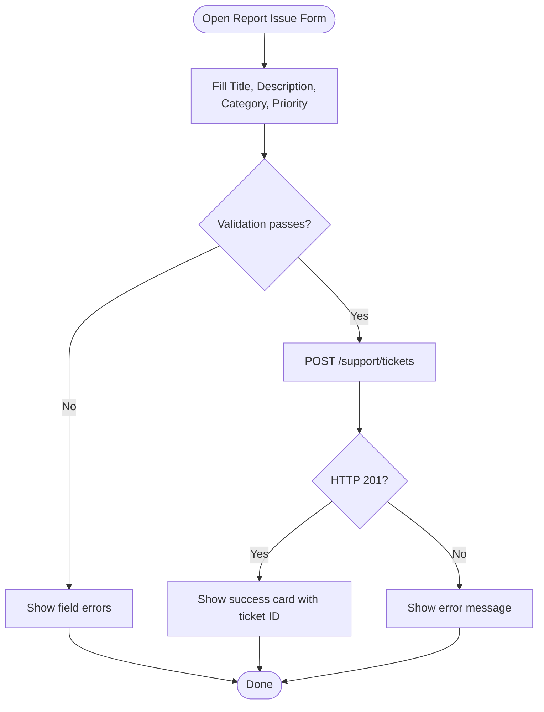
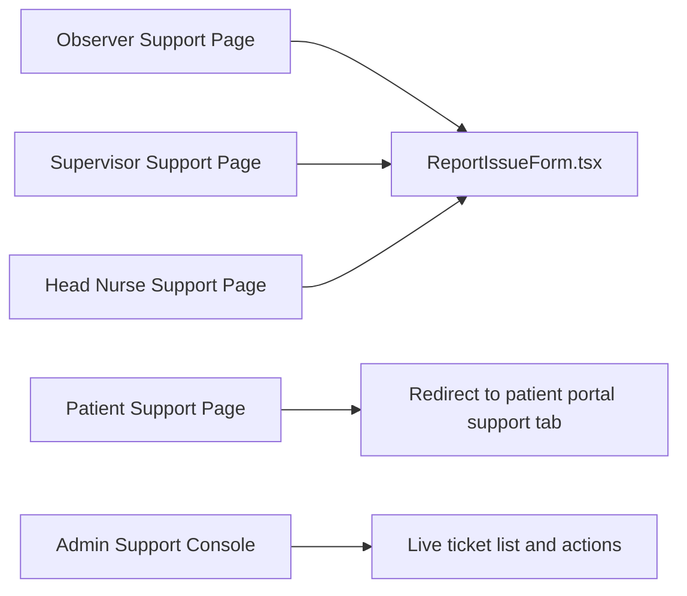
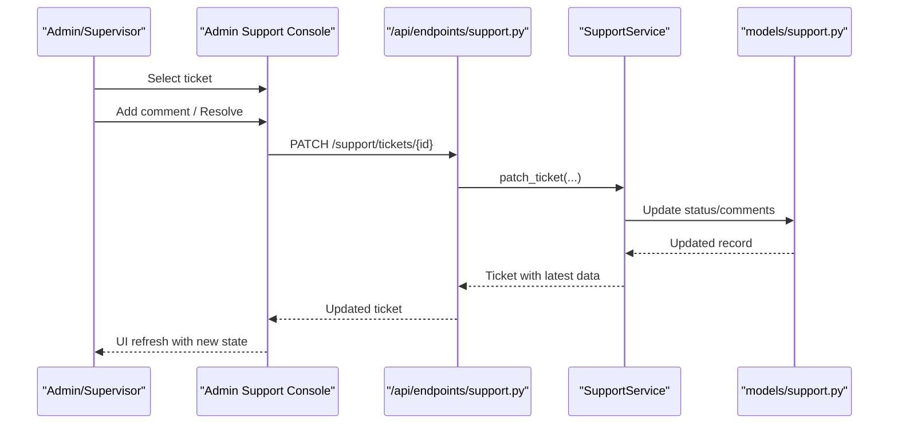
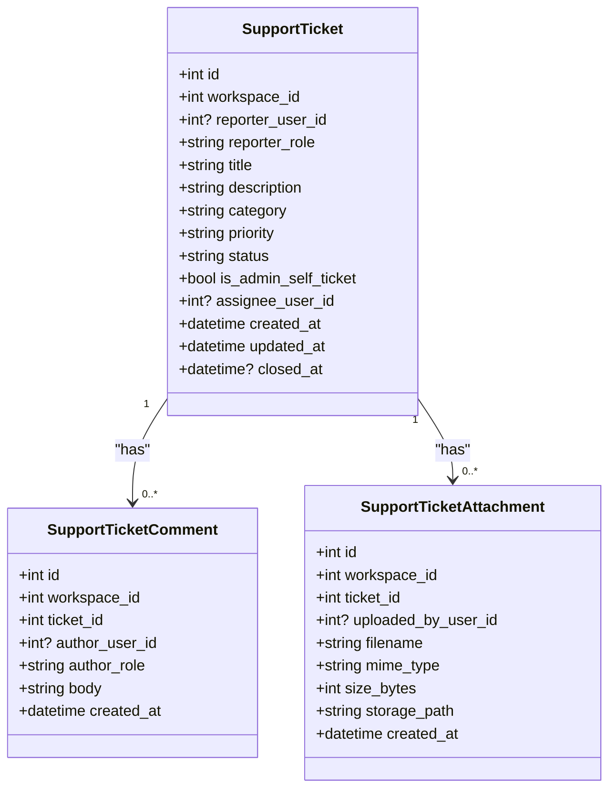
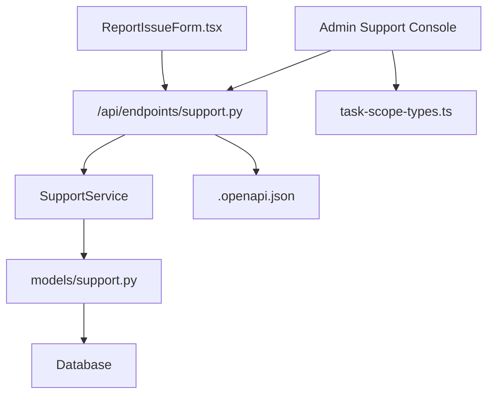

# Patient Support & Resources

<cite>
**Referenced Files in This Document**
- [ReportIssueForm.tsx](file://frontend/components/support/ReportIssueForm.tsx)
- [patient/support/page.tsx](file://frontend/app/patient/support/page.tsx)
- [supervisor/support/page.tsx](file://frontend/app/supervisor/support/page.tsx)
- [observer/support/page.tsx](file://frontend/app/observer/support/page.tsx)
- [head-nurse/support/page.tsx](file://frontend/app/head-nurse/support/page.tsx)
- [admin/support/page.tsx](file://frontend/app/admin/support/page.tsx)
- [support.py](file://server/app/api/endpoints/support.py)
- [support.py (models)](file://server/app/models/support.py)
- [support.py (alembic migration)](file://server/alembic/versions/o9p0q1r2s3t4_add_support_ticket_domain.py)
- [task-scope-types.ts](file://frontend/lib/api/task-scope-types.ts)
- [.openapi.json](file://frontend/.openapi.json)
- [test_identity_support_lane.py](file://server/tests/test_identity_support_lane.py)
</cite>

## Table of Contents
1. [Introduction](#introduction)
2. [Project Structure](#project-structure)
3. [Core Components](#core-components)
4. [Architecture Overview](#architecture-overview)
5. [Detailed Component Analysis](#detailed-component-analysis)
6. [Dependency Analysis](#dependency-analysis)
7. [Performance Considerations](#performance-considerations)
8. [Troubleshooting Guide](#troubleshooting-guide)
9. [Conclusion](#conclusion)
10. [Appendices](#appendices)

## Introduction
This document describes the Patient Support and Resources section of the platform. It covers:
- How patients and staff report issues via a unified form
- The support ticket lifecycle and triage within the backend
- Automated categorization and routing signals exposed by the system
- Integration with the staff-facing support console for triaging and resolution
- Resource library guidance and how to connect it to the support experience
- Examples of common scenarios and escalation/response expectations

## Project Structure
The Patient Support & Resources feature spans the frontend React application and the backend API server:
- Frontend pages for roles (Observer, Supervisor, Head Nurse, Admin) expose a shared issue-reporting form
- A dedicated Admin page provides a live triage console for support tickets and related service requests
- Backend endpoints manage tickets, comments, and attachments with role-aware access controls
- Database models define the ticket domain and relationships

**Diagram sources**
- [ReportIssueForm.tsx:1-201](file://frontend/components/support/ReportIssueForm.tsx#L1-L201)
- [patient/support/page.tsx:1-6](file://frontend/app/patient/support/page.tsx#L1-L6)
- [observer/support/page.tsx:1-6](file://frontend/app/observer/support/page.tsx#L1-L6)
- [supervisor/support/page.tsx:1-6](file://frontend/app/supervisor/support/page.tsx#L1-L6)
- [head-nurse/support/page.tsx:1-6](file://frontend/app/head-nurse/support/page.tsx#L1-L6)
- [admin/support/page.tsx:1-650](file://frontend/app/admin/support/page.tsx#L1-L650)
- [support.py:62-121](file://server/app/api/endpoints/support.py#L62-L121)
- [support.py (models):10-97](file://server/app/models/support.py#L10-L97)

**Section sources**
- [ReportIssueForm.tsx:1-201](file://frontend/components/support/ReportIssueForm.tsx#L1-L201)
- [admin/support/page.tsx:1-650](file://frontend/app/admin/support/page.tsx#L1-L650)
- [support.py:62-121](file://server/app/api/endpoints/support.py#L62-L121)
- [support.py (models):10-97](file://server/app/models/support.py#L10-L97)

## Core Components
- Issue Reporting Form
  - Provides fields for title, description, category, and priority
  - Submits to a workspace-scoped endpoint
  - Displays success confirmation and admin queue note
- Role Pages
  - Observer, Supervisor, Head Nurse, and Admin pages render the same form
  - Patient support page redirects to the patient portal’s support tab
- Admin Support Console
  - Lists tickets and service requests with filtering and status updates
  - Allows adding comments and updating ticket/service-request statuses
  - Shows attachments and resolution notes

**Section sources**
- [ReportIssueForm.tsx:37-201](file://frontend/components/support/ReportIssueForm.tsx#L37-L201)
- [observer/support/page.tsx:1-6](file://frontend/app/observer/support/page.tsx#L1-L6)
- [supervisor/support/page.tsx:1-6](file://frontend/app/supervisor/support/page.tsx#L1-L6)
- [head-nurse/support/page.tsx:1-6](file://frontend/app/head-nurse/support/page.tsx#L1-L6)
- [admin/support/page.tsx:128-650](file://frontend/app/admin/support/page.tsx#L128-L650)
- [patient/support/page.tsx:1-6](file://frontend/app/patient/support/page.tsx#L1-L6)

## Architecture Overview
The support system follows a clear separation of concerns:
- Frontend collects user input and submits tickets
- Backend validates and persists tickets, comments, and attachments
- Admin console queries and updates tickets and service requests
- Access control ensures only authenticated users can create/list/update tickets

**Diagram sources**
- [ReportIssueForm.tsx:66-87](file://frontend/components/support/ReportIssueForm.tsx#L66-L87)
- [support.py:89-97](file://server/app/api/endpoints/support.py#L89-L97)
- [support.py (models):10-41](file://server/app/models/support.py#L10-L41)

**Section sources**
- [ReportIssueForm.tsx:43-87](file://frontend/components/support/ReportIssueForm.tsx#L43-L87)
- [support.py:89-97](file://server/app/api/endpoints/support.py#L89-L97)
- [support.py (models):10-41](file://server/app/models/support.py#L10-L41)

## Detailed Component Analysis

### Issue Reporting Form
- Purpose: Allow authenticated users to report technical problems, device issues, and general feedback
- Fields and validation:
  - Title: required, minimum length enforced
  - Description: free-text
  - Category: bug, general, device
  - Priority: low, normal, high, critical
- Submission:
  - Posts to a workspace-scoped endpoint
  - Resets form after successful submission
  - Displays localized error messages on failure
- Success flow:
  - Shows a confirmation card with ticket ID and a note that the ticket enters the admin queue

**Diagram sources**
- [ReportIssueForm.tsx:45-87](file://frontend/components/support/ReportIssueForm.tsx#L45-L87)

**Section sources**
- [ReportIssueForm.tsx:30-87](file://frontend/components/support/ReportIssueForm.tsx#L30-L87)

### Role Pages and Redirects
- Observer, Supervisor, and Head Nurse pages render the shared reporting form
- Admin page renders the full support console
- Patient support page redirects to the patient portal’s support tab

**Diagram sources**
- [observer/support/page.tsx:1-6](file://frontend/app/observer/support/page.tsx#L1-L6)
- [supervisor/support/page.tsx:1-6](file://frontend/app/supervisor/support/page.tsx#L1-L6)
- [head-nurse/support/page.tsx:1-6](file://frontend/app/head-nurse/support/page.tsx#L1-L6)
- [patient/support/page.tsx:1-6](file://frontend/app/patient/support/page.tsx#L1-L6)
- [admin/support/page.tsx:1-650](file://frontend/app/admin/support/page.tsx#L1-L650)
- [ReportIssueForm.tsx:1-201](file://frontend/components/support/ReportIssueForm.tsx#L1-L201)

**Section sources**
- [observer/support/page.tsx:1-6](file://frontend/app/observer/support/page.tsx#L1-L6)
- [supervisor/support/page.tsx:1-6](file://frontend/app/supervisor/support/page.tsx#L1-L6)
- [head-nurse/support/page.tsx:1-6](file://frontend/app/head-nurse/support/page.tsx#L1-L6)
- [patient/support/page.tsx:1-6](file://frontend/app/patient/support/page.tsx#L1-L6)
- [admin/support/page.tsx:128-650](file://frontend/app/admin/support/page.tsx#L128-L650)

### Admin Support Console
- Live ticket list with status badges and priority indicators
- Detailed ticket view with description, attachments, and comments thread
- Actions:
  - Add internal comments
  - Mark tickets resolved
- Service Requests integration:
  - Filterable list of service requests
  - Update status (open, in_progress, fulfilled, cancelled)
  - Resolution notes and timestamps

**Diagram sources**
- [admin/support/page.tsx:191-237](file://frontend/app/admin/support/page.tsx#L191-L237)
- [support.py:111-121](file://server/app/api/endpoints/support.py#L111-L121)
- [support.py (models):10-41](file://server/app/models/support.py#L10-L41)

**Section sources**
- [admin/support/page.tsx:128-650](file://frontend/app/admin/support/page.tsx#L128-L650)
- [support.py:62-121](file://server/app/api/endpoints/support.py#L62-L121)
- [support.py (models):10-97](file://server/app/models/support.py#L10-L97)

### Backend API and Data Model
- Endpoints:
  - GET /support/tickets: list tickets with optional filters
  - POST /support/tickets: create a ticket
  - GET /support/tickets/{id}: fetch a ticket with comments and attachments
  - PATCH /support/tickets/{id}: update ticket (e.g., status)
- Data model:
  - SupportTicket: title, description, category, priority, status, timestamps, assignee, reporter info
  - SupportTicketComment: author, role, body, timestamps
  - SupportTicketAttachment: filename, MIME type, size, storage path, timestamps

**Diagram sources**
- [support.py (models):10-97](file://server/app/models/support.py#L10-L97)

**Section sources**
- [support.py:62-121](file://server/app/api/endpoints/support.py#L62-L121)
- [support.py (models):10-97](file://server/app/models/support.py#L10-L97)
- [support.py (alembic migration)](file://server/alembic/versions/o9p0q1r2s3t4_add_support_ticket_domain.py)

## Dependency Analysis
- Frontend dependencies:
  - ReportIssueForm depends on authentication, i18n, and the workspace-scoped API client
  - Admin console depends on typed OpenAPI schemas and React Query for data fetching and caching
- Backend dependencies:
  - Endpoints depend on the SupportService and SQLAlchemy models
  - Tests validate access control and lifecycle operations

**Diagram sources**
- [ReportIssueForm.tsx:3-10](file://frontend/components/support/ReportIssueForm.tsx#L3-L10)
- [admin/support/page.tsx:1-36](file://frontend/app/admin/support/page.tsx#L1-L36)
- [support.py:62-121](file://server/app/api/endpoints/support.py#L62-L121)
- [support.py (models):10-97](file://server/app/models/support.py#L10-L97)
- [task-scope-types.ts:59-65](file://frontend/lib/api/task-scope-types.ts#L59-L65)
- [.openapi.json:22300-22327](file://frontend/.openapi.json#L22300-L22327)

**Section sources**
- [ReportIssueForm.tsx:3-10](file://frontend/components/support/ReportIssueForm.tsx#L3-L10)
- [admin/support/page.tsx:1-36](file://frontend/app/admin/support/page.tsx#L1-L36)
- [support.py:62-121](file://server/app/api/endpoints/support.py#L62-L121)
- [support.py (models):10-97](file://server/app/models/support.py#L10-L97)
- [task-scope-types.ts:59-65](file://frontend/lib/api/task-scope-types.ts#L59-L65)
- [.openapi.json:22300-22327](file://frontend/.openapi.json#L22300-L22327)

## Performance Considerations
- Real-time updates:
  - Admin console polls ticket and service request lists at intervals to keep UI fresh
- Caching:
  - React Query caches queries keyed by parameters to reduce network load
- Pagination and limits:
  - Listing endpoints accept a limit parameter to constrain payload sizes
- Attachment handling:
  - Attachments are stored with metadata; rendering previews avoids heavy processing on the client

[No sources needed since this section provides general guidance]

## Troubleshooting Guide
Common issues and resolutions:
- Form submission fails
  - Verify network connectivity and that the user is authenticated
  - Check localized error messages shown by the form
- Ticket not visible in Admin console
  - Confirm workspace scoping and that the user belongs to the correct workspace
  - Refresh the page; the console polls periodically
- Cannot update ticket status
  - Ensure the user has appropriate permissions; tests demonstrate role-based restrictions
- Missing attachments or comments
  - Re-fetch the ticket; the console displays comments and attachments when present

**Section sources**
- [ReportIssueForm.tsx:84-86](file://frontend/components/support/ReportIssueForm.tsx#L84-L86)
- [admin/support/page.tsx:138-152](file://frontend/app/admin/support/page.tsx#L138-L152)
- [test_identity_support_lane.py:256-273](file://server/tests/test_identity_support_lane.py#L256-L273)

## Conclusion
The Patient Support & Resources section provides a streamlined pathway for users to report issues and receive timely triage. The frontend offers a consistent reporting experience across roles, while the backend enforces access control and maintains a robust ticketing domain. The Admin console enables efficient triage and resolution, integrating with the broader operational workflows.

[No sources needed since this section summarizes without analyzing specific files]

## Appendices

### Resource Library Integration Guidance
- The current implementation focuses on the ticketing domain. To integrate a resource library:
  - Add a dedicated “Resources” tab in the patient portal navigation
  - Link FAQs, help docs, and educational materials from the support page
  - Use the existing i18n infrastructure to localize content
  - Consider embedding a searchable knowledge base or linking to external documentation

[No sources needed since this section provides general guidance]

### Common Support Scenarios and Routing Signals
- Device connectivity issues
  - Category: device
  - Priority: high or critical depending on impact
  - Routing: flagged for device/infrastructure teams
- Interface problems
  - Category: bug
  - Priority: normal or high
  - Routing: routed to frontend/back-end development based on scope
- Feature requests
  - Category: general
  - Priority: low or normal
  - Routing: captured for product backlog review
- General questions
  - Category: general
  - Priority: low
  - Routing: routed to general support or documentation team

[No sources needed since this section provides general guidance]

### Escalation Procedures and Response Expectations
- Initial acknowledgment
  - Tickets enter the “open” state upon creation
- Triage
  - Admin console displays priority and status badges for quick triage
- Resolution
  - Admins can mark tickets “resolved” or “closed”
  - Comments provide transparency for escalations
- SLAs
  - Define expected response times per priority level (e.g., critical within 2 hours, high within 1 day)
  - Track and report on SLA adherence using the admin console

[No sources needed since this section provides general guidance]