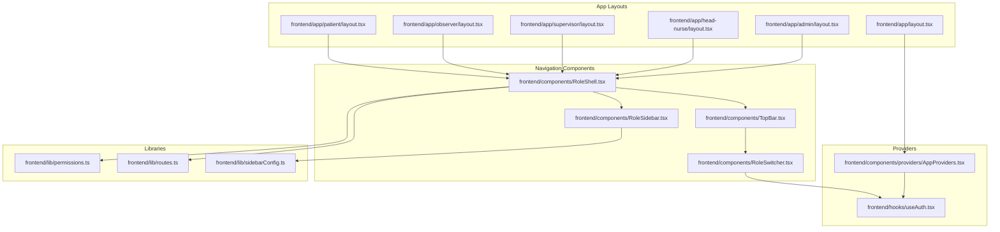
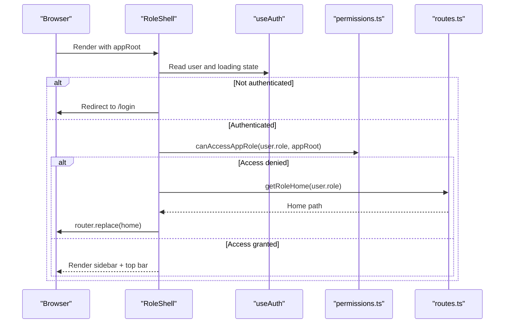
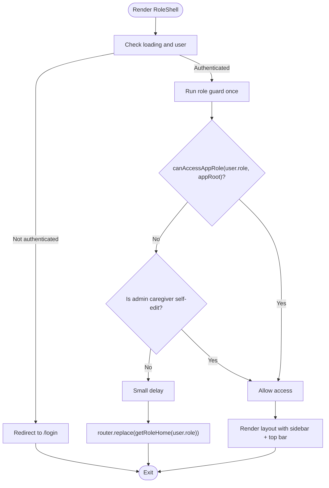
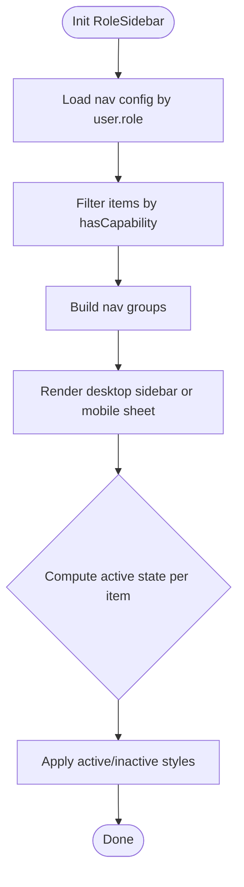
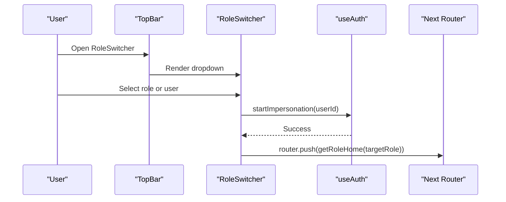
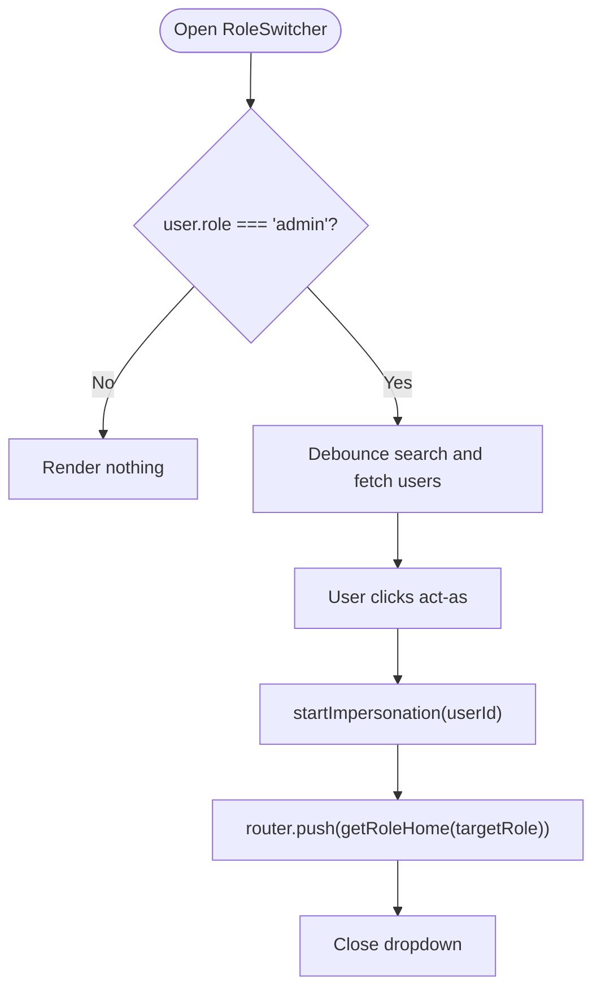
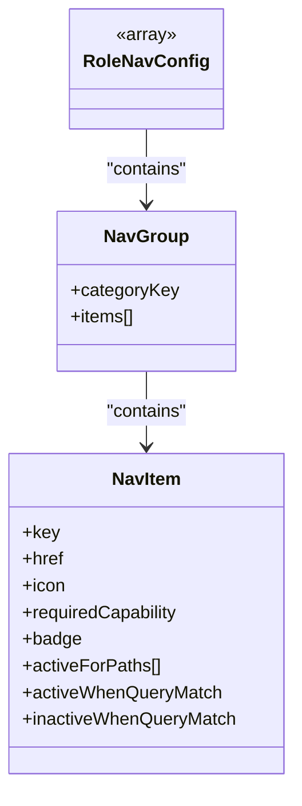
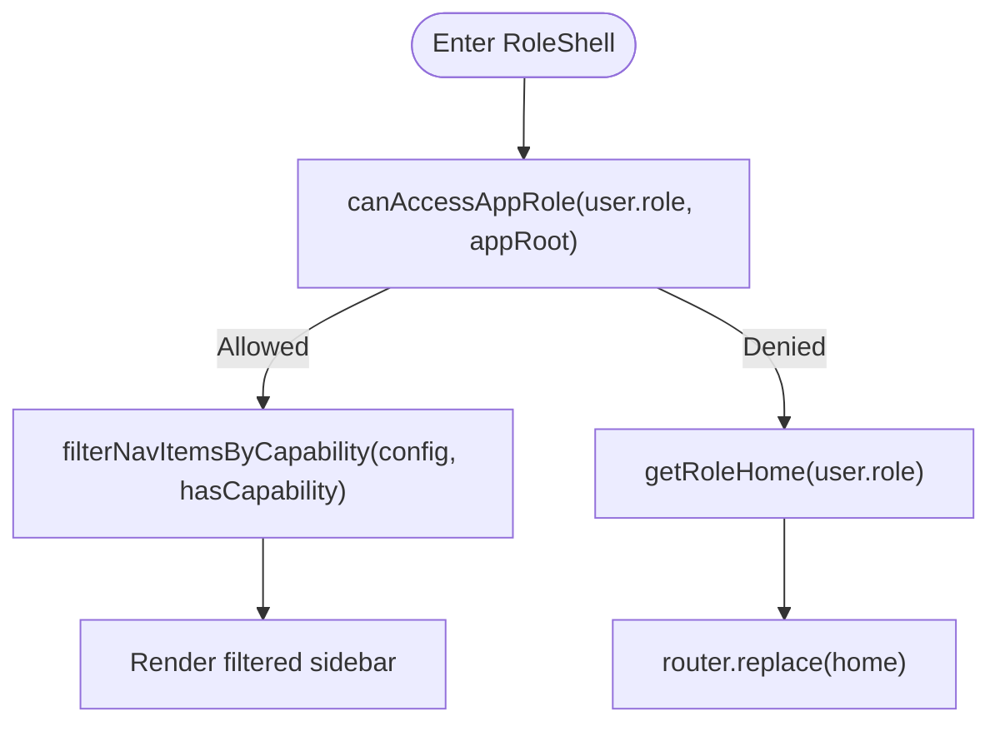
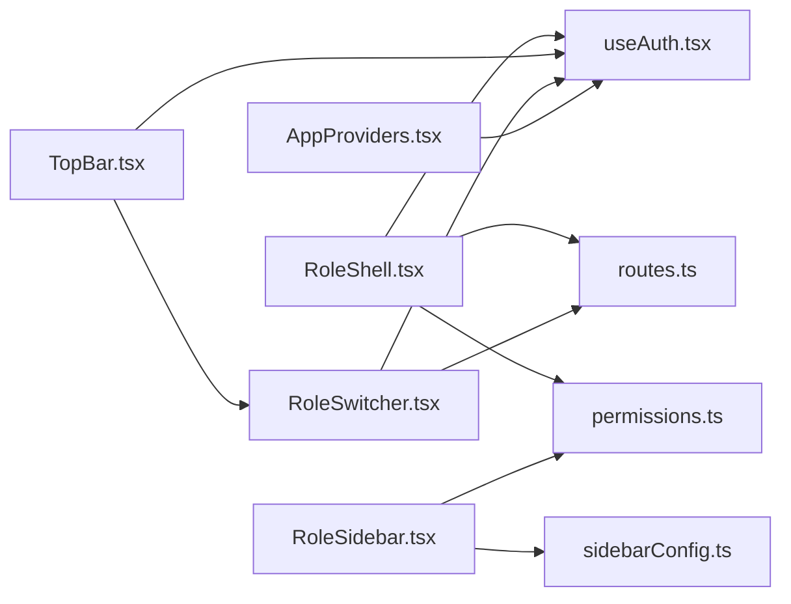

# Role Navigation System

<cite>
**Referenced Files in This Document**
- [RoleShell.tsx](file://frontend/components/RoleShell.tsx)
- [RoleSidebar.tsx](file://frontend/components/RoleSidebar.tsx)
- [TopBar.tsx](file://frontend/components/TopBar.tsx)
- [RoleSwitcher.tsx](file://frontend/components/RoleSwitcher.tsx)
- [sidebarConfig.ts](file://frontend/lib/sidebarConfig.ts)
- [permissions.ts](file://frontend/lib/permissions.ts)
- [routes.ts](file://frontend/lib/routes.ts)
- [useAuth.tsx](file://frontend/hooks/useAuth.tsx)
- [AppProviders.tsx](file://frontend/components/providers/AppProviders.tsx)
- [layout.tsx](file://frontend/app/layout.tsx)
- [admin\layout.tsx](file://frontend/app/admin/layout.tsx)
- [head-nurse\layout.tsx](file://frontend/app/head-nurse/layout.tsx)
- [supervisor\layout.tsx](file://frontend/app/supervisor/layout.tsx)
- [observer\layout.tsx](file://frontend/app/observer/layout.tsx)
- [patient\layout.tsx](file://frontend/app/patient/layout.tsx)
</cite>

## Table of Contents
1. [Introduction](#introduction)
2. [Project Structure](#project-structure)
3. [Core Components](#core-components)
4. [Architecture Overview](#architecture-overview)
5. [Detailed Component Analysis](#detailed-component-analysis)
6. [Dependency Analysis](#dependency-analysis)
7. [Performance Considerations](#performance-considerations)
8. [Troubleshooting Guide](#troubleshooting-guide)
9. [Conclusion](#conclusion)

## Introduction
This document describes the Role Navigation System in the WheelSense Platform. It explains the unified navigation architecture that enforces role-based access control, manages a responsive sidebar and top bar, and supports role switching and impersonation. The system centers around the RoleShell component, which orchestrates authentication and role validation, and integrates RoleSidebar, TopBar, and RoleSwitcher to deliver a cohesive UX across desktop and mobile devices.

## Project Structure
The navigation system is implemented in the frontend under the components and lib directories, with role-specific Next.js app layouts delegating to RoleShell. Providers wrap the app to supply authentication, internationalization, theming, and state management.

**Diagram sources**
- [layout.tsx:11-23](file://frontend/app/layout.tsx#L11-L23)
- [AppProviders.tsx:10-42](file://frontend/components/providers/AppProviders.tsx#L10-L42)
- [useAuth.tsx:99-183](file://frontend/hooks/useAuth.tsx#L99-L183)
- [admin\layout.tsx:3-11](file://frontend/app/admin/layout.tsx#L3-L11)
- [head-nurse\layout.tsx:3-11](file://frontend/app/head-nurse/layout.tsx#L3-L11)
- [supervisor\layout.tsx:3-11](file://frontend/app/supervisor/layout.tsx#L3-L11)
- [observer\layout.tsx:3-11](file://frontend/app/observer/layout.tsx#L3-L11)
- [patient\layout.tsx:3-23](file://frontend/app/patient/layout.tsx#L3-L23)
- [RoleShell.tsx:29-101](file://frontend/components/RoleShell.tsx#L29-L101)
- [RoleSidebar.tsx:60-227](file://frontend/components/RoleSidebar.tsx#L60-L227)
- [TopBar.tsx:44-196](file://frontend/components/TopBar.tsx#L44-L196)
- [RoleSwitcher.tsx:27-223](file://frontend/components/RoleSwitcher.tsx#L27-L223)
- [permissions.ts:26-109](file://frontend/lib/permissions.ts#L26-L109)
- [routes.ts:2-16](file://frontend/lib/routes.ts#L2-L16)
- [sidebarConfig.ts:60-275](file://frontend/lib/sidebarConfig.ts#L60-L275)

**Section sources**
- [layout.tsx:11-23](file://frontend/app/layout.tsx#L11-L23)
- [AppProviders.tsx:10-42](file://frontend/components/providers/AppProviders.tsx#L10-L42)
- [admin\layout.tsx:3-11](file://frontend/app/admin/layout.tsx#L3-L11)
- [head-nurse\layout.tsx:3-11](file://frontend/app/head-nurse/layout.tsx#L3-L11)
- [supervisor\layout.tsx:3-11](file://frontend/app/supervisor/layout.tsx#L3-L11)
- [observer\layout.tsx:3-11](file://frontend/app/observer/layout.tsx#L3-L11)
- [patient\layout.tsx:3-23](file://frontend/app/patient/layout.tsx#L3-L23)

## Core Components
- RoleShell: Central navigation shell that enforces authentication and role access, renders the sidebar and top bar, and applies responsive layout.
- RoleSidebar: Role-aware sidebar with capability-filtered navigation items, mobile sheet behavior, and user profile/logout.
- TopBar: Top navigation bar with search, notifications, language/theme controls, role switcher, and impersonation indicator.
- RoleSwitcher: Admin-only panel to switch roles and impersonate users, with live search and role filtering.
- Libraries: permissions.ts defines capabilities and role-route access; sidebarConfig.ts defines role navigation; routes.ts resolves default role homes.

**Section sources**
- [RoleShell.tsx:29-101](file://frontend/components/RoleShell.tsx#L29-L101)
- [RoleSidebar.tsx:60-227](file://frontend/components/RoleSidebar.tsx#L60-L227)
- [TopBar.tsx:44-196](file://frontend/components/TopBar.tsx#L44-L196)
- [RoleSwitcher.tsx:27-223](file://frontend/components/RoleSwitcher.tsx#L27-L223)
- [permissions.ts:26-109](file://frontend/lib/permissions.ts#L26-L109)
- [sidebarConfig.ts:60-275](file://frontend/lib/sidebarConfig.ts#L60-L275)
- [routes.ts:2-16](file://frontend/lib/routes.ts#L2-L16)

## Architecture Overview
The navigation architecture is layered:
- Provider layer supplies authentication state, i18n, theming, and query caching.
- RoleShell enforces auth and role checks, then composes RoleSidebar and TopBar.
- RoleSidebar builds navigation from role-specific configs and filters by capability.
- TopBar aggregates global controls and role switching.
- RoleSwitcher enables admin impersonation and role transitions.

**Diagram sources**
- [RoleShell.tsx:37-66](file://frontend/components/RoleShell.tsx#L37-L66)
- [permissions.ts:107-109](file://frontend/lib/permissions.ts#L107-L109)
- [routes.ts:2-16](file://frontend/lib/routes.ts#L2-L16)
- [useAuth.tsx:99-183](file://frontend/hooks/useAuth.tsx#L99-L183)

## Detailed Component Analysis

### RoleShell Component
RoleShell is the central orchestrator:
- Authentication guard: redirects unauthenticated users to /login.
- Role guard: verifies access to the requested appRoot; allows a special staff self-edit exception; otherwise redirects to the user’s role home.
- Responsive layout: desktop fixed sidebar and mobile sheet; top bar triggers mobile sidebar; main content area with optional extra classes.
- Loading state: shows a spinner with translation-based message while hydrating.

**Diagram sources**
- [RoleShell.tsx:37-66](file://frontend/components/RoleShell.tsx#L37-L66)
- [permissions.ts:107-109](file://frontend/lib/permissions.ts#L107-L109)
- [routes.ts:2-16](file://frontend/lib/routes.ts#L2-L16)

**Section sources**
- [RoleShell.tsx:29-101](file://frontend/components/RoleShell.tsx#L29-L101)

### RoleSidebar Component
RoleSidebar renders role-aware navigation:
- Navigation source: role-specific config from sidebarConfig.ts.
- Capability filtering: items gated by requiredCapability using hasCapability.
- Active state logic: supports exact match, prefix match, and query-based activation rules.
- Desktop vs mobile: fixed sidebar on large screens, slide-out sheet on small screens.
- User profile and logout: links to account and logs out via auth hook.

**Diagram sources**
- [RoleSidebar.tsx:60-101](file://frontend/components/RoleSidebar.tsx#L60-L101)
- [sidebarConfig.ts:287-299](file://frontend/lib/sidebarConfig.ts#L287-L299)
- [permissions.ts:103-105](file://frontend/lib/permissions.ts#L103-L105)

**Section sources**
- [RoleSidebar.tsx:60-227](file://frontend/components/RoleSidebar.tsx#L60-L227)
- [sidebarConfig.ts:22-54](file://frontend/lib/sidebarConfig.ts#L22-L54)

### TopBar Component
TopBar provides global controls:
- Impersonation banner: visible when acting as another user; includes stop action.
- Navigation trigger: menu button opens mobile sidebar on small screens.
- Search: input field for global search.
- RoleSwitcher: admin-only panel to switch roles and impersonate users.
- Environment badge: “SIM” badge for admins in simulator mode.
- Language and theme toggles.
- Alerts sound toggle with user gesture priming.
- Notifications bell and drawer.
- User avatar and role label.

**Diagram sources**
- [TopBar.tsx:117-118](file://frontend/components/TopBar.tsx#L117-L118)
- [RoleSwitcher.tsx:90-110](file://frontend/components/RoleSwitcher.tsx#L90-L110)
- [useAuth.tsx:143-157](file://frontend/hooks/useAuth.tsx#L143-L157)
- [routes.ts:2-16](file://frontend/lib/routes.ts#L2-L16)

**Section sources**
- [TopBar.tsx:44-196](file://frontend/components/TopBar.tsx#L44-L196)
- [RoleSwitcher.tsx:27-223](file://frontend/components/RoleSwitcher.tsx#L27-L223)

### RoleSwitcher Component
RoleSwitcher enables admin-driven role transitions:
- Admin-only visibility.
- Role categories: “All Roles” and individual roles.
- Live search with debounced API calls; filters to active users.
- Impersonation flow: startImpersonation, then navigate to target role home.
- Loading, error, and disabled states during impersonation actions.

**Diagram sources**
- [RoleSwitcher.tsx:88-110](file://frontend/components/RoleSwitcher.tsx#L88-L110)
- [useAuth.tsx:143-157](file://frontend/hooks/useAuth.tsx#L143-L157)
- [routes.ts:2-16](file://frontend/lib/routes.ts#L2-L16)

**Section sources**
- [RoleSwitcher.tsx:27-223](file://frontend/components/RoleSwitcher.tsx#L27-L223)
- [useAuth.tsx:143-157](file://frontend/hooks/useAuth.tsx#L143-L157)

### Sidebar Navigation System
The sidebar system is role-driven and capability-filtered:
- RoleNavConfig: Each role defines groups and items with icons, labels, and optional badges.
- Required capabilities: Items can declare requiredCapability; only visible if user has capability.
- Active state rules: Base href matching, prefix-based activation, and query-based activation/inactivation.
- Desktop and mobile: Fixed left sidebar on large screens; sheet overlay on small screens.

**Diagram sources**
- [sidebarConfig.ts:22-54](file://frontend/lib/sidebarConfig.ts#L22-L54)

**Section sources**
- [sidebarConfig.ts:60-275](file://frontend/lib/sidebarConfig.ts#L60-L275)
- [RoleSidebar.tsx:67-72](file://frontend/components/RoleSidebar.tsx#L67-L72)

### Role-Based Access Control and Workspace Scoping
Access control is enforced at two layers:
- Route-level access: canAccessAppRole restricts which roles can enter which app roots (/admin, /head-nurse, etc.).
- Capability-level visibility: filterNavItemsByCapability hides navigation items that require capabilities the user lacks.
- Role home resolution: getRoleHome ensures redirection to the correct default path for each role.

**Diagram sources**
- [permissions.ts:107-109](file://frontend/lib/permissions.ts#L107-L109)
- [sidebarConfig.ts:287-299](file://frontend/lib/sidebarConfig.ts#L287-L299)
- [routes.ts:2-16](file://frontend/lib/routes.ts#L2-L16)

**Section sources**
- [permissions.ts:26-109](file://frontend/lib/permissions.ts#L26-L109)
- [sidebarConfig.ts:287-299](file://frontend/lib/sidebarConfig.ts#L287-L299)
- [routes.ts:2-16](file://frontend/lib/routes.ts#L2-L16)

## Dependency Analysis
The navigation system exhibits clean separation of concerns:
- RoleShell depends on useAuth, permissions, and routes.
- RoleSidebar depends on sidebarConfig and permissions.
- TopBar depends on useAuth, notifications, and RoleSwitcher.
- RoleSwitcher depends on useAuth and routes.
- Providers supply global state and services to all components.

**Diagram sources**
- [RoleShell.tsx:30-33](file://frontend/components/RoleShell.tsx#L30-L33)
- [RoleSidebar.tsx:60-65](file://frontend/components/RoleSidebar.tsx#L60-L65)
- [TopBar.tsx:44-46](file://frontend/components/TopBar.tsx#L44-L46)
- [RoleSwitcher.tsx:27-31](file://frontend/components/RoleSwitcher.tsx#L27-L31)
- [AppProviders.tsx:32-38](file://frontend/components/providers/AppProviders.tsx#L32-L38)

**Section sources**
- [RoleShell.tsx:30-33](file://frontend/components/RoleShell.tsx#L30-L33)
- [RoleSidebar.tsx:60-65](file://frontend/components/RoleSidebar.tsx#L60-L65)
- [TopBar.tsx:44-46](file://frontend/components/TopBar.tsx#L44-L46)
- [RoleSwitcher.tsx:27-31](file://frontend/components/RoleSwitcher.tsx#L27-L31)
- [AppProviders.tsx:32-38](file://frontend/components/providers/AppProviders.tsx#L32-L38)

## Performance Considerations
- Hydration and redirects: RoleShell delays redirect after role checks to avoid loops and reduce flicker.
- Capability filtering: Sidebar rendering defers to filtered config to minimize DOM and re-renders.
- Debounced search: RoleSwitcher search is throttled to reduce API calls.
- Conditional rendering: Components like RoleSwitcher and impersonation banner only render for eligible users.
- Sticky header: TopBar uses sticky positioning to keep controls accessible without heavy scroll computations.

[No sources needed since this section provides general guidance]

## Troubleshooting Guide
Common issues and resolutions:
- Redirect loop on role change: Ensure role guard runs once and avoids rapid redirects by adding a small delay before navigation.
- Sidebar items missing: Verify requiredCapability exists in user’s role capabilities; confirm item’s requiredCapability is present.
- RoleSwitcher not visible: Confirm user.role is admin; ensure impersonation state is not active.
- Logout does not persist: Confirm auth store reset and router push to /login occur after API logout.
- Impersonation failure: Check startImpersonation API response and error propagation; ensure target user is not self.

**Section sources**
- [RoleShell.tsx:44-66](file://frontend/components/RoleShell.tsx#L44-L66)
- [RoleSidebar.tsx:67-72](file://frontend/components/RoleSidebar.tsx#L67-L72)
- [RoleSwitcher.tsx:88-110](file://frontend/components/RoleSwitcher.tsx#L88-L110)
- [useAuth.tsx:137-157](file://frontend/hooks/useAuth.tsx#L137-L157)

## Conclusion
The Role Navigation System delivers a robust, role-aware, and responsive navigation experience. RoleShell enforces authentication and role access, RoleSidebar presents capability-filtered navigation, TopBar consolidates global controls and role switching, and RoleSwitcher enables admin-driven impersonation. The architecture leverages centralized configuration and capability checks to maintain consistency across devices and roles.