# Role-Based Dashboards

<cite>
**Referenced Files in This Document**
- [types.ts](file://frontend/lib/types.ts)
- [permissions.ts](file://frontend/lib/permissions.ts)
- [sidebarConfig.ts](file://frontend/lib/sidebarConfig.ts)
- [RoleShell.tsx](file://frontend/components/RoleShell.tsx)
- [RoleSidebar.tsx](file://frontend/components/RoleSidebar.tsx)
- [TopBar.tsx](file://frontend/components/TopBar.tsx)
- [useAuth.tsx](file://frontend/hooks/useAuth.tsx)
- [DashboardFloorplanPanel.tsx](file://frontend/components/dashboard/DashboardFloorplanPanel.tsx)
- [admin/layout.tsx](file://frontend/app/admin/layout.tsx)
- [head-nurse/layout.tsx](file://frontend/app/head-nurse/layout.tsx)
- [supervisor/layout.tsx](file://frontend/app/supervisor/layout.tsx)
- [observer/layout.tsx](file://frontend/app/observer/layout.tsx)
- [patient/layout.tsx](file://frontend/app/patient/layout.tsx)
- [admin/page.tsx](file://frontend/app/admin/page.tsx)
- [head-nurse/page.tsx](file://frontend/app/head-nurse/page.tsx)
- [supervisor/page.tsx](file://frontend/app/supervisor/page.tsx)
- [observer/page.tsx](file://frontend/app/observer/page.tsx)
- [patient/page.tsx](file://frontend/app/patient/page.tsx)
</cite>

## Table of Contents
1. [Introduction](#introduction)
2. [Project Structure](#project-structure)
3. [Core Components](#core-components)
4. [Architecture Overview](#architecture-overview)
5. [Detailed Component Analysis](#detailed-component-analysis)
6. [Dependency Analysis](#dependency-analysis)
7. [Performance Considerations](#performance-considerations)
8. [Troubleshooting Guide](#troubleshooting-guide)
9. [Conclusion](#conclusion)
10. [Appendices](#appendices)

## Introduction
This document describes the role-based dashboard system for the WheelSense Platform. It explains how five distinct roles—Admin, Head Nurse, Supervisor, Observer, and Patient—are supported by unified shell components, permission-driven navigation, and role-scoped dashboards. It covers the role switching mechanism, permission-based access control, workspace scoping, and the UI patterns used across dashboards. It also documents the sidebar navigation, top bar components, responsive design adaptations, role-specific API integrations, data filtering, and workflow interactions.

## Project Structure
The role-based dashboards are implemented with a shared shell and role-specific pages:
- Shared shell and navigation: RoleShell, RoleSidebar, TopBar
- Permission model: permissions.ts and sidebarConfig.ts
- Role layouts: per-role Next.js app shells
- Role dashboards: per-role pages with domain-specific queries and components

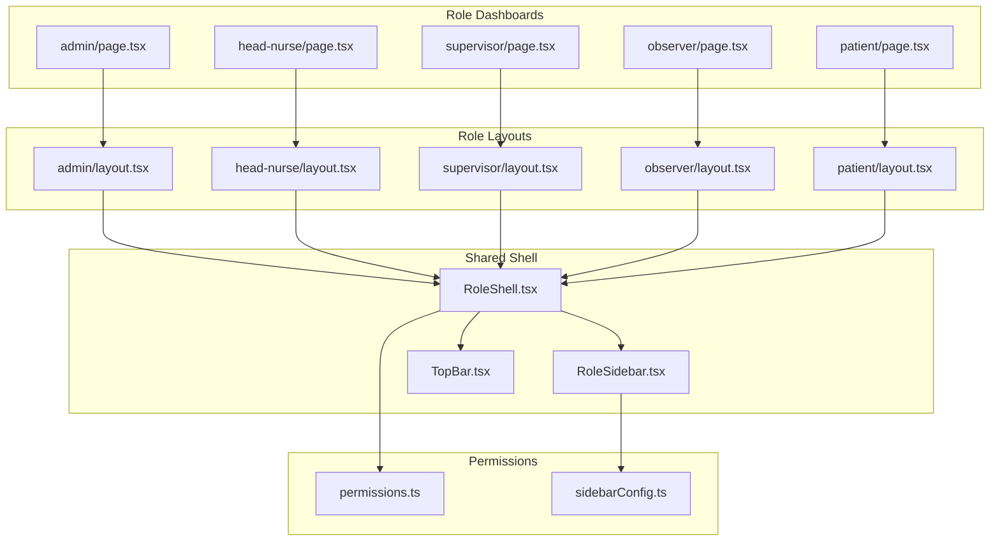

**Diagram sources**
- [RoleShell.tsx:1-102](file://frontend/components/RoleShell.tsx#L1-L102)
- [RoleSidebar.tsx:1-228](file://frontend/components/RoleSidebar.tsx#L1-L228)
- [TopBar.tsx:1-197](file://frontend/components/TopBar.tsx#L1-L197)
- [permissions.ts:1-111](file://frontend/lib/permissions.ts#L1-L111)
- [sidebarConfig.ts:1-300](file://frontend/lib/sidebarConfig.ts#L1-L300)
- [admin/layout.tsx:1-12](file://frontend/app/admin/layout.tsx#L1-L12)
- [head-nurse/layout.tsx:1-12](file://frontend/app/head-nurse/layout.tsx#L1-L12)
- [supervisor/layout.tsx:1-12](file://frontend/app/supervisor/layout.tsx#L1-L12)
- [observer/layout.tsx:1-12](file://frontend/app/observer/layout.tsx#L1-L12)
- [patient/layout.tsx:1-24](file://frontend/app/patient/layout.tsx#L1-L24)
- [admin/page.tsx:1-488](file://frontend/app/admin/page.tsx#L1-L488)
- [head-nurse/page.tsx:1-595](file://frontend/app/head-nurse/page.tsx#L1-L595)
- [supervisor/page.tsx:1-394](file://frontend/app/supervisor/page.tsx#L1-L394)
- [observer/page.tsx:1-464](file://frontend/app/observer/page.tsx#L1-L464)
- [patient/page.tsx:1-455](file://frontend/app/patient/page.tsx#L1-L455)

**Section sources**
- [RoleShell.tsx:1-102](file://frontend/components/RoleShell.tsx#L1-L102)
- [RoleSidebar.tsx:1-228](file://frontend/components/RoleSidebar.tsx#L1-L228)
- [TopBar.tsx:1-197](file://frontend/components/TopBar.tsx#L1-L197)
- [permissions.ts:1-111](file://frontend/lib/permissions.ts#L1-L111)
- [sidebarConfig.ts:1-300](file://frontend/lib/sidebarConfig.ts#L1-L300)
- [admin/layout.tsx:1-12](file://frontend/app/admin/layout.tsx#L1-L12)
- [head-nurse/layout.tsx:1-12](file://frontend/app/head-nurse/layout.tsx#L1-L12)
- [supervisor/layout.tsx:1-12](file://frontend/app/supervisor/layout.tsx#L1-L12)
- [observer/layout.tsx:1-12](file://frontend/app/observer/layout.tsx#L1-L12)
- [patient/layout.tsx:1-24](file://frontend/app/patient/layout.tsx#L1-L24)

## Core Components
- RoleShell: Centralized role guard, auth guard, layout scaffolding, and AI chat popup integration.
- RoleSidebar: Role-aware navigation built from a single configuration source, capability-filtered.
- TopBar: Unified header with search, role switcher, notifications, language/theme toggles, and impersonation banner.
- Permissions and Navigation: Capability taxonomy and role-to-navigation mapping with capability gating.
- Role Layouts: Per-role Next.js shells that wrap page content with RoleShell and pass the app root.
- Role Dashboards: Domain-specific pages with scoped queries, data processing, and visualization components.

**Section sources**
- [RoleShell.tsx:1-102](file://frontend/components/RoleShell.tsx#L1-L102)
- [RoleSidebar.tsx:1-228](file://frontend/components/RoleSidebar.tsx#L1-L228)
- [TopBar.tsx:1-197](file://frontend/components/TopBar.tsx#L1-L197)
- [permissions.ts:1-111](file://frontend/lib/permissions.ts#L1-L111)
- [sidebarConfig.ts:1-300](file://frontend/lib/sidebarConfig.ts#L1-L300)
- [admin/layout.tsx:1-12](file://frontend/app/admin/layout.tsx#L1-L12)
- [head-nurse/layout.tsx:1-12](file://frontend/app/head-nurse/layout.tsx#L1-L12)
- [supervisor/layout.tsx:1-12](file://frontend/app/supervisor/layout.tsx#L1-L12)
- [observer/layout.tsx:1-12](file://frontend/app/observer/layout.tsx#L1-L12)
- [patient/layout.tsx:1-24](file://frontend/app/patient/layout.tsx#L1-L24)

## Architecture Overview
The system enforces role-based access control at two levels:
- Route-level guard: RoleShell checks whether the user’s role can access the given app root.
- Capability-level guard: RoleSidebar filters navigation items based on user capabilities.

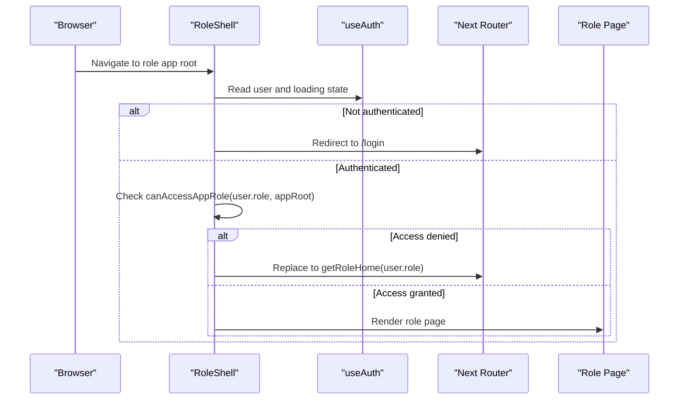

**Diagram sources**
- [RoleShell.tsx:29-66](file://frontend/components/RoleShell.tsx#L29-L66)
- [useAuth.tsx:99-184](file://frontend/hooks/useAuth.tsx#L99-L184)
- [permissions.ts:103-111](file://frontend/lib/permissions.ts#L103-L111)

**Section sources**
- [RoleShell.tsx:29-66](file://frontend/components/RoleShell.tsx#L29-L66)
- [useAuth.tsx:99-184](file://frontend/hooks/useAuth.tsx#L99-L184)
- [permissions.ts:103-111](file://frontend/lib/permissions.ts#L103-L111)

## Detailed Component Analysis

### Role Switching Mechanism
- RoleShell performs a one-time role check against the app root and redirects to the user’s home route if unauthorized. A special exception allows staff to edit their own profile under admin routes.
- TopBar includes a RoleSwitcher component enabling quick transitions between roles when permitted.

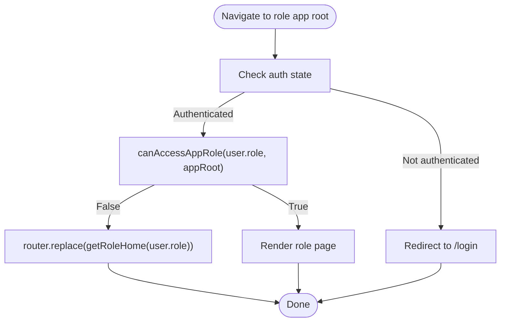

**Diagram sources**
- [RoleShell.tsx:44-66](file://frontend/components/RoleShell.tsx#L44-L66)
- [permissions.ts:103-111](file://frontend/lib/permissions.ts#L103-L111)

**Section sources**
- [RoleShell.tsx:44-66](file://frontend/components/RoleShell.tsx#L44-L66)
- [TopBar.tsx:118](file://frontend/components/TopBar.tsx#L118)

### Permission-Based Access Control
- Capabilities define fine-grained permissions (e.g., users.manage, patients.read, alerts.manage).
- Roles map to sets of capabilities.
- Navigation items can declare required capabilities; RoleSidebar filters items accordingly.

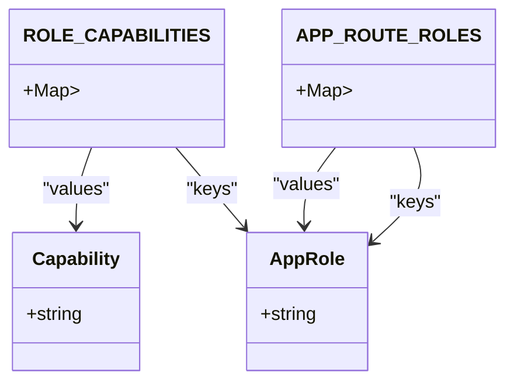

**Diagram sources**
- [permissions.ts:5-109](file://frontend/lib/permissions.ts#L5-L109)

**Section sources**
- [permissions.ts:5-109](file://frontend/lib/permissions.ts#L5-L109)
- [sidebarConfig.ts:287-300](file://frontend/lib/sidebarConfig.ts#L287-L300)

### Workspace Scoping
- Role dashboards use workspace-aware queries to ensure data isolation and relevance.
- Example: Admin dashboard composes endpoints with workspace scope before fetching device, HA device, activity, and user lists.

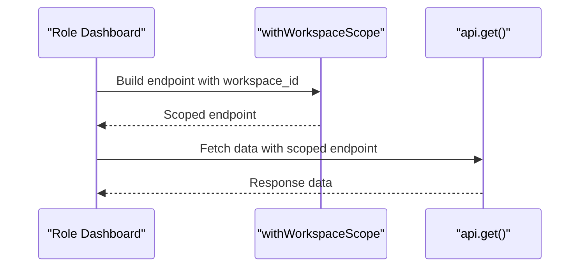

**Diagram sources**
- [admin/page.tsx:52-95](file://frontend/app/admin/page.tsx#L52-L95)

**Section sources**
- [admin/page.tsx:52-95](file://frontend/app/admin/page.tsx#L52-L95)

### Sidebar Navigation
- RoleSidebar renders navigation groups and items based on the user’s role and capability filters.
- Active state detection supports exact matches, base path matching, and query-parameter-sensitive activation.
- Mobile-friendly sheet-based sidebar complements desktop fixed sidebar.

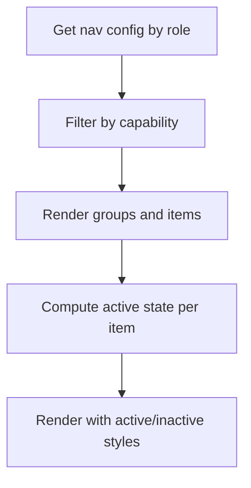

**Diagram sources**
- [RoleSidebar.tsx:60-101](file://frontend/components/RoleSidebar.tsx#L60-L101)
- [sidebarConfig.ts:280-300](file://frontend/lib/sidebarConfig.ts#L280-L300)

**Section sources**
- [RoleSidebar.tsx:60-101](file://frontend/components/RoleSidebar.tsx#L60-L101)
- [sidebarConfig.ts:60-275](file://frontend/lib/sidebarConfig.ts#L60-L275)

### Top Bar Components
- TopBar includes search, role switcher, environment badge (admin simulator), language switcher, theme toggle, alert sound toggle, notifications bell/drawer, and user profile.
- Impersonation banner appears when acting as another user.

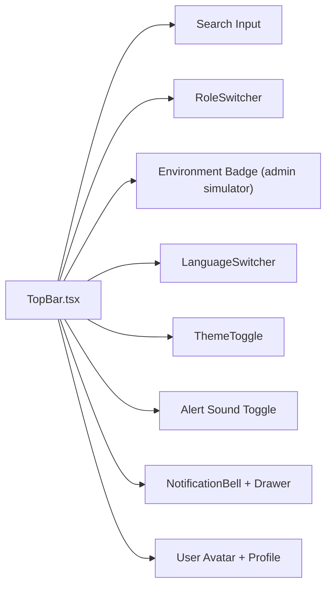

**Diagram sources**
- [TopBar.tsx:44-196](file://frontend/components/TopBar.tsx#L44-L196)

**Section sources**
- [TopBar.tsx:44-196](file://frontend/components/TopBar.tsx#L44-L196)

### Admin Dashboard
- Focuses on system/device health, fleet statistics, user distribution, and recent activity.
- Uses DashboardFloorplanPanel for zone overview.
- Integrates device, HA device, activity, and user endpoints with workspace scoping.

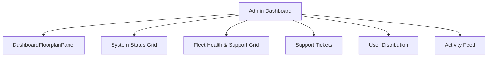

**Diagram sources**
- [admin/page.tsx:46-488](file://frontend/app/admin/page.tsx#L46-L488)
- [DashboardFloorplanPanel.tsx:13-29](file://frontend/components/dashboard/DashboardFloorplanPanel.tsx#L13-L29)

**Section sources**
- [admin/page.tsx:46-488](file://frontend/app/admin/page.tsx#L46-L488)
- [DashboardFloorplanPanel.tsx:13-29](file://frontend/components/dashboard/DashboardFloorplanPanel.tsx#L13-L29)

### Head Nurse Dashboard
- Ward overview with active alerts, open tasks, schedules, directives, and timeline events.
- Highlights on-duty staff and integrates with workflow tasks and schedules.

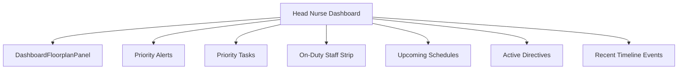

**Diagram sources**
- [head-nurse/page.tsx:58-595](file://frontend/app/head-nurse/page.tsx#L58-L595)
- [DashboardFloorplanPanel.tsx:13-29](file://frontend/components/dashboard/DashboardFloorplanPanel.tsx#L13-L29)

**Section sources**
- [head-nurse/page.tsx:58-595](file://frontend/app/head-nurse/page.tsx#L58-L595)

### Supervisor Dashboard
- Command center focused on critical alerts, open tasks, patients in zone, and active directives.
- Supports acknowledging directives and completing tasks.

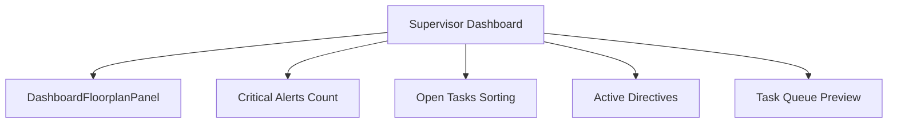

**Diagram sources**
- [supervisor/page.tsx:34-394](file://frontend/app/supervisor/page.tsx#L34-L394)
- [DashboardFloorplanPanel.tsx:13-29](file://frontend/components/dashboard/DashboardFloorplanPanel.tsx#L13-L29)

**Section sources**
- [supervisor/page.tsx:34-394](file://frontend/app/supervisor/page.tsx#L34-L394)

### Observer Dashboard
- Monitoring console with assigned patients, tasks, shift checklist progress, and alerts.
- Uses DashboardFloorplanPanel and ShiftChecklistMePanel.

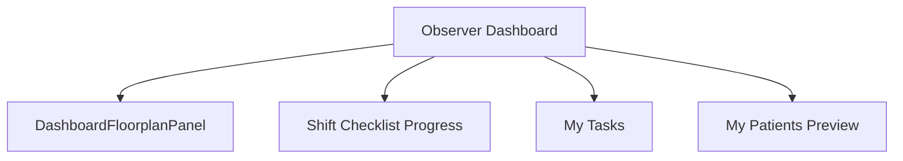

**Diagram sources**
- [observer/page.tsx:65-464](file://frontend/app/observer/page.tsx#L65-L464)
- [DashboardFloorplanPanel.tsx:13-29](file://frontend/components/dashboard/DashboardFloorplanPanel.tsx#L13-L29)

**Section sources**
- [observer/page.tsx:65-464](file://frontend/app/observer/page.tsx#L65-L464)

### Patient Dashboard
- Hub-style interface with three tabs: overview, profile, support.
- Overview offers quick actions (call nurse, emergency SOS), care roadmap, and sensors.
- Profile consolidates patient and account info; support enables issue reporting.

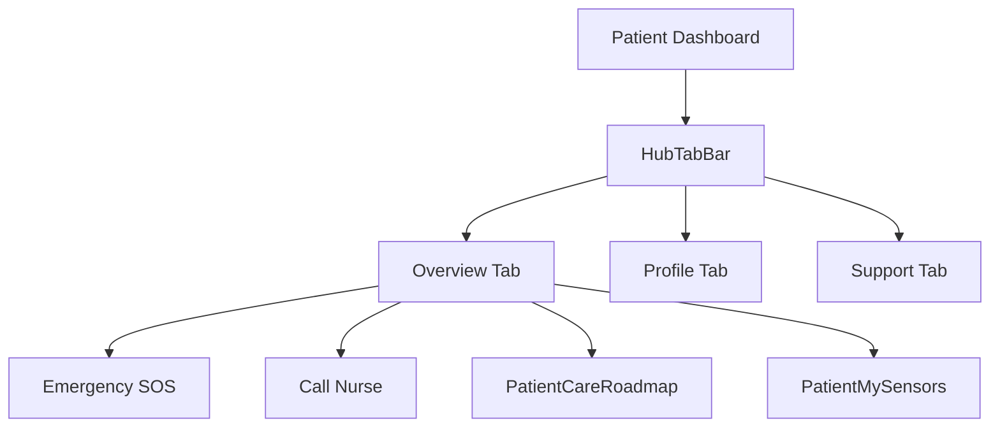

**Diagram sources**
- [patient/page.tsx:67-455](file://frontend/app/patient/page.tsx#L67-L455)

**Section sources**
- [patient/page.tsx:67-455](file://frontend/app/patient/page.tsx#L67-L455)

### Responsive Design Adaptations
- RoleSidebar adapts with a mobile sheet overlay and desktop fixed sidebar.
- TopBar hides menu button on larger screens and reflows controls for smaller widths.
- Patient layout adds rounded containers and increased spacing for mobile.

**Section sources**
- [RoleSidebar.tsx:197-228](file://frontend/components/RoleSidebar.tsx#L197-L228)
- [TopBar.tsx:86-109](file://frontend/components/TopBar.tsx#L86-L109)
- [patient/layout.tsx:10-24](file://frontend/app/patient/layout.tsx#L10-L24)

### Role-Specific API Integrations and Data Filtering
- Admin: Devices, HA devices, device activity, users; fleet health computations; recent activity feed.
- Head Nurse: Ward summary, alerts, patients, caregivers, workflow tasks, schedules, directives, timeline.
- Supervisor: Patients, alerts, vitals, workflow tasks, directives; task completion and directive acknowledgment.
- Observer: Patients, alerts, tasks, vitals; shift checklist aggregation; patient vitals per visit.
- Patient: Patient profile, room info, alerts, care roadmap, sensors; support form submission.

**Section sources**
- [admin/page.tsx:69-95](file://frontend/app/admin/page.tsx#L69-L95)
- [head-nurse/page.tsx:63-104](file://frontend/app/head-nurse/page.tsx#L63-L104)
- [supervisor/page.tsx:40-67](file://frontend/app/supervisor/page.tsx#L40-L67)
- [observer/page.tsx:74-96](file://frontend/app/observer/page.tsx#L74-L96)
- [patient/page.tsx:92-112](file://frontend/app/patient/page.tsx#L92-L112)

### Implementation Patterns
- Conditional rendering: RoleSidebar filters items by capability; TopBar shows environment badge only for admins in simulator mode; Patient dashboard conditionally renders tabs.
- Access control patterns: Route-level guard in RoleShell; capability-level guard in RoleSidebar; capability checks in sidebarConfig.
- Role-specific customizations: Admin dashboard emphasizes fleet and ops; Head Nurse highlights staff and directives; Supervisor focuses on command and directives; Observer centers on checklist and vitals; Patient provides a care-centric hub.

**Section sources**
- [RoleSidebar.tsx:69-72](file://frontend/components/RoleSidebar.tsx#L69-L72)
- [TopBar.tsx:120-128](file://frontend/components/TopBar.tsx#L120-L128)
- [patient/page.tsx:227-246](file://frontend/app/patient/page.tsx#L227-L246)

## Dependency Analysis
The following diagram shows key dependencies among role components and configuration:

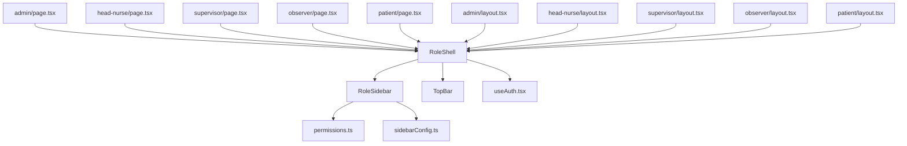

**Diagram sources**
- [RoleShell.tsx:1-102](file://frontend/components/RoleShell.tsx#L1-L102)
- [RoleSidebar.tsx:1-228](file://frontend/components/RoleSidebar.tsx#L1-L228)
- [TopBar.tsx:1-197](file://frontend/components/TopBar.tsx#L1-L197)
- [permissions.ts:1-111](file://frontend/lib/permissions.ts#L1-L111)
- [sidebarConfig.ts:1-300](file://frontend/lib/sidebarConfig.ts#L1-L300)
- [useAuth.tsx:1-184](file://frontend/hooks/useAuth.tsx#L1-L184)
- [admin/page.tsx:1-488](file://frontend/app/admin/page.tsx#L1-L488)
- [head-nurse/page.tsx:1-595](file://frontend/app/head-nurse/page.tsx#L1-L595)
- [supervisor/page.tsx:1-394](file://frontend/app/supervisor/page.tsx#L1-L394)
- [observer/page.tsx:1-464](file://frontend/app/observer/page.tsx#L1-L464)
- [patient/page.tsx:1-455](file://frontend/app/patient/page.tsx#L1-L455)
- [admin/layout.tsx:1-12](file://frontend/app/admin/layout.tsx#L1-L12)
- [head-nurse/layout.tsx:1-12](file://frontend/app/head-nurse/layout.tsx#L1-L12)
- [supervisor/layout.tsx:1-12](file://frontend/app/supervisor/layout.tsx#L1-L12)
- [observer/layout.tsx:1-12](file://frontend/app/observer/layout.tsx#L1-L12)
- [patient/layout.tsx:1-24](file://frontend/app/patient/layout.tsx#L1-L24)

**Section sources**
- [RoleShell.tsx:1-102](file://frontend/components/RoleShell.tsx#L1-L102)
- [RoleSidebar.tsx:1-228](file://frontend/components/RoleSidebar.tsx#L1-L228)
- [TopBar.tsx:1-197](file://frontend/components/TopBar.tsx#L1-L197)
- [permissions.ts:1-111](file://frontend/lib/permissions.ts#L1-L111)
- [sidebarConfig.ts:1-300](file://frontend/lib/sidebarConfig.ts#L1-L300)
- [useAuth.tsx:1-184](file://frontend/hooks/useAuth.tsx#L1-L184)
- [admin/page.tsx:1-488](file://frontend/app/admin/page.tsx#L1-L488)
- [head-nurse/page.tsx:1-595](file://frontend/app/head-nurse/page.tsx#L1-L595)
- [supervisor/page.tsx:1-394](file://frontend/app/supervisor/page.tsx#L1-L394)
- [observer/page.tsx:1-464](file://frontend/app/observer/page.tsx#L1-L464)
- [patient/page.tsx:1-455](file://frontend/app/patient/page.tsx#L1-L455)
- [admin/layout.tsx:1-12](file://frontend/app/admin/layout.tsx#L1-L12)
- [head-nurse/layout.tsx:1-12](file://frontend/app/head-nurse/layout.tsx#L1-L12)
- [supervisor/layout.tsx:1-12](file://frontend/app/supervisor/layout.tsx#L1-L12)
- [observer/layout.tsx:1-12](file://frontend/app/observer/layout.tsx#L1-L12)
- [patient/layout.tsx:1-24](file://frontend/app/patient/layout.tsx#L1-L24)

## Performance Considerations
- Query caching and polling: Role dashboards leverage React Query with stale times and polling intervals tailored to each endpoint to balance freshness and performance.
- Capability filtering: RoleSidebar computes active states and filters items efficiently to avoid rendering unnecessary DOM.
- Workspace scoping: Endpoint composition ensures minimal data transfer and reduces client-side filtering overhead.

[No sources needed since this section provides general guidance]

## Troubleshooting Guide
- Authentication failures: RoleShell redirects unauthenticated users to /login. Check useAuth hydration and error handling.
- Unauthorized access attempts: RoleShell replaces invalid role app roots to user’s home; verify canAccessAppRole mapping.
- Navigation visibility issues: Confirm capability declarations on NavItem and filterNavItemsByCapability usage in RoleSidebar.
- Workspace data mismatch: Ensure workspace_id is present and endpoints are composed with workspace scope.

**Section sources**
- [RoleShell.tsx:37-66](file://frontend/components/RoleShell.tsx#L37-L66)
- [useAuth.tsx:48-86](file://frontend/hooks/useAuth.tsx#L48-L86)
- [RoleSidebar.tsx:69-72](file://frontend/components/RoleSidebar.tsx#L69-L72)
- [sidebarConfig.ts:287-300](file://frontend/lib/sidebarConfig.ts#L287-L300)

## Conclusion
The WheelSense Platform implements a robust, scalable role-based dashboard system. A shared shell and navigation layer, combined with a strict capability taxonomy and workspace scoping, deliver secure, role-appropriate experiences across Admin, Head Nurse, Supervisor, Observer, and Patient interfaces. The design emphasizes maintainability, performance, and user focus through domain-specific dashboards and responsive UI patterns.

## Appendices
- Types and models: The frontend types module defines core entities (User, Patient, Device, Alert, TimelineEvent, etc.) used across role dashboards and services.
- Role types: User role is a union of admin, head_nurse, supervisor, observer, and patient.

**Section sources**
- [types.ts:12-26](file://frontend/lib/types.ts#L12-L26)
- [types.ts:243-258](file://frontend/lib/types.ts#L243-L258)
- [types.ts:54-78](file://frontend/lib/types.ts#L54-L78)
- [types.ts:101-111](file://frontend/lib/types.ts#L101-L111)
- [types.ts:309-321](file://frontend/lib/types.ts#L309-L321)