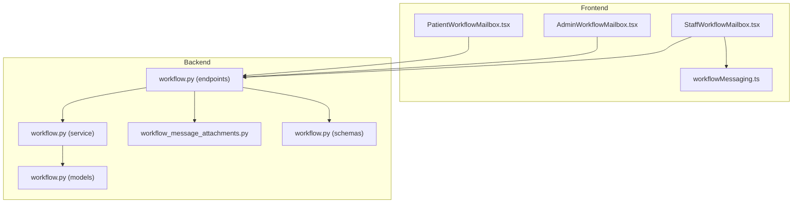
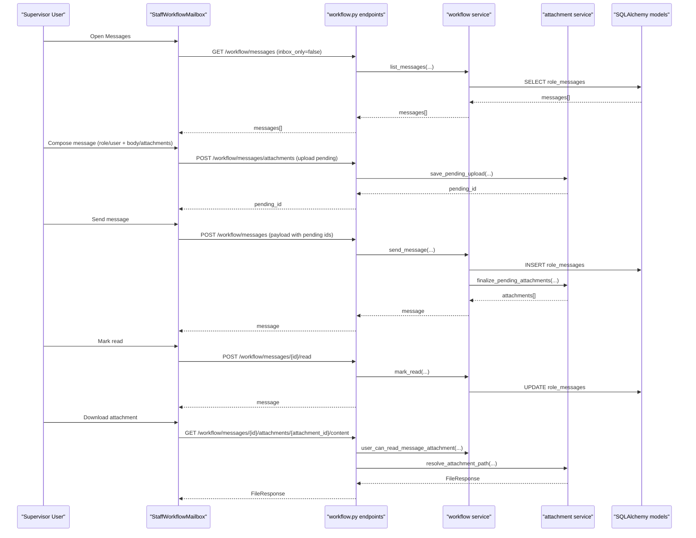
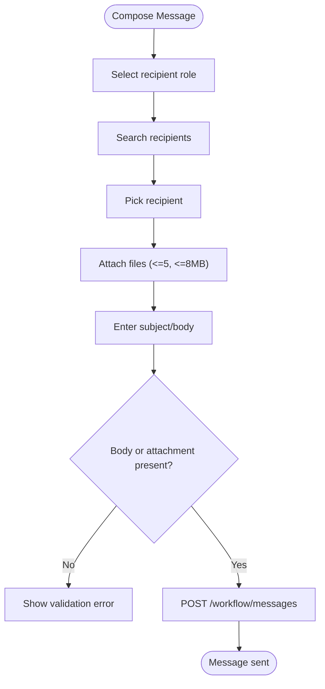
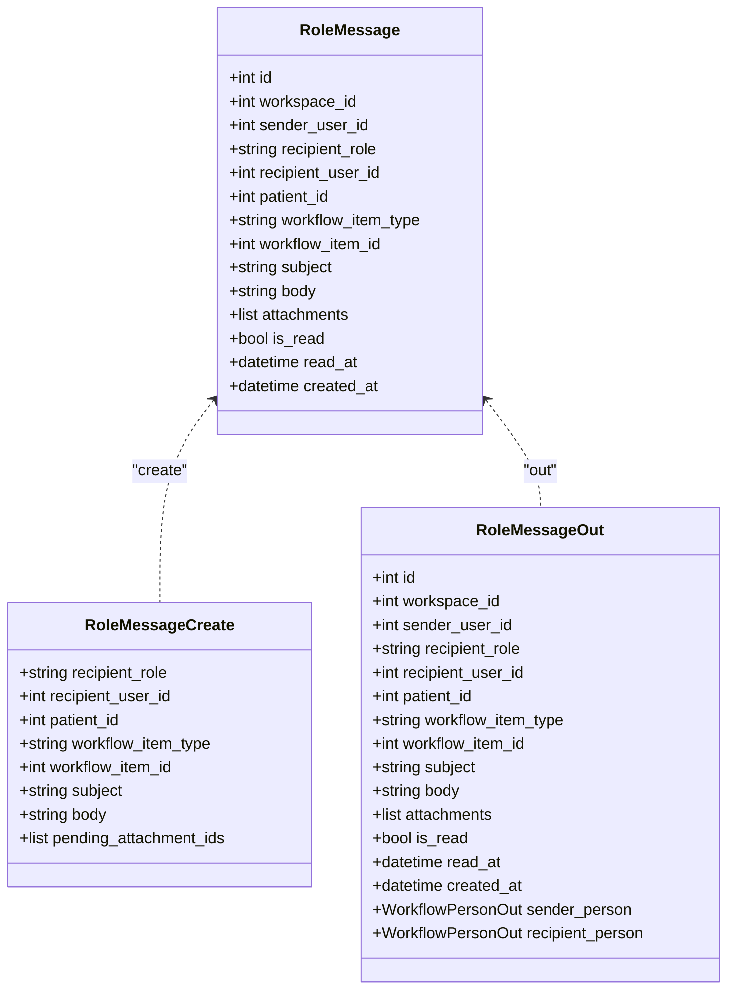
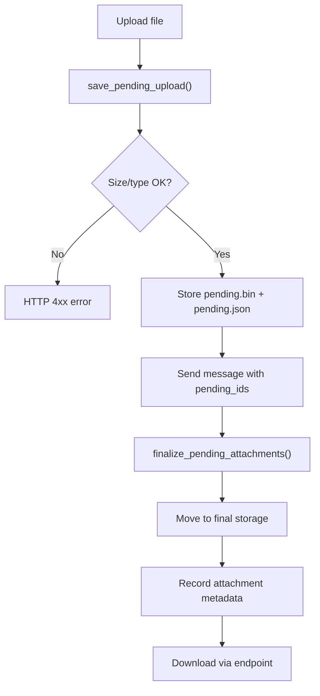
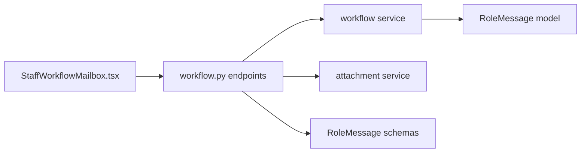

# Communication & Messaging Coordination

<cite>
**Referenced Files in This Document**
- [page.tsx](file://frontend/app/supervisor/messages/page.tsx)
- [StaffWorkflowMailbox.tsx](file://frontend/components/messaging/StaffWorkflowMailbox.tsx)
- [AdminWorkflowMailbox.tsx](file://frontend/components/messaging/AdminWorkflowMailbox.tsx)
- [PatientWorkflowMailbox.tsx](file://frontend/components/messaging/PatientWorkflowMailbox.tsx)
- [workflowMessaging.ts](file://frontend/lib/workflowMessaging.ts)
- [workflow.py](file://server/app/api/endpoints/workflow.py)
- [workflow.py](file://server/app/models/workflow.py)
- [workflow.py](file://server/app/services/workflow.py)
- [workflow_message_attachments.py](file://server/app/services/workflow_message_attachments.py)
- [workflow.py](file://server/app/schemas/workflow.py)
</cite>

## Table of Contents
1. [Introduction](#introduction)
2. [Project Structure](#project-structure)
3. [Core Components](#core-components)
4. [Architecture Overview](#architecture-overview)
5. [Detailed Component Analysis](#detailed-component-analysis)
6. [Dependency Analysis](#dependency-analysis)
7. [Performance Considerations](#performance-considerations)
8. [Troubleshooting Guide](#troubleshooting-guide)
9. [Conclusion](#conclusion)

## Introduction
This document describes the Communication & Messaging Coordination feature in the Supervisor Dashboard. It covers the interdepartmental communication interface, workflow messaging, staff coordination, and communication oversight tools. The implementation centers around three mailbox variants for supervisors, administrators, and patients, with shared capabilities for message threading, status tracking, attachments, and administrative oversight. The backend enforces role-based access, supports role-based and user-targeted messaging, and maintains audit trails for compliance and transparency.

## Project Structure
The feature spans frontend React components and backend FastAPI endpoints with SQLAlchemy models and services:
- Frontend pages and components for supervisor, admin, and patient mailboxes
- Shared messaging utilities for permissions and attachment URLs
- Backend endpoints for listing recipients, sending messages, marking read, uploading attachments, and retrieving attachments
- Models for role-based messages, attachments, and audit trail events
- Services for business logic, enrichment of people context, and attachment lifecycle management
- Schemas for request/response validation

**Diagram sources**
- [StaffWorkflowMailbox.tsx:153-723](file://frontend/components/messaging/StaffWorkflowMailbox.tsx#L153-L723)
- [AdminWorkflowMailbox.tsx:110-688](file://frontend/components/messaging/AdminWorkflowMailbox.tsx#L110-L688)
- [PatientWorkflowMailbox.tsx:71-517](file://frontend/components/messaging/PatientWorkflowMailbox.tsx#L71-L517)
- [workflowMessaging.ts:1-21](file://frontend/lib/workflowMessaging.ts#L1-L21)
- [workflow.py:261-404](file://server/app/api/endpoints/workflow.py#L261-L404)
- [workflow.py:67-89](file://server/app/models/workflow.py#L67-L89)
- [workflow.py:296-312](file://server/app/services/workflow.py#L296-L312)
- [workflow_message_attachments.py:52-153](file://server/app/services/workflow_message_attachments.py#L52-L153)
- [workflow.py:138-178](file://server/app/schemas/workflow.py#L138-L178)

**Section sources**
- [page.tsx:1-7](file://frontend/app/supervisor/messages/page.tsx#L1-L7)
- [StaffWorkflowMailbox.tsx:153-723](file://frontend/components/messaging/StaffWorkflowMailbox.tsx#L153-L723)
- [AdminWorkflowMailbox.tsx:110-688](file://frontend/components/messaging/AdminWorkflowMailbox.tsx#L110-L688)
- [PatientWorkflowMailbox.tsx:71-517](file://frontend/components/messaging/PatientWorkflowMailbox.tsx#L71-L517)
- [workflowMessaging.ts:1-21](file://frontend/lib/workflowMessaging.ts#L1-L21)
- [workflow.py:261-404](file://server/app/api/endpoints/workflow.py#L261-L404)
- [workflow.py:67-89](file://server/app/models/workflow.py#L67-L89)
- [workflow.py:296-312](file://server/app/services/workflow.py#L296-L312)
- [workflow_message_attachments.py:52-153](file://server/app/services/workflow_message_attachments.py#L52-L153)
- [workflow.py:138-178](file://server/app/schemas/workflow.py#L138-L178)

## Core Components
- Supervisor mailbox page renders the staff workflow mailbox configured for supervisor variant
- StaffWorkflowMailbox provides inbox/sent tabs, search, message selection, read/unread status, deletion controls, and compose sheet with recipient picker and attachments
- AdminWorkflowMailbox extends staff mailbox with role-based and user-targeted messaging, global message listing, and administrative controls
- PatientWorkflowMailbox enables patients to send messages to staff with recipient selection and attachments
- Utility functions define attachment URLs, permission checks, and limits

Key responsibilities:
- Frontend: UI composition, state management, queries, mutations, and attachment handling
- Backend: endpoint orchestration, validation, authorization, persistence, and attachment lifecycle

**Section sources**
- [page.tsx:1-7](file://frontend/app/supervisor/messages/page.tsx#L1-L7)
- [StaffWorkflowMailbox.tsx:153-723](file://frontend/components/messaging/StaffWorkflowMailbox.tsx#L153-L723)
- [AdminWorkflowMailbox.tsx:110-688](file://frontend/components/messaging/AdminWorkflowMailbox.tsx#L110-L688)
- [PatientWorkflowMailbox.tsx:71-517](file://frontend/components/messaging/PatientWorkflowMailbox.tsx#L71-L517)
- [workflowMessaging.ts:1-21](file://frontend/lib/workflowMessaging.ts#L1-L21)

## Architecture Overview
The supervisor dashboard integrates with backend endpoints to provide a unified workflow messaging experience. The frontend composes requests, manages UI state, and handles attachments via temporary pending uploads resolved upon message creation. The backend validates inputs, enforces role-based access, persists messages, and exposes audit trails.

**Diagram sources**
- [workflow.py:261-404](file://server/app/api/endpoints/workflow.py#L261-L404)
- [workflow.py:296-312](file://server/app/services/workflow.py#L296-L312)
- [workflow_message_attachments.py:52-153](file://server/app/services/workflow_message_attachments.py#L52-L153)
- [workflow.py:67-89](file://server/app/models/workflow.py#L67-L89)

## Detailed Component Analysis

### Supervisor Mailbox Page
- Renders the staff workflow mailbox configured for the supervisor variant
- Provides a single-pane view for managing workflow messages within the supervisor role context

**Section sources**
- [page.tsx:1-7](file://frontend/app/supervisor/messages/page.tsx#L1-L7)

### StaffWorkflowMailbox (Supervisor/Head Nurse/Observer)
- Variant-aware configuration for query keys, default filters, and UI labels
- Lists messages with inbox/sent tabs, search, and unread indicators
- Supports compose sheet with:
  - Recipient role filter and dynamic recipient picker
  - Patient association selector
  - Subject/body fields
  - Attachment chip management with upload and removal
- Actions:
  - Delete messages (conditional on permissions)
  - Mark read for incoming messages
  - Send messages to users or roles
- Reads recipients from a dedicated endpoint and enriches message context with people metadata

**Diagram sources**
- [StaffWorkflowMailbox.tsx:198-269](file://frontend/components/messaging/StaffWorkflowMailbox.tsx#L198-L269)
- [workflow.py:282-325](file://server/app/api/endpoints/workflow.py#L282-L325)
- [workflow.py:138-158](file://server/app/schemas/workflow.py#L138-L158)

**Section sources**
- [StaffWorkflowMailbox.tsx:153-723](file://frontend/components/messaging/StaffWorkflowMailbox.tsx#L153-L723)

### AdminWorkflowMailbox
- Extends staff mailbox with:
  - Target type selector: role-based vs user-based messaging
  - Administrative message listing across all messages
  - Unread/sent counters and global search
- Supports the same compose flow with additional validation and error handling

**Section sources**
- [AdminWorkflowMailbox.tsx:110-688](file://frontend/components/messaging/AdminWorkflowMailbox.tsx#L110-L688)

### PatientWorkflowMailbox
- Enables patients to send messages to staff members
- Recipient picker limited to staff and patient-linked accounts
- Attachment support with the same constraints as staff compose

**Section sources**
- [PatientWorkflowMailbox.tsx:71-517](file://frontend/components/messaging/PatientWorkflowMailbox.tsx#L71-L517)

### Communication Utilities
- Attachment URL builder for secure downloads
- Permission checks for message deletion based on role and ownership
- Limits for attachment count and size

**Section sources**
- [workflowMessaging.ts:1-21](file://frontend/lib/workflowMessaging.ts#L1-L21)

### Backend Endpoints and Models
- Endpoints:
  - List messages with inbox filtering and pagination
  - List messaging recipients (staff + patient-linked)
  - Send messages (role or user target)
  - Mark message read
  - Upload attachments (pending)
  - Retrieve attachment content (validated access)
  - Delete messages (validated access)
- Models:
  - RoleMessage with fields for sender/recipient/target, patient linkage, workflow item context, subject/body, attachments, read status, timestamps
- Services:
  - Enrich people context for messages
  - Validate targets and workspace membership
  - Audit trail logging for workflow actions

**Diagram sources**
- [workflow.py:67-89](file://server/app/models/workflow.py#L67-L89)
- [workflow.py:138-178](file://server/app/schemas/workflow.py#L138-L178)

**Section sources**
- [workflow.py:261-404](file://server/app/api/endpoints/workflow.py#L261-L404)
- [workflow.py:67-89](file://server/app/models/workflow.py#L67-L89)
- [workflow.py:296-312](file://server/app/services/workflow.py#L296-L312)
- [workflow.py:138-178](file://server/app/schemas/workflow.py#L138-L178)

### Attachment Management
- Pending upload with size/type validation and metadata persistence
- Finalization moves files to final storage and records attachment metadata
- Content retrieval resolves file path and media type for download
- Deletion cleans up orphaned files when attachments change

**Diagram sources**
- [workflow_message_attachments.py:52-153](file://server/app/services/workflow_message_attachments.py#L52-L153)
- [workflow.py:345-385](file://server/app/api/endpoints/workflow.py#L345-L385)

**Section sources**
- [workflow_message_attachments.py:1-202](file://server/app/services/workflow_message_attachments.py#L1-L202)
- [workflow.py:345-385](file://server/app/api/endpoints/workflow.py#L345-L385)

## Dependency Analysis
- Frontend components depend on:
  - React Query for caching and refetching
  - Zod for form validation
  - i18n for translations
  - API client for endpoint calls
- Backend depends on:
  - SQLAlchemy for ORM and Postgres JSONB for attachments
  - Pydantic schemas for validation
  - Services for business logic and audit trail
  - Attachment service for file lifecycle

**Diagram sources**
- [StaffWorkflowMailbox.tsx:153-723](file://frontend/components/messaging/StaffWorkflowMailbox.tsx#L153-L723)
- [workflow.py:261-404](file://server/app/api/endpoints/workflow.py#L261-L404)
- [workflow.py:296-312](file://server/app/services/workflow.py#L296-L312)
- [workflow.py:67-89](file://server/app/models/workflow.py#L67-L89)
- [workflow_message_attachments.py:52-153](file://server/app/services/workflow_message_attachments.py#L52-L153)
- [workflow.py:138-178](file://server/app/schemas/workflow.py#L138-L178)

**Section sources**
- [StaffWorkflowMailbox.tsx:153-723](file://frontend/components/messaging/StaffWorkflowMailbox.tsx#L153-L723)
- [workflow.py:261-404](file://server/app/api/endpoints/workflow.py#L261-L404)
- [workflow.py:67-89](file://server/app/models/workflow.py#L67-L89)
- [workflow.py:296-312](file://server/app/services/workflow.py#L296-L312)
- [workflow_message_attachments.py:52-153](file://server/app/services/workflow_message_attachments.py#L52-L153)
- [workflow.py:138-178](file://server/app/schemas/workflow.py#L138-L178)

## Performance Considerations
- Pagination and limits on message listings prevent excessive loads
- Refetch intervals for inbox polling balance freshness with network usage
- Attachment size/type limits reduce storage overhead and improve throughput
- Efficient indexing on workspace, user, and timestamps in the RoleMessage model
- Pending attachment cleanup prevents orphaned files and disk pressure

## Troubleshooting Guide
Common issues and resolutions:
- Validation errors on compose:
  - Ensure a recipient is selected and either body or attachments are present
  - Verify recipient role/user selection is consistent
- Attachment errors:
  - Confirm file type is supported and size does not exceed the limit
  - Re-upload if pending attachment expires
- Access denied:
  - Verify current user role and workspace membership
  - Check that the message belongs to the current workspace
- Read/unread status not updating:
  - Trigger manual refresh or wait for refetch interval
- Deleting messages:
  - Only allowed for admins/head nurses or owners; check permissions

**Section sources**
- [StaffWorkflowMailbox.tsx:219-281](file://frontend/components/messaging/StaffWorkflowMailbox.tsx#L219-L281)
- [AdminWorkflowMailbox.tsx:142-199](file://frontend/components/messaging/AdminWorkflowMailbox.tsx#L142-L199)
- [workflow.py:345-404](file://server/app/api/endpoints/workflow.py#L345-L404)
- [workflow_message_attachments.py:52-153](file://server/app/services/workflow_message_attachments.py#L52-L153)

## Conclusion
The Communication & Messaging Coordination feature provides a robust, role-aware workflow messaging system for supervisors and administrators, with patient-facing messaging and comprehensive administrative oversight. The frontend offers intuitive compose and read experiences, while the backend enforces strict validation, access control, and auditability. Attachment handling is secure and scalable, and the modular design supports extension to additional workflow contexts.