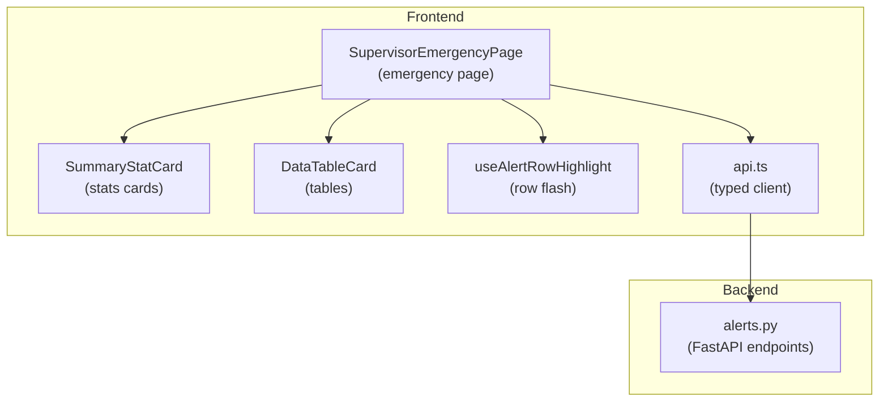
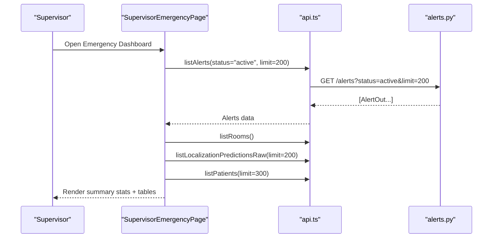
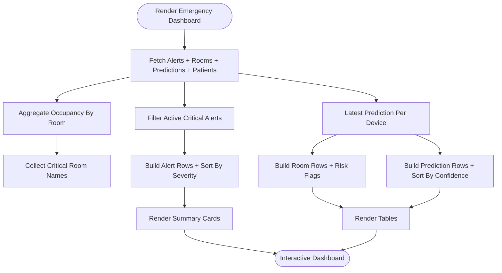
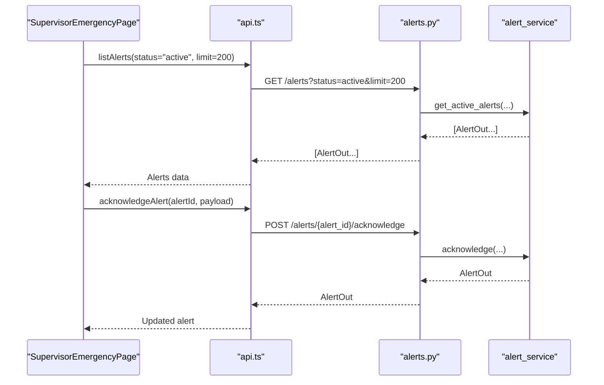
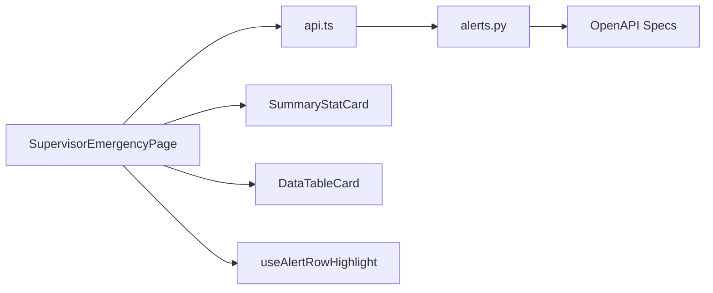

# Emergency Response Coordination

<cite>
**Referenced Files in This Document**
- [SupervisorEmergencyPage](file://frontend/app/supervisor/emergency/page.tsx)
- [SummaryStatCard](file://frontend/components/supervisor/SummaryStatCard.tsx)
- [DataTableCard](file://frontend/components/supervisor/DataTableCard.tsx)
- [useAlertRowHighlight](file://frontend/hooks/useAlertRowHighlight.ts)
- [api.ts](file://frontend/lib/api.ts)
- [alerts.py](file://server/app/api/endpoints/alerts.py)
- [.openapi.json](file://frontend/.openapi.json)
- [openapi.generated.json](file://server/openapi.generated.json)
</cite>

## Table of Contents
1. [Introduction](#introduction)
2. [Project Structure](#project-structure)
3. [Core Components](#core-components)
4. [Architecture Overview](#architecture-overview)
5. [Detailed Component Analysis](#detailed-component-analysis)
6. [Dependency Analysis](#dependency-analysis)
7. [Performance Considerations](#performance-considerations)
8. [Troubleshooting Guide](#troubleshooting-guide)
9. [Conclusion](#conclusion)

## Introduction
This document describes the Emergency Response Coordination feature in the Supervisor Dashboard. It focuses on the emergency incident management interface, including critical alert handling, emergency response protocols, and real-time crisis management tools. The implementation centers on three primary views: summary statistics cards, emergency status tracking, and response coordination workflows. Features include critical alert escalation, emergency resource allocation, incident documentation, and multi-department coordination. The document also provides examples of supervisor emergency workflows for incident response, resource deployment, communication coordination, and post-incident analysis activities.

## Project Structure
The Emergency Response feature is implemented as a Next.js page under the Supervisor role, backed by a reusable UI toolkit and a strongly typed API client. The backend exposes alert lifecycle endpoints that support creation, acknowledgment, and resolution of incidents.

**Diagram sources**
- [SupervisorEmergencyPage:68-439](file://frontend/app/supervisor/emergency/page.tsx#L68-L439)
- [SummaryStatCard:13-37](file://frontend/components/supervisor/SummaryStatCard.tsx#L13-L37)
- [DataTableCard:40-166](file://frontend/components/supervisor/DataTableCard.tsx#L40-L166)
- [useAlertRowHighlight:9-34](file://frontend/hooks/useAlertRowHighlight.ts#L9-L34)
- [api.ts:491-498](file://frontend/lib/api.ts#L491-L498)
- [alerts.py:29-55](file://server/app/api/endpoints/alerts.py#L29-L55)

**Section sources**
- [SupervisorEmergencyPage:68-439](file://frontend/app/supervisor/emergency/page.tsx#L68-L439)
- [SummaryStatCard:13-37](file://frontend/components/supervisor/SummaryStatCard.tsx#L13-L37)
- [DataTableCard:40-166](file://frontend/components/supervisor/DataTableCard.tsx#L40-L166)
- [useAlertRowHighlight:9-34](file://frontend/hooks/useAlertRowHighlight.ts#L9-L34)
- [api.ts:491-498](file://frontend/lib/api.ts#L491-L498)
- [alerts.py:29-55](file://server/app/api/endpoints/alerts.py#L29-L55)

## Core Components
- Emergency Dashboard Page: Orchestrates queries for active critical alerts, rooms, localization predictions, and patients; computes derived metrics and renders summary cards and data tables.
- Summary Statistics Cards: Displays critical alert count, tracked device count, and live room coverage with color-coded tones.
- Data Tables: Presents alert queue, floor coverage, and localization feed with sorting, pagination, and row highlighting.
- Row Highlight Hook: Scrolls to and temporarily highlights a specific alert row when requested via URL parameter.
- Typed API Client: Provides strongly typed methods for alerts, rooms, patients, and localization predictions.

Key responsibilities:
- Real-time data fetching and caching with React Query.
- Severity-aware alert sorting and critical room detection.
- Confidence-weighted occupancy aggregation per room.
- Responsive, accessible table rendering with pagination and sorting.

**Section sources**
- [SupervisorEmergencyPage:68-439](file://frontend/app/supervisor/emergency/page.tsx#L68-L439)
- [SummaryStatCard:13-37](file://frontend/components/supervisor/SummaryStatCard.tsx#L13-L37)
- [DataTableCard:40-166](file://frontend/components/supervisor/DataTableCard.tsx#L40-L166)
- [useAlertRowHighlight:9-34](file://frontend/hooks/useAlertRowHighlight.ts#L9-L34)
- [api.ts:491-498](file://frontend/lib/api.ts#L491-L498)

## Architecture Overview
The emergency dashboard integrates frontend components with backend alert endpoints. The page performs concurrent queries to fetch active critical alerts, room metadata, recent localization predictions, and patient records. Derived computations produce summary statistics and table rows. The API client abstracts HTTP requests and error handling.

**Diagram sources**
- [SupervisorEmergencyPage:71-104](file://frontend/app/supervisor/emergency/page.tsx#L71-L104)
- [api.ts:491-498](file://frontend/lib/api.ts#L491-L498)
- [alerts.py:29-55](file://server/app/api/endpoints/alerts.py#L29-L55)

## Detailed Component Analysis

### Emergency Dashboard Page
Responsibilities:
- Fetches and caches active critical alerts, rooms, localization predictions, and patients.
- Computes:
  - Active critical alerts count for summary card.
  - Latest localization predictions per device.
  - Occupancy per room with confidence averaging and latest timestamp.
  - Critical rooms from active critical alerts.
  - Alert rows with severity-aware sorting and patient linkage.
  - Room rows with risk badges and occupancy metrics.
  - Prediction rows sorted by confidence.
- Renders:
  - SummaryStatCard for critical alerts, tracked devices, and live rooms.
  - DataTableCard for alert queue, floor coverage, and localization feed.
  - Row highlighting for a specific alert via URL parameter.

**Diagram sources**
- [SupervisorEmergencyPage:106-246](file://frontend/app/supervisor/emergency/page.tsx#L106-L246)

**Section sources**
- [SupervisorEmergencyPage:68-439](file://frontend/app/supervisor/emergency/page.tsx#L68-L439)

### Summary Statistics Cards
Displays three key metrics:
- Critical Alerts: Count of active critical alerts; tone changes to critical when any exist.
- Tracked Devices: Count of latest localization predictions.
- Live Rooms: Number of rooms with recent occupancy.

Implementation highlights:
- Uses a tone class map for visual emphasis.
- Accepts an icon prop for contextual labeling.

**Section sources**
- [SummaryStatCard:13-37](file://frontend/components/supervisor/SummaryStatCard.tsx#L13-L37)
- [SupervisorEmergencyPage:382-401](file://frontend/app/supervisor/emergency/page.tsx#L382-L401)

### Data Tables
Three tables provide coordinated situational awareness:
- Alert Queue: Active alerts with patient name, timestamp, and action button to open patient context.
- Floor Coverage: Rooms with localized device counts, average confidence, last signal, and risk indicators.
- Localization Feed: Recent device-to-room predictions ordered by confidence.

Features:
- Sorting and pagination via TanStack Table.
- Empty state handling and loading spinners.
- Accessibility-friendly headers and row IDs for deep linking.

**Section sources**
- [DataTableCard:40-166](file://frontend/components/supervisor/DataTableCard.tsx#L40-L166)
- [SupervisorEmergencyPage:248-356](file://frontend/app/supervisor/emergency/page.tsx#L248-L356)

### Row Highlight Hook
Behavior:
- On mount, checks for an alert ID in the URL and whether data is ready.
- Scrolls to the matching alert row and applies a temporary highlight class.
- Clears the highlight after a short duration.

Usage:
- URL parameter controls which row to highlight.
- DOM ID pattern: ws-alert-{alertId}.

**Section sources**
- [useAlertRowHighlight:9-34](file://frontend/hooks/useAlertRowHighlight.ts#L9-L34)
- [SupervisorEmergencyPage:361-373](file://frontend/app/supervisor/emergency/page.tsx#L361-L373)

### Backend Alert Endpoints
The backend supports the full alert lifecycle:
- Listing alerts with optional status filtering and visibility constraints.
- Creating alerts with role-based permissions and patient access checks.
- Acknowledging and resolving alerts with caregiver context.

**Diagram sources**
- [api.ts:571-575](file://frontend/lib/api.ts#L571-L575)
- [alerts.py:91-112](file://server/app/api/endpoints/alerts.py#L91-L112)
- [.openapi.json:4899-4903](file://frontend/.openapi.json#L4899-L4903)
- [openapi.generated.json:4666-4685](file://server/openapi.generated.json#L4666-L4685)

**Section sources**
- [api.ts:571-575](file://frontend/lib/api.ts#L571-L575)
- [alerts.py:91-112](file://server/app/api/endpoints/alerts.py#L91-L112)
- [.openapi.json:4899-4903](file://frontend/.openapi.json#L4899-L4903)
- [openapi.generated.json:4666-4685](file://server/openapi.generated.json#L4666-L4685)

## Dependency Analysis
- SupervisorEmergencyPage depends on:
  - React Query for data fetching and caching.
  - Zod schemas for runtime validation of rooms and predictions.
  - DataTableCard and SummaryStatCard for rendering.
  - useAlertRowHighlight for UX enhancement.
  - api.ts for typed HTTP calls to backend endpoints.
- api.ts depends on:
  - OpenAPI specs for endpoint contracts.
  - FastAPI backend endpoints for alert lifecycle operations.
- Backend endpoints depend on:
  - Workspace-scoped access control and patient visibility rules.
  - Alert service for CRUD operations.

**Diagram sources**
- [SupervisorEmergencyPage:68-439](file://frontend/app/supervisor/emergency/page.tsx#L68-L439)
- [api.ts:491-498](file://frontend/lib/api.ts#L491-L498)
- [alerts.py:29-55](file://server/app/api/endpoints/alerts.py#L29-L55)
- [.openapi.json:4799-4903](file://frontend/.openapi.json#L4799-L4903)
- [openapi.generated.json:4540-4685](file://server/openapi.generated.json#L4540-L4685)

**Section sources**
- [SupervisorEmergencyPage:68-439](file://frontend/app/supervisor/emergency/page.tsx#L68-L439)
- [api.ts:491-498](file://frontend/lib/api.ts#L491-L498)
- [alerts.py:29-55](file://server/app/api/endpoints/alerts.py#L29-L55)
- [.openapi.json:4799-4903](file://frontend/.openapi.json#L4799-L4903)
- [openapi.generated.json:4540-4685](file://server/openapi.generated.json#L4540-L4685)

## Performance Considerations
- Data freshness:
  - Predictions refresh every 30 seconds to balance timeliness and load.
  - Alerts and rooms are fetched on mount; consider background refetch intervals for continuous updates.
- Rendering efficiency:
  - Memoized computations prevent unnecessary re-renders for derived data.
  - Pagination limits reduce payload sizes for large datasets.
- Network resilience:
  - Centralized error handling and timeouts in the API client.
  - Loading states improve perceived responsiveness.

## Troubleshooting Guide
Common issues and resolutions:
- No alerts displayed:
  - Verify active status filter and limit parameters.
  - Confirm workspace visibility and patient access constraints.
- Row highlight not working:
  - Ensure URL parameter includes a valid alert ID and the row exists.
  - Check that data is loaded before attempting highlight.
- Slow table rendering:
  - Reduce pageSize or enable virtualization if supported.
  - Pre-filter data server-side when possible.
- API errors:
  - Inspect ApiError thrown by the client for status and message.
  - Review backend logs for permission denials or missing resources.

**Section sources**
- [SupervisorEmergencyPage:358-373](file://frontend/app/supervisor/emergency/page.tsx#L358-L373)
- [api.ts:118-297](file://frontend/lib/api.ts#L118-L297)
- [alerts.py:38-55](file://server/app/api/endpoints/alerts.py#L38-L55)

## Conclusion
The Emergency Response Coordination feature delivers a real-time, data-driven dashboard for supervisors to monitor and manage incidents. Its modular design—summary cards, interactive tables, and row highlighting—enables rapid situational awareness and efficient response coordination. The backend’s alert lifecycle endpoints provide robust control over incident states, while the typed API client ensures reliable integrations. Together, these components support critical alert escalation, resource allocation, documentation, and multi-department collaboration during crises.