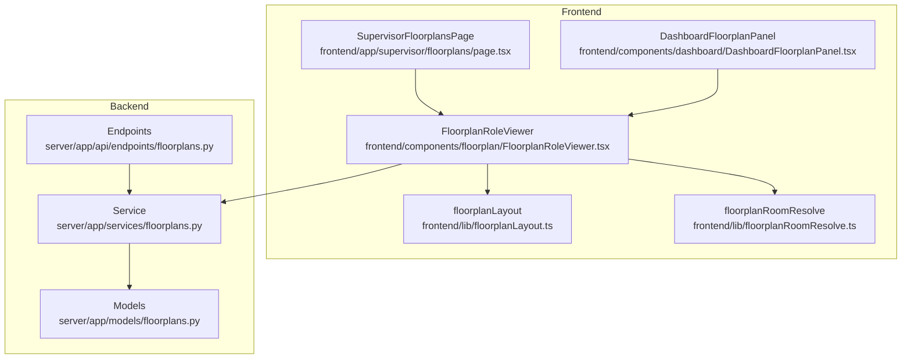
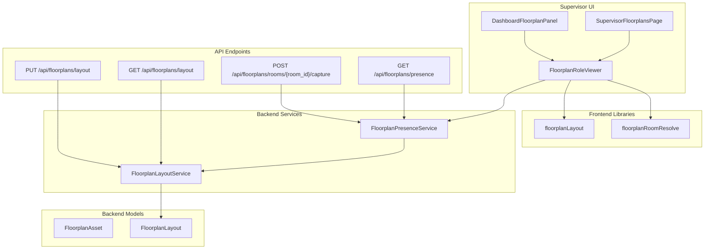
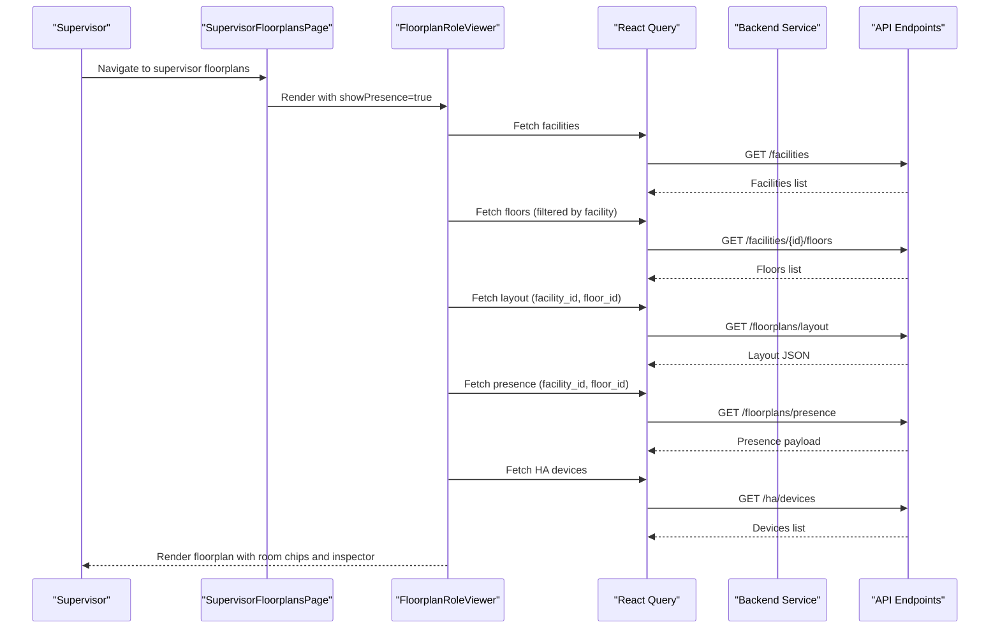
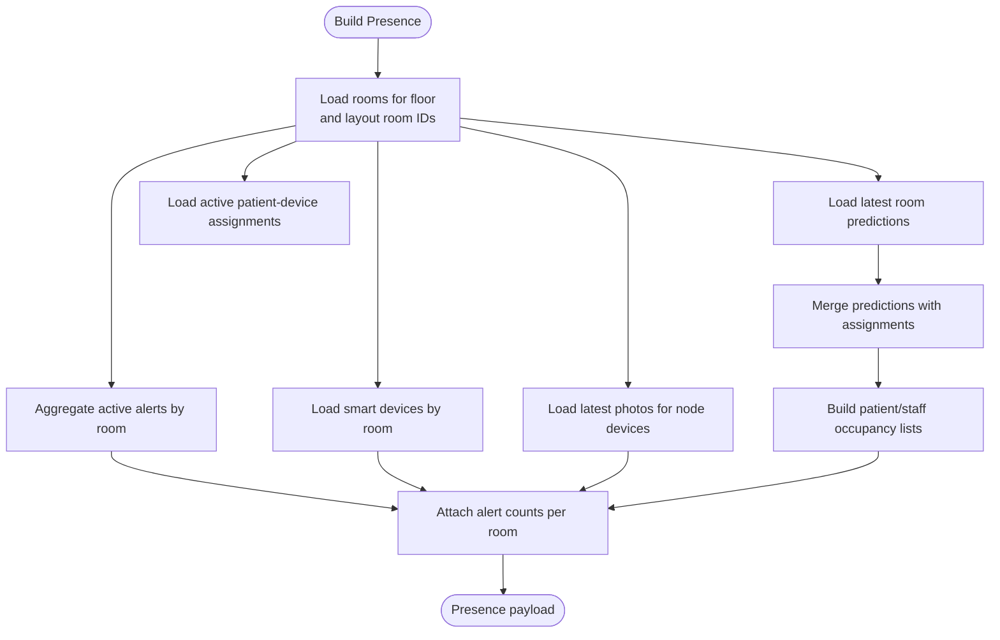
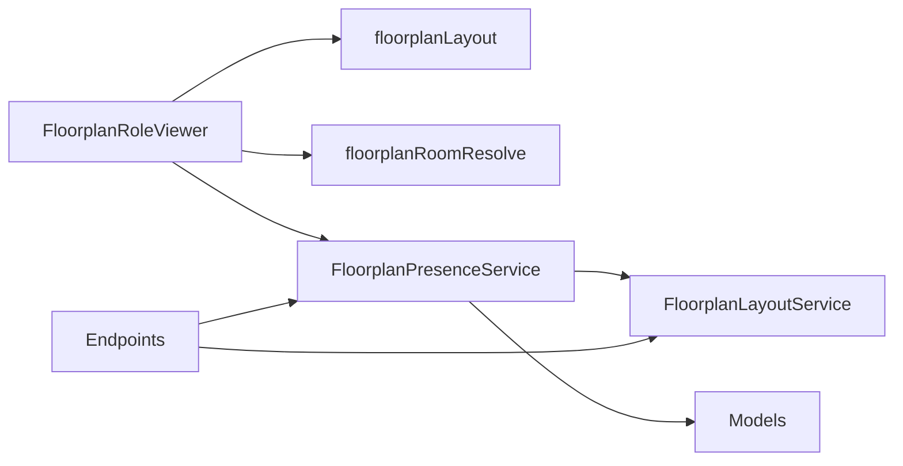

# Floorplan & Facility Monitoring

<cite>
**Referenced Files in This Document**
- [SupervisorFloorplansPage](file://frontend/app/supervisor/floorplans/page.tsx)
- [DashboardFloorplanPanel](file://frontend/components/dashboard/DashboardFloorplanPanel.tsx)
- [FloorplanRoleViewer](file://frontend/components/floorplan/FloorplanRoleViewer.tsx)
- [floorplanLayout](file://frontend/lib/floorplanLayout.ts)
- [floorplanRoomResolve](file://frontend/lib/floorplanRoomResolve.ts)
- [ARCHITECTURE.md](file://ARCHITECTURE.md)
- [floorplans.py (models)](file://server/app/models/floorplans.py)
- [floorplans.py (service)](file://server/app/services/floorplans.py)
- [floorplans.py (endpoint)](file://server/app/api/endpoints/floorplans.py)
</cite>

## Table of Contents
1. [Introduction](#introduction)
2. [Project Structure](#project-structure)
3. [Core Components](#core-components)
4. [Architecture Overview](#architecture-overview)
5. [Detailed Component Analysis](#detailed-component-analysis)
6. [Dependency Analysis](#dependency-analysis)
7. [Performance Considerations](#performance-considerations)
8. [Troubleshooting Guide](#troubleshooting-guide)
9. [Conclusion](#conclusion)

## Introduction
This document describes the Floorplan & Facility Monitoring feature in the Supervisor Dashboard. It explains the facility oversight interface, including floorplan visualization, room monitoring, and spatial awareness tools. It documents the implementation of floorplan monitoring components (dashboard floorplan panels, room status indicators, and facility layout management), and covers the monitoring features such as real-time room occupancy tracking, facility resource allocation, spatial workflow optimization, and building safety monitoring. It also provides supervisor floorplan workflows for facility oversight, room utilization management, spatial workflow coordination, and building safety protocols.

## Project Structure
The Floorplan & Facility Monitoring feature spans frontend React components and backend services/endpoints:
- Frontend pages and components render the supervisor floorplan view and integrate with the monitoring workspace.
- Frontend libraries handle floorplan layout normalization and room resolution.
- Backend models define floorplan assets and layouts.
- Backend services compute presence and manage floorplan operations.
- Backend endpoints expose APIs for floorplan data, presence, and room capture.

**Diagram sources**
- [SupervisorFloorplansPage:1-26](file://frontend/app/supervisor/floorplans/page.tsx#L1-L26)
- [DashboardFloorplanPanel:1-30](file://frontend/components/dashboard/DashboardFloorplanPanel.tsx#L1-L30)
- [FloorplanRoleViewer:1-1143](file://frontend/components/floorplan/FloorplanRoleViewer.tsx#L1-L1143)
- [floorplanLayout:1-103](file://frontend/lib/floorplanLayout.ts#L1-L103)
- [floorplanRoomResolve:1-108](file://frontend/lib/floorplanRoomResolve.ts#L1-L108)
- [floorplans.py (models):1-48](file://server/app/models/floorplans.py#L1-L48)
- [floorplans.py (service):1-613](file://server/app/services/floorplans.py#L1-L613)
- [floorplans.py (endpoint):1-242](file://server/app/api/endpoints/floorplans.py#L1-L242)

**Section sources**
- [SupervisorFloorplansPage:1-26](file://frontend/app/supervisor/floorplans/page.tsx#L1-L26)
- [DashboardFloorplanPanel:1-30](file://frontend/components/dashboard/DashboardFloorplanPanel.tsx#L1-L30)
- [FloorplanRoleViewer:1-1143](file://frontend/components/floorplan/FloorplanRoleViewer.tsx#L1-L1143)
- [floorplanLayout:1-103](file://frontend/lib/floorplanLayout.ts#L1-L103)
- [floorplanRoomResolve:1-108](file://frontend/lib/floorplanRoomResolve.ts#L1-L108)
- [floorplans.py (models):1-48](file://server/app/models/floorplans.py#L1-L48)
- [floorplans.py (service):1-613](file://server/app/services/floorplans.py#L1-L613)
- [floorplans.py (endpoint):1-242](file://server/app/api/endpoints/floorplans.py#L1-L242)

## Core Components
- Supervisor floorplan page: Renders the supervisor’s floorplan view with live occupancy and emergency readiness.
- Dashboard floorplan panel: Reusable component used on dashboards to embed a floorplan viewer with optional presence.
- Floorplan role viewer: Central component that fetches facilities, floors, layout, rooms, presence, and smart devices; renders a selectable floorplan canvas and a room inspector.
- Floorplan layout library: Normalizes saved layout coordinates and bootstraps rooms from database when no layout exists.
- Room resolution library: Resolves layout labels to database room rows to align presence with the floorplan.
- Backend models: Persist floorplan assets and layouts.
- Backend service: Computes presence from room assignments, predictions, alerts, smart devices, and camera snapshots.
- Backend endpoints: Expose floorplan operations, presence, and room capture.

**Section sources**
- [SupervisorFloorplansPage:1-26](file://frontend/app/supervisor/floorplans/page.tsx#L1-L26)
- [DashboardFloorplanPanel:1-30](file://frontend/components/dashboard/DashboardFloorplanPanel.tsx#L1-L30)
- [FloorplanRoleViewer:1-1143](file://frontend/components/floorplan/FloorplanRoleViewer.tsx#L1-L1143)
- [floorplanLayout:1-103](file://frontend/lib/floorplanLayout.ts#L1-L103)
- [floorplanRoomResolve:1-108](file://frontend/lib/floorplanRoomResolve.ts#L1-L108)
- [floorplans.py (models):1-48](file://server/app/models/floorplans.py#L1-L48)
- [floorplans.py (service):1-613](file://server/app/services/floorplans.py#L1-L613)
- [floorplans.py (endpoint):1-242](file://server/app/api/endpoints/floorplans.py#L1-L242)

## Architecture Overview
The supervisor floorplan monitoring architecture integrates frontend visualization with backend presence computation and device orchestration.

**Diagram sources**
- [SupervisorFloorplansPage:1-26](file://frontend/app/supervisor/floorplans/page.tsx#L1-L26)
- [DashboardFloorplanPanel:1-30](file://frontend/components/dashboard/DashboardFloorplanPanel.tsx#L1-L30)
- [FloorplanRoleViewer:1-1143](file://frontend/components/floorplan/FloorplanRoleViewer.tsx#L1-L1143)
- [floorplanLayout:1-103](file://frontend/lib/floorplanLayout.ts#L1-L103)
- [floorplanRoomResolve:1-108](file://frontend/lib/floorplanRoomResolve.ts#L1-L108)
- [floorplans.py (service):1-613](file://server/app/services/floorplans.py#L1-L613)
- [floorplans.py (models):1-48](file://server/app/models/floorplans.py#L1-L48)
- [floorplans.py (endpoint):1-242](file://server/app/api/endpoints/floorplans.py#L1-L242)

## Detailed Component Analysis

### Supervisor Floorplan Page
- Purpose: Provides the supervisor’s dedicated floorplan view with live occupancy and emergency readiness.
- Behavior: Uses the role viewer to render a floorplan canvas with presence and a room inspector.

**Section sources**
- [SupervisorFloorplansPage:1-26](file://frontend/app/supervisor/floorplans/page.tsx#L1-L26)

### Dashboard Floorplan Panel
- Purpose: Embeds a floorplan viewer in dashboards with optional presence rendering and initial scope selection.
- Behavior: Delegates to the role viewer with configurable props for facility, floor, and room.

**Section sources**
- [DashboardFloorplanPanel:1-30](file://frontend/components/dashboard/DashboardFloorplanPanel.tsx#L1-L30)

### Floorplan Role Viewer
- Purpose: Central component for facility/floor selection, layout retrieval, room population, presence computation, and room inspection.
- Data sources:
  - Facilities and floors via API queries.
  - Saved floorplan layout or bootstrap from database rooms.
  - Room presence via periodic polling.
  - Smart devices and camera snapshots for room telemetry.
- Rendering:
  - Facility and floor pickers.
  - Read-only floorplan canvas with room chips indicating status and counts.
  - Inspector panel for selected room with occupants, telemetry, devices, and snapshot controls.

**Diagram sources**
- [SupervisorFloorplansPage:1-26](file://frontend/app/supervisor/floorplans/page.tsx#L1-L26)
- [FloorplanRoleViewer:1-1143](file://frontend/components/floorplan/FloorplanRoleViewer.tsx#L1-L1143)
- [floorplans.py (endpoint):135-177](file://server/app/api/endpoints/floorplans.py#L135-L177)

**Section sources**
- [FloorplanRoleViewer:1-1143](file://frontend/components/floorplan/FloorplanRoleViewer.tsx#L1-L1143)

### Floorplan Layout Library
- Purpose: Normalize saved layout coordinates and bootstrap rooms from database when no layout exists.
- Features:
  - Coordinate normalization across layout versions.
  - Conversion between percentages and canvas units.
  - Bootstrap grid placement for rooms when layout is empty.

**Section sources**
- [floorplanLayout:1-103](file://frontend/lib/floorplanLayout.ts#L1-L103)

### Room Resolution Library
- Purpose: Align layout labels to database room rows to ensure presence maps to the correct rooms.
- Features:
  - Label normalization and digit extraction.
  - Fuzzy matching by label substrings and trailing digits.
  - Stable ID normalization to canonical room IDs.

**Section sources**
- [floorplanRoomResolve:1-108](file://frontend/lib/floorplanRoomResolve.ts#L1-L108)

### Backend Presence Service
- Purpose: Build a presence payload combining room assignments, predictions, alerts, smart devices, and camera snapshots.
- Inputs:
  - Workspace, facility, floor scope.
  - Visible patient IDs for access-awareness.
- Outputs:
  - Room-level presence with patient hints, staff hints, alerts, device summaries, camera snapshots, and prediction hints.
- Status logic:
  - Node status derived from device last-seen age.
  - Room tone determined by alerts, node status, staleness, occupancy, and predictions.

**Diagram sources**
- [floorplans.py (service):42-506](file://server/app/services/floorplans.py#L42-L506)

**Section sources**
- [floorplans.py (service):1-613](file://server/app/services/floorplans.py#L1-L613)

### Backend Models
- Purpose: Persist floorplan assets and layouts.
- Entities:
  - FloorplanAsset: Uploaded image assets with metadata.
  - FloorplanLayout: Interactive layout JSON scoped to facility/floor.

**Section sources**
- [floorplans.py (models):1-48](file://server/app/models/floorplans.py#L1-L48)

### Backend Endpoints
- Purpose: Expose floorplan operations and monitoring APIs.
- Endpoints:
  - GET /api/floorplans/layout: Retrieve saved layout for a facility/floor.
  - PUT /api/floorplans/layout: Save layout with validation.
  - GET /api/floorplans/presence: Compute and return presence for a facility/floor.
  - POST /api/floorplans/rooms/{room_id}/capture: Request a camera snapshot for a room.

**Section sources**
- [floorplans.py (endpoint):135-242](file://server/app/api/endpoints/floorplans.py#L135-L242)

## Dependency Analysis
- Frontend role viewer depends on:
  - Layout normalization and room resolution libraries.
  - Backend presence service via API endpoints.
- Backend presence service depends on:
  - Layout service for room alignment.
  - Device registry for node device resolution.
  - Patient and assignment data for occupancy.
  - Alerts, smart devices, and camera photos for telemetry.

**Diagram sources**
- [FloorplanRoleViewer:1-1143](file://frontend/components/floorplan/FloorplanRoleViewer.tsx#L1-L1143)
- [floorplanLayout:1-103](file://frontend/lib/floorplanLayout.ts#L1-L103)
- [floorplanRoomResolve:1-108](file://frontend/lib/floorplanRoomResolve.ts#L1-L108)
- [floorplans.py (service):1-613](file://server/app/services/floorplans.py#L1-L613)
- [floorplans.py (models):1-48](file://server/app/models/floorplans.py#L1-L48)
- [floorplans.py (endpoint):1-242](file://server/app/api/endpoints/floorplans.py#L1-L242)

**Section sources**
- [FloorplanRoleViewer:1-1143](file://frontend/components/floorplan/FloorplanRoleViewer.tsx#L1-L1143)
- [floorplans.py (service):1-613](file://server/app/services/floorplans.py#L1-L613)
- [floorplans.py (endpoint):1-242](file://server/app/api/endpoints/floorplans.py#L1-L242)

## Performance Considerations
- Polling intervals: Presence is polled at a short interval to keep the UI responsive while minimizing backend load.
- Staleness handling: Node staleness and prediction staleness inform room status and UI messaging.
- Access-aware presence: Presence filtering respects visible patient IDs for role-based access.
- Layout fallback: When no layout exists, rooms are bootstrapped from the database to avoid empty canvases.

[No sources needed since this section provides general guidance]

## Troubleshooting Guide
- No rooms displayed:
  - Verify layout exists for the selected facility/floor; otherwise, rooms are bootstrapped from the database.
  - Confirm facility and floor selection scopes are valid.
- No presence data:
  - Ensure the presence endpoint is reachable and the facility/floor scope is correct.
  - Check that patients are assigned to rooms or predictions exist for live occupancy.
- Snapshot capture unavailable:
  - Room must have a mapped node device; otherwise, capture requests are rejected.
- Device conflicts in layout:
  - Each device can be assigned to at most one room; fix duplicates before saving layout.

**Section sources**
- [FloorplanRoleViewer:1-1143](file://frontend/components/floorplan/FloorplanRoleViewer.tsx#L1-L1143)
- [floorplans.py (endpoint):180-200](file://server/app/api/endpoints/floorplans.py#L180-L200)
- [floorplans.py (endpoint):202-242](file://server/app/api/endpoints/floorplans.py#L202-L242)

## Conclusion
The Floorplan & Facility Monitoring feature provides supervisors with a unified, real-time view of facility zones. The frontend role viewer integrates layout, presence, and telemetry to deliver spatial awareness, while the backend services and endpoints ensure accurate, access-aware, and timely data. The design supports robust workflows for oversight, occupancy tracking, resource allocation, and safety monitoring.