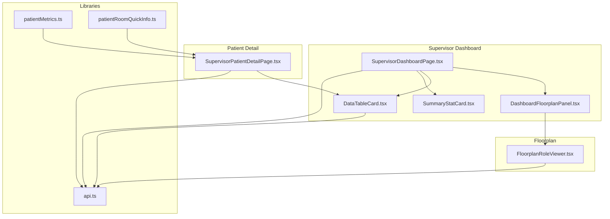
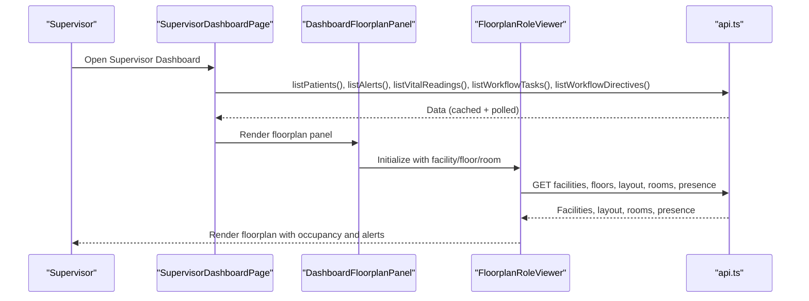
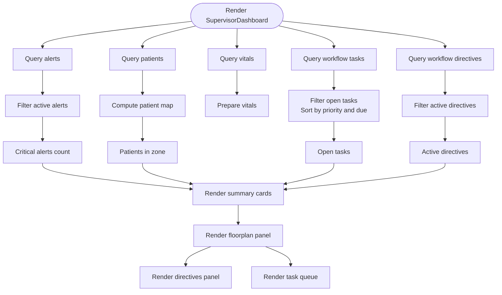
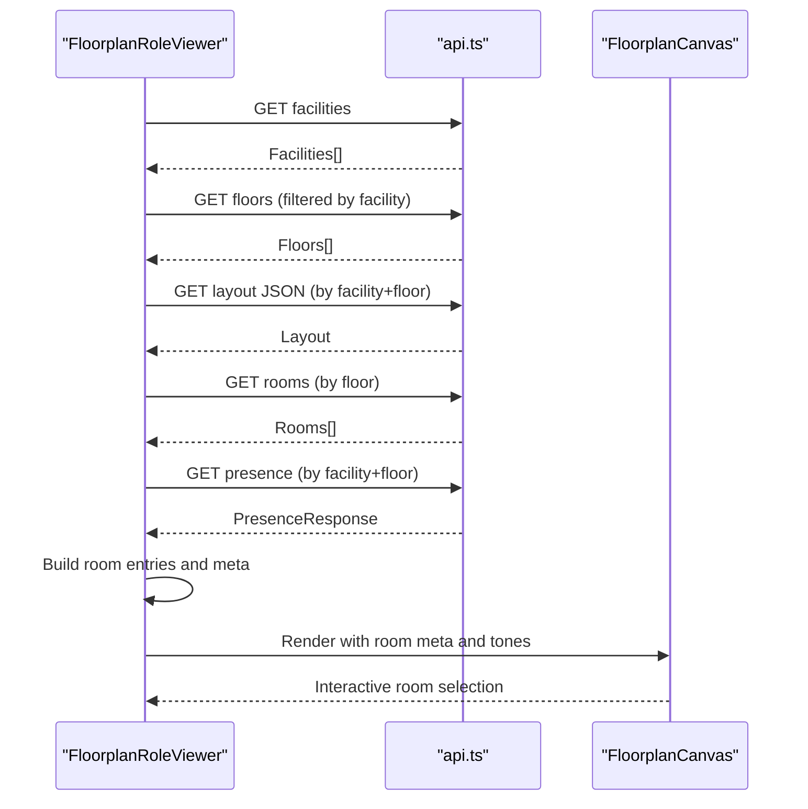
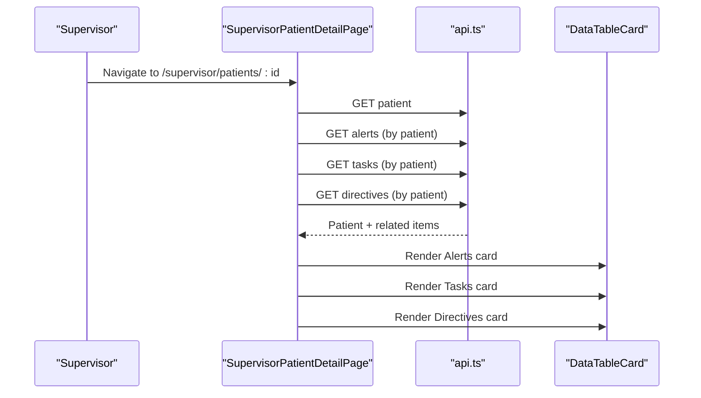
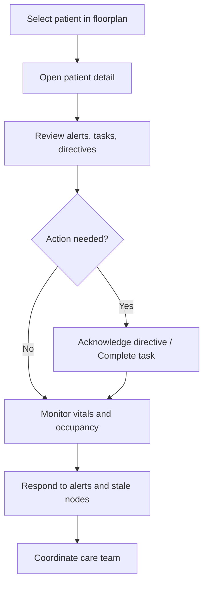
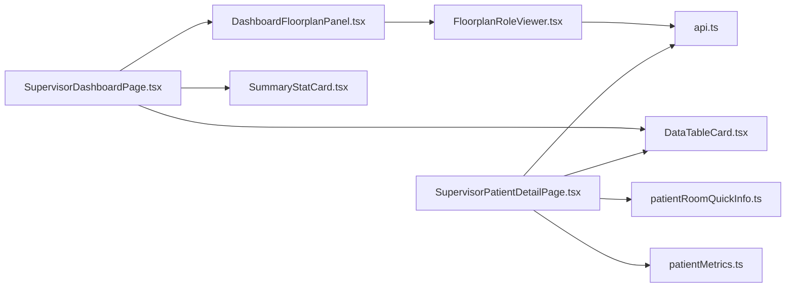

# Patient Monitoring & Tracking

<cite>
**Referenced Files in This Document**
- [SupervisorDashboardPage.tsx](file://frontend/app/supervisor/page.tsx)
- [SupervisorPatientDetailPage.tsx](file://frontend/app/supervisor/patients/[id]/page.tsx)
- [DashboardFloorplanPanel.tsx](file://frontend/components/dashboard/DashboardFloorplanPanel.tsx)
- [FloorplanRoleViewer.tsx](file://frontend/components/floorplan/FloorplanRoleViewer.tsx)
- [DataTableCard.tsx](file://frontend/components/supervisor/DataTableCard.tsx)
- [SummaryStatCard.tsx](file://frontend/components/supervisor/SummaryStatCard.tsx)
- [patientMetrics.ts](file://frontend/lib/patientMetrics.ts)
- [patientRoomQuickInfo.ts](file://frontend/lib/patientRoomQuickInfo.ts)
- [api.ts](file://frontend/lib/api.ts)
</cite>

## Table of Contents
1. [Introduction](#introduction)
2. [Project Structure](#project-structure)
3. [Core Components](#core-components)
4. [Architecture Overview](#architecture-overview)
5. [Detailed Component Analysis](#detailed-component-analysis)
6. [Dependency Analysis](#dependency-analysis)
7. [Performance Considerations](#performance-considerations)
8. [Troubleshooting Guide](#troubleshooting-guide)
9. [Conclusion](#conclusion)

## Introduction
This document describes the Patient Monitoring & Tracking feature in the Supervisor Dashboard. It covers the oversight interface for patient location tracking, vital signs monitoring, room assignments, and care coordination. It documents the implementation of dashboard components such as data table cards, patient status indicators, and monitoring dashboard layouts. It also outlines key workflows supervisors use to monitor patient conditions, coordinate care transitions, manage patient flow, and oversee safety protocols.

## Project Structure
The Supervisor Dashboard integrates several frontend modules:
- Dashboard page orchestrates queries, statistics, and links to monitoring and patient lists.
- Floorplan viewer renders a live occupancy map with presence, alerts, and room telemetry.
- Patient detail page aggregates alerts, tasks, and directives for a given patient.
- Shared components provide reusable cards and metrics utilities.

**Diagram sources**
- [SupervisorDashboardPage.tsx:1-394](file://frontend/app/supervisor/page.tsx#L1-L394)
- [DashboardFloorplanPanel.tsx:1-30](file://frontend/components/dashboard/DashboardFloorplanPanel.tsx#L1-L30)
- [FloorplanRoleViewer.tsx:1-800](file://frontend/components/floorplan/FloorplanRoleViewer.tsx#L1-L800)
- [SupervisorPatientDetailPage.tsx:65-569](file://frontend/app/supervisor/patients/[id]/page.tsx#L65-L569)
- [DataTableCard.tsx](file://frontend/components/supervisor/DataTableCard.tsx)
- [SummaryStatCard.tsx](file://frontend/components/supervisor/SummaryStatCard.tsx)
- [api.ts](file://frontend/lib/api.ts)
- [patientMetrics.ts:1-21](file://frontend/lib/patientMetrics.ts#L1-L21)
- [patientRoomQuickInfo.ts:1-20](file://frontend/lib/patientRoomQuickInfo.ts#L1-L20)

**Section sources**
- [SupervisorDashboardPage.tsx:1-394](file://frontend/app/supervisor/page.tsx#L1-L394)
- [DashboardFloorplanPanel.tsx:1-30](file://frontend/components/dashboard/DashboardFloorplanPanel.tsx#L1-L30)
- [FloorplanRoleViewer.tsx:1-800](file://frontend/components/floorplan/FloorplanRoleViewer.tsx#L1-L800)
- [SupervisorPatientDetailPage.tsx:65-569](file://frontend/app/supervisor/patients/[id]/page.tsx#L65-L569)
- [DataTableCard.tsx](file://frontend/components/supervisor/DataTableCard.tsx)
- [SummaryStatCard.tsx](file://frontend/components/supervisor/SummaryStatCard.tsx)
- [api.ts](file://frontend/lib/api.ts)
- [patientMetrics.ts:1-21](file://frontend/lib/patientMetrics.ts#L1-L21)
- [patientRoomQuickInfo.ts:1-20](file://frontend/lib/patientRoomQuickInfo.ts#L1-L20)

## Core Components
- SupervisorDashboardPage: Aggregates critical stats, directives, and task queue; embeds a floorplan panel for zone overview.
- DashboardFloorplanPanel: Thin wrapper around FloorplanRoleViewer to render the live occupancy map.
- FloorplanRoleViewer: Fetches facility/floor layout and presence data; computes room tones, chips, and occupancy; supports room inspection and device/camera telemetry.
- SupervisorPatientDetailPage: Renders patient-specific alerts, tasks, and directives in data table cards.
- DataTableCard: Reusable card for tabular data with loading and empty-state handling.
- SummaryStatCard: Reusable stat card for KPIs.
- Libraries: patientMetrics and patientRoomQuickInfo provide quick info and BMI calculations used across patient views.

Key capabilities:
- Real-time patient location tracking via floorplan presence and occupancy.
- Room occupancy management with alert counts and staleness indicators.
- Care coordination via directives and task queue prioritization.
- Patient-centric monitoring via alerts, tasks, and directives in the patient detail view.

**Section sources**
- [SupervisorDashboardPage.tsx:34-394](file://frontend/app/supervisor/page.tsx#L34-L394)
- [DashboardFloorplanPanel.tsx:1-30](file://frontend/components/dashboard/DashboardFloorplanPanel.tsx#L1-L30)
- [FloorplanRoleViewer.tsx:567-800](file://frontend/components/floorplan/FloorplanRoleViewer.tsx#L567-L800)
- [SupervisorPatientDetailPage.tsx:65-569](file://frontend/app/supervisor/patients/[id]/page.tsx#L65-L569)
- [DataTableCard.tsx](file://frontend/components/supervisor/DataTableCard.tsx)
- [SummaryStatCard.tsx](file://frontend/components/supervisor/SummaryStatCard.tsx)
- [patientMetrics.ts:1-21](file://frontend/lib/patientMetrics.ts#L1-L21)
- [patientRoomQuickInfo.ts:1-20](file://frontend/lib/patientRoomQuickInfo.ts#L1-L20)

## Architecture Overview
The Supervisor Dashboard composes modular components:
- Queries: React Query manages caching and polling for patients, alerts, vitals, tasks, and directives.
- Layout: DashboardFloorplanPanel delegates to FloorplanRoleViewer for rendering.
- Presence: FloorplanRoleViewer fetches facility layout and presence; computes room metadata and displays occupancy, alerts, and device telemetry.
- Patient detail: SupervisorPatientDetailPage builds rows for alerts, tasks, and directives and renders them in DataTableCards.

**Diagram sources**
- [SupervisorDashboardPage.tsx:40-66](file://frontend/app/supervisor/page.tsx#L40-L66)
- [DashboardFloorplanPanel.tsx:13-29](file://frontend/components/dashboard/DashboardFloorplanPanel.tsx#L13-L29)
- [FloorplanRoleViewer.tsx:596-702](file://frontend/components/floorplan/FloorplanRoleViewer.tsx#L596-L702)
- [api.ts](file://frontend/lib/api.ts)

**Section sources**
- [SupervisorDashboardPage.tsx:40-66](file://frontend/app/supervisor/page.tsx#L40-L66)
- [DashboardFloorplanPanel.tsx:13-29](file://frontend/components/dashboard/DashboardFloorplanPanel.tsx#L13-L29)
- [FloorplanRoleViewer.tsx:596-702](file://frontend/components/floorplan/FloorplanRoleViewer.tsx#L596-L702)
- [api.ts](file://frontend/lib/api.ts)

## Detailed Component Analysis

### SupervisorDashboardPage
Responsibilities:
- Orchestrates queries for patients, alerts, vitals, tasks, and directives.
- Computes derived data: critical alerts, open tasks, patient counts.
- Provides navigation to monitoring and patient lists.
- Renders summary cards, directives panel, and task queue.

Implementation highlights:
- Uses React Query to cache and poll data.
- Sorts tasks by priority and due date.
- Acknowledges directives and completes tasks via mutations.

**Diagram sources**
- [SupervisorDashboardPage.tsx:40-118](file://frontend/app/supervisor/page.tsx#L40-L118)
- [SupervisorDashboardPage.tsx:178-390](file://frontend/app/supervisor/page.tsx#L178-L390)

**Section sources**
- [SupervisorDashboardPage.tsx:40-118](file://frontend/app/supervisor/page.tsx#L40-L118)
- [SupervisorDashboardPage.tsx:178-390](file://frontend/app/supervisor/page.tsx#L178-L390)

### DashboardFloorplanPanel
Responsibilities:
- Wraps FloorplanRoleViewer with optional initial facility, floor, and room selection.
- Exposes presence toggle for live occupancy.

Implementation highlights:
- Delegates all rendering and logic to FloorplanRoleViewer.

**Section sources**
- [DashboardFloorplanPanel.tsx:1-30](file://frontend/components/dashboard/DashboardFloorplanPanel.tsx#L1-L30)

### FloorplanRoleViewer
Responsibilities:
- Loads facilities, floors, layout, rooms, and presence.
- Computes room metadata: chips, tones, detail lines, presence dots, and avatar URLs.
- Supports room selection, inspection, device telemetry, and camera snapshots.
- Handles staleness, offline nodes, and predictions.

Key behaviors:
- Presence endpoint polling for live updates.
- Room tone reflects alert count, node status, staleness, and occupancy.
- Occupant list builds from presence hints, legacy staff hints, and fallback logic.

**Diagram sources**
- [FloorplanRoleViewer.tsx:596-702](file://frontend/components/floorplan/FloorplanRoleViewer.tsx#L596-L702)
- [FloorplanRoleViewer.tsx:722-780](file://frontend/components/floorplan/FloorplanRoleViewer.tsx#L722-L780)

**Section sources**
- [FloorplanRoleViewer.tsx:567-800](file://frontend/components/floorplan/FloorplanRoleViewer.tsx#L567-L800)

### SupervisorPatientDetailPage
Responsibilities:
- Loads a specific patient and related data: alerts, tasks, directives.
- Transforms data into rows for DataTableCards.
- Renders three cards: Alerts, Tasks, Directives.

Implementation highlights:
- Uses DataTableCard for each dataset with consistent columns and empty states.
- patientRoomQuickInfo provides concise room labeling aligned with admin detail.

**Diagram sources**
- [SupervisorPatientDetailPage.tsx:77-86](file://frontend/app/supervisor/patients/[id]/page.tsx#L77-L86)
- [SupervisorPatientDetailPage.tsx:532-557](file://frontend/app/supervisor/patients/[id]/page.tsx#L532-L557)
- [DataTableCard.tsx](file://frontend/components/supervisor/DataTableCard.tsx)

**Section sources**
- [SupervisorPatientDetailPage.tsx:65-569](file://frontend/app/supervisor/patients/[id]/page.tsx#L65-L569)
- [patientRoomQuickInfo.ts:1-20](file://frontend/lib/patientRoomQuickInfo.ts#L1-L20)

### Data Table Cards and Status Indicators
- DataTableCard: Accepts title, description, data rows, columns, loading state, and empty text. Used across dashboard and patient detail pages.
- SummaryStatCard: Reusable card for KPIs such as critical alerts, open tasks, patients in zone, and active directives.

Usage examples:
- SupervisorDashboardPage renders summary cards for critical alerts, open tasks, patients in zone, and active directives.
- SupervisorPatientDetailPage renders Alerts, Tasks, and Directives cards.

**Section sources**
- [DataTableCard.tsx](file://frontend/components/supervisor/DataTableCard.tsx)
- [SummaryStatCard.tsx](file://frontend/components/supervisor/SummaryStatCard.tsx)
- [SupervisorDashboardPage.tsx:178-256](file://frontend/app/supervisor/page.tsx#L178-L256)
- [SupervisorPatientDetailPage.tsx:532-557](file://frontend/app/supervisor/patients/[id]/page.tsx#L532-L557)

### Monitoring Dashboard Layouts
- DashboardFloorplanPanel embeds FloorplanRoleViewer with optional initial selections.
- FloorplanRoleViewer computes room metadata and renders a responsive, interactive floorplan with:
  - Occupancy badges (patients/staff/alerts).
  - Node status and staleness indicators.
  - Prediction chips for occupancy hints.
  - Device and camera telemetry panels in the inspector.

**Section sources**
- [DashboardFloorplanPanel.tsx:13-29](file://frontend/components/dashboard/DashboardFloorplanPanel.tsx#L13-L29)
- [FloorplanRoleViewer.tsx:223-281](file://frontend/components/floorplan/FloorplanRoleViewer.tsx#L223-L281)
- [FloorplanRoleViewer.tsx:369-562](file://frontend/components/floorplan/FloorplanRoleViewer.tsx#L369-L562)

### Patient Monitoring Features
- Real-time patient location tracking:
  - Presence endpoint drives live occupancy and predictions.
  - Room tones reflect node status and alert counts.
- Vital sign trend analysis:
  - Vitals endpoint provides recent readings; displayed in dashboard stats.
- Room occupancy management:
  - Occupant lists and badges per room; staleness and offline nodes surfaced visually.
- Care team coordination:
  - Directives and task queues prioritize actions; quick acknowledgment and completion flows.

**Section sources**
- [SupervisorDashboardPage.tsx:52-56](file://frontend/app/supervisor/page.tsx#L52-L56)
- [FloorplanRoleViewer.tsx:682-702](file://frontend/components/floorplan/FloorplanRoleViewer.tsx#L682-L702)
- [FloorplanRoleViewer.tsx:204-210](file://frontend/components/floorplan/FloorplanRoleViewer.tsx#L204-L210)

### Supervisor Workflows
- Monitoring patient conditions:
  - Use the floorplan to locate patients; inspect rooms for occupancy, alerts, and device status.
  - Navigate to a patient’s detail page to review alerts, tasks, and directives.
- Coordinating care transitions:
  - Review active directives and open tasks; acknowledge directives and mark tasks complete.
- Managing patient flow:
  - Track occupancy and staleness; respond to alerts and stale nodes.
- Overseeing patient safety protocols:
  - Monitor alert counts per room and node status; trigger room captures and refresh presence as needed.

[No sources needed since this diagram shows conceptual workflow, not actual code structure]

## Dependency Analysis
- SupervisorDashboardPage depends on:
  - api.ts for patient, alert, vital, task, and directive queries.
  - DashboardFloorplanPanel for rendering the floorplan.
  - DataTableCard and SummaryStatCard for presentation.
- DashboardFloorplanPanel depends on FloorplanRoleViewer.
- FloorplanRoleViewer depends on:
  - api.ts for facilities, floors, layout, rooms, and presence.
  - floorplan utilities for layout normalization and room resolution.
- SupervisorPatientDetailPage depends on:
  - api.ts for patient and related items.
  - DataTableCard for rendering.
  - patientRoomQuickInfo for room labels.
  - patientMetrics for BMI-related quick info.

**Diagram sources**
- [SupervisorDashboardPage.tsx:1-394](file://frontend/app/supervisor/page.tsx#L1-L394)
- [DashboardFloorplanPanel.tsx:1-30](file://frontend/components/dashboard/DashboardFloorplanPanel.tsx#L1-L30)
- [FloorplanRoleViewer.tsx:1-800](file://frontend/components/floorplan/FloorplanRoleViewer.tsx#L1-L800)
- [SupervisorPatientDetailPage.tsx:65-569](file://frontend/app/supervisor/patients/[id]/page.tsx#L65-L569)
- [DataTableCard.tsx](file://frontend/components/supervisor/DataTableCard.tsx)
- [SummaryStatCard.tsx](file://frontend/components/supervisor/SummaryStatCard.tsx)
- [api.ts](file://frontend/lib/api.ts)
- [patientRoomQuickInfo.ts:1-20](file://frontend/lib/patientRoomQuickInfo.ts#L1-L20)
- [patientMetrics.ts:1-21](file://frontend/lib/patientMetrics.ts#L1-L21)

**Section sources**
- [SupervisorDashboardPage.tsx:1-394](file://frontend/app/supervisor/page.tsx#L1-L394)
- [DashboardFloorplanPanel.tsx:1-30](file://frontend/components/dashboard/DashboardFloorplanPanel.tsx#L1-L30)
- [FloorplanRoleViewer.tsx:1-800](file://frontend/components/floorplan/FloorplanRoleViewer.tsx#L1-L800)
- [SupervisorPatientDetailPage.tsx:65-569](file://frontend/app/supervisor/patients/[id]/page.tsx#L65-L569)
- [DataTableCard.tsx](file://frontend/components/supervisor/DataTableCard.tsx)
- [SummaryStatCard.tsx](file://frontend/components/supervisor/SummaryStatCard.tsx)
- [api.ts](file://frontend/lib/api.ts)
- [patientRoomQuickInfo.ts:1-20](file://frontend/lib/patientRoomQuickInfo.ts#L1-L20)
- [patientMetrics.ts:1-21](file://frontend/lib/patientMetrics.ts#L1-L21)

## Performance Considerations
- Polling intervals:
  - Alerts and vitals queries use short polling intervals to keep data fresh.
  - Presence polling is frequent to reflect live occupancy.
- Caching and stale times:
  - Facilities and floors use configured stale times and polling to balance freshness and bandwidth.
- Computation offloading:
  - Room metadata and occupancy computations are memoized to avoid re-renders.
- Conditional fetching:
  - Patient detail queries are enabled only when a valid patient ID exists.

Recommendations:
- Tune polling intervals per environment and device capability.
- Debounce or batch updates for high-frequency presence streams.
- Consider pagination for large datasets (patients, alerts, tasks).

**Section sources**
- [SupervisorDashboardPage.tsx:46-56](file://frontend/app/supervisor/page.tsx#L46-L56)
- [FloorplanRoleViewer.tsx:596-702](file://frontend/components/floorplan/FloorplanRoleViewer.tsx#L596-L702)

## Troubleshooting Guide
Common issues and resolutions:
- No patients displayed:
  - Verify listPatients query success and network connectivity.
- Stale or missing presence:
  - Trigger manual refresh in the floorplan inspector; check node status and staleness.
- Missing room telemetry:
  - Confirm facility/floor selection and that the presence endpoint is enabled.
- Patient detail not loading:
  - Ensure a valid numeric patient ID; check query enabled flag and error logs.
- Alerts not updating:
  - Confirm polling interval and that the alerts endpoint returns active items.

Operational tips:
- Use the refresh controls in the floorplan inspector to force presence updates.
- Acknowledge directives and complete tasks to reduce queue backlog.
- Inspect room occupancy and device telemetry to identify stale or offline nodes.

**Section sources**
- [SupervisorDashboardPage.tsx:121-141](file://frontend/app/supervisor/page.tsx#L121-L141)
- [FloorplanRoleViewer.tsx:539-559](file://frontend/components/floorplan/FloorplanRoleViewer.tsx#L539-L559)

## Conclusion
The Supervisor Dashboard provides a comprehensive oversight interface for patient monitoring and tracking. It combines real-time floorplan presence, vital sign summaries, directive and task management, and patient-centric detail views. The modular component architecture ensures maintainability and scalability, while thoughtful data fetching and memoization deliver responsive UX. Supervisors can efficiently monitor conditions, coordinate care, manage flow, and enforce safety protocols through integrated tools and visual indicators.