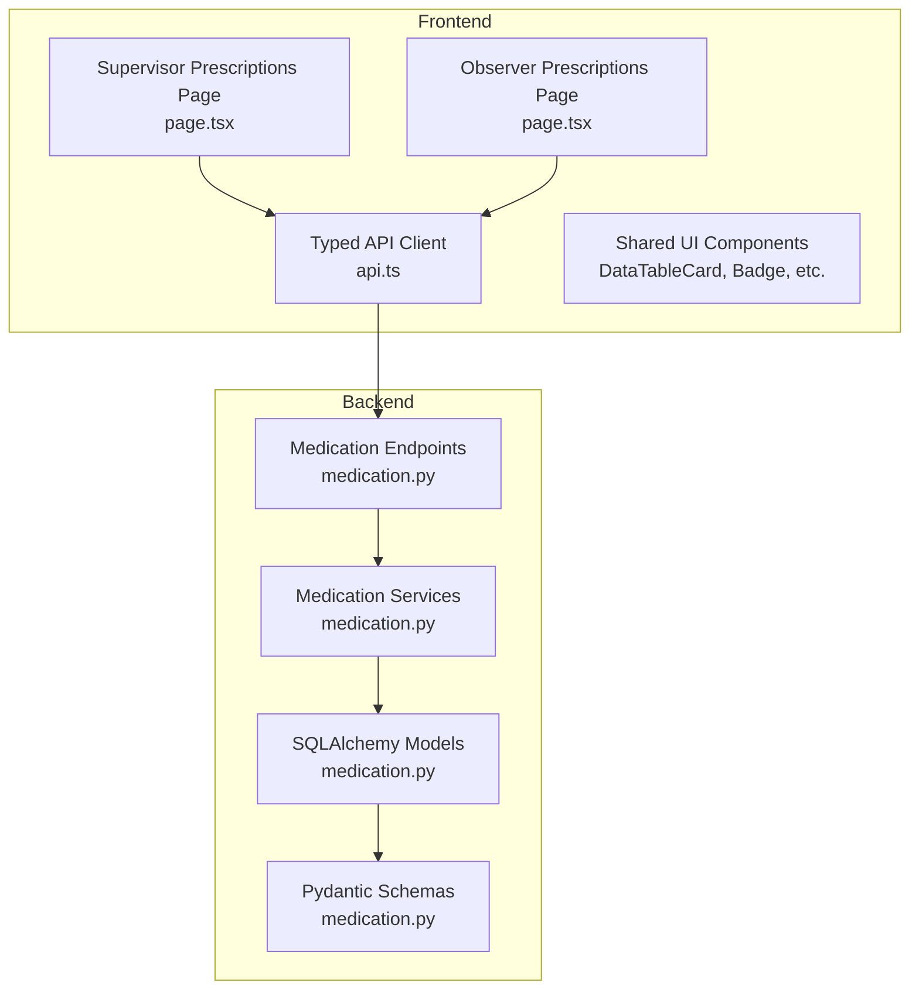
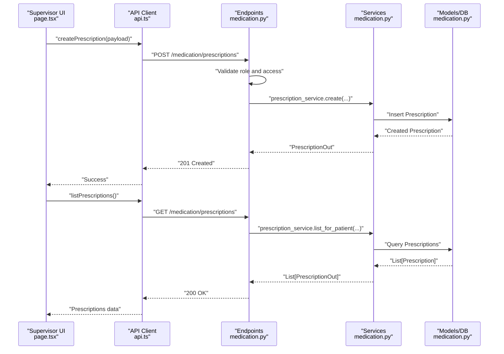
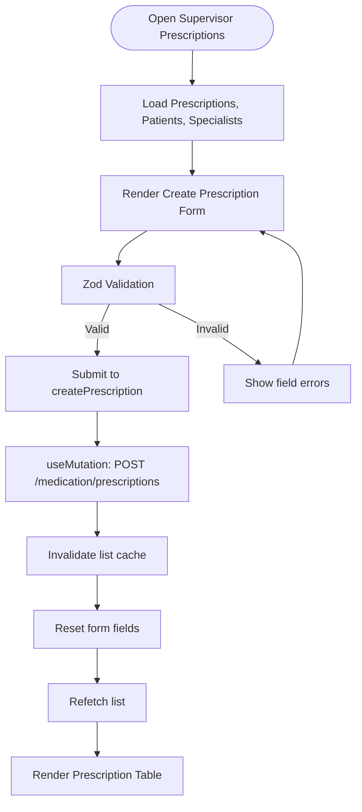
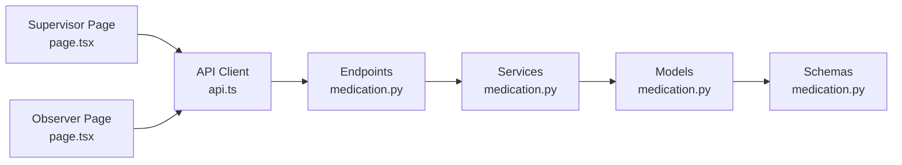

# Prescription & Medication Oversight

<cite>
**Referenced Files in This Document**
- [page.tsx](file://frontend/app/supervisor/prescriptions/page.tsx)
- [api.ts](file://frontend/lib/api.ts)
- [medication.py](file://server/app/api/endpoints/medication.py)
- [medication.py](file://server/app/models/medication.py)
- [medication.py](file://server/app/schemas/medication.py)
- [medication.py](file://server/app/services/medication.py)
- [page.tsx](file://frontend/app/observer/prescriptions/page.tsx)
- [page.tsx](file://frontend/app/admin/patients/[id]/page.tsx)
- [page.tsx](file://frontend/app/admin/patients/page.tsx)
- [page.tsx](file://frontend/app/head-nurse/staff/page.tsx)
- [page.tsx](file://frontend/app/observer/patients/page.tsx)
- [Supervisor-code-review.md](file://Code_Review/iter-2/Supervisor-code-review.md)
</cite>

## Table of Contents
1. [Introduction](#introduction)
2. [Project Structure](#project-structure)
3. [Core Components](#core-components)
4. [Architecture Overview](#architecture-overview)
5. [Detailed Component Analysis](#detailed-component-analysis)
6. [Dependency Analysis](#dependency-analysis)
7. [Performance Considerations](#performance-considerations)
8. [Troubleshooting Guide](#troubleshooting-guide)
9. [Conclusion](#conclusion)

## Introduction
This document describes the Prescription & Medication Oversight feature within the Supervisor Dashboard. It explains how supervisors manage prescriptions, track medication administration, coordinate with pharmacy workflows, and maintain medication safety and inventory oversight. The documentation covers the frontend interface for creating and reviewing prescriptions, backend APIs for managing prescriptions and pharmacy orders, and the supporting data models and services that enable robust medication oversight.

## Project Structure
The Prescription & Medication Oversight feature spans frontend and backend components:
- Frontend: Supervisor dashboard page for creating and listing prescriptions, and shared UI components for data presentation.
- Backend: FastAPI endpoints for listing, creating, updating prescriptions; listing, creating, and updating pharmacy orders; and related schemas and models.
- Shared: Typed API client methods and data models that define the contract between frontend and backend.

**Diagram sources**
- [page.tsx:66-324](file://frontend/app/supervisor/prescriptions/page.tsx#L66-L324)
- [page.tsx:29-49](file://frontend/app/observer/prescriptions/page.tsx#L29-L49)
- [api.ts:810-864](file://frontend/lib/api.ts#L810-L864)
- [medication.py:35-169](file://server/app/api/endpoints/medication.py#L35-L169)
- [medication.py:22-108](file://server/app/services/medication.py#L22-L108)
- [medication.py:10-54](file://server/app/models/medication.py#L10-L54)
- [medication.py:11-89](file://server/app/schemas/medication.py#L11-L89)

**Section sources**
- [Supervisor-code-review.md:9-26](file://Code_Review/iter-2/Supervisor-code-review.md#L9-L26)

## Core Components
- Supervisor Prescriptions Page: Provides a form to create new prescriptions and a table to list existing prescriptions with key attributes such as medication name, dosage, frequency, patient, specialist, status, and creation time.
- Typed API Client: Offers strongly typed methods for listing prescriptions, listing specialists, and creating prescriptions.
- Backend Endpoints: Expose GET/POST/PATCH endpoints for prescriptions and pharmacy orders with role-based access controls.
- Services and Models: Implement business logic for listing and creating prescriptions and pharmacy orders, backed by SQLAlchemy models and Pydantic schemas.

**Section sources**
- [page.tsx:66-324](file://frontend/app/supervisor/prescriptions/page.tsx#L66-L324)
- [api.ts:810-864](file://frontend/lib/api.ts#L810-L864)
- [medication.py:35-169](file://server/app/api/endpoints/medication.py#L35-L169)
- [medication.py:22-108](file://server/app/services/medication.py#L22-L108)
- [medication.py:10-54](file://server/app/models/medication.py#L10-L54)
- [medication.py:11-89](file://server/app/schemas/medication.py#L11-L89)

## Architecture Overview
The supervisor creates a prescription via the frontend form, which calls the typed API client to POST to the backend. The backend validates the request, enforces role-based access, persists the record, and returns the created resource. The supervisor can then view the newly created prescription in the list table. Observer and admin dashboards also consume the same endpoints to present relevant views.

**Diagram sources**
- [page.tsx:97-123](file://frontend/app/supervisor/prescriptions/page.tsx#L97-L123)
- [api.ts:860-864](file://frontend/lib/api.ts#L860-L864)
- [medication.py:58-73](file://server/app/api/endpoints/medication.py#L58-L73)
- [medication.py:22-44](file://server/app/services/medication.py#L22-L44)
- [medication.py:10-28](file://server/app/models/medication.py#L10-L28)

## Detailed Component Analysis

### Supervisor Prescriptions Page
- Purpose: Allow supervisors to create new prescriptions and review existing ones.
- Key UI elements:
  - Form fields: Patient, Specialist, Medication Name, Dosage, Frequency, Instructions.
  - Validation: Zod schema ensures required fields are present.
  - Submission: Mutation posts to create a new prescription and invalidates the list cache upon success.
  - Listing: Table displays medication name, dosage/frequency, patient, specialist, status, and timestamps.
- Data mapping: Converts backend responses to row objects and sorts by creation time.

**Diagram sources**
- [page.tsx:66-324](file://frontend/app/supervisor/prescriptions/page.tsx#L66-L324)

**Section sources**
- [page.tsx:36-123](file://frontend/app/supervisor/prescriptions/page.tsx#L36-L123)
- [page.tsx:125-201](file://frontend/app/supervisor/prescriptions/page.tsx#L125-L201)
- [page.tsx:207-324](file://frontend/app/supervisor/prescriptions/page.tsx#L207-L324)

### Observer Prescriptions Page
- Purpose: Provide observers with a read-only view of prescriptions and associated patient information.
- Features: Lists prescriptions with medication, dosage/frequency, patient, status, route, and creation time.

**Section sources**
- [page.tsx:29-49](file://frontend/app/observer/prescriptions/page.tsx#L29-L49)

### Typed API Client Methods
- Methods used by supervisor and observer dashboards:
  - listPrescriptions(params?): Returns a list of prescriptions with optional filters.
  - listSpecialists(params?): Returns a list of specialists.
  - createPrescription(payload): Creates a new prescription.
  - listPharmacyOrders(params?): Returns pharmacy orders filtered by patient, prescription, or status.
  - requestPharmacyOrder(payload): Allows a patient to request a pharmacy order.

**Section sources**
- [api.ts:810-864](file://frontend/lib/api.ts#L810-L864)
- [api.ts:854-858](file://frontend/lib/api.ts#L854-L858)

### Backend Endpoints: Prescriptions and Pharmacy Orders
- Prescriptions:
  - GET /medication/prescriptions: List with optional patient_id and status filters.
  - POST /medication/prescriptions: Create a new prescription (role-restricted).
  - PATCH /medication/prescriptions/{id}: Update an existing prescription (role-restricted).
- Pharmacy Orders:
  - GET /medication/pharmacy/orders: List orders with optional filters.
  - POST /medication/pharmacy/orders: Create an order (role-restricted).
  - POST /medication/pharmacy/orders/request: Patient requests an order.
  - PATCH /medication/pharmacy/orders/{id}: Update an order (role-restricted).

Access control:
- Prescriptions: Requires authenticated users; creation restricted to admin, head_nurse, supervisor.
- Pharmacy Orders: Similar role restrictions; patient requests require linking to a valid active prescription.

**Section sources**
- [medication.py:35-169](file://server/app/api/endpoints/medication.py#L35-L169)

### Services and Data Models
- PrescriptionService:
  - list_for_patient: Supports workspace-scoped queries, optional patient filter, status filter, visibility checks, and ordering by creation time.
- PharmacyOrderService:
  - list_orders: Supports workspace-scoped queries, optional patient, prescription, and status filters.
  - create_patient_request: Validates active prescription ownership and generates a unique order number before persisting.
- Models:
  - Prescription: Fields include identifiers, medication details, route, status, dates, and audit timestamps.
  - PharmacyOrder: Fields include identifiers, order number (unique per workspace), pharmacy name, quantities, status, timestamps, and notes.
- Schemas:
  - Strong typing for create/update operations and output models, including validation constraints and allowed statuses.

**Section sources**
- [medication.py:22-108](file://server/app/services/medication.py#L22-L108)
- [medication.py:10-54](file://server/app/models/medication.py#L10-L54)
- [medication.py:11-89](file://server/app/schemas/medication.py#L11-L89)

### Implementation of Prescription Management Components
- Medication Tracking Cards:
  - The supervisor page renders a table with medication name, dosage, frequency, patient, specialist, status, and timestamps. These serve as tracking cards for oversight.
- Prescription Status Indicators:
  - Status is part of the Prescription model and schema, allowing supervisors to filter and monitor active, paused, completed, or cancelled prescriptions.
- Pharmaceutical Workflow Tools:
  - The API supports listing and creating pharmacy orders, enabling coordination between prescriptions and pharmacy fulfillment.

**Section sources**
- [page.tsx:161-201](file://frontend/app/supervisor/prescriptions/page.tsx#L161-L201)
- [medication.py:11-47](file://server/app/schemas/medication.py#L11-L47)
- [medication.py:92-169](file://server/app/api/endpoints/medication.py#L92-L169)

### Features and Workflows
- Medication Reconciliation:
  - Use listPrescriptions with patient_id and status filters to reconcile active medications for a given patient.
- Prescription Approval Workflows:
  - Creation is role-restricted to authorized roles; updates can adjust status and details as needed.
- Medication Safety Monitoring:
  - Status transitions (active/paused/completed/cancelled) and date boundaries help supervisors monitor safety windows.
- Pharmaceutical Inventory Oversight:
  - Pharmacy orders can be listed and updated; unique order_number prevents duplication and supports tracking.

**Section sources**
- [medication.py:35-56](file://server/app/api/endpoints/medication.py#L35-L56)
- [medication.py:92-116](file://server/app/api/endpoints/medication.py#L92-L116)
- [medication.py:30-54](file://server/app/models/medication.py#L30-L54)

### Examples: Supervisor Prescription Workflows
- Create a new prescription:
  - Fill the form with patient, specialist, medication name, dosage, frequency, and optional instructions.
  - Submit to createPrescription; on success, the list refreshes automatically.
- Review and monitor:
  - Use the table to review recent prescriptions; leverage status and date filters to focus on active or expiring medications.
- Coordinate with pharmacy:
  - Use listPharmacyOrders to track fulfillment status and request new orders when needed.

**Section sources**
- [page.tsx:85-123](file://frontend/app/supervisor/prescriptions/page.tsx#L85-L123)
- [api.ts:810-864](file://frontend/lib/api.ts#L810-L864)

### Examples: Prescription Review Processes
- Observer review:
  - Access the observer prescriptions page to view all prescriptions with patient and status context.
- Admin patient records:
  - Admins can edit patient medications lists and cross-reference with supervisor-created prescriptions.

**Section sources**
- [page.tsx:29-49](file://frontend/app/observer/prescriptions/page.tsx#L29-L49)
- [page.tsx:471-497](file://frontend/app/admin/patients/[id]/page.tsx#L471-L497)
- [page.tsx:63-89](file://frontend/app/admin/patients/page.tsx#L63-L89)

### Examples: Medication Safety Protocols
- Status management:
  - Transition prescriptions to paused or completed to reflect safety decisions.
- Date boundaries:
  - Track start and end dates to prevent expired or future-dated medications from being dispensed.

**Section sources**
- [medication.py:11-22](file://server/app/schemas/medication.py#L11-L22)
- [medication.py:24-27](file://server/app/models/medication.py#L24-L27)

### Examples: Pharmaceutical Workflow Management Activities
- Request orders:
  - Patients can request pharmacy orders tied to their active prescriptions.
- Manage orders:
  - Supervisors and head nurses can update order status and track fulfillment.

**Section sources**
- [medication.py:131-152](file://server/app/api/endpoints/medication.py#L131-L152)
- [medication.py:155-169](file://server/app/api/endpoints/medication.py#L155-L169)

## Dependency Analysis
- Frontend depends on:
  - React Query for data fetching and caching.
  - Zod for form validation.
  - TanStack Table for rendering the prescription list.
  - Shared UI components for consistent presentation.
- Backend depends on:
  - SQLAlchemy for ORM and database operations.
  - Pydantic for request/response validation.
  - Role-based access control enforced by dependency functions.

**Diagram sources**
- [page.tsx:66-324](file://frontend/app/supervisor/prescriptions/page.tsx#L66-L324)
- [page.tsx:29-49](file://frontend/app/observer/prescriptions/page.tsx#L29-L49)
- [api.ts:810-864](file://frontend/lib/api.ts#L810-L864)
- [medication.py:35-169](file://server/app/api/endpoints/medication.py#L35-L169)
- [medication.py:22-108](file://server/app/services/medication.py#L22-L108)
- [medication.py:10-54](file://server/app/models/medication.py#L10-L54)
- [medication.py:11-89](file://server/app/schemas/medication.py#L11-L89)

**Section sources**
- [page.tsx:66-324](file://frontend/app/supervisor/prescriptions/page.tsx#L66-L324)
- [page.tsx:29-49](file://frontend/app/observer/prescriptions/page.tsx#L29-L49)
- [api.ts:810-864](file://frontend/lib/api.ts#L810-L864)
- [medication.py:35-169](file://server/app/api/endpoints/medication.py#L35-L169)

## Performance Considerations
- Pagination and limits: Backend endpoints specify reasonable limits for listing resources to avoid heavy queries.
- Caching: Frontend uses React Query to cache responses and invalidate on mutations.
- Sorting and filtering: Queries sort by creation timestamps and support filtering by status and patient to reduce payload sizes.

[No sources needed since this section provides general guidance]

## Troubleshooting Guide
- Unauthorized access:
  - Creating or updating prescriptions requires appropriate roles; ensure the current user has admin, head_nurse, or supervisor role.
- Validation errors:
  - Required fields must be provided; form validation messages indicate missing or invalid data.
- Network timeouts:
  - API client applies timeouts; retry after verifying network connectivity.
- Patient access:
  - Some endpoints enforce visibility checks; ensure the current user has access to the specified patient.

**Section sources**
- [medication.py:35-56](file://server/app/api/endpoints/medication.py#L35-L56)
- [medication.py:58-73](file://server/app/api/endpoints/medication.py#L58-L73)
- [api.ts:209-297](file://frontend/lib/api.ts#L209-L297)

## Conclusion
The Prescription & Medication Oversight feature integrates a supervisor-friendly interface for creating and reviewing prescriptions with robust backend APIs for managing prescriptions and pharmacy orders. The system supports medication reconciliation, safety monitoring via status and date controls, and workflow coordination with pharmacy services. The typed API client and shared UI components ensure consistent behavior across supervisor, observer, and admin dashboards.