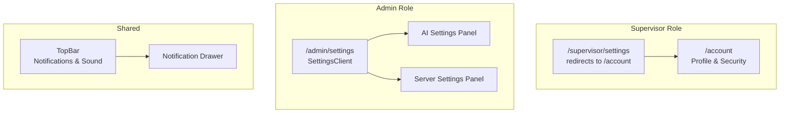
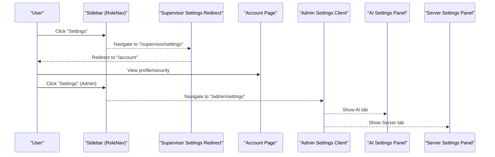
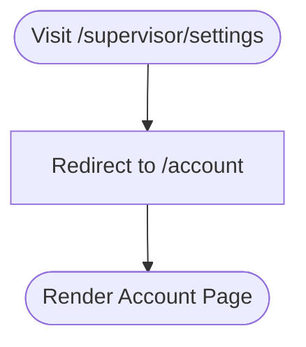
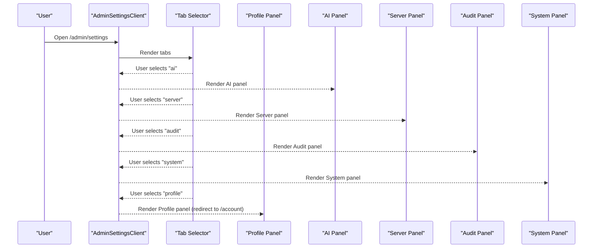
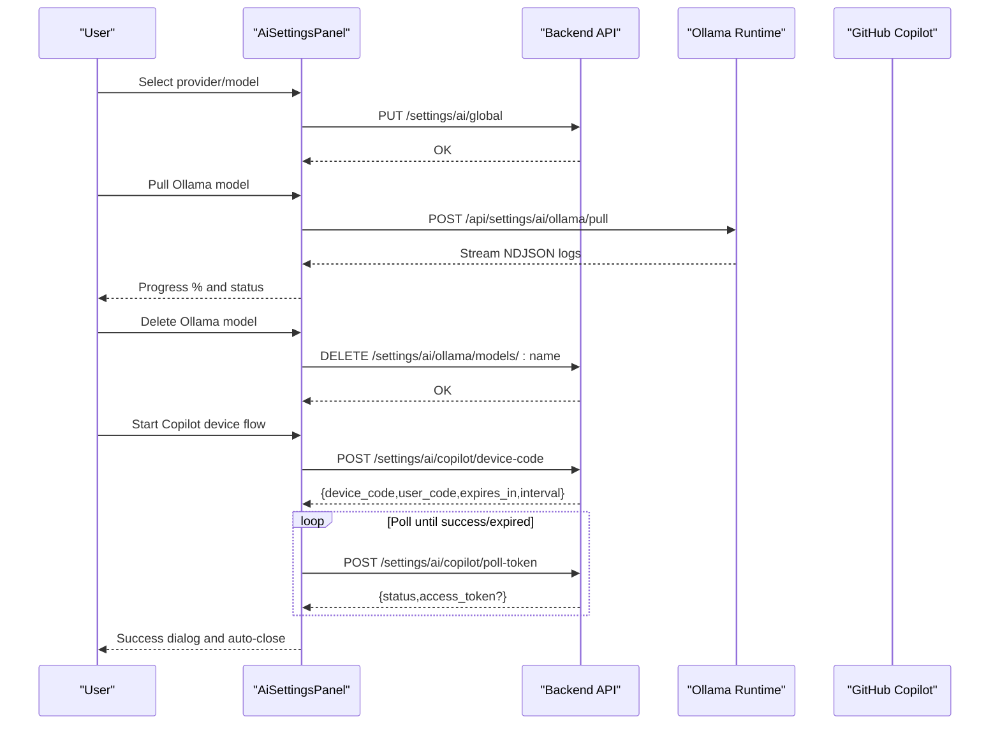
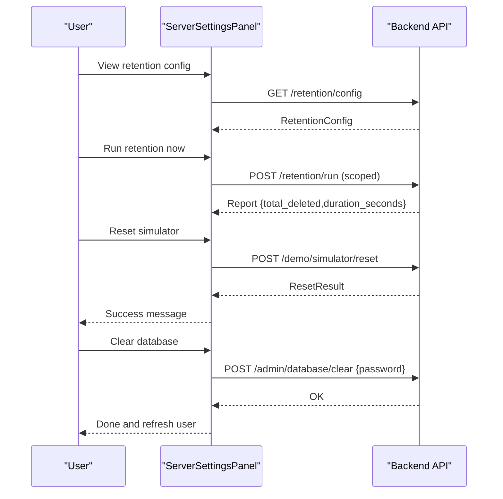
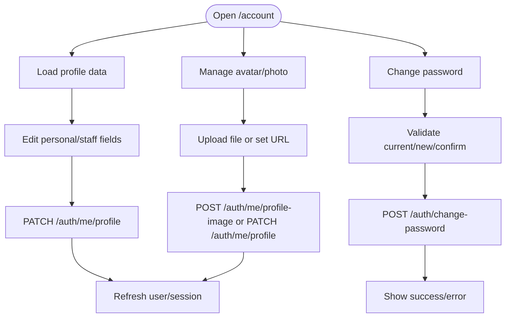
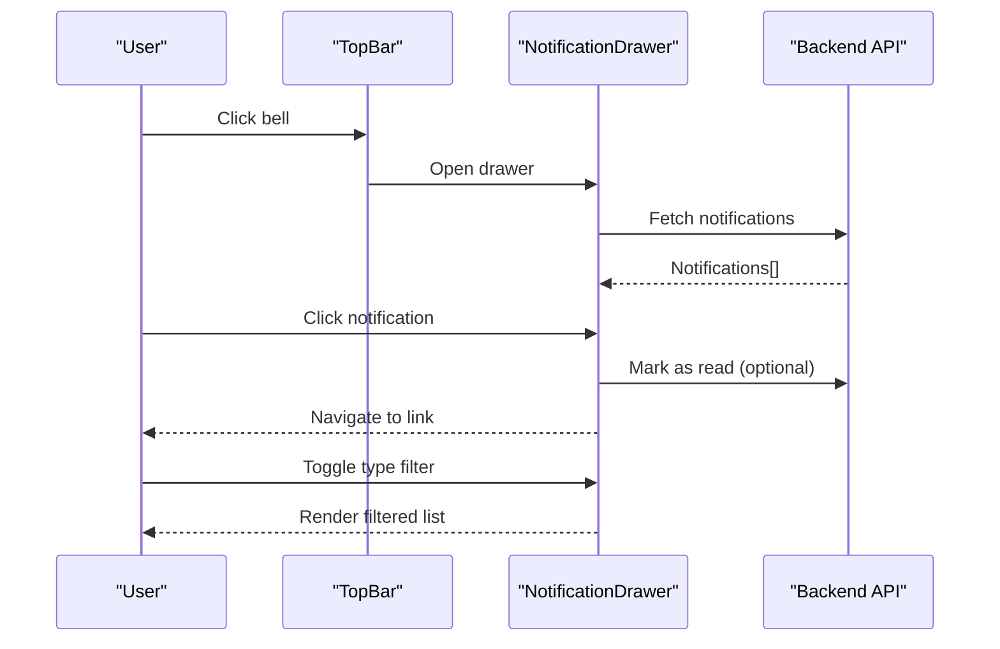
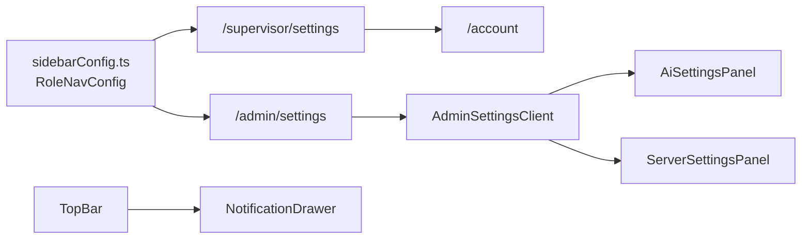

# Settings & Preferences

<cite>
**Referenced Files in This Document**
- [frontend/app/supervisor/settings/page.tsx](file://frontend/app/supervisor/settings/page.tsx)
- [frontend/app/admin/settings/page.tsx](file://frontend/app/admin/settings/page.tsx)
- [frontend/app/admin/settings/SettingsClient.tsx](file://frontend/app/admin/settings/SettingsClient.tsx)
- [frontend/components/admin/settings/AiSettingsPanel.tsx](file://frontend/components/admin/settings/AiSettingsPanel.tsx)
- [frontend/components/admin/settings/ServerSettingsPanel.tsx](file://frontend/components/admin/settings/ServerSettingsPanel.tsx)
- [frontend/app/account/page.tsx](file://frontend/app/account/page.tsx)
- [frontend/lib/sidebarConfig.ts](file://frontend/lib/sidebarConfig.ts)
- [frontend/components/TopBar.tsx](file://frontend/components/TopBar.tsx)
- [frontend/components/NotificationDrawer.tsx](file://frontend/components/NotificationDrawer.tsx)
</cite>

## Table of Contents
1. [Introduction](#introduction)
2. [Project Structure](#project-structure)
3. [Core Components](#core-components)
4. [Architecture Overview](#architecture-overview)
5. [Detailed Component Analysis](#detailed-component-analysis)
6. [Dependency Analysis](#dependency-analysis)
7. [Performance Considerations](#performance-considerations)
8. [Troubleshooting Guide](#troubleshooting-guide)
9. [Conclusion](#conclusion)

## Introduction
This document describes the Settings & Preferences feature in the Supervisor Dashboard. It focuses on the supervisor configuration interface, including system preferences, dashboard customization, and administrative settings management. It explains the implementation of settings components such as AI settings panels, server configuration panels, and user preference management. It also covers settings features such as dashboard customization options, notification preferences, role-specific configurations, and system integration settings. Finally, it includes practical supervisor settings workflows for dashboard personalization, notification configuration, role-specific customizations, and system integration management.

## Project Structure
The Settings & Preferences feature spans the frontend Next.js application and is organized by role and domain:
- Supervisor settings currently redirects to the account page for personal profile and security settings.
- Administrative settings are implemented under the admin role and include AI settings and server settings panels.
- User preference management is handled via the account page, including profile editing, avatar/photo management, and password changes.
- Notification preferences are integrated via the top bar and notification drawer.

**Diagram sources**
- [frontend/app/supervisor/settings/page.tsx:1-6](file://frontend/app/supervisor/settings/page.tsx#L1-L6)
- [frontend/app/admin/settings/page.tsx:1-19](file://frontend/app/admin/settings/page.tsx#L1-L19)
- [frontend/app/admin/settings/SettingsClient.tsx:1-114](file://frontend/app/admin/settings/SettingsClient.tsx#L1-L114)
- [frontend/components/admin/settings/AiSettingsPanel.tsx:1-1098](file://frontend/components/admin/settings/AiSettingsPanel.tsx#L1-L1098)
- [frontend/components/admin/settings/ServerSettingsPanel.tsx:1-405](file://frontend/components/admin/settings/ServerSettingsPanel.tsx#L1-L405)
- [frontend/app/account/page.tsx:1-810](file://frontend/app/account/page.tsx#L1-L810)
- [frontend/components/TopBar.tsx:132-158](file://frontend/components/TopBar.tsx#L132-L158)
- [frontend/components/NotificationDrawer.tsx:85-280](file://frontend/components/NotificationDrawer.tsx#L85-L280)

**Section sources**
- [frontend/app/supervisor/settings/page.tsx:1-6](file://frontend/app/supervisor/settings/page.tsx#L1-L6)
- [frontend/app/admin/settings/page.tsx:1-19](file://frontend/app/admin/settings/page.tsx#L1-L19)
- [frontend/app/admin/settings/SettingsClient.tsx:1-114](file://frontend/app/admin/settings/SettingsClient.tsx#L1-L114)
- [frontend/components/admin/settings/AiSettingsPanel.tsx:1-1098](file://frontend/components/admin/settings/AiSettingsPanel.tsx#L1-L1098)
- [frontend/components/admin/settings/ServerSettingsPanel.tsx:1-405](file://frontend/components/admin/settings/ServerSettingsPanel.tsx#L1-L405)
- [frontend/app/account/page.tsx:1-810](file://frontend/app/account/page.tsx#L1-L810)
- [frontend/components/TopBar.tsx:132-158](file://frontend/components/TopBar.tsx#L132-L158)
- [frontend/components/NotificationDrawer.tsx:85-280](file://frontend/components/NotificationDrawer.tsx#L85-L280)

## Core Components
- Supervisor Settings Redirect: The supervisor settings route redirects to the account page for personal profile and security settings.
- Admin Settings Client: Provides a tabbed settings UI with profile, AI, server, audit, and system tabs.
- AI Settings Panel: Manages AI runtime selection, provider/model defaults, Ollama model operations, and GitHub Copilot device flow.
- Server Settings Panel: Manages retention configuration, simulator controls, ML calibration access, and database clearing.
- Account Page: Central place for user profile editing, avatar/photo management, and password changes.
- Notification Integration: Top bar toggles notification drawer and sound preferences; drawer filters and displays notifications.

**Section sources**
- [frontend/app/supervisor/settings/page.tsx:1-6](file://frontend/app/supervisor/settings/page.tsx#L1-L6)
- [frontend/app/admin/settings/SettingsClient.tsx:1-114](file://frontend/app/admin/settings/SettingsClient.tsx#L1-L114)
- [frontend/components/admin/settings/AiSettingsPanel.tsx:1-1098](file://frontend/components/admin/settings/AiSettingsPanel.tsx#L1-L1098)
- [frontend/components/admin/settings/ServerSettingsPanel.tsx:1-405](file://frontend/components/admin/settings/ServerSettingsPanel.tsx#L1-L405)
- [frontend/app/account/page.tsx:1-810](file://frontend/app/account/page.tsx#L1-L810)
- [frontend/components/TopBar.tsx:132-158](file://frontend/components/TopBar.tsx#L132-L158)
- [frontend/components/NotificationDrawer.tsx:85-280](file://frontend/components/NotificationDrawer.tsx#L85-L280)

## Architecture Overview
The Settings & Preferences feature is structured around role-specific entry points and shared UI components:
- Supervisor role: settings link navigates to account page for personal preferences.
- Admin role: settings page aggregates multiple panels behind tabs.
- Shared: notification system integrates with top bar and drawer.

**Diagram sources**
- [frontend/lib/sidebarConfig.ts:160-196](file://frontend/lib/sidebarConfig.ts#L160-L196)
- [frontend/app/supervisor/settings/page.tsx:1-6](file://frontend/app/supervisor/settings/page.tsx#L1-L6)
- [frontend/app/admin/settings/page.tsx:1-19](file://frontend/app/admin/settings/page.tsx#L1-L19)
- [frontend/app/admin/settings/SettingsClient.tsx:1-114](file://frontend/app/admin/settings/SettingsClient.tsx#L1-L114)
- [frontend/components/admin/settings/AiSettingsPanel.tsx:1-1098](file://frontend/components/admin/settings/AiSettingsPanel.tsx#L1-L1098)
- [frontend/components/admin/settings/ServerSettingsPanel.tsx:1-405](file://frontend/components/admin/settings/ServerSettingsPanel.tsx#L1-L405)

## Detailed Component Analysis

### Supervisor Settings Redirect
- Purpose: Redirect supervisor role’s settings link to the account page for personal profile and security settings.
- Behavior: On visit, performs a server-side redirect to "/account".
- Impact: Ensures supervisor users access personal settings via the unified account page.

**Diagram sources**
- [frontend/app/supervisor/settings/page.tsx:1-6](file://frontend/app/supervisor/settings/page.tsx#L1-L6)

**Section sources**
- [frontend/app/supervisor/settings/page.tsx:1-6](file://frontend/app/supervisor/settings/page.tsx#L1-L6)

### Admin Settings Client
- Purpose: Hosts a tabbed settings UI for administrators.
- Tabs:
  - Profile: Redirects to account page for personal settings.
  - AI: Renders AI settings panel.
  - Server: Renders server settings panel.
  - Audit: Renders admin audit log page.
  - System: Renders ML calibration client.
- Navigation: Uses URL query parameter "tab" to switch panels without page reload.

**Diagram sources**
- [frontend/app/admin/settings/SettingsClient.tsx:1-114](file://frontend/app/admin/settings/SettingsClient.tsx#L1-L114)

**Section sources**
- [frontend/app/admin/settings/SettingsClient.tsx:1-114](file://frontend/app/admin/settings/SettingsClient.tsx#L1-L114)

### AI Settings Panel
- Purpose: Manage AI runtime provider and model defaults, and operate Ollama/Copilot integrations.
- Key features:
  - Runtime summary: shows current provider, model, and connectivity status.
  - Workspace defaults: choose provider and model for the workspace.
  - Ollama:
    - Pull models via streaming endpoint with progress and error reporting.
    - Delete models by name.
    - Display reachable origin and hints.
  - GitHub Copilot:
    - Device flow: initiate device code, poll token, handle slow down, expiration, denial, and backend errors.
    - Auto-close after success with delay.
    - Copy user code to clipboard.
- Data fetching: React Query queries for AI settings, Ollama models, Copilot status, and Copilot models with appropriate stale times and retries.

**Diagram sources**
- [frontend/components/admin/settings/AiSettingsPanel.tsx:1-1098](file://frontend/components/admin/settings/AiSettingsPanel.tsx#L1-L1098)

**Section sources**
- [frontend/components/admin/settings/AiSettingsPanel.tsx:1-1098](file://frontend/components/admin/settings/AiSettingsPanel.tsx#L1-L1098)

### Server Settings Panel
- Purpose: Manage server-side retention policies, simulator controls, and database maintenance.
- Key features:
  - Connection info: current workspace and API proxy routing.
  - Simulator: shows statistics and reset action when in simulator mode.
  - Retention: displays configured retention days and intervals, table counts, and allows manual run.
  - ML Calibration: link to ML calibration page.
  - Clear Database: requires password confirmation and triggers backend clear operation.
- Data fetching: Queries for retention config, retention stats scoped to workspace, workspaces list, and simulator status with polling and stale times.

**Diagram sources**
- [frontend/components/admin/settings/ServerSettingsPanel.tsx:1-405](file://frontend/components/admin/settings/ServerSettingsPanel.tsx#L1-L405)

**Section sources**
- [frontend/components/admin/settings/ServerSettingsPanel.tsx:1-405](file://frontend/components/admin/settings/ServerSettingsPanel.tsx#L1-L405)

### Account Page (User Preference Management)
- Purpose: Central place for user profile editing, avatar/photo management, and password changes.
- Features:
  - Personal profile: edit username, email, phone.
  - Staff profile (when linked): edit department, employee code, specialty, license, emergency contacts.
  - Avatar/photo: upload from device or set via URL; supports resizing and JPEG conversion; remove photo.
  - Password change: requires current password; enforces minimum length and confirmation.
- Data fetching and persistence: Uses API endpoints for profile retrieval, patching, image upload, and password change.

**Diagram sources**
- [frontend/app/account/page.tsx:1-810](file://frontend/app/account/page.tsx#L1-L810)

**Section sources**
- [frontend/app/account/page.tsx:1-810](file://frontend/app/account/page.tsx#L1-L810)

### Notification Preferences and Integration
- Top Bar:
  - Toggle notification drawer.
  - Control alert sound on/off; primes audio on user gesture.
- Notification Drawer:
  - Filter by type (alert, task, workflow_job, message).
  - Mark as read per notification.
  - Navigate to linked resource on click.
  - Show relative timestamps and unread indicators.

**Diagram sources**
- [frontend/components/TopBar.tsx:132-158](file://frontend/components/TopBar.tsx#L132-L158)
- [frontend/components/NotificationDrawer.tsx:85-280](file://frontend/components/NotificationDrawer.tsx#L85-L280)

**Section sources**
- [frontend/components/TopBar.tsx:132-158](file://frontend/components/TopBar.tsx#L132-L158)
- [frontend/components/NotificationDrawer.tsx:85-280](file://frontend/components/NotificationDrawer.tsx#L85-L280)

## Dependency Analysis
- Role navigation:
  - Supervisor role includes a "settings" nav item that redirects to "/account".
  - Admin role includes "settings" nav item leading to "/admin/settings".
- Settings client depends on:
  - AiSettingsPanel and ServerSettingsPanel for rendering.
  - Backend endpoints for data and mutations.
- Notification system:
  - TopBar toggles NotificationDrawer.
  - NotificationDrawer consumes notification data and exposes actions.

**Diagram sources**
- [frontend/lib/sidebarConfig.ts:160-196](file://frontend/lib/sidebarConfig.ts#L160-L196)
- [frontend/app/supervisor/settings/page.tsx:1-6](file://frontend/app/supervisor/settings/page.tsx#L1-L6)
- [frontend/app/admin/settings/page.tsx:1-19](file://frontend/app/admin/settings/page.tsx#L1-L19)
- [frontend/app/admin/settings/SettingsClient.tsx:1-114](file://frontend/app/admin/settings/SettingsClient.tsx#L1-L114)
- [frontend/components/admin/settings/AiSettingsPanel.tsx:1-1098](file://frontend/components/admin/settings/AiSettingsPanel.tsx#L1-L1098)
- [frontend/components/admin/settings/ServerSettingsPanel.tsx:1-405](file://frontend/components/admin/settings/ServerSettingsPanel.tsx#L1-L405)
- [frontend/components/TopBar.tsx:132-158](file://frontend/components/TopBar.tsx#L132-L158)
- [frontend/components/NotificationDrawer.tsx:85-280](file://frontend/components/NotificationDrawer.tsx#L85-L280)

**Section sources**
- [frontend/lib/sidebarConfig.ts:160-196](file://frontend/lib/sidebarConfig.ts#L160-L196)
- [frontend/app/admin/settings/SettingsClient.tsx:1-114](file://frontend/app/admin/settings/SettingsClient.tsx#L1-L114)

## Performance Considerations
- Query caching and polling:
  - AI and server settings panels use React Query with appropriate stale times and polling intervals to balance freshness and performance.
- Streaming operations:
  - Ollama pull uses a streaming endpoint; ensure efficient parsing and minimal re-renders while updating progress and logs.
- Notification filtering:
  - Client-side filtering reduces DOM updates; keep lists virtualized for large datasets.
- Redirects:
  - Supervisor settings redirect avoids unnecessary client-side navigation.

## Troubleshooting Guide
- AI Settings
  - Copilot device flow timeouts or errors: check backend device code endpoint and poll-token endpoint; ensure network connectivity and correct expiration handling.
  - Ollama pull failures: verify backend streaming endpoint and NDJSON parsing; confirm model name and network reachability.
- Server Settings
  - Retention run errors: validate workspace scoping and permissions; confirm backend retention worker availability.
  - Simulator reset: ensure simulator mode is active and backend reset endpoint responds.
  - Clear database: confirm password and user permissions; handle backend error messages.
- Account Page
  - Avatar upload errors: validate file type and size; ensure image processing pipeline succeeds.
  - Password change: enforce minimum length and confirmation; handle backend validation messages.
- Notifications
  - Drawer not opening: verify user authentication and notification fetch permissions.
  - Sound toggle not working: ensure audio priming on user gesture and browser policy compliance.

**Section sources**
- [frontend/components/admin/settings/AiSettingsPanel.tsx:1-1098](file://frontend/components/admin/settings/AiSettingsPanel.tsx#L1-L1098)
- [frontend/components/admin/settings/ServerSettingsPanel.tsx:1-405](file://frontend/components/admin/settings/ServerSettingsPanel.tsx#L1-L405)
- [frontend/app/account/page.tsx:1-810](file://frontend/app/account/page.tsx#L1-L810)
- [frontend/components/TopBar.tsx:132-158](file://frontend/components/TopBar.tsx#L132-L158)
- [frontend/components/NotificationDrawer.tsx:85-280](file://frontend/components/NotificationDrawer.tsx#L85-L280)

## Conclusion
The Settings & Preferences feature in the Supervisor Dashboard is designed around role-specific entry points and shared components. Supervisor settings redirect to the account page for personal profile and security settings, while administrative settings are consolidated under a tabbed interface with dedicated panels for AI and server configuration. User preference management is centralized in the account page, and notification preferences integrate seamlessly with the top bar and notification drawer. The implementation leverages React Query for data fetching, streaming APIs for long-running operations, and robust error handling to provide a reliable and responsive experience.