# Supervisor Dashboard

<cite>
**Referenced Files in This Document**
- [layout.tsx](file://frontend/app/supervisor/layout.tsx)
- [page.tsx](file://frontend/app/supervisor/page.tsx)
- [emergency/page.tsx](file://frontend/app/supervisor/emergency/page.tsx)
- [floorplans/page.tsx](file://frontend/app/supervisor/floorplans/page.tsx)
- [monitoring/page.tsx](file://frontend/app/supervisor/monitoring/page.tsx)
- [prescriptions/page.tsx](file://frontend/app/supervisor/prescriptions/page.tsx)
- [tasks/page.tsx](file://frontend/app/supervisor/tasks/page.tsx)
- [support/page.tsx](file://frontend/app/supervisor/support/page.tsx)
- [patients/[id]/page.tsx](file://frontend/app/supervisor/patients/[id]/page.tsx)
- [DataTableCard.tsx](file://frontend/components/supervisor/DataTableCard.tsx)
- [SummaryStatCard.tsx](file://frontend/components/supervisor/SummaryStatCard.tsx)
- [DashboardFloorplanPanel.tsx](file://frontend/components/dashboard/DashboardFloorplanPanel.tsx)
- [FloorplanRoleViewer.tsx](file://frontend/components/floorplan/FloorplanRoleViewer.tsx)
- [RoleShell.tsx](file://frontend/components/RoleShell.tsx)
- [RoleSidebar.tsx](file://frontend/components/RoleSidebar.tsx)
- [TopBar.tsx](file://frontend/components/TopBar.tsx)
- [api.ts](file://frontend/lib/api.ts)
- [routes.ts](file://frontend/lib/routes.ts)
- [sidebarConfig.ts](file://frontend/lib/sidebarConfig.ts)
- [useAlertRowHighlight.ts](file://frontend/hooks/useAlertRowHighlight.ts)
- [useAuth.tsx](file://frontend/hooks/useAuth.tsx)
- [useFixedNowMs.ts](file://frontend/hooks/useFixedNowMs.ts)
- [datetime.ts](file://frontend/lib/datetime.ts)
- [i18n.tsx](file://frontend/lib/i18n.tsx)
- [patientRoomQuickInfo.ts](file://frontend/lib/patientRoomQuickInfo.ts)
- [types.ts](file://frontend/lib/types.ts)
</cite>

## Table of Contents
1. [Introduction](#introduction)
2. [Project Structure](#project-structure)
3. [Core Components](#core-components)
4. [Architecture Overview](#architecture-overview)
5. [Detailed Component Analysis](#detailed-component-analysis)
6. [Dependency Analysis](#dependency-analysis)
7. [Performance Considerations](#performance-considerations)
8. [Troubleshooting Guide](#troubleshooting-guide)
9. [Conclusion](#conclusion)
10. [Appendices](#appendices)

## Introduction
This document describes the Supervisor Dashboard interface in the WheelSense Platform. It focuses on the supervisor’s oversight role, covering emergency response coordination, patient monitoring, prescription management, task supervision, and facility oversight. It documents supervisor-specific navigation patterns, emergency response tools, and clinical supervision features. Implementation details include reusable data table cards, summary stat cards, and emergency response interfaces. The supervisor dashboard integrates real-time data via React Query, provides floorplan monitoring, supports patient tracking, manages prescriptions, supervises tasks, and coordinates support.

## Project Structure
The supervisor role surface is organized under the Next.js app router at frontend/app/supervisor. Pages are grouped by functional domain: dashboard overview, emergency response, floorplan monitoring, patient detail, prescriptions, tasks, and support. Shared UI components for supervisor dashboards reside under frontend/components/supervisor, while role shell and navigation are provided by shared components.

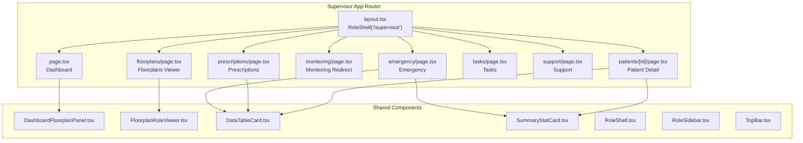

**Diagram sources**
- [layout.tsx:1-12](file://frontend/app/supervisor/layout.tsx#L1-L12)
- [page.tsx:1-394](file://frontend/app/supervisor/page.tsx#L1-L394)
- [emergency/page.tsx:1-441](file://frontend/app/supervisor/emergency/page.tsx#L1-L441)
- [floorplans/page.tsx:1-26](file://frontend/app/supervisor/floorplans/page.tsx#L1-L26)
- [monitoring/page.tsx:1-6](file://frontend/app/supervisor/monitoring/page.tsx#L1-L6)
- [prescriptions/page.tsx:1-326](file://frontend/app/supervisor/prescriptions/page.tsx#L1-L326)
- [tasks/page.tsx:1-138](file://frontend/app/supervisor/tasks/page.tsx#L1-L138)
- [support/page.tsx:1-6](file://frontend/app/supervisor/support/page.tsx#L1-L6)
- [patients/[id]/page.tsx](file://frontend/app/supervisor/patients/[id]/page.tsx#L1-L570)
- [DashboardFloorplanPanel.tsx](file://frontend/components/dashboard/DashboardFloorplanPanel.tsx)
- [FloorplanRoleViewer.tsx](file://frontend/components/floorplan/FloorplanRoleViewer.tsx)
- [DataTableCard.tsx:1-167](file://frontend/components/supervisor/DataTableCard.tsx#L1-L167)
- [SummaryStatCard.tsx:1-39](file://frontend/components/supervisor/SummaryStatCard.tsx#L1-L39)
- [RoleShell.tsx](file://frontend/components/RoleShell.tsx)
- [RoleSidebar.tsx](file://frontend/components/RoleSidebar.tsx)
- [TopBar.tsx](file://frontend/components/TopBar.tsx)

**Section sources**
- [layout.tsx:1-12](file://frontend/app/supervisor/layout.tsx#L1-L12)
- [page.tsx:1-394](file://frontend/app/supervisor/page.tsx#L1-L394)
- [emergency/page.tsx:1-441](file://frontend/app/supervisor/emergency/page.tsx#L1-L441)
- [floorplans/page.tsx:1-26](file://frontend/app/supervisor/floorplans/page.tsx#L1-L26)
- [monitoring/page.tsx:1-6](file://frontend/app/supervisor/monitoring/page.tsx#L1-L6)
- [prescriptions/page.tsx:1-326](file://frontend/app/supervisor/prescriptions/page.tsx#L1-L326)
- [tasks/page.tsx:1-138](file://frontend/app/supervisor/tasks/page.tsx#L1-L138)
- [support/page.tsx:1-6](file://frontend/app/supervisor/support/page.tsx#L1-L6)
- [patients/[id]/page.tsx](file://frontend/app/supervisor/patients/[id]/page.tsx#L1-L570)

## Core Components
- Dashboard overview: Real-time stats, directive acknowledgments, and task queue.
- Emergency response: Active alerts, room occupancy, and localization feed.
- Floorplan monitoring: Live zone overview with presence.
- Patient detail: Vitals, alerts, tasks, and directives per patient.
- Prescriptions: Create and list prescriptions with patient and specialist linkage.
- Tasks: Kanban board for viewing and executing assigned tasks.
- Support: Issue reporting form.

Key reusable components:
- DataTableCard: Paginated, sortable table container with loading and empty states.
- SummaryStatCard: Compact stat cards with icon and tone-based styling.

**Section sources**
- [page.tsx:177-390](file://frontend/app/supervisor/page.tsx#L177-L390)
- [emergency/page.tsx:382-438](file://frontend/app/supervisor/emergency/page.tsx#L382-L438)
- [floorplans/page.tsx:7-24](file://frontend/app/supervisor/floorplans/page.tsx#L7-L24)
- [patients/[id]/page.tsx](file://frontend/app/supervisor/patients/[id]/page.tsx#L496-L557)
- [prescriptions/page.tsx:207-322](file://frontend/app/supervisor/prescriptions/page.tsx#L207-L322)
- [tasks/page.tsx:23-137](file://frontend/app/supervisor/tasks/page.tsx#L23-L137)
- [support/page.tsx:1-6](file://frontend/app/supervisor/support/page.tsx#L1-L6)
- [DataTableCard.tsx:1-167](file://frontend/components/supervisor/DataTableCard.tsx#L1-L167)
- [SummaryStatCard.tsx:1-39](file://frontend/components/supervisor/SummaryStatCard.tsx#L1-L39)

## Architecture Overview
The supervisor dashboard is a client-side Next.js app router application. Pages fetch data via React Query and render reusable UI components. Navigation is role-scoped through RoleShell, with sidebar and top bar providing contextual navigation and branding. Data access is centralized via api.ts, with translations handled by i18n.tsx.

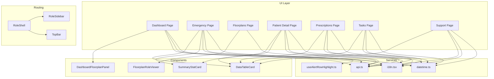

**Diagram sources**
- [page.tsx:1-394](file://frontend/app/supervisor/page.tsx#L1-L394)
- [emergency/page.tsx:1-441](file://frontend/app/supervisor/emergency/page.tsx#L1-L441)
- [floorplans/page.tsx:1-26](file://frontend/app/supervisor/floorplans/page.tsx#L1-L26)
- [patients/[id]/page.tsx](file://frontend/app/supervisor/patients/[id]/page.tsx#L1-L570)
- [prescriptions/page.tsx:1-326](file://frontend/app/supervisor/prescriptions/page.tsx#L1-L326)
- [tasks/page.tsx:1-138](file://frontend/app/supervisor/tasks/page.tsx#L1-L138)
- [support/page.tsx:1-6](file://frontend/app/supervisor/support/page.tsx#L1-L6)
- [DashboardFloorplanPanel.tsx](file://frontend/components/dashboard/DashboardFloorplanPanel.tsx)
- [FloorplanRoleViewer.tsx](file://frontend/components/floorplan/FloorplanRoleViewer.tsx)
- [DataTableCard.tsx:1-167](file://frontend/components/supervisor/DataTableCard.tsx#L1-L167)
- [SummaryStatCard.tsx:1-39](file://frontend/components/supervisor/SummaryStatCard.tsx#L1-L39)
- [api.ts](file://frontend/lib/api.ts)
- [i18n.tsx](file://frontend/lib/i18n.tsx)
- [datetime.ts](file://frontend/lib/datetime.ts)
- [useAlertRowHighlight.ts](file://frontend/hooks/useAlertRowHighlight.ts)
- [RoleShell.tsx](file://frontend/components/RoleShell.tsx)
- [RoleSidebar.tsx](file://frontend/components/RoleSidebar.tsx)
- [TopBar.tsx](file://frontend/components/TopBar.tsx)

## Detailed Component Analysis

### Supervisor Dashboard Overview
The dashboard aggregates critical oversight metrics and quick actions:
- Command badge and title/subtitle for role context
- Stats cards for critical alerts, open tasks, patients in zone, and active directives
- Zone map panel for floorplan overview
- Directive acknowledgments and task completion actions
- Navigation links to patients, tasks, and monitoring

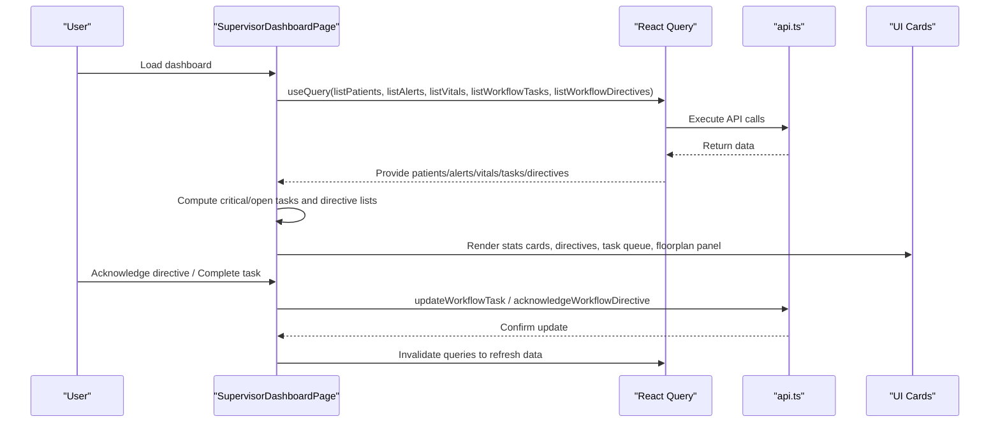

**Diagram sources**
- [page.tsx:41-141](file://frontend/app/supervisor/page.tsx#L41-L141)
- [api.ts](file://frontend/lib/api.ts)
- [DashboardFloorplanPanel.tsx](file://frontend/components/dashboard/DashboardFloorplanPanel.tsx)

**Section sources**
- [page.tsx:34-394](file://frontend/app/supervisor/page.tsx#L34-L394)

### Emergency Response Interface
The emergency page centralizes active alerts, room occupancy derived from localization predictions, and device localization feed:
- Summary stats for critical alerts, tracked devices, and rooms live
- Alert queue table with patient linkage and relative timestamps
- Room coverage table with occupancy counts, average confidence, and risk badges
- Localization feed sorted by confidence

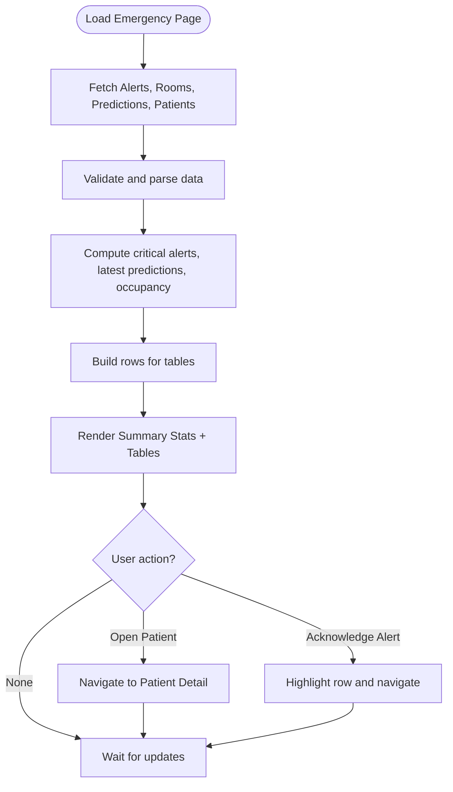

**Diagram sources**
- [emergency/page.tsx:68-438](file://frontend/app/supervisor/emergency/page.tsx#L68-L438)
- [useAlertRowHighlight.ts](file://frontend/hooks/useAlertRowHighlight.ts)
- [datetime.ts](file://frontend/lib/datetime.ts)

**Section sources**
- [emergency/page.tsx:1-441](file://frontend/app/supervisor/emergency/page.tsx#L1-L441)

### Floorplan Monitoring
The floorplan page displays a role-aware floorplan viewer with live presence indicators, enabling supervisors to oversee zones and readiness.

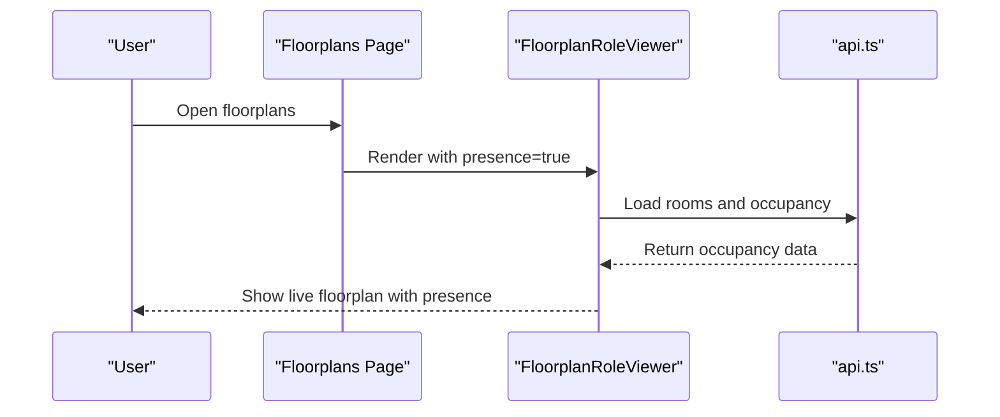

**Diagram sources**
- [floorplans/page.tsx:7-24](file://frontend/app/supervisor/floorplans/page.tsx#L7-L24)
- [FloorplanRoleViewer.tsx](file://frontend/components/floorplan/FloorplanRoleViewer.tsx)

**Section sources**
- [floorplans/page.tsx:1-26](file://frontend/app/supervisor/floorplans/page.tsx#L1-L26)

### Patient Detail and Clinical Supervision
The patient detail page consolidates vitals, alerts, tasks, and directives for a selected patient:
- Patient header with demographics, room, and status badges
- Summary stats for active alerts, critical alerts, recent vitals, and open tasks
- Tables for vitals, alerts, tasks, and directives with sorting and actions
- Task completion and directive acknowledgment actions

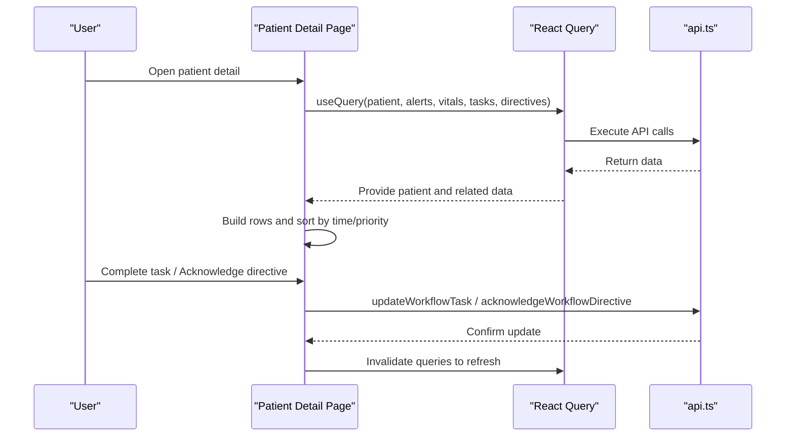

**Diagram sources**
- [patients/[id]/page.tsx](file://frontend/app/supervisor/patients/[id]/page.tsx#L65-L557)
- [api.ts](file://frontend/lib/api.ts)
- [datetime.ts](file://frontend/lib/datetime.ts)
- [patientRoomQuickInfo.ts](file://frontend/lib/patientRoomQuickInfo.ts)
- [types.ts](file://frontend/lib/types.ts)

**Section sources**
- [patients/[id]/page.tsx](file://frontend/app/supervisor/patients/[id]/page.tsx#L1-L570)

### Prescription Management
The prescriptions page enables supervisors to create and review prescriptions:
- Form with patient and optional specialist selection, medication details, and instructions
- Submission via createPrescription mutation with validation
- List table of prescriptions sorted by creation time with patient and status

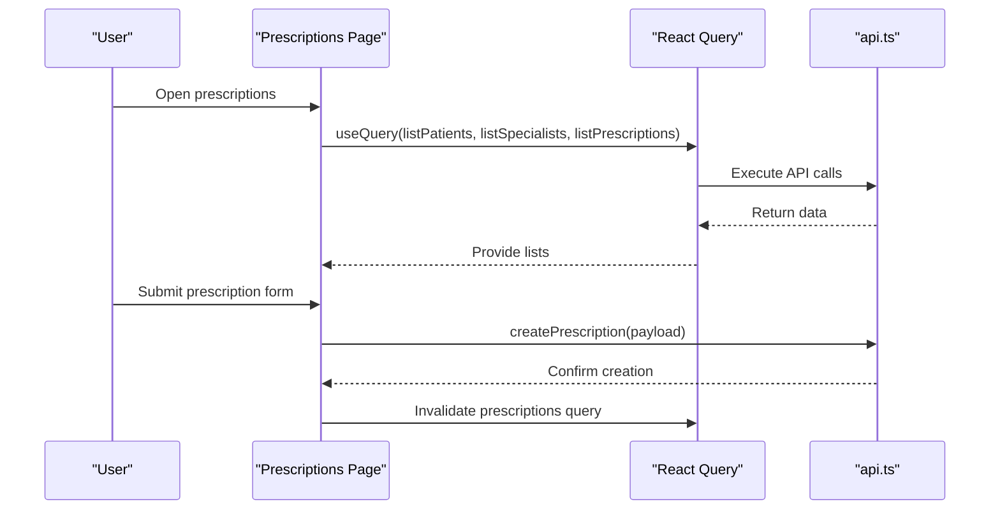

**Diagram sources**
- [prescriptions/page.tsx:66-322](file://frontend/app/supervisor/prescriptions/page.tsx#L66-L322)
- [api.ts](file://frontend/lib/api.ts)

**Section sources**
- [prescriptions/page.tsx:1-326](file://frontend/app/supervisor/prescriptions/page.tsx#L1-L326)

### Task Supervision
The tasks page presents a unified kanban board for viewing and executing tasks assigned to the supervisor:
- View mode toggle between kanban and calendar
- Command bar for task statistics
- Task detail modal with execution controls
- Status updates via updateTask mutation

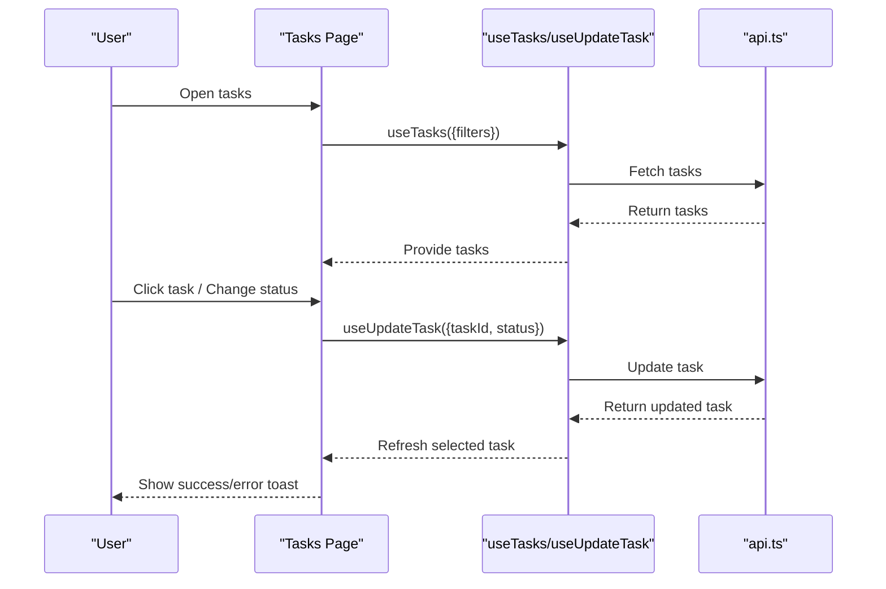

**Diagram sources**
- [tasks/page.tsx:23-137](file://frontend/app/supervisor/tasks/page.tsx#L23-L137)
- [useAuth.tsx](file://frontend/hooks/useAuth.tsx)

**Section sources**
- [tasks/page.tsx:1-138](file://frontend/app/supervisor/tasks/page.tsx#L1-L138)

### Support Coordination
The support page provides a form for reporting issues, enabling supervisors to coordinate support requests.

**Section sources**
- [support/page.tsx:1-6](file://frontend/app/supervisor/support/page.tsx#L1-L6)

### Reusable Components

#### DataTableCard
A flexible table container supporting:
- Sorting and pagination
- Loading state and empty text
- Right-slot for icons or actions
- Row ID and class customization for deep linking and highlighting

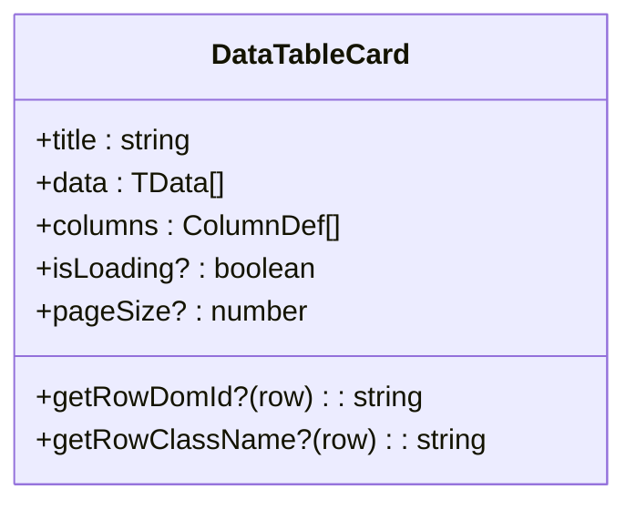

**Diagram sources**
- [DataTableCard.tsx:26-51](file://frontend/components/supervisor/DataTableCard.tsx#L26-L51)

**Section sources**
- [DataTableCard.tsx:1-167](file://frontend/components/supervisor/DataTableCard.tsx#L1-L167)

#### SummaryStatCard
A compact stat card with:
- Icon, label, numeric value, and tone (critical, warning, success, info)
- Consistent styling via tone class mapping

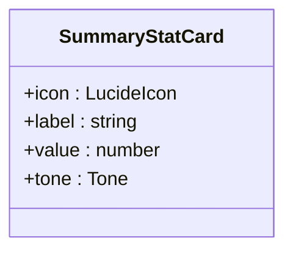

**Diagram sources**
- [SummaryStatCard.tsx:13-23](file://frontend/components/supervisor/SummaryStatCard.tsx#L13-L23)

**Section sources**
- [SummaryStatCard.tsx:1-39](file://frontend/components/supervisor/SummaryStatCard.tsx#L1-L39)

## Dependency Analysis
- Role routing: Supervisor pages are wrapped by RoleShell with appRoot="/supervisor".
- Navigation: RoleSidebar and TopBar provide role-scoped navigation and branding.
- Data fetching: All pages rely on React Query with API client from api.ts.
- Localization: Relative time formatting via datetime.ts.
- Highlighting: Emergency alert row highlighting via useAlertRowHighlight hook.
- Patient room quick info: patientRoomQuickInfo utility for room metadata.

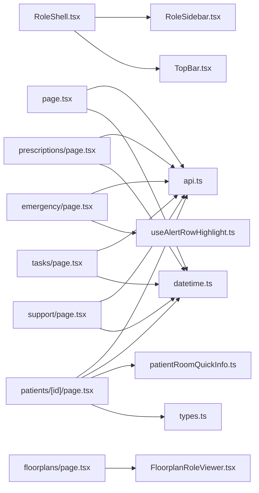

**Diagram sources**
- [layout.tsx:1-12](file://frontend/app/supervisor/layout.tsx#L1-L12)
- [RoleShell.tsx](file://frontend/components/RoleShell.tsx)
- [RoleSidebar.tsx](file://frontend/components/RoleSidebar.tsx)
- [TopBar.tsx](file://frontend/components/TopBar.tsx)
- [page.tsx:1-394](file://frontend/app/supervisor/page.tsx#L1-L394)
- [emergency/page.tsx:1-441](file://frontend/app/supervisor/emergency/page.tsx#L1-L441)
- [floorplans/page.tsx:1-26](file://frontend/app/supervisor/floorplans/page.tsx#L1-L26)
- [patients/[id]/page.tsx](file://frontend/app/supervisor/patients/[id]/page.tsx#L1-L570)
- [prescriptions/page.tsx:1-326](file://frontend/app/supervisor/prescriptions/page.tsx#L1-L326)
- [tasks/page.tsx:1-138](file://frontend/app/supervisor/tasks/page.tsx#L1-L138)
- [support/page.tsx:1-6](file://frontend/app/supervisor/support/page.tsx#L1-L6)
- [api.ts](file://frontend/lib/api.ts)
- [useAlertRowHighlight.ts](file://frontend/hooks/useAlertRowHighlight.ts)
- [datetime.ts](file://frontend/lib/datetime.ts)
- [patientRoomQuickInfo.ts](file://frontend/lib/patientRoomQuickInfo.ts)
- [types.ts](file://frontend/lib/types.ts)

**Section sources**
- [layout.tsx:1-12](file://frontend/app/supervisor/layout.tsx#L1-L12)
- [RoleShell.tsx](file://frontend/components/RoleShell.tsx)
- [RoleSidebar.tsx](file://frontend/components/RoleSidebar.tsx)
- [TopBar.tsx](file://frontend/components/TopBar.tsx)
- [page.tsx:1-394](file://frontend/app/supervisor/page.tsx#L1-L394)
- [emergency/page.tsx:1-441](file://frontend/app/supervisor/emergency/page.tsx#L1-L441)
- [floorplans/page.tsx:1-26](file://frontend/app/supervisor/floorplans/page.tsx#L1-L26)
- [patients/[id]/page.tsx](file://frontend/app/supervisor/patients/[id]/page.tsx#L1-L570)
- [prescriptions/page.tsx:1-326](file://frontend/app/supervisor/prescriptions/page.tsx#L1-L326)
- [tasks/page.tsx:1-138](file://frontend/app/supervisor/tasks/page.tsx#L1-L138)
- [support/page.tsx:1-6](file://frontend/app/supervisor/support/page.tsx#L1-L6)
- [api.ts](file://frontend/lib/api.ts)
- [useAlertRowHighlight.ts](file://frontend/hooks/useAlertRowHighlight.ts)
- [datetime.ts](file://frontend/lib/datetime.ts)
- [patientRoomQuickInfo.ts](file://frontend/lib/patientRoomQuickInfo.ts)
- [types.ts](file://frontend/lib/types.ts)

## Performance Considerations
- Efficient data fetching: Queries are scoped with keys and refetch intervals optimized for real-time dashboards (alerts and vitals).
- Memoization: useMemo is used to compute derived data (e.g., critical alerts, open tasks, occupancy) to avoid unnecessary recalculations.
- Pagination and sorting: DataTableCard provides built-in pagination and sorting to manage large datasets efficiently.
- Conditional rendering: Components render loading spinners and empty states to maintain responsiveness.
- Refetch invalidation: After mutations (task completion, directive acknowledgment), targeted query invalidation refreshes data.

[No sources needed since this section provides general guidance]

## Troubleshooting Guide
Common issues and resolutions:
- Invalid patient ID: Patient detail page validates the patient ID and shows an error state with a back-to-patients button.
- API errors on form submission: Prescription form captures ApiError and generic Error to display user-friendly messages.
- Highlighting emergency alerts: The emergency page uses a highlight hook to flash the row for a specific alert ID from URL parameters.
- Time formatting: Relative and absolute time formatting via datetime utilities ensures clarity across tables.

**Section sources**
- [patients/[id]/page.tsx](file://frontend/app/supervisor/patients/[id]/page.tsx#L443-L455)
- [prescriptions/page.tsx:60-64](file://frontend/app/supervisor/prescriptions/page.tsx#L60-L64)
- [emergency/page.tsx:361-373](file://frontend/app/supervisor/emergency/page.tsx#L361-L373)
- [datetime.ts](file://frontend/lib/datetime.ts)

## Conclusion
The Supervisor Dashboard in WheelSense Platform provides a comprehensive oversight interface integrating emergency response, patient monitoring, prescription management, task supervision, and facility oversight. Through role-scoped navigation, reusable data table cards, and summary stat cards, supervisors can monitor real-time conditions, coordinate directives and tasks, track patients, and manage prescriptions—all backed by robust data fetching and responsive UI components.

[No sources needed since this section summarizes without analyzing specific files]

## Appendices

### Supervisor Workflows

#### Emergency Incident Response
- Observe critical alerts and room risk indicators
- Navigate to patient detail from alert rows
- Acknowledge directives and mark tasks as completed
- Monitor localization feed and room occupancy for situational awareness

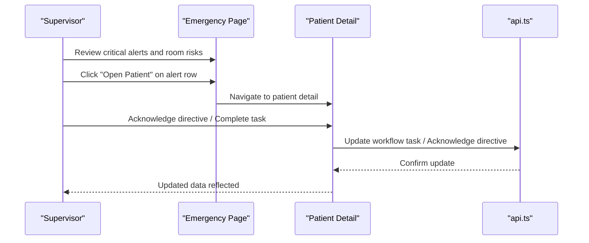

**Diagram sources**
- [emergency/page.tsx:274-281](file://frontend/app/supervisor/emergency/page.tsx#L274-L281)
- [patients/[id]/page.tsx](file://frontend/app/supervisor/patients/[id]/page.tsx#L406-L422)
- [api.ts](file://frontend/lib/api.ts)

#### Patient Care Supervision
- Access patient detail from dashboard or emergency views
- Review vitals, alerts, tasks, and directives
- Execute assigned tasks and acknowledge directives
- Track room and status badges for quick situational awareness

**Section sources**
- [patients/[id]/page.tsx](file://frontend/app/supervisor/patients/[id]/page.tsx#L1-L570)

#### Medication Oversight
- Create prescriptions with patient and optional specialist linkage
- Review prescription list sorted by creation time
- Ensure proper routing and instructions for safe administration

**Section sources**
- [prescriptions/page.tsx:66-322](file://frontend/app/supervisor/prescriptions/page.tsx#L66-L322)

#### Task Delegation and Execution
- View assigned tasks in kanban board
- Execute tasks and update statuses
- Use command bar for task statistics and filtering

**Section sources**
- [tasks/page.tsx:23-137](file://frontend/app/supervisor/tasks/page.tsx#L23-L137)

#### Facility Management Activities
- Use floorplan viewer to monitor live presence and readiness
- Coordinate support via issue reporting form
- Monitor dashboard stats for overall zone health

**Section sources**
- [floorplans/page.tsx:7-24](file://frontend/app/supervisor/floorplans/page.tsx#L7-L24)
- [support/page.tsx:1-6](file://frontend/app/supervisor/support/page.tsx#L1-L6)
- [page.tsx:177-256](file://frontend/app/supervisor/page.tsx#L177-L256)