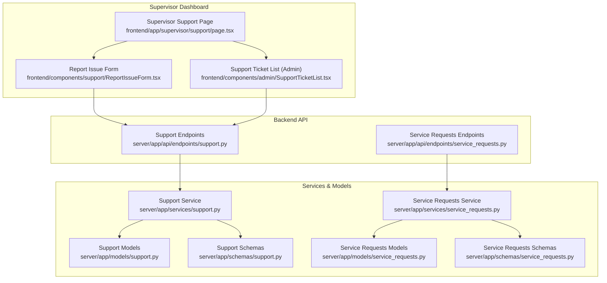
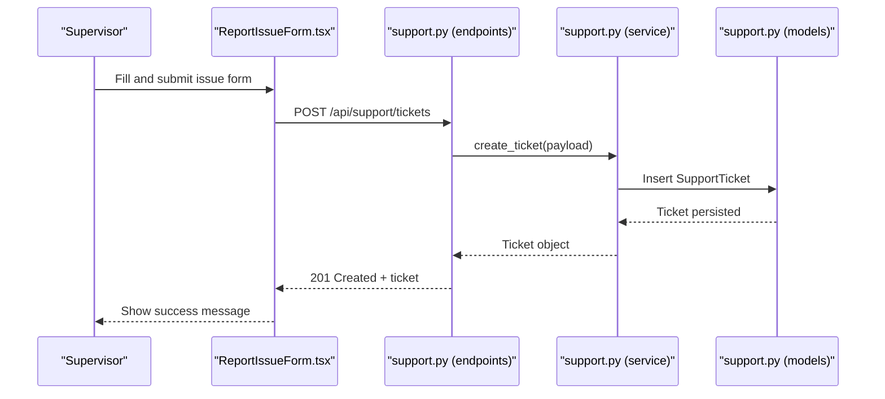
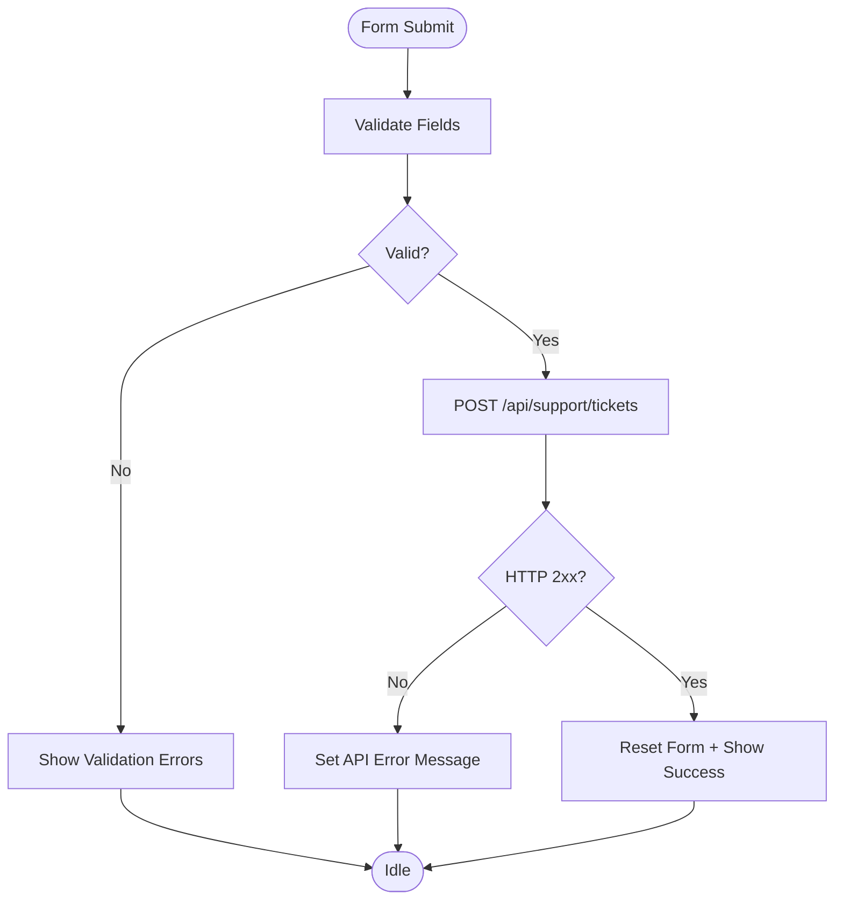
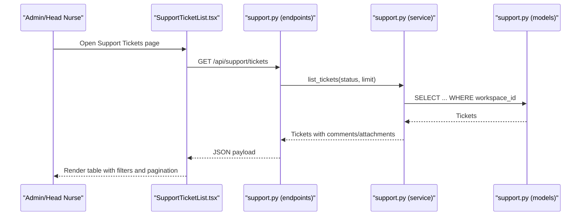
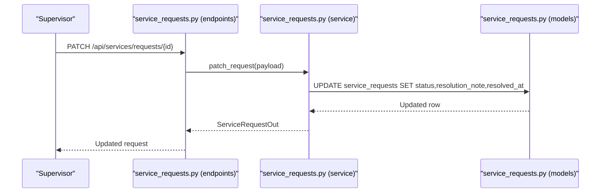
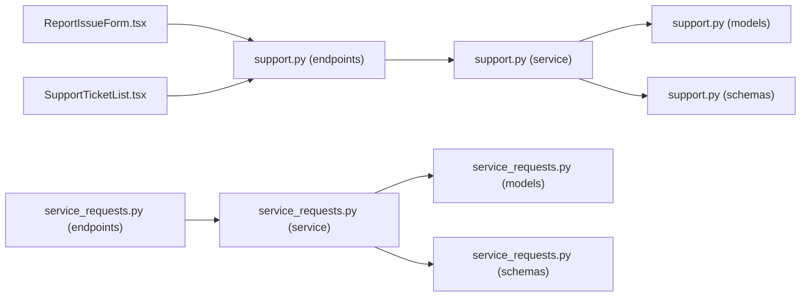

# Support & Resource Coordination

<cite>
**Referenced Files in This Document**
- [page.tsx](file://frontend/app/supervisor/support/page.tsx)
- [ReportIssueForm.tsx](file://frontend/components/support/ReportIssueForm.tsx)
- [SupportTicketList.tsx](file://frontend/components/admin/SupportTicketList.tsx)
- [support.py](file://server/app/api/endpoints/support.py)
- [service_requests.py](file://server/app/api/endpoints/service_requests.py)
- [support.py (models)](file://server/app/models/support.py)
- [support.py (schemas)](file://server/app/schemas/support.py)
- [support.py (service)](file://server/app/services/support.py)
- [service_requests.py (models)](file://server/app/models/service_requests.py)
- [service_requests.py (schemas)](file://server/app/schemas/service_requests.py)
- [service_requests.py (service)](file://server/app/services/service_requests.py)
- [layout.tsx](file://frontend/app/supervisor/layout.tsx)
- [routes.ts](file://frontend/lib/routes.ts)
</cite>

## Table of Contents
1. [Introduction](#introduction)
2. [Project Structure](#project-structure)
3. [Core Components](#core-components)
4. [Architecture Overview](#architecture-overview)
5. [Detailed Component Analysis](#detailed-component-analysis)
6. [Dependency Analysis](#dependency-analysis)
7. [Performance Considerations](#performance-considerations)
8. [Troubleshooting Guide](#troubleshooting-guide)
9. [Conclusion](#conclusion)

## Introduction
This document describes the Support & Resource Coordination feature in the Supervisor Dashboard. It covers the supervisor-facing issue reporting interface, the administrative support ticket oversight tools, and the integration points with service request management. The goal is to explain how supervisors can report issues, track support tickets, coordinate maintenance and service requests, and oversee resource allocation activities through the dashboard.

## Project Structure
The Support & Resource Coordination feature spans frontend pages and components, and backend API endpoints, services, and models. The supervisor’s support page renders a focused issue reporting form. Administrative oversight is provided via a support ticket list table. Service requests (food, transport, housekeeping) are integrated into the broader resource coordination workflow.

**Diagram sources**
- [page.tsx:1-6](file://frontend/app/supervisor/support/page.tsx#L1-L6)
- [ReportIssueForm.tsx:1-201](file://frontend/components/support/ReportIssueForm.tsx#L1-L201)
- [SupportTicketList.tsx:1-331](file://frontend/components/admin/SupportTicketList.tsx#L1-L331)
- [support.py:1-170](file://server/app/api/endpoints/support.py#L1-L170)
- [service_requests.py:1-55](file://server/app/api/endpoints/service_requests.py#L1-L55)
- [support.py (service):1-292](file://server/app/services/support.py#L1-L292)
- [service_requests.py (service):1-200](file://server/app/services/service_requests.py#L1-L200)
- [support.py (models):1-98](file://server/app/models/support.py#L1-L98)
- [service_requests.py (models):1-45](file://server/app/models/service_requests.py#L1-L45)
- [support.py (schemas):1-76](file://server/app/schemas/support.py#L1-L76)
- [service_requests.py (schemas):1-39](file://server/app/schemas/service_requests.py#L1-L39)

**Section sources**
- [page.tsx:1-6](file://frontend/app/supervisor/support/page.tsx#L1-L6)
- [layout.tsx:1-12](file://frontend/app/supervisor/layout.tsx#L1-L12)
- [routes.ts:1-17](file://frontend/lib/routes.ts#L1-L17)

## Core Components
- Supervisor Issue Reporting Form
  - Purpose: Allow supervisors to quickly submit issues with title, description, category, and priority.
  - Key behaviors: Validation, submission to workspace-scoped endpoint, success feedback, and error handling.
  - Integration: Posts to backend support tickets endpoint scoped to the current workspace.

- Administrative Support Ticket Oversight
  - Purpose: Provide supervisors and admins with a searchable, filterable, sortable table of support tickets.
  - Key behaviors: Global search, status and priority filters, pagination, and click-to-open ticket detail.
  - Integration: Fetches tickets from backend and displays metadata with relative timestamps.

- Service Request Management Integration
  - Purpose: Enable supervisors to coordinate resources (food, transport, housekeeping) requested by patients.
  - Key behaviors: Listing requests by status and type, updating status and resolution notes (admin/head_nurse).
  - Integration: Backend endpoints expose list/create/update operations for service requests.

**Section sources**
- [ReportIssueForm.tsx:37-201](file://frontend/components/support/ReportIssueForm.tsx#L37-L201)
- [SupportTicketList.tsx:59-331](file://frontend/components/admin/SupportTicketList.tsx#L59-L331)
- [service_requests.py:17-55](file://server/app/api/endpoints/service_requests.py#L17-L55)

## Architecture Overview
The supervisor support workflow integrates frontend forms and tables with backend APIs, services, and persistence. The supervisor submits issues via a form that posts to the support tickets endpoint. Administrators and head nurses can manage tickets and comments/attachments. Service requests are coordinated alongside support tickets for resource allocation.

**Diagram sources**
- [ReportIssueForm.tsx:66-87](file://frontend/components/support/ReportIssueForm.tsx#L66-L87)
- [support.py:89-97](file://server/app/api/endpoints/support.py#L89-L97)
- [support.py (service):154-177](file://server/app/services/support.py#L154-L177)
- [support.py (models):10-42](file://server/app/models/support.py#L10-L42)

## Detailed Component Analysis

### Supervisor Issue Reporting Form
- Implementation highlights
  - Zod-based validation for title length, category, and priority.
  - Workspace-scoped endpoint construction to ensure tickets belong to the current workspace.
  - Controlled form state with react-hook-form and UI primitives for inputs and selects.
  - Submission handling with optimistic reset and error surface.

- Data model and schema alignment
  - Frontend form values map to backend create schema with category/priority enums and optional admin self-ticket flag.
  - Backend enforces minimum/maximum lengths and allowed values.

- Error handling and UX
  - Displays validation errors per field and generic API errors.
  - On success, shows a success card with ticket ID and guidance.

**Diagram sources**
- [ReportIssueForm.tsx:45-87](file://frontend/components/support/ReportIssueForm.tsx#L45-L87)
- [support.py (schemas):10-16](file://server/app/schemas/support.py#L10-L16)
- [support.py:89-97](file://server/app/api/endpoints/support.py#L89-L97)

**Section sources**
- [ReportIssueForm.tsx:37-201](file://frontend/components/support/ReportIssueForm.tsx#L37-L201)
- [support.py (schemas):10-16](file://server/app/schemas/support.py#L10-L16)
- [support.py:89-97](file://server/app/api/endpoints/support.py#L89-L97)

### Administrative Support Ticket Oversight
- Implementation highlights
  - TanStack Table for sorting, filtering, and pagination.
  - Filters: status, priority, and global text search across subject, body, and sender.
  - Status and priority badges with icons; relative and absolute timestamps.
  - Click-to-open ticket detail handler.

- Backend integration
  - Lists tickets with embedded comments and attachments.
  - Supports patching status and assignee for managers (admin/head_nurse).

**Diagram sources**
- [SupportTicketList.tsx:59-331](file://frontend/components/admin/SupportTicketList.tsx#L59-L331)
- [support.py:62-86](file://server/app/api/endpoints/support.py#L62-L86)
- [support.py (service):124-141](file://server/app/services/support.py#L124-L141)
- [support.py (models):10-42](file://server/app/models/support.py#L10-L42)

**Section sources**
- [SupportTicketList.tsx:59-331](file://frontend/components/admin/SupportTicketList.tsx#L59-L331)
- [support.py:62-86](file://server/app/api/endpoints/support.py#L62-L86)
- [support.py (service):124-152](file://server/app/services/support.py#L124-L152)

### Service Request Management Integration
- Implementation highlights
  - Supervisor can coordinate resources requested by patients (food, transport, housekeeping).
  - Listing supports filtering by status and service type.
  - Updating status and resolution notes is restricted to admin roles.

- Data model and schema
  - ServiceRequest includes patient linkage, requester, type, status, resolution note, and timestamps.

**Diagram sources**
- [service_requests.py:46-54](file://server/app/api/endpoints/service_requests.py#L46-L54)
- [service_requests.py (service):90-120](file://server/app/services/service_requests.py#L90-L120)
- [service_requests.py (models):10-45](file://server/app/models/service_requests.py#L10-L45)

**Section sources**
- [service_requests.py:17-55](file://server/app/api/endpoints/service_requests.py#L17-L55)
- [service_requests.py (service):56-120](file://server/app/services/service_requests.py#L56-L120)
- [service_requests.py (models):10-45](file://server/app/models/service_requests.py#L10-L45)
- [service_requests.py (schemas):14-39](file://server/app/schemas/service_requests.py#L14-L39)

## Dependency Analysis
- Frontend dependencies
  - Supervisor support page depends on the issue reporting form.
  - Support ticket list is a reusable admin component used for oversight.
  - Both components rely on shared UI primitives and internationalization hooks.

- Backend dependencies
  - Support endpoints depend on the support service, which encapsulates database operations and visibility rules.
  - Service request endpoints depend on the service layer for validation and persistence.
  - Models define the relational schema; schemas define request/response contracts.

**Diagram sources**
- [ReportIssueForm.tsx:1-201](file://frontend/components/support/ReportIssueForm.tsx#L1-L201)
- [SupportTicketList.tsx:1-331](file://frontend/components/admin/SupportTicketList.tsx#L1-L331)
- [support.py:1-170](file://server/app/api/endpoints/support.py#L1-L170)
- [service_requests.py:1-55](file://server/app/api/endpoints/service_requests.py#L1-L55)
- [support.py (service):1-292](file://server/app/services/support.py#L1-L292)
- [service_requests.py (service):1-200](file://server/app/services/service_requests.py#L1-L200)
- [support.py (models):1-98](file://server/app/models/support.py#L1-L98)
- [service_requests.py (models):1-45](file://server/app/models/service_requests.py#L1-L45)
- [support.py (schemas):1-76](file://server/app/schemas/support.py#L1-L76)
- [service_requests.py (schemas):1-39](file://server/app/schemas/service_requests.py#L1-L39)

**Section sources**
- [support.py:1-170](file://server/app/api/endpoints/support.py#L1-L170)
- [service_requests.py:1-55](file://server/app/api/endpoints/service_requests.py#L1-L55)
- [support.py (service):1-292](file://server/app/services/support.py#L1-L292)
- [service_requests.py (service):1-200](file://server/app/services/service_requests.py#L1-L200)

## Performance Considerations
- Pagination and limits
  - Support ticket listing enforces a maximum limit and orders by recency to keep queries efficient.
- Filtering and sorting
  - Client-side filtering in the admin ticket list is appropriate for moderate datasets; backend filtering is recommended for large volumes.
- Attachment handling
  - Backend enforces an 8 MB limit and stores files under a workspace-scoped directory to avoid collisions and simplify cleanup.

[No sources needed since this section provides general guidance]

## Troubleshooting Guide
- Issue reporting fails
  - Verify the workspace scope endpoint resolves and that the form passes validation.
  - Check for API errors surfaced by the form and review network responses.

- Cannot view or update tickets
  - Managers (admin/head_nurse) can update workflow fields; regular users can only see tickets they reported.
  - Ensure the user role and workspace context are correct.

- Service request updates denied
  - Only admin users can update service requests; verify the caller role and payload.

- Attachment issues
  - Confirm file size does not exceed the 8 MB limit and that the file exists on disk.

**Section sources**
- [ReportIssueForm.tsx:66-87](file://frontend/components/support/ReportIssueForm.tsx#L66-L87)
- [support.py (service):180-206](file://server/app/services/support.py#L180-L206)
- [support.py:111-121](file://server/app/api/endpoints/support.py#L111-L121)
- [service_requests.py:46-54](file://server/app/api/endpoints/service_requests.py#L46-L54)

## Conclusion
The Support & Resource Coordination feature provides supervisors with a streamlined way to report issues and oversee support tickets, while integrating with service request management for resource coordination. The frontend components are robustly validated and scoped to the current workspace, and the backend enforces role-based access and data integrity. Together, these components enable effective issue coordination, maintenance oversight, and service request management within the Supervisor Dashboard.