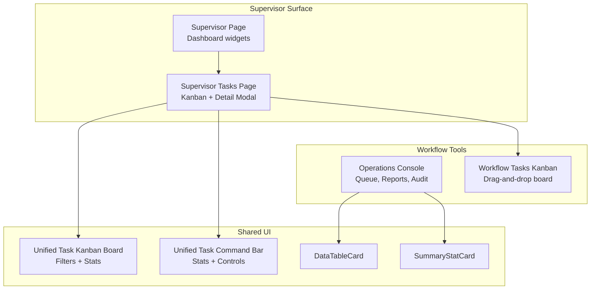
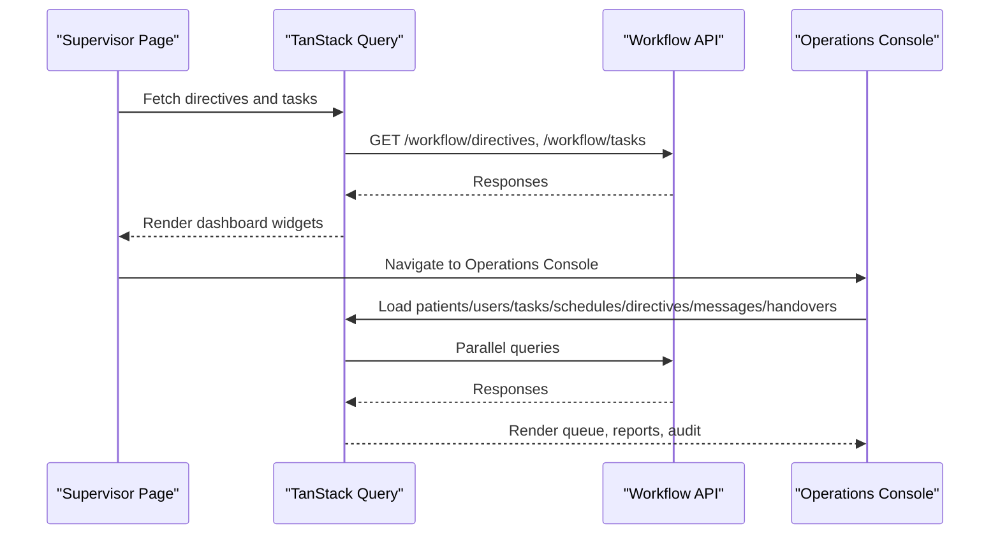
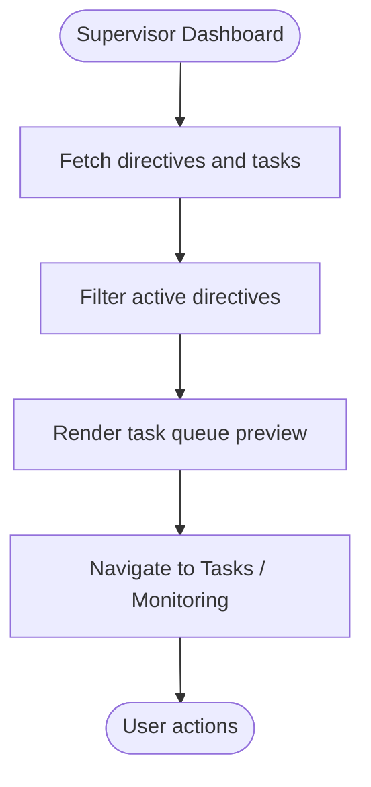
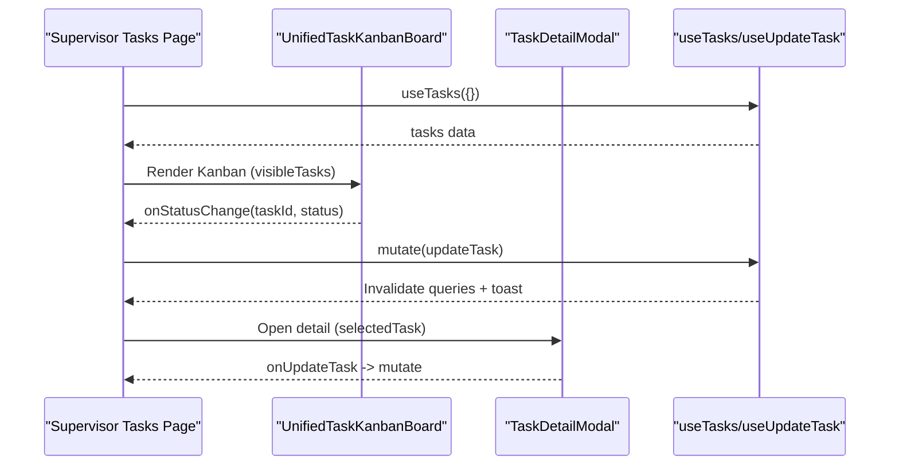
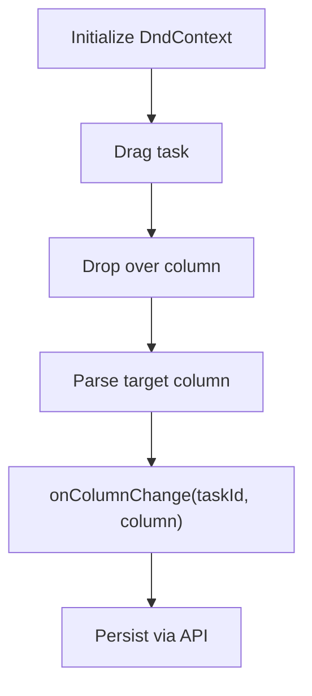
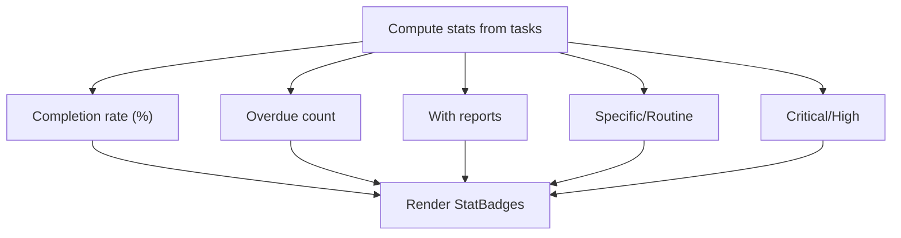
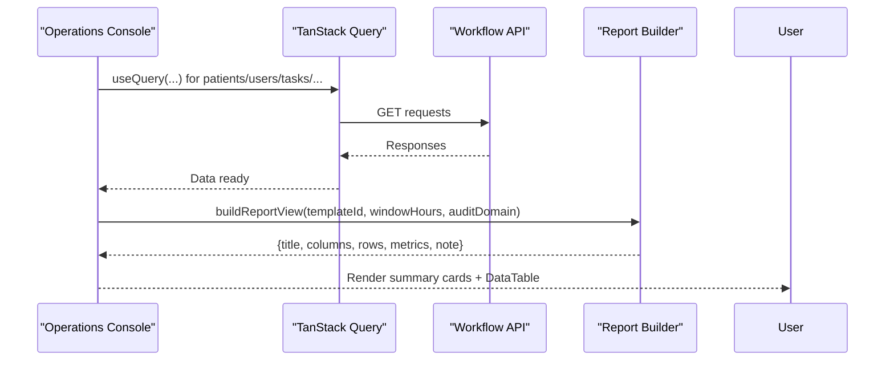
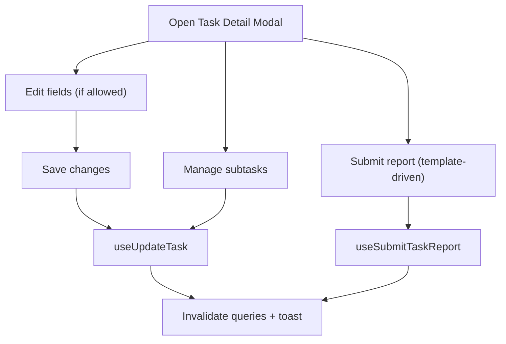
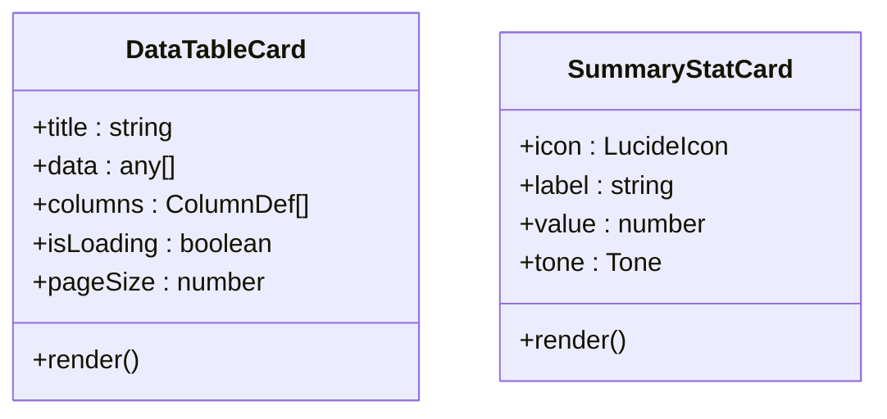
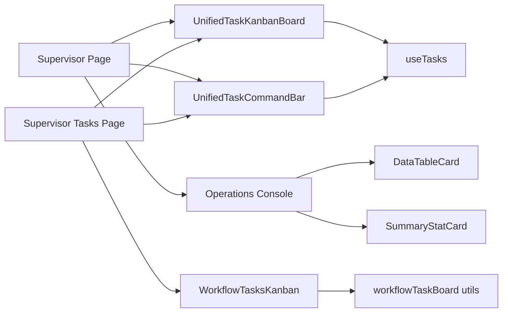

# Task Supervision & Workflow Oversight

<cite>
**Referenced Files in This Document**
- [frontend/app/supervisor/page.tsx](file://frontend/app/supervisor/page.tsx)
- [frontend/app/supervisor/tasks/page.tsx](file://frontend/app/supervisor/tasks/page.tsx)
- [frontend/components/workflow/OperationsConsole.tsx](file://frontend/components/workflow/OperationsConsole.tsx)
- [frontend/components/workflow/WorkflowTasksKanban.tsx](file://frontend/components/workflow/WorkflowTasksKanban.tsx)
- [frontend/components/head-nurse/tasks/UnifiedTaskKanbanBoard.tsx](file://frontend/components/head-nurse/tasks/UnifiedTaskKanbanBoard.tsx)
- [frontend/components/head-nurse/tasks/TaskDetailModal.tsx](file://frontend/components/head-nurse/tasks/TaskDetailModal.tsx)
- [frontend/components/head-nurse/tasks/UnifiedTaskCommandBar.tsx](file://frontend/components/head-nurse/tasks/UnifiedTaskCommandBar.tsx)
- [frontend/hooks/useTasks.ts](file://frontend/hooks/useTasks.ts)
- [frontend/lib/workflowTaskBoard.ts](file://frontend/lib/workflowTaskBoard.ts)
- [frontend/components/supervisor/DataTableCard.tsx](file://frontend/components/supervisor/DataTableCard.tsx)
- [frontend/components/supervisor/SummaryStatCard.tsx](file://frontend/components/supervisor/SummaryStatCard.tsx)
- [ARCHITECTURE.md](file://docs/ARCHITECTURE.md)
</cite>

## Table of Contents
1. [Introduction](#introduction)
2. [Project Structure](#project-structure)
3. [Core Components](#core-components)
4. [Architecture Overview](#architecture-overview)
5. [Detailed Component Analysis](#detailed-component-analysis)
6. [Dependency Analysis](#dependency-analysis)
7. [Performance Considerations](#performance-considerations)
8. [Troubleshooting Guide](#troubleshooting-guide)
9. [Conclusion](#conclusion)

## Introduction
This document describes the Task Supervision & Workflow Oversight feature in the Supervisor Dashboard. It explains how supervisors monitor and oversee workflows, manage task queues, track priorities and completion, and analyze operational performance. The documentation covers the workflow management interface, task oversight components, visualization tools, and practical supervisor workflows for delegation, performance monitoring, and optimization.

## Project Structure
The Supervisor Dashboard integrates several frontend components and pages:
- Supervisor landing page with quick task queue and directive highlights
- Supervisor Tasks page with Kanban board and detail modal
- Operations Console for advanced workflow oversight, reporting, and audit
- Shared visualization and summary components for statistics and tables

**Diagram sources**
- [frontend/app/supervisor/page.tsx:143-354](file://frontend/app/supervisor/page.tsx#L143-L354)
- [frontend/app/supervisor/tasks/page.tsx:23-137](file://frontend/app/supervisor/tasks/page.tsx#L23-L137)
- [frontend/components/workflow/OperationsConsole.tsx:681-800](file://frontend/components/workflow/OperationsConsole.tsx#L681-L800)
- [frontend/components/workflow/WorkflowTasksKanban.tsx:150-248](file://frontend/components/workflow/WorkflowTasksKanban.tsx#L150-L248)
- [frontend/components/head-nurse/tasks/UnifiedTaskKanbanBoard.tsx:289-557](file://frontend/components/head-nurse/tasks/UnifiedTaskKanbanBoard.tsx#L289-L557)
- [frontend/components/head-nurse/tasks/UnifiedTaskCommandBar.tsx:73-333](file://frontend/components/head-nurse/tasks/UnifiedTaskCommandBar.tsx#L73-L333)
- [frontend/components/supervisor/DataTableCard.tsx:40-167](file://frontend/components/supervisor/DataTableCard.tsx#L40-L167)
- [frontend/components/supervisor/SummaryStatCard.tsx:13-39](file://frontend/components/supervisor/SummaryStatCard.tsx#L13-L39)

**Section sources**
- [frontend/app/supervisor/page.tsx:143-354](file://frontend/app/supervisor/page.tsx#L143-L354)
- [frontend/app/supervisor/tasks/page.tsx:23-137](file://frontend/app/supervisor/tasks/page.tsx#L23-L137)

## Core Components
- Supervisor Dashboard page: displays active directives, task queue highlights, and navigation to tasks and monitoring.
- Supervisor Tasks page: read-only view of workspace tasks filtered by assignment; Kanban board with status quick-change; detail modal for reports and subtasks.
- Operations Console: comprehensive oversight with queue, transfer, coordination, audit, and reports tabs; generates summary metrics and downloadable reports.
- Workflow visualization: drag-and-drop Kanban board for workflow tasks with priority badges and due-date indicators.
- Command bar and statistics: completion rate, overdue counts, and breakdowns by task type and priority.
- Shared cards: summary metric cards and paginated data tables for robust reporting.

**Section sources**
- [frontend/app/supervisor/page.tsx:115-141](file://frontend/app/supervisor/page.tsx#L115-L141)
- [frontend/app/supervisor/tasks/page.tsx:23-137](file://frontend/app/supervisor/tasks/page.tsx#L23-L137)
- [frontend/components/workflow/OperationsConsole.tsx:681-800](file://frontend/components/workflow/OperationsConsole.tsx#L681-L800)
- [frontend/components/workflow/WorkflowTasksKanban.tsx:150-248](file://frontend/components/workflow/WorkflowTasksKanban.tsx#L150-L248)
- [frontend/components/head-nurse/tasks/UnifiedTaskCommandBar.tsx:73-333](file://frontend/components/head-nurse/tasks/UnifiedTaskCommandBar.tsx#L73-L333)
- [frontend/components/supervisor/DataTableCard.tsx:40-167](file://frontend/components/supervisor/DataTableCard.tsx#L40-L167)
- [frontend/components/supervisor/SummaryStatCard.tsx:13-39](file://frontend/components/supervisor/SummaryStatCard.tsx#L13-L39)

## Architecture Overview
The Supervisor Dashboard relies on:
- TanStack Query for data fetching and caching
- React components for UI composition
- Role-based authorization enforced by backend (frontend surfaces permitted actions)
- Centralized hooks for task CRUD and reporting
- Reusable visualization components for statistics and tables

**Diagram sources**
- [frontend/app/supervisor/page.tsx:115-141](file://frontend/app/supervisor/page.tsx#L115-L141)
- [frontend/components/workflow/OperationsConsole.tsx:763-800](file://frontend/components/workflow/OperationsConsole.tsx#L763-L800)

**Section sources**
- [ARCHITECTURE.md:249-251](file://docs/ARCHITECTURE.md#L249-L251)

## Detailed Component Analysis

### Supervisor Dashboard Page
- Displays active directives and task queue highlights.
- Provides navigation to tasks and monitoring.
- Uses mutations to acknowledge directives and mark tasks as completed.

**Diagram sources**
- [frontend/app/supervisor/page.tsx:115-141](file://frontend/app/supervisor/page.tsx#L115-L141)

**Section sources**
- [frontend/app/supervisor/page.tsx:143-354](file://frontend/app/supervisor/page.tsx#L143-L354)

### Supervisor Tasks Page
- Filters tasks to show only those assigned to the current supervisor or unassigned.
- Renders a Kanban board with status quick-change and detail modal.
- Supports calendar view toggle (placeholder).

**Diagram sources**
- [frontend/app/supervisor/tasks/page.tsx:23-137](file://frontend/app/supervisor/tasks/page.tsx#L23-L137)
- [frontend/components/head-nurse/tasks/UnifiedTaskKanbanBoard.tsx:289-557](file://frontend/components/head-nurse/tasks/UnifiedTaskKanbanBoard.tsx#L289-L557)
- [frontend/components/head-nurse/tasks/TaskDetailModal.tsx:185-338](file://frontend/components/head-nurse/tasks/TaskDetailModal.tsx#L185-L338)
- [frontend/hooks/useTasks.ts:23-93](file://frontend/hooks/useTasks.ts#L23-L93)

**Section sources**
- [frontend/app/supervisor/tasks/page.tsx:23-137](file://frontend/app/supervisor/tasks/page.tsx#L23-L137)
- [frontend/hooks/useTasks.ts:23-93](file://frontend/hooks/useTasks.ts#L23-L93)

### Workflow Tasks Kanban (Drag-and-Drop)
- Three-column board: pending, in_progress, completed.
- Draggable task cards with priority and due-date badges.
- Collision detection and drag end handler to move tasks between columns.

**Diagram sources**
- [frontend/components/workflow/WorkflowTasksKanban.tsx:150-248](file://frontend/components/workflow/WorkflowTasksKanban.tsx#L150-L248)
- [frontend/lib/workflowTaskBoard.ts:6-47](file://frontend/lib/workflowTaskBoard.ts#L6-L47)

**Section sources**
- [frontend/components/workflow/WorkflowTasksKanban.tsx:150-248](file://frontend/components/workflow/WorkflowTasksKanban.tsx#L150-L248)
- [frontend/lib/workflowTaskBoard.ts:6-47](file://frontend/lib/workflowTaskBoard.ts#L6-L47)

### Unified Task Command Bar
- Computes completion rate, overdue, with-reports, and breakdowns by task type and priority.
- Provides export and reset routines controls (head nurse/admin only).

**Diagram sources**
- [frontend/components/head-nurse/tasks/UnifiedTaskCommandBar.tsx:73-333](file://frontend/components/head-nurse/tasks/UnifiedTaskCommandBar.tsx#L73-L333)

**Section sources**
- [frontend/components/head-nurse/tasks/UnifiedTaskCommandBar.tsx:73-333](file://frontend/components/head-nurse/tasks/UnifiedTaskCommandBar.tsx#L73-L333)

### Operations Console
- Multi-tab interface: queue, transfer, coordination, audit, reports.
- Loads patients, users, tasks, schedules, directives, messages, and handovers.
- Generates reports (ward overview, alert summary, vitals window, handover notes, workflow audit) with metrics and CSV exports.

**Diagram sources**
- [frontend/components/workflow/OperationsConsole.tsx:681-800](file://frontend/components/workflow/OperationsConsole.tsx#L681-L800)
- [frontend/components/workflow/OperationsConsole.tsx:365-679](file://frontend/components/workflow/OperationsConsole.tsx#L365-L679)

**Section sources**
- [frontend/components/workflow/OperationsConsole.tsx:681-800](file://frontend/components/workflow/OperationsConsole.tsx#L681-L800)
- [frontend/components/workflow/OperationsConsole.tsx:365-679](file://frontend/components/workflow/OperationsConsole.tsx#L365-L679)

### Task Detail Modal
- Edits task fields (title, description, priority, status, due date) and manages subtasks.
- Submits task reports with dynamic templates and attachments.
- Integrates with update and submit report hooks.

**Diagram sources**
- [frontend/components/head-nurse/tasks/TaskDetailModal.tsx:185-338](file://frontend/components/head-nurse/tasks/TaskDetailModal.tsx#L185-L338)
- [frontend/hooks/useTasks.ts:114-132](file://frontend/hooks/useTasks.ts#L114-L132)

**Section sources**
- [frontend/components/head-nurse/tasks/TaskDetailModal.tsx:185-338](file://frontend/components/head-nurse/tasks/TaskDetailModal.tsx#L185-L338)
- [frontend/hooks/useTasks.ts:114-132](file://frontend/hooks/useTasks.ts#L114-L132)

### Shared Visualization Components
- DataTableCard: sortable, paginated table with loading and empty states.
- SummaryStatCard: colored metric cards with icons and tones.

**Diagram sources**
- [frontend/components/supervisor/DataTableCard.tsx:40-167](file://frontend/components/supervisor/DataTableCard.tsx#L40-L167)
- [frontend/components/supervisor/SummaryStatCard.tsx:13-39](file://frontend/components/supervisor/SummaryStatCard.tsx#L13-L39)

**Section sources**
- [frontend/components/supervisor/DataTableCard.tsx:40-167](file://frontend/components/supervisor/DataTableCard.tsx#L40-L167)
- [frontend/components/supervisor/SummaryStatCard.tsx:13-39](file://frontend/components/supervisor/SummaryStatCard.tsx#L13-L39)

## Dependency Analysis
- Supervisor Dashboard depends on TanStack Query for data and mutations.
- Task components share a unified Kanban board and command bar across roles.
- Workflow visualization uses a dedicated board library for drag-and-drop.
- Backend authorization determines workflow scope; frontend must not rely on client-only filtering.

**Diagram sources**
- [frontend/app/supervisor/page.tsx:143-354](file://frontend/app/supervisor/page.tsx#L143-L354)
- [frontend/app/supervisor/tasks/page.tsx:23-137](file://frontend/app/supervisor/tasks/page.tsx#L23-L137)
- [frontend/components/head-nurse/tasks/UnifiedTaskKanbanBoard.tsx:289-557](file://frontend/components/head-nurse/tasks/UnifiedTaskKanbanBoard.tsx#L289-L557)
- [frontend/components/head-nurse/tasks/UnifiedTaskCommandBar.tsx:73-333](file://frontend/components/head-nurse/tasks/UnifiedTaskCommandBar.tsx#L73-L333)
- [frontend/components/workflow/WorkflowTasksKanban.tsx:150-248](file://frontend/components/workflow/WorkflowTasksKanban.tsx#L150-L248)
- [frontend/components/workflow/OperationsConsole.tsx:681-800](file://frontend/components/workflow/OperationsConsole.tsx#L681-L800)
- [frontend/hooks/useTasks.ts:23-93](file://frontend/hooks/useTasks.ts#L23-L93)
- [frontend/lib/workflowTaskBoard.ts:6-47](file://frontend/lib/workflowTaskBoard.ts#L6-L47)

**Section sources**
- [ARCHITECTURE.md:249-251](file://docs/ARCHITECTURE.md#L249-L251)

## Performance Considerations
- Use paginated and sortable tables for large datasets.
- Debounce search and filter operations in Kanban views.
- Invalidate only affected query keys after mutations to minimize re-fetches.
- Lazy-load heavy report generation and CSV exports.
- Prefer client-side computed stats for small datasets; defer to server-side aggregation for large-scale analytics.

## Troubleshooting Guide
- Task updates fail: check toast feedback and verify backend authorization; ensure the current role has permission to modify tasks.
- Kanban drag-and-drop not working: verify draggable IDs and column parsing logic; confirm pending task sets are updated during persistence.
- Reports not appearing: ensure report submission hooks invalidate the correct query keys and that templates define required fields.
- Console refresh issues: use the built-in refresh button to invalidate cached data and reload panels.

**Section sources**
- [frontend/hooks/useTasks.ts:74-93](file://frontend/hooks/useTasks.ts#L74-L93)
- [frontend/components/workflow/WorkflowTasksKanban.tsx:178-189](file://frontend/components/workflow/WorkflowTasksKanban.tsx#L178-L189)
- [frontend/components/head-nurse/tasks/TaskDetailModal.tsx:322-338](file://frontend/components/head-nurse/tasks/TaskDetailModal.tsx#L322-L338)

## Conclusion
The Supervisor Dashboard provides a comprehensive toolkit for task supervision and workflow oversight. Through integrated Kanban boards, command bars, and the Operations Console, supervisors can monitor priorities, track completion, analyze performance, and optimize workflows. Shared visualization components ensure consistent reporting and efficient navigation across roles.