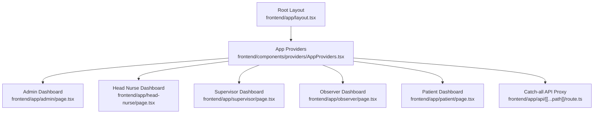
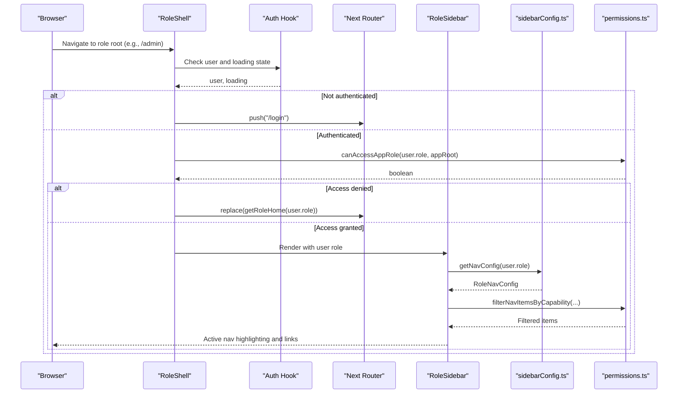
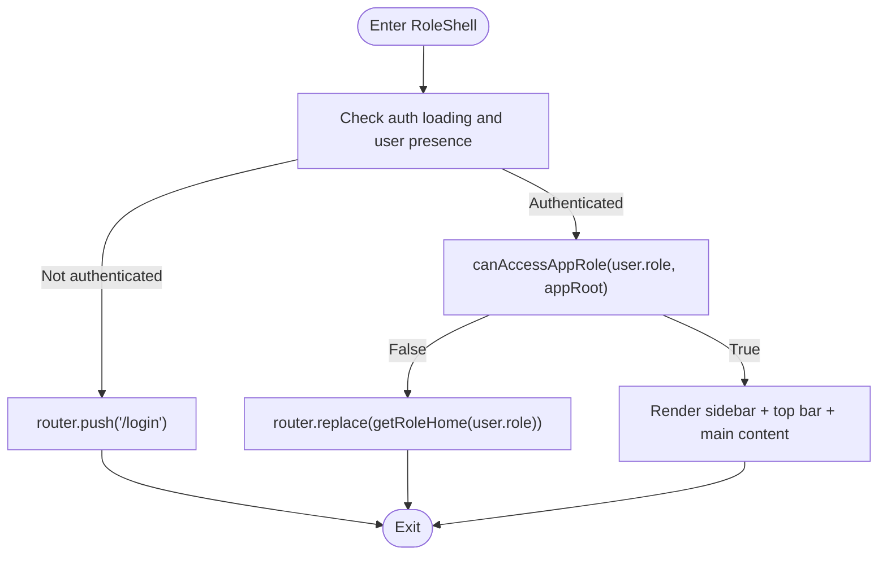
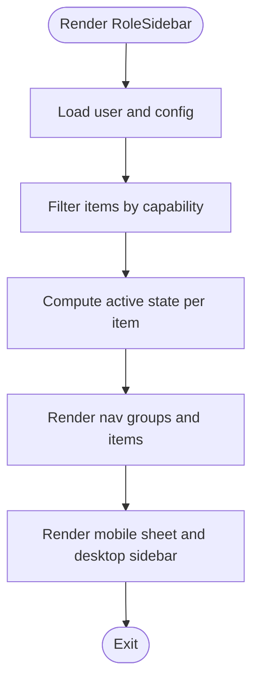
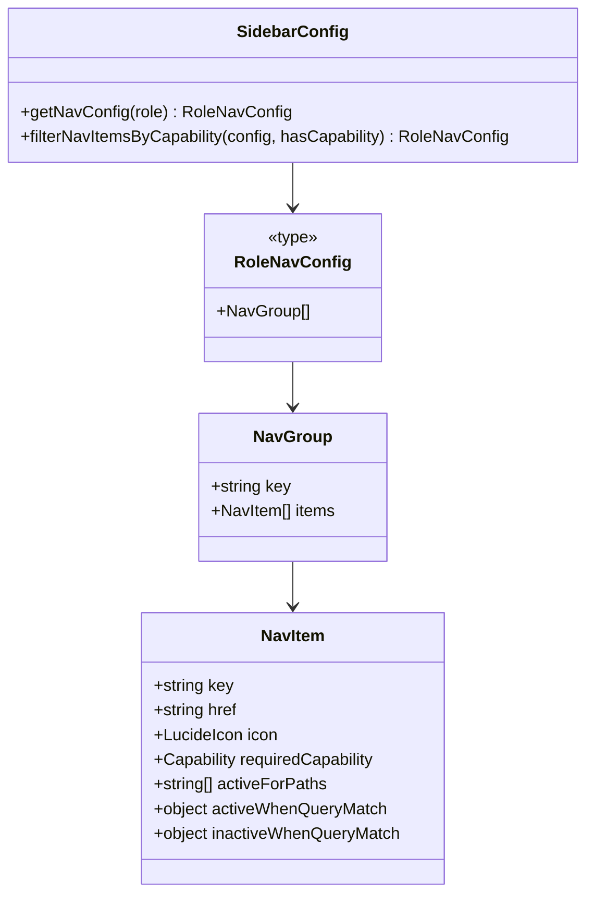
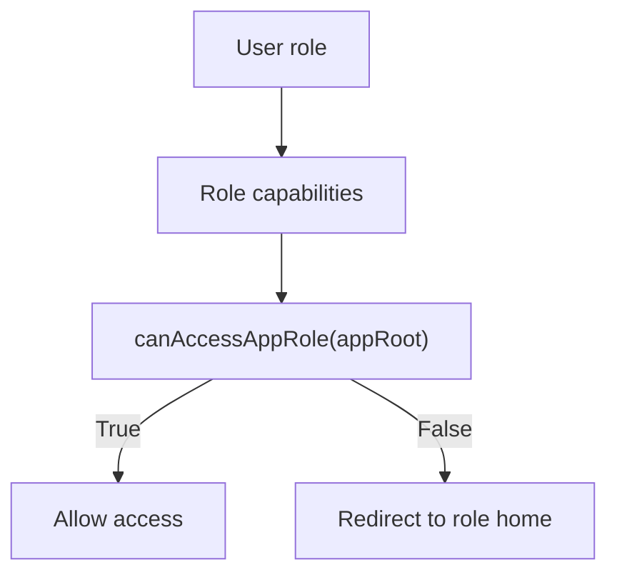
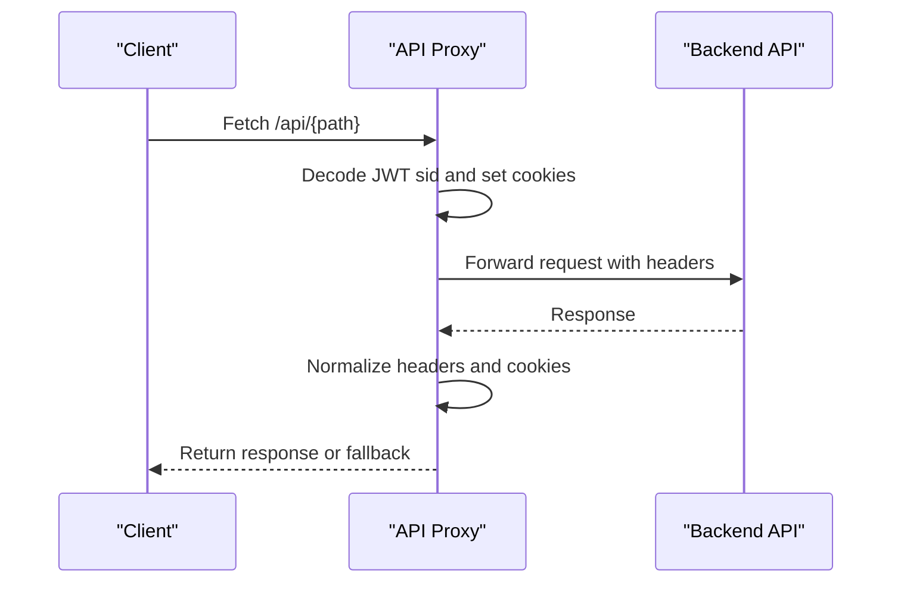
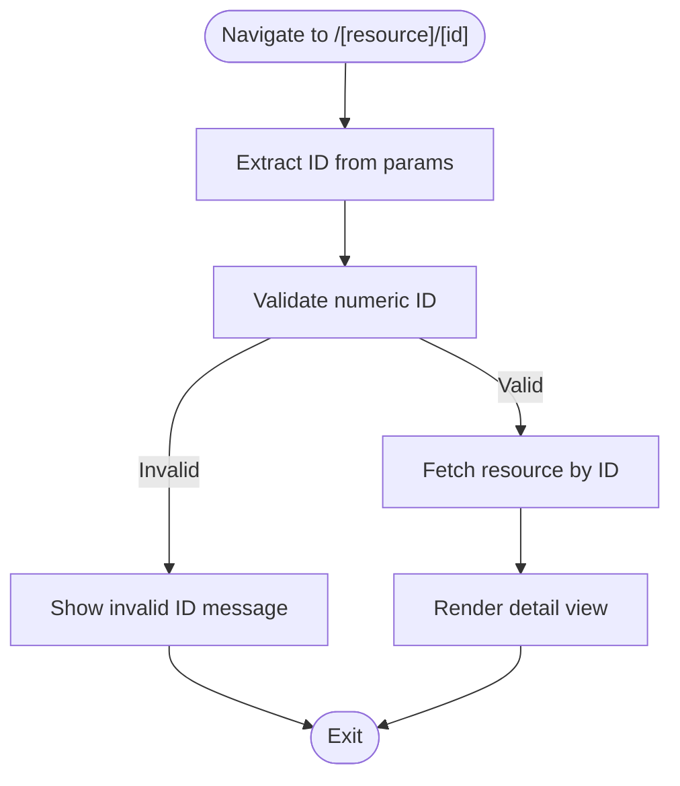
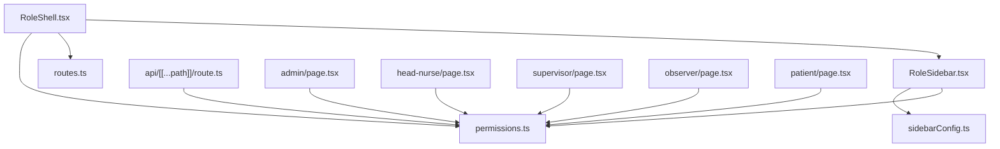

# Routing & Navigation

<cite>
**Referenced Files in This Document**
- [layout.tsx](file://frontend/app/layout.tsx)
- [routes.ts](file://frontend/lib/routes.ts)
- [sidebarConfig.ts](file://frontend/lib/sidebarConfig.ts)
- [RoleSidebar.tsx](file://frontend/components/RoleSidebar.tsx)
- [RoleShell.tsx](file://frontend/components/RoleShell.tsx)
- [permissions.ts](file://frontend/lib/permissions.ts)
- [route.ts](file://frontend/app/api/[[...path]]/route.ts)
- [admin/page.tsx](file://frontend/app/admin/page.tsx)
- [head-nurse/page.tsx](file://frontend/app/head-nurse/page.tsx)
- [supervisor/page.tsx](file://frontend/app/supervisor/page.tsx)
- [observer/page.tsx](file://frontend/app/observer/page.tsx)
- [patient/page.tsx](file://frontend/app/patient/page.tsx)
- [admin/caregivers/[id]/page.tsx](file://frontend/app/admin/caregivers/[id]/page.tsx)
- [observer/patients/[id]/page.tsx](file://frontend/app/observer/patients/[id]/page.tsx)
- [supervisor/patients/[id]/page.tsx](file://frontend/app/supervisor/patients/[id]/page.tsx)
- [head-nurse/patients/[id]/page.tsx](file://frontend/app/head-nurse/patients/[id]/page.tsx)
</cite>

## Table of Contents
1. [Introduction](#introduction)
2. [Project Structure](#project-structure)
3. [Core Components](#core-components)
4. [Architecture Overview](#architecture-overview)
5. [Detailed Component Analysis](#detailed-component-analysis)
6. [Dependency Analysis](#dependency-analysis)
7. [Performance Considerations](#performance-considerations)
8. [Troubleshooting Guide](#troubleshooting-guide)
9. [Conclusion](#conclusion)

## Introduction
This document explains the routing and navigation architecture of the WheelSense Platform built with Next.js App Router. It covers:
- App directory routing, dynamic routes, and catch-all routes
- Role-based navigation, workspace-aware routing, and permission-based route protection
- Client-side navigation, prefetching strategies, and navigation state management
- Mobile-responsive navigation patterns, menu systems, and accessibility features
- Integration with role switching, workspace selection, and navigation persistence
- Examples of custom navigation components and routing patterns

## Project Structure
The frontend uses Next.js App Router conventions:
- Root layout and providers are defined at the root app level
- Role-specific dashboards live under top-level role paths (e.g., /admin, /head-nurse, /supervisor, /observer, /patient)
- Dynamic routes use square bracket notation (e.g., /[id]) for resource detail pages
- Catch-all routes use double square brackets (e.g., /api/[[...path]]) to proxy arbitrary backend endpoints

**Diagram sources**
- [layout.tsx:11-23](file://frontend/app/layout.tsx#L11-L23)
- [admin/page.tsx:46-96](file://frontend/app/admin/page.tsx#L46-L96)
- [head-nurse/page.tsx:64-104](file://frontend/app/head-nurse/page.tsx#L64-L104)
- [supervisor/page.tsx:41-66](file://frontend/app/supervisor/page.tsx#L41-L66)
- [observer/page.tsx:75-95](file://frontend/app/observer/page.tsx#L75-L95)
- [patient/page.tsx:92-111](file://frontend/app/patient/page.tsx#L92-L111)
- [route.ts:299-328](file://frontend/app/api/[[...path]]/route.ts#L299-L328)

**Section sources**
- [layout.tsx:11-23](file://frontend/app/layout.tsx#L11-L23)

## Core Components
- RoleShell: Centralized role guard and shell wrapper that enforces access control and renders sidebar, top bar, and main content area
- RoleSidebar: Role-aware navigation drawer with capability filtering, active-state detection, and mobile sheet behavior
- Sidebar configuration: Single-source-of-truth navigation definitions per role with optional capability gating and badge support
- Permissions: Capability and role-access matrices used for filtering and guards
- API proxy: Catch-all route that proxies requests to the backend, handling auth cookies and impersonation

Key responsibilities:
- Enforce auth and role access before rendering protected role shells
- Build navigation menus from a centralized configuration with capability checks
- Compute active nav items based on pathname, query params, and role root paths
- Provide a unified API proxy for backend integration

**Section sources**
- [RoleShell.tsx:29-101](file://frontend/components/RoleShell.tsx#L29-L101)
- [RoleSidebar.tsx:60-227](file://frontend/components/RoleSidebar.tsx#L60-L227)
- [sidebarConfig.ts:22-300](file://frontend/lib/sidebarConfig.ts#L22-L300)
- [permissions.ts:95-111](file://frontend/lib/permissions.ts#L95-L111)
- [route.ts:299-328](file://frontend/app/api/[[...path]]/route.ts#L299-L328)

## Architecture Overview
The routing and navigation architecture combines:
- Next.js App Router for file-system-based routing and nested layouts
- Client-side guards for authentication and role access
- Centralized navigation configuration with capability filtering
- API proxy for backend integration and session management

**Diagram sources**
- [RoleShell.tsx:29-66](file://frontend/components/RoleShell.tsx#L29-L66)
- [permissions.ts:107-109](file://frontend/lib/permissions.ts#L107-L109)
- [routes.ts:2-16](file://frontend/lib/routes.ts#L2-L16)
- [RoleSidebar.tsx:60-101](file://frontend/components/RoleSidebar.tsx#L60-L101)
- [sidebarConfig.ts:280-300](file://frontend/lib/sidebarConfig.ts#L280-L300)

## Detailed Component Analysis

### RoleShell: Authentication and Role Guards
RoleShell orchestrates:
- Auth guard: Redirects unauthenticated users to /login
- Role guard: Ensures the user can access the requested role root; otherwise redirects to their role home
- Mobile sidebar toggle state management
- Rendering of sidebar, top bar, main content, and AI chat popup

**Diagram sources**
- [RoleShell.tsx:29-66](file://frontend/components/RoleShell.tsx#L29-L66)
- [permissions.ts:107-109](file://frontend/lib/permissions.ts#L107-L109)
- [routes.ts:2-16](file://frontend/lib/routes.ts#L2-L16)

**Section sources**
- [RoleShell.tsx:29-101](file://frontend/components/RoleShell.tsx#L29-L101)

### RoleSidebar: Role-Aware Navigation Drawer
RoleSidebar:
- Computes active state for nav items considering base href, activeForPaths, activeWhenQueryMatch, and inactiveWhenQueryMatch
- Filters items by user capability using filterNavItemsByCapability
- Supports desktop fixed sidebar and mobile sheet with controlled open state
- Provides logout and user profile affordances

**Diagram sources**
- [RoleSidebar.tsx:60-101](file://frontend/components/RoleSidebar.tsx#L60-L101)
- [sidebarConfig.ts:280-300](file://frontend/lib/sidebarConfig.ts#L280-L300)
- [permissions.ts:103-105](file://frontend/lib/permissions.ts#L103-L105)

**Section sources**
- [RoleSidebar.tsx:60-227](file://frontend/components/RoleSidebar.tsx#L60-L227)
- [sidebarConfig.ts:22-300](file://frontend/lib/sidebarConfig.ts#L22-L300)

### Navigation Configuration and Capability Filtering
Navigation configuration is centralized:
- NavItem supports translation keys, href, icons, optional required capability, badges, and advanced active-state rules
- NavGroup organizes items into labeled categories
- getNavConfig returns role-specific groups
- filterNavItemsByCapability removes items the user lacks capability for

**Diagram sources**
- [sidebarConfig.ts:22-54](file://frontend/lib/sidebarConfig.ts#L22-L54)
- [sidebarConfig.ts:280-300](file://frontend/lib/sidebarConfig.ts#L280-L300)

**Section sources**
- [sidebarConfig.ts:22-300](file://frontend/lib/sidebarConfig.ts#L22-L300)

### Permission Matrix and Role Access
Permissions define:
- Capability types and role-to-capability mapping
- Role-to-app-root access matrix used by RoleShell’s role guard

**Diagram sources**
- [permissions.ts:95-111](file://frontend/lib/permissions.ts#L95-L111)
- [routes.ts:2-16](file://frontend/lib/routes.ts#L2-L16)

**Section sources**
- [permissions.ts:95-111](file://frontend/lib/permissions.ts#L95-L111)

### API Proxy: Catch-All Route
The catch-all route under /api/[[...path]] proxies requests to the backend:
- Extracts path segments and forwards to backend /api/{sub}
- Manages auth cookies and impersonation tokens
- Handles fallback responses for unavailable AI model endpoints
- Implements timeouts and retry behavior for GET requests

**Diagram sources**
- [route.ts:127-225](file://frontend/app/api/[[...path]]/route.ts#L127-L225)
- [route.ts:299-328](file://frontend/app/api/[[...path]]/route.ts#L299-L328)

**Section sources**
- [route.ts:1-328](file://frontend/app/api/[[...path]]/route.ts#L1-L328)

### Dynamic Routes and Resource Detail Pages
Dynamic routes are used for resource detail pages:
- Admin caregiver detail: /admin/caregivers/[id]
- Observer patient detail: /observer/patients/[id]
- Supervisor patient detail: /supervisor/patients/[id]
- Head Nurse patient detail: /head-nurse/patients/[id]

These pages:
- Extract numeric IDs from URL params
- Validate IDs and fetch resources
- Render detail views with capability-aware actions and mutations

**Diagram sources**
- [admin/caregivers/[id]/page.tsx](file://frontend/app/admin/caregivers/[id]/page.tsx#L19-L66)
- [observer/patients/[id]/page.tsx](file://frontend/app/observer/patients/[id]/page.tsx#L118-L125)
- [supervisor/patients/[id]/page.tsx](file://frontend/app/supervisor/patients/[id]/page.tsx#L65-L75)
- [head-nurse/patients/[id]/page.tsx](file://frontend/app/head-nurse/patients/[id]/page.tsx#L71-L78)

**Section sources**
- [admin/caregivers/[id]/page.tsx](file://frontend/app/admin/caregivers/[id]/page.tsx#L19-L124)
- [observer/patients/[id]/page.tsx](file://frontend/app/observer/patients/[id]/page.tsx#L118-L800)
- [supervisor/patients/[id]/page.tsx](file://frontend/app/supervisor/patients/[id]/page.tsx#L65-L570)
- [head-nurse/patients/[id]/page.tsx](file://frontend/app/head-nurse/patients/[id]/page.tsx#L71-L504)

### Role Dashboards and Workspace Awareness
Each role dashboard:
- Uses React Query to fetch role-scoped data
- Integrates with workspace-aware endpoints via workspaceQuery helpers
- Demonstrates capability-driven UI (e.g., “open devices” links only appear when user has devices.read)

Examples:
- Admin dashboard: fleet health, device activity, user stats
- Head Nurse dashboard: alerts, tasks, staff, timeline
- Supervisor dashboard: critical alerts, tasks, directives, zone map
- Observer dashboard: shift checklist, tasks, patients, zone map
- Patient dashboard: hub tabs (overview, profile, support), SOS and assistance buttons

**Section sources**
- [admin/page.tsx:46-96](file://frontend/app/admin/page.tsx#L46-L96)
- [head-nurse/page.tsx:64-104](file://frontend/app/head-nurse/page.tsx#L64-L104)
- [supervisor/page.tsx:41-66](file://frontend/app/supervisor/page.tsx#L41-L66)
- [observer/page.tsx:75-95](file://frontend/app/observer/page.tsx#L75-L95)
- [patient/page.tsx:92-111](file://frontend/app/patient/page.tsx#L92-L111)

## Dependency Analysis
High-level dependencies among navigation and routing components:

**Diagram sources**
- [RoleShell.tsx:29-66](file://frontend/components/RoleShell.tsx#L29-L66)
- [RoleSidebar.tsx:60-101](file://frontend/components/RoleSidebar.tsx#L60-L101)
- [sidebarConfig.ts:280-300](file://frontend/lib/sidebarConfig.ts#L280-L300)
- [permissions.ts:95-111](file://frontend/lib/permissions.ts#L95-L111)
- [routes.ts:2-16](file://frontend/lib/routes.ts#L2-L16)
- [route.ts:299-328](file://frontend/app/api/[[...path]]/route.ts#L299-L328)
- [admin/page.tsx:46-96](file://frontend/app/admin/page.tsx#L46-L96)
- [head-nurse/page.tsx:64-104](file://frontend/app/head-nurse/page.tsx#L64-L104)
- [supervisor/page.tsx:41-66](file://frontend/app/supervisor/page.tsx#L41-L66)
- [observer/page.tsx:75-95](file://frontend/app/observer/page.tsx#L75-L95)
- [patient/page.tsx:92-111](file://frontend/app/patient/page.tsx#L92-L111)

**Section sources**
- [RoleShell.tsx:29-101](file://frontend/components/RoleShell.tsx#L29-L101)
- [RoleSidebar.tsx:60-227](file://frontend/components/RoleSidebar.tsx#L60-L227)
- [sidebarConfig.ts:22-300](file://frontend/lib/sidebarConfig.ts#L22-L300)
- [permissions.ts:95-111](file://frontend/lib/permissions.ts#L95-L111)
- [routes.ts:2-16](file://frontend/lib/routes.ts#L2-L16)
- [route.ts:299-328](file://frontend/app/api/[[...path]]/route.ts#L299-L328)

## Performance Considerations
- Client-side guards avoid unnecessary server round trips by redirecting early when authentication or role checks fail
- Centralized navigation configuration reduces duplication and improves maintainability
- API proxy sets cache-control headers to prevent stale responses and leverages timeouts for resilience
- Dynamic routes defer heavy data fetching until the ID is validated, minimizing wasted network requests

[No sources needed since this section provides general guidance]

## Troubleshooting Guide
Common issues and resolutions:
- Unauthorized access to role roots: RoleShell redirects to getRoleHome; verify permissions and role claims
- Navigation items not appearing: Ensure user has the required capability; check filterNavItemsByCapability logic
- API proxy failures: Verify backend availability and cookies; fallback responses are returned for specific AI endpoints
- Dynamic route errors: Confirm numeric ID validation and error handling in detail pages

**Section sources**
- [RoleShell.tsx:44-66](file://frontend/components/RoleShell.tsx#L44-L66)
- [sidebarConfig.ts:287-299](file://frontend/lib/sidebarConfig.ts#L287-L299)
- [route.ts:170-206](file://frontend/app/api/[[...path]]/route.ts#L170-L206)
- [admin/caregivers/[id]/page.tsx](file://frontend/app/admin/caregivers/[id]/page.tsx#L33-L66)
- [observer/patients/[id]/page.tsx](file://frontend/app/observer/patients/[id]/page.tsx#L643-L655)

## Conclusion
The WheelSense Platform implements a robust, role-aware routing and navigation system:
- RoleShell and RoleSidebar enforce authentication and role access while rendering capability-filtered navigation
- Centralized configuration and permissions enable consistent UX across roles
- Dynamic routes and catch-all API proxy support flexible resource detail pages and backend integration
- Client-side navigation state management and accessibility features deliver responsive, inclusive experiences

[No sources needed since this section summarizes without analyzing specific files]