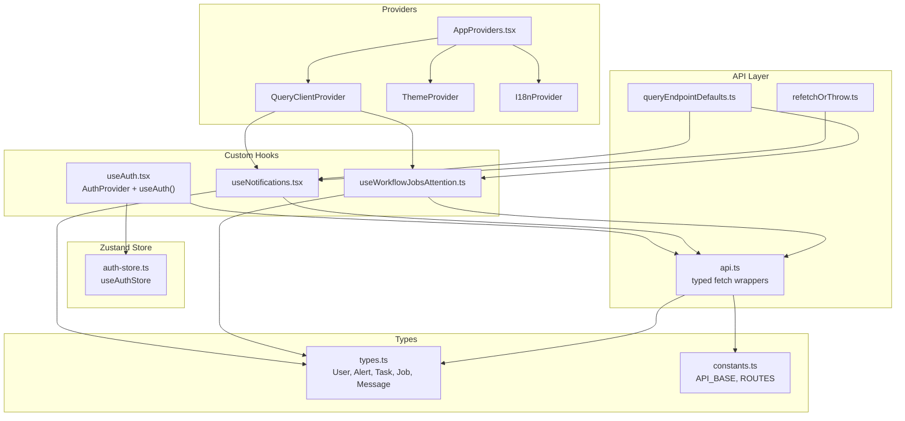
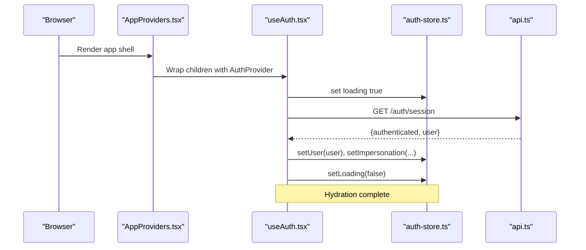
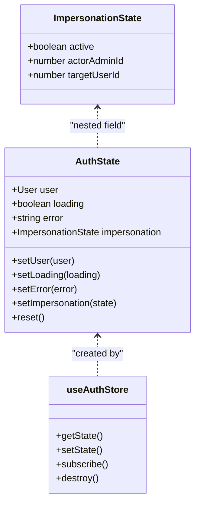
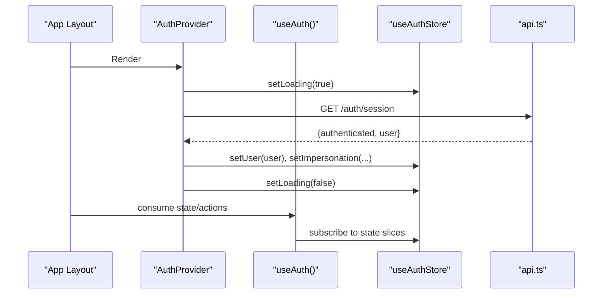
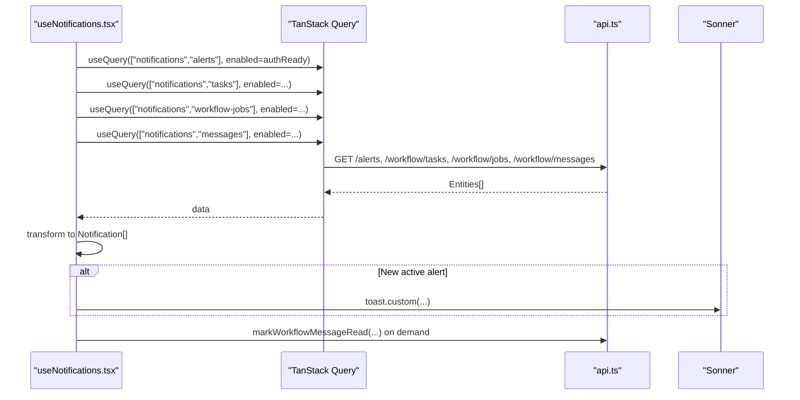
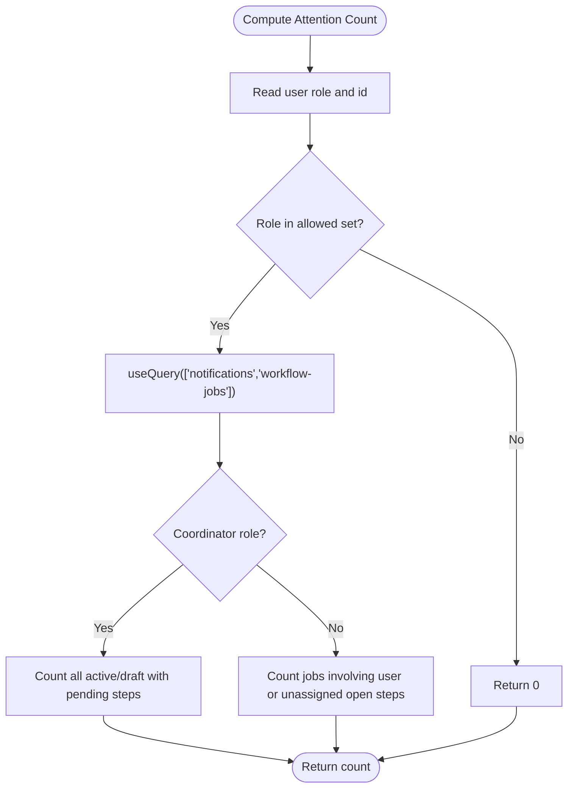
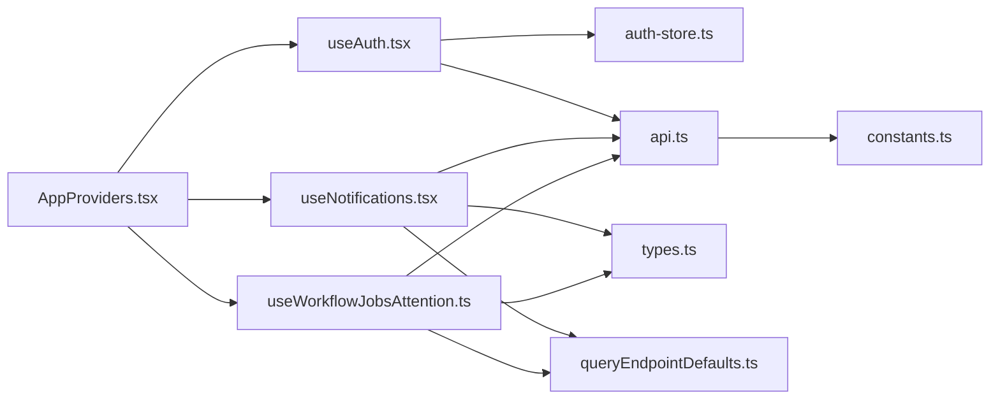

# State Management

<cite>
**Referenced Files in This Document**
- [AppProviders.tsx](file://frontend/components/providers/AppProviders.tsx)
- [auth-store.ts](file://frontend/lib/stores/auth-store.ts)
- [useAuth.tsx](file://frontend/hooks/useAuth.tsx)
- [useNotifications.tsx](file://frontend/hooks/useNotifications.tsx)
- [useWorkflowJobsAttention.ts](file://frontend/hooks/useWorkflowJobsAttention.ts)
- [api.ts](file://frontend/lib/api.ts)
- [queryEndpointDefaults.ts](file://frontend/lib/queryEndpointDefaults.ts)
- [refetchOrThrow.ts](file://frontend/lib/refetchOrThrow.ts)
- [types.ts](file://frontend/lib/types.ts)
- [constants.ts](file://frontend/lib/constants.ts)
- [ARCHITECTURE.md](file://ARCHITECTURE.md)
</cite>

## Table of Contents
1. [Introduction](#introduction)
2. [Project Structure](#project-structure)
3. [Core Components](#core-components)
4. [Architecture Overview](#architecture-overview)
5. [Detailed Component Analysis](#detailed-component-analysis)
6. [Dependency Analysis](#dependency-analysis)
7. [Performance Considerations](#performance-considerations)
8. [Troubleshooting Guide](#troubleshooting-guide)
9. [Conclusion](#conclusion)
10. [Appendices](#appendices)

## Introduction
This document explains the WheelSense Platform’s state management architecture with a focus on:
- Zustand-based global store for authentication and impersonation state
- Provider and context composition for app-wide initialization
- TanStack Query integration for data fetching, caching, and polling
- Custom hooks for authentication, notifications, and workflow job attention
- Patterns for state hydration, persistence, synchronization with backend APIs, and debugging

The goal is to help developers understand how user identity, impersonation, notifications, and workflow job visibility are modeled, updated, and synchronized with the backend.

## Project Structure
The state management stack is organized around three pillars:
- Providers: App-level initialization and global providers
- Zustand Store: Authentication state container
- TanStack Query: Data fetching, caching, and polling

**Diagram sources**
- [AppProviders.tsx:10-42](file://frontend/components/providers/AppProviders.tsx#L10-L42)
- [auth-store.ts:1-38](file://frontend/lib/stores/auth-store.ts#L1-L38)
- [useAuth.tsx:88-183](file://frontend/hooks/useAuth.tsx#L88-L183)
- [useNotifications.tsx:186-422](file://frontend/hooks/useNotifications.tsx#L186-L422)
- [useWorkflowJobsAttention.ts:51-71](file://frontend/hooks/useWorkflowJobsAttention.ts#L51-L71)
- [api.ts:342-1092](file://frontend/lib/api.ts#L342-L1092)
- [queryEndpointDefaults.ts:1-22](file://frontend/lib/queryEndpointDefaults.ts#L1-L22)
- [refetchOrThrow.ts:1-10](file://frontend/lib/refetchOrThrow.ts#L1-L10)
- [types.ts:12-26](file://frontend/lib/types.ts#L12-L26)
- [constants.ts:1-27](file://frontend/lib/constants.ts#L1-L27)

**Section sources**
- [AppProviders.tsx:10-42](file://frontend/components/providers/AppProviders.tsx#L10-L42)
- [auth-store.ts:1-38](file://frontend/lib/stores/auth-store.ts#L1-L38)
- [useAuth.tsx:88-183](file://frontend/hooks/useAuth.tsx#L88-L183)
- [useNotifications.tsx:186-422](file://frontend/hooks/useNotifications.tsx#L186-L422)
- [useWorkflowJobsAttention.ts:51-71](file://frontend/hooks/useWorkflowJobsAttention.ts#L51-L71)
- [api.ts:342-1092](file://frontend/lib/api.ts#L342-L1092)
- [queryEndpointDefaults.ts:1-22](file://frontend/lib/queryEndpointDefaults.ts#L1-L22)
- [refetchOrThrow.ts:1-10](file://frontend/lib/refetchOrThrow.ts#L1-L10)
- [types.ts:12-26](file://frontend/lib/types.ts#L12-L26)
- [constants.ts:1-27](file://frontend/lib/constants.ts#L1-L27)

## Core Components
- AppProviders: Initializes TanStack Query client, theme, i18n, and wraps children with AuthProvider. Sets default query behavior (retry, staleTime, refetchOnWindowFocus, refetchOnReconnect).
- Auth Zustand Store: Holds user, loading, error, and impersonation state; exposes setters and reset.
- Auth Custom Hook: Provides login, logout, impersonation, refresh, and hydrated user state to the app.
- Notifications Custom Hook: Integrates TanStack Query to poll alerts, tasks, workflow jobs, and messages; transforms and surfaces notifications with toasts and badges.
- Workflow Jobs Attention Hook: Computes badge counts for active/open workflow jobs using shared TanStack Query cache.
- API Layer: Typed fetch wrappers for backend endpoints; centralized error handling and redirects on 401.
- Types and Constants: Strongly typed models and API base constants.

**Section sources**
- [AppProviders.tsx:10-42](file://frontend/components/providers/AppProviders.tsx#L10-L42)
- [auth-store.ts:1-38](file://frontend/lib/stores/auth-store.ts#L1-L38)
- [useAuth.tsx:88-183](file://frontend/hooks/useAuth.tsx#L88-L183)
- [useNotifications.tsx:186-422](file://frontend/hooks/useNotifications.tsx#L186-L422)
- [useWorkflowJobsAttention.ts:51-71](file://frontend/hooks/useWorkflowJobsAttention.ts#L51-L71)
- [api.ts:342-1092](file://frontend/lib/api.ts#L342-L1092)
- [types.ts:12-26](file://frontend/lib/types.ts#L12-L26)
- [constants.ts:1-27](file://frontend/lib/constants.ts#L1-L27)

## Architecture Overview
WheelSense composes a layered state management approach:
- Providers initialize the app-wide environment and install the TanStack Query cache.
- Zustand manages authentication state globally to avoid prop drilling.
- Custom hooks encapsulate business logic and integrate with TanStack Query for data fetching and polling.
- The API layer centralizes HTTP interactions and error handling.

**Diagram sources**
- [AppProviders.tsx:10-42](file://frontend/components/providers/AppProviders.tsx#L10-L42)
- [useAuth.tsx:88-97](file://frontend/hooks/useAuth.tsx#L88-L97)
- [useAuth.tsx:48-86](file://frontend/hooks/useAuth.tsx#L48-L86)
- [auth-store.ts:22-38](file://frontend/lib/stores/auth-store.ts#L22-L38)
- [api.ts:342-1092](file://frontend/lib/api.ts#L342-L1092)

## Detailed Component Analysis

### Authentication State Management (Zustand)
The authentication store encapsulates:
- user: current authenticated user or null
- loading: indicates hydration or login/logout in progress
- error: last error message
- impersonation: nested state for admin impersonation tracking

It exposes setters and a reset function to clear state.

**Diagram sources**
- [auth-store.ts:6-20](file://frontend/lib/stores/auth-store.ts#L6-L20)
- [auth-store.ts:22-38](file://frontend/lib/stores/auth-store.ts#L22-L38)

**Section sources**
- [auth-store.ts:1-38](file://frontend/lib/stores/auth-store.ts#L1-L38)

### AuthProvider and useAuth Hook
- AuthProvider triggers hydration on mount by calling a fetch routine that calls the backend session endpoint and updates the store.
- useAuth returns the current user, loading/error state, impersonation state, and actions: login, logout, refreshUser, startImpersonation, stopImpersonation.
- The hook coordinates API calls and store updates, ensuring consistent state transitions.

**Diagram sources**
- [useAuth.tsx:88-97](file://frontend/hooks/useAuth.tsx#L88-L97)
- [useAuth.tsx:48-86](file://frontend/hooks/useAuth.tsx#L48-L86)
- [auth-store.ts:22-38](file://frontend/lib/stores/auth-store.ts#L22-L38)
- [api.ts:342-1092](file://frontend/lib/api.ts#L342-L1092)

**Section sources**
- [useAuth.tsx:88-183](file://frontend/hooks/useAuth.tsx#L88-L183)

### Notifications and Polling (TanStack Query)
The notifications hook integrates TanStack Query to:
- Poll alerts, tasks, workflow jobs, and messages at different intervals
- Transform backend entities into a unified Notification model
- Emit toasts for new or updated items with severity-based behavior
- Track read state locally and synchronize read markers with the backend
- Compute unread counts and “has new” flags

**Diagram sources**
- [useNotifications.tsx:203-229](file://frontend/hooks/useNotifications.tsx#L203-L229)
- [useNotifications.tsx:231-297](file://frontend/hooks/useNotifications.tsx#L231-L297)
- [useNotifications.tsx:299-351](file://frontend/hooks/useNotifications.tsx#L299-L351)
- [useNotifications.tsx:353-422](file://frontend/hooks/useNotifications.tsx#L353-L422)
- [api.ts:342-1092](file://frontend/lib/api.ts#L342-L1092)

**Section sources**
- [useNotifications.tsx:186-422](file://frontend/hooks/useNotifications.tsx#L186-L422)
- [queryEndpointDefaults.ts:1-22](file://frontend/lib/queryEndpointDefaults.ts#L1-L22)

### Workflow Job Attention Count
This hook computes a badge count for active/open workflow jobs:
- Uses the same TanStack Query cache key as notifications for shared efficiency
- Filters jobs based on role (coordinators vs. individual attention)
- Returns a count suitable for UI indicators

**Diagram sources**
- [useWorkflowJobsAttention.ts:51-71](file://frontend/hooks/useWorkflowJobsAttention.ts#L51-L71)

**Section sources**
- [useWorkflowJobsAttention.ts:51-71](file://frontend/hooks/useWorkflowJobsAttention.ts#L51-L71)

### Provider Pattern and Context Management
AppProviders composes:
- QueryClientProvider with default options (retry, staleTime, refetchOnWindowFocus, refetchOnReconnect)
- ThemeProvider for dark/light/system themes
- I18nProvider for internationalization
- AuthProvider for authentication hydration

This ensures all components below receive a consistent environment and hydrated auth state.

**Section sources**
- [AppProviders.tsx:10-42](file://frontend/components/providers/AppProviders.tsx#L10-L42)

### State Synchronization with Backend APIs
- Auth hydration and actions call backend endpoints via typed wrappers in api.ts, which centralize error handling and 401 redirects.
- Notifications and workflow job attention rely on TanStack Query’s cache and refetch behavior to keep UIs synchronized with backend state.
- Local read-state is persisted via in-memory sets and invalidated via queryClient invalidation.

**Section sources**
- [useAuth.tsx:48-86](file://frontend/hooks/useAuth.tsx#L48-L86)
- [api.ts:342-1092](file://frontend/lib/api.ts#L342-L1092)
- [useNotifications.tsx:409-412](file://frontend/hooks/useNotifications.tsx#L409-L412)

### State Consumption Patterns and Custom Hook Implementations
Common patterns:
- Subscribe to store slices via selector callbacks to minimize re-renders
- Gate TanStack Query enabled booleans on user availability and role checks
- Use queryClient.invalidateQueries to force refetch after mutations
- Use refetchOrThrow to await refetch and propagate errors consistently

Examples of consumption patterns:
- Auth: useAuth() returns state and actions; components call login/logout/refreshUser
- Notifications: useNotifications() returns notifications array, unread count, and actions to mark as read or clear
- Attention: useWorkflowJobsAttentionCount() returns a badge number derived from cached data

**Section sources**
- [useAuth.tsx:99-183](file://frontend/hooks/useAuth.tsx#L99-L183)
- [useNotifications.tsx:186-422](file://frontend/hooks/useNotifications.tsx#L186-L422)
- [useWorkflowJobsAttention.ts:51-71](file://frontend/hooks/useWorkflowJobsAttention.ts#L51-L71)
- [refetchOrThrow.ts:1-10](file://frontend/lib/refetchOrThrow.ts#L1-L10)

## Dependency Analysis

**Diagram sources**
- [useAuth.tsx:88-183](file://frontend/hooks/useAuth.tsx#L88-L183)
- [auth-store.ts:1-38](file://frontend/lib/stores/auth-store.ts#L1-L38)
- [useNotifications.tsx:186-422](file://frontend/hooks/useNotifications.tsx#L186-L422)
- [useWorkflowJobsAttention.ts:51-71](file://frontend/hooks/useWorkflowJobsAttention.ts#L51-L71)
- [api.ts:342-1092](file://frontend/lib/api.ts#L342-L1092)
- [queryEndpointDefaults.ts:1-22](file://frontend/lib/queryEndpointDefaults.ts#L1-L22)
- [types.ts:12-26](file://frontend/lib/types.ts#L12-L26)
- [constants.ts:1-27](file://frontend/lib/constants.ts#L1-L27)
- [AppProviders.tsx:10-42](file://frontend/components/providers/AppProviders.tsx#L10-L42)

**Section sources**
- [useAuth.tsx:88-183](file://frontend/hooks/useAuth.tsx#L88-L183)
- [useNotifications.tsx:186-422](file://frontend/hooks/useNotifications.tsx#L186-L422)
- [useWorkflowJobsAttention.ts:51-71](file://frontend/hooks/useWorkflowJobsAttention.ts#L51-L71)
- [api.ts:342-1092](file://frontend/lib/api.ts#L342-L1092)
- [queryEndpointDefaults.ts:1-22](file://frontend/lib/queryEndpointDefaults.ts#L1-L22)
- [types.ts:12-26](file://frontend/lib/types.ts#L12-L26)
- [constants.ts:1-27](file://frontend/lib/constants.ts#L1-L27)
- [AppProviders.tsx:10-42](file://frontend/components/providers/AppProviders.tsx#L10-L42)

## Performance Considerations
- TanStack Query defaults:
  - retry: 1
  - refetchOnWindowFocus: true
  - refetchOnReconnect: true
  - staleTime: 15 seconds for most queries
- Endpoint-specific polling and staleness:
  - Alerts and vitals: shorter stale/poll windows for near-real-time feel
  - Devices and HA devices: moderate intervals to balance liveliness and load
- Local read-state tracking avoids unnecessary backend calls for read markers
- Invalidate caches selectively to reduce network overhead

Recommendations:
- Prefer endpoint-specific defaults via queryEndpointDefaults to keep intervals aligned with backend capabilities
- Use staleTime judiciously to avoid excessive refetches
- Leverage enabled flags to avoid fetching until user is ready
- Use invalidateQueries strategically after mutations

**Section sources**
- [AppProviders.tsx:11-23](file://frontend/components/providers/AppProviders.tsx#L11-L23)
- [queryEndpointDefaults.ts:1-22](file://frontend/lib/queryEndpointDefaults.ts#L1-L22)
- [useNotifications.tsx:203-229](file://frontend/hooks/useNotifications.tsx#L203-L229)
- [useWorkflowJobsAttention.ts:57-61](file://frontend/hooks/useWorkflowJobsAttention.ts#L57-L61)

## Troubleshooting Guide
Common issues and remedies:
- Unauthorized redirects on 401:
  - The API layer redirects to /login on 401 unless suppressed; ensure AuthProvider handles loading states and retries appropriately
- Stuck loading:
  - Auth hydration sets loading to true initially; ensure fetchCurrentUser resolves or rejects to set loading to false
- Polling gaps:
  - Verify enabled conditions and queryKey consistency across hooks sharing the cache
- Toast storms:
  - Severity thresholds and bootstrap flags prevent duplicate toasts; confirm that alert IDs are tracked and signatures are compared for workflow jobs

Debugging tips:
- Inspect store state via Zustand Devtools or console logs
- Monitor TanStack Query cache with enabled flags and staleTime
- Use refetchOrThrow to await refetch and inspect result.error/result.data after mutations

**Section sources**
- [api.ts:251-286](file://frontend/lib/api.ts#L251-L286)
- [useAuth.tsx:48-86](file://frontend/hooks/useAuth.tsx#L48-L86)
- [useNotifications.tsx:231-297](file://frontend/hooks/useNotifications.tsx#L231-L297)
- [useNotifications.tsx:299-351](file://frontend/hooks/useNotifications.tsx#L299-L351)
- [refetchOrThrow.ts:1-10](file://frontend/lib/refetchOrThrow.ts#L1-L10)

## Conclusion
WheelSense employs a clean separation of concerns:
- Zustand for lightweight, cross-component authentication state
- TanStack Query for robust data fetching, caching, and polling
- Custom hooks that encapsulate business logic and integrate tightly with both stores and queries
- Providers that establish a consistent environment and hydration lifecycle

This design yields responsive UIs, predictable state updates, and maintainable patterns for authentication, notifications, and workflow job visibility.

## Appendices

### API Definitions and Contracts Used by Hooks
- Auth endpoints: login, logout, impersonation start/stop, session hydration
- Notifications endpoints: alerts, workflow tasks, workflow jobs, workflow messages
- These are exposed via typed wrappers in api.ts and consumed by useAuth and useNotifications

**Section sources**
- [api.ts:342-1092](file://frontend/lib/api.ts#L342-L1092)

### Types Used in State and Transforms
- User, Alert, CareTask, CareWorkflowJob, RoleMessage, and related models are defined in types.ts and transformed into Notification objects in useNotifications

**Section sources**
- [types.ts:12-26](file://frontend/lib/types.ts#L12-L26)
- [useNotifications.tsx:102-184](file://frontend/hooks/useNotifications.tsx#L102-L184)