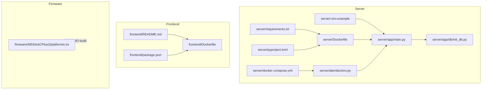
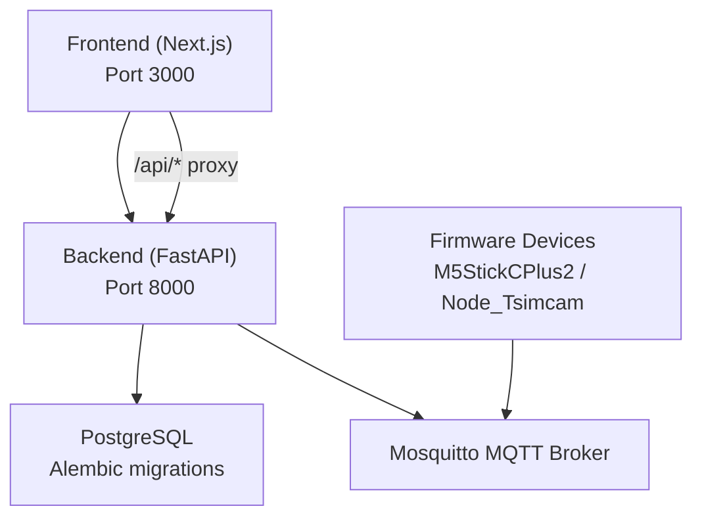
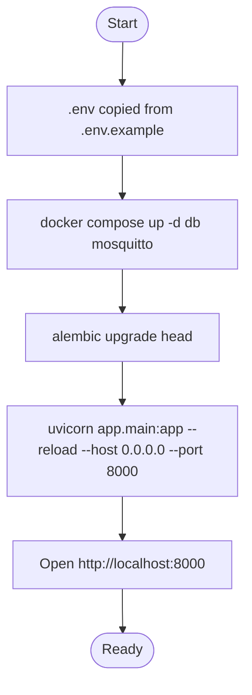
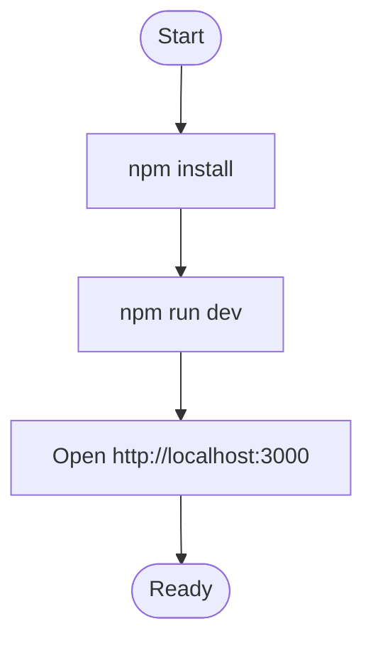
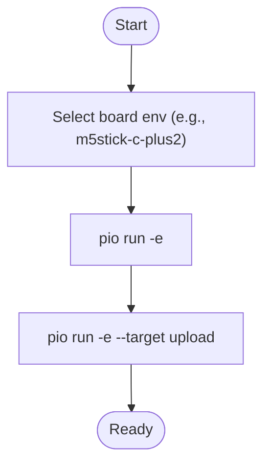
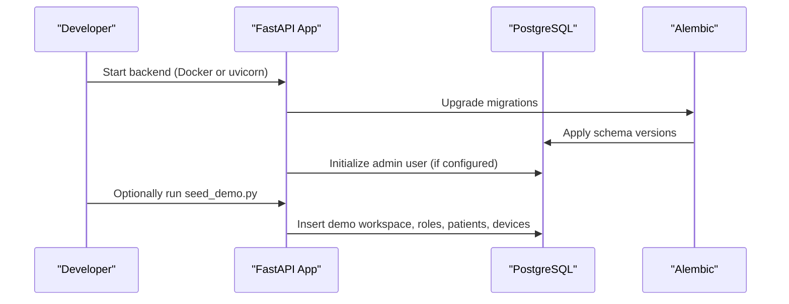
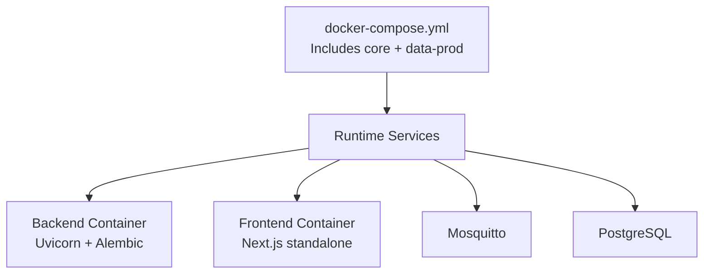
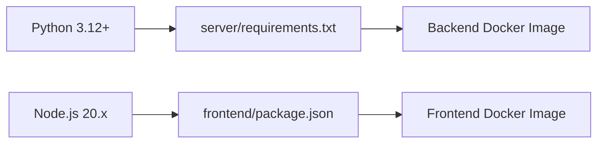

# Getting Started

<cite>
**Referenced Files in This Document**
- [README.md](file://README.md)
- [server/requirements.txt](file://server/requirements.txt)
- [server/pyproject.toml](file://server/pyproject.toml)
- [server/Dockerfile](file://server/Dockerfile)
- [server/docker-compose.yml](file://server/docker-compose.yml)
- [server/.env.example](file://server/.env.example)
- [server/app/main.py](file://server/app/main.py)
- [server/app/db/init_db.py](file://server/app/db/init_db.py)
- [server/scripts/seed_demo.py](file://server/scripts/seed_demo.py)
- [server/alembic/env.py](file://server/alembic/env.py)
- [frontend/package.json](file://frontend/package.json)
- [frontend/Dockerfile](file://frontend/Dockerfile)
- [frontend/README.md](file://frontend/README.md)
- [firmware/M5StickCPlus2/platformio.ini](file://firmware/M5StickCPlus2/platformio.ini)
</cite>

## Table of Contents
1. [Introduction](#introduction)
2. [Project Structure](#project-structure)
3. [Core Components](#core-components)
4. [Architecture Overview](#architecture-overview)
5. [Detailed Component Analysis](#detailed-component-analysis)
6. [Dependency Analysis](#dependency-analysis)
7. [Performance Considerations](#performance-considerations)
8. [Troubleshooting Guide](#troubleshooting-guide)
9. [Conclusion](#conclusion)
10. [Appendices](#appendices)

## Introduction
This guide helps you install and run the WheelSense Platform locally for development and understand how to deploy it in production. You will set up the backend (FastAPI), frontend (Next.js), and firmware components, initialize the database, configure environment variables, seed demo data, and verify your installation. Both local development and production deployment scenarios are covered.

## Project Structure
The repository is organized into three main runtime areas:
- server/: FastAPI backend, database models, migrations, MQTT ingestion, and CLI scripts
- frontend/: Next.js 16 web application with role-based dashboards
- firmware/: PlatformIO firmware for M5StickCPlus2 wheelchair gateway and Node_Tsimcam camera/beacon node

**Diagram sources**
- [server/app/main.py:1-123](file://server/app/main.py#L1-L123)
- [server/app/db/init_db.py:1-101](file://server/app/db/init_db.py#L1-L101)
- [server/.env.example:1-33](file://server/.env.example#L1-L33)
- [server/docker-compose.yml:1-10](file://server/docker-compose.yml#L1-L10)
- [server/Dockerfile:1-22](file://server/Dockerfile#L1-L22)
- [server/alembic/env.py:1-89](file://server/alembic/env.py#L1-L89)
- [server/requirements.txt:1-30](file://server/requirements.txt#L1-L30)
- [server/pyproject.toml:1-15](file://server/pyproject.toml#L1-L15)
- [frontend/README.md:1-374](file://frontend/README.md#L1-L374)
- [frontend/Dockerfile:1-31](file://frontend/Dockerfile#L1-L31)
- [frontend/package.json:1-58](file://frontend/package.json#L1-L58)
- [firmware/M5StickCPlus2/platformio.ini:1-22](file://firmware/M5StickCPlus2/platformio.ini#L1-L22)

**Section sources**
- [README.md:1-74](file://README.md#L1-L74)

## Core Components
- Backend (FastAPI)
  - Application entrypoint initializes database, MQTT listener, retention scheduler, and mounts the MCP server when enabled.
  - Environment variables define database credentials, MQTT broker, OAuth, and optional simulator workspace pinning.
  - Alembic migration configuration dynamically reads the database URL from settings.
- Frontend (Next.js)
  - Role-based dashboards with cookie-based authentication, API proxy to backend, and OpenAPI-driven type generation.
  - Development server runs on port 3000; production Docker image uses a multi-stage build.
- Firmware (PlatformIO)
  - M5StickCPlus2 gateway firmware configuration for Arduino framework, MQTT client, and ArduinoJson library.

**Section sources**
- [server/app/main.py:1-123](file://server/app/main.py#L1-L123)
- [server/.env.example:1-33](file://server/.env.example#L1-L33)
- [server/alembic/env.py:1-89](file://server/alembic/env.py#L1-L89)
- [frontend/README.md:1-374](file://frontend/README.md#L1-L374)
- [frontend/Dockerfile:1-31](file://frontend/Dockerfile#L1-L31)
- [firmware/M5StickCPlus2/platformio.ini:1-22](file://firmware/M5StickCPlus2/platformio.ini#L1-L22)

## Architecture Overview
High-level runtime architecture:
- Backend FastAPI serves REST APIs, manages database via SQLAlchemy, and consumes MQTT events.
- Frontend Next.js proxies API calls to the backend and renders role-specific dashboards.
- Firmware devices publish telemetry and receive commands via MQTT.

**Diagram sources**
- [frontend/README.md:44-47](file://frontend/README.md#L44-L47)
- [server/app/main.py:18-86](file://server/app/main.py#L18-L86)
- [server/docker-compose.yml:1-10](file://server/docker-compose.yml#L1-L10)

## Detailed Component Analysis

### Prerequisites
- Python 3.12+ (required by backend project configuration)
- Node.js 20.x (required by frontend)
- Docker and Docker Compose v2 (recommended for local and production)
- Hardware (optional): M5StickCPlus2 and Node_Tsimcam for firmware testing

**Section sources**
- [server/pyproject.toml:4-6](file://server/pyproject.toml#L4-L6)
- [frontend/package.json:1-58](file://frontend/package.json#L1-L58)
- [firmware/M5StickCPlus2/platformio.ini:5-8](file://firmware/M5StickCPlus2/platformio.ini#L5-L8)

### Local Development Setup

#### Backend (FastAPI)
1. Change to the server directory and copy the environment example to .env.
2. Start the database and MQTT services using Docker Compose.
3. Run database migrations to create tables.
4. Start the FastAPI development server with hot reload.

**Diagram sources**
- [README.md:25-44](file://README.md#L25-L44)
- [server/.env.example:1-33](file://server/.env.example#L1-L33)
- [server/Dockerfile:19-22](file://server/Dockerfile#L19-L22)

**Section sources**
- [README.md:25-44](file://README.md#L25-L44)
- [server/.env.example:1-33](file://server/.env.example#L1-L33)
- [server/Dockerfile:1-22](file://server/Dockerfile#L1-L22)

#### Frontend (Next.js)
1. Install dependencies.
2. Start the Next.js development server.
3. Access the app at http://localhost:3000.

**Diagram sources**
- [frontend/README.md:330-339](file://frontend/README.md#L330-L339)
- [frontend/package.json:5-12](file://frontend/package.json#L5-L12)

**Section sources**
- [frontend/README.md:1-374](file://frontend/README.md#L1-L374)
- [frontend/package.json:1-58](file://frontend/package.json#L1-L58)

#### Firmware (PlatformIO)
1. Navigate to the firmware directory for your device.
2. Build and upload using PlatformIO according to your environment.

**Diagram sources**
- [firmware/M5StickCPlus2/platformio.ini:4-22](file://firmware/M5StickCPlus2/platformio.ini#L4-L22)

**Section sources**
- [firmware/M5StickCPlus2/platformio.ini:1-22](file://firmware/M5StickCPlus2/platformio.ini#L1-L22)

### Database Initialization and Seeding
- Alembic migrations are applied automatically by the backend Docker image and via the command-line workflow.
- The backend startup routine initializes the database and seeds an initial admin user if configured.
- Demo data can be seeded programmatically to create a ready-to-use workspace with roles, facilities, rooms, patients, devices, and smart devices.

**Diagram sources**
- [server/Dockerfile](file://server/Dockerfile#L21)
- [server/app/main.py:26-66](file://server/app/main.py#L26-L66)
- [server/app/db/init_db.py:16-101](file://server/app/db/init_db.py#L16-L101)
- [server/scripts/seed_demo.py:1-800](file://server/scripts/seed_demo.py#L1-L800)
- [server/alembic/env.py:21-22](file://server/alembic/env.py#L21-L22)

**Section sources**
- [server/Dockerfile:19-22](file://server/Dockerfile#L19-L22)
- [server/app/main.py:26-66](file://server/app/main.py#L26-L66)
- [server/app/db/init_db.py:1-101](file://server/app/db/init_db.py#L1-L101)
- [server/scripts/seed_demo.py:1-800](file://server/scripts/seed_demo.py#L1-L800)
- [server/alembic/env.py:1-89](file://server/alembic/env.py#L1-L89)

### Environment Variables
Configure the backend using .env. Key variables include:
- WHEELSENSE_ENV: runtime mode (e.g., simulation)
- POSTGRES_PASSWORD: database password
- MQTT_BROKER, MQTT_PORT, MQTT_USER, MQTT_PASSWORD: MQTT connection
- SECRET_KEY: signing key for JWT (development)
- BOOTSTRAP_ADMIN_PASSWORD: initial admin password
- BOOTSTRAP_ADMIN_SYNC_PASSWORD: re-hash admin on each startup
- OLLAMA_BASE_URL: optional for local LLMs
- SIM_WORKSPACE_ID: pin MQTT simulator to a workspace
- COMPOSE_FILE: choose default stack (mock/sim vs production)

**Section sources**
- [server/.env.example:1-33](file://server/.env.example#L1-L33)

### First-Time User Guidance
- After starting the backend and running migrations, the system creates an initial admin user if enabled.
- To access the demo workspace and pre-populated data, run the demo seed script.
- Log in using the admin credentials and explore role dashboards in the frontend.

**Section sources**
- [server/app/db/init_db.py:16-101](file://server/app/db/init_db.py#L16-L101)
- [server/scripts/seed_demo.py:1-800](file://server/scripts/seed_demo.py#L1-L800)

### Production Deployment Scenarios
- Use the provided Docker Compose files to run the full stack with PostgreSQL and Mosquitto.
- The backend Dockerfile applies migrations and starts Uvicorn.
- The frontend Dockerfile builds a production image with a dedicated runtime user.

**Diagram sources**
- [server/docker-compose.yml:1-10](file://server/docker-compose.yml#L1-L10)
- [server/Dockerfile:1-22](file://server/Dockerfile#L1-L22)
- [frontend/Dockerfile:1-31](file://frontend/Dockerfile#L1-L31)

**Section sources**
- [server/docker-compose.yml:1-10](file://server/docker-compose.yml#L1-L10)
- [server/Dockerfile:1-22](file://server/Dockerfile#L1-L22)
- [frontend/Dockerfile:1-31](file://frontend/Dockerfile#L1-L31)

## Dependency Analysis
- Backend Python dependencies are declared in requirements.txt and installed in the backend Docker image.
- Frontend dependencies are declared in package.json and built into a production image.
- Backend project configuration enforces Python 3.12+ and linting preferences.

**Diagram sources**
- [server/requirements.txt:1-30](file://server/requirements.txt#L1-L30)
- [frontend/package.json:1-58](file://frontend/package.json#L1-L58)
- [server/pyproject.toml:4-6](file://server/pyproject.toml#L4-L6)

**Section sources**
- [server/requirements.txt:1-30](file://server/requirements.txt#L1-L30)
- [frontend/package.json:1-58](file://frontend/package.json#L1-L58)
- [server/pyproject.toml:1-15](file://server/pyproject.toml#L1-L15)

## Performance Considerations
- Use Docker Compose for consistent resource allocation and networking.
- For development, enable hot reload in FastAPI and Next.js.
- For production, prefer the multi-stage Docker images to reduce attack surface and image size.
- Monitor database connections and adjust pooling as needed.

## Troubleshooting Guide
Common setup issues and resolutions:
- Database migrations fail
  - Ensure the database service is healthy and reachable.
  - Verify POSTGRES_PASSWORD and database URL in .env.
  - Re-run migrations after fixing credentials.
- Admin user not created
  - Set BOOTSTRAP_ADMIN_PASSWORD and optionally BOOTSTRAP_ADMIN_SYNC_PASSWORD.
  - Confirm the backend startup logs show admin initialization.
- Frontend cannot reach backend
  - Confirm the frontend proxy forwards /api/* to the backend host/port.
  - Check CORS and reverse-proxy settings if running outside Docker.
- MQTT connectivity problems
  - Verify MQTT_BROKER, MQTT_PORT, and credentials in .env.
  - Ensure Mosquitto is running and accessible from the backend container.
- Demo data missing
  - Run the demo seed script once to populate the database with a demo workspace and users.
- Port conflicts
  - Change ports in .env (backend) and frontend configuration if 8000/3000 are in use.

**Section sources**
- [server/.env.example:1-33](file://server/.env.example#L1-L33)
- [server/app/db/init_db.py:16-101](file://server/app/db/init_db.py#L16-L101)
- [server/scripts/seed_demo.py:1-800](file://server/scripts/seed_demo.py#L1-L800)
- [frontend/README.md:44-47](file://frontend/README.md#L44-L47)

## Conclusion
You now have the essentials to install, run, and verify the WheelSense Platform locally, and to deploy it in production using Docker. Start with the backend and database, then bring up the frontend, and optionally flash firmware devices. Use the demo seed to accelerate first-time exploration.

## Appendices

### Verification Steps
- Backend health endpoint: http://localhost:8000/api/health
- Root endpoint: http://localhost:8000/
- Frontend dashboard: http://localhost:3000/
- Database tables created: confirm via Alembic upgrade and backend logs
- Admin user present: check database or backend logs for initialization

**Section sources**
- [server/app/main.py:78-114](file://server/app/main.py#L78-L114)
- [README.md:25-54](file://README.md#L25-L54)