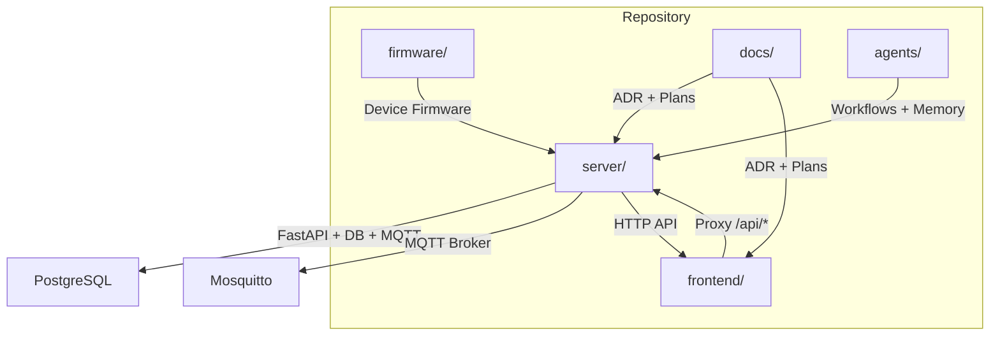
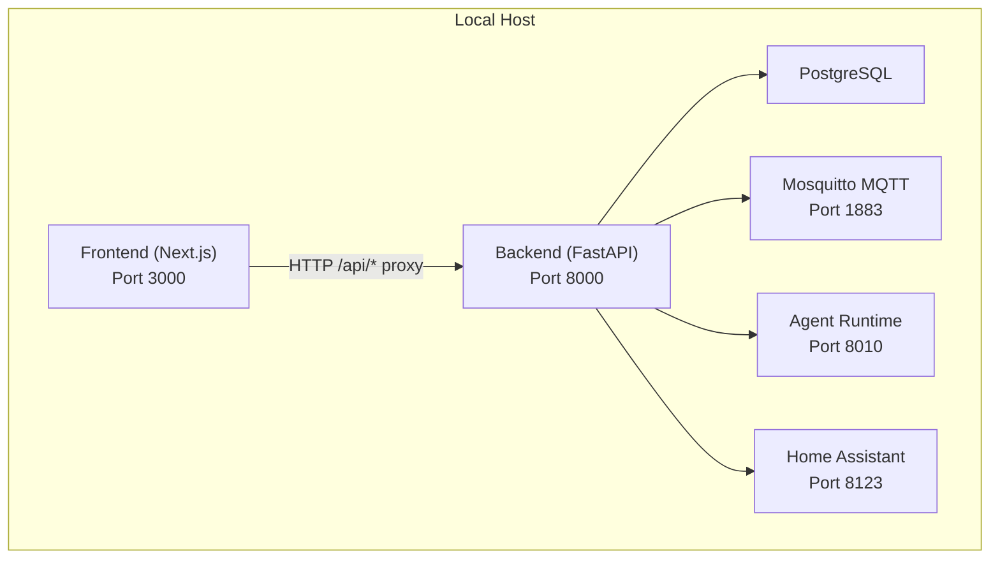
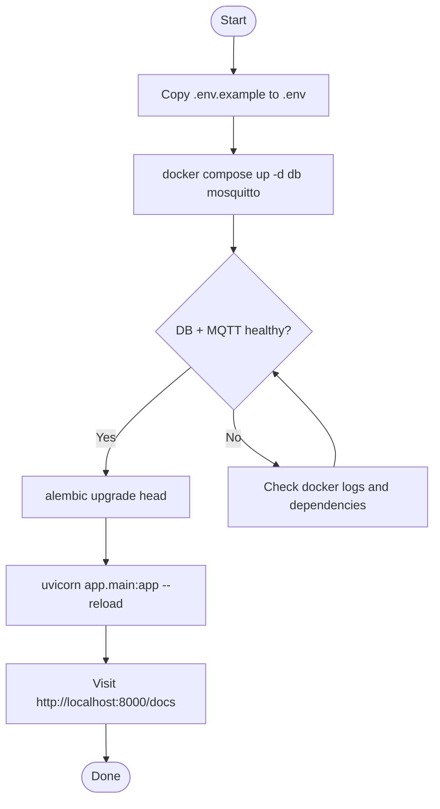
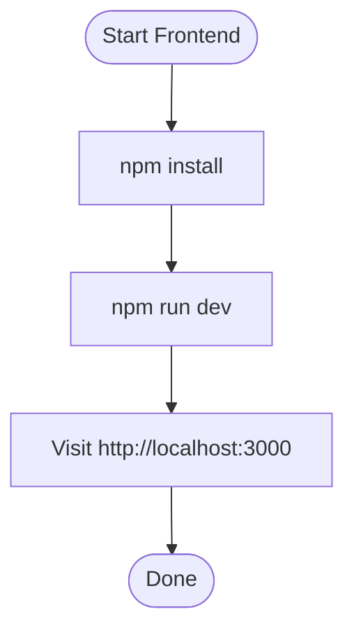
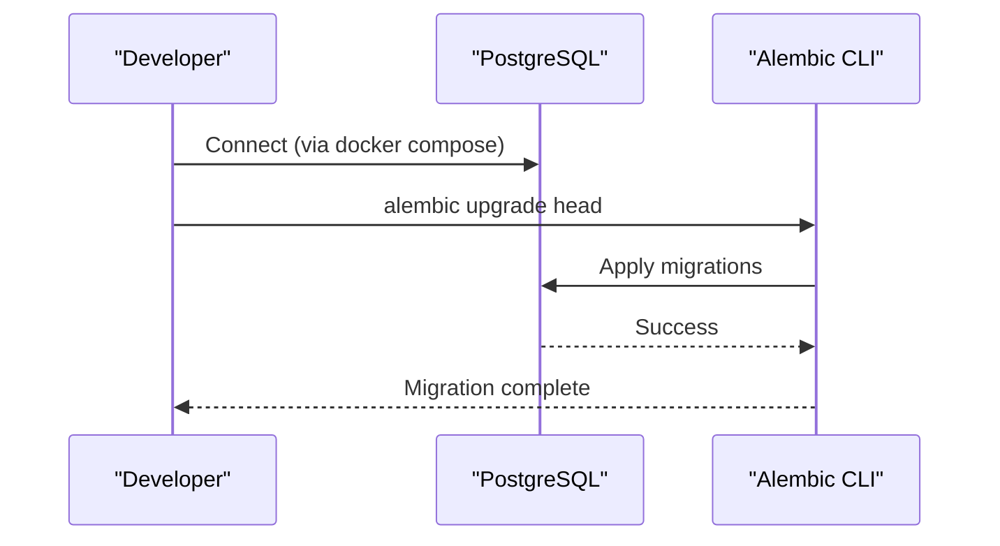
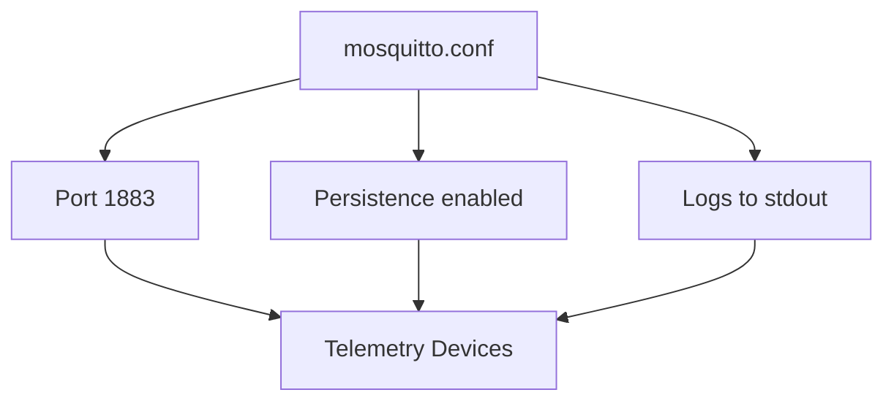
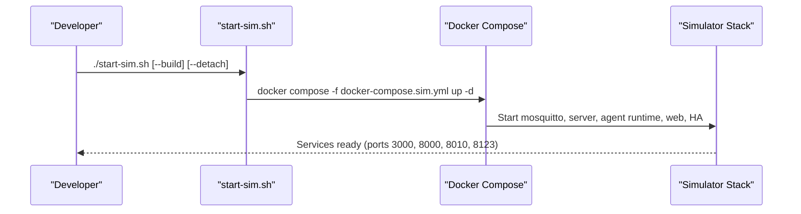
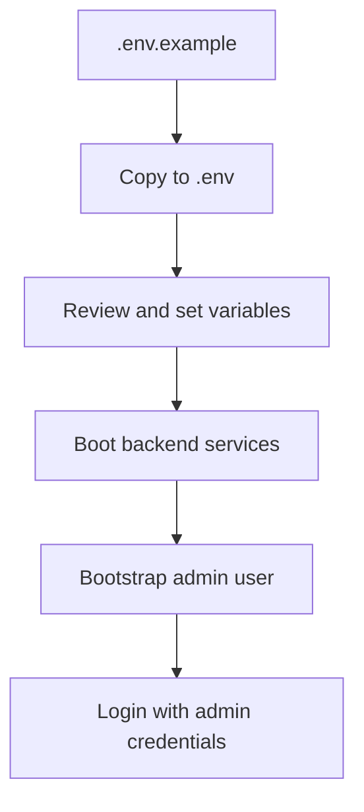
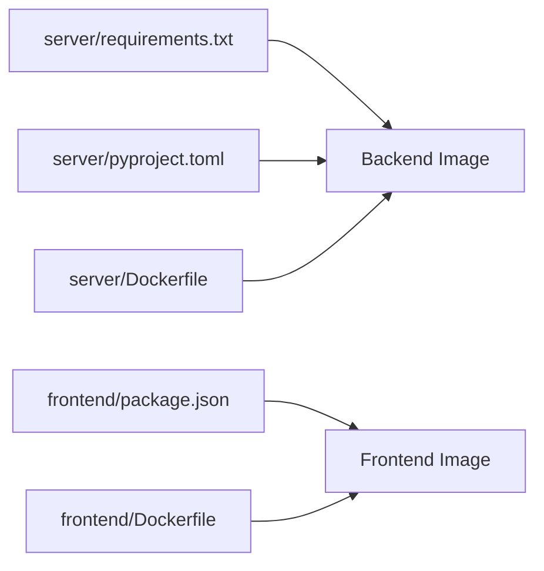

# Getting Started

<cite>
**Referenced Files in This Document**
- [README.md](file://README.md)
- [frontend/README.md](file://frontend/README.md)
- [server/docker-compose.yml](file://server/docker-compose.yml)
- [server/docker-compose.core.yml](file://server/docker-compose.core.yml)
- [server/docker-compose.sim.yml](file://server/docker-compose.sim.yml)
- [server/mosquitto.conf](file://server/mosquitto.conf)
- [server/.env.example](file://server/.env.example)
- [server/requirements.txt](file://server/requirements.txt)
- [server/pyproject.toml](file://server/pyproject.toml)
- [server/alembic.ini](file://server/alembic.ini)
- [server/scripts/start-sim.sh](file://server/scripts/start-sim.sh)
- [server/scripts/start-prod.sh](file://server/scripts/start-prod.sh)
- [frontend/Dockerfile](file://frontend/Dockerfile)
- [frontend/package.json](file://frontend/package.json)
</cite>

## Table of Contents
1. [Introduction](#introduction)
2. [Project Structure](#project-structure)
3. [Core Components](#core-components)
4. [Architecture Overview](#architecture-overview)
5. [Detailed Component Analysis](#detailed-component-analysis)
6. [Dependency Analysis](#dependency-analysis)
7. [Performance Considerations](#performance-considerations)
8. [Troubleshooting Guide](#troubleshooting-guide)
9. [Conclusion](#conclusion)
10. [Appendices](#appendices)

## Introduction
This guide helps you install and run the WheelSense Platform locally for development. It covers:
- Backend and frontend setup
- Docker prerequisites and environment configuration
- Database initialization and MQTT broker configuration
- Quick start commands for local development
- Optional synthetic MQTT simulator setup
- Project structure and source-of-truth ordering
- Environment variables and initial admin user creation
- Verification steps and troubleshooting tips

## Project Structure
The repository is organized into three main runtime areas:
- server/: FastAPI backend, PostgreSQL models, MQTT ingestion, AI/agent runtime, CLI, and integrations
- frontend/: Next.js 16 web app with role-based dashboards
- firmware/: PlatformIO firmware for devices and nodes

Source of truth ordering (recommended reading order):
1. Runtime code in server/, frontend/, and firmware/
2. server/AGENTS.md for backend architecture and operating rules
3. .agents/workflows/wheelsense.md for cross-agent workflow patterns
4. .cursor/* for Cursor-specific wrappers
5. docs/adr/* for architectural decisions
6. docs/plans/* and .agents/changes/* as planning/history, not runtime

**Section sources**
- [README.md:14-24](file://README.md#L14-L24)

## Core Components
- Backend (server)
  - FastAPI application with asynchronous SQLAlchemy, Alembic migrations, and MQTT ingestion
  - Agent runtime service for AI tool routing and chat actions
  - Home Assistant integration and MCP server
  - Docker Compose stack with Mosquitto MQTT, PostgreSQL, and optional simulator
- Frontend (frontend)
  - Next.js 16 App Router application with role-based dashboards
  - Proxy for API requests to the backend
  - UI primitives, TanStack Query for caching, and Zustand for auth state
- Firmware (firmware)
  - PlatformIO projects for M5StickCPlus2 and Node_Tsimcam
- Documentation and Agents
  - ADRs, plans, and workflow memory for context and evolution

**Section sources**
- [README.md:7-12](file://README.md#L7-L12)
- [frontend/README.md:1-23](file://frontend/README.md#L1-L23)

## Architecture Overview
The platform runs as a containerized stack with the backend and frontend communicating via a reverse proxy. MQTT is used for telemetry ingestion, and PostgreSQL stores domain data. The agent runtime provides AI tool routing and chat action orchestration.

**Diagram sources**
- [server/docker-compose.core.yml:5-143](file://server/docker-compose.core.yml#L5-L143)
- [frontend/README.md:44](file://frontend/README.md#L44)

**Section sources**
- [server/docker-compose.core.yml:5-143](file://server/docker-compose.core.yml#L5-L143)
- [frontend/README.md:41-51](file://frontend/README.md#L41-L51)

## Detailed Component Analysis

### Backend Setup (FastAPI + Database + MQTT)
- Prerequisites
  - Docker Engine and Docker Compose v2
  - Git clone of the repository
- Steps
  1. Copy environment example to .env and review settings
  2. Bring up database and MQTT broker
  3. Initialize database schema with Alembic
  4. Run the FastAPI server with hot reload
- Optional: run the full container stack with docker compose up -d --build
- Optional: synthetic MQTT simulator (wheelsense-simulator) with docker compose -f docker-compose.sim.yml up -d

**Diagram sources**
- [README.md:25-44](file://README.md#L25-L44)
- [server/docker-compose.core.yml:15-19](file://server/docker-compose.core.yml#L15-L19)

**Section sources**
- [README.md:25-44](file://README.md#L25-L44)
- [server/docker-compose.core.yml:5-143](file://server/docker-compose.core.yml#L5-L143)
- [server/alembic.ini:63](file://server/alembic.ini#L63)

### Frontend Setup (Next.js)
- Prerequisites
  - Node.js 20.x
  - npm
- Steps
  1. Install dependencies
  2. Start the development server
- The frontend proxies /api/* requests to the backend via app/api/[[...path]]/route.ts

**Diagram sources**
- [frontend/README.md:330-339](file://frontend/README.md#L330-L339)
- [frontend/package.json:5-12](file://frontend/package.json#L5-L12)

**Section sources**
- [frontend/README.md:330-339](file://frontend/README.md#L330-L339)
- [frontend/package.json:5-12](file://frontend/package.json#L5-L12)

### Database Initialization (Alembic)
- After bringing up the database service, run migrations to create tables
- Alembic configuration is provided in the server directory

**Diagram sources**
- [README.md:33](file://README.md#L33)
- [server/alembic.ini:63](file://server/alembic.ini#L63)

**Section sources**
- [README.md:33](file://README.md#L33)
- [server/alembic.ini:63](file://server/alembic.ini#L63)

### MQTT Broker Configuration
- Mosquitto is configured in the Compose stack and exposed on port 1883
- The broker allows anonymous access by default and persists data and logs

**Diagram sources**
- [server/mosquitto.conf:1-7](file://server/mosquitto.conf#L1-L7)

**Section sources**
- [server/mosquitto.conf:1-7](file://server/mosquitto.conf#L1-L7)
- [server/docker-compose.core.yml:6-19](file://server/docker-compose.core.yml#L6-L19)

### Optional Synthetic MQTT Simulator
- The simulator profile spins up a pre-populated demo environment with staff, rooms, and patients
- You can pin a workspace ID via SIM_WORKSPACE_ID in .env
- Use the provided start-sim.sh script for convenience

**Diagram sources**
- [server/scripts/start-sim.sh:1-134](file://server/scripts/start-sim.sh#L1-L134)
- [server/docker-compose.sim.yml:1-9](file://server/docker-compose.sim.yml#L1-L9)

**Section sources**
- [README.md:44](file://README.md#L44)
- [server/scripts/start-sim.sh:1-134](file://server/scripts/start-sim.sh#L1-L134)
- [server/docker-compose.sim.yml:1-9](file://server/docker-compose.sim.yml#L1-L9)

### Environment Variables and Initial Admin Account
- Copy .env.example to .env and adjust settings as needed
- Key variables include:
  - WHEELSENSE_ENV, POSTGRES_PASSWORD, MQTT_BROKER, MQTT_PORT, MQTT_USER, MQTT_PASSWORD
  - SECRET_KEY, BOOTSTRAP_ADMIN_* for initial admin setup
  - Optional: OLLAMA_BASE_URL, GITHUB_OAUTH_CLIENT_ID, SIM_WORKSPACE_ID
- Initial admin credentials are created by the backend on first boot when bootstrap is enabled

**Diagram sources**
- [server/.env.example:1-33](file://server/.env.example#L1-L33)

**Section sources**
- [server/.env.example:1-33](file://server/.env.example#L1-L33)
- [server/docker-compose.core.yml:47-51](file://server/docker-compose.core.yml#L47-L51)

## Dependency Analysis
- Backend dependencies are declared in requirements.txt and enforced by pyproject.toml (linting)
- Frontend dependencies are declared in package.json
- Dockerfiles define build stages for both backend and frontend

**Diagram sources**
- [server/requirements.txt:1-30](file://server/requirements.txt#L1-L30)
- [server/pyproject.toml:1-15](file://server/pyproject.toml#L1-L15)
- [frontend/package.json:1-58](file://frontend/package.json#L1-L58)
- [frontend/Dockerfile:1-31](file://frontend/Dockerfile#L1-L31)

**Section sources**
- [server/requirements.txt:1-30](file://server/requirements.txt#L1-L30)
- [server/pyproject.toml:1-15](file://server/pyproject.toml#L1-L15)
- [frontend/package.json:1-58](file://frontend/package.json#L1-L58)
- [frontend/Dockerfile:1-31](file://frontend/Dockerfile#L1-L31)

## Performance Considerations
- Use the simulator stack for rapid iteration during development
- For production-like performance, use the production Compose profile
- Keep frontend and backend container builds synchronized when changing shared components

## Troubleshooting Guide
Common issues and resolutions:
- Docker not running
  - Ensure Docker Engine and Docker Compose v2 are installed and running
- Port conflicts
  - Stop any running instances of the opposite environment (sim vs prod) before starting the other
- Database not initialized
  - Run alembic upgrade head after the database service is healthy
- MQTT connectivity issues
  - Verify Mosquitto is healthy and listening on port 1883
- Frontend proxy errors
  - Confirm the backend is reachable at http://localhost:8000 and the proxy is configured correctly
- Admin login problems
  - Check that bootstrap admin is enabled and the password is set appropriately in .env

Verification steps:
- Backend
  - Visit http://localhost:8000/docs to confirm API availability
  - Check container logs for any startup errors
- Frontend
  - Visit http://localhost:3000 and confirm login
  - Ensure /api/* requests are proxied to the backend
- Simulator
  - Use the simulator start script and confirm all services are up

**Section sources**
- [server/scripts/start-prod.sh:69-75](file://server/scripts/start-prod.sh#L69-L75)
- [server/scripts/start-sim.sh:70-88](file://server/scripts/start-sim.sh#L70-L88)
- [README.md:33](file://README.md#L33)
- [frontend/README.md:44](file://frontend/README.md#L44)

## Conclusion
You now have the essential steps to install and run the WheelSense Platform locally. Start with the backend services and database, then bring up the frontend. Optionally enable the synthetic MQTT simulator for a pre-populated demo environment. Use the verification steps to confirm everything is working, and consult the troubleshooting section if needed.

## Appendices

### Quick Start Commands
- Backend (local uvicorn)
  - cd server
  - copy .env.example .env
  - docker compose up -d db mosquitto
  - alembic upgrade head
  - uvicorn app.main:app --reload --host 0.0.0.0 --port 8000
- Backend (full container stack)
  - cd server
  - docker compose up -d --build
- Frontend
  - cd frontend
  - npm install
  - npm run dev

**Section sources**
- [README.md:25-54](file://README.md#L25-L54)

### Environment Variable Reference
- WHEELSENSE_ENV: simulation or production
- POSTGRES_PASSWORD: database password
- MQTT_BROKER, MQTT_PORT, MQTT_USER, MQTT_PASSWORD: MQTT connection settings
- SECRET_KEY: backend secret key
- BOOTSTRAP_ADMIN_*: initial admin creation and sync
- OLLAMA_BASE_URL: optional for local AI provider
- GITHUB_OAUTH_CLIENT_ID: optional for Copilot token connect
- SIM_WORKSPACE_ID: optional simulator workspace pinning
- COMPOSE_FILE: override default Compose file

**Section sources**
- [server/.env.example:1-33](file://server/.env.example#L1-L33)