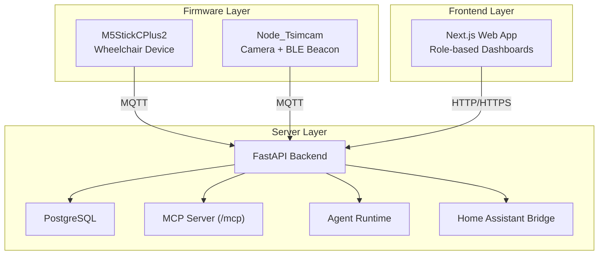
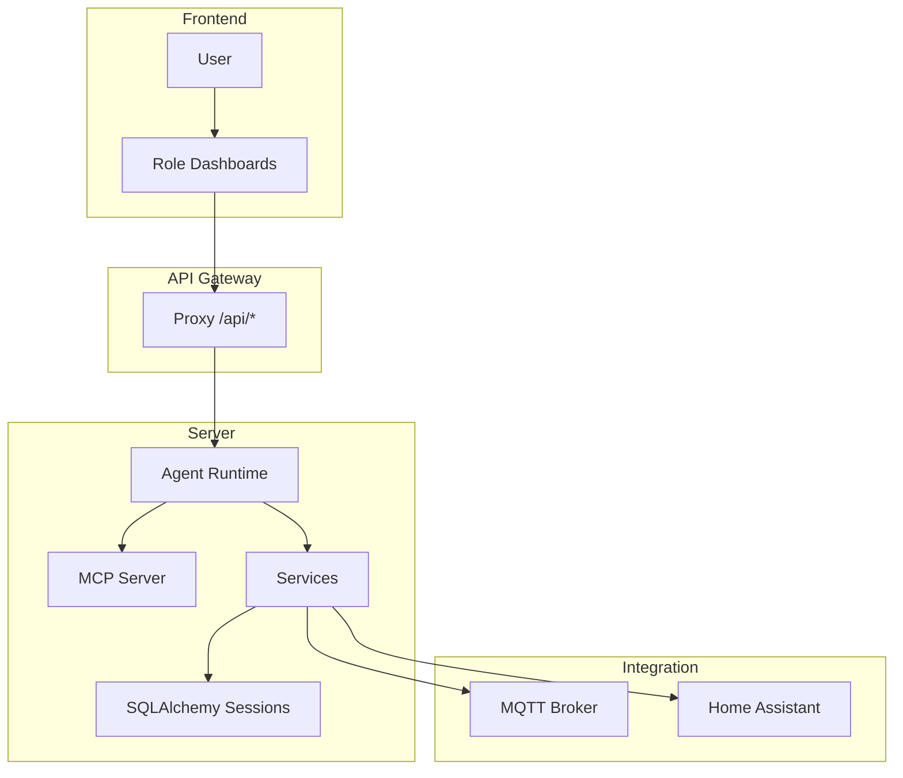
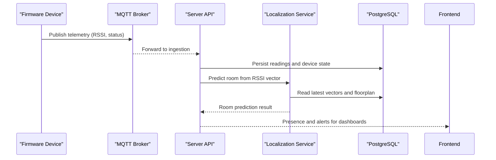
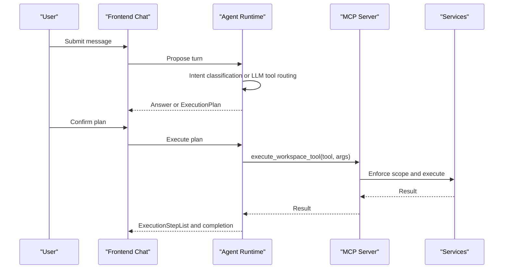
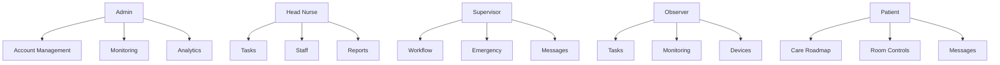
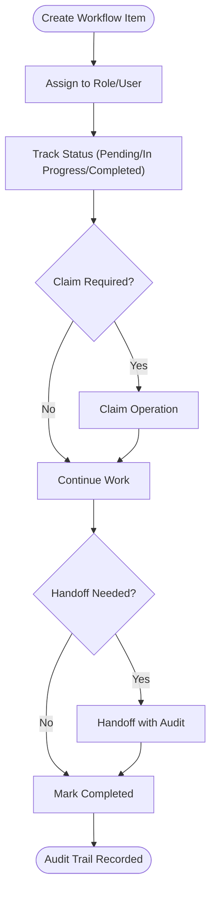
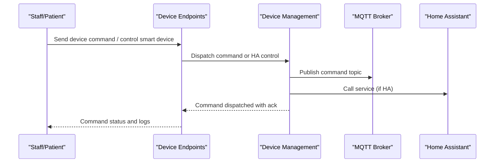
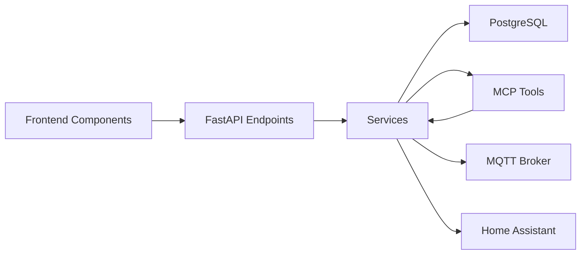

# Key Features

<cite>
**Referenced Files in This Document**
- [README.md](file://README.md)
- [ARCHITECTURE.md](file://docs/ARCHITECTURE.md)
- [server/app/mcp/server.py](file://server/app/mcp/server.py)
- [server/app/agent_runtime/service.py](file://server/app/agent_runtime/service.py)
- [server/app/api/endpoints/workflow.py](file://server/app/api/endpoints/workflow.py)
- [server/app/api/endpoints/devices.py](file://server/app/api/endpoints/devices.py)
- [server/app/api/endpoints/analytics.py](file://server/app/api/endpoints/analytics.py)
- [server/app/api/endpoints/homeassistant.py](file://server/app/api/endpoints/homeassistant.py)
- [server/app/services/localization_setup.py](file://server/app/services/localization_setup.py)
- [server/AGENTS.md](file://server/AGENTS.md)
- [frontend/components/dashboard/DashboardFloorplanPanel.tsx](file://frontend/components/dashboard/DashboardFloorplanPanel.tsx)
- [frontend/components/workflow/WorkflowTasksHubContent.tsx](file://frontend/components/workflow/WorkflowTasksHubContent.tsx)
</cite>

## Table of Contents
1. [Introduction](#introduction)
2. [Project Structure](#project-structure)
3. [Core Components](#core-components)
4. [Architecture Overview](#architecture-overview)
5. [Detailed Feature Analysis](#detailed-feature-analysis)
6. [Dependency Analysis](#dependency-analysis)
7. [Performance Considerations](#performance-considerations)
8. [Troubleshooting Guide](#troubleshooting-guide)
9. [Conclusion](#conclusion)

## Introduction
This document presents the WheelSense Platform’s key features with a focus on business value, technical implementation, and user interaction patterns. The platform integrates real-time wheelchair monitoring and room localization, a secure AI agent runtime with MCP integration, role-based dashboards, workflow orchestration and care task management, device fleet management with smart home integration, and analytics reporting. Practical workflows and integration scenarios are included to help operators, clinicians, and administrators adopt and operate the system effectively.

## Project Structure
The platform is organized into three primary runtime layers:
- Firmware layer: M5StickCPlus2 wheelchair device and Node_Tsimcam camera/beacon nodes publish telemetry and control signals over MQTT.
- Server layer: FastAPI backend with PostgreSQL models, MQTT ingestion, localization, MCP server, and AI agent runtime.
- Frontend layer: Next.js 16 role-based dashboards with role-aware UIs and secure cookie-based authentication.

**Diagram sources**
- [README.md:7-19](file://README.md#L7-L19)
- [ARCHITECTURE.md:3-21](file://docs/ARCHITECTURE.md#L3-L21)

**Section sources**
- [README.md:1-74](file://README.md#L1-L74)
- [ARCHITECTURE.md:1-275](file://docs/ARCHITECTURE.md#L1-L275)

## Core Components
- Real-time wheelchair monitoring and room localization: MQTT telemetry ingestion, RSSI-based room prediction, and floorplan presence rendering.
- Secure AI agent runtime with MCP integration: intent classification and LLM tool routing, with a first-party execution path and a public Streamable HTTP/SSE MCP endpoint.
- Role-based dashboards: admin, head nurse, supervisor, observer, and patient interfaces tailored to their responsibilities and access.
- Workflow orchestration and care task management: unified endpoints for schedules, tasks, directives, messaging, and audit trails.
- Device fleet management with smart home integration: device registry, commands, camera control, and Home Assistant device mapping.
- Analytics reporting: alert summaries, vitals averages, and ward-level statistics.

**Section sources**
- [ARCHITECTURE.md:23-275](file://docs/ARCHITECTURE.md#L23-L275)
- [server/app/mcp/server.py:1-2803](file://server/app/mcp/server.py#L1-L2803)
- [server/app/agent_runtime/service.py:1-561](file://server/app/agent_runtime/service.py#L1-L561)
- [server/app/api/endpoints/workflow.py:1-1013](file://server/app/api/endpoints/workflow.py#L1-L1013)
- [server/app/api/endpoints/devices.py:1-311](file://server/app/api/endpoints/devices.py#L1-L311)
- [server/app/api/endpoints/analytics.py:1-49](file://server/app/api/endpoints/analytics.py#L1-L49)
- [server/app/api/endpoints/homeassistant.py:1-255](file://server/app/api/endpoints/homeassistant.py#L1-L255)

## Architecture Overview
The MCP server exposes a protected tool registry and resources, with a first-party agent runtime orchestrating plan/ground/execute flows. The frontend proxies API calls and renders role-specific dashboards. Device telemetry and camera commands traverse MQTT to the server, which enforces workspace and role-based access.

**Diagram sources**
- [ARCHITECTURE.md:140-218](file://docs/ARCHITECTURE.md#L140-L218)
- [server/app/mcp/server.py:110-2803](file://server/app/mcp/server.py#L110-L2803)
- [server/app/agent_runtime/service.py:122-146](file://server/app/agent_runtime/service.py#L122-L146)

**Section sources**
- [ARCHITECTURE.md:23-184](file://docs/ARCHITECTURE.md#L23-L184)

## Detailed Feature Analysis

### Real-time Wheelchair Monitoring and Room Localization
- Business value: Continuous patient presence and room assignment visibility reduces manual tracking, improves safety, and enables proactive care.
- Technical implementation:
  - MQTT ingestion resolves device registrations and auto-registers BLE/CAM devices when configured.
  - RSSI-based room prediction uses the strongest signal to infer room location; a readiness flow ensures four invariants are satisfied (assignment, node alias, room binding, roster room).
  - Floorplan presence surfaces occupancy, alert counts, and device summaries for role dashboards.
- User interaction patterns:
  - Admins use monitoring dashboards to validate readiness and repair baselines.
  - Observers and supervisors monitor floor maps and respond to alerts.
  - Patient portals access room controls and personal vitals.

**Diagram sources**
- [server/AGENTS.md:48-58](file://server/AGENTS.md#L48-L58)
- [server/app/services/localization_setup.py:330-557](file://server/app/services/localization_setup.py#L330-L557)

Practical examples:
- Admin readiness check: Repair missing facility/floor/room/node bindings and reset strategy to max_rssi.
- Observer monitoring: View floor map occupancy and active alerts; drill into room details.

**Section sources**
- [server/AGENTS.md:48-58](file://server/AGENTS.md#L48-L58)
- [server/app/services/localization_setup.py:330-557](file://server/app/services/localization_setup.py#L330-L557)
- [ARCHITECTURE.md:164-220](file://docs/ARCHITECTURE.md#L164-L220)

### Secure AI Agent Runtime with MCP Integration
- Business value: Intelligent, role-aware assistance for clinical tasks, device control, and triage without bypassing access policies.
- Technical implementation:
  - MCP server mounts at /mcp with Streamable HTTP and SSE compatibility; tools and resources are scope-enforced.
  - Agent runtime supports intent classification and LLM tool routing; first-party execution path uses actor context derived from JWT.
  - Three-stage chat action flow: propose (plan or answer), confirm (user approval), execute (MCP tool invocation).
- User interaction patterns:
  - Users engage the AI chat; the runtime selects the best route (intent classification or LLM tool router) and surfaces a plan requiring confirmation.
  - After confirmation, the plan executes via MCP tools with real-time feedback.

**Diagram sources**
- [ARCHITECTURE.md:81-127](file://docs/ARCHITECTURE.md#L81-L127)
- [server/app/agent_runtime/service.py:346-520](file://server/app/agent_runtime/service.py#L346-L520)
- [server/app/mcp/server.py:113-133](file://server/app/mcp/server.py#L113-L133)

Practical examples:
- Clinical triage assistant: Summarize active alerts and visible patients; propose targeted actions with permission basis.
- Device control assistant: Validate scope and describe exact command before execution.

**Section sources**
- [ARCHITECTURE.md:23-127](file://docs/ARCHITECTURE.md#L23-L127)
- [server/app/agent_runtime/service.py:1-561](file://server/app/agent_runtime/service.py#L1-L561)
- [server/app/mcp/server.py:1-2803](file://server/app/mcp/server.py#L1-L2803)

### Role-based Dashboards
- Business value: Tailored interfaces reduce cognitive load and ensure appropriate access for each role.
- Technical implementation:
  - Cookie-based authentication with ws_token; protected routes enforce role and workspace scope.
  - Role-specific pages for admin, head nurse, supervisor, observer, and patient; sidebar navigation and tabbed hubs.
  - Shared components (e.g., FloorplanRoleViewer) render role-aware floor maps and presence.
- User interaction patterns:
  - Admins manage users, devices, facilities, and view analytics.
  - Head nurses coordinate tasks, review staff rosters, and manage directives.
  - Supervisors oversee workflows, messages, and emergency queues.
  - Observers track tasks, schedules, and room monitoring.
  - Patients access vitals, room controls, pharmacy, and messaging.

**Diagram sources**
- [ARCHITECTURE.md:185-220](file://docs/ARCHITECTURE.md#L185-L220)
- [frontend/components/dashboard/DashboardFloorplanPanel.tsx:1-30](file://frontend/components/dashboard/DashboardFloorplanPanel.tsx#L1-L30)

Practical examples:
- Head nurse dashboard: Kanban board for tasks, staff member sheet, and room overview.
- Observer monitoring: Live floor map with alert counts and room capture capability.

**Section sources**
- [ARCHITECTURE.md:185-220](file://docs/ARCHITECTURE.md#L185-L220)
- [frontend/components/dashboard/DashboardFloorplanPanel.tsx:1-30](file://frontend/components/dashboard/DashboardFloorplanPanel.tsx#L1-L30)

### Workflow Orchestration and Care Task Management
- Business value: Unified, auditable workflows improve care coordination, reduce handoff errors, and maintain compliance.
- Technical implementation:
  - Unified endpoints for schedules, tasks, directives, and messaging with role-based access and visibility rules.
  - Audit trail captures changes; claim and handoff operations maintain continuity.
  - Frontend provides Kanban, calendar, and list views for tasks; integrates with scheduling and job workflows.
- User interaction patterns:
  - Create tasks/schedules/directives; assign and track status.
  - Claim items and hand off to peers with audit trail.
  - Use messaging with optional attachments for workflow collaboration.

**Diagram sources**
- [server/app/api/endpoints/workflow.py:110-800](file://server/app/api/endpoints/workflow.py#L110-L800)
- [frontend/components/workflow/WorkflowTasksHubContent.tsx:1-569](file://frontend/components/workflow/WorkflowTasksHubContent.tsx#L1-L569)

Practical examples:
- Observer creates a task for an assigned patient and marks it in progress or completed.
- Supervisor claims a task and hands it off to another role with a note.

**Section sources**
- [server/app/api/endpoints/workflow.py:1-1013](file://server/app/api/endpoints/workflow.py#L1-L1013)
- [frontend/components/workflow/WorkflowTasksHubContent.tsx:1-569](file://frontend/components/workflow/WorkflowTasksHubContent.tsx#L1-L569)

### Device Fleet Management with Smart Home Integration
- Business value: Centralized device control and visibility streamline maintenance and room operations.
- Technical implementation:
  - Device registry with role-based managers; commands are dispatched via MQTT with activity logging.
  - Camera control endpoints trigger captures and stream commands; patient-scoped access enforced.
  - Home Assistant integration maps workspace smart devices; staff and patients control devices within allowed scope.
- User interaction patterns:
  - Admin/head nurse register and configure devices; dispatch commands and review activity logs.
  - Staff control room devices; patients control devices in their room.

**Diagram sources**
- [server/app/api/endpoints/devices.py:63-311](file://server/app/api/endpoints/devices.py#L63-L311)
- [server/app/api/endpoints/homeassistant.py:65-255](file://server/app/api/endpoints/homeassistant.py#L65-L255)

Practical examples:
- Admin registers a camera and triggers a photo capture.
- Observer controls a light in a patient’s room via Home Assistant.

**Section sources**
- [server/app/api/endpoints/devices.py:1-311](file://server/app/api/endpoints/devices.py#L1-L311)
- [server/app/api/endpoints/homeassistant.py:1-255](file://server/app/api/endpoints/homeassistant.py#L1-L255)

### Analytics Reporting
- Business value: Data-driven insights improve safety metrics, resource allocation, and quality measures.
- Technical implementation:
  - Analytics endpoints provide alert summaries, vitals averages, and ward-level statistics.
  - Access is role-scoped to authorized roles.
- User interaction patterns:
  - Supervisors and head nurses review summaries to assess trends and outcomes.

Practical examples:
- Head nurse views ward summary to evaluate occupancy and alert trends.
- Supervisor reviews vitals averages over a configurable window.

**Section sources**
- [server/app/api/endpoints/analytics.py:1-49](file://server/app/api/endpoints/analytics.py#L1-L49)
- [ARCHITECTURE.md:240-267](file://docs/ARCHITECTURE.md#L240-L267)

## Dependency Analysis
The system exhibits clear separation of concerns:
- Frontend depends on the backend proxy and role-specific UI components.
- Backend services depend on SQLAlchemy sessions, MCP tools, and MQTT/Home Assistant integrations.
- MCP tools depend on actor context and scope enforcement.

**Diagram sources**
- [ARCHITECTURE.md:140-184](file://docs/ARCHITECTURE.md#L140-L184)
- [server/app/mcp/server.py:1-2803](file://server/app/mcp/server.py#L1-L2803)

**Section sources**
- [ARCHITECTURE.md:140-184](file://docs/ARCHITECTURE.md#L140-L184)
- [server/app/mcp/server.py:1-2803](file://server/app/mcp/server.py#L1-L2803)

## Performance Considerations
- MQTT ingestion and caching: Minimize repeated reads by leveraging recent telemetry vectors and floorplan caches.
- MCP routing: Prefer intent classification for high-confidence read-only tools to avoid unnecessary plan confirmation loops.
- Frontend caching: Use TanStack Query with explicit keys and appropriate stale/refetch intervals to balance freshness and performance.
- Device command batching: Group commands where feasible to reduce MQTT traffic.

[No sources needed since this section provides general guidance]

## Troubleshooting Guide
Common issues and resolutions:
- MCP scope errors: Verify actor context and effective scopes; ensure tokens are issued with correct roles and requested scopes.
- Device command failures: Check MQTT connectivity, device registration, and workspace/device assignments; review device activity logs.
- Localization readiness: Use readiness endpoints to validate assignment, node alias, room binding, and roster room; repair missing links.
- Home Assistant integration: Confirm token configuration and entity mapping; verify device activation and room scoping.

**Section sources**
- [server/app/mcp/server.py:113-133](file://server/app/mcp/server.py#L113-L133)
- [server/app/api/endpoints/devices.py:53-61](file://server/app/api/endpoints/devices.py#L53-L61)
- [server/AGENTS.md:48-58](file://server/AGENTS.md#L48-L58)
- [server/app/api/endpoints/homeassistant.py:187-255](file://server/app/api/endpoints/homeassistant.py#L187-L255)

## Conclusion
The WheelSense Platform delivers a cohesive, secure, and scalable solution for real-time wheelchair monitoring, intelligent AI assistance, role-based dashboards, workflow orchestration, device fleet management, and analytics. Its MCP-first architecture and strict scope enforcement ensure safe, auditable operations while enabling flexible integrations with MQTT and Home Assistant. The documented workflows and integration patterns provide a clear path for adoption across administrative, clinical, and patient roles.