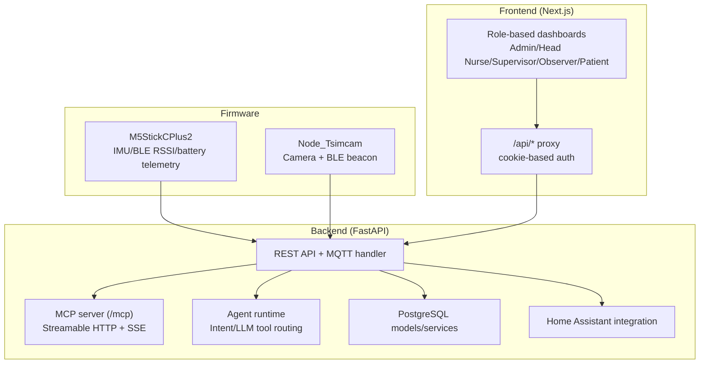
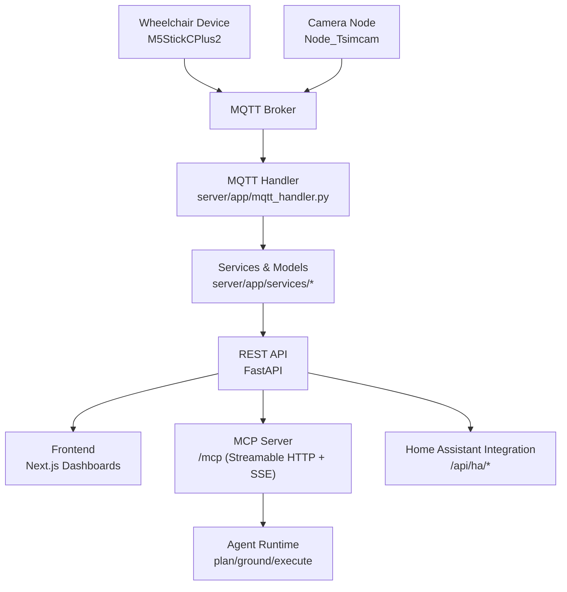
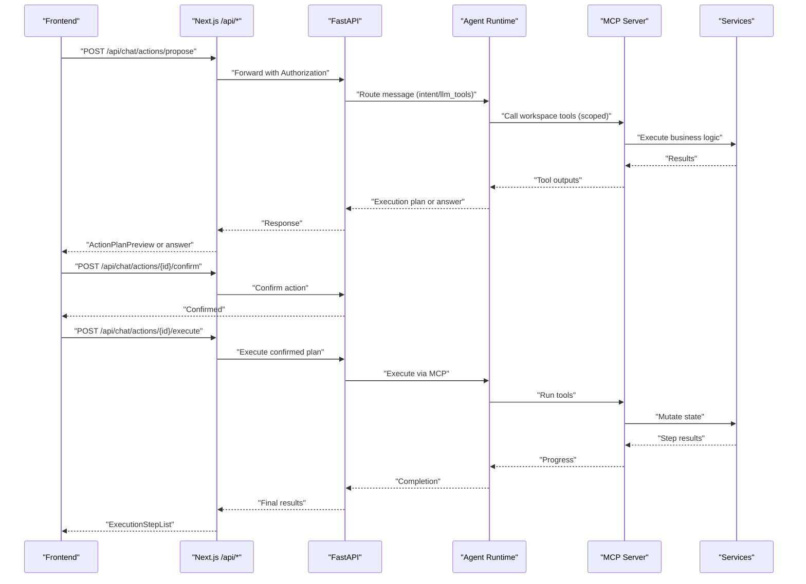
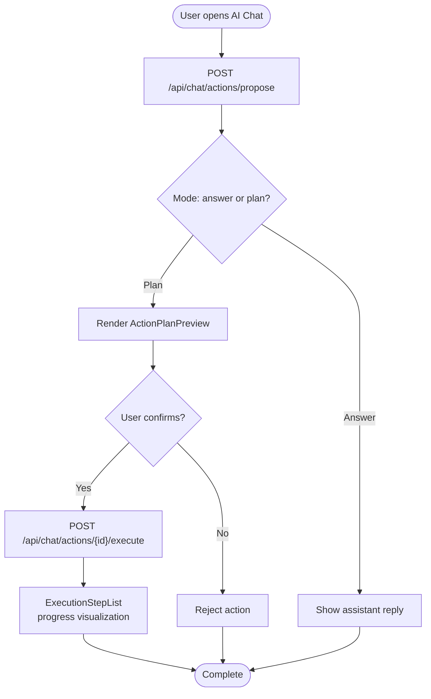
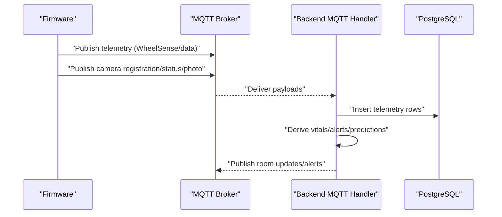
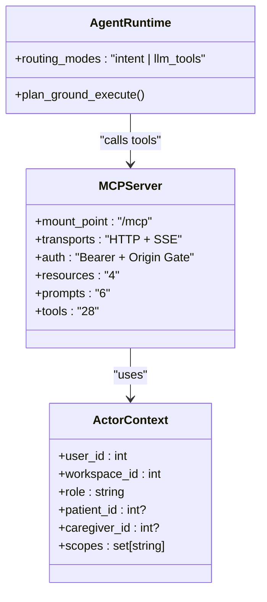
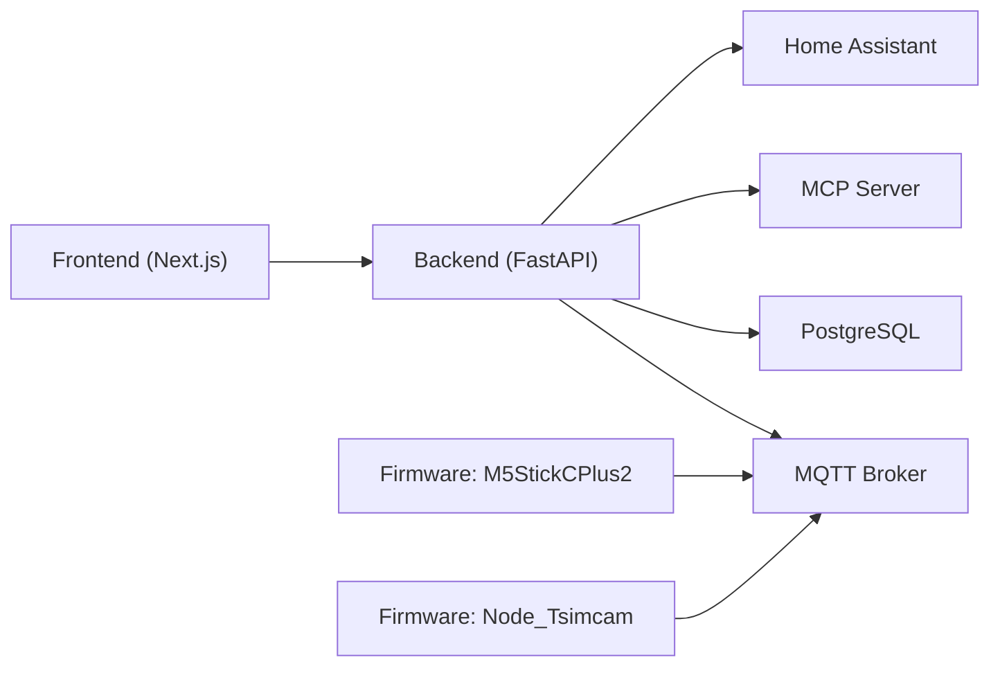

# Project Overview

<cite>
**Referenced Files in This Document**
- [README.md](file://README.md)
- [ARCHITECTURE.md](file://ARCHITECTURE.md)
- [server/AGENTS.md](file://server/AGENTS.md)
- [server/docker-compose.yml](file://server/docker-compose.yml)
- [server/pyproject.toml](file://server/pyproject.toml)
- [frontend/README.md](file://frontend/README.md)
- [frontend/package.json](file://frontend/package.json)
- [firmware/M5StickCPlus2/platformio.ini](file://firmware/M5StickCPlus2/platformio.ini)
- [docs/adr/README.md](file://docs/adr/README.md)
- [docs/adr/0001-fastmcp-sse-for-ai-integration.md](file://docs/adr/0001-fastmcp-sse-for-ai-integration.md)
- [docs/adr/0003-facility-hierarchy-for-spatial-model.md](file://docs/adr/0003-facility-hierarchy-for-spatial-model.md)
- [docs/adr/0008-workflow-domains-for-role-operations.md](file://docs/adr/0008-workflow-domains-for-role-operations.md)
</cite>

## Table of Contents
1. [Introduction](#introduction)
2. [Project Structure](#project-structure)
3. [Core Components](#core-components)
4. [Architecture Overview](#architecture-overview)
5. [Detailed Component Analysis](#detailed-component-analysis)
6. [Dependency Analysis](#dependency-analysis)
7. [Performance Considerations](#performance-considerations)
8. [Troubleshooting Guide](#troubleshooting-guide)
9. [Conclusion](#conclusion)

## Introduction
WheelSense is an IoT + clinical workflow platform designed to monitor wheelchairs, localize patients within healthcare facilities, streamline care workflows, control smart devices, and deliver role-based web dashboards. The platform integrates hardware telemetry, AI-assisted operations, and secure, workspace-scoped workflows to improve safety, efficiency, and care coordination in healthcare environments.

Key value propositions:
- Real-time wheelchair and patient localization using RSSI and IMU telemetry
- Secure AI integration via MCP (Model Context Protocol) with role-based tooling and OAuth scope control
- Unified role-based dashboards for administrators, head nurses, supervisors, observers, and patients
- Device fleet management, camera/photo workflows, and Home Assistant integration
- Scalable, containerized runtime with configurable environments for development and production

Target audience:
- Healthcare facilities including nursing homes, rehabilitation centers, and specialized wards requiring continuous patient monitoring and coordinated care.

Competitive advantages:
- Integrated IoT-to-clinical pipeline with MQTT ingestion, ML localization, and MCP-powered AI assistance
- Strong workspace and role-based access control ensuring data privacy and operational boundaries
- Extensible firmware and modular backend services supporting future device and workflow domains
- Practical, role-aligned UIs with standardized workflows and audit trails

## Project Structure
The repository is organized into three primary runtime layers:
- Firmware: Arduino-based devices for wheelchair telemetry and camera/beacon nodes
- Backend: FastAPI application with PostgreSQL, MQTT ingestion, AI/MCP runtime, and workflow domains
- Frontend: Next.js 16 role-based dashboards with secure proxy to backend APIs

**Diagram sources**
- [ARCHITECTURE.md:3-21](file://ARCHITECTURE.md#L3-L21)
- [server/AGENTS.md:34-46](file://server/AGENTS.md#L34-L46)
- [frontend/README.md:24-51](file://frontend/README.md#L24-L51)

**Section sources**
- [README.md:1-74](file://README.md#L1-L74)
- [ARCHITECTURE.md:3-21](file://ARCHITECTURE.md#L3-L21)
- [server/docker-compose.yml:1-10](file://server/docker-compose.yml#L1-L10)

## Core Components
- Backend (FastAPI)
  - REST endpoints for devices, vitals, alerts, workflow, analytics, and AI settings
  - MQTT ingestion and publishing for telemetry, camera photos, and room predictions
  - MCP server mounted at /mcp with Streamable HTTP and SSE compatibility
  - Agent runtime orchestrating plan/ground/execute flows with intent classification or LLM tool routing
  - PostgreSQL models and Alembic migrations for domain schemas
- Frontend (Next.js)
  - Role-based dashboards with secure cookie-based authentication and proxy to backend
  - Standardized UI patterns for tasks, workflows, floorplan maps, and notifications
  - AI chat popup with 3-stage propose-confirm-execute action flow
- Firmware
  - M5StickCPlus2: IMU, motion, RSSI, and battery telemetry published over MQTT
  - Node_Tsimcam: camera registration/status/photo ingestion and BLE beacon metadata

**Section sources**
- [server/AGENTS.md:9-21](file://server/AGENTS.md#L9-L21)
- [frontend/README.md:1-374](file://frontend/README.md#L1-L374)
- [firmware/M5StickCPlus2/platformio.ini:1-22](file://firmware/M5StickCPlus2/platformio.ini#L1-L22)

## Architecture Overview
The system architecture couples hardware telemetry, backend services, AI/MCP orchestration, and role-based dashboards. Data flows from devices to MQTT, processed by the backend, and surfaced to the frontend and AI runtime.

**Diagram sources**
- [server/AGENTS.md:322-341](file://server/AGENTS.md#L322-L341)
- [ARCHITECTURE.md:3-21](file://ARCHITECTURE.md#L3-L21)

**Section sources**
- [server/AGENTS.md:34-46](file://server/AGENTS.md#L34-L46)
- [ARCHITECTURE.md:23-111](file://ARCHITECTURE.md#L23-L111)

## Detailed Component Analysis

### Backend: FastAPI, Services, and MCP
- REST API surface covers authentication, workspace/user management, devices/telemetry, vitals/alerts, workflow, analytics, and AI settings
- MQTT ingestion resolves registered devices, writes telemetry rows, and triggers derived flows (e.g., room prediction)
- MCP server provides 28 workspace tools across domains (patients, devices, alerts, workflow, rooms, messaging, AI settings) with role-based prompts and OAuth scope narrowing
- Agent runtime orchestrates intent classification or LLM tool routing, generates execution plans, and executes via MCP with user context

**Diagram sources**
- [ARCHITECTURE.md:93-111](file://ARCHITECTURE.md#L93-L111)
- [server/AGENTS.md:402-425](file://server/AGENTS.md#L402-L425)

**Section sources**
- [server/AGENTS.md:126-291](file://server/AGENTS.md#L126-L291)
- [ARCHITECTURE.md:23-111](file://ARCHITECTURE.md#L23-L111)

### Frontend: Role-Based Dashboards and AI Chat
- Next.js 16 with App Router, cookie-based auth, and a canonical /api/* proxy to the backend
- Role-aware sidebar, hub tabs, and standardized components for tasks, workflows, floorplan maps, and notifications
- AI chat popup with 3-stage flow: propose (intent or LLM tool routing), confirm, and execute with step-by-step progress

**Diagram sources**
- [frontend/README.md:199-330](file://frontend/README.md#L199-L330)
- [ARCHITECTURE.md:93-111](file://ARCHITECTURE.md#L93-L111)

**Section sources**
- [frontend/README.md:1-374](file://frontend/README.md#L1-L374)

### Firmware: M5StickCPlus2 and Node_Tsimcam
- M5StickCPlus2 publishes IMU, motion, RSSI, and battery telemetry over MQTT
- Node_Tsimcam publishes camera registration/status and photo chunks, along with BLE beacon metadata
- Topics and device control semantics are defined for telemetry ingestion and command acknowledgements

**Diagram sources**
- [server/AGENTS.md:322-341](file://server/AGENTS.md#L322-L341)
- [firmware/M5StickCPlus2/platformio.ini:1-22](file://firmware/M5StickCPlus2/platformio.ini#L1-L22)

**Section sources**
- [server/AGENTS.md:322-357](file://server/AGENTS.md#L322-L357)
- [firmware/M5StickCPlus2/platformio.ini:1-22](file://firmware/M5StickCPlus2/platformio.ini#L1-L22)

### AI/MCP Integration and Security
- MCP server mounted at /mcp with Streamable HTTP primary and SSE compatibility
- Authentication via bearer tokens with same JWT/session model as REST APIs; optional origin gating
- OAuth scope narrowing for remote clients; protected resource metadata discovery
- Actor context includes user_id, workspace_id, role, patient_id, caregiver_id, and effective scopes
- 28 workspace tools across domains; 6 role-based prompts; 4 MCP resources for live data

**Diagram sources**
- [ARCHITECTURE.md:27-80](file://ARCHITECTURE.md#L27-L80)
- [server/AGENTS.md:426-466](file://server/AGENTS.md#L426-L466)

**Section sources**
- [ARCHITECTURE.md:23-127](file://ARCHITECTURE.md#L23-L127)
- [server/AGENTS.md:426-486](file://server/AGENTS.md#L426-L486)

## Dependency Analysis
- Core technologies
  - Backend: FastAPI, PostgreSQL, Alembic, MQTT, Docker Compose
  - Frontend: Next.js 16, React 19, TanStack Query, shadcn UI primitives
  - Firmware: Arduino framework, PubSubClient, ArduinoJson on ESP32
- Runtime dependencies
  - Backend depends on MQTT for ingestion and publishing, PostgreSQL for persistence, and MCP for AI tooling
  - Frontend depends on backend REST APIs and the /api/* proxy for secure cookie-based auth
  - Firmware depends on MQTT broker connectivity and device-specific libraries

**Diagram sources**
- [server/docker-compose.yml:1-10](file://server/docker-compose.yml#L1-L10)
- [frontend/package.json:1-58](file://frontend/package.json#L1-L58)
- [server/pyproject.toml:1-15](file://server/pyproject.toml#L1-L15)

**Section sources**
- [server/docker-compose.yml:1-10](file://server/docker-compose.yml#L1-L10)
- [frontend/package.json:1-58](file://frontend/package.json#L1-L58)
- [server/pyproject.toml:1-15](file://server/pyproject.toml#L1-L15)

## Performance Considerations
- Containerized runtime with isolated volumes for simulator and production modes; choose appropriate compose entry for environment
- MQTT ingestion and localization computations occur in the backend; ensure adequate CPU/memory for concurrent device streams and MCP tool execution
- Frontend caching via TanStack Query reduces redundant API calls; tune staleTime/refetchInterval per endpoint
- AI routing modes (intent vs llm_tools) impact latency; configure appropriately for staging and production

[No sources needed since this section provides general guidance]

## Troubleshooting Guide
- Environment modes
  - Use docker-compose.sim.yml for pre-seeded simulator data; use docker-compose.yml for production DB mode
  - Verify ENV_MODE and simulator status via /api/demo/simulator/status
- Authentication and sessions
  - Cookie-based auth via ws_token; ensure proxy injects Authorization and clears cookies on 401
  - Session tracking via backend auth sessions; revoke or expire sessions as needed
- MCP and AI
  - Confirm MCP server is mounted at /mcp with Streamable HTTP and SSE compatibility
  - Validate OAuth scope narrowing and actor context propagation
- Device and telemetry
  - Verify MQTT topics and device registrations; auto-registration behavior depends on settings
  - Check device activity logs and room prediction readiness

**Section sources**
- [server/AGENTS.md:72-111](file://server/AGENTS.md#L72-L111)
- [frontend/README.md:41-51](file://frontend/README.md#L41-L51)
- [ARCHITECTURE.md:128-139](file://ARCHITECTURE.md#L128-L139)

## Conclusion
WheelSense delivers a cohesive IoT + clinical workflow platform integrating hardware telemetry, secure AI/MCP orchestration, and role-based dashboards. Its modular architecture, strong access controls, and scalable runtime make it suitable for healthcare facilities seeking improved patient monitoring, care coordination, and operational insights. The platform’s documented ADRs and evolving frontend/backend contracts provide a clear path for continued development and deployment.