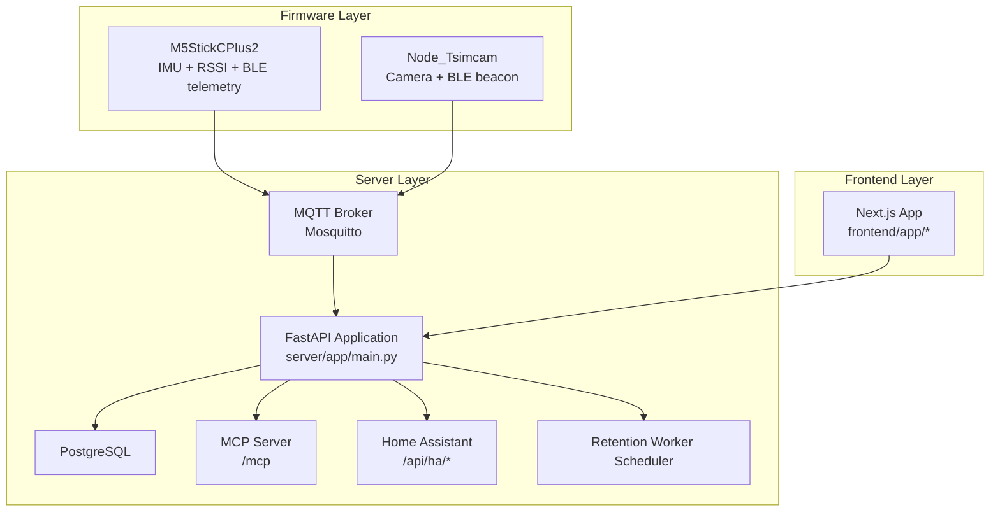
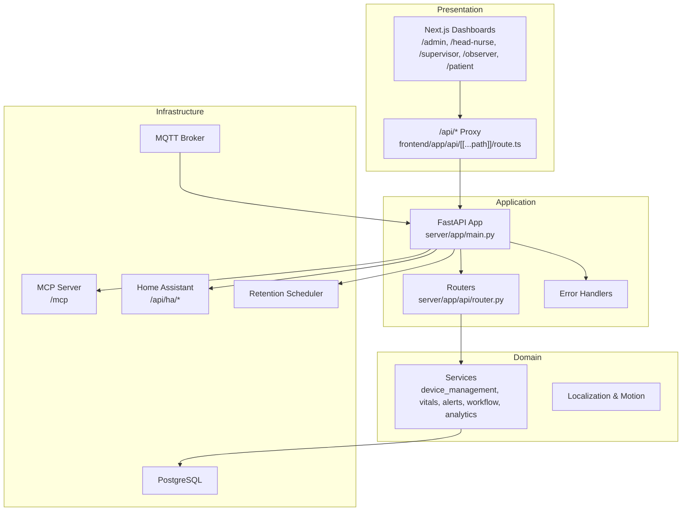
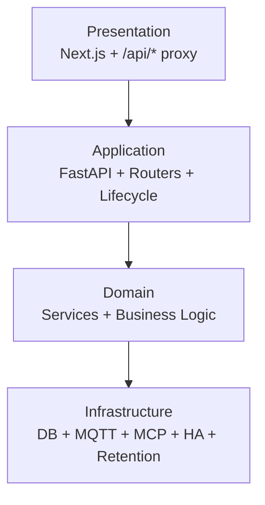
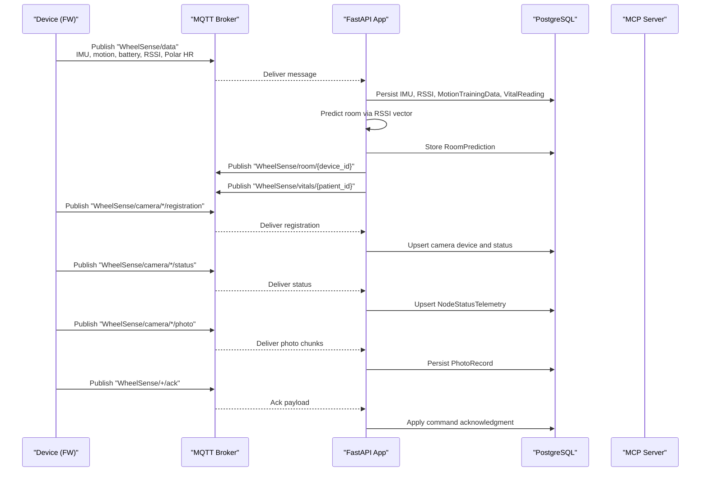
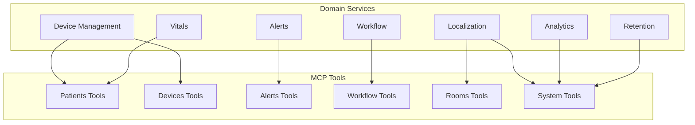
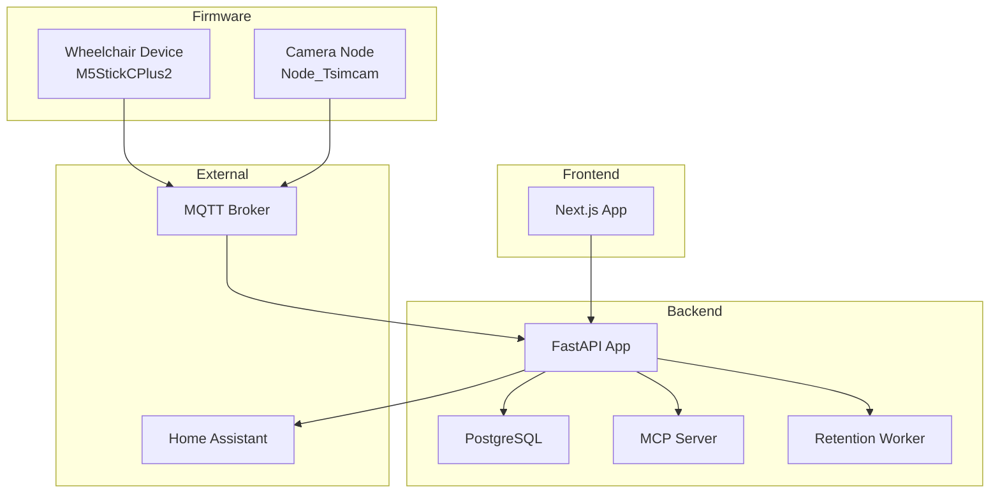
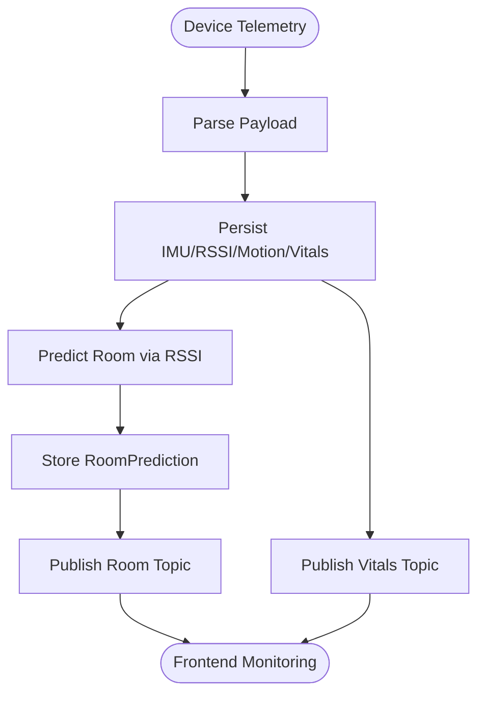
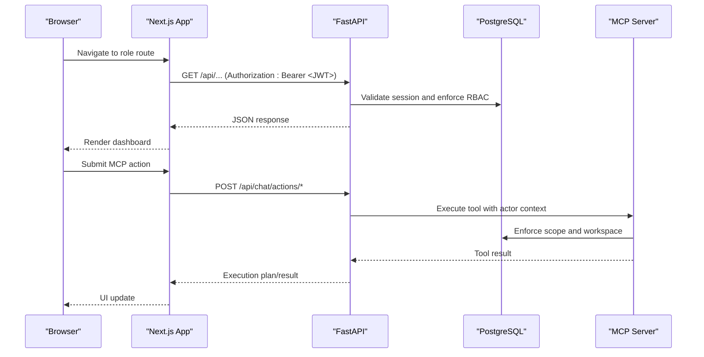
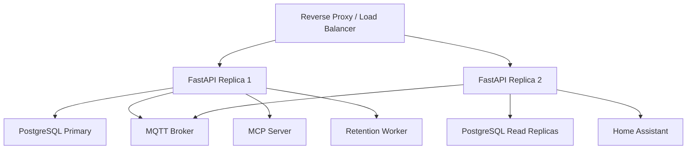
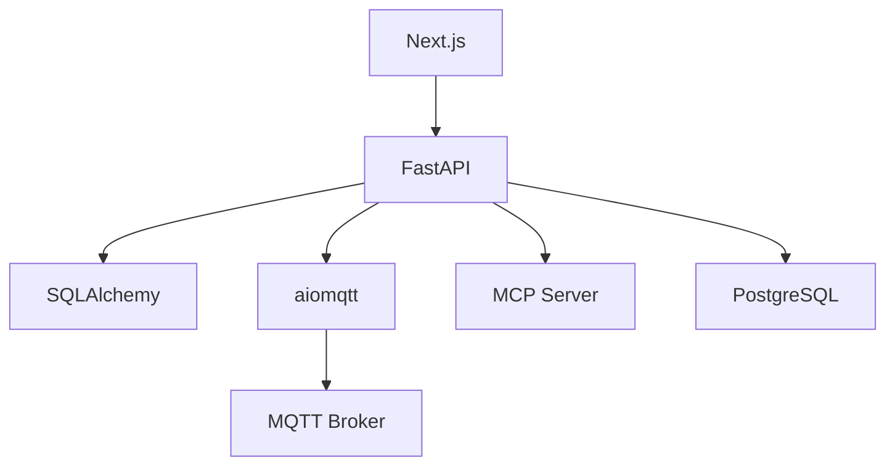

# System Architecture

<cite>
**Referenced Files in This Document**
- [ARCHITECTURE.md](file://docs/ARCHITECTURE.md)
- [README.md](file://README.md)
- [server/app/main.py](file://server/app/main.py)
- [server/app/mqtt_handler.py](file://server/app/mqtt_handler.py)
- [server/app/mcp/server.py](file://server/app/mcp/server.py)
- [server/app/api/router.py](file://server/app/api/router.py)
- [server/app/config.py](file://server/app/config.py)
- [server/docker-compose.yml](file://server/docker-compose.yml)
- [server/homeassistant/configuration.yaml](file://server/homeassistant/configuration.yaml)
- [docs/adr/README.md](file://docs/adr/README.md)
</cite>

## Table of Contents
1. [Introduction](#introduction)
2. [Project Structure](#project-structure)
3. [Core Components](#core-components)
4. [Architecture Overview](#architecture-overview)
5. [Detailed Component Analysis](#detailed-component-analysis)
6. [Dependency Analysis](#dependency-analysis)
7. [Performance Considerations](#performance-considerations)
8. [Troubleshooting Guide](#troubleshooting-guide)
9. [Conclusion](#conclusion)
10. [Appendices](#appendices)

## Introduction
This document describes the WheelSense Platform system architecture. The platform is an IoT and clinical workflow system that monitors wheelchair patients, projects room presence, orchestrates workflows, controls smart devices, and exposes role-based dashboards. It follows a layered architecture with presentation, application, domain, and infrastructure layers, augmented by an event-driven design powered by MQTT for device telemetry and camera data. Microservices and domain-driven design principles guide the backend services, while the frontend is a Next.js application with role-based dashboards. Security boundaries and integration points are defined, along with scalability and deployment topology considerations.

## Project Structure
The repository is organized into three primary runtime layers and supporting documentation:
- Firmware layer: device firmware for wheelchair and camera nodes publishing telemetry and camera frames over MQTT.
- Server layer: FastAPI backend with PostgreSQL models, MQTT ingestion, localization, motion classification, alerts, camera/photo flows, MCP server, and worker schedulers.
- Frontend layer: Next.js 16 role-based dashboards and a proxy to the FastAPI backend.

**Diagram sources**
- [server/app/main.py:68-86](file://server/app/main.py#L68-L86)
- [server/app/mqtt_handler.py:73-137](file://server/app/mqtt_handler.py#L73-L137)
- [server/app/mcp/server.py:110-120](file://server/app/mcp/server.py#L110-L120)
- [server/homeassistant/configuration.yaml:1-62](file://server/homeassistant/configuration.yaml#L1-L62)

**Section sources**
- [README.md:5-13](file://README.md#L5-L13)
- [ARCHITECTURE.md:3-22](file://docs/ARCHITECTURE.md#L3-L22)

## Core Components
- Presentation layer: Next.js role-based dashboards and a proxy to FastAPI (/api/*).
- Application layer: FastAPI application with modular routers, dependency injection, and lifecycle management.
- Domain layer: Services implementing workflows, device management, vitals, alerts, analytics, and localization.
- Infrastructure layer: PostgreSQL persistence, MQTT ingestion, MCP transport, Home Assistant integration, and retention scheduling.

Key runtime characteristics:
- Event-driven ingestion via MQTT topics for telemetry, camera registration/status/photo/frame, and device acknowledgments.
- MCP server with dual transport (HTTP streaming and SSE) and scoped tool execution.
- Cookie-based session auth with JWT and HttpOnly ws_token cookie for browser requests.
- Optional simulator profile for development and E2E testing.

**Section sources**
- [ARCHITECTURE.md:140-184](file://docs/ARCHITECTURE.md#L140-L184)
- [server/app/main.py:26-66](file://server/app/main.py#L26-L66)
- [server/app/mqtt_handler.py:73-137](file://server/app/mqtt_handler.py#L73-L137)
- [server/app/mcp/server.py:110-120](file://server/app/mcp/server.py#L110-L120)

## Architecture Overview
The system employs a layered architecture with clear separation of concerns:
- Presentation: Next.js dashboards per role with protected routes and a proxy to FastAPI.
- Application: FastAPI with modular routers, dependency injection, and lifecycle hooks for MQTT and retention.
- Domain: Services encapsulate business logic for workflows, devices, vitals, alerts, analytics, and localization.
- Infrastructure: PostgreSQL, MQTT broker, MCP transport, Home Assistant, and worker schedulers.

**Diagram sources**
- [server/app/main.py:68-86](file://server/app/main.py#L68-L86)
- [server/app/api/router.py:16-159](file://server/app/api/router.py#L16-L159)
- [server/app/mcp/server.py:110-120](file://server/app/mcp/server.py#L110-L120)

**Section sources**
- [ARCHITECTURE.md:140-184](file://docs/ARCHITECTURE.md#L140-L184)
- [server/app/main.py:26-66](file://server/app/main.py#L26-L66)

## Detailed Component Analysis

### Layered Architecture and Boundaries
- Presentation boundary: Next.js app with role-based routes and a proxy to FastAPI. Authentication uses an HttpOnly ws_token cookie and forwards Authorization: Bearer for proxied requests.
- Application boundary: FastAPI app with modular routers and dependency injection. Lifecycle hooks initialize DB, admin user, demo workspace, MQTT listener, and retention scheduler.
- Domain boundary: Services encapsulate workflows, device management, vitals, alerts, analytics, and localization. They enforce role-based access and workspace scoping.
- Infrastructure boundary: PostgreSQL for persistence, MQTT broker for device events, MCP server for AI tooling, Home Assistant for room actuation, and retention worker for data lifecycle.

**Diagram sources**
- [server/app/main.py:26-66](file://server/app/main.py#L26-L66)
- [server/app/api/router.py:16-159](file://server/app/api/router.py#L16-L159)

**Section sources**
- [ARCHITECTURE.md:140-184](file://docs/ARCHITECTURE.md#L140-L184)
- [server/app/main.py:26-66](file://server/app/main.py#L26-L66)

### Event-Driven Architecture with MQTT
The platform uses MQTT for real-time device communication:
- Topics include WheelSense/data for telemetry, WheelSense/camera/*/registration/status/photo/frame for camera nodes, and ack topics for device commands.
- The MQTT listener subscribes to these topics, parses payloads, persists telemetry, predicts rooms, detects falls, publishes vitals and alerts, and triggers camera captures.
- Device acknowledgments are applied to command records.

**Diagram sources**
- [server/app/mqtt_handler.py:73-137](file://server/app/mqtt_handler.py#L73-L137)
- [server/app/mqtt_handler.py:139-325](file://server/app/mqtt_handler.py#L139-L325)
- [server/app/mqtt_handler.py:542-573](file://server/app/mqtt_handler.py#L542-L573)
- [server/app/mqtt_handler.py:575-588](file://server/app/mqtt_handler.py#L575-L588)

**Section sources**
- [ARCHITECTURE.md:7-19](file://docs/ARCHITECTURE.md#L7-L19)
- [server/app/mqtt_handler.py:73-137](file://server/app/mqtt_handler.py#L73-L137)

### Microservices Pattern and Domain-Driven Design
Backend services are organized by domain capabilities:
- Device management, vitals, alerts, workflow, analytics, localization, and retention are implemented as services.
- Each service encapsulates domain logic and enforces role-based access and workspace scoping.
- MCP tools provide a secure, scope-based integration layer for AI agents, with resources and prompts tailored to roles.

**Diagram sources**
- [server/app/mcp/server.py:283-800](file://server/app/mcp/server.py#L283-L800)

**Section sources**
- [ARCHITECTURE.md:23-139](file://docs/ARCHITECTURE.md#L23-L139)
- [server/app/mcp/server.py:110-120](file://server/app/mcp/server.py#L110-L120)

### System Boundary Diagrams
This diagram shows relationships between backend services, frontend application, firmware devices, and external integrations like Home Assistant.

**Diagram sources**
- [server/app/main.py:68-86](file://server/app/main.py#L68-L86)
- [server/app/mqtt_handler.py:73-137](file://server/app/mqtt_handler.py#L73-L137)
- [server/homeassistant/configuration.yaml:1-62](file://server/homeassistant/configuration.yaml#L1-L62)

**Section sources**
- [ARCHITECTURE.md:140-184](file://docs/ARCHITECTURE.md#L140-L184)

### Data Flow Patterns
- Telemetry ingestion: Device publishes WheelSense/data; backend persists IMU, RSSI, motion, and optional Polar HR; room predictions and vitals are published back on MQTT.
- Camera ingestion: Registration/status payloads create/updates camera devices; photo frames/chunks are persisted; status snapshots track device health.
- Command flow: Commands are issued via MCP tools and published to camera control topics; acknowledgments update command records.
- Real-time presence: Room predictions and occupancy enrich frontend dashboards and monitoring surfaces.

**Diagram sources**
- [server/app/mqtt_handler.py:139-325](file://server/app/mqtt_handler.py#L139-L325)

**Section sources**
- [ARCHITECTURE.md:140-184](file://docs/ARCHITECTURE.md#L140-L184)

### Security Boundaries and Integration Points
- Authentication: Session-based with HttpOnly ws_token cookie; JWT injected by proxy for API requests; backend validates sessions and revokes tokens.
- Authorization: Role-based access control enforced across endpoints and MCP tools; workspace scoping ensures data isolation.
- MCP security: Bearer token validation, optional origin gating, OAuth discovery endpoint, and scope enforcement.
- Integrations: Home Assistant via /api/ha/*; camera control via MQTT; AI chat via MCP with role-safe prompts and tools.

**Diagram sources**
- [server/app/main.py:89-114](file://server/app/main.py#L89-L114)
- [server/app/mcp/server.py:113-129](file://server/app/mcp/server.py#L113-L129)

**Section sources**
- [ARCHITECTURE.md:140-184](file://docs/ARCHITECTURE.md#L140-L184)

### Scalability Considerations and Deployment Topology
- Horizontal scaling: FastAPI supports multiple replicas behind a reverse proxy; stateless design favors read replicas for analytics and read-heavy endpoints.
- Asynchronous processing: Retention worker scheduler decouples long-running tasks; MQTT ingestion is event-driven and decoupled from request-response.
- Storage: PostgreSQL for transactional data; photos stored on disk; caching via TanStack Query in the frontend.
- Deployment: Docker Compose profiles for production and simulator modes; include shared stack and data profiles; optional simulator profile for development.

**Diagram sources**
- [server/docker-compose.yml:1-10](file://server/docker-compose.yml#L1-L10)
- [server/app/main.py:26-66](file://server/app/main.py#L26-L66)

**Section sources**
- [ARCHITECTURE.md:140-184](file://docs/ARCHITECTURE.md#L140-L184)
- [server/docker-compose.yml:1-10](file://server/docker-compose.yml#L1-L10)

## Dependency Analysis
The backend depends on:
- FastAPI for routing and middleware.
- SQLAlchemy for ORM and PostgreSQL connectivity.
- aiomqtt for asynchronous MQTT client.
- MCP server libraries for AI tooling and transport.
- TanStack Query for client caching in the frontend.

**Diagram sources**
- [server/app/main.py:10-16](file://server/app/main.py#L10-L16)
- [server/app/mqtt_handler.py:12-25](file://server/app/mqtt_handler.py#L12-L25)
- [server/app/mcp/server.py:13-27](file://server/app/mcp/server.py#L13-L27)

**Section sources**
- [server/app/main.py:10-16](file://server/app/main.py#L10-L16)
- [server/app/mqtt_handler.py:12-25](file://server/app/mqtt_handler.py#L12-L25)
- [server/app/mcp/server.py:13-27](file://server/app/mcp/server.py#L13-L27)

## Performance Considerations
- Asynchronous I/O: MQTT listener and FastAPI routes leverage async/await to minimize blocking and improve throughput.
- Caching: TanStack Query manages client-side caching and polling; consider prefetching and optimistic updates for interactive dashboards.
- Database: Use read replicas for analytics endpoints; batch writes for telemetry ingestion; index RSSI and prediction tables for room lookup.
- Retention: Scheduled cleanup reduces storage growth; configure retention intervals and thresholds per data type.
- MQTT: Tune subscription filters and payload sizes; chunk large camera frames to reduce memory pressure.

[No sources needed since this section provides general guidance]

## Troubleshooting Guide
Common areas to inspect:
- MQTT connectivity: Verify broker hostname/port/password/TLS settings; check subscription topics and payload formats.
- Authentication: Confirm ws_token cookie presence and Authorization header injection; validate session revocation and expiration.
- MCP tool execution: Ensure actor context and scope validation; check OAuth discovery and origin gating.
- Camera ingestion: Validate registration/status payloads; confirm photo chunk assembly and persistence paths.
- Retention scheduler: Review logs for scheduled tasks and database cleanup operations.

**Section sources**
- [server/app/config.py:23-37](file://server/app/config.py#L23-L37)
- [server/app/mqtt_handler.py:73-137](file://server/app/mqtt_handler.py#L73-L137)
- [server/app/mcp/server.py:113-129](file://server/app/mcp/server.py#L113-L129)

## Conclusion
The WheelSense Platform integrates IoT telemetry, clinical workflows, and AI-powered orchestration through a layered, event-driven architecture. The backend employs microservices and domain-driven design principles, secured by role-based access and MCP tooling. The frontend delivers role-based dashboards with robust caching and real-time updates. MQTT powers reliable, low-latency device communication, while PostgreSQL and MCP provide scalable persistence and extensibility. Deployment supports horizontal scaling and modular profiles for development and production.

[No sources needed since this section summarizes without analyzing specific files]

## Appendices

### ADRs and Decisions
- Architectural decisions are captured in ADRs covering MCP transport, dual-path vitals integration, spatial model hierarchy, localization strategies, camera modes, and agent routing.

**Section sources**
- [docs/adr/README.md:1-25](file://docs/adr/README.md#L1-L25)