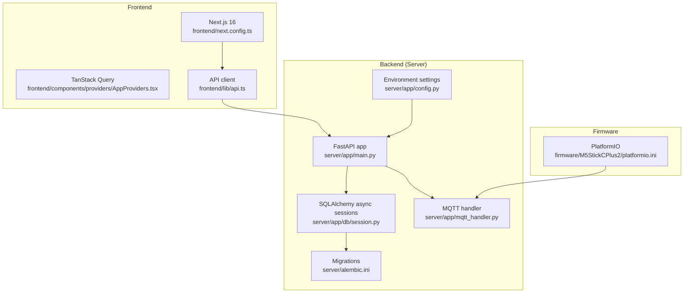
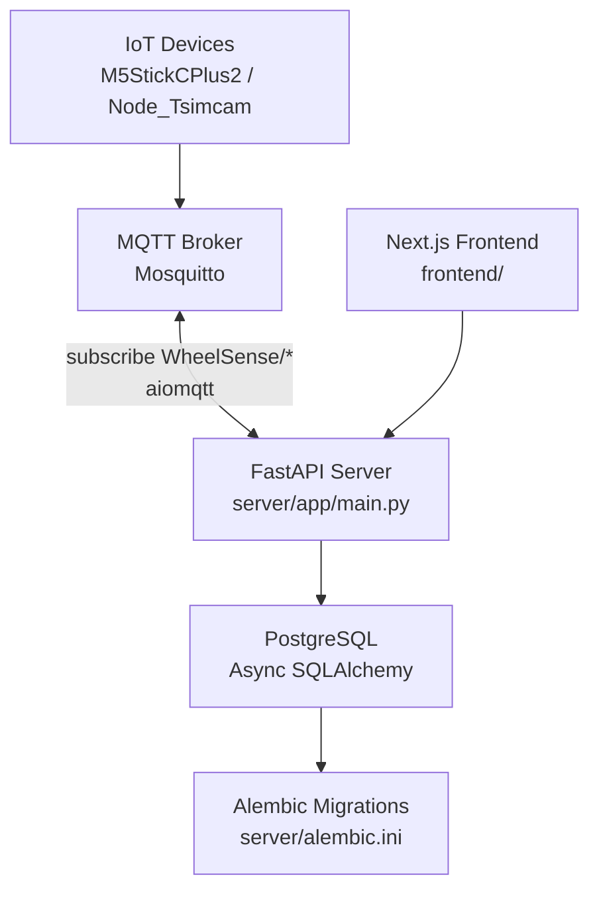
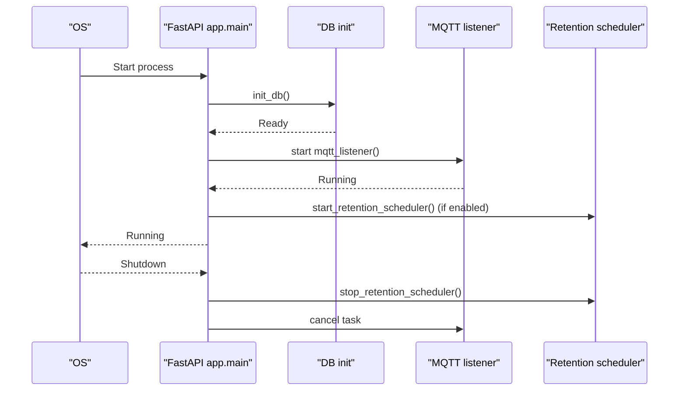
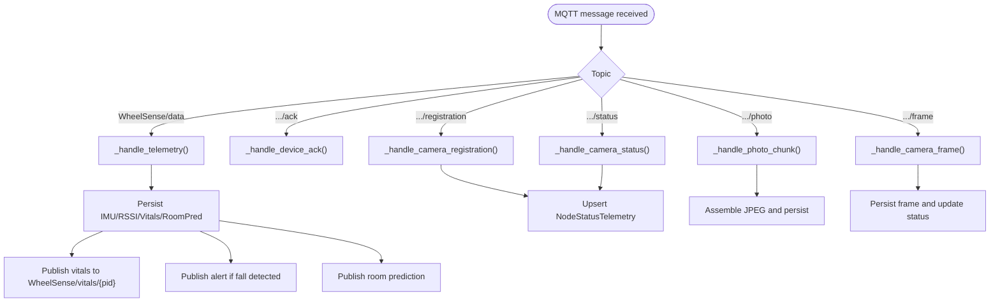
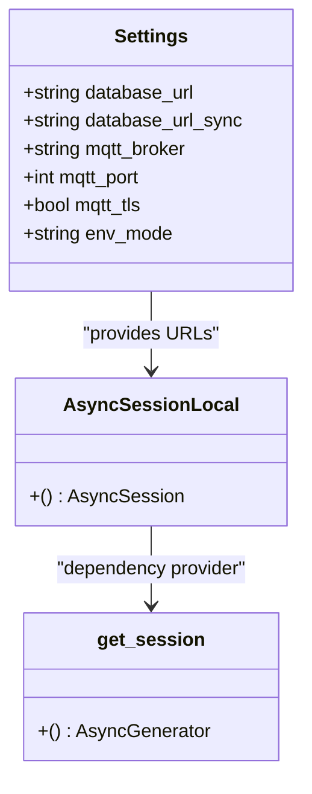
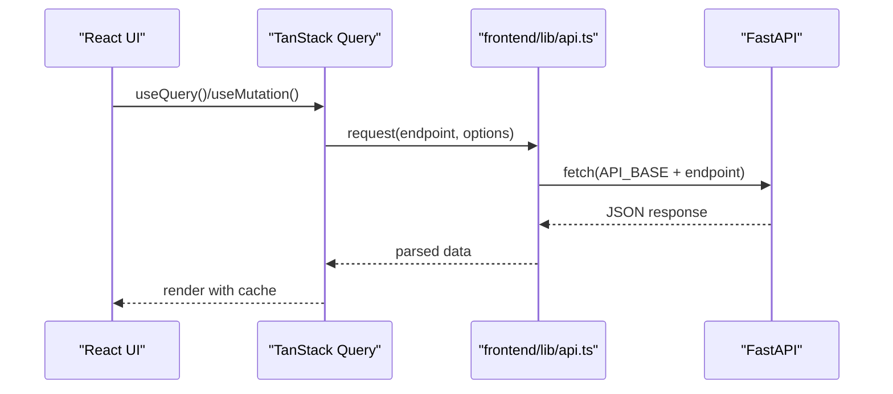
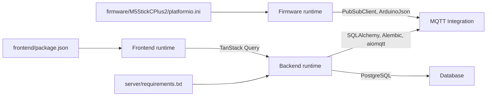

# Technology Stack

<cite>
**Referenced Files in This Document**
- [README.md](file://README.md)
- [server/pyproject.toml](file://server/pyproject.toml)
- [server/requirements.txt](file://server/requirements.txt)
- [server/docker-compose.yml](file://server/docker-compose.yml)
- [server/app/main.py](file://server/app/main.py)
- [server/app/mqtt_handler.py](file://server/app/mqtt_handler.py)
- [server/app/db/session.py](file://server/app/db/session.py)
- [server/app/config.py](file://server/app/config.py)
- [server/alembic.ini](file://server/alembic.ini)
- [frontend/package.json](file://frontend/package.json)
- [frontend/next.config.ts](file://frontend/next.config.ts)
- [frontend/components/providers/AppProviders.tsx](file://frontend/components/providers/AppProviders.tsx)
- [frontend/lib/api.ts](file://frontend/lib/api.ts)
- [firmware/M5StickCPlus2/platformio.ini](file://firmware/M5StickCPlus2/platformio.ini)
</cite>

## Table of Contents
1. [Introduction](#introduction)
2. [Project Structure](#project-structure)
3. [Core Components](#core-components)
4. [Architecture Overview](#architecture-overview)
5. [Detailed Component Analysis](#detailed-component-analysis)
6. [Dependency Analysis](#dependency-analysis)
7. [Performance Considerations](#performance-considerations)
8. [Troubleshooting Guide](#troubleshooting-guide)
9. [Conclusion](#conclusion)

## Introduction
This document describes the WheelSense Platform technology stack across backend, frontend, and firmware layers. It explains the rationale for each technology choice, highlights key dependencies and versions, and documents integration patterns between components. The platform targets healthcare IoT use cases including wheelchair monitoring, room localization, patient vitals, smart-device control, and role-based dashboards.

## Project Structure
The repository is organized into three primary layers:
- Backend: FastAPI application with asynchronous PostgreSQL persistence, Alembic migrations, MQTT ingestion, and AI/ML integrations.
- Frontend: Next.js 16 application with React 19, TanStack Query for data fetching, and Tailwind CSS for styling.
- Firmware: PlatformIO-based Arduino firmware for M5StickCPlus2 and Node_Tsimcam devices, integrating MQTT and JSON payloads.

**Diagram sources**
- [server/app/main.py:68-76](file://server/app/main.py#L68-L76)
- [server/app/db/session.py:47-55](file://server/app/db/session.py#L47-L55)
- [server/app/mqtt_handler.py:73-136](file://server/app/mqtt_handler.py#L73-L136)
- [server/app/config.py:19-36](file://server/app/config.py#L19-L36)
- [server/alembic.ini:1-117](file://server/alembic.ini#L1-L117)
- [frontend/next.config.ts:1-30](file://frontend/next.config.ts#L1-L30)
- [frontend/components/providers/AppProviders.tsx:10-23](file://frontend/components/providers/AppProviders.tsx#L10-L23)
- [frontend/lib/api.ts:209-297](file://frontend/lib/api.ts#L209-L297)
- [firmware/M5StickCPlus2/platformio.ini:1-22](file://firmware/M5StickCPlus2/platformio.ini#L1-L22)

**Section sources**
- [README.md:5-23](file://README.md#L5-L23)

## Core Components
- Backend (FastAPI)
  - Web framework: FastAPI 0.115.0
  - ASGI server: uvicorn[standard] >= 0.31.1
  - Database ORM: SQLAlchemy 2.0.35 (asyncio)
  - PostgreSQL adapter: asyncpg 0.29.0, psycopg2-binary 2.9.9
  - Migrations: Alembic 1.13.2
  - MQTT client: aiomqtt 2.3.0
  - Validation: Pydantic >= 2.11.0, pydantic-settings 2.5.2
  - Authentication: python-jose[cryptography] 3.3.0, passlib[bcrypt] 1.7.4
  - Scheduling: APScheduler >= 3.10.0
  - AI/ML: scikit-learn 1.5.2, xgboost >= 2.0.0, numpy 1.26.4, sentence-transformers >= 3.0.0
  - OpenAI SDK: openai >= 1.50.0
  - GitHub Copilot SDK: github-copilot-sdk >= 0.2.0
  - SSE: sse-starlette >= 2.0.0
  - MCP integration: mcp >= 1.26.0
  - Testing: pytest >= 8.0.0, pytest-asyncio >= 0.23.0, httpx >= 0.27.0, pytest-cov >= 5.0.0
  - Environment: python-dotenv 1.0.1
  - Utilities: rich >= 13.0, requests >= 2.31.0, python-multipart 0.0.9

- Backend (Runtime and Configuration)
  - Database URLs configured for asyncpg and sync SQLAlchemy engines
  - MQTT broker settings with TLS support and auto-registration policies
  - Environment modes: simulator vs production
  - AI/Agent runtime settings and MCP integration toggles

- Frontend (Next.js 16)
  - Framework: Next.js 16.2.2, React 19.2.4
  - State and data: TanStack React Query 5.96.2, Zustand 5.0.12
  - UI: Tailwind CSS 4.x, Radix UI primitives, Sonner toast notifications
  - Charts and forms: Recharts 3.8.1, react-hook-form 7.72.1, Zod 4.3.6
  - Tooling: TypeScript 5, ESLint 9, TailwindCSS plugin, React Compiler enabled
  - Theming: next-themes 0.4.6, Tailwind merge 3.5.0

- Firmware (PlatformIO + Arduino)
  - Platform: Espressif ESP32 (ESP-IDF 6.5.0), board m5stick-c
  - Framework: Arduino
  - Libraries: M5StickCPlus2, PubSubClient 2.8, ArduinoJson 6.21.0
  - Build flags: Debug level, USB mode

**Section sources**
- [server/requirements.txt:1-30](file://server/requirements.txt#L1-L30)
- [server/app/config.py:19-94](file://server/app/config.py#L19-L94)
- [frontend/package.json:13-56](file://frontend/package.json#L13-L56)
- [firmware/M5StickCPlus2/platformio.ini:4-21](file://firmware/M5StickCPlus2/platformio.ini#L4-L21)

## Architecture Overview
The backend exposes REST APIs consumed by the Next.js frontend. Devices publish telemetry and camera frames over MQTT; the backend subscribes, validates, persists, and publishes derived events. PostgreSQL stores structured data with Alembic-managed migrations. The frontend integrates TanStack Query for caching and optimistic updates, and proxies API calls through Next.js routes.

**Diagram sources**
- [server/app/mqtt_handler.py:73-136](file://server/app/mqtt_handler.py#L73-L136)
- [server/app/db/session.py:18-44](file://server/app/db/session.py#L18-L44)
- [server/alembic.ini:1-117](file://server/alembic.ini#L1-L117)
- [server/app/main.py:68-76](file://server/app/main.py#L68-L76)
- [frontend/next.config.ts:25-27](file://frontend/next.config.ts#L25-L27)

## Detailed Component Analysis

### Backend: FastAPI Application Lifecycle and Startup
- Lifespan manages database initialization, admin bootstrap, MQTT listener startup, and retention scheduler lifecycle.
- Error handlers are registered globally; routers are mounted at application startup.
- Optional MCP server mounting controlled by environment flag.

**Diagram sources**
- [server/app/main.py:26-66](file://server/app/main.py#L26-L66)

**Section sources**
- [server/app/main.py:26-76](file://server/app/main.py#L26-L76)

### Backend: MQTT Telemetry Ingestion and Publishing
- Subscriptions: telemetry, camera registration/status/photo/frame, device acknowledgments.
- Telemetry ingestion populates IMU, RSSI, motion training, vital readings, and room predictions.
- Publishes vitals, alerts, and room predictions back to MQTT topics.
- Handles photo chunks and frames, persisting to disk and updating device status.

**Diagram sources**
- [server/app/mqtt_handler.py:73-136](file://server/app/mqtt_handler.py#L73-L136)
- [server/app/mqtt_handler.py:139-325](file://server/app/mqtt_handler.py#L139-L325)
- [server/app/mqtt_handler.py:485-540](file://server/app/mqtt_handler.py#L485-L540)
- [server/app/mqtt_handler.py:566-573](file://server/app/mqtt_handler.py#L566-L573)

**Section sources**
- [server/app/mqtt_handler.py:73-136](file://server/app/mqtt_handler.py#L73-L136)
- [server/app/mqtt_handler.py:139-325](file://server/app/mqtt_handler.py#L139-L325)
- [server/app/mqtt_handler.py:485-540](file://server/app/mqtt_handler.py#L485-L540)
- [server/app/mqtt_handler.py:566-573](file://server/app/mqtt_handler.py#L566-L573)

### Backend: Database Session Management and Configuration
- Async SQLAlchemy engine configured with pool settings for PostgreSQL.
- Sync engine for Alembic and scripts.
- Session factory yields AsyncSession instances for dependency injection.
- Database URLs and environment-driven settings.

**Diagram sources**
- [server/app/config.py:19-36](file://server/app/config.py#L19-L36)
- [server/app/db/session.py:18-55](file://server/app/db/session.py#L18-L55)

**Section sources**
- [server/app/db/session.py:18-55](file://server/app/db/session.py#L18-L55)
- [server/app/config.py:19-36](file://server/app/config.py#L19-L36)

### Backend: Environment and Container Orchestration
- Docker Compose includes core and data stacks; production mode merges shared stack with PostgreSQL data.
- Backend quick-start commands demonstrate database and MQTT bootstrapping, Alembic migrations, and Uvicorn startup.

**Section sources**
- [server/docker-compose.yml:1-10](file://server/docker-compose.yml#L1-L10)
- [README.md:25-44](file://README.md#L25-L44)

### Frontend: Next.js 16, React 19, TanStack Query, Tailwind CSS
- Next.js configuration enables standalone output, React Compiler, and API proxying to FastAPI.
- AppProviders initializes TanStack Query with retry, refetch policies, and a 15-second stale threshold.
- API client wraps fetch with JWT-aware auth, error handling, timeouts, and typed endpoints.

**Diagram sources**
- [frontend/components/providers/AppProviders.tsx:10-23](file://frontend/components/providers/AppProviders.tsx#L10-L23)
- [frontend/lib/api.ts:209-297](file://frontend/lib/api.ts#L209-L297)
- [frontend/next.config.ts:25-27](file://frontend/next.config.ts#L25-L27)

**Section sources**
- [frontend/next.config.ts:1-30](file://frontend/next.config.ts#L1-L30)
- [frontend/components/providers/AppProviders.tsx:10-23](file://frontend/components/providers/AppProviders.tsx#L10-L23)
- [frontend/lib/api.ts:209-297](file://frontend/lib/api.ts#L209-L297)

### Firmware: PlatformIO, Arduino, M5StickCPlus2, MQTT
- PlatformIO project targets m5stick-c board with Arduino framework.
- Dependencies include M5StickCPlus2, PubSubClient for MQTT, and ArduinoJson for payload parsing.
- Build flags configure debug level and USB mode.

**Section sources**
- [firmware/M5StickCPlus2/platformio.ini:4-21](file://firmware/M5StickCPlus2/platformio.ini#L4-L21)

## Dependency Analysis
- Backend dependencies are declared in requirements.txt with pinned versions for stability and reproducibility.
- Frontend dependencies are declared in package.json with Next.js 16, React 19, and TanStack Query.
- Firmware dependencies are declared in platformio.ini with specific library versions.

**Diagram sources**
- [server/requirements.txt:1-30](file://server/requirements.txt#L1-L30)
- [frontend/package.json:13-56](file://frontend/package.json#L13-L56)
- [firmware/M5StickCPlus2/platformio.ini:15-18](file://firmware/M5StickCPlus2/platformio.ini#L15-L18)

**Section sources**
- [server/requirements.txt:1-30](file://server/requirements.txt#L1-L30)
- [frontend/package.json:13-56](file://frontend/package.json#L13-L56)
- [firmware/M5StickCPlus2/platformio.ini:15-18](file://firmware/M5StickCPlus2/platformio.ini#L15-L18)

## Performance Considerations
- Backend
  - Use of async SQLAlchemy reduces blocking on I/O-bound database operations.
  - Connection pooling configured for PostgreSQL to handle concurrent requests efficiently.
  - MQTT listener runs as a background task; ensure appropriate reconnect intervals and error logging.
  - TanStack Query’s default staleTime balances freshness and network usage; adjust per route as needed.
- Frontend
  - React Compiler enabled in Next.js improves render performance.
  - QueryClient default retry and refetch policies reduce user-perceived latency.
  - API client timeouts prevent hanging requests from blocking UI.
- Firmware
  - ArduinoJson minimizes heap fragmentation for parsing MQTT payloads.
  - PubSubClient provides efficient MQTT transport; ensure adequate free heap for image assembly.

## Troubleshooting Guide
- Backend
  - Database connectivity: Verify async engine creation and SELECT 1 check on startup.
  - MQTT connection: Confirm broker hostname/port, TLS settings, and subscription topics.
  - Alembic migrations: Ensure script_location and env.py are consistent with repository structure.
- Frontend
  - API errors: Inspect ApiError handling and unauthorized redirects; check API_BASE and proxy configuration.
  - TanStack Query: Review defaultOptions for retry/refetch behavior and staleTime tuning.
- Firmware
  - MQTT publishing: Validate topic formatting and payload serialization.
  - Memory: Monitor heap usage during photo assembly; consider chunk sizes and buffer management.

**Section sources**
- [server/app/db/session.py:58-64](file://server/app/db/session.py#L58-L64)
- [server/app/mqtt_handler.py:73-136](file://server/app/mqtt_handler.py#L73-L136)
- [server/alembic.ini:1-117](file://server/alembic.ini#L1-L117)
- [frontend/lib/api.ts:209-297](file://frontend/lib/api.ts#L209-L297)
- [frontend/components/providers/AppProviders.tsx:10-23](file://frontend/components/providers/AppProviders.tsx#L10-L23)

## Conclusion
The WheelSense Platform leverages modern, robust technologies across backend, frontend, and firmware to deliver a scalable healthcare IoT solution. FastAPI and SQLAlchemy provide a reactive backend foundation, MQTT enables low-latency device telemetry, and PostgreSQL/Alembic ensure reliable persistence and evolution. The Next.js frontend integrates TanStack Query for responsive UX, while PlatformIO and Arduino streamline firmware development for resource-constrained devices. These choices collectively support real-time monitoring, localization, and workflow orchestration in clinical environments.