# Security & Access Control

<cite>
**Referenced Files in This Document**
- [security.py](file://server/app/core/security.py)
- [auth.py](file://server/app/api/endpoints/auth.py)
- [dependencies.py](file://server/app/api/dependencies.py)
- [users.py](file://server/app/api/endpoints/users.py)
- [workspaces.py](file://server/app/api/endpoints/workspaces.py)
- [auth.py](file://server/app/services/auth.py)
- [users.py](file://server/app/models/users.py)
- [core.py](file://server/app/models/core.py)
- [auth.py](file://server/app/mcp/auth.py)
- [config.py](file://server/app/config.py)
- [test_mcp_auth_extended.py](file://server/tests/test_mcp_auth_extended.py)
- [test_mcp_policy.py](file://server/tests/test_mcp_policy.py)
- [test_api.py](file://server/tests/test_api.py)
- [0005-camera-photo-only-internet-independent.md](file://docs/adr/0005-camera-photo-only-internet-independent.md)
</cite>

## Table of Contents
1. [Introduction](#introduction)
2. [Project Structure](#project-structure)
3. [Core Components](#core-components)
4. [Architecture Overview](#architecture-overview)
5. [Detailed Component Analysis](#detailed-component-analysis)
6. [Dependency Analysis](#dependency-analysis)
7. [Performance Considerations](#performance-considerations)
8. [Troubleshooting Guide](#troubleshooting-guide)
9. [Conclusion](#conclusion)
10. [Appendices](#appendices)

## Introduction
This document describes the WheelSense Platform’s security and access control system. It covers JWT-based authentication, password hashing, session lifecycle, role-based access control (RBAC), workspace scoping, authorization patterns, security middleware, request validation, user and profile administration, and operational security considerations for device communication and audit logging. Practical examples demonstrate permission configuration and security implementation across REST and MCP (Model Context Protocol) integrations.

## Project Structure
Security and access control span several layers:
- Configuration and cryptographic utilities
- Authentication endpoints and services
- RBAC and workspace-scoped models
- MCP authorization middleware
- Tests validating auth and policy behavior

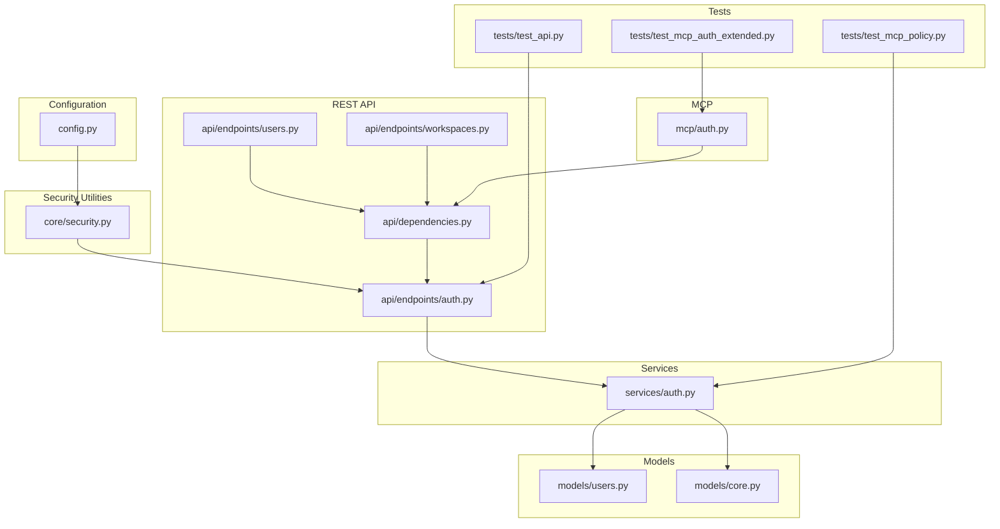

**Diagram sources**
- [config.py:12-151](file://server/app/config.py#L12-L151)
- [security.py:1-56](file://server/app/core/security.py#L1-L56)
- [auth.py:1-269](file://server/app/api/endpoints/auth.py#L1-L269)
- [dependencies.py:1-402](file://server/app/api/dependencies.py#L1-L402)
- [auth.py:1-688](file://server/app/services/auth.py#L1-L688)
- [users.py:1-92](file://server/app/models/users.py#L1-L92)
- [core.py:1-124](file://server/app/models/core.py#L1-L124)
- [auth.py:1-190](file://server/app/mcp/auth.py#L1-L190)
- [test_mcp_auth_extended.py:280-388](file://server/tests/test_mcp_auth_extended.py#L280-L388)
- [test_mcp_policy.py:119-165](file://server/tests/test_mcp_policy.py#L119-L165)
- [test_api.py:186-264](file://server/tests/test_api.py#L186-L264)

**Section sources**
- [config.py:12-151](file://server/app/config.py#L12-L151)
- [security.py:1-56](file://server/app/core/security.py#L1-L56)
- [auth.py:1-269](file://server/app/api/endpoints/auth.py#L1-L269)
- [dependencies.py:1-402](file://server/app/api/dependencies.py#L1-L402)
- [auth.py:1-688](file://server/app/services/auth.py#L1-L688)
- [users.py:1-92](file://server/app/models/users.py#L1-L92)
- [core.py:1-124](file://server/app/models/core.py#L1-L124)
- [auth.py:1-190](file://server/app/mcp/auth.py#L1-L190)
- [test_mcp_auth_extended.py:280-388](file://server/tests/test_mcp_auth_extended.py#L280-L388)
- [test_mcp_policy.py:119-165](file://server/tests/test_mcp_policy.py#L119-L165)
- [test_api.py:186-264](file://server/tests/test_api.py#L186-L264)

## Core Components
- JWT creation and verification, password hashing, and runtime security checks
- REST authentication endpoints: login, session hydration, user info, password change, sessions listing, logout, impersonation
- RBAC with role-to-capability and role-to-scope mappings
- Workspace scoping enforced via user workspace foreign keys and session/workspace binding
- MCP authorization middleware validating origin, Bearer tokens, and scope resolution
- Session lifecycle management with server-tracked auth sessions and revocation
- User and profile administration with workspace-aware validation and linkage

**Section sources**
- [security.py:13-56](file://server/app/core/security.py#L13-L56)
- [auth.py:57-205](file://server/app/api/endpoints/auth.py#L57-L205)
- [dependencies.py:123-311](file://server/app/api/dependencies.py#L123-L311)
- [users.py:9-92](file://server/app/models/users.py#L9-L92)
- [auth.py:16-143](file://server/app/mcp/auth.py#L16-L143)
- [auth.py:458-688](file://server/app/services/auth.py#L458-L688)

## Architecture Overview
The system enforces authentication and authorization across REST and MCP channels:

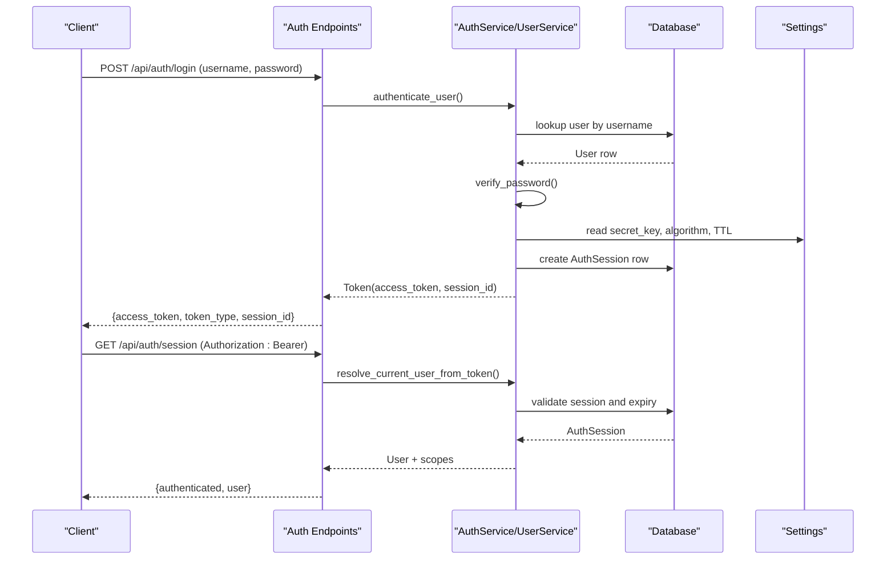

**Diagram sources**
- [auth.py:57-95](file://server/app/api/endpoints/auth.py#L57-L95)
- [auth.py:575-626](file://server/app/services/auth.py#L575-L626)
- [dependencies.py:58-120](file://server/app/api/dependencies.py#L58-L120)
- [users.py:59-92](file://server/app/models/users.py#L59-L92)
- [config.py:47-50](file://server/app/config.py#L47-L50)

## Detailed Component Analysis

### JWT Authentication and Password Hashing
- Password hashing uses bcrypt with salt generation and secure comparison.
- JWT creation encodes subject, role, expiration, and optional claims (e.g., session ID).
- Runtime validation ensures a secure secret key is configured outside debug mode.
- Login endpoint validates credentials, checks active status, creates a server-tracked session, and issues a JWT with a session claim.

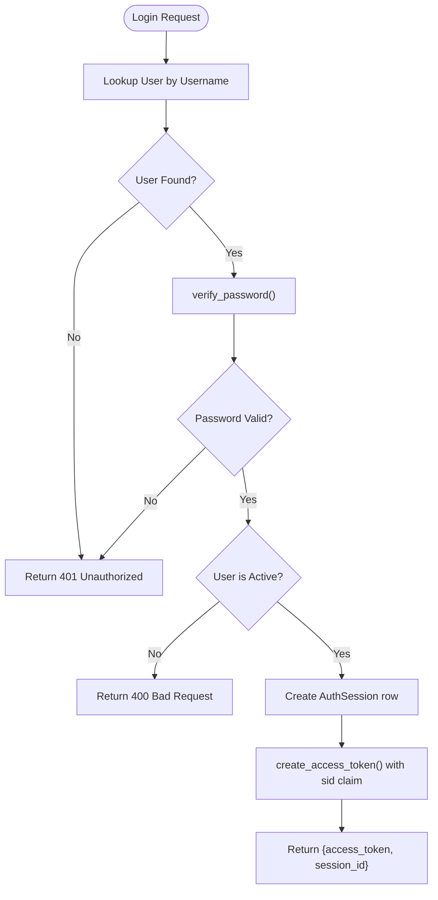

**Diagram sources**
- [auth.py:575-626](file://server/app/services/auth.py#L575-L626)
- [security.py:43-56](file://server/app/core/security.py#L43-L56)
- [config.py:13-19](file://server/app/config.py#L13-L19)

**Section sources**
- [security.py:13-56](file://server/app/core/security.py#L13-L56)
- [auth.py:575-626](file://server/app/services/auth.py#L575-L626)
- [auth.py:57-72](file://server/app/api/endpoints/auth.py#L57-L72)

### Session Management and Revocation
- Sessions are stored in a dedicated table with workspace/user binding, timestamps, IP/user-agent, and revocation flag.
- The JWT carries a session ID; during validation, the session must exist, belong to the same workspace, not be revoked, and not be expired.
- Clients can list sessions and revoke individual sessions or their current session.

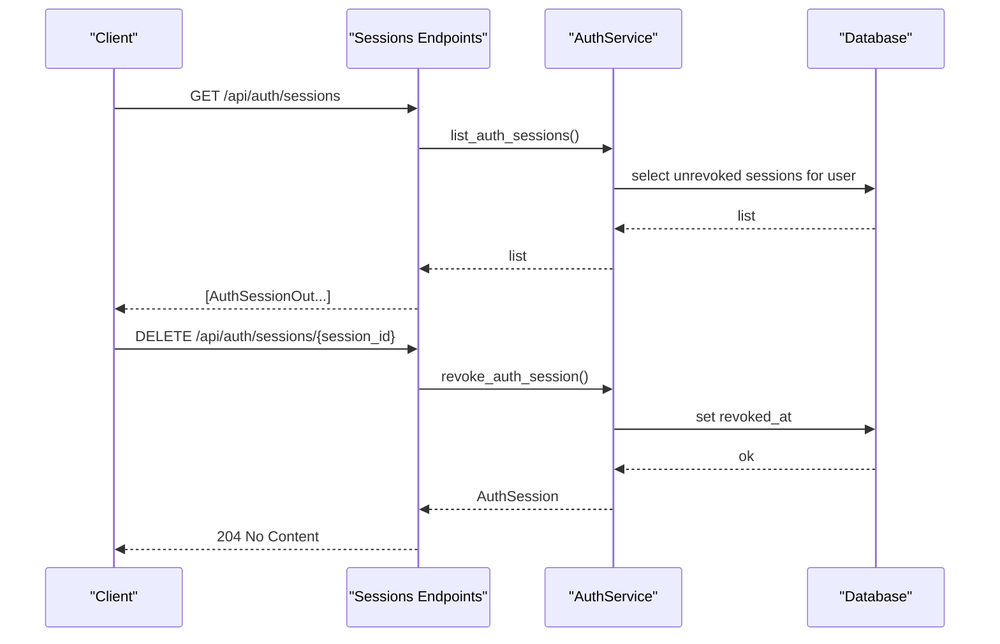

**Diagram sources**
- [auth.py:160-204](file://server/app/api/endpoints/auth.py#L160-L204)
- [auth.py:527-573](file://server/app/services/auth.py#L527-L573)
- [users.py:59-92](file://server/app/models/users.py#L59-L92)

**Section sources**
- [auth.py:160-204](file://server/app/api/endpoints/auth.py#L160-L204)
- [auth.py:527-573](file://server/app/services/auth.py#L527-L573)
- [users.py:59-92](file://server/app/models/users.py#L59-L92)

### Role-Based Access Control (RBAC) and Workspace Scoping
- Roles: admin, head_nurse, supervisor, observer, patient.
- Capability map defines functional permissions per role.
- Token scope map defines granular scopes per role; requested scopes are intersected with allowed scopes.
- Workspace scoping: users belong to a workspace; endpoints restrict access to the current user’s workspace; sessions bind to the user’s workspace.
- Tests validate policy coverage and enforcement for different roles.

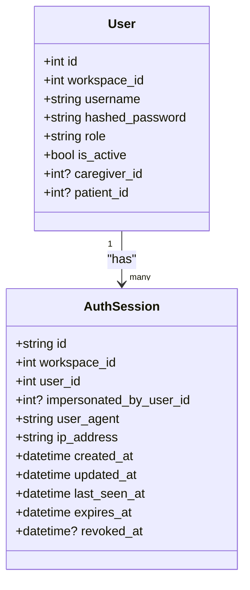

**Diagram sources**
- [users.py:9-92](file://server/app/models/users.py#L9-L92)

**Section sources**
- [dependencies.py:171-311](file://server/app/api/dependencies.py#L171-L311)
- [users.py:9-92](file://server/app/models/users.py#L9-L92)
- [workspaces.py:15-57](file://server/app/api/endpoints/workspaces.py#L15-L57)
- [test_mcp_policy.py:119-165](file://server/tests/test_mcp_policy.py#L119-L165)

### Authorization Patterns and Request Validation
- Global dependency resolves current user from JWT, validates session existence/expiry/revocation, and attaches token scopes to the request context.
- Role gating via a dependency that raises 403 if the user’s role is not permitted.
- Endpoint-level validations enforce workspace scoping and role constraints.
- Tests verify session hydration, guest vs authenticated behavior, and invalid bearer token handling.

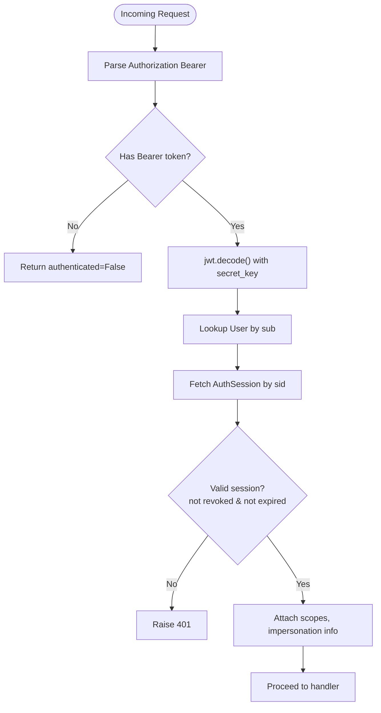

**Diagram sources**
- [dependencies.py:58-120](file://server/app/api/dependencies.py#L58-L120)
- [auth.py:75-95](file://server/app/api/endpoints/auth.py#L75-L95)
- [test_api.py:186-264](file://server/tests/test_api.py#L186-L264)

**Section sources**
- [dependencies.py:58-120](file://server/app/api/dependencies.py#L58-L120)
- [auth.py:75-95](file://server/app/api/endpoints/auth.py#L75-L95)
- [test_api.py:186-264](file://server/tests/test_api.py#L186-L264)

### MCP Authorization Middleware
- Validates Origin header against configured allowed origins; optionally requires Origin presence.
- Requires Bearer token; decodes JWT and validates session state.
- Supports MCP-specific tokens with persisted scopes and revocation checks.
- Resolves effective scopes by intersecting role-based scopes with token scopes.

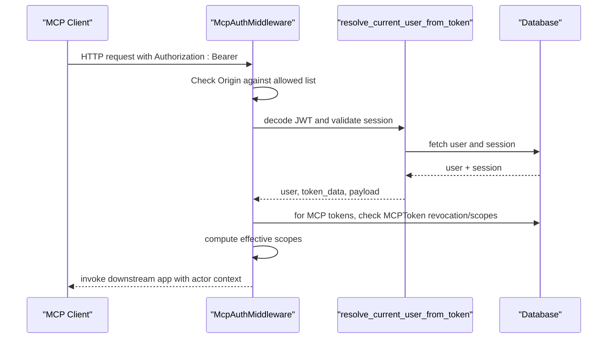

**Diagram sources**
- [auth.py:16-143](file://server/app/mcp/auth.py#L16-L143)
- [dependencies.py:123-128](file://server/app/api/dependencies.py#L123-L128)
- [test_mcp_auth_extended.py:280-388](file://server/tests/test_mcp_auth_extended.py#L280-L388)

**Section sources**
- [auth.py:16-143](file://server/app/mcp/auth.py#L16-L143)
- [dependencies.py:123-128](file://server/app/api/dependencies.py#L123-L128)
- [test_mcp_auth_extended.py:280-388](file://server/tests/test_mcp_auth_extended.py#L280-L388)

### User Management and Profile Administration
- Create, read, update, and soft-delete users within a workspace.
- Username uniqueness enforced per workspace; workspace-aware validation for linked caregiver/patient.
- Profile updates support linking/unlinking and avatar management with hosted storage.
- Password change enforces current password verification and prevents reuse.

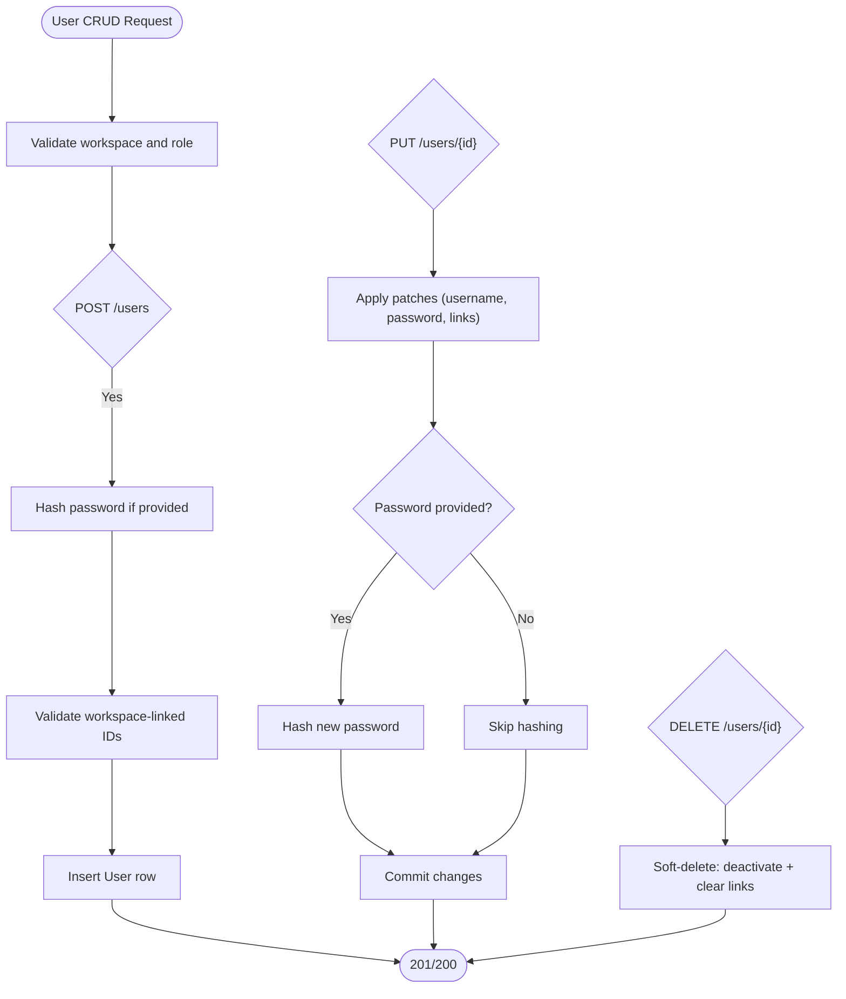

**Diagram sources**
- [users.py:23-99](file://server/app/api/endpoints/users.py#L23-L99)
- [auth.py:42-118](file://server/app/services/auth.py#L42-L118)
- [auth.py:345-427](file://server/app/services/auth.py#L345-L427)

**Section sources**
- [users.py:23-99](file://server/app/api/endpoints/users.py#L23-L99)
- [auth.py:42-118](file://server/app/services/auth.py#L42-L118)
- [auth.py:345-427](file://server/app/services/auth.py#L345-L427)

### Workspace Scoping and Permission Management
- Workspaces define isolated environments; users and sessions are bound to a workspace.
- Endpoints enforce current user workspace and role constraints.
- Tests demonstrate policy coverage for staff vs patient access and device assignment limitations.

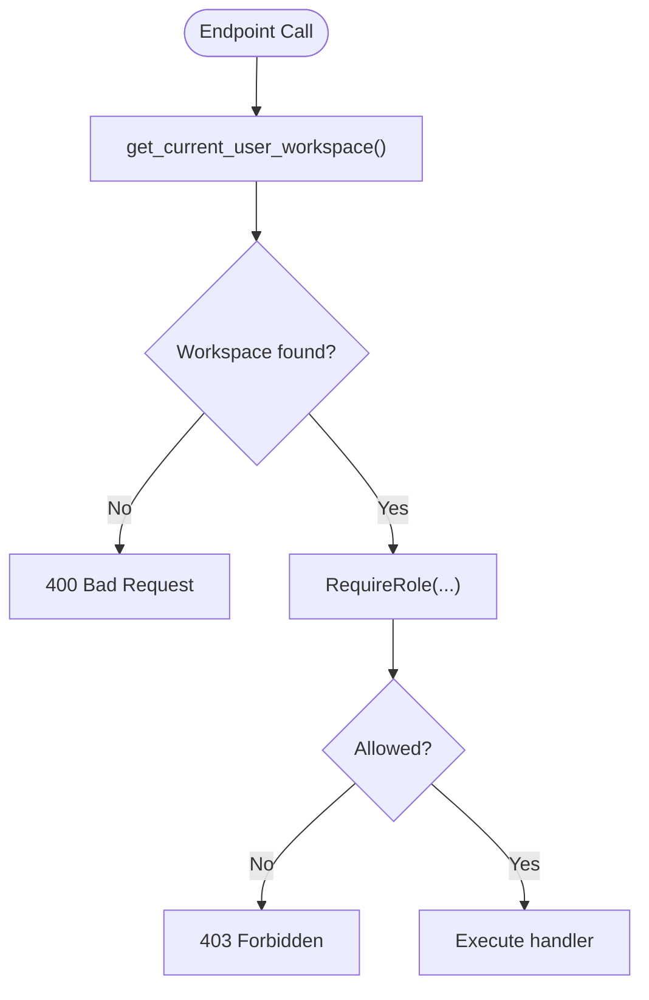

**Diagram sources**
- [dependencies.py:139-150](file://server/app/api/dependencies.py#L139-L150)
- [workspaces.py:15-57](file://server/app/api/endpoints/workspaces.py#L15-L57)
- [test_mcp_policy.py:119-165](file://server/tests/test_mcp_policy.py#L119-L165)

**Section sources**
- [dependencies.py:139-150](file://server/app/api/dependencies.py#L139-L150)
- [workspaces.py:15-57](file://server/app/api/endpoints/workspaces.py#L15-L57)
- [test_mcp_policy.py:119-165](file://server/tests/test_mcp_policy.py#L119-L165)

### Device Communication Security and Audit Logging
- Device telemetry ingestion supports automatic registration and merging of BLE and camera identities; MQTT security mitigations include TLS and credentials.
- Device command dispatches and activity events provide audit trails for fleet operations.
- MCP tools expose administrative actions with strict role checks.

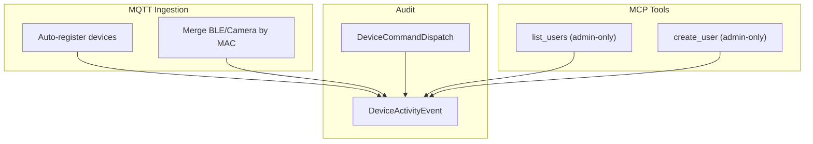

**Diagram sources**
- [core.py:46-84](file://server/app/models/core.py#L46-L84)
- [auth.py:2475-2495](file://server/app/mcp/server.py#L2475-L2495)

**Section sources**
- [core.py:46-84](file://server/app/models/core.py#L46-L84)
- [0005-camera-photo-only-internet-independent.md:58-61](file://docs/adr/0005-camera-photo-only-internet-independent.md#L58-L61)
- [auth.py:2475-2495](file://server/app/mcp/server.py#L2475-L2495)

## Dependency Analysis
- Configuration drives cryptographic algorithms, token TTL, and MCP origin policies.
- Authentication endpoints depend on services for business logic and on dependencies for user/session validation.
- Services depend on models for persistence and on security utilities for hashing and token creation.
- MCP middleware depends on dependencies for token decoding and scope resolution.

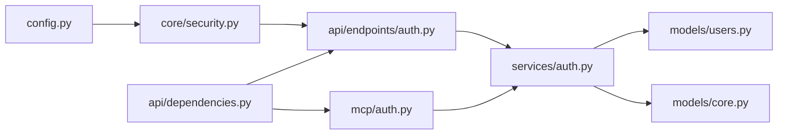

**Diagram sources**
- [config.py:47-77](file://server/app/config.py#L47-L77)
- [security.py:21-41](file://server/app/core/security.py#L21-L41)
- [auth.py:57-95](file://server/app/api/endpoints/auth.py#L57-L95)
- [auth.py:575-626](file://server/app/services/auth.py#L575-L626)
- [users.py:59-92](file://server/app/models/users.py#L59-L92)
- [core.py:18-124](file://server/app/models/core.py#L18-L124)
- [dependencies.py:58-120](file://server/app/api/dependencies.py#L58-L120)
- [auth.py:16-143](file://server/app/mcp/auth.py#L16-L143)

**Section sources**
- [config.py:47-77](file://server/app/config.py#L47-L77)
- [security.py:21-41](file://server/app/core/security.py#L21-L41)
- [auth.py:57-95](file://server/app/api/endpoints/auth.py#L57-L95)
- [auth.py:575-626](file://server/app/services/auth.py#L575-L626)
- [users.py:59-92](file://server/app/models/users.py#L59-L92)
- [core.py:18-124](file://server/app/models/core.py#L18-L124)
- [dependencies.py:58-120](file://server/app/api/dependencies.py#L58-L120)
- [auth.py:16-143](file://server/app/mcp/auth.py#L16-L143)

## Performance Considerations
- JWT decoding and bcrypt verification are lightweight; session validation adds a single database lookup per request.
- Token scope intersection is constant-time set operations; keep role scope sets minimal and focused.
- Consider caching frequently accessed user/workspace data at the edge (e.g., reverse proxy) to reduce DB load for session hydration.
- Batch operations for user search and listing leverage SQL joins and limits to control payload size.

[No sources needed since this section provides general guidance]

## Troubleshooting Guide
Common issues and resolutions:
- Invalid or missing Bearer token: Ensure Authorization header uses “Bearer <token>” and the token is not expired or revoked.
- Session not active: Confirm the session exists, belongs to the same workspace, and is not revoked or expired.
- Insufficient scope: For MCP, ensure the token includes required scopes; for REST, verify the role-based scopes intersect with requested scopes.
- Origin not allowed (MCP): Configure allowed origins and ensure the Origin header matches.
- Inactive user: Activate the user account before login attempts.
- Workspace mismatch: Ensure the user and session share the same workspace.

**Section sources**
- [test_api.py:219-241](file://server/tests/test_api.py#L219-L241)
- [test_mcp_auth_extended.py:280-388](file://server/tests/test_mcp_auth_extended.py#L280-L388)
- [dependencies.py:98-120](file://server/app/api/dependencies.py#L98-L120)
- [auth.py:37-66](file://server/app/mcp/auth.py#L37-L66)

## Conclusion
WheelSense implements a robust, workspace-scoped RBAC system with JWT-based authentication, bcrypt password hashing, and server-tracked sessions supporting fine-grained scope control. The MCP middleware extends these protections to external clients with origin validation and token-scoped authorization. Comprehensive tests validate policy coverage and session/session-token lifecycles. Operational safeguards include secure secret key enforcement, audit trails for device operations, and strict role-gated administrative actions.

[No sources needed since this section summarizes without analyzing specific files]

## Appendices

### Practical Examples

- Granting admin access to MCP tools:
  - Role admin has broad workspace/device/workflow scopes; MCP tools enforce admin-only checks.
  - Example: Listing users and creating users are admin-only operations.

- Limiting patient access to assigned devices:
  - Patient accounts can only access devices actively assigned to their care profile; enforcement occurs in authorization helpers.

- Enforcing workspace scoping:
  - All endpoints depend on the current user’s workspace; cross-workspace access is blocked.

- Managing sessions:
  - List active sessions and revoke any session by ID; current session can be terminated via logout.

**Section sources**
- [auth.py:2475-2495](file://server/app/mcp/server.py#L2475-L2495)
- [dependencies.py:370-401](file://server/app/api/dependencies.py#L370-L401)
- [auth.py:160-204](file://server/app/api/endpoints/auth.py#L160-L204)
- [workspaces.py:15-57](file://server/app/api/endpoints/workspaces.py#L15-L57)