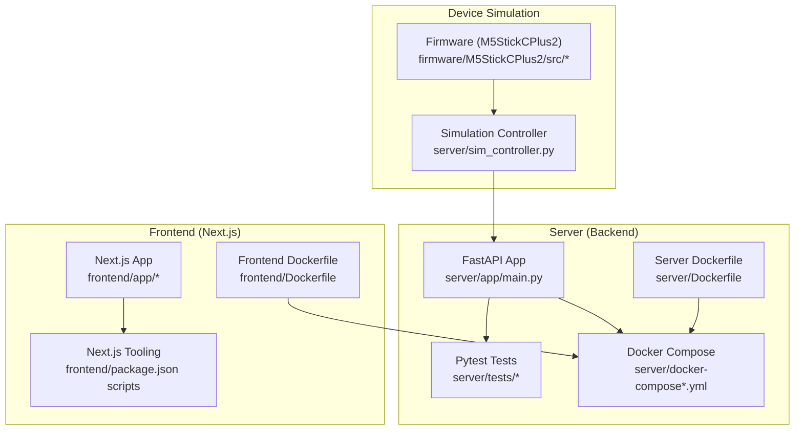
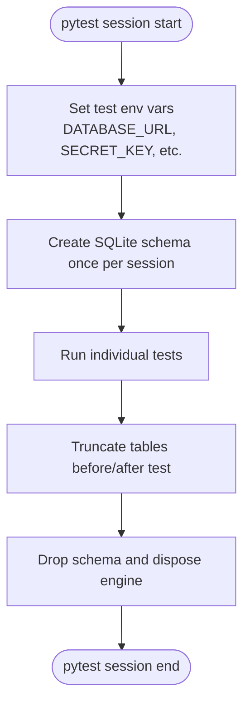
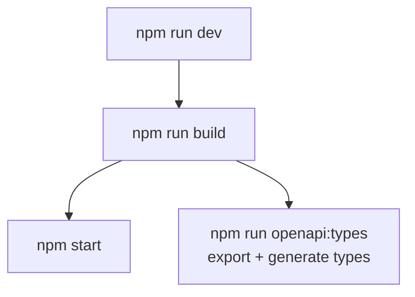
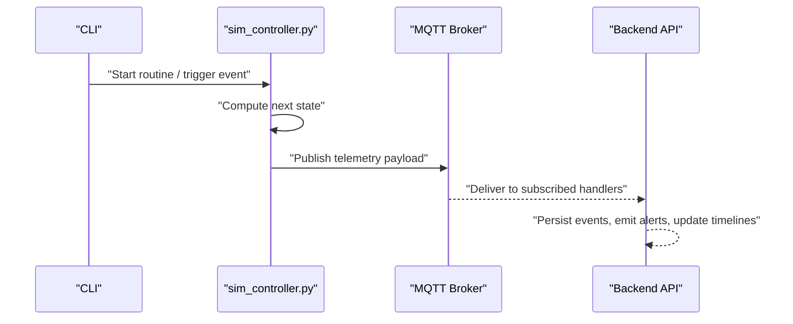
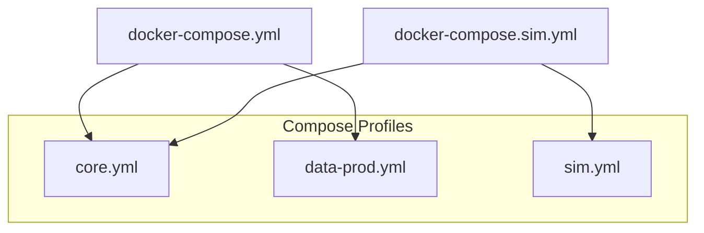
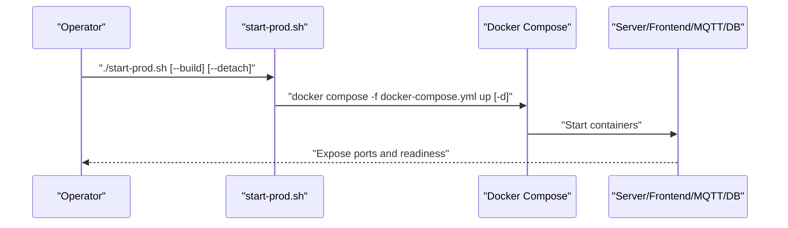
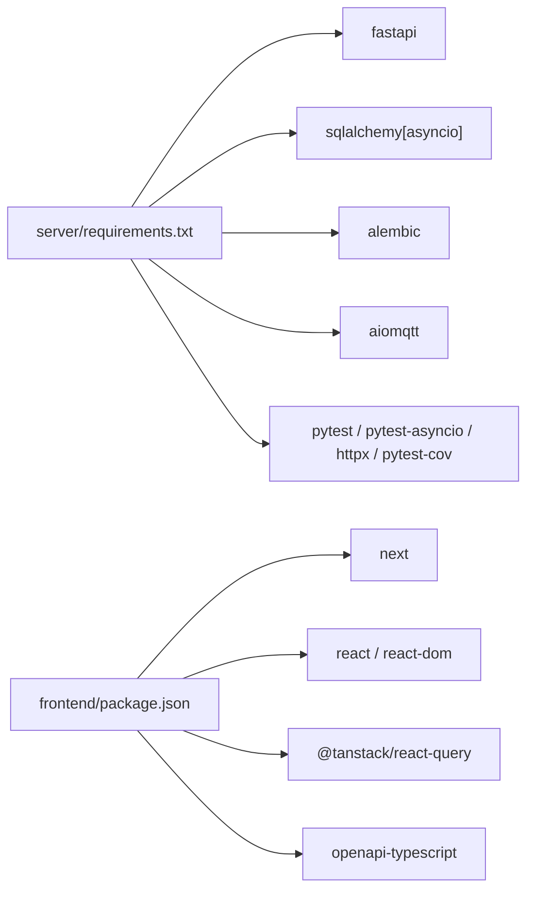

# Testing & Deployment

<cite>
**Referenced Files in This Document**
- [pytest.ini](file://server/pytest.ini)
- [pyproject.toml](file://server/pyproject.toml)
- [requirements.txt](file://server/requirements.txt)
- [conftest.py](file://server/tests/conftest.py)
- [Dockerfile (server)](file://server/Dockerfile)
- [docker-compose.yml](file://server/docker-compose.yml)
- [docker-compose.core.yml](file://server/docker-compose.core.yml)
- [docker-compose.data-prod.yml](file://server/docker-compose.data-prod.yml)
- [docker-compose.sim.yml](file://server/docker-compose.sim.yml)
- [start-prod.sh](file://server/scripts/start-prod.sh)
- [start-sim.sh](file://server/scripts/start-sim.sh)
- [Dockerfile (frontend)](file://frontend/Dockerfile)
- [package.json](file://frontend/package.json)
- [sim_controller.py](file://server/sim_controller.py)
- [mypy.ini](file://server/mypy.ini)
- [MCP-README.md](file://docs/MCP-README.md)
</cite>

## Table of Contents
1. [Introduction](#introduction)
2. [Project Structure](#project-structure)
3. [Core Components](#core-components)
4. [Architecture Overview](#architecture-overview)
5. [Detailed Component Analysis](#detailed-component-analysis)
6. [Dependency Analysis](#dependency-analysis)
7. [Performance Considerations](#performance-considerations)
8. [Troubleshooting Guide](#troubleshooting-guide)
9. [Conclusion](#conclusion)
10. [Appendices](#appendices)

## Introduction
This document provides comprehensive testing and deployment guidance for the WheelSense Platform. It covers backend testing with pytest, frontend testing via Next.js toolchain, device simulation testing, containerized deployment with Docker Compose, environment management, CI/CD automation, production deployment procedures, monitoring, backups, disaster recovery, performance optimization, troubleshooting, rollbacks, and operational runbooks. Practical examples of testing workflows and deployment automation are included to help teams adopt repeatable, reliable processes.

## Project Structure
The repository is organized into distinct layers:
- Backend (FastAPI server) under server/
- Frontend (Next.js) under frontend/
- Firmware and device simulation under firmware/ and server/sim_controller.py
- Documentation and ADRs under docs/
- Testing artifacts under server/tests/ and frontend/



**Diagram sources**
- [Dockerfile (server):1-22](file://server/Dockerfile#L1-L22)
- [docker-compose.yml:1-10](file://server/docker-compose.yml#L1-L10)
- [Dockerfile (frontend):1-31](file://frontend/Dockerfile#L1-L31)
- [sim_controller.py:1-200](file://server/sim_controller.py#L1-L200)

**Section sources**
- [Dockerfile (server):1-22](file://server/Dockerfile#L1-L22)
- [docker-compose.yml:1-10](file://server/docker-compose.yml#L1-L10)
- [Dockerfile (frontend):1-31](file://frontend/Dockerfile#L1-L31)
- [sim_controller.py:1-200](file://server/sim_controller.py#L1-L200)

## Core Components
- Backend testing framework: pytest with async fixtures, in-memory SQLite, and dependency overrides for isolation and speed.
- Frontend testing: Next.js toolchain and scripts for building and generating OpenAPI types.
- Device simulation: Python-based controller that publishes MQTT events to emulate real-time patient vitals, movements, and alerts.
- Containerization: Multi-stage Dockerfiles for server and frontend, orchestrated by Docker Compose with environment-specific stacks.
- Environment management: Separate production and simulator stacks with isolated volumes and ports.

**Section sources**
- [pytest.ini:1-5](file://server/pytest.ini#L1-L5)
- [pyproject.toml:1-15](file://server/pyproject.toml#L1-L15)
- [requirements.txt:1-30](file://server/requirements.txt#L1-L30)
- [conftest.py:1-189](file://server/tests/conftest.py#L1-L189)
- [package.json:1-58](file://frontend/package.json#L1-L58)
- [sim_controller.py:1-200](file://server/sim_controller.py#L1-L200)
- [Dockerfile (server):1-22](file://server/Dockerfile#L1-L22)
- [Dockerfile (frontend):1-31](file://frontend/Dockerfile#L1-L31)
- [docker-compose.yml:1-10](file://server/docker-compose.yml#L1-L10)

## Architecture Overview
The testing and deployment architecture integrates:
- Backend: FastAPI app with Alembic migrations, Uvicorn ASGI server, and MQTT integration.
- Frontend: Next.js app built with standalone output and served by Node.js.
- Device simulation: Realistic patient-centric simulation emitting MQTT telemetry.
- Orchestration: Docker Compose profiles for production and simulator modes.

```mermaid
graph TB
subgraph "Runtime"
FE["Frontend (Next.js)<br/>Port 3000"]
BE["Backend (FastAPI)<br/>Port 8000"]
MQ["MQTT Broker<br/>Port 1883"]
DB["PostgreSQL<br/>Volumes managed by compose"]
end
subgraph "Dev/Test"
PYTEST["Pytest Runner<br/>server/tests/*"]
SIMCTRL["Simulation Controller<br/>server/sim_controller.py"]
end
PYTEST --> BE
SIMCTRL --> MQ
FE < --> BE
BE --> MQ
BE --> DB
```

**Diagram sources**
- [Dockerfile (server):1-22](file://server/Dockerfile#L1-L22)
- [Dockerfile (frontend):1-31](file://frontend/Dockerfile#L1-L31)
- [docker-compose.core.yml](file://server/docker-compose.core.yml)
- [docker-compose.data-prod.yml](file://server/docker-compose.data-prod.yml)
- [sim_controller.py:1-200](file://server/sim_controller.py#L1-L200)

## Detailed Component Analysis

### Backend Testing Strategy (pytest)
- Test environment: SQLite in-memory database with StaticPool to share connections across tests for speed.
- Schema lifecycle: One-time creation/drop per session to minimize overhead.
- Isolation: Per-test row truncation via cascading deletes to ensure clean state.
- HTTP client: Fixture constructs an AsyncClient against the ASGI app with dependency overrides to bypass broker initialization and DB bootstrap.
- Authentication: Admin fixtures provide JWT tokens injected into request headers.
- Optional features: Environment flags disable heavy model downloads during tests to keep runs fast.



**Diagram sources**
- [conftest.py:13-86](file://server/tests/conftest.py#L13-L86)

**Section sources**
- [pytest.ini:1-5](file://server/pytest.ini#L1-L5)
- [pyproject.toml:7-15](file://server/pyproject.toml#L7-L15)
- [requirements.txt:16-25](file://server/requirements.txt#L16-L25)
- [conftest.py:1-189](file://server/tests/conftest.py#L1-L189)

### Frontend Testing Strategy (Next.js)
- Tooling: Next.js dev/build/start commands and ESLint integration.
- OpenAPI generation: Script exports backend OpenAPI spec and generates typed TS clients for frontend integration.
- Build optimization: Standalone output and minimal telemetry in production image.



**Diagram sources**
- [package.json:5-11](file://frontend/package.json#L5-L11)
- [Dockerfile (frontend):14-15](file://frontend/Dockerfile#L14-L15)

**Section sources**
- [package.json:1-58](file://frontend/package.json#L1-L58)
- [Dockerfile (frontend):1-31](file://frontend/Dockerfile#L1-L31)

### Device Simulation Testing
- Simulation controller orchestrates patient vitals, room movements, alerts, and workflow events.
- Emits MQTT messages to backend topics for ingestion and alerting.
- Supports routine simulation, event-triggered scenarios, and control via CLI flags.
- Integrates with backend models and database sessions to maintain realistic state.



**Diagram sources**
- [sim_controller.py:1-200](file://server/sim_controller.py#L1-L200)

**Section sources**
- [sim_controller.py:1-200](file://server/sim_controller.py#L1-L200)

### Docker Deployment Configuration
- Server image: Python slim base, installs system build dependencies, copies app, alembic, scripts, seeds, and runs migrations then starts Uvicorn.
- Frontend image: Multi-stage build producing a standalone Next.js app, served by Node.js in production.
- Compose: Includes core stack and data-prod overlays; separate simulator stack for isolated environments.
- Scripts: Convenience start scripts for production and simulator modes with optional build, reset, and detach.



**Diagram sources**
- [docker-compose.yml:7-10](file://server/docker-compose.yml#L7-L10)
- [docker-compose.core.yml](file://server/docker-compose.core.yml)
- [docker-compose.data-prod.yml](file://server/docker-compose.data-prod.yml)
- [docker-compose.sim.yml](file://server/docker-compose.sim.yml)

**Section sources**
- [Dockerfile (server):1-22](file://server/Dockerfile#L1-L22)
- [Dockerfile (frontend):1-31](file://frontend/Dockerfile#L1-L31)
- [docker-compose.yml:1-10](file://server/docker-compose.yml#L1-L10)
- [start-prod.sh:1-134](file://server/scripts/start-prod.sh#L1-L134)
- [start-sim.sh:1-134](file://server/scripts/start-sim.sh#L1-L134)

### Environment Management and Scaling
- Environments: Production vs simulator with isolated volumes and ports.
- Scaling: Stateless backend and static frontend; scale horizontally behind a load balancer.
- Ports: Frontend 3000, backend 8000, MQTT 1883, Home Assistant 8123.
- Data: PostgreSQL managed by compose; migrations applied at startup.

**Section sources**
- [start-prod.sh:113-118](file://server/scripts/start-prod.sh#L113-L118)
- [start-sim.sh:114-118](file://server/scripts/start-sim.sh#L114-L118)
- [docker-compose.data-prod.yml](file://server/docker-compose.data-prod.yml)

### CI/CD Pipeline, Automated Testing, and Release Management
- Linting and formatting: Ruff configured for target Python version and line length.
- Type checking: mypy configured to ignore missing imports.
- Test coverage: pytest-cov present in requirements; integrate coverage reporting in CI.
- Release process: Tag releases, build images, push to registry, deploy via compose, run migrations, and health checks.

Recommended CI stages (conceptual):
- Install dependencies
- Lint and type check
- Run backend tests with coverage
- Build frontend
- Build and push Docker images
- Deploy to staging/production
- Smoke tests and health checks

**Section sources**
- [pyproject.toml:7-15](file://server/pyproject.toml#L7-L15)
- [mypy.ini:1-3](file://server/mypy.ini#L1-L3)
- [requirements.txt:24-24](file://server/requirements.txt#L24-L24)

### Production Deployment Procedures
- Pre-deploy:
  - Verify Docker and compose availability.
  - Confirm environment variables and secrets.
- Start:
  - Use production script to build and start services.
  - Review logs and health endpoints.
- Post-deploy:
  - Seed data if needed.
  - Validate frontend/backend connectivity and MQTT ingestion.



**Diagram sources**
- [start-prod.sh:95-106](file://server/scripts/start-prod.sh#L95-L106)

**Section sources**
- [start-prod.sh:1-134](file://server/scripts/start-prod.sh#L1-L134)
- [docker-compose.yml:1-10](file://server/docker-compose.yml#L1-L10)

### Monitoring Setup and Maintenance
- Health endpoints: Use backend health checks and frontend reachability.
- Logs: Tail compose logs for services.
- Metrics: Integrate Prometheus/Grafana if desired; monitor CPU/memory and DB connections.
- Maintenance: Scheduled jobs via APScheduler; retention worker for cleanup.

**Section sources**
- [requirements.txt:23-23](file://server/requirements.txt#L23-L23)

### Backup Strategies, Disaster Recovery, and Performance Optimization
- Backups:
  - Snapshot PostgreSQL volumes regularly.
  - Export OpenAPI spec for frontend regeneration.
- Disaster recovery:
  - Recreate simulator or production stacks from scratch using compose.
  - Use reset scripts to clear volumes when needed.
- Performance:
  - Optimize database queries and indexes.
  - Use connection pooling and async I/O.
  - Cache static assets and leverage CDN for frontend.

**Section sources**
- [start-sim.sh:77-87](file://server/scripts/start-sim.sh#L77-L87)
- [start-prod.sh:76-86](file://server/scripts/start-prod.sh#L76-L86)
- [MCP-README.md:1-423](file://docs/MCP-README.md#L1-L423)

### Operational Runbooks
- Start simulator: ./start-sim.sh [--build] [--detach]
- Start production: ./start-prod.sh [--build] [--detach]
- Reset simulator data: Use the simulator reset UI or script.
- Reset production data: Use the production reset UI or script.
- OpenAPI types regeneration: npm run openapi:types

**Section sources**
- [start-sim.sh:1-134](file://server/scripts/start-sim.sh#L1-L134)
- [start-prod.sh:1-134](file://server/scripts/start-prod.sh#L1-L134)
- [package.json:10-11](file://frontend/package.json#L10-L11)

## Dependency Analysis
Backend and frontend dependencies are declared separately. Backend relies on FastAPI, SQLAlchemy, Alembic, MQTT, and testing libraries. Frontend uses Next.js, React, TanStack Query, and OpenAPI tooling.



**Diagram sources**
- [requirements.txt:1-30](file://server/requirements.txt#L1-L30)
- [package.json:13-44](file://frontend/package.json#L13-L44)

**Section sources**
- [requirements.txt:1-30](file://server/requirements.txt#L1-L30)
- [package.json:1-58](file://frontend/package.json#L1-L58)

## Performance Considerations
- Use in-memory SQLite for tests to maximize speed.
- Keep test fixtures minimal; avoid downloading large ML models unless explicitly enabled.
- Prefer async I/O and connection pooling in production.
- Cache static assets and leverage CDN for frontend delivery.
- Monitor database query performance and add indexes as needed.

[No sources needed since this section provides general guidance]

## Troubleshooting Guide
Common issues and resolutions:
- Docker not running: Ensure Docker is started before invoking scripts.
- Port conflicts: Simulator and production scripts stop conflicting stacks automatically.
- Reset confirmation: Scripts prompt for confirmation before clearing volumes.
- Health checks: Use compose logs and curl endpoints to verify service readiness.

**Section sources**
- [start-prod.sh:29-33](file://server/scripts/start-prod.sh#L29-L33)
- [start-sim.sh:30-34](file://server/scripts/start-sim.sh#L30-L34)
- [start-prod.sh:79-86](file://server/scripts/start-prod.sh#L79-L86)
- [start-sim.sh:78-87](file://server/scripts/start-sim.sh#L78-L87)

## Conclusion
The WheelSense Platform provides a robust foundation for testing and deployment through pytest-driven backend tests, Next.js tooling, and a comprehensive Docker Compose setup. By leveraging environment-specific stacks, simulation capabilities, and structured CI/CD practices, teams can reliably develop, validate, and operate the system at scale while maintaining strong security and observability.

[No sources needed since this section summarizes without analyzing specific files]

## Appendices

### Practical Testing Workflows
- Backend unit/integration tests:
  - Run pytest with asyncio mode configured.
  - Use fixtures for admin auth and DB session.
  - Override dependencies to isolate network and DB concerns.
- End-to-end testing:
  - Combine pytest with frontend smoke tests.
  - Use the simulator to generate realistic traffic and validate alerting and timeline updates.
- Device simulation:
  - Start the simulation controller and verify MQTT emissions.
  - Confirm backend handlers ingest and persist events.

**Section sources**
- [pytest.ini:1-5](file://server/pytest.ini#L1-L5)
- [conftest.py:167-189](file://server/tests/conftest.py#L167-L189)
- [sim_controller.py:1-200](file://server/sim_controller.py#L1-L200)

### Deployment Automation Examples
- Build and start production:
  - ./start-prod.sh --build --detach
- Build and start simulator:
  - ./start-sim.sh --build --detach
- Regenerate OpenAPI types for frontend:
  - npm run openapi:types

**Section sources**
- [start-prod.sh:90-93](file://server/scripts/start-prod.sh#L90-L93)
- [start-sim.sh:90-93](file://server/scripts/start-sim.sh#L90-L93)
- [package.json:10-11](file://frontend/package.json#L10-L11)