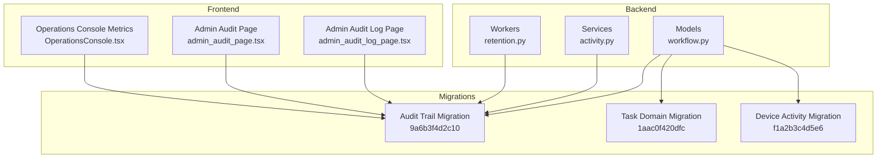
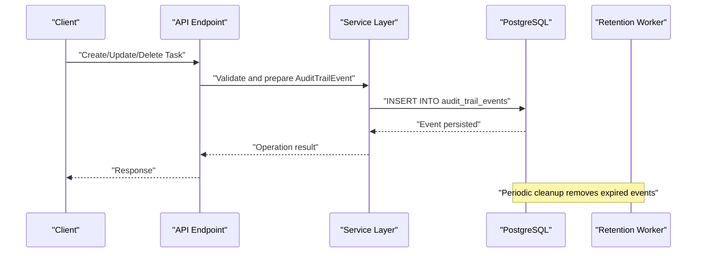
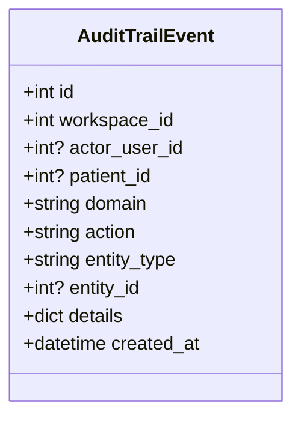
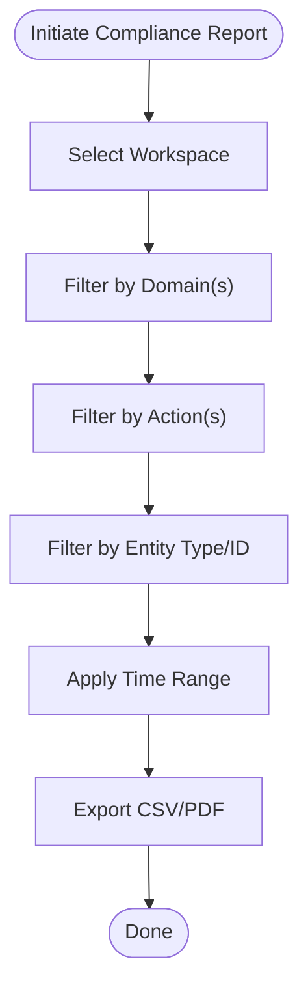
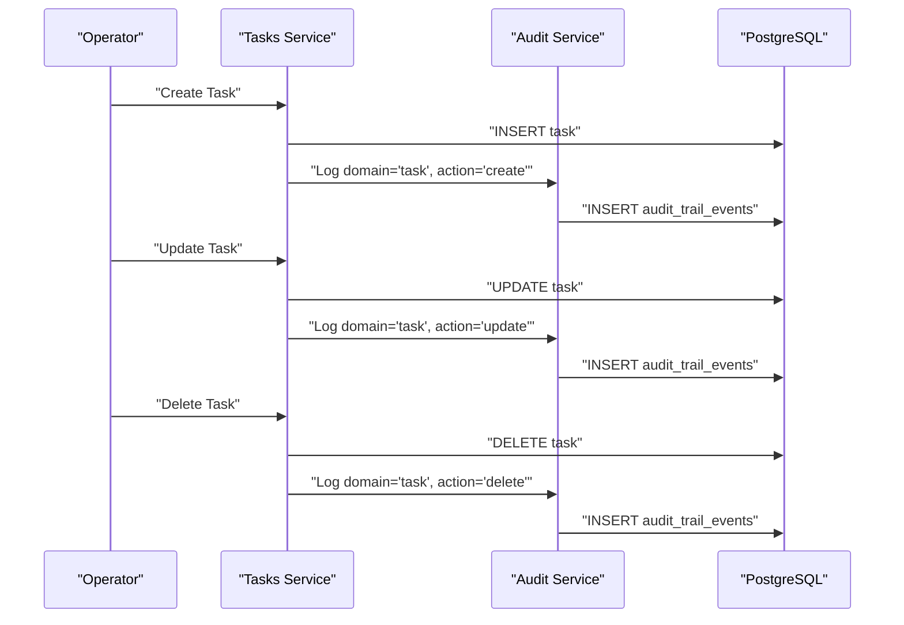
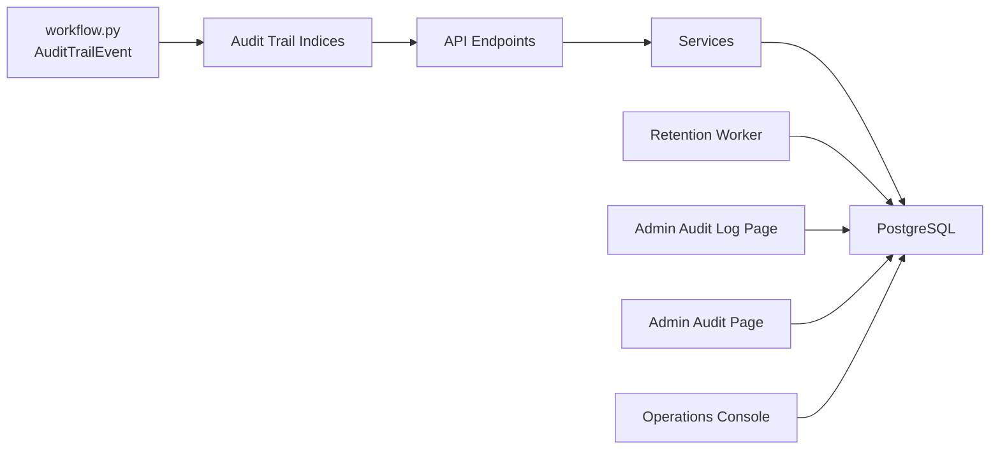

# Audit Trail & Compliance

<cite>
**Referenced Files in This Document**
- [audit_trail_events.py](file://server/alembic/versions/9a6b3f4d2c10_add_workflow_domain_tables.py)
- [audit_trail_events.py](file://server/alembic/versions/1aac0f420dfc_add_task_management_tables.py)
- [audit_trail_events.py](file://server/alembic/versions/f1a2b3c4d5e6_add_device_activity_events.py)
- [workflow.py](file://server/app/models/workflow.py)
- [tasks.py](file://server/app/models/tasks.py)
- [task_management.py](file://server/app/schemas/task_management.py)
- [activity.py](file://server/app/models/activity.py)
- [activity.py](file://server/app/schemas/activity.py)
- [activity.py](file://server/app/services/activity.py)
- [OperationsConsole.tsx](file://frontend/components/workflow/OperationsConsole.tsx)
- [admin_audit_log_page.tsx](file://frontend/app/admin/audit-log/page.tsx)
- [admin_audit_page.tsx](file://frontend/app/admin/audit/page.tsx)
- [retention.py](file://server/app/services/retention.py)
- [retention.py](file://server/tests/test_retention.py)
- [retention.py](file://server/alembic/versions/1aac0f420dfc_add_task_management_tables.py)
- [retention.py](file://server/app/workers/tasks/retention.py)
</cite>

## Table of Contents
1. [Introduction](#introduction)
2. [Project Structure](#project-structure)
3. [Core Components](#core-components)
4. [Architecture Overview](#architecture-overview)
5. [Detailed Component Analysis](#detailed-component-analysis)
6. [Dependency Analysis](#dependency-analysis)
7. [Performance Considerations](#performance-considerations)
8. [Troubleshooting Guide](#troubleshooting-guide)
9. [Conclusion](#conclusion)
10. [Appendices](#appendices)

## Introduction
This document describes the WheelSense Platform’s audit trail and compliance system. It focuses on the AuditTrailEvent model, event logging mechanisms, and compliance reporting capabilities. It explains the audit architecture including event categorization by domain (task, schedule, directive, messaging, device), action types, and entity tracking. It also covers compliance features such as impersonation tracking, workspace scoping, and patient privacy protection. Query capabilities, filtering by domain/action/entity type, and time-based searches are documented, along with integration with workflow operations (task creation, updates, and deletions). Practical examples illustrate querying audit trails, generating compliance reports, and tracking user activities. Finally, it addresses audit retention policies, data privacy considerations, and alignment with regulatory compliance requirements.

## Project Structure
The audit trail and compliance features span backend models and migrations, frontend reporting pages, and retention services. The backend defines the AuditTrailEvent model and related indices, while the frontend surfaces audit data for administrators and workflow operators. Retention policies govern lifecycle management of audit events.

**Diagram sources**
- [workflow.py:180-196](file://server/app/models/workflow.py#L180-L196)
- [audit_trail_events.py:180-191](file://server/alembic/versions/9a6b3f4d2c10_add_workflow_domain_tables.py#L180-L191)
- [audit_trail_events.py:220-223](file://server/alembic/versions/1aac0f420dfc_add_task_management_tables.py#L220-L223)
- [audit_trail_events.py:21-78](file://server/alembic/versions/f1a2b3c4d5e6_add_device_activity_events.py#L21-L78)
- [activity.py:19-75](file://server/app/services/activity.py#L19-L75)
- [OperationsConsole.tsx:593-621](file://frontend/components/workflow/OperationsConsole.tsx#L593-L621)
- [admin_audit_log_page.tsx](file://frontend/app/admin/audit-log/page.tsx)
- [admin_audit_page.tsx](file://frontend/app/admin/audit/page.tsx)

**Section sources**
- [workflow.py:180-196](file://server/app/models/workflow.py#L180-L196)
- [audit_trail_events.py:180-191](file://server/alembic/versions/9a6b3f4d2c10_add_workflow_domain_tables.py#L180-L191)
- [audit_trail_events.py:220-223](file://server/alembic/versions/1aac0f420dfc_add_task_management_tables.py#L220-L223)
- [audit_trail_events.py:21-78](file://server/alembic/versions/f1a2b3c4d5e6_add_device_activity_events.py#L21-L78)
- [activity.py:19-75](file://server/app/services/activity.py#L19-L75)
- [OperationsConsole.tsx:593-621](file://frontend/components/workflow/OperationsConsole.tsx#L593-L621)
- [admin_audit_log_page.tsx](file://frontend/app/admin/audit-log/page.tsx)
- [admin_audit_page.tsx](file://frontend/app/admin/audit/page.tsx)

## Core Components
- AuditTrailEvent model: central event record with workspace scoping, actor identification, domain/action/entity classification, and timestamps.
- Device activity events: separate table for administrative device registry events with workspace scoping and indices.
- Task management domain: models and schemas for routine tasks, logs, and patient fix routines; integrates with audit via domain/action/entity metadata.
- Activity timeline and alerts: separate but complementary event streams for patient activity and actionable alerts.
- Frontend audit reporting: admin pages and workflow console metrics for viewing and filtering audit events.

Key attributes and indices:
- AuditTrailEvent: workspace_id, actor_user_id, patient_id, domain, action, entity_type, entity_id, created_at, with composite index workspace_id+domain+created_at.
- Device activity events: workspace_id, occurred_at, event_type, registry_device_id, smart_device_id.

**Section sources**
- [workflow.py:180-196](file://server/app/models/workflow.py#L180-L196)
- [audit_trail_events.py:180-191](file://server/alembic/versions/9a6b3f4d2c10_add_workflow_domain_tables.py#L180-L191)
- [audit_trail_events.py:26-68](file://server/alembic/versions/f1a2b3c4d5e6_add_device_activity_events.py#L26-L68)
- [tasks.py:22-129](file://server/app/models/tasks.py#L22-L129)
- [task_management.py:11-166](file://server/app/schemas/task_management.py#L11-L166)

## Architecture Overview
The audit trail architecture separates concerns between event generation, persistence, indexing, querying, and presentation. Events are categorized by domain (task, schedule, directive, messaging, device), action (create, update, delete, approve, reject, submit), and entity (task, schedule, directive, message, device). Workspace scoping ensures isolation across facilities. Impersonation is tracked via actor_user_id. Patient privacy is enforced by scoping events to the workspace and optionally linking to patient_id where applicable.

**Diagram sources**
- [workflow.py:180-196](file://server/app/models/workflow.py#L180-L196)
- [audit_trail_events.py:180-191](file://server/alembic/versions/9a6b3f4d2c10_add_workflow_domain_tables.py#L180-L191)
- [retention.py](file://server/app/workers/tasks/retention.py)

## Detailed Component Analysis

### AuditTrailEvent Model
The AuditTrailEvent model captures every auditable action with:
- workspace_id: enforces workspace-scoped visibility and retention.
- actor_user_id: identifies the acting user; supports impersonation tracking when present.
- patient_id: optional linkage to patient records for privacy-sensitive actions.
- domain: high-level functional area (task, schedule, directive, messaging, device).
- action: operation performed (create, update, delete, approve, reject, submit, etc.).
- entity_type and entity_id: identifies the specific resource type and identifier.
- details: structured payload for contextual information.
- created_at: timestamp for time-based queries.

Indices optimize filtering by workspace, domain, action, entity, and time.

**Diagram sources**
- [workflow.py:180-196](file://server/app/models/workflow.py#L180-L196)

**Section sources**
- [workflow.py:180-196](file://server/app/models/workflow.py#L180-L196)
- [audit_trail_events.py:180-191](file://server/alembic/versions/9a6b3f4d2c10_add_workflow_domain_tables.py#L180-L191)

### Event Logging Mechanisms
- Domain coverage: task, schedule, directive, messaging, device.
- Action coverage: create, update, delete, approve, reject, submit, attach, detach, resolve, escalate, etc.
- Entity tracking: tasks, schedules, directives, workflow messages, devices, rooms, patients.
- Context capture: details field stores operation-specific metadata (e.g., changed fields, attachments).
- Workspace scoping: all events are bound to workspace_id for isolation.
- Optional patient linkage: patient_id enables privacy-aware filtering and reporting.

Practical examples of event categorization:
- Task creation: domain="task", action="create", entity_type="Task", entity_id=<taskId>.
- Task update: domain="task", action="update", entity_type="Task", entity_id=<taskId>, details includes changed fields.
- Directive approval: domain="directive", action="approve", entity_type="Directive", entity_id=<directiveId>.
- Messaging attachment: domain="messaging", action="attach", entity_type="Message", entity_id=<messageId>.
- Device registry change: domain="device", action="update", entity_type="Device", entity_id=<deviceId>.

**Section sources**
- [audit_trail_events.py:180-191](file://server/alembic/versions/9a6b3f4d2c10_add_workflow_domain_tables.py#L180-L191)
- [audit_trail_events.py:220-223](file://server/alembic/versions/1aac0f420dfc_add_task_management_tables.py#L220-L223)
- [audit_trail_events.py:26-68](file://server/alembic/versions/f1a2b3c4d5e6_add_device_activity_events.py#L26-L68)

### Compliance Reporting Capabilities
- Workspace scoping: all queries filter by workspace_id to prevent cross-workspace disclosure.
- Patient privacy: optional patient_id linkage allows targeted filtering; sensitive views restrict access to authorized users.
- Impersonation tracking: actor_user_id enables attribution of actions performed on behalf of another user.
- Filtering: by domain, action, entity_type, entity_id, and time range.
- Reporting surfaces: admin audit log page and workflow console metrics expose filtered event counts and summaries.

**Section sources**
- [admin_audit_log_page.tsx](file://frontend/app/admin/audit-log/page.tsx)
- [admin_audit_page.tsx](file://frontend/app/admin/audit/page.tsx)
- [OperationsConsole.tsx:593-621](file://frontend/components/workflow/OperationsConsole.tsx#L593-L621)

### Integration with Workflow Operations
Task lifecycle events are integrated into the audit trail:
- Creation: domain="task", action="create", entity_type="Task".
- Updates: domain="task", action="update", entity_type="Task", details includes modified fields.
- Deletion: domain="task", action="delete", entity_type="Task".
- Completion/Reports: domain="task", action="submit", entity_type="TaskReport".

**Diagram sources**
- [tasks.py:22-129](file://server/app/models/tasks.py#L22-L129)
- [task_management.py:11-166](file://server/app/schemas/task_management.py#L11-L166)
- [audit_trail_events.py:180-191](file://server/alembic/versions/9a6b3f4d2c10_add_workflow_domain_tables.py#L180-L191)

**Section sources**
- [tasks.py:22-129](file://server/app/models/tasks.py#L22-L129)
- [task_management.py:11-166](file://server/app/schemas/task_management.py#L11-L166)

### Device Activity Events
Administrative device registry changes are captured separately in device_activity_events with:
- workspace_id, occurred_at, event_type, summary, registry_device_id, smart_device_id, details.
- Indexed for efficient querying by workspace, time, and device identifiers.

**Section sources**
- [audit_trail_events.py:21-78](file://server/alembic/versions/f1a2b3c4d5e6_add_device_activity_events.py#L21-L78)

### Activity Timeline and Alerts
While distinct from the audit trail, the activity timeline and alerts complement compliance by capturing patient-centric events and actionable alerts:
- ActivityTimeline: room transitions, falls, observations, meals, mode switches, activity start/end.
- Alert: fall, abnormal heart rate, low battery, device offline, zone violation, missed medication, no movement.
- Both support workspace scoping and optional patient linkage.

**Section sources**
- [activity.py:14-90](file://server/app/models/activity.py#L14-L90)
- [activity.py:12-70](file://server/app/schemas/activity.py#L12-L70)
- [activity.py:19-75](file://server/app/services/activity.py#L19-L75)

## Dependency Analysis
The audit trail depends on:
- Models and migrations for schema definition and indices.
- Services that generate and persist events.
- Workers that enforce retention policies.
- Frontend pages that render filtered views.

**Diagram sources**
- [workflow.py:180-196](file://server/app/models/workflow.py#L180-L196)
- [audit_trail_events.py:180-191](file://server/alembic/versions/9a6b3f4d2c10_add_workflow_domain_tables.py#L180-L191)
- [retention.py](file://server/app/workers/tasks/retention.py)
- [admin_audit_log_page.tsx](file://frontend/app/admin/audit-log/page.tsx)
- [admin_audit_page.tsx](file://frontend/app/admin/audit/page.tsx)
- [OperationsConsole.tsx:593-621](file://frontend/components/workflow/OperationsConsole.tsx#L593-L621)

**Section sources**
- [workflow.py:180-196](file://server/app/models/workflow.py#L180-L196)
- [audit_trail_events.py:180-191](file://server/alembic/versions/9a6b3f4d2c10_add_workflow_domain_tables.py#L180-L191)
- [retention.py](file://server/app/workers/tasks/retention.py)
- [admin_audit_log_page.tsx](file://frontend/app/admin/audit-log/page.tsx)
- [admin_audit_page.tsx](file://frontend/app/admin/audit/page.tsx)
- [OperationsConsole.tsx:593-621](file://frontend/components/workflow/OperationsConsole.tsx#L593-L621)

## Performance Considerations
- Indexing: composite index workspace_id+domain+created_at optimizes common queries.
- JSON/JSONB: details fields use JSON with PostgreSQL variant JSONB for efficient storage and querying.
- Pagination: queries should limit results and order by created_at desc.
- Partitioning: consider time-based partitioning for very large datasets.
- Background cleanup: retention worker removes expired events to maintain performance.

[No sources needed since this section provides general guidance]

## Troubleshooting Guide
Common issues and resolutions:
- Missing indices: ensure migration ran to create audit trail indices.
- No events found: verify workspace_id and time range filters; check domain/action/entity filters.
- Privacy violations: confirm patient_id linkage and workspace scoping; restrict access to authorized users.
- Retention cleanup: verify retention worker is scheduled and configured.

**Section sources**
- [audit_trail_events.py:180-191](file://server/alembic/versions/9a6b3f4d2c10_add_workflow_domain_tables.py#L180-L191)
- [retention.py](file://server/app/workers/tasks/retention.py)
- [retention.py](file://server/tests/test_retention.py)

## Conclusion
The WheelSense Platform’s audit trail and compliance system provides robust, workspace-scoped event logging with granular categorization by domain, action, and entity. It supports impersonation tracking, patient privacy protection, and comprehensive filtering for compliance reporting. Integrations with workflow operations ensure full traceability of task lifecycles. Retention policies and indexing maintain performance and data lifecycle governance.

[No sources needed since this section summarizes without analyzing specific files]

## Appendices

### Practical Examples

- Querying audit trails:
  - Filter by workspace and time range.
  - Narrow by domain (e.g., task), action (e.g., update), and entity type (e.g., Task).
  - Include patient-scoped queries where appropriate.

- Generating compliance reports:
  - Aggregate counts by domain and action.
  - Export filtered sets for regulatory submissions.
  - Include details payloads for detailed review.

- Tracking user activities:
  - Attribute actions to actor_user_id.
  - Combine with workspace scoping to isolate activity timelines.

[No sources needed since this section provides general guidance]

### Audit Trail Retention Policies
- Retention worker periodically purges expired events based on configured retention periods.
- Policies should align with regulatory requirements (e.g., minimum retention for audits).
- Backups and immutable archival can be considered for long-term compliance.

**Section sources**
- [retention.py](file://server/app/services/retention.py)
- [retention.py](file://server/tests/test_retention.py)
- [audit_trail_events.py:220-223](file://server/alembic/versions/1aac0f420dfc_add_task_management_tables.py#L220-L223)