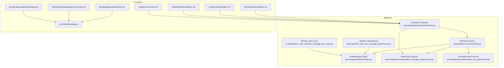
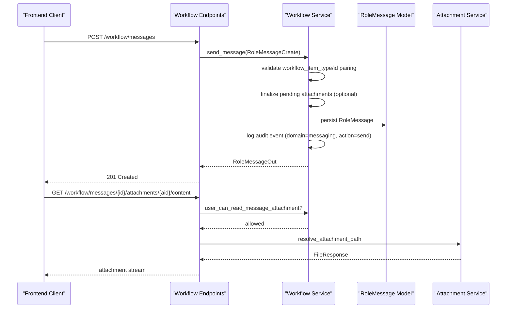
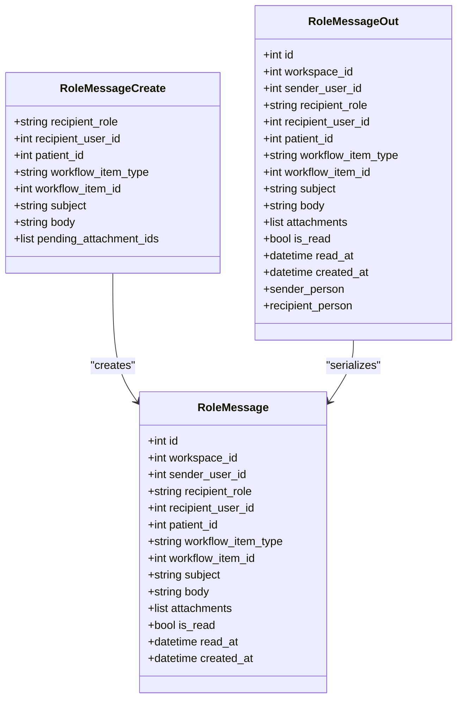
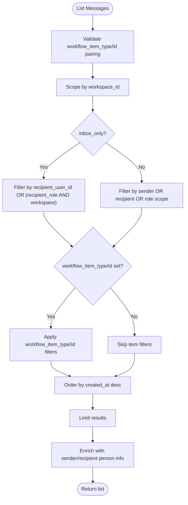
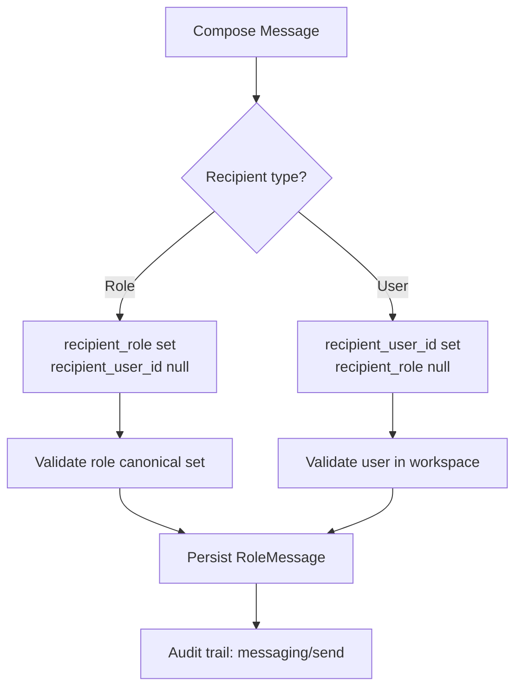
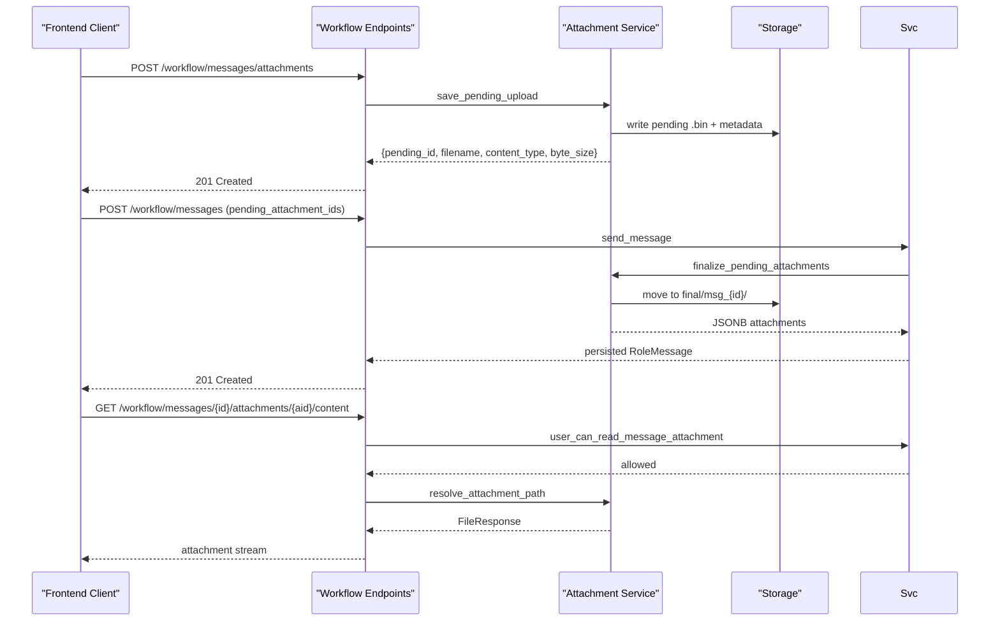
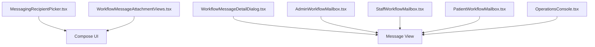
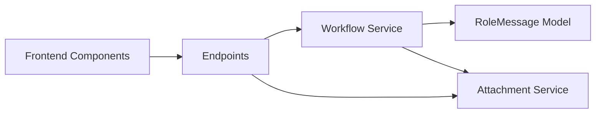

# Messaging System

<cite>
**Referenced Files in This Document**
- [models/workflow.py](file://server/app/models/workflow.py)
- [schemas/workflow.py](file://server/app/schemas/workflow.py)
- [services/workflow.py](file://server/app/services/workflow.py)
- [api/endpoints/workflow.py](file://server/app/api/endpoints/workflow.py)
- [services/workflow_message_attachments.py](file://server/app/services/workflow_message_attachments.py)
- [services/workflow_job_attachments.py](file://server/app/services/workflow_job_attachments.py)
- [alembic/versions/x9y0z1a2b3c4_add_role_message_attachments.py](file://server/alembic/versions/x9y0z1a2b3c4_add_role_message_attachments.py)
- [alembic/versions/m7n8o9p0q1r2_add_workflow_message_item_links.py](file://server/alembic/versions/m7n8o9p0q1r2_add_workflow_message_item_links.py)
- [frontend/lib/workflowMessaging.ts](file://frontend/lib/workflowMessaging.ts)
- [frontend/components/messaging/MessagingRecipientPicker.tsx](file://frontend/components/messaging/MessagingRecipientPicker.tsx)
- [frontend/components/messaging/WorkflowMessageAttachmentViews.tsx](file://frontend/components/messaging/WorkflowMessageAttachmentViews.tsx)
- [frontend/components/messaging/WorkflowMessageDetailDialog.tsx](file://frontend/components/messaging/WorkflowMessageDetailDialog.tsx)
- [frontend/components/messaging/AdminWorkflowMailbox.tsx](file://frontend/components/messaging/AdminWorkflowMailbox.tsx)
- [frontend/components/messaging/StaffWorkflowMailbox.tsx](file://frontend/components/messaging/StaffWorkflowMailbox.tsx)
- [frontend/components/messaging/PatientWorkflowMailbox.tsx](file://frontend/components/messaging/PatientWorkflowMailbox.tsx)
- [frontend/components/workflow/OperationsConsole.tsx](file://frontend/components/workflow/OperationsConsole.tsx)
</cite>

## Table of Contents
1. [Introduction](#introduction)
2. [Project Structure](#project-structure)
3. [Core Components](#core-components)
4. [Architecture Overview](#architecture-overview)
5. [Detailed Component Analysis](#detailed-component-analysis)
6. [Dependency Analysis](#dependency-analysis)
7. [Performance Considerations](#performance-considerations)
8. [Troubleshooting Guide](#troubleshooting-guide)
9. [Conclusion](#conclusion)
10. [Appendices](#appendices)

## Introduction
This document describes the role-based messaging system in the WheelSense Platform. It covers the RoleMessage model, message threading via workflow item scoping, sender/recipient resolution, role-based routing, patient-scoped messaging, and the integrated attachment system. It also documents UI components for composing, viewing, and previewing messages and attachments, along with practical examples, permissions, audit trails, and integration with role switching and workspace scoping.

## Project Structure
The messaging system spans backend SQLAlchemy models and FastAPI endpoints, business logic services, and frontend UI components. Key areas:
- Backend models define RoleMessage and related audit trail structures.
- Schemas define request/response shapes for messaging.
- Services implement business logic for sending, listing, marking read, deleting, and attachment handling.
- Endpoints expose REST APIs for messaging operations and attachment retrieval.
- Frontend components provide recipient selection, compose UI, thread viewing, and attachment previews.
- Alembic migrations introduce attachments and workflow item linking to RoleMessage.

**Diagram sources**
- [models/workflow.py:67-89](file://server/app/models/workflow.py#L67-L89)
- [services/workflow.py:1019-1055](file://server/app/services/workflow.py#L1019-L1055)
- [api/endpoints/workflow.py:261-324](file://server/app/api/endpoints/workflow.py#L261-L324)
- [services/workflow_message_attachments.py:1-153](file://server/app/services/workflow_message_attachments.py#L1-L153)
- [services/workflow_job_attachments.py:1-55](file://server/app/services/workflow_job_attachments.py#L1-L55)
- [alembic/versions/x9y0z1a2b3c4_add_role_message_attachments.py:20-31](file://server/alembic/versions/x9y0z1a2b3c4_add_role_message_attachments.py#L20-L31)
- [alembic/versions/m7n8o9p0q1r2_add_workflow_message_item_links.py:20-46](file://server/alembic/versions/m7n8o9p0q1r2_add_workflow_message_item_links.py#L20-L46)
- [frontend/components/messaging/MessagingRecipientPicker.tsx:1-155](file://frontend/components/messaging/MessagingRecipientPicker.tsx#L1-L155)
- [frontend/components/messaging/WorkflowMessageAttachmentViews.tsx:1-142](file://frontend/components/messaging/WorkflowMessageAttachmentViews.tsx#L1-L142)
- [frontend/components/messaging/WorkflowMessageDetailDialog.tsx:1-102](file://frontend/components/messaging/WorkflowMessageDetailDialog.tsx#L1-L102)
- [frontend/components/messaging/AdminWorkflowMailbox.tsx:213-459](file://frontend/components/messaging/AdminWorkflowMailbox.tsx#L213-L459)
- [frontend/components/messaging/StaffWorkflowMailbox.tsx:365-494](file://frontend/components/messaging/StaffWorkflowMailbox.tsx#L365-L494)
- [frontend/components/messaging/PatientWorkflowMailbox.tsx:346-370](file://frontend/components/messaging/PatientWorkflowMailbox.tsx#L346-L370)
- [frontend/components/workflow/OperationsConsole.tsx:2707-2741](file://frontend/components/workflow/OperationsConsole.tsx#L2707-L2741)
- [frontend/lib/workflowMessaging.ts:1-21](file://frontend/lib/workflowMessaging.ts#L1-L21)

**Section sources**
- [models/workflow.py:67-89](file://server/app/models/workflow.py#L67-L89)
- [schemas/workflow.py:124-197](file://server/app/schemas/workflow.py#L124-L197)
- [services/workflow.py:1019-1055](file://server/app/services/workflow.py#L1019-L1055)
- [api/endpoints/workflow.py:261-324](file://server/app/api/endpoints/workflow.py#L261-L324)
- [services/workflow_message_attachments.py:1-153](file://server/app/services/workflow_message_attachments.py#L1-L153)
- [services/workflow_job_attachments.py:1-55](file://server/app/services/workflow_job_attachments.py#L1-L55)
- [alembic/versions/x9y0z1a2b3c4_add_role_message_attachments.py:20-31](file://server/alembic/versions/x9y0z1a2b3c4_add_role_message_attachments.py#L20-L31)
- [alembic/versions/m7n8o9p0q1r2_add_workflow_message_item_links.py:20-46](file://server/alembic/versions/m7n8o9p0q1r2_add_workflow_message_item_links.py#L20-L46)
- [frontend/lib/workflowMessaging.ts:1-21](file://frontend/lib/workflowMessaging.ts#L1-L21)
- [frontend/components/messaging/MessagingRecipientPicker.tsx:1-155](file://frontend/components/messaging/MessagingRecipientPicker.tsx#L1-L155)
- [frontend/components/messaging/WorkflowMessageAttachmentViews.tsx:1-142](file://frontend/components/messaging/WorkflowMessageAttachmentViews.tsx#L1-L142)
- [frontend/components/messaging/WorkflowMessageDetailDialog.tsx:1-102](file://frontend/components/messaging/WorkflowMessageDetailDialog.tsx#L1-L102)
- [frontend/components/messaging/AdminWorkflowMailbox.tsx:213-459](file://frontend/components/messaging/AdminWorkflowMailbox.tsx#L213-L459)
- [frontend/components/messaging/StaffWorkflowMailbox.tsx:365-494](file://frontend/components/messaging/StaffWorkflowMailbox.tsx#L365-L494)
- [frontend/components/messaging/PatientWorkflowMailbox.tsx:346-370](file://frontend/components/messaging/PatientWorkflowMailbox.tsx#L346-L370)
- [frontend/components/workflow/OperationsConsole.tsx:2707-2741](file://frontend/components/workflow/OperationsConsole.tsx#L2707-L2741)

## Core Components
- RoleMessage model: Stores workspace-scoped messages with optional patient scope, role-based recipients, user-based recipients, optional workflow item linkage, subject/body, JSONB attachments, read state, and timestamps.
- RoleMessage schemas: Pydantic models for creation and output, including normalized attachment metadata.
- Workflow service: Implements send/list/mark_read/delete operations, validates workflow item references, enforces workspace/patient scoping, and enriches message records with person metadata.
- Endpoints: Expose REST APIs for listing, sending, marking read, deleting, uploading pending attachments, and retrieving attachment content.
- Attachment services: Pending upload persistence and finalization for message attachments; job attachments share the same pending storage root for cross-domain reuse.
- Frontend components: Recipient picker, compose UI, message detail dialog, mailbox views, and thread reply form.

**Section sources**
- [models/workflow.py:67-89](file://server/app/models/workflow.py#L67-L89)
- [schemas/workflow.py:124-197](file://server/app/schemas/workflow.py#L124-L197)
- [services/workflow.py:1019-1055](file://server/app/services/workflow.py#L1019-L1055)
- [api/endpoints/workflow.py:261-384](file://server/app/api/endpoints/workflow.py#L261-L384)
- [services/workflow_message_attachments.py:1-153](file://server/app/services/workflow_message_attachments.py#L1-L153)
- [services/workflow_job_attachments.py:1-55](file://server/app/services/workflow_job_attachments.py#L1-L55)
- [frontend/components/messaging/MessagingRecipientPicker.tsx:1-155](file://frontend/components/messaging/MessagingRecipientPicker.tsx#L1-L155)
- [frontend/components/messaging/WorkflowMessageAttachmentViews.tsx:1-142](file://frontend/components/messaging/WorkflowMessageAttachmentViews.tsx#L1-L142)
- [frontend/components/messaging/WorkflowMessageDetailDialog.tsx:1-102](file://frontend/components/messaging/WorkflowMessageDetailDialog.tsx#L1-L102)
- [frontend/components/messaging/AdminWorkflowMailbox.tsx:213-459](file://frontend/components/messaging/AdminWorkflowMailbox.tsx#L213-L459)
- [frontend/components/messaging/StaffWorkflowMailbox.tsx:365-494](file://frontend/components/messaging/StaffWorkflowMailbox.tsx#L365-L494)
- [frontend/components/messaging/PatientWorkflowMailbox.tsx:346-370](file://frontend/components/messaging/PatientWorkflowMailbox.tsx#L346-L370)
- [frontend/components/workflow/OperationsConsole.tsx:2707-2741](file://frontend/components/workflow/OperationsConsole.tsx#L2707-L2741)

## Architecture Overview
The messaging architecture integrates role-based routing, workspace scoping, and optional patient scoping. Messages can be addressed to a specific user or to a role within the current workspace. Optional workflow item linkage groups messages by task, schedule, or directive. Attachments are staged as pending uploads and finalized into message-specific storage.

**Diagram sources**
- [api/endpoints/workflow.py:315-384](file://server/app/api/endpoints/workflow.py#L315-L384)
- [services/workflow.py:1019-1017](file://server/app/services/workflow.py#L1019-L1017)
- [services/workflow_message_attachments.py:1-153](file://server/app/services/workflow_message_attachments.py#L1-L153)

**Section sources**
- [api/endpoints/workflow.py:261-384](file://server/app/api/endpoints/workflow.py#L261-L384)
- [services/workflow.py:1019-1017](file://server/app/services/workflow.py#L1019-L1017)
- [services/workflow_message_attachments.py:1-153](file://server/app/services/workflow_message_attachments.py#L1-L153)

## Detailed Component Analysis

### RoleMessage Model and Schema
- Fields include workspace_id, sender_user_id, optional recipient_role and recipient_user_id, optional patient_id, optional workflow_item_type and workflow_item_id, subject, body, JSONB attachments, is_read/read_at, and created_at.
- Schemas enforce that either a user or a role recipient is set, and that either both workflow_item_type and workflow_item_id are provided or neither is.

**Diagram sources**
- [models/workflow.py:67-89](file://server/app/models/workflow.py#L67-L89)
- [schemas/workflow.py:138-197](file://server/app/schemas/workflow.py#L138-L197)

**Section sources**
- [models/workflow.py:67-89](file://server/app/models/workflow.py#L67-L89)
- [schemas/workflow.py:138-197](file://server/app/schemas/workflow.py#L138-L197)

### Message Threading and Workflow Item Categorization
- Listing supports inbox_only filtering and optional inclusion of sent messages. Filtering by workflow_item_type and workflow_item_id groups messages by task, schedule, or directive.
- The service validates that both workflow_item_type and workflow_item_id are provided together and that the referenced item exists in the workspace.

**Diagram sources**
- [services/workflow.py:1019-1055](file://server/app/services/workflow.py#L1019-L1055)

**Section sources**
- [services/workflow.py:1019-1055](file://server/app/services/workflow.py#L1019-L1055)

### Sender/Recipient Resolution and Role-Based Routing
- Recipients can be targeted by role or by a specific user. Validation ensures only one of recipient_role or recipient_user_id is set.
- Role-based routing allows broadcasting to roles within the current workspace; user-based routing targets a specific user account present in the workspace.
- Workspace scoping ensures users and patients belong to the current workspace; patient scoping restricts visibility when a patient is associated with the message.

**Diagram sources**
- [schemas/workflow.py:138-158](file://server/app/schemas/workflow.py#L138-L158)
- [services/workflow.py:59-78](file://server/app/services/workflow.py#L59-L78)
- [services/workflow.py:79-122](file://server/app/services/workflow.py#L79-L122)

**Section sources**
- [schemas/workflow.py:138-158](file://server/app/schemas/workflow.py#L138-L158)
- [services/workflow.py:59-78](file://server/app/services/workflow.py#L59-L78)
- [services/workflow.py:79-122](file://server/app/services/workflow.py#L79-L122)

### Patient-Scoped Messaging
- Optional patient_id scopes messages to a specific patient within the workspace. Visibility logic ensures that when a patient is provided, only authorized users can access messages linked to that patient.
- The service enforces that the patient belongs to the current workspace.

**Section sources**
- [models/workflow.py:75-75](file://server/app/models/workflow.py#L75-L75)
- [services/workflow.py:102-122](file://server/app/services/workflow.py#L102-L122)

### Attachment System for Workflow Messages
- Pending uploads: Clients upload files to a pending endpoint; metadata is stored with a pending_id.
- Finalization: During send, pending_attachment_ids are resolved and moved into a message-specific final directory; JSONB attachments record id, filename, content_type, and byte_size.
- Retrieval: Attachment content is served via a protected endpoint using the message id and attachment id; access is validated against the current user’s role and workspace.
- Limits: Maximum 5 attachments per message, maximum 8 MiB per file.

**Diagram sources**
- [api/endpoints/workflow.py:345-384](file://server/app/api/endpoints/workflow.py#L345-L384)
- [services/workflow_message_attachments.py:1-153](file://server/app/services/workflow_message_attachments.py#L1-L153)
- [frontend/lib/workflowMessaging.ts:1-21](file://frontend/lib/workflowMessaging.ts#L1-L21)

**Section sources**
- [api/endpoints/workflow.py:345-384](file://server/app/api/endpoints/workflow.py#L345-L384)
- [services/workflow_message_attachments.py:1-153](file://server/app/services/workflow_message_attachments.py#L1-L153)
- [frontend/lib/workflowMessaging.ts:1-21](file://frontend/lib/workflowMessaging.ts#L1-L21)

### Integration with Workflow Job Attachments
- Pending storage for job step attachments shares the same pending root as message attachments, enabling reuse of pending upload mechanics across domains.
- Finalized job step attachments are stored under a separate final path rooted at workflow-jobs.

**Section sources**
- [services/workflow_job_attachments.py:28-32](file://server/app/services/workflow_job_attachments.py#L28-L32)

### Messaging UI Components
- MessagingRecipientPicker: Allows searching and selecting recipients by role or user, with filtering and search capabilities.
- WorkflowMessageAttachmentViews: Provides compose-time attachment chips, choose-file UX, and read-only attachment links with download URLs.
- WorkflowMessageDetailDialog: Renders message subject/body and attachment links in a modal dialog.
- Mailboxes: AdminWorkflowMailbox, StaffWorkflowMailbox, PatientWorkflowMailbox provide inbox/sent/all tabs, message lists, and compose actions.
- OperationsConsole: Threaded display of recent messages with a reply form.

**Diagram sources**
- [frontend/components/messaging/MessagingRecipientPicker.tsx:1-155](file://frontend/components/messaging/MessagingRecipientPicker.tsx#L1-L155)
- [frontend/components/messaging/WorkflowMessageAttachmentViews.tsx:1-142](file://frontend/components/messaging/WorkflowMessageAttachmentViews.tsx#L1-L142)
- [frontend/components/messaging/WorkflowMessageDetailDialog.tsx:1-102](file://frontend/components/messaging/WorkflowMessageDetailDialog.tsx#L1-L102)
- [frontend/components/messaging/AdminWorkflowMailbox.tsx:213-459](file://frontend/components/messaging/AdminWorkflowMailbox.tsx#L213-L459)
- [frontend/components/messaging/StaffWorkflowMailbox.tsx:365-494](file://frontend/components/messaging/StaffWorkflowMailbox.tsx#L365-L494)
- [frontend/components/messaging/PatientWorkflowMailbox.tsx:346-370](file://frontend/components/messaging/PatientWorkflowMailbox.tsx#L346-L370)
- [frontend/components/workflow/OperationsConsole.tsx:2707-2741](file://frontend/components/workflow/OperationsConsole.tsx#L2707-L2741)

**Section sources**
- [frontend/components/messaging/MessagingRecipientPicker.tsx:1-155](file://frontend/components/messaging/MessagingRecipientPicker.tsx#L1-L155)
- [frontend/components/messaging/WorkflowMessageAttachmentViews.tsx:1-142](file://frontend/components/messaging/WorkflowMessageAttachmentViews.tsx#L1-L142)
- [frontend/components/messaging/WorkflowMessageDetailDialog.tsx:1-102](file://frontend/components/messaging/WorkflowMessageDetailDialog.tsx#L1-L102)
- [frontend/components/messaging/AdminWorkflowMailbox.tsx:213-459](file://frontend/components/messaging/AdminWorkflowMailbox.tsx#L213-L459)
- [frontend/components/messaging/StaffWorkflowMailbox.tsx:365-494](file://frontend/components/messaging/StaffWorkflowMailbox.tsx#L365-L494)
- [frontend/components/messaging/PatientWorkflowMailbox.tsx:346-370](file://frontend/components/messaging/PatientWorkflowMailbox.tsx#L346-L370)
- [frontend/components/workflow/OperationsConsole.tsx:2707-2741](file://frontend/components/workflow/OperationsConsole.tsx#L2707-L2741)

### Practical Examples
- Sending a workflow message:
  - Endpoint: POST /api/workflow/messages
  - Body includes recipient_role or recipient_user_id, optional patient_id, optional workflow_item_type and workflow_item_id, subject, body, and optional pending_attachment_ids.
  - On success, returns RoleMessageOut with enriched sender/recipient person metadata.
- Attaching files to a message:
  - Step 1: POST /api/workflow/messages/attachments to upload a file; receive pending_id.
  - Step 2: Include pending_id(s) in the send message request; attachments are finalized into the message’s storage.
- Navigating message threads:
  - Use GET /api/workflow/messages with inbox_only and optional workflow_item_type/id to list messages grouped by task/schedule/directive.
  - Open message detail dialog to view subject/body and attachments.
  - Use the thread reply form in OperationsConsole to send replies.

**Section sources**
- [api/endpoints/workflow.py:315-324](file://server/app/api/endpoints/workflow.py#L315-L324)
- [api/endpoints/workflow.py:345-365](file://server/app/api/endpoints/workflow.py#L345-L365)
- [api/endpoints/workflow.py:261-280](file://server/app/api/endpoints/workflow.py#L261-L280)
- [frontend/components/workflow/OperationsConsole.tsx:2707-2741](file://frontend/components/workflow/OperationsConsole.tsx#L2707-L2741)

### Permissions and Audit Trails
- Permissions:
  - Read/attachment access is validated against the current user’s identity and role.
  - Delete permission is granted to admins/head nurses and to the original sender or the intended recipient.
- Audit trails:
  - On send, an audit event is logged with domain=messaging, action=send, entity_type=role_message, and details including recipient role/user and attachment count.

**Section sources**
- [api/endpoints/workflow.py:376-384](file://server/app/api/endpoints/workflow.py#L376-L384)
- [services/workflow.py:1082-1099](file://server/app/services/workflow.py#L1082-L1099)
- [services/workflow.py:1000-1013](file://server/app/services/workflow.py#L1000-L1013)

### Integration with Role Switching and Workspace Scoping
- Workspace scoping:
  - Users and patients must belong to the current workspace; otherwise, operations fail with appropriate errors.
- Role switching:
  - Messaging respects the current authenticated role; role-based routing targets roles within the workspace.
  - Recipient directory endpoints return users available for messaging within the workspace.

**Section sources**
- [services/workflow.py:79-122](file://server/app/services/workflow.py#L79-L122)
- [api/endpoints/workflow.py:282-312](file://server/app/api/endpoints/workflow.py#L282-L312)

## Dependency Analysis
The messaging domain depends on:
- RoleMessage model for persistence.
- Workflow service for business logic and validation.
- Attachment services for pending upload and finalization.
- Endpoints for API exposure.
- Frontend components for user interaction.

**Diagram sources**
- [api/endpoints/workflow.py:261-384](file://server/app/api/endpoints/workflow.py#L261-L384)
- [services/workflow.py:1019-1055](file://server/app/services/workflow.py#L1019-L1055)
- [models/workflow.py:67-89](file://server/app/models/workflow.py#L67-L89)
- [services/workflow_message_attachments.py:1-153](file://server/app/services/workflow_message_attachments.py#L1-L153)

**Section sources**
- [api/endpoints/workflow.py:261-384](file://server/app/api/endpoints/workflow.py#L261-L384)
- [services/workflow.py:1019-1055](file://server/app/services/workflow.py#L1019-L1055)
- [models/workflow.py:67-89](file://server/app/models/workflow.py#L67-L89)
- [services/workflow_message_attachments.py:1-153](file://server/app/services/workflow_message_attachments.py#L1-L153)

## Performance Considerations
- Indexing: RoleMessage includes indices on workspace_id, recipient_role, recipient_user_id, workflow_item_type, workflow_item_id, and created_at to optimize queries.
- Pagination: Listing endpoints support limit parameters to constrain result sizes.
- Attachment size limits: Per-message and per-file limits reduce storage overhead and retrieval latency.
- Person enrichment: Batch loading of user ids minimizes repeated lookups during message listing.

**Section sources**
- [models/workflow.py:70-88](file://server/app/models/workflow.py#L70-L88)
- [services/workflow.py:1019-1055](file://server/app/services/workflow.py#L1019-L1055)
- [services/workflow_message_attachments.py:15-25](file://server/app/services/workflow_message_attachments.py#L15-L25)

## Troubleshooting Guide
Common issues and resolutions:
- Validation errors:
  - Missing recipient role/user or both set: ensure exactly one of recipient_role or recipient_user_id is provided.
  - Missing body or pending_attachment_ids: at least one is required.
  - Invalid workflow_item_type/id pairing: provide both or neither.
- Access denied:
  - Attachment retrieval fails if the current user lacks permission to read the message.
  - Delete fails if the user is not the sender or intended recipient and does not have admin/head nurse privileges.
- Workspace/patient errors:
  - Sending to a user or patient outside the current workspace fails validation.
  - Referencing a non-existent workflow item triggers a “not found” error.

**Section sources**
- [schemas/workflow.py:138-158](file://server/app/schemas/workflow.py#L138-L158)
- [services/workflow.py:123-136](file://server/app/services/workflow.py#L123-L136)
- [api/endpoints/workflow.py:376-384](file://server/app/api/endpoints/workflow.py#L376-L384)
- [services/workflow.py:1082-1099](file://server/app/services/workflow.py#L1082-L1099)
- [services/workflow.py:79-122](file://server/app/services/workflow.py#L79-L122)

## Conclusion
The WheelSense messaging system provides a robust, workspace-scoped, role-based communication layer integrated with workflow item categorization and secure attachment handling. Its design balances flexibility (role vs user targeting), safety (workspace and patient scoping), and usability (UI components for compose, view, and thread navigation). Audit trails and strict validation ensure accountability and correctness across operations.

## Appendices
- Database migrations:
  - RoleMessage attachments JSONB column added.
  - Workflow item type/id columns and indexes added for message categorization.

**Section sources**
- [alembic/versions/x9y0z1a2b3c4_add_role_message_attachments.py:20-31](file://server/alembic/versions/x9y0z1a2b3c4_add_role_message_attachments.py#L20-L31)
- [alembic/versions/m7n8o9p0q1r2_add_workflow_message_item_links.py:20-46](file://server/alembic/versions/m7n8o9p0q1r2_add_workflow_message_item_links.py#L20-L46)