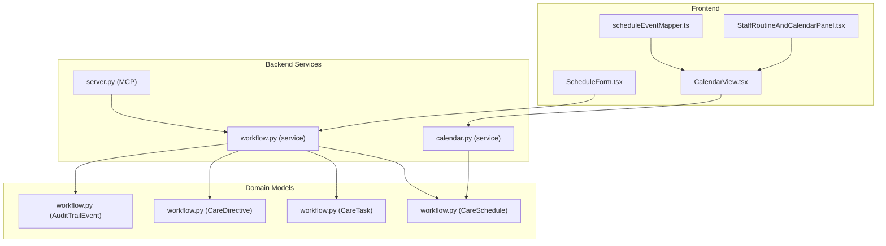
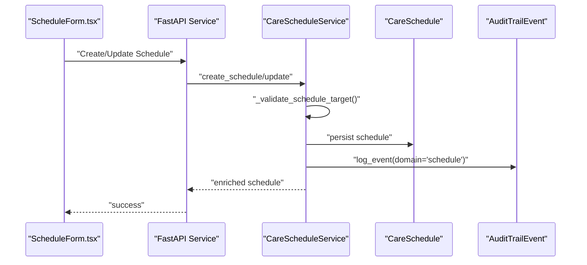
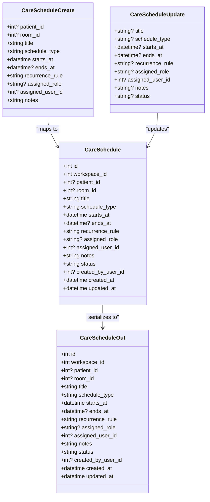
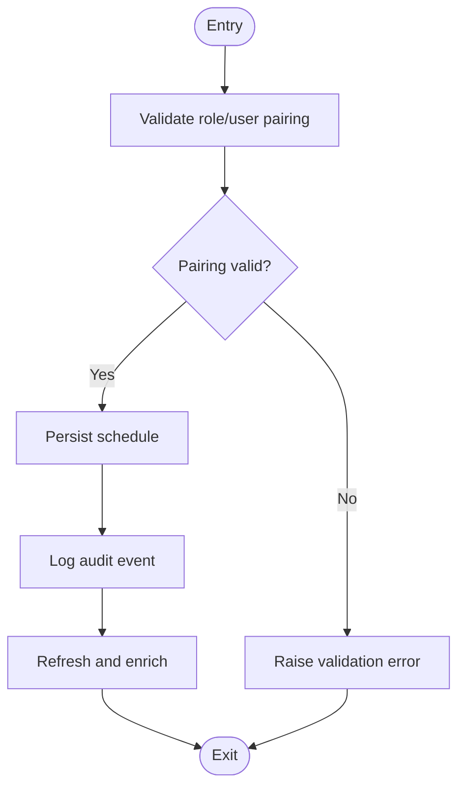
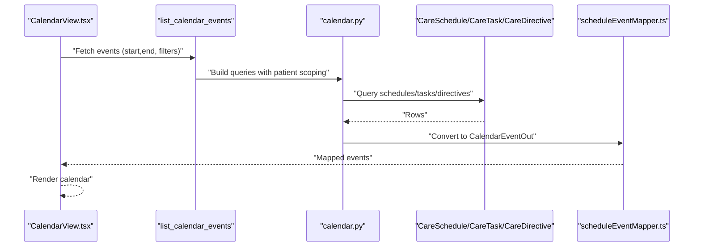
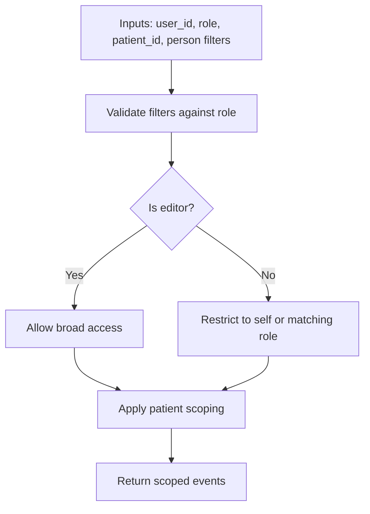
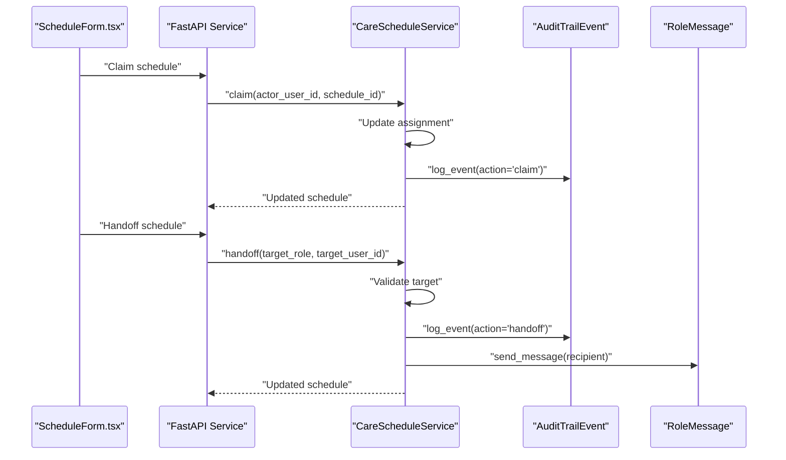
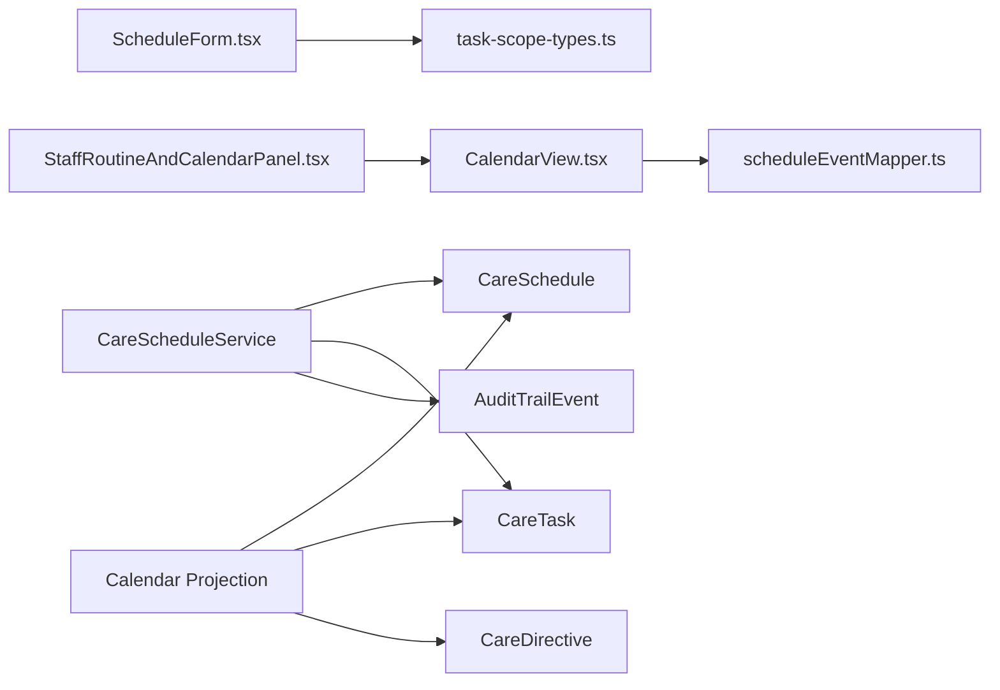

# Schedule Management

<cite>
**Referenced Files in This Document**
- [workflow.py](file://server/app/models/workflow.py)
- [workflow.py](file://server/app/schemas/workflow.py)
- [workflow.py](file://server/app/services/workflow.py)
- [calendar.py](file://server/app/services/calendar.py)
- [scheduleEventMapper.ts](file://frontend/components/calendar/scheduleEventMapper.ts)
- [CalendarView.tsx](file://frontend/components/calendar/CalendarView.tsx)
- [ScheduleForm.tsx](file://frontend/components/calendar/ScheduleForm.tsx)
- [StaffRoutineAndCalendarPanel.tsx](file://frontend/components/admin/caregivers/StaffRoutineAndCalendarPanel.tsx)
- [server.py](file://server/app/mcp/server.py)
- [seed_demo.py](file://server/scripts/seed_demo.py)
- [9a6b3f4d2c10_add_workflow_domain_tables.py](file://server/alembic/versions/9a6b3f4d2c10_add_workflow_domain_tables.py)
</cite>

## Table of Contents
1. [Introduction](#introduction)
2. [Project Structure](#project-structure)
3. [Core Components](#core-components)
4. [Architecture Overview](#architecture-overview)
5. [Detailed Component Analysis](#detailed-component-analysis)
6. [Dependency Analysis](#dependency-analysis)
7. [Performance Considerations](#performance-considerations)
8. [Troubleshooting Guide](#troubleshooting-guide)
9. [Conclusion](#conclusion)

## Introduction
This document describes the schedule management system in the WheelSense Platform. It focuses on the CareSchedule model, scheduling operations, calendar integration, and the lifecycle of schedules including creation, modification, status transitions, and ownership transfer via claim/handoff. It also covers schedule visibility rules, patient scoping, role-based access controls, audit trails, conflict detection, and the relationship between schedules and tasks, including how schedules can trigger automated task creation.

## Project Structure
The schedule management system spans backend SQLAlchemy models and Pydantic schemas, FastAPI services implementing business logic, and frontend components for calendar views and schedule forms. The calendar projection aggregates schedules, tasks, directives, and shifts into unified calendar events for display.



**Diagram sources**
- [ScheduleForm.tsx:1-587](file://frontend/components/calendar/ScheduleForm.tsx#L1-L587)
- [CalendarView.tsx](file://frontend/components/calendar/CalendarView.tsx)
- [scheduleEventMapper.ts:1-58](file://frontend/components/calendar/scheduleEventMapper.ts#L1-L58)
- [StaffRoutineAndCalendarPanel.tsx:249-282](file://frontend/components/admin/caregivers/StaffRoutineAndCalendarPanel.tsx#L249-L282)
- [workflow.py:424-620](file://server/app/services/workflow.py#L424-L620)
- [calendar.py:77-286](file://server/app/services/calendar.py#L77-L286)
- [server.py:1660-1678](file://server/app/mcp/server.py#L1660-L1678)
- [workflow.py:21-197](file://server/app/models/workflow.py#L21-L197)

**Section sources**
- [workflow.py:21-39](file://server/app/models/workflow.py#L21-L39)
- [workflow.py:40-82](file://server/app/schemas/workflow.py#L40-L82)
- [workflow.py:424-620](file://server/app/services/workflow.py#L424-L620)
- [calendar.py:77-286](file://server/app/services/calendar.py#L77-L286)
- [scheduleEventMapper.ts:1-58](file://frontend/components/calendar/scheduleEventMapper.ts#L1-L58)
- [ScheduleForm.tsx:1-587](file://frontend/components/calendar/ScheduleForm.tsx#L1-L587)
- [StaffRoutineAndCalendarPanel.tsx:249-282](file://frontend/components/admin/caregivers/StaffRoutineAndCalendarPanel.tsx#L249-L282)
- [server.py:1660-1678](file://server/app/mcp/server.py#L1660-L1678)

## Core Components
- CareSchedule model defines the schedule record with workspace scoping, patient/room association, timing, recurrence, assignment, status, and audit fields.
- Schemas define create/update/out shapes for schedules and integrate with frontend types.
- Service layer enforces validation rules for assigned roles/users, supports CRUD, status updates, claim, and handoff with audit trail logging.
- Calendar service projects schedules, tasks, directives, and shifts into calendar events with patient scoping and filter validation.
- Frontend components render calendar views, map schedules to calendar events, and provide schedule creation/editing forms.

**Section sources**
- [workflow.py:21-39](file://server/app/models/workflow.py#L21-L39)
- [workflow.py:40-82](file://server/app/schemas/workflow.py#L40-L82)
- [workflow.py:447-522](file://server/app/services/workflow.py#L447-L522)
- [calendar.py:77-286](file://server/app/services/calendar.py#L77-L286)
- [scheduleEventMapper.ts:25-58](file://frontend/components/calendar/scheduleEventMapper.ts#L25-L58)
- [ScheduleForm.tsx:57-81](file://frontend/components/calendar/ScheduleForm.tsx#L57-L81)

## Architecture Overview
The schedule lifecycle is orchestrated by the backend service layer with validation and audit, surfaced through calendar projections and UI forms. Ownership transfer uses claim (self-claim) and handoff (role/user-based), with optional role messaging for handoffs.



**Diagram sources**
- [ScheduleForm.tsx:222-248](file://frontend/components/calendar/ScheduleForm.tsx#L222-L248)
- [workflow.py:447-522](file://server/app/services/workflow.py#L447-L522)
- [workflow.py:21-39](file://server/app/models/workflow.py#L21-L39)
- [9a6b3f4d2c10_add_workflow_domain_tables.py:53-71](file://server/alembic/versions/9a6b3f4d2c10_add_workflow_domain_tables.py#L53-L71)

## Detailed Component Analysis

### CareSchedule Model and Schema
- Fields include workspace_id, patient_id, room_id, title, schedule_type, starts_at, ends_at, recurrence_rule, assigned_role, assigned_user_id, notes, status, created_by_user_id, timestamps.
- Status values are scheduled, completed, cancelled.
- Schemas define create, update, and out representations with Pydantic validation.



**Diagram sources**
- [workflow.py:21-39](file://server/app/models/workflow.py#L21-L39)
- [workflow.py:40-61](file://server/app/schemas/workflow.py#L40-L61)
- [workflow.py:63-82](file://server/app/schemas/workflow.py#L63-L82)

**Section sources**
- [workflow.py:21-39](file://server/app/models/workflow.py#L21-L39)
- [workflow.py:40-82](file://server/app/schemas/workflow.py#L40-L82)

### Scheduling Operations and Validation
- Creation and update enforce that assigned_role and assigned_user_id are paired consistently using a validation routine.
- Status updates are supported with audit trail logging.
- Claim sets assigned_role to null and assigns schedule to the actor user.
- Handoff validates target role/user pairing and logs the event, optionally sending a role message.



**Diagram sources**
- [workflow.py:447-522](file://server/app/services/workflow.py#L447-L522)
- [workflow.py:524-620](file://server/app/services/workflow.py#L524-L620)

**Section sources**
- [workflow.py:447-522](file://server/app/services/workflow.py#L447-L522)
- [workflow.py:524-620](file://server/app/services/workflow.py#L524-L620)

### Calendar Integration and Event Mapping
- Calendar projection filters schedules by workspace, time window, and optional patient/role/user filters, applying patient scoping.
- Schedule-to-calendar-event mapping converts schedule records to calendar events with status mapping and recurrence metadata.
- Frontend calendar view integrates with the mapped events and supports create/edit actions.



**Diagram sources**
- [calendar.py:77-286](file://server/app/services/calendar.py#L77-L286)
- [scheduleEventMapper.ts:25-58](file://frontend/components/calendar/scheduleEventMapper.ts#L25-L58)
- [CalendarView.tsx](file://frontend/components/calendar/CalendarView.tsx)

**Section sources**
- [calendar.py:77-286](file://server/app/services/calendar.py#L77-L286)
- [scheduleEventMapper.ts:25-58](file://frontend/components/calendar/scheduleEventMapper.ts#L25-L58)
- [CalendarView.tsx](file://frontend/components/calendar/CalendarView.tsx)

### Schedule Visibility, Patient Scoping, and Access Controls
- Patient scoping ensures schedules/tasks/directives are filtered by visible patient IDs per user role.
- Filter access validation restricts queries for non-editors to their own role/user.
- Editor roles (admin, head_nurse) gain broader edit capabilities.



**Diagram sources**
- [calendar.py:45-101](file://server/app/services/calendar.py#L45-L101)

**Section sources**
- [calendar.py:45-101](file://server/app/services/calendar.py#L45-L101)

### Schedule Status Management
- Supported statuses: scheduled, completed, cancelled.
- Status updates are logged in the audit trail with details.
- Frontend displays status via calendar event mapping.

**Section sources**
- [workflow.py:36-36](file://server/app/models/workflow.py#L36-L36)
- [workflow.py:476-498](file://server/app/services/workflow.py#L476-L498)
- [scheduleEventMapper.ts:9-14](file://frontend/components/calendar/scheduleEventMapper.ts#L9-L14)

### Ownership Transfer: Claim and Handoff
- Claim: Current user claims ownership by setting assigned_role to null and assigned_user_id to actor user; logs audit.
- Handoff: Validates target role/user pairing, updates assignment, logs audit, and sends a role message to the target.



**Diagram sources**
- [workflow.py:524-620](file://server/app/services/workflow.py#L524-L620)
- [9a6b3f4d2c10_add_workflow_domain_tables.py:53-71](file://server/alembic/versions/9a6b3f4d2c10_add_workflow_domain_tables.py#L53-L71)

**Section sources**
- [workflow.py:524-620](file://server/app/services/workflow.py#L524-L620)

### Recurring Schedule Patterns
- Recurrence rules are stored as strings on the schedule model.
- Frontend form exposes recurrence options (none, daily, weekly, monthly).
- Calendar projection reads recurrence metadata for display.

**Section sources**
- [workflow.py:32-32](file://server/app/models/workflow.py#L32-L32)
- [ScheduleForm.tsx:50-55](file://frontend/components/calendar/ScheduleForm.tsx#L50-L55)
- [scheduleEventMapper.ts:49-49](file://frontend/components/calendar/scheduleEventMapper.ts#L49-L49)

### Relationship Between Schedules and Tasks
- Tasks can reference a schedule via schedule_id.
- Seed data demonstrates schedules generating tasks upon creation.
- Tasks can be created independently and optionally linked to a schedule.

```mermaid
erDiagram
CARE_SCHEDULE {
int id PK
int workspace_id
int? patient_id
int? room_id
datetime starts_at
datetime? ends_at
string? recurrence_rule
string? assigned_role
int? assigned_user_id
string status
}
CARE_TASK {
int id PK
int workspace_id
int? schedule_id FK
int? patient_id
datetime? due_at
string status
string? assigned_role
int? assigned_user_id
}
CARE_SCHEDULE ||--o{ CARE_TASK : "generates/links"
```

**Diagram sources**
- [workflow.py:21-59](file://server/app/models/workflow.py#L21-L59)
- [seed_demo.py:990-1004](file://server/scripts/seed_demo.py#L990-L1004)

**Section sources**
- [workflow.py:41-65](file://server/app/models/workflow.py#L41-L65)
- [seed_demo.py:990-1004](file://server/scripts/seed_demo.py#L990-L1004)

### Practical Workflows

#### Creating a Care Schedule
- Use the schedule form to specify title, type, patient/room, assignee, start/end times, recurrence, and notes.
- Backend validates role/user pairing and persists the schedule with audit logging.

**Section sources**
- [ScheduleForm.tsx:204-233](file://frontend/components/calendar/ScheduleForm.tsx#L204-L233)
- [workflow.py:447-474](file://server/app/services/workflow.py#L447-L474)

#### Claiming a Schedule
- A user claims a schedule to take ownership; the system updates assignment and logs the event.

**Section sources**
- [workflow.py:524-557](file://server/app/services/workflow.py#L524-L557)

#### Transferring Ownership (Handoff)
- A supervisor hands off a schedule to another role or user; the system validates the target and notifies the recipient.

**Section sources**
- [workflow.py:559-620](file://server/app/services/workflow.py#L559-L620)

#### Calendar View Integration
- The calendar panel renders schedules and allows creating/editing via the schedule form.

**Section sources**
- [StaffRoutineAndCalendarPanel.tsx:249-282](file://frontend/components/admin/caregivers/StaffRoutineAndCalendarPanel.tsx#L249-L282)

### Conflict Detection and Resolution
- Calendar projection queries overlap by time windows and applies patient scoping; conflicts are resolved by filtering and ordering.
- Frontend calendar view visually organizes overlapping events.

**Section sources**
- [calendar.py:106-128](file://server/app/services/calendar.py#L106-L128)
- [CalendarView.tsx](file://frontend/components/calendar/CalendarView.tsx)

### Audit Trails
- All schedule operations (create, update, status change, claim, handoff) log audit trail events with domain, action, entity type, and details.

**Section sources**
- [workflow.py:460-494](file://server/app/services/workflow.py#L460-L494)
- [9a6b3f4d2c10_add_workflow_domain_tables.py:53-71](file://server/alembic/versions/9a6b3f4d2c10_add_workflow_domain_tables.py#L53-L71)

### MCP Tool Integration
- An MCP tool exists to update workflow schedule fields with scope checks.

**Section sources**
- [server.py:1660-1678](file://server/app/mcp/server.py#L1660-L1678)

## Dependency Analysis
- Backend models define foreign keys to workspaces, patients, rooms, and users.
- Service layer depends on models, schemas, and audit/message services.
- Frontend components depend on API types and calendar mapping utilities.



**Diagram sources**
- [ScheduleForm.tsx:32-37](file://frontend/components/calendar/ScheduleForm.tsx#L32-L37)
- [scheduleEventMapper.ts:1-58](file://frontend/components/calendar/scheduleEventMapper.ts#L1-L58)
- [workflow.py:21-197](file://server/app/models/workflow.py#L21-L197)
- [calendar.py:77-286](file://server/app/services/calendar.py#L77-L286)

**Section sources**
- [workflow.py:21-197](file://server/app/models/workflow.py#L21-L197)
- [calendar.py:77-286](file://server/app/services/calendar.py#L77-L286)

## Performance Considerations
- Calendar queries filter by time windows and apply patient scoping to limit result sets.
- Ordering by start time and limiting results helps manage large calendars.
- Enrichment of people metadata occurs in batches to reduce round-trips.

[No sources needed since this section provides general guidance]

## Troubleshooting Guide
- Validation errors occur when role/user pairing is inconsistent during create/update or handoff.
- Access denied errors arise when filters exceed user permissions or patient scoping disallows access.
- Ensure recurrence rules conform to expected formats and that start/end times are valid.

**Section sources**
- [workflow.py:513-519](file://server/app/services/workflow.py#L513-L519)
- [calendar.py:45-101](file://server/app/services/calendar.py#L45-L101)
- [ScheduleForm.tsx:71-81](file://frontend/components/calendar/ScheduleForm.tsx#L71-L81)

## Conclusion
The schedule management system provides robust scheduling with strong validation, calendar integration, and auditability. It supports flexible assignment models, ownership transfer, recurring patterns, and close ties to tasks. Role-based access controls and patient scoping ensure appropriate visibility and editing rights across the platform.