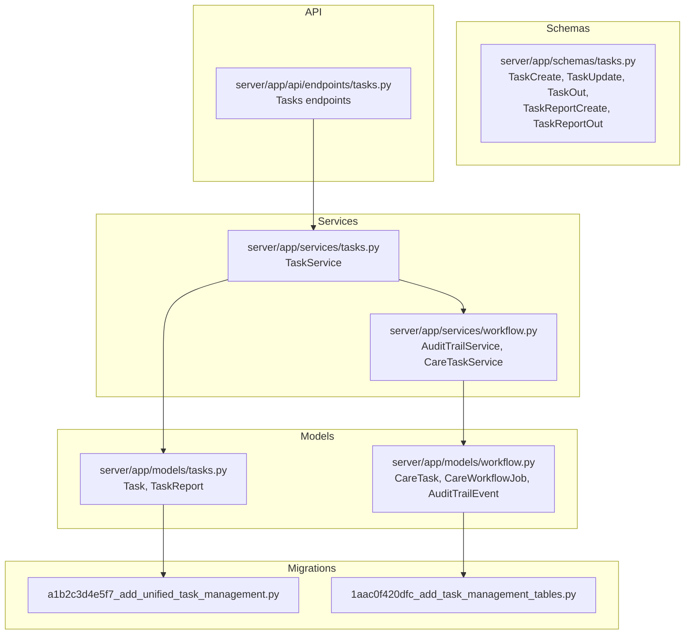
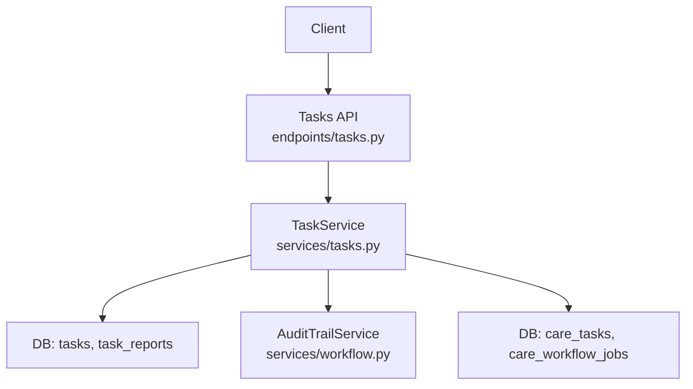
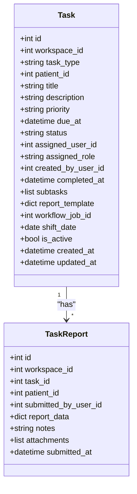
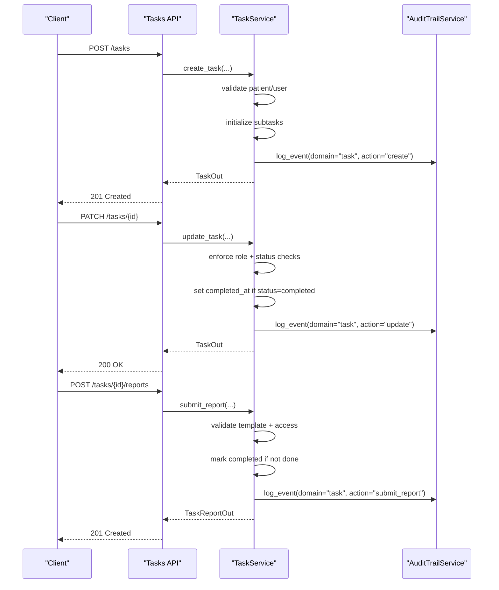
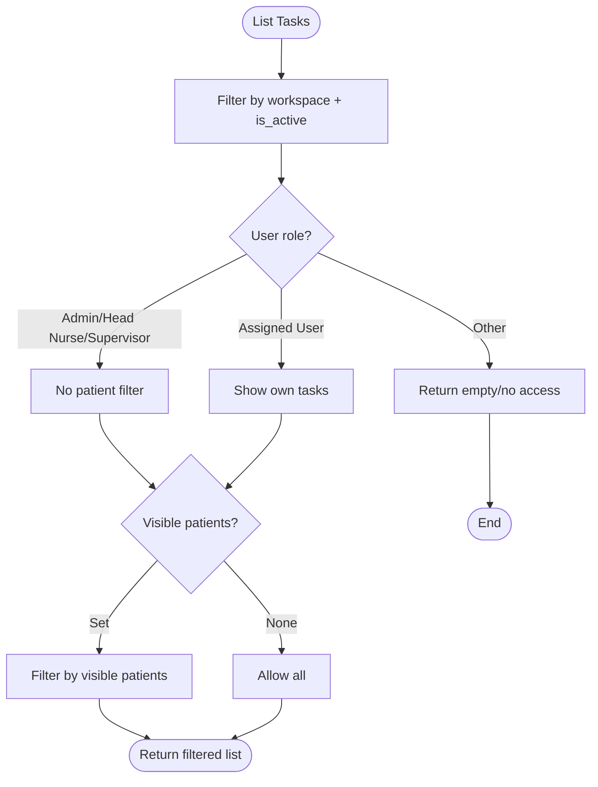
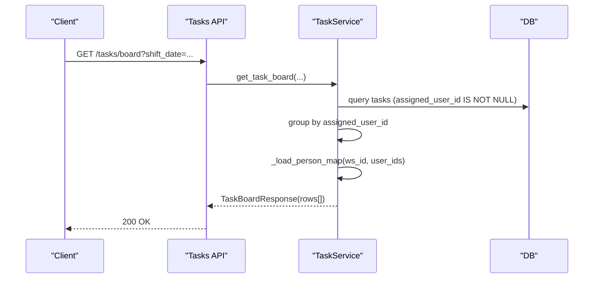
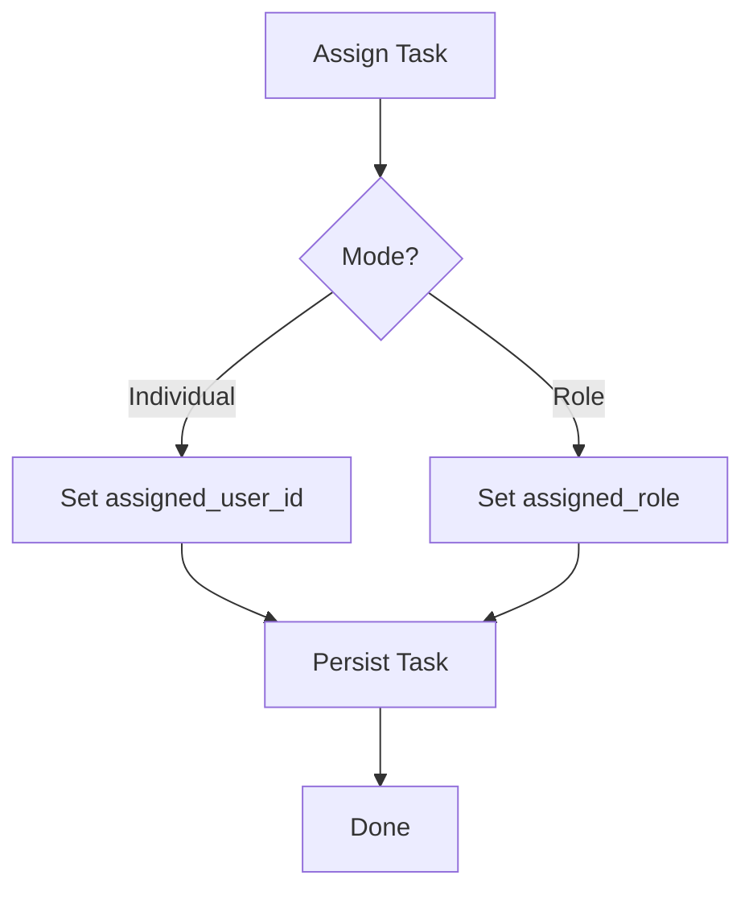
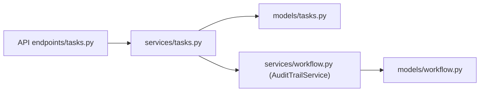

# Task Management

<cite>
**Referenced Files in This Document**
- [tasks.py](file://server/app/models/tasks.py)
- [tasks.py](file://server/app/schemas/tasks.py)
- [tasks.py](file://server/app/services/tasks.py)
- [tasks.py](file://server/app/api/endpoints/tasks.py)
- [workflow.py](file://server/app/models/workflow.py)
- [workflow.py](file://server/app/services/workflow.py)
- [1aac0f420dfc_add_task_management_tables.py](file://server/alembic/versions/1aac0f420dfc_add_task_management_tables.py)
- [a1b2c3d4e5f7_add_unified_task_management.py](file://server/alembic/versions/a1b2c3d4e5f7_add_unified_task_management.py)
</cite>

## Table of Contents
1. [Introduction](#introduction)
2. [Project Structure](#project-structure)
3. [Core Components](#core-components)
4. [Architecture Overview](#architecture-overview)
5. [Detailed Component Analysis](#detailed-component-analysis)
6. [Dependency Analysis](#dependency-analysis)
7. [Performance Considerations](#performance-considerations)
8. [Troubleshooting Guide](#troubleshooting-guide)
9. [Conclusion](#conclusion)

## Introduction
This document describes the unified task management system in the WheelSense Platform. It covers the CareTask model, CRUD operations, lifecycle management, visibility and filtering rules, priority and due date handling, completion tracking, assignment logic (role-based vs individual), reporting and audit trails, and integration with workflow jobs and shift checklists. Practical examples illustrate creation, assignment, and status updates, while diagrams clarify data models and flows.

## Project Structure
The task management domain spans models, schemas, services, and API endpoints, with migrations establishing the database schema. The CareTask model resides in the workflow domain, while the unified Tasks model and TaskReports reside in the task management domain. Both systems integrate via workflow jobs and audit trails.

**Diagram sources**
- [tasks.py:22-123](file://server/app/models/tasks.py#L22-L123)
- [workflow.py:41-197](file://server/app/models/workflow.py#L41-L197)
- [tasks.py:44-150](file://server/app/schemas/tasks.py#L44-L150)
- [tasks.py:44-690](file://server/app/services/tasks.py#L44-L690)
- [workflow.py:364-423](file://server/app/services/workflow.py#L364-L423)
- [tasks.py:1-265](file://server/app/api/endpoints/tasks.py#L1-L265)
- [a1b2c3d4e5f7_add_unified_task_management.py:23-102](file://server/alembic/versions/a1b2c3d4e5f7_add_unified_task_management.py#L23-L102)
- [1aac0f420dfc_add_task_management_tables.py:21-135](file://server/alembic/versions/1aac0f420dfc_add_task_management_tables.py#L21-L135)

**Section sources**
- [tasks.py:22-123](file://server/app/models/tasks.py#L22-L123)
- [workflow.py:41-197](file://server/app/models/workflow.py#L41-L197)
- [tasks.py:44-150](file://server/app/schemas/tasks.py#L44-L150)
- [tasks.py:44-690](file://server/app/services/tasks.py#L44-L690)
- [workflow.py:364-423](file://server/app/services/workflow.py#L364-L423)
- [tasks.py:1-265](file://server/app/api/endpoints/tasks.py#L1-L265)
- [a1b2c3d4e5f7_add_unified_task_management.py:23-102](file://server/alembic/versions/a1b2c3d4e5f7_add_unified_task_management.py#L23-L102)
- [1aac0f420dfc_add_task_management_tables.py:21-135](file://server/alembic/versions/1aac0f420dfc_add_task_management_tables.py#L21-L135)

## Core Components
- Unified Task Management (Tasks and Reports):
  - Task: supports both “specific” (ad-hoc, patient-linked) and “routine” (daily recurring) tasks; includes priority, due date, status, assignment (user or role), subtasks, report template, optional workflow job linkage, shift date, and soft deletion flag.
  - TaskReport: immutable structured report tied to a task with report data, notes, attachments, and submission metadata.
- Workflow Task (CareTask):
  - CareTask: legacy task model with similar fields and a unique workflow job linkage.
- Services:
  - TaskService: implements listing, retrieval, creation, updates, deletion, reporting, bulk reset, and task board aggregation with enrichment.
  - AuditTrailService: logs domain actions with patient and entity scoping.
- API:
  - Endpoints expose filtering, board aggregation, creation/update/deletion, report submission, and routine reset.

**Section sources**
- [tasks.py:22-123](file://server/app/models/tasks.py#L22-L123)
- [tasks.py:44-150](file://server/app/schemas/tasks.py#L44-L150)
- [tasks.py:44-690](file://server/app/services/tasks.py#L44-L690)
- [workflow.py:41-197](file://server/app/models/workflow.py#L41-L197)
- [workflow.py:364-423](file://server/app/services/workflow.py#L364-L423)
- [tasks.py:1-265](file://server/app/api/endpoints/tasks.py#L1-L265)

## Architecture Overview
The system enforces role-based visibility, workspace scoping, and patient visibility constraints. Creation and updates are audited. Reporting triggers automatic status completion and timeline entries. Routine tasks can be reset by authorized roles.

**Diagram sources**
- [tasks.py:1-265](file://server/app/api/endpoints/tasks.py#L1-L265)
- [tasks.py:44-690](file://server/app/services/tasks.py#L44-L690)
- [workflow.py:364-423](file://server/app/services/workflow.py#L364-L423)
- [tasks.py:22-123](file://server/app/models/tasks.py#L22-L123)
- [workflow.py:41-197](file://server/app/models/workflow.py#L41-L197)

## Detailed Component Analysis

### Unified Task Model and Schema
- Fields:
  - Identity and scope: workspace, task_type (“specific” or “routine”), patient_id, is_active.
  - Lifecycle: status (“pending”, “in_progress”, “completed”, “cancelled”, “skipped”), due_at, completed_at, created_at, updated_at.
  - Assignment: assigned_user_id, assigned_role, created_by_user_id.
  - Content: title, description, priority (“low”, “normal”, “high”, “critical”).
  - Structure: subtasks (list of items), report_template (schema), workflow_job_id, shift_date.
- Schema validation ensures:
  - TaskCreate/Update restricts enums and lengths.
  - TaskOut adds enriched fields (patient_name, assigned_user_name, created_by_user_name, report_count).
  - TaskReportCreate validates required fields against report_template.

**Diagram sources**
- [tasks.py:22-123](file://server/app/models/tasks.py#L22-L123)

**Section sources**
- [tasks.py:22-123](file://server/app/models/tasks.py#L22-L123)
- [tasks.py:44-150](file://server/app/schemas/tasks.py#L44-L150)

### Task Lifecycle and CRUD
- Creation:
  - Validates workspace-scoped patient and assigned user existence.
  - Initializes subtasks with UUIDs and sets status to “pending”.
  - Logs audit event with domain “task”, action “create”.
- Updates:
  - Only admin/head_nurse can update; prevents updates on “completed” or “cancelled”.
  - Auto-sets completed_at when transitioning to “completed”; clears on “pending/in_progress/skipped”.
  - Logs audit event with action “update”.
- Deletion:
  - Soft deletes by setting is_active=false; logs “delete”.
- Reporting:
  - Submitter must be assigned user or admin/head_nurse.
  - Validates required and allowed keys against report_template.
  - Automatically marks task as “completed” and sets completed_at if not already done.
  - Creates timeline entry for patient when applicable.
  - Logs “submit_report”.
- Bulk Reset (Routine Tasks):
  - Resets routine tasks for a given shift_date to “pending” and clears completed_at.
  - Logs “reset_routine_tasks”.

**Diagram sources**
- [tasks.py:127-216](file://server/app/api/endpoints/tasks.py#L127-L216)
- [tasks.py:123-396](file://server/app/services/tasks.py#L123-L396)
- [workflow.py:364-423](file://server/app/services/workflow.py#L364-L423)

**Section sources**
- [tasks.py:127-216](file://server/app/api/endpoints/tasks.py#L127-L216)
- [tasks.py:123-396](file://server/app/services/tasks.py#L123-L396)
- [workflow.py:364-423](file://server/app/services/workflow.py#L364-L423)

### Role-Based Visibility and Filtering
- Listing and retrieval:
  - Enforces workspace scoping and is_active=true.
  - Filters by task_type, status, patient_id, assignee_user_id, date range, shift_date.
  - Applies patient visibility constraints for non-admin roles.
- Visibility rules:
  - Admin/head_nurse/supervisor can see all tasks within scope.
  - Assigned users can see tasks assigned to themselves.
  - Access denied otherwise.

**Diagram sources**
- [tasks.py:47-101](file://server/app/services/tasks.py#L47-L101)
- [tasks.py:665-687](file://server/app/services/tasks.py#L665-L687)

**Section sources**
- [tasks.py:47-101](file://server/app/services/tasks.py#L47-L101)
- [tasks.py:665-687](file://server/app/services/tasks.py#L665-L687)

### Task Board and Enrichment
- Task board aggregates tasks by assigned user for a given shift_date, with counts per status and enriched user/person info.
- Enrichment:
  - Adds patient name, assigned user name, created by user name, and report count.
  - Loads person map via _load_person_map for user display names and roles.

**Diagram sources**
- [tasks.py:80-99](file://server/app/api/endpoints/tasks.py#L80-L99)
- [tasks.py:475-550](file://server/app/services/tasks.py#L475-L550)

**Section sources**
- [tasks.py:80-99](file://server/app/api/endpoints/tasks.py#L80-L99)
- [tasks.py:475-550](file://server/app/services/tasks.py#L475-L550)

### Assignment Logic and Handoffs
- Assignment modes:
  - Individual assignment: assigned_user_id.
  - Role-based assignment: assigned_role (fallback when no specific user).
- Claiming and handoffs (CareTask):
  - CareTaskService supports claim and handoff operations with audit logging and optional role messages.
- Task management (Tasks):
  - Assignment is part of TaskCreate/Update; enforcement occurs in validation and visibility checks.

**Diagram sources**
- [workflow.py:524-621](file://server/app/services/workflow.py#L524-L621)
- [tasks.py:123-208](file://server/app/services/tasks.py#L123-L208)

**Section sources**
- [workflow.py:524-621](file://server/app/services/workflow.py#L524-L621)
- [tasks.py:123-208](file://server/app/services/tasks.py#L123-L208)

### Priority, Due Dates, and Completion Tracking
- Priority and due_at are stored on Task; status transitions update completed_at accordingly.
- Routine tasks include shift_date for daily recurrence.

**Section sources**
- [tasks.py:45-78](file://server/app/models/tasks.py#L45-L78)
- [tasks.py:209-295](file://server/app/services/tasks.py#L209-L295)

### Audit Trails and Timeline Integration
- Audit events:
  - Logged for create/update/delete/submit_report/reset_routine_tasks.
  - Include domain, action, entity_type, entity_id, patient_id, and details.
- Timeline:
  - Submission of task reports creates an ActivityTimeline entry for the patient.

**Section sources**
- [tasks.py:187-201](file://server/app/services/tasks.py#L187-L201)
- [tasks.py:243-253](file://server/app/services/tasks.py#L243-L253)
- [tasks.py:281-291](file://server/app/services/tasks.py#L281-L291)
- [tasks.py:357-371](file://server/app/services/tasks.py#L357-L371)
- [tasks.py:457-470](file://server/app/services/tasks.py#L457-L470)
- [workflow.py:180-197](file://server/app/models/workflow.py#L180-L197)

### Integration with Workflow Jobs
- Unified Tasks:
  - Task includes workflow_job_id for backward compatibility and linking to care workflow jobs.
- Legacy CareTask:
  - CareTask has a unique workflow_job_id linking to care_workflow_jobs.
- Visibility:
  - When tasks are linked to workflow jobs, visibility depends on job visibility rules.

**Section sources**
- [tasks.py:72-75](file://server/app/models/tasks.py#L72-L75)
- [workflow.py:59-65](file://server/app/models/workflow.py#L59-L65)
- [workflow.py:784-800](file://server/app/services/workflow.py#L784-L800)

### Practical Examples
- Create a task:
  - Endpoint: POST /api/tasks
  - Required role: admin/head_nurse
  - Behavior: validates patient/user, initializes subtasks, sets status to pending, logs audit
- Update a task:
  - Endpoint: PATCH /api/tasks/{id}
  - Required role: admin/head_nurse
  - Behavior: enforces status constraints, updates completed_at when marking complete
- Submit a report:
  - Endpoint: POST /api/tasks/{id}/reports
  - Required role: assigned user or admin/head_nurse
  - Behavior: validates template, marks task complete, logs audit, creates timeline entry
- Reset routine tasks:
  - Endpoint: POST /api/tasks/routines/reset
  - Required role: admin/head_nurse
  - Behavior: resets routine tasks for a shift_date

**Section sources**
- [tasks.py:127-216](file://server/app/api/endpoints/tasks.py#L127-L216)
- [tasks.py:123-396](file://server/app/services/tasks.py#L123-L396)

## Dependency Analysis
- Models:
  - Task and TaskReport depend on base timestamps and foreign keys to workspaces, patients, and users.
  - CareTask and CareWorkflowJob define the legacy workflow domain.
- Services:
  - TaskService depends on audit trail service and person enrichment utilities.
  - AuditTrailService depends on request context for impersonation and logs structured events.
- API:
  - Endpoints depend on dependency injection for current user/workspace and visibility helpers.

**Diagram sources**
- [tasks.py:1-265](file://server/app/api/endpoints/tasks.py#L1-L265)
- [tasks.py:44-690](file://server/app/services/tasks.py#L44-L690)
- [tasks.py:22-123](file://server/app/models/tasks.py#L22-L123)
- [workflow.py:364-423](file://server/app/services/workflow.py#L364-L423)
- [workflow.py:41-197](file://server/app/models/workflow.py#L41-L197)

**Section sources**
- [tasks.py:1-265](file://server/app/api/endpoints/tasks.py#L1-L265)
- [tasks.py:44-690](file://server/app/services/tasks.py#L44-L690)
- [workflow.py:364-423](file://server/app/services/workflow.py#L364-L423)

## Performance Considerations
- Indexes:
  - Tasks: workspace_id, task_type, status, patient_id, assigned_user_id, shift_date, priority.
  - TaskReports: workspace_id, task_id, patient_id, submitted_by_user_id, submitted_at.
- Queries:
  - Filtering by status, patient, assignee, and shift_date leverages indexes.
  - Enrichment batches user and patient lookups to minimize round-trips.
- Recommendations:
  - Use pagination and limits on listing endpoints.
  - Prefer filtering by indexed fields (status, shift_date, assigned_user_id).
  - Avoid retrieving unnecessary enriched fields when not needed.

**Section sources**
- [tasks.py:26-32](file://server/app/models/tasks.py#L26-L32)
- [tasks.py:87-91](file://server/app/models/tasks.py#L87-L91)
- [tasks.py:552-611](file://server/app/services/tasks.py#L552-L611)

## Troubleshooting Guide
- Common errors:
  - 403 Forbidden: insufficient role (management vs executor).
  - 400 Bad Request: invalid fields, missing required report fields, unknown report fields, patient/user not in workspace.
  - 404 Not Found: task not found or access denied.
  - 409 Conflict: attempting to update a task linked to a workflow job via the legacy CareTask path.
- Audit logs:
  - Review audit_trail_events for domain “task” and actions (create, update, delete, submit_report, reset_routine_tasks) to trace operations.

**Section sources**
- [tasks.py:32-42](file://server/app/api/endpoints/tasks.py#L32-L42)
- [tasks.py:209-295](file://server/app/services/tasks.py#L209-L295)
- [tasks.py:296-396](file://server/app/services/tasks.py#L296-L396)
- [workflow.py:364-423](file://server/app/services/workflow.py#L364-L423)

## Conclusion
The WheelSense task management system provides a robust, auditable, and role-aware solution for managing both ad-hoc and routine tasks. It integrates seamlessly with workflow jobs and shift checklists, supports flexible assignment modes, and offers comprehensive visibility controls and reporting capabilities. The unified model and schema enable structured task execution and completion tracking, while audit trails and timeline integrations provide strong operational oversight.