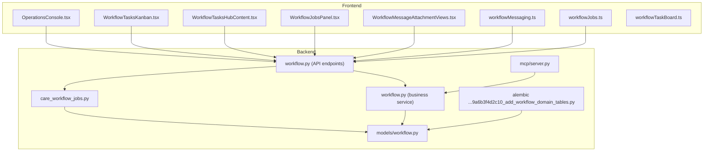
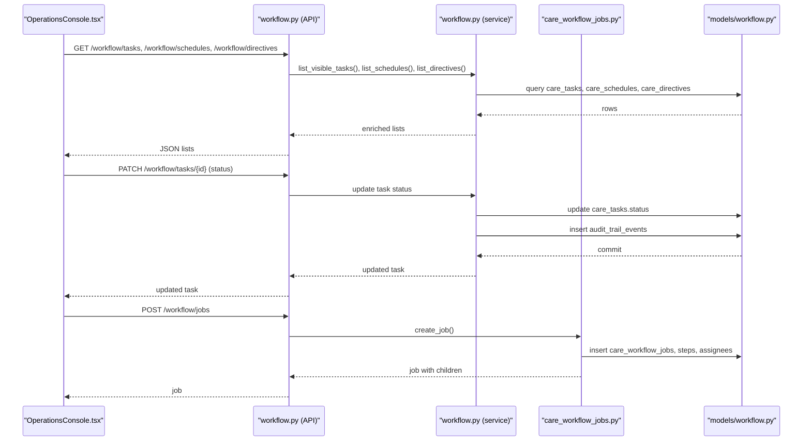
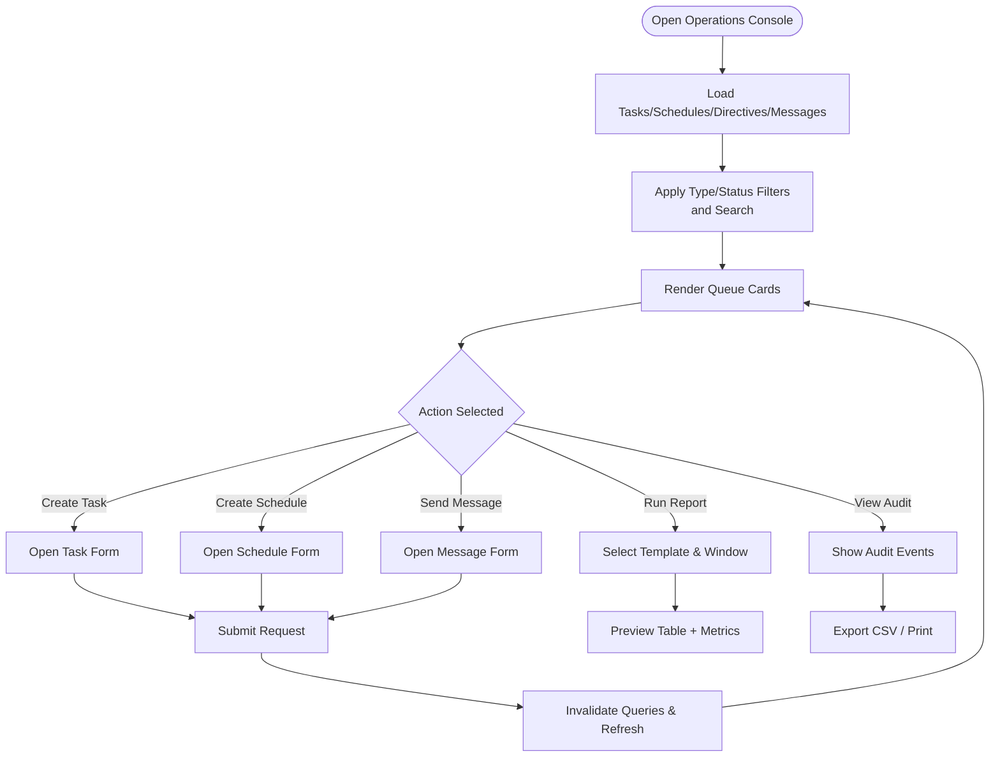
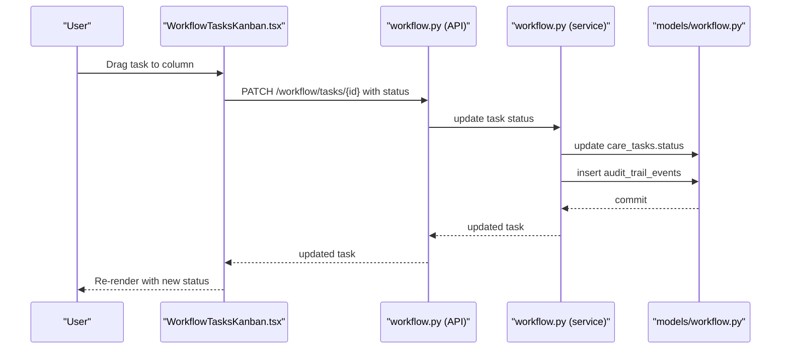
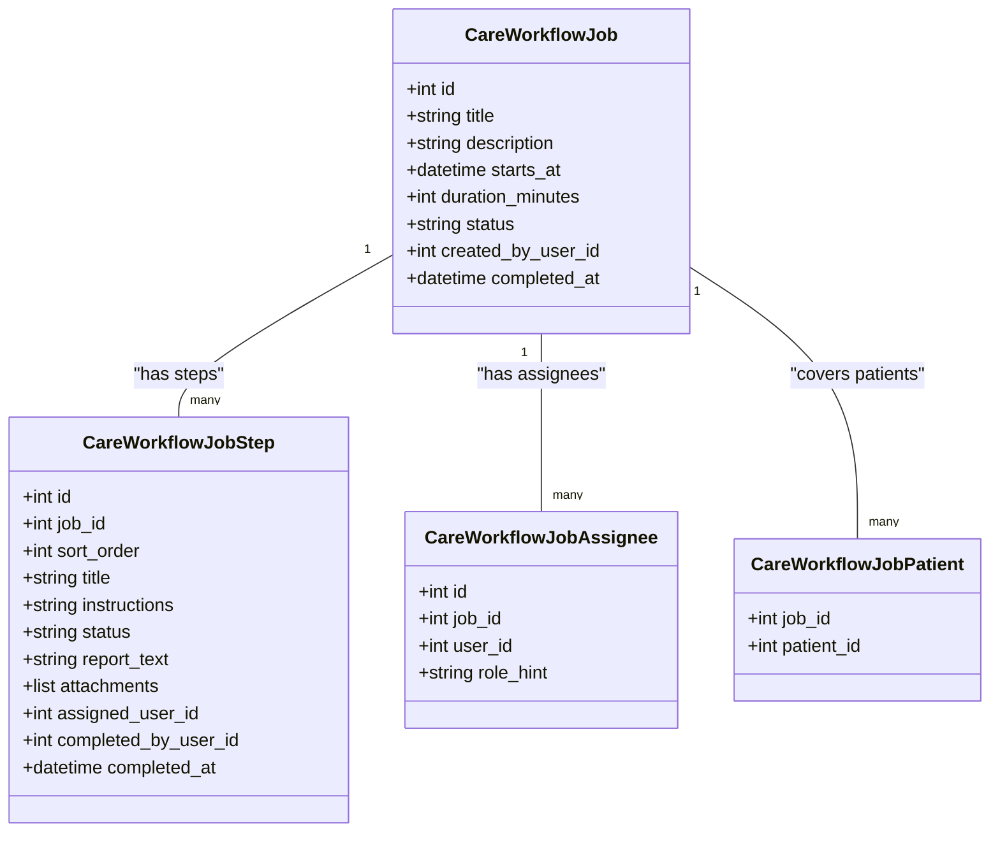
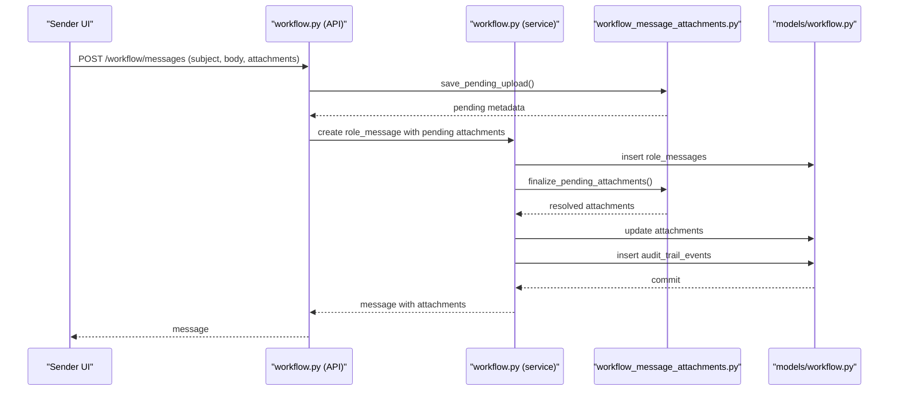
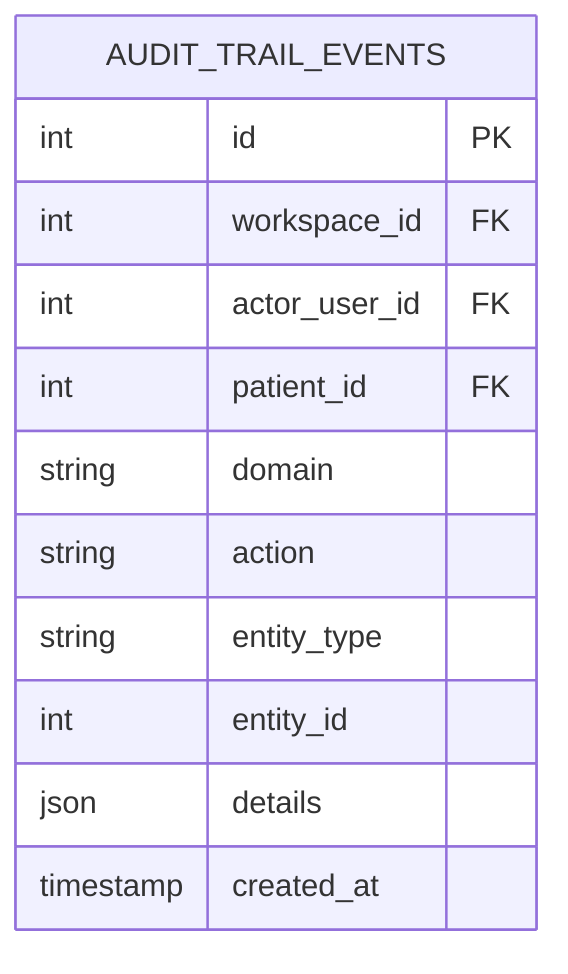
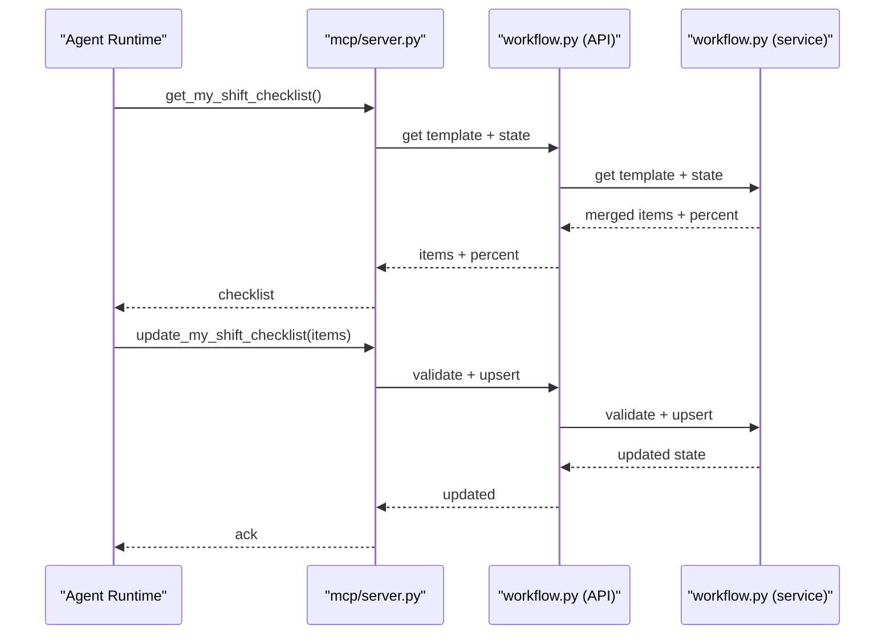
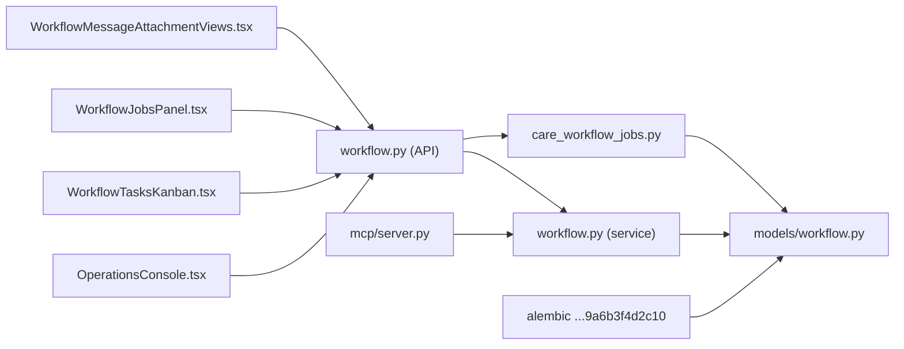

# Workflow Management

<cite>
**Referenced Files in This Document**
- [OperationsConsole.tsx](file://frontend/components/workflow/OperationsConsole.tsx)
- [WorkflowTasksKanban.tsx](file://frontend/components/workflow/WorkflowTasksKanban.tsx)
- [WorkflowTasksHubContent.tsx](file://frontend/components/workflow/WorkflowTasksHubContent.tsx)
- [WorkflowJobsPanel.tsx](file://frontend/components/workflow/WorkflowJobsPanel.tsx)
- [WorkflowMessageAttachmentViews.tsx](file://frontend/components/messaging/WorkflowMessageAttachmentViews.tsx)
- [workflowMessaging.ts](file://frontend/lib/workflowMessaging.ts)
- [workflowJobs.ts](file://frontend/lib/workflowJobs.ts)
- [workflowTaskBoard.ts](file://frontend/lib/workflowTaskBoard.ts)
- [workflow.py](file://server/app/services/workflow.py)
- [workflow.py](file://server/app/models/workflow.py)
- [workflow.py](file://server/app/api/endpoints/workflow.py)
- [care_workflow_jobs.py](file://server/app/services/care_workflow_jobs.py)
- [server.py](file://server/app/mcp/server.py)
- [9a6b3f4d2c10_add_workflow_domain_tables.py](file://server/alembic/versions/9a6b3f4d2c10_add_workflow_domain_tables.py)
- [README.md](file://frontend/README.md)
</cite>

## Table of Contents
1. [Introduction](#introduction)
2. [Project Structure](#project-structure)
3. [Core Components](#core-components)
4. [Architecture Overview](#architecture-overview)
5. [Detailed Component Analysis](#detailed-component-analysis)
6. [Dependency Analysis](#dependency-analysis)
7. [Performance Considerations](#performance-considerations)
8. [Troubleshooting Guide](#troubleshooting-guide)
9. [Conclusion](#conclusion)
10. [Appendices](#appendices)

## Introduction
This document describes the WheelSense Platform workflow management system. It covers orchestration of care tasks, schedules, directives, and messaging; the role-based messaging system with threading and attachments; audit trail and reporting; workflow job management and checklist-style job boards; operations console functionality; integration with shift checklists and care task management; templates, customization, and approvals; monitoring, metrics, and optimization; and practical examples for creating workflows, assigning tasks, and automating processes.

## Project Structure
The workflow domain spans frontend UI components, backend API endpoints, business services, and persistence models. Key areas:
- Frontend workflow surfaces: Operations Console, Kanban board, Jobs panel, messaging attachments, and shared board utilities.
- Backend workflow domain: Endpoints for tasks, schedules, directives, messages, and jobs; services implementing business logic; models for persistence; audit trail indexing; and MCP tools for agent integration.
- Integrations: Shift checklists, timeline updates on job completion, and analytics exposure.

**Diagram sources**
- [OperationsConsole.tsx:681-865](file://frontend/components/workflow/OperationsConsole.tsx#L681-L865)
- [WorkflowTasksKanban.tsx:150-200](file://frontend/components/workflow/WorkflowTasksKanban.tsx#L150-L200)
- [WorkflowTasksHubContent.tsx:318-350](file://frontend/components/workflow/WorkflowTasksHubContent.tsx#L318-L350)
- [WorkflowJobsPanel.tsx:283-307](file://frontend/components/workflow/WorkflowJobsPanel.tsx#L283-L307)
- [WorkflowMessageAttachmentViews.tsx:105-141](file://frontend/components/messaging/WorkflowMessageAttachmentViews.tsx#L105-L141)
- [workflowMessaging.ts:1-21](file://frontend/lib/workflowMessaging.ts#L1-L21)
- [workflowJobs.ts:1-11](file://frontend/lib/workflowJobs.ts#L1-L11)
- [workflowTaskBoard.ts:1-47](file://frontend/lib/workflowTaskBoard.ts#L1-L47)
- [workflow.py:1-200](file://server/app/api/endpoints/workflow.py#L1-L200)
- [workflow.py:1-200](file://server/app/services/workflow.py#L1-L200)
- [care_workflow_jobs.py:1-200](file://server/app/services/care_workflow_jobs.py#L1-L200)
- [workflow.py:1-197](file://server/app/models/workflow.py#L1-L197)
- [server.py:1159-1197](file://server/app/mcp/server.py#L1159-L1197)
- [9a6b3f4d2c10_add_workflow_domain_tables.py:180-200](file://server/alembic/versions/9a6b3f4d2c10_add_workflow_domain_tables.py#L180-L200)

**Section sources**
- [README.md:56-73](file://frontend/README.md#L56-L73)

## Core Components
- Operations Console: Multi-tab workspace for queue, transfer, coordination, audit, and reports; aggregates tasks, schedules, directives, and messages; supports filtering, search, and report generation.
- Kanban Board: Drag-and-drop task board with three columns aligned to task status; integrates with API to update task status.
- Workflow Jobs Panel: Checklist-style job management with steps, attachments, assignees, and completion; integrates with timeline on completion.
- Messaging: Role-based messages with threading, read receipts, and attachments; supports secure downloads and deletion rules.
- Audit Trail: Indexed events by domain/action/entity with enriched details; used for compliance and reporting.
- Shift Checklists: Personal daily checklists integrated with MCP tools and UI; complements workflow tasks.
- MCP Tools: Agent runtime tools for workspace analytics and shift checklist retrieval/updates.

**Section sources**
- [OperationsConsole.tsx:681-865](file://frontend/components/workflow/OperationsConsole.tsx#L681-L865)
- [WorkflowTasksKanban.tsx:150-200](file://frontend/components/workflow/WorkflowTasksKanban.tsx#L150-L200)
- [WorkflowJobsPanel.tsx:283-307](file://frontend/components/workflow/WorkflowJobsPanel.tsx#L283-L307)
- [WorkflowMessageAttachmentViews.tsx:105-141](file://frontend/components/messaging/WorkflowMessageAttachmentViews.tsx#L105-L141)
- [workflow.py:180-196](file://server/app/models/workflow.py#L180-L196)
- [server.py:2257-2299](file://server/app/mcp/server.py#L2257-L2299)

## Architecture Overview
The workflow system is a layered architecture:
- Presentation: Next.js app router pages and components render the console, board, jobs, and messaging UIs.
- API Layer: FastAPI endpoints expose CRUD and orchestration operations for tasks, schedules, directives, messages, and jobs.
- Services: Business logic validates roles, visibility, and state transitions; logs audit trail; manages attachments.
- Persistence: SQLAlchemy models define workflow entities and audit events; migrations create indexes for efficient queries.
- Agents/MCP: Tools integrate analytics and shift checklist operations into agent workflows.

**Diagram sources**
- [workflow.py:184-200](file://server/app/api/endpoints/workflow.py#L184-L200)
- [workflow.py:1-200](file://server/app/services/workflow.py#L1-L200)
- [care_workflow_jobs.py:121-200](file://server/app/services/care_workflow_jobs.py#L121-L200)
- [workflow.py:41-122](file://server/app/models/workflow.py#L41-L122)

## Detailed Component Analysis

### Operations Console
The Operations Console is the central operational hub for workflow items:
- Tabs: Queue, Transfer, Coordination, Audit, Reports.
- Data sources: Tasks, Schedules, Directives, Messages, Handover Notes, Alerts, Vitals, Ward Summary.
- Filtering and search: By type, status, and free-text.
- Reporting: Built-in templates for ward overview, alert summary, vitals window, handover notes, and workflow audit.
- Metrics: Summary cards color-coded by severity thresholds.
- Embedded in role hubs: Under /{role}/tasks, the console is stacked below the task hub; standalone /{role}/workflow exposes full tabs.

**Diagram sources**
- [OperationsConsole.tsx:681-865](file://frontend/components/workflow/OperationsConsole.tsx#L681-L865)
- [OperationsConsole.tsx:571-621](file://frontend/components/workflow/OperationsConsole.tsx#L571-L621)

**Section sources**
- [OperationsConsole.tsx:681-865](file://frontend/components/workflow/OperationsConsole.tsx#L681-L865)
- [OperationsConsole.tsx:571-621](file://frontend/components/workflow/OperationsConsole.tsx#L571-L621)
- [README.md:63-67](file://frontend/README.md#L63-L67)

### Task Board (Kanban)
The Kanban board organizes care tasks into Pending, In Progress, Completed columns:
- Drag-and-drop: Uses drag handles; dropping onto a column triggers a PATCH to update task status.
- Status mapping: Converts task status to board column; API body uses the same status strings.
- Visibility: Observer sees only their tasks; others see all if not scoped.

**Diagram sources**
- [WorkflowTasksKanban.tsx:178-189](file://frontend/components/workflow/WorkflowTasksKanban.tsx#L178-L189)
- [workflowTaskBoard.ts:13-16](file://frontend/lib/workflowTaskBoard.ts#L13-L16)
- [workflow.py:184-200](file://server/app/api/endpoints/workflow.py#L184-L200)
- [workflow.py:1-200](file://server/app/services/workflow.py#L1-L200)
- [workflow.py:41-58](file://server/app/models/workflow.py#L41-L58)

**Section sources**
- [WorkflowTasksKanban.tsx:150-200](file://frontend/components/workflow/WorkflowTasksKanban.tsx#L150-L200)
- [workflowTaskBoard.ts:1-47](file://frontend/lib/workflowTaskBoard.ts#L1-L47)

### Workflow Jobs (Checklist)
Structured job management with steps and attachments:
- Creation: From UI, creates job with patients, assignees, and steps.
- Editing: Steps can be patched; attachments finalized via service endpoints.
- Completion: Completing a job writes timeline events on the server.
- Permissions: Visibility depends on role and patient visibility; reassignment requires staff-wide roles.

**Diagram sources**
- [workflow.py:123-178](file://server/app/models/workflow.py#L123-L178)
- [care_workflow_jobs.py:121-200](file://server/app/services/care_workflow_jobs.py#L121-L200)

**Section sources**
- [WorkflowJobsPanel.tsx:283-307](file://frontend/components/workflow/WorkflowJobsPanel.tsx#L283-L307)
- [care_workflow_jobs.py:33-87](file://server/app/services/care_workflow_jobs.py#L33-L87)

### Role-Based Messaging System
Role-based messages support threading, attachments, and workflow integration:
- Attachments: Uploads staged, then finalized; download URLs generated for same-origin cookie auth.
- Permissions: Deletion allowed for admins/head nurses and original sender/recipients.
- Enrichment: UI surfaces human-friendly labels for patients/users.

**Diagram sources**
- [workflow.py:354-390](file://server/app/api/endpoints/workflow.py#L354-L390)
- [workflow.py:989-1017](file://server/app/services/workflow.py#L989-L1017)
- [workflowMessaging.ts:1-21](file://frontend/lib/workflowMessaging.ts#L1-L21)
- [WorkflowMessageAttachmentViews.tsx:105-141](file://frontend/components/messaging/WorkflowMessageAttachmentViews.tsx#L105-L141)
- [workflow.py:67-88](file://server/app/models/workflow.py#L67-L88)

**Section sources**
- [workflow.py:354-390](file://server/app/api/endpoints/workflow.py#L354-L390)
- [workflow.py:989-1017](file://server/app/services/workflow.py#L989-L1017)
- [workflowMessaging.ts:1-21](file://frontend/lib/workflowMessaging.ts#L1-L21)
- [WorkflowMessageAttachmentViews.tsx:105-141](file://frontend/components/messaging/WorkflowMessageAttachmentViews.tsx#L105-L141)

### Audit Trail and Compliance
Audit trail records domain, action, entity, and details for compliance and reporting:
- Indexed columns: workspace, domain, created_at for fast queries.
- Logged on create/update/delete and workflow actions.
- Used by Operations Console reports to summarize recent activity across domains.

**Diagram sources**
- [workflow.py:180-196](file://server/app/models/workflow.py#L180-L196)
- [9a6b3f4d2c10_add_workflow_domain_tables.py:180-200](file://server/alembic/versions/9a6b3f4d2c10_add_workflow_domain_tables.py#L180-L200)

**Section sources**
- [workflow.py:180-196](file://server/app/models/workflow.py#L180-L196)
- [OperationsConsole.tsx:571-621](file://frontend/components/workflow/OperationsConsole.tsx#L571-L621)

### Shift Checklists and Care Task Integration
- Personal checklists: MCP tools provide get/update for user’s checklist; UI merges template and state.
- Care tasks: Tasks can be linked to schedules and jobs; the console aggregates across domains.

**Diagram sources**
- [server.py:2257-2299](file://server/app/mcp/server.py#L2257-L2299)
- [workflow.py:110-134](file://server/app/api/endpoints/workflow.py#L110-L134)
- [workflow.py:1-200](file://server/app/services/workflow.py#L1-L200)

**Section sources**
- [server.py:2257-2299](file://server/app/mcp/server.py#L2257-L2299)
- [README.md:63-67](file://frontend/README.md#L63-L67)

## Dependency Analysis
- Frontend-to-Backend: Components call API endpoints for lists, mutations, and downloads; services enforce validation and audit logging.
- Backend-to-Persistence: SQLAlchemy models define entities; migrations add indexes for audit queries.
- Agent Integration: MCP tools depend on backend services for data access.

**Diagram sources**
- [workflow.py:1-200](file://server/app/api/endpoints/workflow.py#L1-L200)
- [workflow.py:1-200](file://server/app/services/workflow.py#L1-L200)
- [care_workflow_jobs.py:1-200](file://server/app/services/care_workflow_jobs.py#L1-L200)
- [workflow.py:1-197](file://server/app/models/workflow.py#L1-L197)
- [server.py:1159-1197](file://server/app/mcp/server.py#L1159-L1197)
- [9a6b3f4d2c10_add_workflow_domain_tables.py:180-200](file://server/alembic/versions/9a6b3f4d2c10_add_workflow_domain_tables.py#L180-L200)

**Section sources**
- [workflow.py:1-200](file://server/app/api/endpoints/workflow.py#L1-L200)
- [workflow.py:1-200](file://server/app/services/workflow.py#L1-L200)
- [care_workflow_jobs.py:1-200](file://server/app/services/care_workflow_jobs.py#L1-L200)
- [workflow.py:1-197](file://server/app/models/workflow.py#L1-L197)
- [server.py:1159-1197](file://server/app/mcp/server.py#L1159-L1197)

## Performance Considerations
- Query efficiency: Audit trail indexing by workspace/domain/created_at reduces report query cost.
- Real-time UX: Console polls messages with periodic refetch; leverage caching and invalidation patterns to minimize redundant loads.
- Drag-and-drop: Debounce or batch status updates to reduce API churn.
- Attachment handling: Use pending uploads and finalize to avoid large payloads during send; enforce size limits client-side.

[No sources needed since this section provides general guidance]

## Troubleshooting Guide
- Message attachment download fails:
  - Verify user has permission to read the message and its attachments.
  - Confirm attachment IDs are properly encoded in the URL.
- Deleting a message:
  - Only allowed for admins/head nurses or the original sender/recipients.
- Task status not updating:
  - Ensure the target column maps to a valid status string and the user has permission to change it.
- Job step reassignment:
  - Requires staff-wide roles; otherwise only the assignee or workspace-wide roles can edit.

**Section sources**
- [workflow.py:368-384](file://server/app/api/endpoints/workflow.py#L368-L384)
- [workflowMessaging.ts:8-17](file://frontend/lib/workflowMessaging.ts#L8-L17)
- [workflowTaskBoard.ts:13-16](file://frontend/lib/workflowTaskBoard.ts#L13-L16)
- [care_workflow_jobs.py:33-47](file://server/app/services/care_workflow_jobs.py#L33-L47)

## Conclusion
WheelSense’s workflow management integrates role-based messaging, task orchestration, structured job checklists, and robust audit reporting into a cohesive operations console. The system balances flexibility with compliance through indexed audit trails, strict validation, and MCP-driven integrations. The Kanban board and Jobs panel streamline day-to-day care workflows, while the Operations Console provides oversight and reporting for supervisors and administrators.

[No sources needed since this section summarizes without analyzing specific files]

## Appendices

### Practical Examples

- Create a task
  - Use the Operations Console task form to set title, description, priority, due date, and assignment mode (role/person).
  - Submit; the backend validates scope and logs an audit event.
  - Reference: [OperationsConsole.tsx:681-865](file://frontend/components/workflow/OperationsConsole.tsx#L681-L865), [workflow.py:136-146](file://server/app/api/endpoints/workflow.py#L136-L146), [workflow.py:1-200](file://server/app/services/workflow.py#L1-L200)

- Assign a task to a person
  - Choose assignment mode “person” and select a user; the backend validates the user belongs to the current workspace.
  - Reference: [OperationsConsole.tsx:681-865](file://frontend/components/workflow/OperationsConsole.tsx#L681-L865), [workflow.py:136-146](file://server/app/api/endpoints/workflow.py#L136-L146)

- Move a task across Kanban columns
  - Drag a task to Pending/In Progress/Completed; the frontend calls PATCH with the new status.
  - Reference: [WorkflowTasksKanban.tsx:178-189](file://frontend/components/workflow/WorkflowTasksKanban.tsx#L178-L189), [workflowTaskBoard.ts:13-16](file://frontend/lib/workflowTaskBoard.ts#L13-L16)

- Create a workflow job (checklist)
  - Use the Jobs panel to define title, steps, instructions, and attach documents; finalize attachments after upload.
  - Reference: [WorkflowJobsPanel.tsx:283-307](file://frontend/components/workflow/WorkflowJobsPanel.tsx#L283-L307), [workflowJobs.ts:1-11](file://frontend/lib/workflowJobs.ts#L1-L11), [care_workflow_jobs.py:121-200](file://server/app/services/care_workflow_jobs.py#L121-L200)

- Send a role-based message with attachments
  - Compose subject/body; attach files; submit; download links are generated for same-origin cookie auth.
  - Reference: [WorkflowMessageAttachmentViews.tsx:105-141](file://frontend/components/messaging/WorkflowMessageAttachmentViews.tsx#L105-L141), [workflowMessaging.ts:1-21](file://frontend/lib/workflowMessaging.ts#L1-L21), [workflow.py:354-390](file://server/app/api/endpoints/workflow.py#L354-L390)

- Generate a workflow audit report
  - Select template “workflow-audit,” choose a time window and domain filter, then preview metrics and rows.
  - Reference: [OperationsConsole.tsx:571-621](file://frontend/components/workflow/OperationsConsole.tsx#L571-L621), [workflow.py:180-196](file://server/app/models/workflow.py#L180-L196)

- Integrate shift checklist with agent workflows
  - Use MCP tools to retrieve and update the user’s checklist; combine with analytics for situational awareness.
  - Reference: [server.py:2257-2299](file://server/app/mcp/server.py#L2257-L2299), [README.md:63-67](file://frontend/README.md#L63-L67)