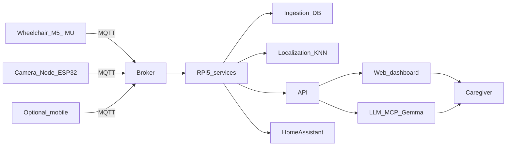

# โปสเตอร์ — ข้อความบนกระดาน (Part A)

วิทยานิพนธ์ฉบับนี้: สร้างบริบทโปสเตอร์จาก `abstract_th.tex` บท 1, 3, 4 และ `info.tex` — ตัวเลขอ้างอิง **บทคัดย่อภาษาไทย** และ **บทที่ 4 (ตาราง LLM/IRR)** เท่านั้น

---

## ชื่อผลงาน (สำเนาไปหัวกระดาน)

**บรรทัดที่ 1 (ไทย — ชื่อทางการ)**  
การพัฒนาระบบต้นแบบของสภาพแวดล้อมอัจฉริยะสำหรับผู้ใช้เก้าอี้รถเข็น

**บรรทัดที่ 2 (ชื่อต้นแบบ)**  
ต้นแบบระบบ **WheelSense** — ติดตามสถานะ ระบุตำแหน่งในอาคาร แดชบอร์ดผู้ดูแล อัตโนมัติ และการตีความแบบ local LLM ภายใต้กรอบเสนอ–ยืนยัน–ดำเนินการ

**อังกฤษ (บรรทัดย่อ ถ้าใช้)**  
*Prototyping Development of Smart Environment for Wheelchair User*

---

## กรอบท้ายมุม/หัวกระดาน (ตารางสรุป)

| รายการ | ข้อความ |
|--------|---------|
| สาขาวิชา | วิศวกรรมไฟฟ้าและคอมพิวเตอร์ |
| คณะ | คณะวิศวกรรมศาสตร์ |
| มหาวิทยาลัย | มหาวิทยาลัยธรรมศาสตร์ |
| ระดับปริญญา | วิศวกรรมศาสตรบัณฑิต (Bachelor of Engineering) |
| นักศึกษา | นายวรพล แสงสระศรี, นายศุภวิชญ์ อัศวลายทอง |
| อาจารย์ที่ปรึกษา | ผู้ช่วยศาสตราจารย์ ดร. ศุภชัย วรพจน์พิศุทธิ์ |
| ปีการศึกษา (เล่ม) | 2569 |

---

## 1. ที่มาและปัญหา (ย่อ 3–4 ข้อ)

- ผู้ใช้เก้าอี้รถเข็นในตึกยังต้องการ **ข้อมูลตำแหน่งและสถานะใกล้เวลาจริง** เพื่อลดความเสี่ยงและอำนวยอิสระ; GPS ในตึก **ไม่เหมาะ** เป็นหลักกับงานนี้
- ออโตเมชั่นในบ้านหลายระบบ **ยังไม่ผสาน** indoor localization, พฤติกรรมผู้ใช้, และ pipeline ฝั่งเฝ้า–แจ้ง–ตัดสินใจแบบ **ครบวง** ง่ายต่อการนำไปติดตั้ง
- งานระบุตำแหน่งเชิงอาคารหลายงาน **เน้นเมตริกเดี่ยว** แต่ไม่ออกแบบ **เชื่อม end-to-end** กับผู้ดูแลเก้าอี้รถเข็นและฮาร์ดแวร์ต้นทุนเหมาะสม
- งานนี้จึงรวม telemetry, การอ้างอิง **BLE/RSSI + KNN**, แอป, **Home Assistant**, และ **Gemma 4B + MCP** บน edge ภายใต้ **Profile–A** ตามวิทยานิพนธ์ (ไม่ใช่รายงานอัลกอริทึมฉากเดียว)

---

## 2. วัตถุประสงค์ (ย่อจาก 8 ข้อเป็น 4 หัว)

1. **ฝั่งเก้าอี้และข้อมูล:** ใช้ M5StickC Plus2, IMU, สแกน BLE/RSSI, Polar Verity Sense 2 ตัว — รวม telemetry และสรีรศาสตร์; กลไกส่งต่อเนื่องไปเซิร์ฟเวอร์
2. **ฝั่งอาคาร/ตำแหน่ง:** BLE beacon, RSSI fingerprinting, KNN บนเซิร์ฟเวอร์; ฝั่งเก้าอี้รวบรวม RSSI ร่วม telemetry; อ้างอิง fingerprint และ **Profile–A** สำหรับทำซ้ำ
3. **ฝั่งแอปและอัตโนมัติ:** แอป Next.js, React, Tailwind; กฎแจ้งเตือนเบื้องต้นจาก accelerometer; เชื่อม **Home Assistant**; **local LLM (Gemma 4B) ผ่าน MCP** ภายใต้ *propose–confirm–execute*
4. **การประเมิน:** ทดสอบ/สรุปเชิงต้นแบบ ครอบคลุมความถูกต้อง เสถียรภาพ และความเหมาะสมการใช้ (รายงานรายละเอียดบท 4)

---

## 3. วิธีการ / สถาปัตยกรรม WheelSense

- **ฮาร์ดแวร์ (ภาพรวม):** (1) M5StickC Plus2 บนเก้าอี้ (IMU, แบตเตอรี่, BLE scan) (2) Polar Verity Sense x2 สำหรับ HR/PPG (3) โหนดกล้อง **Node_Tsimcam** (ESP32-S3) ส่ง **ภาพนิ่ง** ทาง MQTT แบบ chunk/สำรอง HTTP (4) จัดวาง **BLE beacons** (5) ภาคกลางบน **Raspberry Pi 5, RAM 8GB**
- **แกนกลาง:** MQTT; กำหนดหัวข้อรวม `WheelSense/...` (เช่น `WheelSense/data`, `WheelSense/room/...`, `WheelSense/camera/.../photo`, ช่องแจ้งเตือนและคอนฟิก) ให้ telemetry, รูม/โซน, กล้อง, และ mobile อ้างอิงร่วมกัน
- **ฝั่ง RPi5:** บริกเกอร์, ingestion, ฐานข้อมูล, โมเดลตำแหน่ง, API, แดชบอร์ด, runtime agent + MCP, เชื่อม **Home Assistant**
- **ผู้ดูแล:** แอปเว็บหลัก; แอป **React Native + Expo** เป็นช่องทางเสริม/พกพา/โหมด walking; LLM แบบ **local (Gemma 4B)** กับ **MCP** ไม่ใช้คลาวด์ LLM อิสระ — เอกสารระบบและ **propose–confirm–execute** กำกับเส้นทางเครื่องมือ
- การวัด/รายงาน **ทุกรายการ** อ้างอิง **Profile–A** (เวอร์ชันซอฟต์/เฟิร์ม, พารามิเตอร์) ดังกำหนดในวิทยานิพนธ์

---

## 4. ผลลัพธ์เชิงต้นแบบ (ตัวเลขจากวิทยานิพนธ์)

| หัวข้อ | กล่องสรุปบนโปสเตอร์ | หมายเหตุ |
|--------|-------------------|---------|
| UX | แบบสอบถาม **Google Form** วันที่ **17 เมษายน พ.ศ. 2569**; ผู้ตอบ **n = 6**; วิเคราะห์เชิงบรรยาย/คุณภาพ ไม่อนุมานกลุ่มทั้งหมด | กลุ่มเล็ก ไม่ขยายไปกลุ่มผู้ดูแลรวม |
| LLM + MCP (Profile–A) | บันทึก log ที่ผ่านเกณฑ์ความสมบูรณ์ **30 แถว**; โมเดล **Gemma 4B (local)**; ช่วง *รับคำถาม → ข้อความตอบกลับสุดท้าย*: **p50 24,960 ms**, **p95 100,171 ms** | ช่วงที่อิง LLM/คิวมี *หางยาว*; ฝั่ง *เรียกเครื่องมือ → ได้ผล* มีลำดับ p95 ต่ำกว่ามาก เปรียบเทียบระวัง **ไม่**สับสนกับคนละช่วง |
| การเลือกเครื่องมือ (proxy) | เทียบ `gold_tool` ราย 30: **สอดคล้อง 1.00** (เครื่องมือแรกใน log) | **ไม่ใช่** Cohen’s κ; κ รอ **ผู้ให้คะแนน R=2** ครบตามแบบ ตามวิทยานิพนธ์ |
| ความทนทาน RSSI (ออฟไลน์) | อ้าง **งานคู่ Sangsasri et al. (2026)** เปรียบเทียบ KNN กับ XGBoost ภายใต้ noise บน RSSI | แยก **ชุดออฟไลน์/จำลอง** ออกจากสังเกตการณ์ E2E สตรีม |
| ภาคสนาม / ระบบรอง | รายงาน **เชิงสังเกตการณ์** และ **มีขอบเขต**; แจ้งเตือนกฎ, **HA**, มือถือ — ไม่ได้อ้างเป็นชุดเมตริกส์เดี่ยวแบบหลัก | หาก log **ยังรอสกัด** ห้าม **ดึง p50 ระบบ E2E เต็มสตรีม** มาแสดงบนกระดาน |

**ไม่อ้าง** กราฟ/ค่า **E2E** ราย path บนกระดาน ถ้าในเล่ม/aggregate ยัง **รอสกัด** จาก log

---

## 5. สรุป (1 ย่อหน้า)

ผลการพัฒนาสะท้อน **ระบบต้นแบบครบเส้นทาง** ตั้งแต่รับสัญญาณ จัดเก็บ คำนวณ/แสดงผล บูรณาการแอป—อัตโนมัติ—LLM บน edge  **ข้อจำกัดต่อไป** รวมความ **สอดคล้องเวลา/การจัดเรียง timestamp** ระหว่างโมดูล และ **ความซับซ้อนการติดตั้ง** สำหรับนำไปยังบ้าน รพ. หรือสถานดูแล

---

## 6. คำสำคัญ (จาก `latex/meta/info.tex` — ใส่บรรทัดเต็ม)

**ไทย:** สภาพแวดล้อมอัจฉริยะ, ผู้ใช้เก้าอี้รถเข็น, บลูทูธพลังงานต่ำ, ระบบระบุตำแหน่งในอาคาร, อินเทอร์เน็ตของสรรพสิ่ง

**อังกฤษ (ถ้าใส่):** Smart environment, wheelchair user, Bluetooth Low Energy, indoor positioning, Internet of Things

---

## 7. อ้างอิง (อ่านได้ สั้น; ฉบับเต็มไดโน้ต `latex/bib/refs.bib`)

- OASIS Standard. *MQTT Version 5.0* (เอกสาร OASIS). ดู https://docs.oasis-open.org/mqtt/mqtt/v5.0/mqtt-v5.0.html
- Model Context Protocol contributors. *Model Context Protocol specification* (2025–, เข้า 15 เม.ย. 2026). https://modelcontextprotocol.io
- Google DeepMind. *Gemma open models (documentation)* (เอกสาร, เข้า 15 เม.ย. 2026). https://ai.google.dev/gemma
- IEEE. *Survey on indoor fingerprint localization for BLE* (IEEE Xplore). ดู https://ieeexplore.ieee.org/document/9734528
- Sangsasri, W., Ausawalaithong, S., et al. *Comparative Performance Evaluation of BLE-Based Indoor Motion Tracking Using Machine Learning and Large Language Models* (2026, ต้นฉบับ, Thammasat) — งานคู่ **ความทนทานออฟไลน์ BLE/RSSI**
- World Health Organization. *Disability* (Fact sheet, เข้า 5 เม.ย. 2026). https://www.who.int/news-room/fact-sheets/detail/disability-and-health

*แมป BibTeX อ้างอิง: `MQTTSpec`, `ModelContextProtocol`, `GoogleGemma`, `BLE_Fingerprint_Survey_IEEE`, `Sangsasri2026BLEMotionLLM`, `WHO_Disability_Health`.*

---

## 8. ข้อความ EN สั้น (ถ้าใช้คู่หัวไทย)

WheelSense is a **reproducible, field-style prototype**: wheelchair telemetry and BLE/RSSI, **indoor room/zone** inference, caregiver web stack, **Home Assistant**, and **Gemma 4B + MCP** on a Raspberry Pi–class edge, under a frozen **Profile–A** evaluation. Reported **prototype** evidence: UX survey (complete responses **n=6** on 17 Apr **2569**); LLM/MCP **batch** logs (30 clean rows) with question→final reply **p50 24,960 ms / p95 100,171 ms**; **auto proxy** for tool pick vs. gold: **1.00** (not inter-rater **κ**); **offline** RSSI robustness cited from the **Sangsasri 2026** study—distinction from on-site **E2E** is stated in the thesis, not a productised metric pack.

---

# ภาคผนวก: ออกแบบและเอกสาร (Part B)

## นโยบายตัวเลข (หนึ่งบรรทัด)

**งบตัวเลขบนกระดาน** อิง *บทคัดย่อภาษาไทย* (`abstract_th.tex`) และ *บท 4* (`chapter4.tex`) รวม `data/analysis/thesis_ch4_aggregate.json` สอดคล้อง log LLM/IRR; **ห้ามเพิ่มสถิติ** นอกฉบับ

---

## รูปแบบ + งบอักษร (90 cm × 95 cm ตั้ง, template คณะ)

- ขอบมุม 2–3 cm นอกนั้นตาม memo bleed
- ข้อความรวมฝั่ง A **ประมาณ 500–800 คำ**; 70–80% ภาพ+ช่องวาง
- หัวข้อหลัก 48–60+ pt, เนื้อ 24–32+ pt, ตัวชื่อ 80–100+ pt ตาม template
- อักษรไม่เกิน **2 ครอบครัว**; 2–3 สี; พื้นสว่าง-ตัวอักษรมืด
- รูป/กราฟ ต้อง **≥ 300 dpi** ตามขนาดวางจริง; **ห้าม** ตัด/วางย่อหน้าเยิ่นเย้อจาก PDF เล่ม

---

## Pipeline (Mermaid — ฉบับร่าง block diagram ใน PPT/Illustrator)

*บนกระดาน: ฉลากจะสั้นเป็นภาษาไทยได้*

---

## รูป/เนื้อที่เตรียม (checklist สินทรัพย์)

| รายการ | วิธี | อ้างอิง |
|--------|------|----------|
| ฉากนักศึกษา+เก้าอี้+ฮาร์ดแวร์ | ถ่าย, ~300 dpi กว้าง 25–30 cm | โฟลเดอร์นักวิจัย / ยังไม่อิง `assets/figures` ถ้าไม่มี |
| RPi5 + บริการ | ถ่ายจริง | ระบบต้นแบบ |
| สกรีนแดชบอร์ด/แจ้งเตือน | PNG ~3000 px กว้าง | รันต้นแบบ |
| แผน block 1 แผ่น | ลอกจาก mermaid/บท 3 |  |
| ตัวเลขผล 1 ชิ้น | ตาราง 3 แถวจาก p50/p95 คำถาม→ข้อความสุดท้าย (กับ *n*) | ตรง ch4, **ห้ามเปลี่ยนเลข** |
| โลโก้ ม.ธ. / คณะ ตามฝ่าย | vector/PNG คม | คู่มือฝ่ายวิชา |

---

## Checklist ก่อนส่งร้านพิมพ์

- [ ] แคนวาส **90×95** cm, **ตั้ง**
- [ ] อ่านอักษร 1–2 m; รูปไม่แตก/แกนกราฟ **มีหน่วย**
- [ ] สมุดส่งงาน: **embed font**, สอบ **PDF สำหรับร้าน** (CMYK, bleed ถามร้าน)
- [ ] สะกด ชื่อนักศึกษา, อาจารย์, กับ `latex/meta/info.tex` **ตรงกัน**
- [ ] ฝึก 30–60 วินาที: ทำอะไร / ทำไม / ตัวเลข/กราฟ **หนึ่ง** ชิ้น

---

## งบอักษรโดยรวม (Part A)

ข้อ 1–7 ด้านบน โดยมาก **550–700 คำ**; อังกฤษสั้น 8 เป็นทางเลือก; ตาราง/อ้างอิง/ภาคผนวกนับ **แยก** กับงบ bullet กลางแผ่น

---

*End of `poster.md` (Part A: board; Part B: design appendix).*
