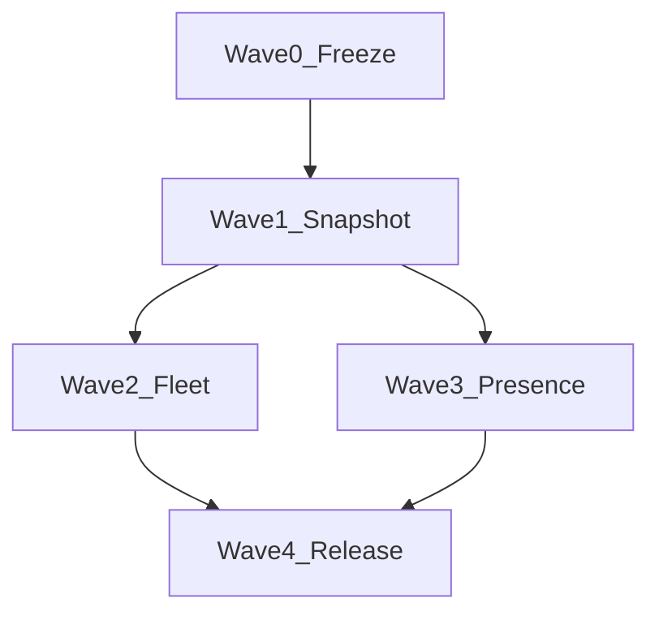

# Phase 2: Device Management — Execution Plan

> **Depends on**: Phase 1 device MVP (hardware types, `/api/devices` detail, MQTT commands, caregiver device assignments, snapshot check).
> **Canonical backend memory**: [server/AGENTS.md](../../server/AGENTS.md)
> **Workflow**: [.agents/workflows/wheelsense.md](../../.agents/workflows/wheelsense.md)

---

## 1. Scope freeze (Wave 0)

### In scope

| Area | Outcome |
|------|---------|
| **Snapshot camera (Node)** | Reliable `capture` → photo path with visible lifecycle (sent / acked / timeout / photo linked). **No live video preview** in admin or role UIs. |
| **Fleet operations** | Workspace-scoped bulk command dispatch, filters, command history drill-down, optional device lifecycle labels. |
| **Map + room + person** | Derived **presence projection** for floor monitoring: combine patient/caregiver assignments, `room_predictions`, `rooms.node_device_id`, and floorplan layout. |

### Out of scope (explicit non-goals)

- Realtime RTSP/WebRTC/MJPEG **video preview** for Node cameras in the web app.
- Full mobile device management (MDM) feature parity.
- Cross-workspace device or data access.

### Guardrails

- All protected APIs scope by `current_user.workspace_id`; never trust client `workspace_id` for mutations.
- MQTT: resolve registered `Device` first; use `device.workspace_id` for writes (see [server/AGENTS.md](../../server/AGENTS.md)).
- Business logic in **services**; endpoints thin.

### Wave 0 exit criteria

- [ ] Stakeholders sign off scope and non-goals above.
- [ ] ADR-0010 and ADR-0011 accepted (or marked proposed with open questions listed).
- [ ] This document’s API/table drafts reviewed; no open blockers for Wave 1 schema work.

---

## 2. Architecture and contracts (summary)

Detailed decisions: [docs/adr/0010-phase2-device-fleet-control-plane.md](../adr/0010-phase2-device-fleet-control-plane.md), [docs/adr/0011-phase2-map-person-presence-projection.md](../adr/0011-phase2-map-person-presence-projection.md).

### 2.1 Snapshot job lifecycle (target)

States (conceptual): `queued` → `sent` → `acked` | `timeout` | `failed` → `photo_linked` (when `photo_records` row matches `command_id` or correlation).

- **Correlation**: extend `device_command_dispatches` or add `device_snapshot_jobs` with `command_id`, `photo_record_id`, `requested_by_user_id`, timestamps.
- **MQTT**: keep `WheelSense/camera/{device_id}/control` with `command: capture`; optional ack on `WheelSense/camera/{device_id}/ack` with `command_id` (already subscribed in `mqtt_handler`).

### 2.2 Fleet API (proposed)

| Method | Path | Notes |
|--------|------|--------|
| `GET` | `/api/devices/fleet/summary` | Counts by `hardware_type`, online/stale, optional lifecycle tag. |
| `POST` | `/api/devices/fleet/commands` | Body: `{ device_ids[], channel, payload_template, idempotency_key? }`; creates N dispatch rows; returns batch id. |
| `GET` | `/api/devices/{device_id}/snapshot-jobs` | Optional; or fold into enriched `GET /api/devices/{device_id}/commands` with `kind=snapshot`. |

RBAC: `RequireRole` aligned with admin / head_nurse / supervisor policies (to be finalized per route).

### 2.3 Presence overlay API (proposed)

| Method | Path | Notes |
|--------|------|--------|
| `GET` | `/api/future/floorplans/presence` | Query: `facility_id`, `floor_id`. Returns rooms + derived occupancy: patient/caregiver/device hints, confidence, staleness, sources. |

**Source-of-truth rule**: projection is **read model**; do not overwrite `patient_device_assignments` or `room_predictions` from presence API.

### 2.4 Data model additions (draft)

| Table / change | Purpose |
|----------------|---------|
| `device_snapshot_jobs` (new) OR extend `device_command_dispatches` | Link capture commands to photos and operator. |
| `room_presence_snapshots` (new, optional) | Materialized rows per refresh, or compute on read with caching TTL. |
| `devices.lifecycle_state` (optional column) | `provisioning` / `active` / `maintenance` / `retired`. |

Use `JSON().with_variant(JSONB, "postgresql")` for JSON columns per project standard.

---

## 3. Wave-by-wave plan

### Wave 0 — Scope and contract freeze (~1 week)

| Task | Owner | Output |
|------|-------|--------|
| Lock non-goals (no live video) | Product + eng | Signed checklist in this doc |
| Review ADR-0010 / 0011 | Eng | accepted / proposed |
| Test matrix stub | QA | Section 5 below filled |

**Entry**: Phase 1 merged and deployed.
**Exit**: Wave 0 exit criteria met.

### Wave 1 — Snapshot flow hardening (~1.5 weeks)

| Task | Files / areas |
|------|----------------|
| Schema + migration for snapshot correlation | `alembic/versions/`, `app/models/core.py` |
| Service: create job on `camera/check`, link photo on ingest | `app/services/device_management.py`, `app/mqtt_handler.py` |
| API: job history or enriched commands | `app/api/endpoints/devices.py`, `app/schemas/devices.py` |
| Admin UI: job status, errors, retry | `frontend/components/admin/devices/DeviceDetailDrawer.tsx` |
| Tests | `server/tests/test_devices_mvp.py`, `test_mqtt_handler.py` |

**Exit**: p95 capture-to-photo within agreed LAN SLA; tests green; no stream UI added.

### Wave 2 — Fleet control plane (~2 weeks)

| Task | Files / areas |
|------|----------------|
| `GET /api/devices/fleet/summary` | New handler + service |
| `POST /api/devices/fleet/commands` | Batch dispatch + audit |
| Admin fleet view (filters, bulk select) | `frontend/app/admin/devices/` or sub-route |
| Docs + AGENTS API table | `server/AGENTS.md` |

**Exit**: Bulk command audited; workspace isolation tests; role policy documented.

### Wave 3 — Map–room–person integration (~2 weeks)

| Task | Files / areas |
|------|----------------|
| Presence service | `app/services/device_presence.py` (new) |
| `GET /api/future/floorplans/presence` | `app/api/endpoints/future_domains.py` |
| Monitoring UI overlay | `FloorMapWorkspace.tsx`, related hooks |
| Conflict + staleness rules | Documented in ADR-0011 |

**Exit**: Map shows derived presence with confidence/stale badges; E2E or integration test for one facility floor.

### Wave 4 — Hardening and release (~1 week)

| Task | Output |
|------|--------|
| Full `pytest` + frontend build | CI green |
| RUNBOOK: snapshot failures, broker loss | [server/docs/RUNBOOK.md](../../server/docs/RUNBOOK.md) |
| ENV placeholders if timeouts/flags added | [server/docs/ENV.md](../../server/docs/ENV.md) |
| Sign-off checklist | `.agents/changes/phase2-device-management.md` |

---

## 4. Dependencies and sequencing

- Wave 2 and Wave 3 may **partially overlap** after Wave 1 contracts are stable.
- Wave 4 starts when W2+W3 merge targets are feature-complete.

---

## 5. Test gates

| Gate | Command / check |
|------|------------------|
| Regression | `cd server && python -m pytest tests/ --ignore=scripts/ -q` |
| Device MVP | `pytest -q tests/test_devices_mvp.py` |
| MQTT | `pytest -q tests/test_mqtt_handler.py tests/test_mqtt_phase4.py` |
| Future / floor | `pytest -q tests/test_future_domains.py` |
| Frontend | `cd frontend && npm run build` |

Add targeted suites as Phase 2 code lands: `tests/test_device_fleet.py`, `tests/test_presence_projection.py` (names TBD).

---

## 6. Risks and mitigations

| Risk | Mitigation |
|------|------------|
| Assignment vs prediction conflict | Explicit precedence + staleness in ADR-0011; UI shows both sources. |
| MQTT ack / photo race | Timeouts; idempotent command_id; job state machine. |
| Scope creep (MDM) | Keep fleet to command + audit + labels; defer MDM to future phase. |
| Stream UI creep | Code review + lint rule or doc checklist: no `start_stream` in admin device UI for Phase 2. |

---

## 7. Acceptance criteria (Phase 2 program)

- [ ] Node camera: operator-visible snapshot lifecycle; latest image linked where applicable.
- [ ] Fleet: at least one bulk command path with full audit trail per workspace.
- [ ] Map: presence overlay API consumed by monitoring with stale/confidence indicators.
- [ ] No realtime video preview in Phase 2 UIs.
- [ ] Documentation: AGENTS, workflow, ADRs, this plan, change log updated.
- [ ] Quality: pytest + frontend build gates pass.

---

## 8. References

- Phase 1 plan (historical): `.cursor/plans/phase1_device_mvp_*.plan.md` (if present)
- Change log: [.agents/changes/phase2-device-management.md](../../.agents/changes/phase2-device-management.md)
